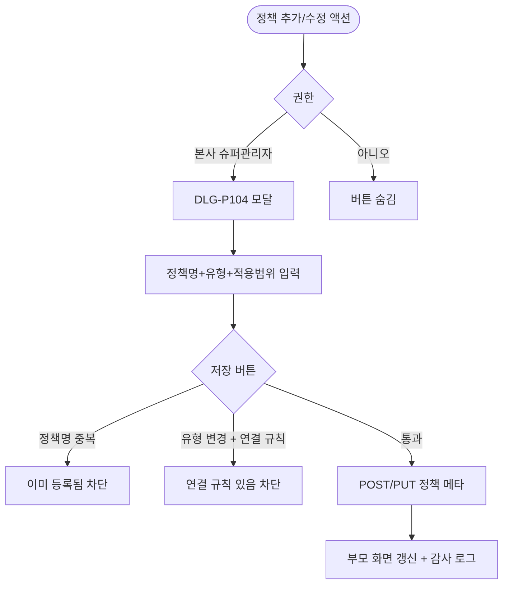

# DLG-P104 할인 정책 추가/수정 모달

## 1. 다이얼로그 메타 정보

| 항목 | 값 |
|---|---|
| 작성일 | 2026-05-22 |
| 버전 | v1.0 |
| 상태 | 최신 통합본 반영 (정합화 완료) |
| 도메인 | D05 상품관리 |
| 다이얼로그 ID | DLG-P104 할인정책추가수정 |
| 다이얼로그명 | 할인 정책 추가/수정 모달 |
| 다이얼로그 유형 | 중앙 모달 (Form Modal) |
| 우선순위 | P2 (출시 권장) |
| 기능코드 | PRD-04 |
| 계약코드 | PRD-04 |
| 호출 화면 | SCR-P004 할인설정 |
| 호출 트리거 | SCR-P004의 정책 그룹 추가/수정 액션 |

## 2. 다이얼로그 개요와 목적

할인 정책 추가/수정 모달은 할인 규칙(DLG-P101/P005)과는 별개의 정책 메타 데이터를 관리하는 보조 모달입니다. 할인 정책 그룹, 세부 카테고리, 중복 적용 우선순위 규칙, 본사·지점 할인 정합성 규칙 같은 메타 정책을 추가 또는 수정합니다.

이 모달은 본사 슈퍼관리자가 마케팅 전략 차원에서 할인 정책 체계를 정비할 때 사용되며, 각 할인 규칙(DLG-P101)이 어느 정책 그룹에 속하는지를 결정합니다. 정책 메타 변경은 모든 할인 규칙에 영향을 주므로 신중히 운영됩니다.

## 3. 호출 트리거와 진입 경로

SCR-P004 할인 설정 페이지에서 정책 그룹 추가 또는 수정 액션을 클릭하면 호출됩니다. 본사 슈퍼관리자에게만 진입 가능합니다.

## 4. 레이아웃과 UI 구성

모달은 중앙 정렬된 컨테이너이며 다음 영역들로 구성됩니다.

모달 헤더에는 "할인 정책 추가" 또는 "할인 정책 수정" 제목과 닫기(X) 버튼이 표시됩니다.

본문에는 정책 메타 입력 폼이 있습니다.

| 입력 항목 | 필수 여부 | 설명 |
|------|------|------|
| 정책명 | 필수 | 텍스트, 정책 그룹 이름 |
| 정책 유형 | 필수 | 그룹 / 세부 카테고리 / 중복 규칙 / 본사-지점 규칙 |
| 적용 범위 | 필수 | 본사 전체 / 특정 지점 / 본사 + 지점 결합 |
| 중복 우선순위 | 조건부 | 시즌가격 → 할인 → 쿠폰 → 마일리지의 순서 조정 |
| 본사·지점 정합성 | 조건부 | 본사 정의 할인의 지점 수정 허용 여부 |
| 설명 | 선택 | textarea |

가장 아래에는 "취소" 버튼과 "저장" 버튼이 배치됩니다.

## 5. 입력 검증과 저장 규칙

정책명은 동일 지점 내 중복이 차단됩니다.

정책 유형 변경은 기존 연결된 할인 규칙이 있으면 차단됩니다.

저장 시 백엔드 API로 INSERT 또는 UPDATE 처리되고 변경 이력 타임라인과 감사 로그(SCR-097)에 INSERT 됩니다.

## 6. 주요 UX 흐름

1. 본사 슈퍼관리자가 SCR-P004에서 정책 그룹 추가 또는 수정 액션 클릭
2. DLG-P104 모달 호출
3. 정책명·유형·적용 범위 등 입력
4. "저장" 클릭 → 검증 후 저장 → 모달 닫힘 + 부모 화면 갱신
5. "취소" 또는 ESC로 닫기

## 7. 화면 상태와 예외 처리

기본 표시 상태는 빈 폼(추가) 또는 채워진 폼(수정)입니다.

저장 중 상태는 저장 버튼이 로딩 상태로 전환됩니다.

저장 실패 상태는 빨강 토스트 + 입력 보존입니다.

예외 케이스별 처리는 정책명 중복 차단, 정책 유형 변경 + 연결 규칙 존재 시 차단, 권한 없음 + 직접 호출 차단입니다.

## 8. 권한별 처리

본사 슈퍼관리자(primary)와 시스템 superAdmin만 모달 진입과 저장이 가능합니다. 다른 권한자는 진입 자체가 차단됩니다.

## 9. 메인 흐름

## 10. 운영 정책 (이 다이얼로그에 연결된 부분)

본사 전용 정책은 정책 메타 관리가 본사 슈퍼관리자에 한정되어 마케팅 전략 일관성을 유지한다는 것입니다.

정책 유형 변경 차단 정책은 기존 연결된 할인 규칙이 있는 정책의 유형 변경을 차단하여 데이터 정합성을 보호합니다.

중복 우선순위 정책은 시즌가격 → 할인 → 쿠폰 → 마일리지 순서를 표준으로 하되, 정책 메타로 일부 우선순위를 조정할 수 있습니다.

본사·지점 정합성 정책은 본사 정의 할인의 지점 수정 허용 여부를 정책 메타로 제어한다는 것입니다.

감사 로그 정책은 정책 메타 변경이 SCR-097에 INSERT 된다는 것입니다.

이상의 모든 정책은 이 다이얼로그를 구현하고 운영하는 사람이 별도 문서 없이 이 한 장만 보면 이해할 수 있도록 풀어 적었습니다.
