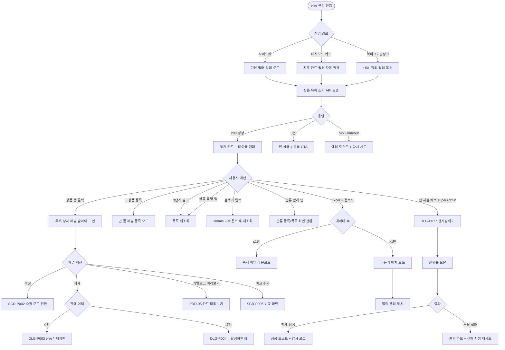

# SCR-P001 상품 관리 페이지

## 1. 화면 메타 정보

이 문서는 상품 관리 페이지에 대한 자기완결형 요구사항 정의서입니다. 다른 문서를 함께 보지 않아도 이 문서 한 장만으로 상품 관리 페이지에 들어가는 모든 영역, 모든 버튼, 모든 모달, 모든 권한, 모든 예외 처리, 그리고 이 화면을 지탱하는 운영 정책까지 전부 이해하고 구현할 수 있도록 작성합니다.

| 항목 | 값 |
|---|---|
| 작성일 | 2026-05-22 |
| 버전 | v1.0 |
| 상태 | 최신 통합본 반영 (정합화 완료) |
| 도메인 | D05 상품관리 |
| 화면 ID | SCR-P001 |
| 화면명 | 상품 관리 |
| 화면 유형 | 허브 화면 (Hub Screen) |
| 라우트 (URL) | `/products` |
| 플랫폼 | 데스크톱(기본), 태블릿, 모바일(풀스크린 카드형 진입) |
| 우선순위 | P0 (출시 필수) |
| 기능코드 | PRD-01 (상품 관리 목록 + 분류 + 전 지점 배포) |
| 계약코드 | PRD-01 |
| 계약 상태 | 계약 범위 본기능 |
| 부모 기능 prefix | PRD |
| Lv1 코드 | PRD-01 |
| Lv2 / Lv3 세분화 | PRD-01-01 ~ PRD-01-08 (통계 카드, 3단계 필터, 상품 검색, 상품 목록 테이블, 분류 관리 탭, 상품 등록 진입, 전 지점 배포, Excel 다운로드) |
| 연계 화면 | SCR-P002 상품등록수정, SCR-P003 상품상세패널, SCR-P004 할인설정, SCR-P005 상품카탈로그, SCR-P006 상품비교, SCR-P007 재고관리, SCR-P008 시즌가격관리, SCR-S003 결제처리, SCR-S004 매출통계, SCR-094 KPI 대시보드, SCR-097 감사로그 |
| 호출 다이얼로그 | DLG-P001 상품등록모달, DLG-P002 작업취소확인, DLG-P003 상품삭제확인, DLG-P004 비활성화안내, DLG-P005 상품가져오기, DLG-P007 상품이미지업로드, DLG-P008 가격이력조회, DLG-P017 전지점배포 |

## 2. 화면 개요와 목적

상품 관리 페이지는 센터에서 판매하는 모든 상품(정기 이용권, PT 수강권, GX 수강권, 골프 이용권, 락커 부가서비스, 패키지 상품, 단일 판매 상품)을 한 화면에서 파악하고 등록·수정·삭제·일괄 배포하는 상품 마스터 운영의 메인 허브 화면입니다. 상품별 현금가와 카드가, 이용 기간과 횟수, 요일·시간 제한, 옵션(홀딩·양도·포인트·키오스크 노출), 판매 채널, 누적 판매 건수까지 단일 테이블로 조회하고, 행 클릭으로 우측 슬라이드 패널을 열어 상세를 확인하며, 새로 만들 때는 같은 패널이 등록 모드로 전환됩니다. 본사 슈퍼관리자는 본사 표준 상품을 정의한 뒤 전 지점 배포 모달을 통해 200개 지점 단위의 매장에 동일 가격·정책으로 일괄 복제할 수 있습니다.

이 화면이 다루는 운영 흐름은 다층적입니다. 신규 지점을 오픈하는 Owner(지점장)은 분류 관리 탭에서 상품 그룹을 정비하고 회원권·PT·GX·락커를 한꺼번에 등록한 다음 카탈로그와 키오스크에 동시 노출시키며, 본사 슈퍼관리자는 본사 더미 지점에서 표준 상품을 정의한 후 전 지점 배포로 일괄 푸시하고 지점별 차등 가격은 배포 후 개별 수정합니다. 단종이나 시즌 종료를 처리하는 매니저는 비활성 토글로 신규 판매를 차단하면서 기존 보유 회원의 이용권은 만료까지 살려 두고, 본사 마케팅 담당자는 엑셀로 전체 가격을 받아 외부 분석 도구에 옮긴 다음 시즌 가격이나 할인 정책에 반영합니다. GX 종목을 추가하는 Owner(지점장)은 GX 6종(요가·필라테스·스피닝·줌바·에어로빅·GX 기타) 세부종목을 매출통계와 KPI 대시보드의 집계 키와 같은 기준으로 확장하고, FC는 회원 상담 중 상품 비교 화면으로 빠르게 진입해 세 상품을 나란히 보여 줍니다.

상품 마스터는 전 도메인의 단일 정본(Single Source of Truth)으로, 결제처리·매출통계·KPI 대시보드·카탈로그·회원앱·키오스크가 모두 이 데이터를 참조해 동작합니다. 따라서 이 화면은 단순한 데이터 테이블이 아니라 가격 정책, 분류 체계, 배포 정책, 권한 정책이 모두 한 자리에 모인 운영 허브로 동작해야 합니다.

## 3. 진입 경로와 인접 화면

상품 관리 페이지에 진입하는 경로는 여러 가지가 있고, 각 경로마다 진입 직후의 초기 상태가 달라집니다.

첫 번째 경로는 좌측 사이드바입니다. "상품관리 > 상품 관리" 메뉴를 클릭하면 진입하며, 이 경우 URL은 단순히 `/products`가 되고 화면은 기본 상태(상품 유형 탭: 전체, 대분류: 전체, 페이지 1, 페이지당 20건)로 시작합니다. 두 번째 경로는 대시보드의 상품 지표 카드입니다. KPI 대시보드(SCR-094)에서 "신규 등록 상품 수"나 "비활성 상품 수" 같은 카드를 누르면 해당 조건이 URL 쿼리 파라미터로 자동 적용된 상태로 열립니다. 예를 들어 비활성 상품 수 카드를 누르면 `/products?status=inactive`로 진입합니다. 세 번째 경로는 결제 화면이나 매출통계 화면에서 상품명을 클릭한 경우인데, 결제처리(SCR-S003)에서 상품의 가격 변경 이력이 필요할 때 상품명을 클릭하면 상품 관리 페이지가 그 상품 선택 상태로 열리면서 우측 상세 패널이 함께 펼쳐집니다. 네 번째 경로는 외부 도구나 북마크에서 공유받은 딥링크입니다. URL 쿼리 파라미터로 필터·검색·페이지 상태가 모두 보존되므로 매니저가 자주 쓰는 필터 조합을 북마크해 두고 같은 URL로 반복 진입할 수 있습니다.

이 화면에서 다시 빠져나가는 인접 화면은 다음과 같습니다. 상품 행을 클릭해 진입하는 상품 상세 패널(SCR-P003)이 우측에 슬라이드 인 되고, 패널 안의 수정 버튼을 누르면 상품 등록/수정 패널(SCR-P002)이 그 자리에서 폼 채워진 상태로 전환됩니다. 상단의 "+ 상품 등록" 버튼은 같은 패널을 빈 폼 등록 모드로 엽니다. 비교 화면(SCR-P006)으로는 상세 패널의 "비교 추가" 액션으로 이동하고, 할인 설정(SCR-P004)이나 시즌 가격 관리(SCR-P008)는 상단 액션 영역의 보조 링크로 진입합니다. 모든 등록·수정·삭제·배포 이벤트는 감사 로그(SCR-097)에 기록되어, 슈퍼관리자가 거기서 누가 언제 무엇을 바꿨는지 추적할 수 있습니다.

## 4. 레이아웃과 UI 구성

상품 관리 페이지는 위에서 아래로 차곡차곡 쌓이는 세로형 단일 컬럼 레이아웃을 기본으로 합니다. 데스크톱에서는 가로 폭이 충분하므로 우측 상세 패널이 슬라이드 인 될 때 본문 가로폭이 55%로 축소되고 우측 패널이 45%를 차지하는 분할 레이아웃이 만들어집니다. 태블릿에서는 본문 가로폭을 그대로 유지하면서 상세 패널이 우측 오버레이로 뜨고, 모바일에서는 상품 카드를 누르면 풀스크린으로 상세가 열립니다.

가장 위에는 페이지 헤더가 있습니다. 헤더 좌측에는 "상품 관리"라는 페이지 타이틀과 함께, 현재 조회 중인 지점이 어디인지 알려 주는 지점 컨텍스트 배지가 따라옵니다. 본사 슈퍼관리자는 전체 지점 통합 모드와 개별 지점 모드를 자유롭게 전환할 수 있는 드롭다운이 함께 표시되고, 일반 지점 사용자에게는 자기 지점 이름만 정적으로 표시됩니다. 헤더 우측에는 세 개의 액션 버튼이 있는데, "+ 상품 등록" 버튼, "Excel 다운로드" 버튼, 그리고 슈퍼관리자에게만 보이는 "전 지점 배포" 버튼입니다.

페이지 헤더 바로 아래에는 상단 통계 카드 4개가 가로로 배치됩니다. 첫 번째 카드는 "전체 상품 수"로 센터에 등록된 모든 상품의 합계를 보여줍니다. 두 번째 카드는 "활성 상품 수"로 현재 판매 중인 상품의 수, 세 번째 카드는 "비활성 상품 수"로 판매가 중지된 상품의 수, 네 번째 카드는 "카테고리 수"로 분류 그룹의 개수를 보여 줍니다. 본사 통합 모드에서는 모든 카드의 숫자가 전 지점 합산으로 표시되고, 카드 아래 작은 글씨로 "전 지점 합산"이라는 주석이 붙습니다. 각 카드는 클릭으로 해당 조건의 필터를 즉시 적용하며, 활성 상품 카드를 누르면 상태 필터가 활성으로, 비활성 상품 카드를 누르면 비활성으로 자동 전환됩니다.

통계 카드 아래에는 3단계 필터 영역이 있습니다. 1단계는 상품 대분류 탭으로 전체·회원권·수강권·락커·운동복·일반의 다섯 가지가 가로로 나란히 배치되며, 이 값은 내부적으로 `category` 컬럼의 MEMBERSHIP·LESSON_PASS·LOCKER·WEAR·GENERAL에 매핑됩니다. 2단계는 세부 유형 필터로 1단계 선택값에 따라 동적으로 표시되며, 수강권(LESSON_PASS) 선택 시 lessonType별 PT·GX·골프·기타 수강권 필터가 나타나고, GX를 선택하면 요가·필라테스·스피닝·줌바·에어로빅·GX 기타의 6종 세부종목 필터가 추가로 노출됩니다. 3단계는 상품그룹 필터로 "분류 관리" 탭에서 등록한 그룹을 선택한 대분류 안에서만 표시합니다. 우측 상단에는 상품명 검색 입력창이 있고 300ms 디바운스가 적용되어 타이핑이 끝나면 자동으로 결과가 갱신됩니다. 우측 상단에는 상품명 검색 입력창이 있고 300ms 디바운스가 적용되어 타이핑이 끝나면 자동으로 결과가 갱신됩니다.

필터 바 아래에는 상품 목록 탭과 분류 관리 탭의 전환 영역이 있습니다. 상품 목록 탭이 기본 선택이며, 분류 관리 탭을 누르면 화면 본문이 분류 등록 폼(분류명·정렬 순서·활성 여부 입력)과 분류 목록 테이블(분류명·정렬 순서·상태·수정·삭제)로 전환됩니다.

상품 목록 탭이 활성화된 상태에서는 본문에 큰 테이블이 표시됩니다. 패널이 닫혀 있을 때 표시되는 전체 컬럼은 좌측부터 상품명(유형 배지·패키지 배지·운영정책 배지 포함), 대분류, 세부종목, 이용 가능 지점, 정산 정책, 현금가, 카드가, 기간, 횟수, 요일(월·화·수·목·금·토·일 일곱 칸의 체크/엑스), 시간, 홀딩(O/X), 양도(O/X), 포인트(O/X), 판매(누적 판매 건수), 상태(사용/미사용)의 16개 컬럼입니다. 본사 통합 모드에서는 좌측에 "소속 지점" 컬럼이 추가됩니다. 우측 상세 패널이 열리면 가로폭이 좁아지므로 요일·시간·홀딩·양도·포인트·판매 컬럼은 자동으로 숨겨지고 핵심 컬럼만 남습니다.

상품명 셀에는 유형을 알려 주는 색상 배지(회원권은 파랑·수강권은 보라·락커는 주황·운동복은 회색·일반은 청록 계열)와 패키지 상품일 경우 "패키지" 배지, 그리고 운영 정책 구분 5종(단일지점·법인·홈&오피스·주말·통합) 중 하나가 함께 표시됩니다. 운영 정책 구분이 단일지점이 아닌 경우 이용 가능 지점 컬럼에 지점 수가 요약 배지로 보이고, 마우스를 올리면 전체 지점 목록이 툴팁으로 펼쳐집니다. 정산 정책 컬럼은 이용지점 기준·판매지점 기준·지정 정산지점 중 하나가 텍스트로 표시됩니다. 행 끝의 빈 영역에는 마우스 호버 시 작은 액션 아이콘이 나타나는데, 슈퍼관리자에게는 추가 메뉴(빠른 이미지 업로드·가격 이력 보기·감사 로그 점프)가 노출됩니다.

페이지 가장 아래에는 페이지네이션 영역이 있습니다. 좌측에는 페이지당 표시 건수 드롭다운(20·50·100), 가운데에는 페이지 번호 이동 컨트롤(이전·다음·페이지 번호 직접 입력), 우측에는 "총 N건"이라는 합계가 표시됩니다. 페이지당 건수와 현재 페이지 번호는 모두 URL 쿼리 파라미터로 보존됩니다.

분류 관리 탭으로 전환하면 본문이 두 영역으로 나뉩니다. 상단에는 분류 등록 폼이 있고 분류명·정렬 순서·활성 여부 입력 후 "등록" 버튼을 누르면 즉시 추가됩니다. 하단에는 분류 목록 테이블이 있고 분류명·정렬 순서·상태·수정·삭제 액션이 행 단위로 표시됩니다. 정렬 순서가 같은 분류는 등록일 오름차순으로 보조 정렬되며, 비활성 분류는 회색 톤으로 표시됩니다.

우측 상세 패널은 행을 클릭하면 슬라이드 인으로 열리고, 패널 헤더에는 상품명과 활성/비활성 배지, 닫기(X) 버튼이 있습니다. 패널 본문에는 상품 기본 정보·이용 요일/시간·옵션 현황·패키지 구성·가격 변경 이력·판매 현황이 차례로 표시되며, 하단에는 수정·삭제·카탈로그 미리보기·비교 추가 액션 버튼이 있습니다. 패널 내부의 자세한 동작은 SCR-P003 상품 상세 패널 문서에서 자기완결로 다시 정의되며, 여기서는 진입과 닫힘의 흐름만 보장합니다.

## 5. 탭 구성과 탭별 동작

이 화면은 두 단계의 탭으로 구성됩니다. 1차는 상품 목록 / 분류 관리의 보기 전환 탭이고, 2차는 상품 목록 보기 안에서의 상품 대분류 탭(전체·회원권·수강권·락커·운동복·일반)입니다.

1차 탭은 본문이 다른 화면처럼 보이도록 바꿉니다. 상품 목록 탭은 큰 테이블 + 필터 + 통계 카드 조합으로 표시되고, 분류 관리 탭은 분류 등록 폼 + 분류 목록 테이블 조합으로 표시됩니다. 두 탭은 데이터 자체가 다르므로 1차 탭을 바꿀 때는 검색어와 페이지 상태가 함께 초기화됩니다.

2차 탭(상품 유형 탭)은 상품 목록 보기 안에서 작동합니다. 전체 탭은 모든 상품을, 회원권 탭은 category=MEMBERSHIP, 수강권 탭은 category=LESSON_PASS, 락커 탭은 category=LOCKER, 운동복 탭은 category=WEAR, 일반 탭은 category=GENERAL을 표시합니다. 이 탭을 바꿔도 검색어와 다른 필터는 유지되고, 현재 페이지만 1페이지로 초기화됩니다. 2차 탭 우측에 작은 카운트 배지가 표시되어 운영자가 탭을 누르지 않고도 유형별 분포를 즉시 파악할 수 있습니다.

3단계 필터(1단계 유형·2단계 대분류·3단계 종목)는 탭과 결합해 다층 필터를 형성합니다. 예를 들어 회원권 탭 × 대분류 GX × 세부종목 요가의 조합은 헬스 회원권 중 GX 요가 분류로 등록된 상품만 표시하지만, 일반적인 GX 상품은 수강권 탭에서 보이므로 회원권 탭에서는 결과가 0건이 됩니다. 이런 조합 결과가 0건이면 "조건이 충돌합니다, 필터를 다시 확인해 주세요" 안내가 빈 상태에 함께 표시됩니다.

## 6. 버튼·아이콘·링크 액션 전체 정의

이 화면에 등장하는 모든 클릭 가능 요소를 빠짐없이 정의합니다.

상단 통계 카드 4개는 각각 클릭 가능합니다. 전체 상품 수 카드를 누르면 상태 필터가 전체로 자동 전환되고, 활성 상품 수 카드는 상태 활성, 비활성 상품 수 카드는 비활성, 카테고리 수 카드는 분류 관리 탭으로 이동합니다. 카드를 클릭하면 페이지는 1페이지로 리셋됩니다.

페이지 헤더의 "+ 상품 등록" 버튼은 우측 상세 패널을 빈 폼 등록 모드로 엽니다. 패널이 이미 다른 상품 정보로 열려 있는데 변경 사항이 있으면 DLG-P002 작업취소확인 모달이 먼저 떠서 변경 사항을 버릴지 묻습니다. 권한이 없는 계정(일반 직원·readonly)에서는 이 버튼이 아예 화면에 나타나지 않습니다.

"Excel 다운로드" 버튼은 현재 필터·검색·정렬을 그대로 적용한 전체 데이터(페이지네이션 무시)를 엑셀 파일로 내려받습니다. 다운로드는 백그라운드로 처리되어 "다운로드가 시작되었어요" 토스트가 즉시 뜨고, 데이터가 1만 건을 초과하면 비동기 배치 모드로 자동 전환되어 "준비 완료 후 알림으로 보내드릴게요" 안내가 표시되고 완료 시 알림 센터에 다운로드 링크가 푸시됩니다. 엑셀 파일명은 `상품관리_{지점명}_{필터요약}_{YYYYMMDD-HHmm}.xlsx` 규칙으로 생성되며, 본사 통합 모드에서 다운로드하면 첫 컬럼에 "소속 지점"이 추가됩니다. 권한이 없는 계정에서는 이 버튼이 보이지 않습니다.

"전 지점 배포" 버튼은 슈퍼관리자에게만 보이며 DLG-P017 전지점배포 모달을 호출합니다. 모달에서 배포할 상품과 대상 지점을 선택한 뒤 일괄 배포를 실행하고, 배포 결과는 진행률 모달 + 성공/실패 지점 분리 표시로 보고됩니다.

3단계 필터의 각 드롭다운과 탭, 검색창은 클릭/입력 시 즉시 재조회를 트리거합니다. 검색은 300ms 디바운스가 적용되어 타이핑이 끝난 후에 한 번만 API가 호출됩니다. 적용된 필터 조합은 검색 바 아래에 칩 형태로 표시되고 각 칩의 X 버튼으로 해당 필터만 제거할 수 있으며, "전체 해제" 링크는 모든 필터를 한 번에 초기화합니다.

상품 목록 테이블의 상품명 셀을 클릭하면 우측 상세 패널이 슬라이드 인 되고, 본문 가로폭이 자동으로 축소됩니다. 이미 패널이 열려 있는 상태에서 다른 행을 클릭하면 변경 사항이 없는 한 즉시 전환되고, 수정 모드로 변경 사항이 있으면 DLG-P002 작업취소확인 모달이 먼저 뜹니다. 상태 컬럼(사용/미사용)은 권한이 있는 계정에서 인라인 토글로 작동하며, 누르면 즉시 활성↔비활성 전환되면서 카탈로그·키오스크 동기화 캐시가 5분 내에 무효화됩니다. 비활성 토글은 보유 회원 보호 안내와 함께 처리됩니다.

분류 관리 탭의 분류 행 액션 아이콘은 수정과 삭제 두 가지입니다. 수정 아이콘을 누르면 인라인 편집 모드로 전환되어 분류명·정렬 순서·활성 여부를 그 자리에서 수정합니다. 삭제 아이콘을 누르면 그 분류에 연결된 상품이 있는지 확인하는 다이얼로그가 뜨고, 연결 상품이 있으면 "이 그룹에 연결된 상품 {개수}개가 있습니다"라는 안내와 함께 그룹 이동(다른 그룹 선택) 또는 취소만 가능합니다. 강제 삭제는 차단됩니다.

페이지네이션 영역의 페이지당 건수 드롭다운은 20·50·100 중 선택하면 즉시 재조회되고, 페이지 번호 이동은 이전·다음 버튼과 직접 입력 모두 지원됩니다. 1페이지에서는 이전 버튼이, 마지막 페이지에서는 다음 버튼이 비활성화됩니다.

모든 버튼은 클릭 후 응답이 돌아오기 전까지 자동으로 비활성화되어 더블클릭이나 연타로 인한 중복 요청이 차단됩니다.

## 7. 호출되는 모달 동작

이 화면에서 호출되는 모달은 여러 개이며, 모달마다 트리거·입력·확인 시 부모 화면 변화가 모두 다릅니다.

### 7-1. DLG-P001 상품등록모달 / SCR-P002 상품 등록 패널

"+ 상품 등록" 버튼을 누르면 우측 상세 패널이 빈 폼 등록 모드로 열립니다. 정확히 말하면 이 모달은 단독 다이얼로그가 아니라 SCR-P002 상품 등록/수정 화면이 우측 패널로 임베드된 형태이며, `/products/new` 직접 경로에서는 같은 폼이 단독 화면으로 표시됩니다. 등록 폼에는 상품 구분(레슨/이용/락커/판매), 상품명, 현금가, 카드가, 상품그룹, 이용 기간, 이용 횟수, GX 세부종목, 요일·시간, 주요 옵션, 활성 상태가 표시되고, 상품 구분에 따라 필요한 항목이 동적으로 보이거나 숨겨집니다. 등록 버튼을 누르면 동일 지점·동일 대분류에서 상품명 중복 검증이 이뤄지고, 중복이 없으면 Supabase `products` 테이블에 즉시 INSERT 되며 목록이 갱신되고 패널이 닫힙니다. 중복이 있으면 "이미 등록된 상품명입니다"라는 인라인 메시지가 표시되고 자동 제안(원본명 + " (2)")이 안내됩니다. 취소를 누르거나 패널 외부를 클릭하면 변경 사항이 있을 경우 DLG-P002 작업취소확인 모달이 한 번 더 뜹니다.

### 7-2. DLG-P017 전지점배포 모달

슈퍼관리자가 "전 지점 배포" 버튼을 누르면 호출됩니다. 모달 상단에는 "전 지점 배포"라는 제목이 표시되고, 상품 선택 영역에서는 다중 체크박스로 배포할 상품을 고르고, 지점 선택 영역에서는 본사가 관리하는 모든 지점(예: 200개)을 표시한 후 전체 선택 또는 개별 선택이 가능합니다. 대상 지점에 동일 상품명 + 동일 대분류 상품이 이미 존재하면 충돌 처리 옵션(덮어쓰기 / 건너뛰기 / 이름 자동 변경)을 일괄 또는 지점별로 선택합니다. 배포 실행을 누르면 진행률 모달로 전환되어 성공·실패 지점이 실시간으로 표시되고, 일부 지점이 실패하면 실패 지점만 재시도하거나 결과 리포트를 CSV로 받을 수 있습니다. 모든 배포 이벤트는 감사 로그에 `actor·source_branch·target_branches·product_count·result_summary` 형태로 기록됩니다.

### 7-3. DLG-P002 작업취소확인 모달

상품 등록/수정 패널이 변경 사항이 있는 상태에서 닫기 버튼을 누르거나 다른 행을 클릭하면 호출됩니다. 모달 상단에는 "변경 사항이 저장되지 않았어요"라는 제목과 함께 "정말 닫으시겠어요? 입력하신 내용이 모두 사라집니다"라는 안내가 표시됩니다. 확인을 누르면 패널이 변경 사항을 버리고 닫히고, 취소를 누르면 모달만 사라지고 패널은 그대로 유지됩니다. ESC 키나 배경 클릭은 취소와 동일하게 동작합니다.

### 7-4. DLG-P003 상품삭제확인 모달

상세 패널 또는 SCR-P002 수정 모드에서 삭제 버튼을 눌렀고, 그 상품의 누적 판매 이력이 0건일 때 호출됩니다. 모달 상단에는 "상품을 삭제하시겠어요?"라는 제목이 표시되고, 그 아래에 대상 상품명과 함께 "이 상품은 판매 이력이 없어 완전 삭제됩니다"라는 안내가 표시됩니다. 확인을 누르면 Supabase `products` 테이블에서 DELETE 되며, 감사 로그에 삭제 이력이 기록되고 목록이 갱신됩니다. 패키지 구성 상품으로 사용 중이면 별도 분기로 "패키지 {개수}개에서 사용 중입니다" 안내가 뜨고 패키지 분리 후에만 삭제 가능합니다.

### 7-5. DLG-P004 비활성화안내 모달

상세 패널 또는 SCR-P002 수정 모드에서 삭제 버튼을 눌렀고, 그 상품의 누적 판매 이력이 1건 이상일 때 호출됩니다. 모달 상단에는 "이용 중 회원이 있어요"라는 제목이 표시되고, 그 아래에 "현재 이용 중 회원 {인원수}명이 있어 완전 삭제는 불가능하고 미사용 상태로 전환합니다"라는 안내가 표시됩니다. 미사용 전환 확인을 누르면 상품의 `isActive`가 false로 변경되어 신규 판매는 차단되지만 기존 보유 회원의 이용권은 만료일까지 정상 사용됩니다. 카탈로그와 키오스크에서는 자동으로 제외됩니다.

### 7-6. 상세 패널 임베드 모달들

상세 패널 내부에서 호출되는 모달들(DLG-P005 상품가져오기, DLG-P007 상품이미지업로드, DLG-P008 가격이력조회)은 상세 패널의 책임 범위이므로 SCR-P003 문서에서 자기완결로 다시 정의됩니다. 이 화면의 책임은 상세 패널 진입과 모달 호출이 안전하게 일어나는 것까지입니다.

## 8. 토스트와 확인 팝업과 알럿

상품 관리 페이지에서 발생하는 모든 알림성 UI는 다음 패턴을 따릅니다.

성공 토스트는 우측 상단에 녹색 계열로 5초 동안 표시되며, "상품이 등록되었어요", "상품이 수정되었어요", "{N}건의 상품을 비활성화했어요", "엑셀 다운로드가 시작되었어요", "{N}개 지점에 배포했어요" 같은 짧은 문구로 결과를 알려 줍니다. 엑셀 비동기 다운로드의 경우 토스트는 시작만 알리고, 실제 완료는 알림 센터의 푸시로 전달됩니다.

실패 토스트는 우측 상단에 빨강 계열로 표시되며, "데이터를 불러오지 못했어요", "권한이 없어요", "다른 사용자가 동시에 편집했어요", "데이터가 너무 많아요. 필터를 좁혀주세요" 같은 문구와 함께 "다시 시도" 또는 "필터 좁히기" 같은 보조 액션 버튼이 따라옵니다. 네트워크 오류는 1회까지 자동 재시도된 다음 사용자 액션을 기다립니다.

부분 결과 알림은 전 지점 배포가 일부 실패했을 때 토스트가 아니라 진행률 모달의 결과 카드 형태로 화면 중앙에 머무릅니다. "성공 N개 지점 / 실패 M개 지점"처럼 두 가지 숫자가 동시에 표시되며, 실패 사유별 분류와 실패 리포트 CSV 다운로드 링크가 함께 제공됩니다.

확인 팝업은 별도의 다이얼로그가 아닌 단순한 yes/no 형태입니다. 패널 닫기, 분류 삭제, 상태 토글 같은 경우에 사용되며, "정말 진행하시겠어요?"를 묻고 확인/취소만 받습니다. 분류 삭제는 연결 상품 존재 여부에 따라 자동으로 다이얼로그가 분기됩니다.

알럿은 시스템 메시지에 가까운 차단형 안내로, 권한 없는 계정이 직접 URL로 접근했을 때 페이지 본문이 전부 사라지고 "이 화면에 접근할 권한이 없습니다. 3초 후 대시보드로 이동합니다"라는 메시지가 표시된 후 자동 이동합니다.

## 9. 데이터 흐름과 외부 연동

이 화면은 여러 데이터 소스와 외부 연동에 의존합니다.

화면 진입 시점에는 상품 목록 조회 API `GET /api/products`가 호출됩니다. 요청에는 현재 활성화된 상품 유형 탭, 대분류, 세부종목, 검색어, 모든 필터 값, 페이지 번호, 페이지당 건수, 정렬 기준이 모두 쿼리 파라미터로 들어갑니다. 본사 통합 모드일 때는 `branchId` 파라미터가 `all`로 전달되어 전체 지점의 상품이 합산 조회되며, 응답에 각 상품의 소속 지점 ID가 함께 내려옵니다. 응답으로는 상품 배열, 총 건수, 페이지 정보, 그리고 4개 통계 카드의 카운트가 함께 내려옵니다.

상품 등록은 `POST /api/products`, 수정은 `PUT /api/products/:id`, 삭제는 `DELETE /api/products/:id`, 비활성 전환은 `POST /api/products/:id/deactivate`로 처리됩니다. 가격이 변경되면 `price_history` 테이블에 `before_cash, after_cash, before_card, after_card, actor_id, changed_at`이 자동으로 INSERT 됩니다.

상품 그룹(분류) 관리는 `GET /api/product-groups`, `POST /api/product-groups`, `PATCH /api/product-groups/:id/order` API를 통합니다. 분류 정렬 순서는 정수로 저장되고 동일 순서는 등록일 ASC로 보조 정렬됩니다.

엑셀 내보내기는 `GET /api/products/export`로 비동기 작업 등록 후 백그라운드에서 파일을 생성합니다. 1만 건 이하면 즉시 다운로드 응답이 오고, 1만 건 초과면 작업 ID만 응답한 뒤 완료 시점에 알림 센터(NFR-19)를 통해 다운로드 링크가 푸시됩니다. 전 지점 배포는 `POST /api/products/distribute-all`로 처리되며, 응답이 비동기 작업 ID이고 진행률은 폴링 또는 WebSocket으로 수신합니다.

모든 등록·수정·삭제·비활성·배포·분류 변경은 감사 로그 시스템(SCR-097)에 비동기로 INSERT 됩니다. 기록 필드는 `actor_id`(운영자 ID), `branch_id`(지점 ID), `product_id`(상품 ID), `action`(작업 종류), `before`(변경 전 값), `after`(변경 후 값)입니다. 감사 로그 INSERT는 응답이 사용자에게 돌아간 후 5초 안에 보장됩니다.

상품 활성/비활성 토글, 가격 변경, 이미지 변경은 회원앱과 키오스크 동기화 캐시를 5분 단위로 무효화시켜 회원앱·키오스크에서 5분 안에 최신 가격이 보이도록 합니다. 즉시 동기화가 필요하면 별도 트리거를 호출할 수 있습니다.

상품 분류·세부종목이 변경되면 매출통계(SCR-S004)의 집계 키와 KPI 대시보드(SCR-094)의 GX 세부 종목 분포 차트가 자동으로 분류축을 재정렬합니다. GX 6종 세부종목은 시스템 고정값으로 매출통계의 GX종목별 탭과 동일한 키로 사용됩니다.

패키지 상품의 구성 상품 가격이 변경되면 패키지 합산 정가는 자동으로 재계산되지만, 패키지 할인가는 운영자가 명시적으로 갱신해야 합니다. 비활성 만료 회원 정리 배치는 매일 04:00에 실행되어 비활성 상품을 보유한 회원의 이용권 만료 정리를 처리합니다.

화면에서 호출하는 주요 API 엔드포인트는 다음과 같습니다. 상품 목록 조회 `GET /api/products`, 상품 등록 `POST /api/products`, 상품 수정 `PUT /api/products/:id`, 상품 삭제 `DELETE /api/products/:id`, 상품 비활성 전환 `POST /api/products/:id/deactivate`, 엑셀 비동기 `GET /api/products/export`, 전 지점 배포 `POST /api/products/distribute-all`, 분류 조회 `GET /api/product-groups`, 분류 등록 `POST /api/product-groups`, 분류 정렬 변경 `PATCH /api/product-groups/:id/order`.

## 10. 화면 상태와 예외 처리

상품 관리 페이지는 다음 상태들을 가질 수 있고, 각 상태마다 사용자에게 보이는 모습이 달라집니다.

로딩 중 상태에서는 테이블 자리에 행 모양의 스켈레톤이 표시되어 데이터를 불러오고 있음을 알려 줍니다. 통계 카드 자리에도 숫자 대신 스켈레톤이 표시되며, 헤더의 액션 버튼과 필터 바는 미리 렌더되지만 상호작용은 잠시 막힙니다.

정상 목록 상태는 200 응답과 함께 상품이 한 개 이상 존재할 때 표시되는 가장 일반적인 상태입니다. 테이블에 행이 채워지고 페이지네이션이 활성화되며, 모든 버튼이 권한에 맞게 활성/비활성으로 동작합니다.

검색 결과 없음 상태는 필터나 검색을 적용한 결과가 0건일 때 표시됩니다. 테이블 자리에 "상품이 없습니다" 또는 "조건이 충돌합니다, 필터를 다시 확인해 주세요"라는 안내와 함께 "필터 초기화" 버튼이 표시되어 한 번에 모든 필터를 풀 수 있습니다.

전체 상품 없음 상태는 어떤 필터도 적용되지 않은 상태에서 상품 자체가 0건인 경우입니다. 신규로 개업한 지점에서 흔히 보이며, "등록된 상품이 없습니다"라는 안내와 권한이 있는 사용자에게 "+ 상품 등록" CTA 버튼이 표시됩니다.

패널 열림 상태는 상품 행을 클릭하거나 등록 버튼을 누른 상태로, 본문이 55%로 축소되고 우측에 45% 폭의 패널이 슬라이드 인 됩니다. 일부 컬럼(요일·시간·홀딩·양도·포인트·판매)이 자동으로 숨겨지고 핵심 컬럼만 남습니다.

배포 진행 중 상태는 전 지점 배포 모달이 실행 중인 상태로, 본문은 일반 목록 상태이지만 상단에 진행률 표시 영역과 함께 성공·실패 지점이 실시간으로 표시됩니다.

엑셀 비동기 모드 상태는 1만 건 초과 다운로드를 요청했을 때로, 사용자에게 "준비 중입니다, 완료되면 알림으로 보내드릴게요" 토스트가 뜨고 페이지를 떠나도 백그라운드에서 작업이 계속됩니다.

오류 상태는 5xx 응답이나 네트워크 타임아웃이 발생했을 때 표시되며, 화면 중앙에 큰 에러 아이콘과 "데이터를 불러오지 못했어요" 메시지, "다시 시도" 버튼이 표시됩니다. 자동 재시도가 1회까지 백그라운드에서 일어나고, 그래도 실패하면 사용자의 액션을 기다립니다.

접근 불가 상태는 권한이 없는 계정이 직접 URL로 접근했을 때로, 페이지 본문이 가려지고 "이 화면에 접근할 권한이 없습니다"라는 메시지와 3초 카운트다운이 진행되어 대시보드로 자동 이동합니다.

예외 케이스별 처리는 다음과 같이 정의됩니다. GX 대분류인데 세부종목이 빈값인 레거시 상품은 행에 노랑 경고 배지("세부종목 미설정")가 표시되어 운영자에게 수정을 권유합니다. 상품 그룹 삭제 시도 시 연결 상품이 있으면 "이 그룹에 연결된 상품 {개수}개가 있습니다" 모달이 뜨고 그룹 이동(다른 그룹 선택) 또는 취소만 가능하며 강제 삭제는 차단됩니다. 패널 열림 상태에서 다른 행을 클릭할 때 변경 사항이 없으면 즉시 전환되지만, 수정 모드에 변경 사항이 있으면 DLG-P002 작업취소확인이 먼저 뜹니다. 검색·필터 결과 0건이면 빈 상태에 "필터 초기화" CTA가 표시되어 한 번에 모든 필터를 풀 수 있습니다. 전 지점 배포 중 일부 지점 실패가 발생하면 진행률 모달에서 성공/실패 지점이 분리 표시되고 실패 지점만 재시도하는 옵션이 제공되며, 결과는 감사 로그에 부분 성공으로 기록됩니다. 엑셀 다운로드 행이 1만 건을 초과하면 비동기 배치 모드로 자동 전환되며, 본사 슈퍼관리자가 지점 컨텍스트 미선택 상태에서 등록을 시도하면 "지점을 먼저 선택해주세요" 안내가 뜨고 지점 선택 드롭다운이 강조됩니다. 폐점 지점에서 상품 조회 시 읽기 전용 모드가 적용되고 "폐점 지점입니다, 신규 등록 불가" 배너가 표시됩니다. 분류 비활성 상태가 활성으로 전환되면 카탈로그·키오스크 노출이 즉시 재개되어 신규 결제가 가능해집니다. 상품명 검색 디바운스 중에 다른 키워드가 입력되면 이전 요청은 AbortController로 취소되고 마지막 키워드 결과만 반영됩니다. 카드가가 미입력이거나 카드가 < 현금가인 경우 노랑 경고 배지("카드가 확인 필요")가 표시되지만 진행은 가능하며, 카드가 > 현금가는 저장이 차단됩니다. VAT 정책 차이(소비자가 vs 공급가)는 지점 정책 토글에 따라 표시값이 자동 보정되고 엑셀에는 두 값 모두 컬럼으로 출력됩니다. 패널이 열린 상태에서 엑셀을 클릭하면 현재 필터 결과 전체가 다운로드되며 파일명에 필터 키워드가 포함됩니다. 동시 수정 충돌(낙관적 락 위반)이 발생하면 "다른 사용자가 동시에 편집했어요" 모달이 표시되고, 사용자는 최신 정보 보기와 덮어쓰기 중에서 선택해야 합니다.

## 11. 권한별 처리

이 화면은 권한에 따라 진입 가능 여부, 보이는 영역, 가능한 액션이 모두 달라집니다.

슈퍼관리자(superAdmin)와 본사 최고관리자(primary)는 모든 기능을 사용할 수 있습니다. 화면 진입에 제약이 없고 헤더에서 지점 전환 드롭다운이 노출되어 전체 지점(통합)과 개별 지점을 자유롭게 전환합니다. 통합 모드에서는 모든 지점의 상품이 합산 조회되고 테이블에 "소속 지점" 컬럼이 자동으로 추가됩니다. 등록·수정·삭제·비활성·이미지·패키지·전 지점 배포·엑셀 다운로드·분류 관리까지 이 화면의 모든 기능을 사용합니다. PII 마스킹 해제나 영업시간 외 강제 처리 같은 본사 모드 전용 기능에 대한 승인 권한도 갖습니다.

Owner(지점장)은 자기가 속한 지점의 상품 전체를 조회할 수 있습니다. 본사 통합 모드 토글은 표시되지 않거나 비활성화되며, 자기 지점에 한정해서 작업합니다. 등록·수정·삭제·비활성·이미지·패키지·엑셀 다운로드까지 수행할 수 있고, 본사 모드 전용 기능(전 지점 배포)은 사용할 수 없습니다.

매니저(manager)는 자기 지점의 상품 전체를 조회할 수 있고, 등록과 수정과 엑셀 다운로드는 수행할 수 있지만 삭제 권한은 없습니다. 비활성 전환은 owner 이상의 의사결정으로 처리되는 정책이 많아 매니저 화면에서는 비활성 토글이 차단되거나 owner에게 요청하는 흐름이 있습니다.

일반 직원(staff)은 상품 목록 조회와 통계 카드 확인만 가능합니다. 등록·수정·삭제·엑셀 다운로드 버튼은 모두 화면에 보이지 않고, 상세 패널에서도 수정·삭제 버튼이 숨겨집니다. FC(피트니스 코치)는 일반 직원과 비슷하게 조회 권한만 가지지만 회원 상담 중 비교 화면(SCR-P006)으로 빠르게 진입할 수 있는 액션이 추가로 노출됩니다.

읽기 전용(readonly)은 이 화면 자체에 접근할 수 없습니다. 사이드바에 메뉴가 보이지 않고, 직접 URL로 접근하면 접근 제한 화면이 표시되며 대시보드로 자동 이동됩니다.

운영 모드에 따라 일부 영역이 추가로 보이거나 숨겨집니다. 통합 운영 모드가 활성화된 경우 본사 권한자에 한해 통합 토글이 표시되고, 통합 모드에서만 소속 지점 컬럼이 노출됩니다. 락커나 운동복을 사용하지 않는 센터에서는 상품 유형 탭의 대여권·일반 탭이 숨겨질 수 있습니다.

권한이 부족해서 액션이 차단된 경우의 사용자 경험은 단계별로 일관됩니다. 첫째, 사이드바·헤더·상품 유형 탭 같은 1차 진입점에서는 메뉴 자체가 숨겨집니다. 둘째, 화면 내부의 버튼은 권한이 부족하면 아예 보이지 않거나(엑셀·등록·전 지점 배포) 비활성화 상태로 표시됩니다(상태 변경·삭제). 셋째, 직접 URL로 접근해 모달까지 도달한 경우 백엔드 응답이 403이 되어 "권한이 없어요" 토스트가 표시되고 변경이 적용되지 않습니다. 모든 권한 차단 이벤트는 감사 로그에 기록됩니다.

## 12. 메인 흐름

상품 관리 페이지의 핵심 동작 흐름을 다이어그램으로 표현합니다.



## 13. 에러와 예외 흐름

에러와 예외 상황에서의 분기를 별도 흐름으로 표현합니다.

```mermaid
flowchart TD
    A([액션 트리거]) --> B{서버 응답}
    B -->|5xx / timeout| C[자동 재시도 1회]
    C --> D{재시도 성공?}
    D -->|성공| E[정상 흐름 복귀]
    D -->|실패| F[다시 시도 버튼 + 사용자 대기]
    B -->|401 / 403 권한 부족| G["권한이 없어요" 토스트]
    G --> H[버튼 비활성 + 감사 로그]
    B -->|409 optimistic lock| I["다른 사용자가 편집했어요" 모달]
    I --> J["최신 정보 보기" 또는 "덮어쓰기"]
    B -->|상품명 중복| K["이미 등록된 상품명" 인라인]
    K --> L[자동 제안 + 저장 차단]
    B -->|GX 세부종목 미선택| M["GX 세부종목 선택" 인라인]
    M --> N[6종 드롭다운 강조]
    B -->|카드가 > 현금가| O["카드가 ≤ 현금가" 인라인]
    O --> P[저장 차단]
    B -->|분류 삭제 + 연결 상품| Q["연결 상품 N개" 모달]
    Q --> R["그룹 이동" 또는 "취소"]
    B -->|전 지점 배포 부분 실패| S[진행률 모달 + 실패 지점]
    S --> T[실패 지점만 재시도]
    B -->|엑셀 1만 건 초과| U[비동기 모드 자동 전환]
    U --> V[알림 센터 푸시]
    B -->|폐점 지점 등록 시도| W[읽기 전용 + 배너]
    B -->|본사 통합 모드 등록 시도| X["지점 먼저 선택" 안내]
    B -->|패널 닫기 + 변경 사항| Y[DLG-P002 작업취소확인]
    Y --> Z{선택}
    Z -->|확인| AA[변경 사항 버림]
    Z -->|취소| AB[패널 유지]
```

## 14. 핵심 디자인 요청사항

이 화면이 운영자에게 잘 작동하려면 다음 디자인 원칙이 시각적으로 명확히 드러나야 합니다.

상품 유형 배지는 색상과 라벨이 동시에 인식되어야 합니다. 회원권은 파랑 계열, 수강권은 보라 계열, 락커는 주황 계열, 운동복은 회색 계열, 일반은 청록 계열로 강하게 구분하여 운영자가 멀리서 봐도 색만으로 상품 유형을 짐작할 수 있어야 합니다. 색맹 운영자를 고려해 텍스트 라벨이 항상 색상과 함께 표시됩니다.

운영 정책 구분 5종(단일지점·법인·홈&오피스·주말·통합) 배지는 상품명 옆에 작은 별도 배지로 표시되며, 단일지점은 기본 색이고 법인·홈&오피스·주말·통합은 각각 다른 톤으로 구분됩니다. 운영자가 이 배지만 보고도 "이 상품은 여러 지점에서 사용 가능하구나"를 인식할 수 있어야 합니다.

상태 배지(사용/미사용)는 사용은 녹색, 미사용은 회색으로 표현하며 라벨 텍스트가 항상 함께 표시됩니다.

통계 카드 4개는 한눈에 비교가 가능하도록 동일 크기·동일 그리드로 배치되며, 카드 안의 숫자는 가장 큰 폰트로, 라벨은 그 아래 작은 글씨로 배치합니다. 카드 호버 시 약간의 그림자와 색상 변화로 클릭 가능함을 알려야 합니다.

3단계 필터는 시각적으로 단계가 명확히 드러나야 합니다. 1단계 탭은 가장 크게, 2단계 드롭다운은 중간 크기로, 3단계 종목 필터는 칩 형태로 표시되어 선택 시 강조되고 클릭으로 해제 가능합니다.

테이블 가독성이 가장 중요하므로, 행 간격은 충분히 넓게, 폰트 크기는 일반 텍스트보다 약간 크게, 컬럼 정렬은 상품명은 좌측 정렬, 숫자(가격·기간·횟수·판매 건수)는 우측 정렬, 상태·옵션(O/X) 배지는 중앙 정렬로 통일합니다. 요일(월~일 7칸)은 작은 정사각형 박스에 체크 또는 엑스로 표시되어 한눈에 이용 가능 요일을 파악할 수 있어야 합니다.

우측 상세 패널은 부드럽게 슬라이드 인 되며, 본문 가로폭이 동시에 축소되는 애니메이션이 함께 일어나야 합니다. 사용자가 패널을 닫을 때는 슬라이드 아웃과 본문 가로폭 확장이 동시에 일어납니다.

분류 관리 탭으로 전환하면 본문이 부드럽게 페이드 인 되어 다른 화면 모드로 전환되었음을 시각적으로 알려야 합니다.

모바일에서는 테이블이 카드형 리스트로 자동 전환되어, 한 카드에 상품 사진·이름·유형 배지·상태가 위에, 가격·기간·횟수가 아래에 표시되는 2단 카드 구조를 사용합니다.

전 지점 배포 진행률 모달은 큰 진행 바와 함께 성공·실패 지점 카운트가 실시간으로 업데이트되어, 운영자가 200개 지점 배포 중 어디까지 갔는지 즉시 파악할 수 있어야 합니다.

## 15. 운영 정책 (이 화면에 연결된 부분)

이 화면은 단순한 UI가 아니라 상품 운영 정책이 그대로 반영된 도구입니다. 다른 문서를 보지 않아도 이 화면을 구현·운영하는 사람이 알아야 할 정책을 모두 풀어 씁니다.

상품 분류 체계는 1단계 대분류(category)와 2단계 세부 유형(lessonType/subCategory)으로 구성된 2단계 체계가 정본입니다. 1단계 대분류는 MEMBERSHIP(회원권)·LESSON_PASS(수강권)·LOCKER(락커)·WEAR(운동복)·GENERAL(일반)의 5종이며, 2단계는 대분류에 따라 동적으로 표시됩니다. 수강권(LESSON_PASS)은 lessonType 필드로 PT·GX·골프·기타를 구분하며, GX를 선택하면 세부종목 시스템 고정 6종(요가·필라테스·스피닝·줌바·에어로빅·GX 기타)이 추가로 필수 선택됩니다. 이 6종은 상품 등록·상품 목록 필터·매출통계·KPI 대시보드의 GX 세부 종목 분포에서 같은 기준으로 사용됩니다. GX 6종은 시스템 코드 변경이 필요한 슈퍼관리자 권한이어야 추가가 가능합니다. 3단계는 분류 관리 탭에서 등록한 상품그룹(productGroupId)으로, 그룹이 지정된 상품은 그룹명을 우선 표시하고 없으면 category 한글명(회원권/수강권/락커/운동복/일반)으로 fallback합니다.

상품은 판매 단위이고 실제 사용 권한은 이용권에서 관리됩니다. 즉 상품을 등록한다고 회원에게 권리가 부여되는 것이 아니라, 결제 완료 시 그 상품에 대응하는 이용권이 생성됩니다. 패키지 상품은 결제는 1건이지만 이용권은 여러 개 생성될 수 있고, 구성 상품의 개별 이용권이 모두 부여됩니다. 전 지점 공통 상품은 본사에서 정의해 배포하고 지점 전용 상품은 지점에서만 운영합니다. 할인 정책은 상품 자체가 아니라 판매 시 적용되는 정책으로 분리되어 PRD-04 할인 설정에서 별도 관리됩니다.

운영 정책 구분 5종은 회원권 계열 상품(MEMBERSHIP)에 필수로 적용됩니다. 단일지점은 결제·이용·매출·정산을 같은 지점 기준으로 운영하고, 법인은 이용 가능 지점이 복수 허용되며 매출·정산 귀속은 계약 기준 지점으로 저장됩니다. 홈&오피스는 기본 이용지점 2개 이상 허용되며 평일·시간대 제한과 함께 운영되고, 주말은 특정 요일·시간대와 이용 가능 지점 제한을 함께 저장합니다. 통합은 이용 가능 지점 복수 허용에 결제·이용·매출·정산 귀속 필드를 계약 시점에 별도 저장합니다. 이 운영 정책 구분은 상품 마스터의 `defaultUsageBranchId`, `defaultSalesAttributionBranchId`, `defaultSettlementBranchId`, `defaultIncentivePolicy`, `allowedUsageBranchIds`로 저장되어 결제 계약의 기본값으로 사용됩니다.

상품 비활성 처리는 신규 판매 차단을 의미하지 회원 보유 이용권의 즉시 종료를 의미하지 않습니다. 비활성 토글 시 신규 판매(결제·키오스크)는 즉시 차단되지만 기존 보유 회원의 이용권은 만료일까지 정상 사용되며, 카탈로그(PRD-05)와 키오스크에서는 자동으로 제외됩니다. 이는 회원 보호와 운영 안정성을 위한 정책입니다.

상품 삭제는 보수적으로 운영됩니다. 판매 이력이 0건이면 완전 삭제가 가능하지만, 1건 이상이면 비활성 전환만 가능합니다. 패키지 구성 상품으로 사용 중이면 패키지 분리 후에만 삭제 가능하며 강제 삭제는 차단됩니다. 삭제 권한은 슈퍼관리자·Owner(지점장)·상품 편집 권한자에 한정되고, 매니저는 비활성 전환만 가능합니다.

상품그룹(분류) 삭제도 같은 보수적 원칙을 따릅니다. 그룹 삭제 시 연결된 상품이 있으면 차단되고, 그룹 비활성은 가능하지만 연결 상품의 표시명 fallback이 `category` 한글명으로 전환됩니다. 분류 정렬 순서는 정수로 입력하고 동일 정렬 순서는 등록일 ASC로 보조 정렬됩니다.

카드가 정책은 회원의 결제 수단별 우대를 위한 것입니다. 카드가 미입력 시 현금가와 동일하게 저장되고, 카드가가 현금가보다 작으면(카드 결제 우대) 노랑 경고와 함께 진행이 가능하지만, 카드가가 현금가보다 크면 저장이 차단됩니다. 결제 시 적용은 정책 우선순위(PRD-04)에 따라 결정됩니다.

패키지 상품 가격 산정은 두 가지 가격이 별도로 저장됩니다. 구성 상품 합산 정가는 구성 상품의 가격 합이고, 패키지 할인가는 운영자가 입력하는 패키지 판매가입니다. 구성 상품의 개별 가격이 변경되면 합산 정가는 자동으로 재계산되지만, 패키지 할인가는 운영자가 명시적으로 갱신해야 합니다. 자동 비례 조정은 하지 않습니다. 패키지 할인가가 합산 정가를 초과하면 저장이 차단됩니다.

상품명 정책은 1~50자, 동일 지점 + 동일 대분류에서 중복 불가입니다. 특수문자 일부 허용(괄호·쉼표·하이픈)이며 이모지는 차단됩니다. 중복 감지 시 자동 제안(원본명 + " (2)")이 안내됩니다.

전 지점 배포는 슈퍼관리자만 가능하며 배포 이력이 감사 로그에 `actor·source_branch·target_branches·product_count·result_summary`로 기록됩니다. 대상 지점에 동일 상품명 + 동일 대분류 상품이 이미 존재하면 충돌 처리(덮어쓰기·건너뛰기·이름 자동 변경)를 일괄 또는 지점별로 선택합니다. 본사 정의 상품은 전 지점 공통으로 적용되고, 지점에서 그 상품의 가격이나 정책을 수정하면 그 지점만 본사 배포 이후 차등이 발생합니다.

엑셀 내보내기는 본사 통합 모드에서는 본사 권한자만 사용할 수 있고, 일반 지점 사용자는 자기 지점에 한정해서만 다운로드할 수 있습니다. 일반 직원(staff)은 다운로드 자체가 차단됩니다. 다운로드 데이터가 1만 건을 초과하면 비동기 배치 모드로 자동 전환되어 완료 시 알림 센터로 푸시됩니다. 엑셀 컬럼은 14개 목록 컬럼 + 등록일·수정일·등록자·수정자·VAT 포함 여부 컬럼이 추가되며, 파일명 규칙은 `상품관리_{지점명}_{필터요약}_{YYYYMMDD-HHmm}.xlsx`입니다.

가격 변경은 `price_history` 테이블에 자동 기록되어 누가 언제 가격을 변경했는지 추적할 수 있습니다. 가격 변경 직후 카탈로그·키오스크·결제 화면은 5분 캐시 무효화로 동시 갱신되며, 회원앱 결제 화면에도 즉시 반영됩니다.

감사 로그는 상품 관리에서 발생하는 모든 등록·수정·삭제·비활성·배포·분류 변경을 비동기로 기록하며, 5초 안에 SCR-097 감사 로그 화면에서 조회 가능해야 합니다. 기록 필드는 `actor_id, branch_id, product_id, action, before, after`입니다.

검색 디바운스 300ms와 검색어 최대 50자 제한은 검색 부하 분산과 의미 없는 단일 글자 쿼리 차단을 위한 정책입니다. 이 정책은 상품 관리뿐 아니라 다른 화면의 검색에도 공통 적용됩니다.

이상의 모든 정책은 이 화면을 구현하고 운영하는 사람이 별도 문서 없이 이 한 장만 보면 이해할 수 있도록 풀어 적었습니다. 정책이 바뀌면 이 문서가 함께 갱신되어야 하며, 코드 변경과 정책 변경은 항상 짝지어 진행됩니다.
