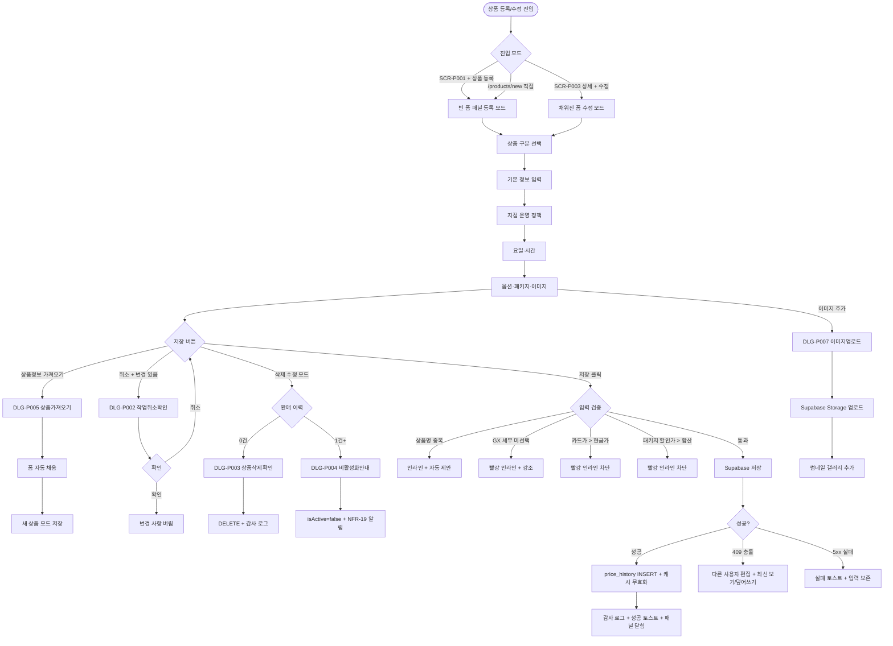
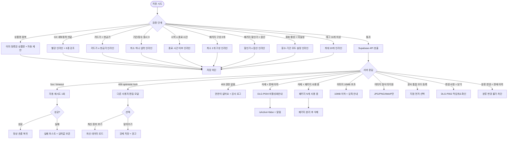

# SCR-P002 상품 등록 페이지

## 1. 화면 메타 정보

이 문서는 상품 등록 페이지에 대한 자기완결형 요구사항 정의서입니다. 다른 문서를 함께 보지 않아도 이 문서 한 장만으로 상품 등록 폼의 모든 입력, 모든 검증, 모든 모달, 모든 권한, 모든 예외 처리, 그리고 이 화면을 지탱하는 운영 정책까지 전부 이해하고 구현할 수 있도록 작성합니다.

| 항목 | 값 |
|---|---|
| 작성일 | 2026-05-22 |
| 버전 | v1.0 |
| 상태 | 최신 통합본 반영 (정합화 완료) |
| 도메인 | D05 상품관리 |
| 화면 ID | SCR-P002 |
| 화면명 | 상품 등록 |
| 화면 유형 | 모달형 패널 (Slide-In Panel) + 직접 경로 단독 화면 |
| 라우트 (URL) | `/products/new` (또는 SCR-P001 내부 패널) |
| 플랫폼 | 데스크톱(기본 패널), 태블릿(오버레이), 모바일(풀스크린) |
| 우선순위 | P0 (출시 필수) |
| 기능코드 | PRD-EXT-01 (상품 등록/수정 모달형 패널) |
| 계약코드 | PRD-EXT-01 |
| 계약 상태 | 계약 범위 본기능 |
| 부모 기능 prefix | PRD |
| Lv1 코드 | PRD-EXT-01 |
| Lv2 / Lv3 세분화 | PRD-EXT-01-01 ~ PRD-EXT-01-10 (상품 구분, 기본 정보, 지점 운영 정책, 요일·시간, 옵션 설정, 패키지 구성, 저장 처리, 가져오기, 삭제/비활성, 작업 취소, 이미지 업로드) |
| 연계 화면 | SCR-P001 상품관리, SCR-P003 상품상세패널, SCR-P005 상품카탈로그, SCR-P007 재고관리, SCR-P008 시즌가격관리, SCR-G002 GX 캘린더, SCR-T003 PT 캘린더, SCR-L001 락커 관리, SCR-097 감사로그 |
| 호출 다이얼로그 | DLG-P001 상품등록모달, DLG-P002 작업취소확인, DLG-P003 상품삭제확인, DLG-P004 비활성화안내, DLG-P005 상품가져오기, DLG-P007 상품이미지업로드 |

## 2. 화면 개요와 목적

상품 등록 페이지는 새로운 상품을 등록하는 모달형 패널입니다. SCR-P001 상품 목록에서는 우측 슬라이드 패널로 열리고, `/products/new` 직접 경로에서는 동일한 폼 레이아웃이 단독 화면으로 표시됩니다. 기존 상품 수정은 별도 URL을 사용하지 않고, 같은 폼 UI에 기존 상품 값을 채운 SCR-P003 상품 상세 패널에서 처리합니다. 상품 구분(레슨/이용/락커/판매)에 따라 필요한 입력 항목이 동적으로 표시되며, 저장 시 Supabase `products` 테이블에 즉시 반영되고, 가격 변경은 `price_history`에 자동 기록되며, 비활성·삭제 시 보유 회원 영향이 분석된 후 분기 처리됩니다.

이 화면이 다루는 운영 흐름은 다음과 같습니다. 신규 헬스 회원권 라인업을 출시하는 센터장은 이용 구분으로 1·3·6·12개월 회원권 4건을 차례로 등록하면서 카드가/현금가/VAT 정책을 일괄 입력해 카탈로그와 키오스크에 노출시키고, PT 패키지를 신규 등록하는 매니저는 레슨 시간(50분/60분), 횟수(10/20/30/50회), 유효기간(30/60/90/180일), 수업구분(개인/그룹/재활)을 입력해 결합 상품을 만듭니다. GX 정규 클래스를 추가하는 FC는 레슨 구분 + GX 6종 세부종목 + 요일·시간 + 정원을 입력하고, 락커 이용권을 신설하는 매니저는 기간형 락커와 락커 위치를 매핑합니다. 실물 상품을 등록하는 운영자는 운동복·보충제·용품을 추가하면서 재고 관리(PRD-07) 연동을 위한 매입 단가를 함께 입력합니다.

상품 정보 가져오기 기능은 기존 유사 상품의 정보를 자동으로 폼에 채워 일부만 변경한 뒤 새 상품으로 저장하는 라인업 빠른 확장 도구입니다. 가격 인상이나 인하는 수정 모드에서 가격만 변경하면 `price_history`에 자동 기록되고 결제 화면이 즉시 갱신되며, 단종 처리는 판매 이력이 있는 상품을 삭제 시도할 때 자동으로 비활성화 안내 모달로 분기되어 "이용 중 {인원수}명, 미사용 전환?" 확인을 거칩니다. 이미지 업로드는 카탈로그·회원앱 노출용 대표 이미지를 첨부하는 별도 모달(DLG-P007)을 통해 진행됩니다.

이 화면은 입력 폼이 핵심이므로 변경 사항 감지, 중복 검증, 가격 검증, GX 세부종목 필수 검증, 패키지 가격 검증 같은 인라인 검증이 매우 중요합니다.

## 3. 진입 경로와 인접 화면

이 화면에 진입하는 경로는 크게 세 가지가 있습니다.

첫 번째 경로는 SCR-P001 상품 관리에서 진입하는 우측 슬라이드 패널 모드입니다. 헤더의 "+ 상품 등록" 버튼을 누르면 빈 폼 패널이 슬라이드 인 되어 등록 모드로 열립니다. 상품 행 클릭 후 상세 패널(SCR-P003)에서 "수정" 버튼을 누를 경우에도 같은 폼 UI가 수정 상태로 열리지만, 해당 흐름은 SCR-P003 소관입니다. 두 번째 경로는 `/products/new` 직접 URL입니다. 외부 도구에서 공유받은 등록 화면 링크나 북마크로 진입할 때 사용되며, 동일한 폼이 단독 화면으로 표시됩니다.

이 화면에서 다시 빠져나가는 인접 화면으로는, 저장 완료 후 자동으로 돌아가는 SCR-P001 상품 관리 목록(패널 모드에서는 그대로 목록이 갱신되며 패널이 닫힙니다), 삭제 분기 시 호출되는 DLG-P003 상품삭제확인 또는 DLG-P004 비활성화안내 모달, 상품 정보 가져오기로 진입하는 DLG-P005 상품가져오기 모달, 이미지 업로드를 위한 DLG-P007 상품이미지업로드 모달, 그리고 작업 취소 확인용 DLG-P002 작업취소확인 모달이 있습니다. GX 상품 등록 후에는 SCR-G002 GX 캘린더에서 자동으로 노출되고, PT 상품은 SCR-T003 PT 캘린더에서 예약 가능 상품으로 등록됩니다. 락커 상품은 SCR-L001 락커 관리 화면에서 위치 매핑이 이어집니다.

## 4. 레이아웃과 UI 구성

상품 등록/수정 페이지는 우측 슬라이드 패널일 때는 화면 우측 45% 폭의 세로형 단일 컬럼 레이아웃이고, 단독 화면일 때는 중앙 정렬된 폼 컨테이너(최대 폭 약 800px)에 같은 내용이 표시됩니다. 두 모드 모두 위에서 아래로 다음 영역들이 차례로 배치됩니다.

가장 위에는 패널 헤더가 있습니다. 등록 모드에서는 "상품 등록"이라는 제목이, 수정 모드에서는 "상품 수정"이라는 제목과 함께 현재 상품의 활성/비활성 배지가 표시됩니다. 헤더 우측에는 닫기(X) 버튼이 있고, 변경 사항이 있는 상태에서 누르면 DLG-P002 작업취소확인 모달이 먼저 뜹니다.

헤더 바로 아래에는 상품 구분 선택 영역이 있습니다. 레슨·이용·락커·판매의 네 가지 라디오 버튼이 가로로 배치되며, 선택에 따라 하위 입력 항목이 동적으로 변경됩니다. 레슨을 선택하면 레슨 시간·레슨 유효기간·횟수·수업구분(개인/정규클래스/그룹/재활) 입력이 추가되고, 이용을 선택하면 이용구분(기간/횟수/포인트)과 기간 또는 횟수 입력이 추가되며, 락커를 선택하면 기간 입력이 추가되고, 판매를 선택하면 태그 입력이 추가됩니다. 이 선택은 내부적으로 `category`와 `productType`의 조합으로 매핑되어 저장됩니다(이용=MEMBERSHIP/MEMBERSHIP, 레슨=PT 또는 GX/LESSON, 락커=PRODUCT/RENTAL, 판매=PRODUCT/GENERAL).

상품 구분 아래에는 기본 정보 입력 영역이 있습니다. 상품 대분류 드롭다운(MEMBERSHIP/PT/GX/PRODUCT/SERVICE)이 필수이고, 상품그룹 드롭다운은 SCR-P001 분류 관리 탭에서 등록한 활성 그룹 중 선택합니다(비활성 그룹은 선택지에서 제외). 종목·세부종목 드롭다운은 대분류 선택값에 따라 동적으로 표시되는데, MEMBERSHIP을 선택하면 헬스·골프·수영·복싱·크로스핏·기타, PT는 PT·재활PT·그룹PT·기타, GX는 시스템 고정 6종(요가·필라테스·스피닝·줌바·에어로빅·GX 기타), PRODUCT는 운동복·락커·식음료·용품·기타, SERVICE는 부가서비스·대여·기타입니다. GX 대분류를 선택했는데 세부종목이 비어 있으면 저장 버튼이 비활성화되고 "GX 세부종목을 선택해 주세요"라는 오류가 표시됩니다.

상품명 입력(필수, 1~50자, 동일 지점+동일 대분류에서 중복 불가), 현금가 입력(필수, 0 초과), 카드가 입력(선택, 미입력 시 현금가와 동일하게 저장), 기간 입력(기간제·락커 상품에서 필수, 일 단위), 횟수 또는 포인트 입력(레슨·횟수제·포인트 상품에서 필수), 설명 textarea(선택), 태그 입력(선택, 1~10개, 각 1~20자, 콤마·세미콜론 구분)이 차례로 배치됩니다.

기본 정보 아래에는 지점 운영 정책 영역이 있습니다. 회원권 계열 상품(MEMBERSHIP)에서는 운영 정책 구분이 필수로 표시되며 단일지점·법인·홈&오피스·주말·통합 중 하나를 선택합니다. 이 선택에 따라 추가 입력이 나타나는데, 단일지점이 아닌 경우에는 이용 가능 지점(다중 선택, 1개 이상 필수, 홈&오피스는 2개 이상 권장), 기본 이용지점(기본 출석·예약 기준 지점), 기본 매출 귀속 지점(KPI·매출 귀속 기본값), 기본 정산 지점(환불·정산 기준 지점), 기본 인센티브 귀속 정책(판매 담당자/지정 FC/지정 트레이너/지점 기본값)을 모두 입력해야 합니다. PT나 골프 같은 강습형 상품에서는 "타지점 강습 허용" 토글이 추가로 표시되어 ON일 때만 다른 지점 강습 캘린더 배정이 가능합니다.

이용 요일·시간 영역에서는 월~일 7개 체크박스로 이용 가능 요일을 선택하고, 체크된 요일별로 시작 시간과 종료 시간을 10분 단위로 지정합니다. 체크하지 않은 요일은 이용 불가로 처리되며, 모든 요일을 미선택하면 "최소 1개 요일을 선택해주세요"라는 안내가 표시됩니다.

옵션 설정 영역에서는 여덟 가지 옵션 토글이 표시됩니다. 예약 가능, 시설 이용, 홀딩 가능, 양도 가능, 포인트 적립, 회원 직접 휴회, 키오스크 노출, 활성 상태가 그것입니다. 각 옵션을 켜면 조건부 상세 옵션이 추가로 펼쳐지는데, 시설 이용을 켜면 시설 이용 시간(기본/오전/오후/종일) 선택, 예약 가능을 켜면 예약 오픈일(당일/1일/3일/7일/14일/30일 전)과 예약 시간 간격(10~60분), 회원 직접 휴회를 켜면 휴회 횟수(1/2/3회)와 휴회 기간(3/7/15/30/60일)이 표시됩니다. 휴회 활성 + 횟수·기간 미설정은 저장 차단입니다. 판매 유형 드롭다운(전체/카운터/키오스크/온라인)은 항상 표시되고, 횟수 이용구분일 때는 일일 횟수 제한(1/2/3/5/10회)이 추가로 나타납니다.

패키지 구성 영역은 "이 상품을 패키지 상품으로 등록" 체크 시에만 활성화됩니다. 활성화되면 구성 상품을 검색·선택해 추가하는 영역이 나타나고, 추가된 구성 상품마다 개별 가격이 표시되며, 합산 정가는 자동으로 계산되고, 패키지 할인가는 운영자가 명시적으로 입력합니다. 구성 상품 0개는 저장 차단이고, 패키지 할인가가 합산 정가를 초과하면 빨강 인라인이 뜨고 저장이 차단됩니다.

이미지 업로드 영역에서는 등록된 이미지가 썸네일 갤러리로 표시되고 "이미지 추가" 버튼을 누르면 DLG-P007 상품이미지업로드 모달이 호출됩니다. 다중 이미지(최대 5장) 등록이 가능하며 첫 번째가 기본 대표 이미지이고 다른 이미지로 변경할 수 있습니다.

페이지 가장 아래에는 액션 버튼 영역이 있습니다. 좌측에는 상품정보 가져오기 버튼(DLG-P005 호출), 가운데에는 취소 버튼, 우측에는 저장 버튼(등록 모드에서는 "등록", 수정 모드에서는 "저장")이 배치됩니다. 수정 모드에서는 추가로 삭제 버튼이 좌측 하단에 빨강 톤으로 표시됩니다.

## 5. 탭 구성과 탭별 동작

이 화면은 별도의 탭 구성이 없는 단일 폼 화면입니다. 상품 구분(레슨/이용/락커/판매) 라디오 버튼이 사실상 폼의 모드 분기 역할을 하며, 선택값에 따라 하위 입력 영역이 동적으로 보이거나 숨겨집니다. 모드를 변경해도 이미 입력된 공통 값(상품명·가격·설명)은 보존되고, 모드 전환으로 의미가 없어진 값(예: 레슨에서 이용으로 전환 시 레슨 시간)은 자동 초기화됩니다.

## 6. 버튼·아이콘·링크 액션 전체 정의

이 화면에 등장하는 모든 클릭 가능 요소를 빠짐없이 정의합니다.

상품 구분 라디오 버튼은 클릭 시 즉시 폼 모드를 전환하며 관련 없는 입력이 숨겨집니다. 이미 값을 입력한 후 모드를 바꾸면 보존 가능한 값은 남고, 의미가 없어진 값은 초기화됩니다. 수정 모드에서 판매 이력이 있는 상품의 대분류를 변경하려고 하면 "판매 이력이 있는 상품은 분류 변경이 불가능합니다"라는 안내와 함께 차단됩니다.

상품 대분류 드롭다운은 변경 시 종목·세부종목 드롭다운의 옵션을 동적으로 갱신하며, GX로 변경하면 세부종목 6종이 표시되고 그 외 분류는 분류 관리에 등록된 옵션이 표시됩니다.

상품그룹 드롭다운에는 분류 관리에 등록된 활성 그룹만 표시됩니다. 비활성 그룹은 회색으로 표시되며 선택 시 "비활성 그룹은 신규 등록에 사용할 수 없습니다" 안내가 뜹니다.

상품명 입력은 1~50자 제한이며 입력 후 포커스 아웃 시점에 비동기 중복 검증이 트리거됩니다. 동일 지점 + 동일 대분류에서 중복이 발견되면 "이미 등록된 상품명입니다"라는 인라인 메시지와 자동 제안(원본명 + " (2)")이 안내됩니다.

현금가·카드가 입력은 숫자 입력 후 천 단위 콤마가 자동으로 표시됩니다. 카드가는 현금가 이상이면 저장 차단(빨강 인라인 "카드가는 현금가 이상일 수 없어요"), 카드가가 현금가보다 작으면 노랑 경고(카드 결제 우대 가격) + 진행 가능, 카드가 미입력은 현금가와 동일하게 저장됩니다.

이용 요일 체크박스는 클릭으로 토글되고, 체크된 요일별 시간 입력이 자동으로 펼쳐집니다. 시간 입력은 10분 단위만 허용되며 시작 시간이 종료 시간 이상이면 "종료 시간은 시작 시간보다 이후여야 해요" 인라인 차단입니다.

옵션 토글은 클릭으로 즉시 ON/OFF되며, 일부 옵션은 조건부 하위 옵션을 펼치거나 접습니다. 회원 직접 휴회를 켰는데 횟수와 기간을 모두 설정하지 않으면 저장 차단입니다.

패키지 구성 영역의 "이 상품을 패키지 상품으로 등록" 체크를 켜면 구성 상품 선택 영역이 나타나고, 구성 상품을 검색해 추가합니다. 각 구성 상품 옆의 X로 제거 가능하며, 구성 상품 가격이 변경되면 합산 정가가 자동 재계산됩니다(패키지 할인가는 자동 재계산되지 않음).

이미지 추가 버튼은 DLG-P007 상품이미지업로드 모달을 호출하며, 모달에서 업로드한 이미지가 갤러리에 추가됩니다. 각 썸네일에는 대표 지정 별표와 삭제 X 아이콘이 있어 클릭으로 대표 지정 또는 삭제가 가능합니다.

상품정보 가져오기 버튼은 DLG-P005 상품가져오기 모달을 호출하며, 모달에서 선택한 상품 정보가 자동으로 폼에 채워집니다. 가져오기 후에는 항상 "새 상품"으로 저장됩니다. 가져오기 후 일부 옵션이 충돌하면(예: GX 세부종목이 빈값) 빨강 강조로 사용자 명시 수정이 요구됩니다.

저장(등록/저장) 버튼은 모든 필수 입력이 채워지고 모든 검증을 통과해야 활성화됩니다. 클릭 시 Supabase `products` 테이블에 INSERT(등록) 또는 UPDATE(수정)되며, 가격이 변경되었으면 `price_history`에도 자동 INSERT 됩니다. 저장 중에는 모든 입력이 비활성화되고 버튼이 로딩 상태로 전환되어 더블클릭이 차단됩니다.

취소 버튼은 변경 사항이 있으면 DLG-P002 작업취소확인 모달을 호출하고, 없으면 즉시 패널을 닫거나 SCR-P001로 돌아갑니다.

삭제 버튼(수정 모드만)은 누적 판매 이력을 확인한 뒤 분기합니다. 판매 이력 0건이면 DLG-P003 상품삭제확인 모달을 호출해 완전 삭제 흐름으로, 1건 이상이면 DLG-P004 비활성화안내 모달을 호출해 미사용 전환 흐름으로 진입합니다. 패키지 구성 상품으로 사용 중이면 "패키지 {개수}개에서 사용 중입니다" 안내가 별도로 표시되고 패키지 분리 후에만 삭제 가능합니다.

모든 버튼은 응답이 돌아오기 전까지 자동으로 비활성화되어 중복 요청이 차단됩니다.

## 7. 호출되는 모달 동작

이 화면에서 호출되는 모달은 다섯 가지이며, 각 모달은 별도의 다이얼로그 문서에서 자기완결로 정의됩니다. 여기서는 부모 화면(SCR-P002) 관점에서의 트리거·결과·후속 처리만 풀어 씁니다.

### 7-1. DLG-P002 작업취소확인 모달

변경 사항이 있는 상태에서 취소 버튼, 닫기(X), 또는 패널 외부 클릭으로 닫으려고 할 때 호출됩니다. 모달은 "변경 사항이 저장되지 않았어요. 정말 닫으시겠어요?"를 묻고 확인/취소를 받습니다. 확인 시 폼 데이터를 버리고 패널이 닫히며, 취소 시 모달만 사라지고 폼은 그대로 유지됩니다. dirty 비교는 초기 로드값과 현재값의 deep equal로 판정되어, 사용자가 입력했다가 동일한 값으로 되돌리면 dirty가 아닌 것으로 간주됩니다.

### 7-2. DLG-P003 상품삭제확인 모달

수정 모드에서 삭제 버튼을 눌렀고 누적 판매 이력이 0건일 때 호출됩니다. 모달은 "상품을 삭제하시겠어요? 이 상품은 판매 이력이 없어 완전 삭제됩니다"라는 안내와 확인/취소를 표시합니다. 확인 시 Supabase에서 DELETE 되며 감사 로그에 기록되고 패널이 닫히면서 목록이 갱신됩니다. 권한이 없으면(매니저 이하) 이 모달 자체에 진입할 수 없습니다.

### 7-3. DLG-P004 비활성화안내 모달

수정 모드에서 삭제 버튼을 눌렀고 누적 판매 이력이 1건 이상일 때 호출됩니다. 모달은 "이용 중 회원 {인원수}명이 있어 완전 삭제는 불가능합니다. 미사용 상태로 전환할까요?"를 표시하고 미사용 전환 확인 또는 취소를 받습니다. 확인 시 `isActive`가 false로 변경되어 신규 판매가 차단되지만 기존 보유 회원의 이용권은 만료일까지 유지되며, 카탈로그·키오스크에서 자동 제외됩니다. 비활성 전환 시 센터장에게는 NFR-19 알림 센터로 보유 회원 수 알림이 발송됩니다.

### 7-4. DLG-P005 상품가져오기 모달

상품정보 가져오기 버튼을 눌렀을 때 호출됩니다. 모달에서는 기존 활성 상품 목록을 검색·필터로 좁혀 1개를 선택할 수 있으며, 선택 후 가져오기 확인 시 폼이 그 상품의 모든 입력값으로 자동 채워집니다. 가져온 후의 폼은 항상 "새 상품 등록 모드"로 동작하므로 ID는 새로 발급되고 가격 이력은 새 상품 기준으로 시작됩니다. 가져오기 후 일부 옵션이 충돌하면(예: GX 세부종목 빈값) 빨강 강조로 사용자 수정을 요구합니다.

### 7-5. DLG-P007 상품이미지업로드 모달

이미지 추가 버튼을 눌렀을 때 호출됩니다. 모달에서는 파일 선택 또는 드래그 앤 드롭으로 다중 이미지(JPG/PNG/WebP, 각 10MB 이하)를 업로드합니다. 업로드는 Supabase Storage의 `products/{branchId}/{productId}/` 경로에 저장되고, 업로드 진행률이 표시되며, 완료 시 폼의 이미지 갤러리에 썸네일이 추가됩니다. 10MB 초과 또는 미지원 형식은 모달 내부에서 차단되고 안내가 표시됩니다.

## 8. 토스트와 확인 팝업과 알럿

상품 등록/수정 페이지에서 발생하는 알림성 UI는 다음 패턴을 따릅니다.

성공 토스트는 "상품이 등록되었어요", "상품이 수정되었어요", "상품이 삭제되었어요", "{N}건의 상품이 비활성화되었어요", "이미지가 업로드되었어요" 같은 짧은 문구로 결과를 알려 줍니다. 패널 모드에서는 패널이 닫히면서 목록 영역에 토스트가 뜨고, 단독 화면 모드에서는 SCR-P001로 리다이렉트되면서 토스트가 표시됩니다.

실패 토스트는 "저장에 실패했어요", "권한이 없어요", "다른 사용자가 동시에 편집했어요", "상품명이 이미 존재해요" 같은 빨강 톤 안내가 표시되며, 동시 수정 충돌(409)의 경우 "최신 정보 보기" 또는 "덮어쓰기" 선택지가 함께 제공됩니다.

인라인 검증 메시지는 입력 필드 바로 아래에 표시되며, 상품명 중복, GX 세부종목 미선택, 카드가 > 현금가, 기간/횟수 동시 0, 시작 시간 ≥ 종료 시간, 패키지 구성 0개, 패키지 할인가 > 합산 정가, 이미지 용량 초과, 이미지 형식 미지원 같은 모든 검증 실패가 인라인 메시지로 즉시 표시됩니다.

확인 팝업은 DLG-P002 작업취소확인, DLG-P003 상품삭제확인, DLG-P004 비활성화안내가 사용됩니다. ESC 또는 배경 클릭은 취소와 동일하게 처리됩니다.

알럿은 권한이 없는 계정이 직접 URL로 접근했을 때 표시되며, "이 화면에 접근할 권한이 없습니다"라는 메시지와 함께 3초 카운트다운으로 대시보드로 자동 이동됩니다.

## 9. 데이터 흐름과 외부 연동

이 화면은 여러 데이터 소스와 외부 연동에 의존합니다.

화면 진입 시 등록 모드에서는 빈 폼이 렌더링되고, 수정 모드에서는 `GET /api/products/:id` API로 상품 정보를 불러옵니다. 응답에는 상품 기본 정보, 옵션, 패키지 구성, 이미지 URL 목록이 포함됩니다. 활성 상품그룹 목록은 `GET /api/product-groups`로 별도로 조회됩니다.

저장 시 등록 모드에서는 `POST /api/products`, 수정 모드에서는 `PUT /api/products/:id`가 호출됩니다. 요청 본문에는 상품 구분(category·productType), 상품명, 가격(price·cashPrice·cardPrice), 기간(duration), 횟수(sessions·totalCount), 상품그룹(productGroupId), GX 세부종목(sportType), 요일·시간 제한(usage_restrictions JSON), 옵션 boolean들(holdingEnabled·transferEnabled·pointAccrual), 채널(kioskVisible·salesChannel), 지점 운영 정책(defaultUsageBranchId·defaultSalesAttributionBranchId·defaultSettlementBranchId·defaultIncentivePolicy·allowedUsageBranchIds·crossBranchLessonAllowed)이 모두 들어갑니다.

가격이 변경되면 `price_history` 테이블에 `before_cash, after_cash, before_card, after_card, actor_id, changed_at`이 자동으로 INSERT 됩니다. 이 INSERT는 메인 저장 트랜잭션과 같은 트랜잭션 안에서 일어나 가격 변경과 이력 기록이 항상 일관됩니다.

이미지 업로드는 별도 API `POST /api/products/:id/upload-image`로 처리되며, 실제 파일은 Supabase Storage의 `products/{branchId}/{productId}/` 경로에 저장되고 파일 URL이 응답으로 돌아옵니다. 대표 이미지 변경은 `PATCH /api/products/:id/images/:imageId/primary`로 처리됩니다.

패키지 구성 상품 매핑은 별도 트랜잭션으로 `POST /api/products/:id/package-items`에서 처리되며, 메인 상품 저장 후 비동기로 실행됩니다. 메인 저장이 성공해도 패키지 매핑이 실패하면 부분 성공 토스트가 표시되어 운영자가 패키지 구성을 다시 확인할 수 있게 합니다.

삭제는 `DELETE /api/products/:id`, 비활성 전환은 `POST /api/products/:id/deactivate`로 처리됩니다. 비활성 전환 응답에는 영향을 받는 보유 회원 수가 포함되어 모달에서 안내로 사용됩니다.

상품 가져오기에 사용되는 후보 목록은 `GET /api/products/import-options`로 조회됩니다.

모든 등록·수정·삭제·비활성·이미지 변경은 감사 로그(SCR-097)에 비동기로 INSERT 됩니다. 기록 필드는 `actor_id, product_id, action, before, after`입니다.

상품 등록·수정 후에는 회원앱과 키오스크 동기화 캐시가 5분 내에 무효화되고, 카탈로그(PRD-05)·결제 화면(SCR-S003)·할인 정책(PRD-04)·시즌 가격(PRD-08)에 영향이 전파됩니다. 패키지 구성 상품의 개별 가격이 변경되면 패키지 합산 정가는 자동 재계산되지만 패키지 할인가는 운영자 명시 갱신이 필요합니다.

동시 수정 충돌은 낙관적 락(`updated_at` 비교)으로 감지되며, 다른 사용자가 먼저 저장했으면 "최신 정보 보기" 또는 "덮어쓰기" 선택지가 함께 제공됩니다.

## 10. 화면 상태와 예외 처리

이 화면은 다음 상태들을 가질 수 있습니다.

등록 모드 상태는 빈 폼이 표시되는 상태로, 헤더가 "상품 등록", 저장 버튼이 "등록"으로 표시되며 삭제 버튼은 보이지 않습니다.

수정 모드 상태는 기존 상품 정보가 채워진 폼으로, 헤더가 "상품 수정" + 활성/비활성 배지, 저장 버튼이 "저장"으로 표시되며 삭제 버튼이 노출됩니다.

가져오기 모드 상태는 DLG-P005 상품가져오기에서 정보를 가져온 직후로, 외형은 수정 모드처럼 채워진 폼이지만 "등록" 버튼으로 표시되어 새 상품으로 저장됩니다.

다지점 정책 편집 중 상태는 운영 정책 구분이 단일지점이 아닌 값(법인/홈&오피스/주말/통합)으로 설정되었을 때로, 이용 가능 지점·기본 정산 지점·귀속 정책 영역이 확장되어 표시됩니다.

저장 중 상태는 저장 버튼을 눌렀고 응답이 돌아오기 전까지의 상태로, 저장 버튼이 로딩 스피너로 표시되고 모든 입력이 비활성화됩니다.

저장 실패 상태는 Supabase 오류, 중복 상품명, 동시 수정 충돌 등으로 저장이 실패한 상태로, 빨강 토스트가 뜨고 입력값은 그대로 유지되어 운영자가 수정한 뒤 다시 시도할 수 있습니다.

삭제 확인 중 상태는 삭제 버튼을 누른 후 DLG-P003 또는 DLG-P004가 호출된 상태입니다.

비활성화 확인 중 상태는 판매 이력이 있는 상품의 삭제 시도로 DLG-P004 비활성화안내가 표시된 상태로, "이용 중 {인원수}명, 미사용 전환?" 안내가 표시됩니다.

이미지 업로드 중 상태는 DLG-P007이 실행 중인 상태로, 업로드 진행률이 표시되고 폼 자체는 그대로 유지됩니다.

권한 없음(읽기전용) 상태는 권한이 없는 사용자가 직접 URL로 진입했을 때로, 입력이 모두 비활성화되고 저장·삭제 버튼이 숨겨집니다.

예외 케이스별 처리는 다음과 같습니다. 상품명이 동일 지점·동일 대분류에서 중복되면 인라인 "이미 등록된 상품명입니다" + 자동 제안(원본명 + " (2)") + 저장 차단입니다. GX 대분류 + 세부종목 미선택은 빨강 인라인 + 6종 드롭다운 강조 + 저장 차단이며, 카드가 > 현금가는 빨강 인라인 + 저장 차단, 카드가 < 현금가는 노랑 경고 + 진행 가능입니다. 기간·횟수 동시 0은 "최소 하나 입력" + 저장 차단, 시작 시간 ≥ 종료 시간은 빨강 인라인 + 저장 차단입니다. 패키지 구성 0개는 "최소 1개 필요" + 저장 차단, 패키지 할인가 > 합산 정가는 "할인가는 합산 정가 이하여야 해요" + 저장 차단입니다. 삭제 + 판매 이력 있음은 DLG-P004 비활성화안내로 분기, 삭제 + 패키지 사용 중은 "패키지 {개수}개에서 사용 중" 안내와 함께 패키지 분리 후 삭제 가능합니다. 동시 수정 충돌은 "다른 사용자가 먼저 저장했어요" + "최신 정보 보기" / "덮어쓰기" 선택지로 분기됩니다. 이미지 10MB 초과는 "10MB 이하 이미지를 올려주세요" + 압축 안내, JPG/PNG/WebP 외 형식은 "JPG/PNG/WebP만 가능합니다"입니다. 본사 통합 모드에서 등록 시도는 "지점을 먼저 선택해주세요" + 지점 선택 강조이며, 변경 사항 있음 + 닫기는 DLG-P002 작업취소확인입니다. 권한 없음 + 직접 URL 진입은 읽기 전용 모드 + 저장 버튼 숨김이고, 가져오기 후 GX 세부종목 충돌은 빨강 강조 + 명시 수정 요구입니다. 비활성 그룹 신규 등록은 "비활성 그룹은 신규 등록 불가" + 활성 전환 안내, 분류 변경 + 판매 이력 있음은 "분류 변경 불가(판매 이력)" + 차단입니다. 휴회 활성 + 미설정은 "횟수·기간 모두 설정" + 저장 차단, 태그 11개 이상은 인라인 "최대 10개" + 추가 차단, 저장 실패(서버 5xx)는 토스트 + 입력값 보존 + 재시도 안내입니다. VAT 정책 변경(공급가↔소비자가)은 자동 환산 + 안내 토스트로 처리되며 환산 후 값을 명시적으로 확인해야 합니다.

## 11. 권한별 처리

이 화면은 권한에 따라 진입 가능 여부와 가능한 액션이 다릅니다.

슈퍼관리자(superAdmin)와 본사 최고관리자(primary)는 모든 권한을 갖습니다. 등록·수정·삭제·비활성·이미지·패키지·전 지점 배포 모두 가능하며, 본사 통합 모드에서 지점을 선택한 후 그 지점 상품을 등록할 수 있습니다.

센터장(owner)은 자기 지점의 모든 상품을 등록·수정·삭제·비활성·이미지·패키지 작업할 수 있지만, 전 지점 배포는 SCR-P001에서만 가능하고 이 화면 자체의 책임은 아닙니다.

매니저(manager)는 자기 지점의 상품을 등록·수정·이미지 변경할 수 있지만 삭제 권한은 없습니다. 수정 모드에서 삭제 버튼이 숨겨지고, 비활성 전환도 차단됩니다(센터장 요청 흐름으로 처리).

상품 편집 권한이 별도로 부여된 직원은 매니저와 유사하게 등록·수정·이미지가 가능하지만 삭제 권한 여부는 조직 정책에 따릅니다.

일반 직원(staff)·FC(fc)·트레이너(trainer)는 이 화면에 진입할 수 없습니다. SCR-P001에서 "+ 상품 등록" 버튼이 보이지 않고, 상세 패널에서 수정·삭제 버튼이 숨겨지며, 직접 URL로 접근하면 읽기 전용 모드가 적용되거나 접근 제한 화면이 표시됩니다.

읽기 전용(readonly)은 이 화면 자체에 접근할 수 없으며, 직접 URL 접근 시 대시보드로 자동 이동됩니다.

권한 차단 시의 사용자 경험은 일관됩니다. 첫째, 진입점(SCR-P001의 등록 버튼·수정 진입)에서 버튼 자체가 숨겨집니다. 둘째, 직접 URL로 진입한 경우 입력 필드가 모두 비활성화되고 저장·삭제 버튼이 보이지 않습니다. 셋째, 직접 URL + 모달 도달 후 백엔드 응답이 403이 되면 "권한이 없어요" 토스트가 표시되고 변경이 적용되지 않습니다. 모든 권한 차단 이벤트는 감사 로그에 기록됩니다.

## 12. 메인 흐름

상품 등록/수정 페이지의 핵심 동작 흐름입니다.

## 13. 에러와 예외 흐름

## 14. 핵심 디자인 요청사항

이 화면이 운영자에게 잘 작동하려면 다음 디자인 원칙이 시각적으로 명확히 드러나야 합니다.

폼은 위에서 아래로 의미 단위로 묶여야 합니다. 상품 구분, 기본 정보, 지점 운영 정책, 요일·시간, 옵션, 패키지, 이미지의 각 섹션은 작은 헤더로 구분되고 충분한 여백으로 분리되어, 운영자가 어디까지 입력했는지 한눈에 파악할 수 있어야 합니다.

상품 구분 라디오 버튼은 폼의 모드를 결정하는 핵심 요소이므로 가장 큰 시각적 강조가 들어가야 합니다. 선택된 라디오는 진한 톤과 굵은 라벨로, 선택되지 않은 라디오는 흐린 톤으로 표시됩니다.

GX 세부종목 6종 드롭다운은 GX 대분류 선택 시 즉시 펼쳐지고, 비어 있을 때는 빨강 보더로 강조되어 운영자가 반드시 선택해야 함을 시각적으로 알립니다.

가격 입력 필드는 천 단위 콤마가 입력 즉시 표시되고, 카드가 < 현금가일 때는 노랑 톤으로 약한 경고를, 카드가 > 현금가일 때는 빨강 톤으로 강한 차단을 시각적으로 구분합니다.

요일 체크박스는 7개의 작은 정사각형 박스로 가로 배치되고, 체크된 요일 박스 아래에는 시간 입력 두 칸이 펼쳐지는 아코디언 형태로 표시됩니다.

옵션 토글은 큰 스위치 형태로 ON/OFF 상태가 색상으로 구분되고, 조건부 하위 옵션은 토글 ON 직후 슬라이드 다운으로 펼쳐집니다.

패키지 구성 영역은 평소에는 접혀 있고, "패키지로 등록" 체크 시에만 펼쳐져 시각적으로 명확한 모드 전환을 알립니다.

이미지 갤러리는 정사각형 썸네일이 가로로 나열되고, 대표 이미지에는 별표 아이콘이 표시됩니다. 추가 버튼은 마지막 썸네일 다음에 점선 박스 + "+" 아이콘으로 표시되어 추가 가능 상태를 알립니다.

저장 버튼은 가장 강한 시각적 강조(브랜드 톤)를 받고, 삭제 버튼은 빨강 톤으로 위험을 알립니다. 저장 중에는 버튼이 스피너로 전환되어 진행 중임을 알립니다.

모바일에서는 폼이 풀스크린으로 표시되고 헤더가 sticky로 고정되어 닫기·저장 버튼이 항상 보입니다.

## 15. 운영 정책 (이 화면에 연결된 부분)

이 화면은 단순한 입력 폼이 아니라 상품 마스터 정책이 그대로 반영된 도구입니다.

상품명 정책은 1~50자, 동일 지점 + 동일 대분류에서 중복 불가입니다. 중복 감지 시 자동 제안(원본명 + " (2)")이 안내됩니다. 특수문자 일부(괄호·쉼표·하이픈) 허용, 이모지 차단입니다.

GX 세부종목 필수화 정책은 `category=GX` 상품 저장 시 2단계 세부종목이 반드시 입력되어야 한다는 의미입니다. 세부종목 빈값은 저장 차단이며, 시스템 고정 6종(요가·필라테스·스피닝·줌바·에어로빅·GX 기타) 외 추가는 슈퍼관리자만 시스템 코드로 가능합니다.

카드가 정책은 회원의 결제 수단별 우대를 위한 것입니다. 카드가 미입력 시 현금가와 동일하게 저장되고, 카드가 < 현금가는 허용(노랑 경고), 카드가 > 현금가는 저장 차단입니다.

판매 이력 보호 정책은 운영 안정성을 위한 것입니다. 판매 이력 있는 상품은 삭제 대신 미사용 비활성으로 전환되며, DLG-P004로 이용 중 회원 수가 안내됩니다. 비활성 토글 시 신규 판매는 즉시 차단되지만 기존 보유 회원의 이용권은 만료일까지 유지됩니다.

상품그룹 정책은 사용자 명시 선택을 그대로 저장한다는 것입니다. 시스템이 자동 추론으로 그룹을 고정하지 않고, 비활성 그룹은 신규 상품 등록 시 선택이 차단됩니다.

패키지 가격 정책은 구성 상품 가격 합산 정가와 패키지 할인가를 별도로 저장합니다. 구성 상품 가격 변경 시 합산 정가는 자동 재계산되지만 패키지 할인가는 운영자가 명시 갱신해야 하며, 패키지 할인가 > 합산 정가는 저장 차단입니다.

작업 취소 보호 정책은 사용자의 변경 사항 손실을 방지합니다. 입력값 한 개라도 dirty면 닫기 시 DLG-P002 작업취소확인이 발생합니다. dirty 비교는 초기 로드값과 현재값의 deep equal로 판정되어, 입력했다가 동일한 값으로 되돌리면 dirty가 아닌 것으로 간주됩니다.

가격 이력 자동 기록 정책은 모든 가격 변경을 `price_history`에 자동으로 INSERT 합니다. 기록 필드는 `before_cash, after_cash, before_card, after_card, actor_id, changed_at`이며, 메인 저장과 같은 트랜잭션 안에서 일어나 가격 변경과 이력 기록이 항상 일관됩니다.

운영 정책 구분 5종 필수화는 회원권 계열 상품(MEMBERSHIP)에 적용되어 단일지점·법인·홈&오피스·주말·통합 중 하나를 반드시 선택하도록 합니다. 단일지점은 1개 지점, 법인/홈&오피스/주말/통합은 1개 이상 지점 선택이 가능하며 홈&오피스는 2개 이상 권장입니다.

귀속 기본값 저장 정책은 상품 저장 시 `defaultUsageBranchId`, `defaultSalesAttributionBranchId`, `defaultSettlementBranchId`, `defaultIncentivePolicy`, `allowedUsageBranchIds`를 함께 저장하여 결제 계약의 기본값으로 사용합니다. 타지점 강습 허용은 `crossBranchLessonAllowed=true`일 때만 다른 지점 강습 캘린더 배정이 가능합니다.

이용 구분 정책은 기간제는 `duration` 필수, 횟수제는 `sessions` 또는 `totalCount` 필수, 포인트는 `totalCount` 필수입니다. 셋 다 0 또는 빈값은 차단되어 의미 없는 상품 등록을 방지합니다.

레슨 시간 정책은 레슨 상품의 1회 수업 시간을 10분 단위로 입력하며 최소 30분, 최대 180분입니다.

이미지 업로드 정책은 10MB 이하, JPG/PNG/WebP만 허용하며 다중 업로드가 가능합니다. 첫 번째 업로드 이미지가 기본 대표 이미지이고 변경 가능합니다. Supabase Storage 경로는 `products/{branchId}/{productId}/`입니다.

VAT 정책은 지점 정책에 따라 공급가/소비자가 표시 모드를 토글하며, 저장은 둘 다 컬럼으로(공급가 = 소비자가 / 1.1) 일관성을 유지합니다.

휴회 정책은 회원 직접 휴회 활성 시 횟수(1/2/3회)와 기간(3/7/15/30/60일) 모두 설정 필수이며, 미설정은 저장 차단입니다.

가져오기 후 새 상품 저장 정책은 자동 채움된 정보를 일부 변경해도 ID는 새로 발급되며 가격 이력은 새 상품 기준으로 시작됩니다. 이는 라인업 빠른 확장 도구로서의 본질을 유지하기 위한 정책입니다.

분리 저장 트랜잭션 정책은 이미지·패키지 매핑은 메인 상품 저장 후 비동기로 처리하여 메인 저장만 성공해도 상품 등록이 완료되고, 부가 처리 실패 시 부분 성공 토스트로 운영자에게 알립니다.

동시 수정 충돌 정책은 낙관적 락(`updated_at` 비교)으로 감지되며, 다른 사용자가 먼저 저장했으면 운영자가 최신 정보를 보거나 덮어쓰기를 선택할 수 있습니다. 덮어쓰기 선택 시 경고가 함께 표시되어 무의식적 덮어쓰기를 방지합니다.

분류 변경 차단 정책은 판매 이력이 있는 상품의 대분류(category) 변경을 차단하여 분류 정합성을 보호합니다. 분류 이동이 필요하면 운영 정책 변경 절차로 별도 처리됩니다.

감사 로그 정책은 등록·수정·삭제·비활성·이미지 변경을 모두 SCR-097에 비동기로 기록하며, 5초 안에 조회 가능해야 합니다. 기록 필드는 `actor_id, product_id, action, before, after`입니다.

이상의 모든 정책은 이 화면을 구현하고 운영하는 사람이 별도 문서 없이 이 한 장만 보면 이해할 수 있도록 풀어 적었습니다.
