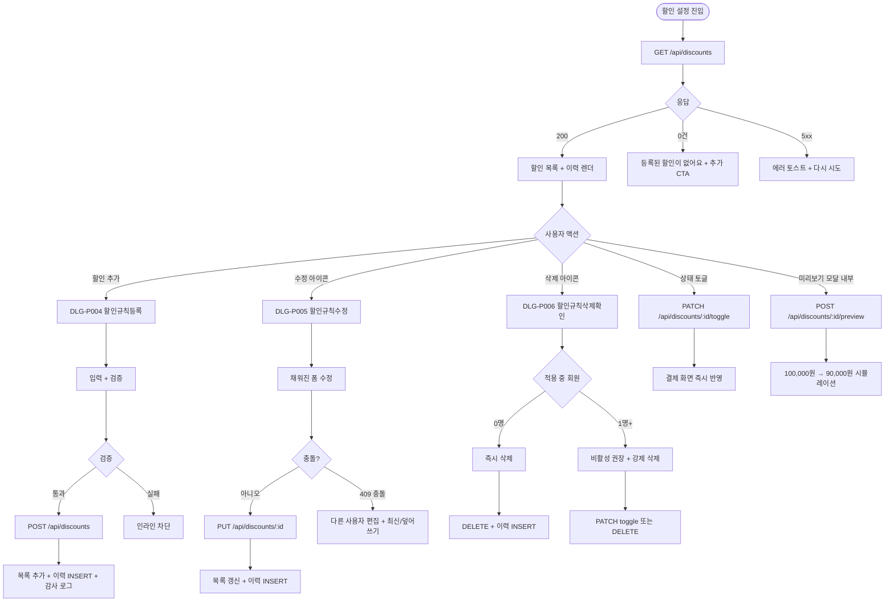
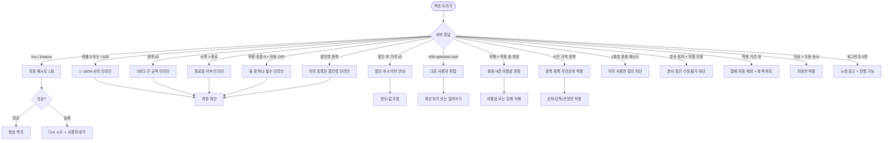

# SCR-P004 할인 설정 페이지

## 1. 화면 메타 정보

이 문서는 할인 설정 페이지에 대한 자기완결형 요구사항 정의서입니다. 다른 문서를 함께 보지 않아도 이 문서 한 장만으로 할인 설정의 모든 영역, 모든 모달, 모든 권한, 모든 예외 처리, 그리고 이 화면을 지탱하는 운영 정책까지 전부 이해하고 구현할 수 있도록 작성합니다.

| 항목 | 값 |
|---|---|
| 작성일 | 2026-05-22 |
| 버전 | v1.0 |
| 상태 | 최신 통합본 반영 (정합화 완료) |
| 도메인 | D05 상품관리 |
| 화면 ID | SCR-P004 |
| 화면명 | 할인 설정 |
| 화면 유형 | 일반 화면 (Settings + History) |
| 라우트 (URL) | `/discount-settings` |
| 플랫폼 | 데스크톱(기본), 태블릿, 모바일(카드형 진입) |
| 우선순위 | P0 (출시 필수) |
| 기능코드 | PRD-04 (할인 설정 정률·정액 + 변경 이력) |
| 계약코드 | PRD-04 |
| 계약 상태 | 계약 범위 본기능 |
| 부모 기능 prefix | PRD |
| Lv1 코드 | PRD-04 |
| Lv2 / Lv3 세분화 | PRD-04-01 ~ PRD-04-07 (할인 목록, 할인 추가, 할인 수정, 할인 삭제, 변경 이력, 활성/비활성, 자동 적용) |
| 연계 화면 | SCR-P001 상품관리, SCR-S003 결제처리, SCR-P008 시즌가격관리, SCR-097 감사로그, SCR-M001 회원 검색, MBR-EXT-04 세그먼트 |
| 호출 다이얼로그 | DLG-P004 할인규칙등록, DLG-P005 할인규칙수정, DLG-P006 할인규칙삭제확인, DLG-P007 할인정책추가수정, DLG-P008 할인정책삭제확인 |

## 2. 화면 개요와 목적

할인 설정 페이지는 상품 판매 시 적용할 할인 정책을 등록·수정·삭제하는 화면입니다. 정률(%) 또는 정액(원) 방식의 할인을 설정하고, 최소 계약 기간 조건이나 최대 할인 한도, 적용 상품, 자동 적용 조건(회원 등급/세그먼트), 적용 기간을 지정합니다. 등록된 할인은 결제 화면(SCR-S003)에서 자동 또는 수동으로 적용되며, 시즌 가격(PRD-08)·쿠폰·마일리지와의 중복 정책은 우선순위 규칙으로 처리됩니다. 변경 이력 타임라인을 통해 최근 등록·수정·삭제 내역을 한 화면에서 시간순으로 확인할 수 있습니다.

이 화면이 다루는 운영 흐름은 다양합니다. 장기 계약 인센티브를 제공하는 센터장은 12개월 이상 헬스 계약 시 10% 정률 할인이 자동 적용되도록 등록하여 계약 갱신율을 높이고, VIP 등급 회원 우대 할인을 운영하는 매니저는 VIP/Gold/Silver 등급별로 5/10/15% 자동 적용을 설정합니다. 신규 가입 첫 구매 캠페인을 진행하는 FC는 정액 5만원 + 적용 횟수 1회성으로 1회만 자동 적용되도록 만들고, 본사 마케팅은 "최근 90일 미방문 회원" 세그먼트 대상 정률 할인을 등록한 뒤 메시지 발송과 결합합니다. 단체 가입 할인이 필요한 매니저는 회사·학교 단체 가입 시 정률 25%를 수동 적용으로 등록하고, 할인 한도 정책을 검토하는 운영자는 정률 50% + 한도 10만원처럼 고가 상품에서 할인 폭을 제한합니다. 캠페인 종료 시점에는 슈퍼관리자가 비활성 토글을 켜 결제 화면에서 즉시 제외되도록 처리하고, 본사 슈퍼관리자는 변경 이력 타임라인과 SCR-097 감사 로그로 누가 언제 무엇을 변경했는지 추적합니다.

할인 우선순위는 시즌 가격 → 할인 → 쿠폰 → 마일리지 순으로 적용되며, 중복 정책 토글에 따라 시즌 가격과 할인의 결합 방식이 달라집니다. 이 화면은 단순한 할인율 입력기가 아니라 캠페인 운영·자동화·감사 추적이 결합된 마케팅 도구로 동작해야 합니다.

## 3. 진입 경로와 인접 화면

이 화면에 진입하는 경로는 두 가지가 있습니다.

첫 번째 경로는 사이드바입니다. "상품관리 > 할인 설정" 메뉴를 클릭하면 진입하며, URL은 `/discount-settings`입니다. 두 번째 경로는 결제 화면(SCR-S003)이나 상품 관리(SCR-P001)에서 "할인 정책 보기" 링크를 통해 진입하는 경우로, 상품별 적용 가능 할인을 검토할 때 사용됩니다. 세 번째 경로는 외부 도구나 북마크에서 공유받은 딥링크로 진입할 수 있습니다.

이 화면에서 빠져나가는 인접 화면으로는 결제 화면(SCR-S003)에서의 자동 적용 결과 검증, 시즌 가격 관리(SCR-P008)에서의 중복 정책 검토, 감사 로그(SCR-097)에서의 변경 이력 추적, 회원 검색(SCR-M001)에서의 자동 적용 대상 회원 확인, 세그먼트 관리(MBR-EXT-04)에서의 자동 적용 조건 세그먼트 확인이 있습니다.

## 4. 레이아웃과 UI 구성

할인 설정 페이지는 위에서 아래로 차곡차곡 쌓이는 세로형 단일 컬럼 레이아웃을 기본으로 합니다.

가장 위에는 페이지 헤더가 있습니다. 좌측에 "할인 설정"이라는 페이지 타이틀이 있고, 우측에는 "할인 추가" 버튼이 위치합니다. 권한이 없는 계정에서는 이 버튼이 보이지 않습니다.

헤더 바로 아래에는 할인 정책 목록 테이블이 있습니다. 컬럼은 좌측부터 할인명, 유형(정률 % 또는 정액 원), 할인 값(비율 또는 금액), 조건(최소 계약 기간, 없으면 "-"), 한도(최대 할인금액, 없으면 "-"), 상태(활성/비활성), 적용 기간(시작일~종료일), 적용 상품({개수}개 또는 "전체"), 자동 적용(등급/세그먼트/수동), 액션(수정·삭제)의 10개 컬럼입니다. 적용 기간 외의 할인은 행 전체가 회색 처리되고, 비활성 할인은 회색 배지가 표시됩니다.

각 행에는 호버 시 작은 액션 아이콘이 우측에 나타나는데, 수정 아이콘과 삭제 아이콘이 그것입니다. 수정 아이콘은 DLG-P005 할인규칙수정 모달을 호출하고, 삭제 아이콘은 DLG-P006 할인규칙삭제확인 모달을 호출합니다.

테이블 아래에는 변경 이력 타임라인이 있습니다. 변경 이력이 0건이면 타임라인 섹션 자체가 노출되지 않고, 1건 이상이면 시간순(최신 위)으로 표시됩니다. 각 이력 행은 `2026-05-15 14:23 / 수정 / VIP 자동 할인 / 값 10% → 15% / 김매니저` 형식으로 일시·작업 구분·할인명·요약 정보·작업자가 표시됩니다. 변경자가 탈퇴 직원이면 "(탈퇴 직원)"으로 마스킹됩니다. 50건을 초과하는 이력은 페이지네이션 또는 "더보기" 버튼으로 추가 로드되며, 1년 경과 이력은 SCR-097 감사 로그에서 조회합니다.

페이지 가장 아래에는 페이지네이션이 있고, 페이지당 표시 건수 드롭다운(20/50/100), 페이지 번호 이동, 총 건수가 표시됩니다.

## 5. 탭 구성과 탭별 동작

이 화면은 별도의 탭 구성이 없는 단일 화면입니다. 할인 목록과 변경 이력이 위에서 아래로 한 화면에 모두 표시되며, 시각적으로 분리되어 있을 뿐 탭 전환은 일어나지 않습니다.

향후 확장으로 "활성/비활성/예정/종료" 필터 탭이 추가될 수 있으나 현재 정합 범위에서는 단일 목록입니다.

## 6. 버튼·아이콘·링크 액션 전체 정의

할인 추가 버튼은 페이지 헤더 우측에 위치하며, 클릭 시 DLG-P004 할인규칙등록 모달을 호출합니다. 권한이 없는 계정에서는 버튼이 숨겨집니다.

각 행의 수정 아이콘은 DLG-P005 할인규칙수정 모달을 호출하여 그 할인 정책의 정보가 채워진 폼을 띄웁니다. 권한이 없으면 아이콘이 숨겨집니다.

각 행의 삭제 아이콘은 DLG-P006 할인규칙삭제확인 모달을 호출합니다. 적용 중인 회원이 있는 할인은 모달 안에서 회원 수가 안내되며, 비활성 전환을 권장하는 분기가 제공됩니다. 권한이 없는 계정에서는 아이콘이 숨겨집니다.

상태 컬럼의 활성/비활성 배지는 권한이 있는 사용자에게는 인라인 토글로 작동합니다. 클릭하면 즉시 활성↔비활성 전환되며 결제 화면에 즉시 반영되고, 변경 이력 타임라인에 자동 INSERT 됩니다.

변경 이력의 "더보기" 또는 페이지네이션 버튼은 50건씩 추가 로드합니다.

페이지네이션 컨트롤은 일반 페이지네이션 동작(이전·다음·페이지 번호 직접 입력)을 따릅니다.

각 할인 행의 적용 상품 셀에 마우스를 올리면 적용 상품 목록이 툴팁으로 펼쳐집니다.

각 할인 행의 자동 적용 조건 셀에 마우스를 올리면 자동 적용 등급 또는 세그먼트가 툴팁으로 펼쳐집니다.

모든 버튼은 클릭 후 응답이 돌아오기 전까지 자동으로 비활성화되어 중복 요청이 차단됩니다.

## 7. 호출되는 모달 동작

이 화면에서 호출되는 모달은 다섯 가지입니다. 각 모달의 자세한 동작은 개별 다이얼로그 문서에서 자기완결로 정의되며, 여기서는 부모 화면 관점에서의 트리거·결과만 정리합니다.

### 7-1. DLG-P004 할인규칙등록 모달

"할인 추가" 버튼을 눌렀을 때 호출됩니다. 모달에서는 할인명(1~30자), 유형(정률/정액), 값, 조건(최소 계약 기간, 일 단위), 한도(최대 할인금액, 정률만), 적용 상품(다중 선택 또는 전체), 자동 적용 조건(회원 등급/세그먼트, 다중), 활성 토글, 적용 기간(시작일~종료일), 중복 적용 정책(중복 허용/단독/큰 것만), 적용 횟수 제한(1회성/무제한), 비고를 입력합니다. 저장 시 동일 지점 내 할인명 중복 검증이 이뤄지고, 통과하면 목록에 추가되며 변경 이력 타임라인과 SCR-097 감사 로그에 INSERT 됩니다. 모달 안에서 적용 상품 1개 선택 후 미리보기 시뮬레이션("100,000원 → 90,000원")이 가능합니다.

### 7-2. DLG-P005 할인규칙수정 모달

각 행의 수정 아이콘을 눌렀을 때 호출됩니다. DLG-P004와 동일한 폼이지만 기존 할인 정보가 모두 채워진 상태로 표시되며, 저장 시 UPDATE 처리되고 변경 이력에 INSERT 됩니다. 동시 수정 충돌은 낙관적 락(`updated_at` 비교)으로 처리되어 다른 사용자가 먼저 저장했으면 "다른 사용자가 먼저 저장했어요" 안내와 함께 최신 정보 보기 또는 덮어쓰기를 선택합니다.

### 7-3. DLG-P006 할인규칙삭제확인 모달

각 행의 삭제 아이콘을 눌렀을 때 호출됩니다. 모달은 대상 할인명과 함께 "현재 적용 중인 회원 {인원수}명이 있습니다, 비활성으로 전환하시겠어요?"라는 분기 안내를 표시합니다. 적용 중 회원이 0명이면 즉시 삭제가 가능하고, 1명 이상이면 비활성 전환이 권장되며 강제 삭제 시 적용 중 결제는 영향 없이 이미 적용된 가격이 유지됩니다.

### 7-4. DLG-P007 할인정책추가수정 모달

별도의 할인 정책 메타(예: 정책 그룹, 세부 카테고리) 추가/수정에 사용되는 보조 모달입니다. 자세한 동작은 해당 다이얼로그 문서에서 정의됩니다.

### 7-5. DLG-P008 할인정책삭제확인 모달

할인 정책 메타 삭제 확인용 보조 모달입니다. 자세한 동작은 해당 다이얼로그 문서에서 정의됩니다.

## 8. 토스트와 확인 팝업과 알럿

성공 토스트는 "할인이 등록되었어요", "할인이 수정되었어요", "할인이 삭제되었어요", "할인 상태가 변경되었어요" 같은 짧은 문구로 결과를 알려 줍니다.

실패 토스트는 "저장에 실패했어요", "권한이 없어요", "다른 사용자가 동시에 편집했어요", "이미 등록된 할인명입니다" 같은 빨강 톤 안내가 표시되며, 동시 수정 충돌은 "최신 정보 보기" / "덮어쓰기" 선택지가 함께 제공됩니다.

인라인 검증 메시지는 모달 내부에서 정률 값 0~100 초과/이하, 정액 값 0 이하, 시작일 > 종료일, 적용 상품 0 + 자동 적용 OFF 같은 모든 검증 실패가 즉시 표시됩니다.

확인 팝업은 DLG-P006 할인규칙삭제확인이 사용되며, 적용 중 회원 수에 따라 비활성 전환 또는 강제 삭제로 분기됩니다.

알럿은 권한 없는 계정의 직접 URL 진입 시 표시되며, 3초 카운트다운으로 대시보드 자동 이동됩니다.

자동 적용 미리보기 토스트는 모달 내부에서 적용 상품 1개 선택 후 즉시 가격 계산 결과를 표시합니다("100,000원 → 90,000원").

## 9. 데이터 흐름과 외부 연동

화면 진입 시 `GET /api/discounts`로 할인 정책 목록을 조회합니다. 응답에는 할인 정책 배열, 총 건수, 페이지 정보가 포함됩니다. 변경 이력은 별도 `GET /api/discounts/history`로 조회되어 비동기로 로드됩니다.

할인 등록은 `POST /api/discounts`, 수정은 `PUT /api/discounts/:id`, 삭제는 `DELETE /api/discounts/:id`로 처리됩니다. 활성/비활성 토글은 `PATCH /api/discounts/:id/toggle`로 간단히 처리되어 결제 화면에 즉시 반영됩니다.

특정 상품에 적용 가능한 할인 조회는 `GET /api/discounts/applicable/:productId`로 처리되며, 결제 화면(SCR-S003)이 가격을 계산할 때 호출됩니다.

할인 미리보기는 `POST /api/discounts/:id/preview`로 처리되어 모달 내부에서 즉시 시뮬레이션 결과를 받습니다.

모든 등록·수정·삭제·활성/비활성 토글은 변경 이력 타임라인에 자동 INSERT 되고, 감사 로그(SCR-097)에도 비동기로 기록됩니다. 기록 필드는 `actor_id, discount_id, action, before, after`입니다.

자동 적용 조건이 세그먼트인 경우, 매일 04:00에 실행되는 MBR-EXT-04 세그먼트 자동 재계산 배치 결과를 사용합니다. 세그먼트 멤버는 결제 시점에 최신 정보로 매칭됩니다.

적용 기간은 매일 00:00 자동 활성/비활성 배치로 처리됩니다. 시작일이 도래하면 자동 활성, 종료일이 지나면 자동 비활성이 됩니다.

회원 등급 변경 이벤트가 발생하면 자동 적용 대상이 즉시 반영되어 결제 시점에 최신 등급 기반으로 매칭됩니다.

적용 기간 D-1 알림은 NFR-19 알림 센터로 운영자에게 발송되어 캠페인 종료 임박을 안내합니다.

1회성 적용 회원 추적은 결제 완료 시점에 `회원 ID + 할인 ID` 매핑이 INSERT 되어, 같은 회원이 같은 할인을 두 번 사용하지 못하도록 차단합니다.

본사 정의 할인은 전 지점에 즉시 동기화되어 모든 지점의 결제 화면에서 동일하게 적용되고, 센터장 정의 할인은 소속 지점에만 적용됩니다.

화면에서 호출하는 주요 API 엔드포인트는 `GET /api/discounts`, `POST /api/discounts`, `PUT /api/discounts/:id`, `DELETE /api/discounts/:id`, `GET /api/discounts/history`, `GET /api/discounts/applicable/:productId`, `POST /api/discounts/:id/preview`, `PATCH /api/discounts/:id/toggle`입니다.

## 10. 화면 상태와 예외 처리

로딩 중 상태에서는 테이블 자리에 스켈레톤이 표시되고 변경 이력 영역도 스켈레톤으로 표시됩니다.

정상 목록 상태는 200 응답과 함께 할인 정책이 1건 이상 존재할 때입니다.

빈 상태는 할인 정책이 0건일 때로, "등록된 할인 정책이 없어요" 안내와 권한자에게 "할인 추가" CTA가 표시됩니다.

이력 있음 상태는 변경 이력이 1건 이상일 때로 하단 타임라인이 노출되며, 이력 없음 상태는 변경 이력이 0건일 때로 타임라인 섹션 자체가 숨겨집니다.

적용 기간 외 상태는 시작일 이전이거나 종료일 이후인 할인 행으로, 행 전체가 회색 처리되어 운영자가 즉시 비활성 상태를 인식할 수 있습니다.

비활성 상태는 활성 토글이 OFF인 할인으로, 회색 배지가 표시되며 결제 화면에서 자동 제외됩니다.

사용 중 안내 상태는 삭제 모달이 호출되었을 때로, 적용 중 회원 수가 표시되고 비활성 전환이 권장됩니다.

권한 없음 상태는 일반 직원이 조회만 가능한 상태로, 추가·수정·삭제 액션 버튼이 모두 숨겨집니다.

예외 케이스별 처리는 다음과 같습니다. 정률 값이 0 또는 100 초과면 인라인 "1~100% 사이로 입력해주세요" + 저장 차단입니다. 정액 값이 0 이하면 "0보다 큰 금액을 입력해주세요" + 저장 차단, 정액 + 한도 입력은 한도 필드 비활성으로 정률만 한도를 가집니다. 적용 기간 시작일 > 종료일은 "종료일은 시작일 이후여야 해요" + 저장 차단, 적용 상품 0개 + 자동 적용 OFF는 "적용 상품 또는 자동 적용 조건 중 하나는 필수" + 저장 차단입니다. 자동 적용 조건 다중 선택(VIP + 세그먼트)은 AND/OR 토글로 조합 정책을 명시합니다. 할인 한도 < 정률 적용 금액은 한도까지만 차감되어 정상 작동이며, 삭제 시 적용 중 회원이 있으면 "현재 적용 중인 회원 {인원수}명이 있습니다, 비활성으로 전환하시겠어요?" 분기로 처리됩니다. 시즌 가격(PRD-08)과의 중복은 중복 정책 토글에 따라 처리되어 중복 허용 시 시즌 특가 → 할인 순차 적용, 단독 시 할인 우선이면 시즌 특가 무시, 큰 것만 시 할인율 큰 쪽만 적용됩니다. 쿠폰·마일리지 결합은 할인 후 가격에 쿠폰 적용, 쿠폰 후 가격에 마일리지 차감 순서입니다. 자동 적용 + 수동 적용 동시 선택은 자동만 적용되어 이중 적용이 차단됩니다. 적용 기간 외 결제 시도는 결제 화면에서 자동 비활성, 목록에서는 회색 처리됩니다. 할인 후 가격이 0 이하면 "할인 후 가격이 0 이하가 됩니다, 한도 또는 값 조정 필요" 안내가 표시됩니다. 할인명 중복(동일 지점)은 "이미 등록된 할인명입니다" + 저장 차단이며, 권한 없음 + 직접 URL 진입은 읽기 전용 모드입니다. 이력 50건 초과는 페이지네이션 또는 더보기 버튼이 표시됩니다. 동시 수정 충돌은 "다른 사용자가 먼저 저장했어요" 낙관적 락으로 처리됩니다. 1회성 적용 회원의 재시도는 "이미 사용한 할인" + 차단입니다. 본사 정의 할인의 지점 수정 시도는 "본사 정의 할인은 수정 불가" + 차단, 세그먼트 0명은 노랑 경고 "적용 대상 없음" + 진행 가능입니다.

## 11. 권한별 처리

슈퍼관리자(superAdmin)와 본사 최고관리자(primary)는 전체 화면을 사용할 수 있으며 등록·수정·삭제·활성 토글이 모두 가능합니다. 본사 정의 할인은 전 지점 공통으로 적용됩니다.

센터장(owner)은 자기 지점의 할인 정책을 등록·수정·삭제·활성 토글할 수 있지만, 본사 정의 할인은 수정·삭제가 차단됩니다.

매니저(manager)는 자기 지점의 할인 정책을 등록·수정할 수 있지만 삭제 권한은 없습니다. 삭제 아이콘이 행에서 숨겨지고 모달도 호출할 수 없습니다.

관리자 권한 보유 직원은 등록·수정·삭제가 모두 가능합니다.

일반 직원은 할인 목록과 변경 이력 조회만 가능하며, 추가·수정·삭제 버튼은 모두 숨겨집니다.

읽기 전용(readonly)은 이 화면 자체에 접근할 수 없으며, 직접 URL 접근 시 대시보드로 자동 이동됩니다.

권한이 부족한 경우 사용자 경험은 일관됩니다. 진입점에서 메뉴가 숨겨지고, 화면 내부 버튼은 권한 부족 시 아예 보이지 않거나 비활성화되며, 백엔드 응답이 403이 되면 "권한이 없어요" 토스트가 표시됩니다. 모든 권한 차단 이벤트는 감사 로그에 기록됩니다.

## 12. 메인 흐름

## 13. 에러와 예외 흐름

## 14. 핵심 디자인 요청사항

할인 목록 테이블은 행 간격이 충분히 넓고, 컬럼 정렬은 할인명·유형·자동 적용은 좌측 정렬, 값·한도는 우측 정렬, 상태 배지는 중앙 정렬로 통일합니다.

상태 배지는 활성은 녹색, 비활성은 회색, 적용 기간 외는 약한 톤의 회색으로 단계적으로 구분됩니다.

유형 배지(정률/정액)는 색상으로 구분되며 라벨 텍스트가 항상 함께 표시됩니다.

자동 적용 컬럼은 등급은 골드 톤, 세그먼트는 보라 톤, 수동은 회색 톤으로 시각적으로 구분됩니다.

변경 이력 타임라인은 시간순(최신 위)으로 표시되며, 등록은 녹색 점, 수정은 파랑 점, 삭제는 빨강 점, 토글은 회색 점으로 작은 마커가 좌측에 붙어 작업 유형을 즉시 알 수 있게 합니다.

모달 내부의 미리보기 영역은 작은 카드 형태로 "100,000원 → 90,000원" 같은 가격 변화를 강조하여 시뮬레이션 결과를 시각적으로 드러냅니다.

적용 상품 셀의 툴팁은 상품명 목록을 한 줄씩 표시하여 운영자가 마우스 호버만으로 적용 대상을 즉시 확인할 수 있게 합니다.

모바일에서는 테이블이 카드형 리스트로 자동 전환되어 한 카드에 할인명·유형·값·상태가 위에, 적용 기간·적용 상품·자동 적용 조건이 아래에 표시됩니다.

## 15. 운영 정책 (이 화면에 연결된 부분)

이 화면은 단순한 할인율 입력기가 아니라 마케팅 캠페인 운영 정책이 그대로 반영된 도구입니다.

할인명 정책은 1~30자, 동일 지점 내 중복 불가입니다. 한글·영문·숫자·일부 특수문자가 허용되며 이모지는 차단됩니다.

정률 할인 검증 정책은 1~100% 범위만 허용입니다. 0 이하나 100 초과는 저장 차단입니다.

정액 할인 검증 정책은 0보다 큰 금액만 허용입니다. 0 이하나 음수는 저장 차단입니다.

최대 할인금액(한도) 정책은 정률 할인에만 적용 가능합니다. 한도 이상은 차감되지 않으며, 정액 할인에 한도를 입력하려고 하면 한도 필드 자체가 비활성화됩니다.

최소 계약 기간 조건 정책은 해당 기간 미만 상품에는 할인이 적용되지 않도록 합니다. 결제 시점에 상품의 기간을 검사하여 조건 미충족이면 자동 제외됩니다.

자동 적용 조건 정책은 회원 등급(VIP/Gold/Silver/일반)과 세그먼트(MBR-EXT-04 연계, 다중 가능)를 조합할 수 있습니다. AND/OR 토글로 조합 방식을 명시하며, 결제 시점에 회원 정보를 매칭하여 자동 적용합니다.

비활성 정책은 적용 대상에서 즉시 제외한다는 것입니다. 비활성 토글 시 결제 화면에 즉시 반영되어 자동 적용이 멈추고, 이미 적용된 결제는 영향 없이 가격이 유지됩니다.

적용 기간 자동 활성/비활성 정책은 매일 00:00 Cron 배치로 처리됩니다. 시작일 도래 시 자동 활성, 종료일 경과 시 자동 비활성으로 전환되어 운영자가 수동으로 캠페인을 끄지 않아도 됩니다.

중복 적용 정책(시즌 가격과의 관계)은 세 가지 토글입니다. 중복 허용은 시즌 특가 → 할인 순차 적용(테넌트 기본값), 단독은 할인이 우선이면 시즌 특가 무시, 큰 것만은 할인율 큰 쪽만 적용입니다.

쿠폰·마일리지 결합 우선순위는 시즌가격 → 할인 → 쿠폰 → 마일리지입니다. 각 단계 후 가격이 다음 단계 입력값이 됩니다.

적용 횟수 제한 정책은 1회성(회원당 1회)과 무제한 중에서 선택합니다. 1회성은 회원 ID + 할인 ID 매핑으로 결제 시점에 중복 차단됩니다.

자동 + 수동 동시 적용 차단 정책은 자동 적용 회원에게 수동 적용을 시도하면 자동만 적용되도록 합니다. 이중 적용이 차단되어 회원 이익이 과도하게 부풀려지지 않습니다.

할인 후 가격 0 이하 정책은 결제 시 0원으로 처리하지 않고 0원 결제를 차단합니다. 한도나 값을 조정해야 합니다(0 미만 허용 토글은 정책에 따름).

권한별 액션 정책은 슈퍼관리자·센터장·관리자 권한은 등록·수정·삭제 모두 가능, 매니저는 등록·수정만 가능(삭제 제외), 일반 직원은 조회만 가능입니다.

비활성 vs 삭제 정책은 적용 중 회원이 있는 할인은 삭제 대신 비활성 권장입니다. 강제 삭제 시 적용 중 결제는 영향 없이 이미 적용된 가격이 유지됩니다.

변경 이력 50건 초과 정책은 페이지네이션 또는 더보기 버튼으로 처리됩니다. 1년 경과 이력은 SCR-097 감사 로그에서 조회합니다.

동시 수정 충돌 정책은 낙관적 락(`updated_at` 비교)으로 감지됩니다.

본사 vs 지점 정책은 본사 슈퍼관리자가 정의한 할인은 전 지점 공통으로 적용되고, 센터장 정의는 소속 지점에만 적용됩니다. 본사 정의 할인의 지점 수정은 차단됩니다.

할인 미리보기 정책은 모달 내부에서 적용 상품 1개 선택 후 즉시 가격 시뮬레이션을 제공합니다. 운영자가 등록 전에 결과를 확인할 수 있게 합니다.

세그먼트 자동 갱신 정책은 자동 적용 조건이 세그먼트인 경우 매일 04:00에 세그먼트 멤버가 갱신되어 결제 시점에 최신 정보가 사용됩니다.

감사 로그 정책은 등록·수정·삭제·활성/비활성 토글을 모두 SCR-097에 기록합니다. `actor_id, discount_id, action, before, after`가 INSERT 됩니다.

이상의 모든 정책은 이 화면을 구현하고 운영하는 사람이 별도 문서 없이 이 한 장만 보면 이해할 수 있도록 풀어 적었습니다.
