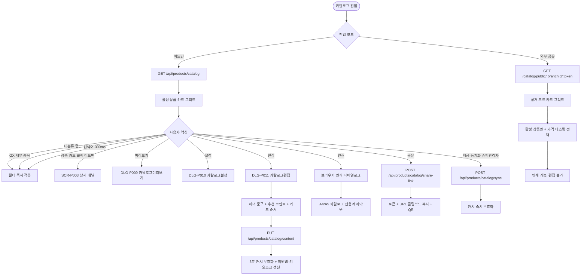

# SCR-P005 상품 카탈로그 페이지

## 1. 화면 메타 정보

이 문서는 상품 카탈로그 페이지에 대한 자기완결형 요구사항 정의서입니다. 다른 문서를 함께 보지 않아도 이 문서 한 장만으로 카탈로그의 모든 영역, 모든 모달, 모든 권한, 모든 예외 처리, 그리고 이 화면을 지탱하는 운영 정책까지 전부 이해하고 구현할 수 있도록 작성합니다.

| 항목 | 값 |
|---|---|
| 작성일 | 2026-05-22 |
| 버전 | v1.0 |
| 상태 | 최신 통합본 반영 (정합화 완료) |
| 도메인 | D05 상품관리 |
| 화면 ID | SCR-P005 |
| 화면명 | 상품 카탈로그 |
| 화면 유형 | 카드 그리드 화면 + 외부 공유 모드 |
| 라우트 (URL) | `/products/catalog` (내부), `/catalog/public/:branchId/:token` (외부) |
| 플랫폼 | 데스크톱, 태블릿(상담용 우선), 모바일(2 컬럼 자동) |
| 우선순위 | P1 (출시 필수) |
| 기능코드 | PRD-05 (상품 카탈로그 회원 상담 + 인쇄·공유) |
| 계약코드 | PRD-05 |
| 계약 상태 | 계약 범위 본기능 |
| 부모 기능 prefix | PRD |
| Lv1 코드 | PRD-05 |
| Lv2 / Lv3 세분화 | PRD-05-01 ~ PRD-05-08 (카탈로그 뷰, 필터 바, 미리보기, 설정, 편집, 인쇄, 공유, 회원앱 동기화) |
| 연계 화면 | SCR-P001 상품관리, SCR-P003 상품상세패널, SCR-P004 할인설정, SCR-P008 시즌가격관리, SCR-S003 결제처리, 회원앱 상품 화면, 키오스크 |
| 호출 다이얼로그 | DLG-P009 카탈로그미리보기, DLG-P010 카탈로그설정, DLG-P011 카탈로그편집, DLG-P007 상품이미지업로드 |

## 2. 화면 개요와 목적

상품 카탈로그 페이지는 센터에서 판매 중인 상품을 고객이 보기 좋은 카드 그리드 형태로 안내하는 화면입니다. 회원 상담 시 카운터 직원이 태블릿이나 모니터로 회원에게 보여주거나, 인쇄해 POP·전단지로 활용하거나, 외부 공유 링크와 QR 코드로 SNS·카카오톡·블로그에 공유해 잠재 고객 유입에 활용합니다. 카탈로그는 어드민·외부 공유·회원앱이 동일한 정본을 사용하는 단일 정보원으로 운영되어, 가격·이미지·노출 옵션이 어디서든 일관되게 보입니다.

이 화면이 다루는 운영 흐름은 다음과 같습니다. 카운터 직원은 신규 회원이 상담 데스크를 방문했을 때 태블릿 카탈로그를 시연하며 추천 상품을 안내한 뒤 결제 화면(SCR-S003)으로 점프하고, Owner(지점장)은 인쇄 모드를 활용해 A4·A5 카탈로그 전용 레이아웃을 출력해 카운터에 비치합니다. 매니저는 외부 공유 링크를 발급해 카카오톡·SNS·네이버 블로그에 공유하면서 잠재 고객 유입 채널을 늘리고, 본사 마케팅은 카탈로그 편집(DLG-P011)에서 헤더 문구를 변경하고 추천 코멘트를 달고 카드 순서를 조정해 시즌 캠페인을 강조합니다. 슈퍼관리자는 카탈로그 변경 5분 후 회원앱 동기화 결과를 점검해 정합성을 확인하고, 본사 슈퍼관리자는 색상 테마와 그리드 컬럼 수를 정비해 브랜드 일관성을 유지합니다.

시즌 가격(PRD-08) 진행 중인 상품은 자동으로 "할인" 배지 + 정상가 취소선 + 특가 강조가 표시되고, PRD-04 할인이 적용된 상품도 일반 자동 적용 조건이면 "할인 X%" 배지가 자동으로 붙습니다. 비활성 상품은 자동 제외되고, 카탈로그 노출 OFF 토글이 켜진 상품은 활성 상태여도 카탈로그에서만 숨겨집니다(키오스크·결제는 정상 노출).

이 화면은 어드민과 외부 공유 두 모드를 동시에 지원하는 특수한 화면이며, 외부 공유 모드에서는 비로그인 사용자도 접근할 수 있도록 별도 라우트(`/catalog/public/:branchId/:token`)와 토큰 기반 인증이 적용됩니다.

## 3. 진입 경로와 인접 화면

내부 진입 경로는 사이드바의 "상품관리 > 상품 카탈로그" 메뉴 클릭이 기본이며, URL은 `/products/catalog`입니다. 상품 관리(SCR-P001)에서 특정 상품의 카탈로그 미리보기를 호출해 진입할 수도 있고, 상품 상세 패널(SCR-P003)의 "카탈로그 미리보기" 액션으로도 진입합니다.

외부 진입 경로는 운영자가 발급한 외부 공유 링크(`/catalog/public/:branchId/:token`)로 비로그인 사용자가 접근하는 경우이며, 어드민 헤더와 사이드바가 모두 숨겨진 공개 모드로 표시됩니다. QR 코드도 동일 URL로 변환되어 인쇄물에 부착됩니다.

이 화면에서 빠져나가는 인접 화면으로는 상품 카드 클릭 시 결제 화면(SCR-S003)으로 점프하는 경로(어드민 모드만), 인쇄 모드에서 브라우저 인쇄 다이얼로그 호출, 공유 액션에서 링크 복사 + QR 코드 생성, 회원앱 상품 화면(동기화 결과 확인용), 키오스크(동기화 결과 확인용)가 있습니다.

## 4. 레이아웃과 UI 구성

상품 카탈로그 페이지는 어드민 모드와 외부 공유 모드 두 가지 레이아웃을 가지며, 외부 모드는 어드민 헤더와 사이드바가 숨겨진 상태로만 다릅니다.

가장 위에는 페이지 헤더가 있습니다. 좌측에 "상품 카탈로그" 타이틀과 지점 컨텍스트가 표시되고, 우측에는 액션 버튼들이 배치됩니다. 카탈로그 미리보기 버튼(DLG-P009), 설정 버튼(DLG-P010), 편집 버튼(DLG-P011), 인쇄 버튼, 공유 버튼이 차례로 있습니다. 권한이 없는 계정에서는 일부 버튼이 숨겨집니다.

헤더 아래에는 필터 바가 있습니다. 1단계 상품 대분류 탭(회원권·수강권·락커·운동복·일반)이 가로로 배치되고, 수강권(LESSON_PASS) 탭 선택 후 GX를 선택하면 2단계 세부종목 필터(요가·필라테스·스피닝·줌바·에어로빅·GX 기타)가 그 아래에 표시됩니다. 우측에는 상품명 검색창이 있고 300ms 디바운스가 적용됩니다. 활성 상품만 표시되며 비활성은 자동으로 제외됩니다.

필터 바 아래에는 카탈로그 뷰 본문이 있습니다. 상품 카드가 그리드 레이아웃으로 배치되며, 데스크톱에서 2·3·4 컬럼(설정에서 선택), 태블릿에서 2·3 컬럼, 모바일에서 1·2 컬럼으로 자동 축소(responsive)됩니다. 각 카드에는 상품 대분류별 색상 띠(회원권 파랑·수강권 보라·락커 주황·운동복 회색·일반 청록)가 상단에 표시되고, 상품 이미지(또는 placeholder), 상품명, 패키지 배지, GX 6종 세부종목 배지(GX 상품만), 가격(현금가·카드가), 기간 또는 횟수, 주요 혜택 요약이 차례로 표시됩니다. 시즌 특가 진행 중인 상품은 "할인" 배지 + 정상가 취소선 + 특가 강조가 자동으로 적용됩니다.

카탈로그 편집 모드(DLG-P011 호출 중)에서는 각 카드에 드래그 핸들과 카탈로그 노출 OFF 토글이 함께 표시됩니다.

인쇄 모드에서는 어드민 헤더와 내비게이션이 모두 숨겨지고 카탈로그 전용 레이아웃이 적용됩니다. A4 1페이지에는 6장(2x3) 또는 A5 1페이지에는 4장(2x2)이 배치되고, 페이지 헤더에는 센터명·연락처·운영시간이 표시됩니다. 카드 단위로 page-break-inside: avoid가 적용되어 카드가 페이지 중간에 잘리지 않습니다.

외부 공유 모드(`/catalog/public/...`)에서는 어드민 헤더와 사이드바가 숨겨진 상태로 카탈로그 본문만 표시되며, 비로그인 사용자도 접근 가능합니다. 가격은 카드가 우선으로 표시되며, 테넌트 정책에 따라 가격 마스킹이 적용될 수 있습니다.

## 5. 탭 구성과 탭별 동작

이 화면의 1차 탭은 상품 대분류 탭이며, 회원권·수강권·락커·운동복·일반의 다섯 가지가 있습니다. 수강권 탭을 선택하면 2차 필터로 lessonType(PT/GX/골프/기타)가 나타나고, GX를 선택하면 6종 세부종목 필터가 추가로 펼쳐집니다.

탭 전환은 즉시 필터 재적용을 트리거하며, 카드 그리드가 새로운 데이터로 다시 렌더링됩니다. URL 쿼리 파라미터에 `category=LESSON_PASS&lessonType=GX&subCategory=요가` 형태로 반영되어 새로고침이나 북마크에서도 같은 탭 상태가 유지됩니다.

탭 전환 시 검색어와 정렬 순서는 유지되지만 페이지(스크롤 위치)는 최상단으로 리셋됩니다.

## 6. 버튼·아이콘·링크 액션 전체 정의

카탈로그 미리보기 버튼은 DLG-P009 카탈로그미리보기 모달을 호출하여 고객에게 보여질 화면을 시뮬레이션합니다. 모바일·태블릿·데스크톱 뷰포트 전환이 가능하며 어드민 헤더·내비가 숨겨진 상태로 표시됩니다.

설정 버튼은 DLG-P010 카탈로그설정 모달을 호출합니다. 노출 항목(가격/기간/횟수/혜택/태그/이미지/배지), 정렬(인기순/가격 낮은순/가격 높은순/최신순/수동), 그리드 컬럼(2/3/4), 색상 테마(기본/라이트/다크/브랜드), 헤더 노출(로고/연락처/운영시간)을 설정합니다.

편집 버튼은 DLG-P011 카탈로그편집 모달을 호출합니다. 카탈로그 헤더 문구(제목 1~50자, 부제목 1~100자), 각 상품 카드 추천 코멘트(1~50자), 카드 순서 드래그 앤 드롭, 이미지 첨부(DLG-P007 연동), 특정 상품 카탈로그 노출 OFF 토글을 편집합니다.

인쇄 버튼은 브라우저 인쇄 다이얼로그를 호출하면서 카탈로그 전용 레이아웃을 적용합니다. A4 또는 A5 용지를 선택할 수 있고, PDF 저장도 인쇄 다이얼로그 내에서 가능합니다.

공유 버튼은 외부 공유 URL을 발급하고 클립보드에 복사한 뒤 QR 코드를 생성합니다. 외부 공유 URL은 `/catalog/public/{branchId}/{token}` 형태이며 토큰 만료가 없고(비활성 토글 시 차단), QR 코드는 동일 URL의 시각적 변환입니다. 클립보드 API 권한이 없으면 "수동 복사" 안내 + 링크 표시로 폴백되고, QR 생성 실패 시 링크 복사만 제공됩니다.

각 카드는 어드민 모드에서는 호버 시 약간 들떠 클릭 가능함을 알리고, 클릭하면 상품 상세 패널(SCR-P003)로 점프합니다. 외부 모드에서는 카드 자체는 정보만 제공하며 결제 점프나 상세 패널 호출이 불가능합니다.

검색창과 1단계·2단계 필터 탭은 클릭/입력 시 즉시 카드 그리드를 재조회합니다.

지금 동기화 버튼(슈퍼관리자에게만 노출)은 회원앱 동기화 캐시를 즉시 무효화하여 5분 캐시를 건너뛰고 회원앱·키오스크를 강제로 갱신합니다.

모든 버튼은 응답이 돌아오기 전까지 자동으로 비활성화됩니다.

## 7. 호출되는 모달 동작

### 7-1. DLG-P009 카탈로그미리보기 모달

카탈로그 미리보기 버튼을 눌렀을 때 호출됩니다. 모달 내부에 고객 노출 화면이 시뮬레이션되며, 어드민 헤더·내비가 숨겨진 상태로 보입니다. 모달 상단에 뷰포트 전환 탭(모바일/태블릿/데스크톱)이 있어 각 디바이스의 카탈로그 모양을 확인할 수 있습니다. 외부 공유 모드와 동일한 가격 마스킹 정책이 적용됩니다.

### 7-2. DLG-P010 카탈로그설정 모달

설정 버튼을 눌렀을 때 호출됩니다. 노출 항목 토글, 정렬 5종, 그리드 컬럼 3종, 색상 테마 4종, 헤더 노출 토글이 표시됩니다. 저장 시 카탈로그 뷰에 즉시 반영되고 회원앱·키오스크 동기화 캐시가 5분 내 무효화됩니다. 모든 변경은 감사 로그(SCR-097)에 기록됩니다.

### 7-3. DLG-P011 카탈로그편집 모달

편집 버튼을 눌렀을 때 호출됩니다. 헤더 문구 입력, 각 상품 추천 코멘트 입력, 카드 순서 드래그 앤 드롭, 이미지 첨부(DLG-P007 연동), 특정 상품 카탈로그 노출 OFF 토글을 편집합니다. 정렬 자동 모드(인기순 등)에서 드래그를 시도하면 "수동 정렬로 전환됩니다" 안내가 표시되고 모드가 자동 전환됩니다. 동시 편집 충돌은 낙관적 락(`updated_at` 비교)으로 처리됩니다.

### 7-4. DLG-P007 상품이미지업로드 모달

DLG-P011 카탈로그편집 내부에서 이미지 첨부 시 호출되는 보조 모달입니다. 카탈로그 전용 이미지를 별도로 첨부할 수 있고, 카탈로그 전용 이미지가 있으면 상품 등록 시 이미지보다 우선 표시됩니다.

## 8. 토스트와 확인 팝업과 알럿

성공 토스트는 "카탈로그가 갱신되었어요", "설정이 저장되었어요", "링크가 복사되었어요", "공유 URL이 생성되었어요" 같은 짧은 문구로 결과를 알려 줍니다.

실패 토스트는 "카탈로그 갱신에 실패했어요", "링크 복사 실패(수동 복사 안내)", "QR 코드 생성 실패", "다른 사용자가 먼저 편집했어요" 같은 빨강 톤 안내가 표시됩니다.

인라인 검증 메시지는 모달 내부의 헤더 문구 100자 초과, 추천 코멘트 50자 초과 같은 검증 실패에 사용됩니다.

확인 팝업은 외부 공유 비활성 토글 시 "이 링크는 외부 접근이 차단됩니다, 정말 비활성하시겠어요?" 같은 안내에 사용됩니다.

알럿은 외부 공유 모드에서 토큰이 비활성화되었거나 만료된 경우(향후 만료 정책 적용 시), 외부 사용자에게 "현재 카탈로그가 비공개입니다"라는 차단형 안내가 표시됩니다.

## 9. 데이터 흐름과 외부 연동

화면 진입 시 `GET /api/products/catalog`로 활성 상품 목록을 조회합니다. 응답에는 필터된 상품 배열, 시즌 특가 정보, 할인 정보, 카탈로그 설정(노출 항목·정렬·컬럼 수·테마), 카탈로그 편집 정보(헤더 문구·추천 코멘트·카드 순서)가 포함됩니다.

카탈로그 미리보기는 `GET /api/products/catalog/preview`로 별도 조회되어 모달 내부에 표시됩니다.

설정 저장은 `PUT /api/products/catalog/settings`, 편집 저장은 `PUT /api/products/catalog/content`로 처리됩니다. 두 API는 모두 감사 로그에 비동기 INSERT 됩니다.

외부 공유 URL 발급은 `POST /api/products/catalog/share-link`로 처리되며 응답에 토큰과 URL이 포함됩니다. 첫 [공유] 클릭 시 영구 토큰이 생성되고, 비활성 토글 시 토큰이 차단됩니다.

외부 공유 URL 접근은 `GET /catalog/public/:branchId/:token`으로 처리되어 비로그인 사용자도 접근 가능합니다. 활성 상품만 응답되고 비활성·카탈로그 노출 OFF 상품은 자동 제외됩니다.

회원앱 동기화는 카탈로그 변경 시점에 캐시 무효화 이벤트가 발송되어 회원앱과 키오스크가 5분 이내에 자동 갱신됩니다. 명시적 동기화는 `POST /api/products/catalog/sync`로 즉시 캐시 무효화가 가능합니다.

시즌 특가 자동 강조는 PRD-08 시즌 가격 진행 중 상품에 자동 적용됩니다. 카탈로그 응답에 시즌 정보가 포함되어 "할인" 배지 + 취소선 + 특가가 자동 렌더링됩니다.

PRD-04 할인 자동 강조는 일반 자동 적용 할인(자동 적용 조건이 "전체" 또는 회원 등급/세그먼트 없음)인 경우 "할인 X%" 배지가 자동으로 붙습니다.

QR 코드 생성은 클라이언트 사이드에서 외부 URL을 QR 라이브러리로 변환하며, 생성 실패 시 링크 복사만 제공됩니다.

이미지는 Supabase Storage의 `products/{branchId}/{productId}/` 경로에서 표시되며, 외부 호스트 이미지는 CORS 정책에 따라 PDF 저장 시 누락될 수 있어 내부 Storage 사용이 권장됩니다.

검색 디바운스는 300ms이며 AbortController로 이전 요청이 취소됩니다.

화면에서 호출하는 주요 API 엔드포인트는 `GET /api/products/catalog`, `GET /api/products/catalog/preview`, `PUT /api/products/catalog/settings`, `PUT /api/products/catalog/content`, `POST /api/products/catalog/share-link`, `POST /api/products/catalog/sync`, `GET /catalog/public/:branchId/:token`입니다.

## 10. 화면 상태와 예외 처리

빈 상태는 활성 상품이 0개일 때로, "표시할 상품이 없습니다" 안내와 권한자에게 [상품 등록 안내] CTA가 표시됩니다.

정상 카드 그리드 상태는 활성 상품이 1개 이상일 때 가장 일반적인 상태입니다.

필터 결과 0건 상태는 필터/검색 결과가 0개일 때로, "필터 결과 없음" + [초기화] CTA가 표시됩니다.

인쇄 모드 상태는 인쇄 버튼을 누른 후 브라우저 인쇄 다이얼로그가 호출된 상태로, 어드민 헤더와 내비게이션이 모두 숨겨진 카탈로그 전용 레이아웃입니다.

미리보기 모드 상태는 DLG-P009가 호출된 상태로, 고객 노출 형태와 뷰포트 전환이 가능합니다.

편집 모드 상태는 DLG-P011이 호출된 상태로, 카드 순서 드래그가 활성화되어 있습니다.

외부 공유 모드 상태는 `/catalog/public/...`에 비로그인 사용자가 접근한 상태로, 활성 상품만 표시되고 인쇄는 가능하지만 편집·설정은 불가합니다.

동기화 중 상태는 회원앱 갱신 진행 표시가 헤더에 노출되는 상태입니다.

예외 케이스별 처리는 다음과 같습니다. 활성 상품이 0개면 "표시할 상품이 없습니다" + 운영자에게 등록 안내가 표시됩니다. 필터 결과 0건은 "필터 결과 없음" + [초기화] CTA입니다. 시즌 가격 진행 중 + 일반 할인 동시 적용은 카탈로그에서 더 큰 할인율을 표시하거나 정책에 따른 우선순위로 처리됩니다. 카탈로그 노출 OFF 토글된 상품은 활성이어도 카탈로그에서만 숨겨지며 키오스크·결제는 정상입니다. 이미지 미등록 상품은 카드에 placeholder + "이미지 미등록" 라벨(어드민 모드만)이 표시됩니다. 시즌 특가 종료 직후 5분 캐시로 인해 잠시 노출될 수 있으며 캐시 무효화로 즉시 갱신됩니다. 외부 공유 + 비활성 상품은 자동 제외되어 외부 사용자는 활성만 조회 가능합니다. 인쇄 시 페이지 분할은 카드 단위로 page-break-inside: avoid가 적용됩니다. PDF 저장 시 외부 호스트 이미지는 CORS 정책으로 누락 가능하므로 내부 Storage만 안정 보장됩니다. 그리드 컬럼 4 + 모바일 뷰는 자동으로 2 컬럼으로 축소됩니다. 검색 키워드 디바운스 중 다른 키워드 입력 시 이전 요청은 AbortController로 취소됩니다. 링크 복사 권한 없음(클립보드 API)은 "수동 복사" 안내 + 링크 표시로 폴백됩니다. QR 코드 생성 실패는 링크 복사만 제공됩니다. 카탈로그 편집 중 동시 수정 충돌은 낙관적 락으로 처리되어 "다른 사용자가 먼저 저장했어요" 안내가 표시됩니다. 카드 순서 드래그 + 정렬 자동 토글 ON은 "수동 정렬로 전환됩니다" 안내 후 모드가 자동 전환됩니다. 헤더 문구 100자 초과 또는 추천 코멘트 50자 초과는 인라인 차단됩니다. 외부 노출 URL 비활성 토글 시 외부 사용자 접근에는 "현재 카탈로그가 비공개입니다"가 표시됩니다. 회원앱 동기화 지연은 5분 캐시 + 명시 [지금 동기화] 버튼으로 즉시 갱신 가능합니다.

## 11. 권한별 처리

슈퍼관리자(superAdmin)와 본사 최고관리자(primary)는 전체 카탈로그와 설정을 모두 사용할 수 있으며 조회·인쇄·공유·설정·편집이 가능합니다.

Owner(지점장)은 자기 지점 카탈로그 전체와 설정을 모두 사용할 수 있으며 조회·인쇄·공유·설정·편집이 가능합니다.

매니저(manager)는 자기 지점 카탈로그 전체와 설정을 사용할 수 있지만 편집 기능은 제외됩니다. 조회·인쇄·공유·설정은 가능합니다.

일반 직원은 활성 카탈로그를 조회하고 인쇄와 공유는 가능하지만 설정과 편집은 불가능합니다.

읽기 전용(readonly)은 활성 카탈로그를 조회만 가능합니다.

외부 공유 링크 접근자(비로그인)는 활성 카탈로그를 공개 모드로 조회하며 인쇄도 가능하지만 결제 점프·편집·설정은 모두 불가능합니다. 가격은 테넌트 정책에 따라 카드가 우선 표시되거나 마스킹될 수 있습니다.

권한이 부족한 경우 사용자 경험은 일관됩니다. 진입점에서 메뉴가 숨겨지고, 화면 내부 버튼은 권한 부족 시 보이지 않거나 비활성화되며, 외부 공유 모드에서는 어드민 액션이 모두 차단됩니다.

## 12. 메인 흐름



## 13. 에러와 예외 흐름

```mermaid
flowchart TD
    A([액션 트리거]) --> B{상태}
    B -->|활성 상품 0개| C["표시할 상품이 없습니다" + 등록 안내]
    B -->|필터 결과 0건| D["필터 결과 없음" + 초기화 CTA]
    B -->|카탈로그 노출 OFF| E[카탈로그 숨김 + 키오스크 정상]
    B -->|이미지 미등록| F[placeholder + 어드민 라벨]
    B -->|시즌 종료 직후 캐시| G[5분 캐시 + 지금 동기화]
    B -->|외부 공유 + 비활성| H[외부 차단 + "비공개" 안내]
    B -->|인쇄 페이지 분할| I[page-break-inside avoid]
    B -->|PDF 외부 이미지| J[placeholder 대체]
    B -->|그리드 4 + 모바일| K[자동 2 축소 responsive]
    B -->|클립보드 권한 없음| L["수동 복사" + 링크 표시]
    B -->|QR 생성 실패| M[링크 복사만]
    B -->|동시 편집 충돌| N["다른 사용자 편집" 낙관적 락]
    B -->|드래그 + 자동 정렬| O["수동 정렬 전환" 안내]
    B -->|헤더 100자 초과| P[인라인 차단]
    B -->|추천 코멘트 50자 초과| P
    B -->|외부 URL 비활성| Q["비공개" 안내 + 차단]
    B -->|회원앱 동기화 지연| R[5분 캐시 + 지금 동기화]
    B -->|검색 결과 0건| S["검색 결과 없음"]
    B -->|카탈로그 설정 권한 없음| T[버튼 hidden]
```

## 14. 핵심 디자인 요청사항

카탈로그 카드는 상품 대분류별 색상 띠가 상단에 1~2px 굵기로 표시되어 멀리서도 분류 식별이 가능해야 합니다. 회원권은 파랑·수강권은 보라·락커는 주황·운동복은 회색·일반은 청록 톤입니다.

이미지는 카드 상단에 비율 16:9 또는 정사각형으로 큼직하게 배치되어 시각적 임팩트를 줍니다. 이미지 미등록 시 placeholder는 상품 대분류 아이콘으로 대체됩니다.

상품명은 카드 중앙에 굵은 폰트로 표시되고, GX 세부종목 배지는 상품명 옆에 작은 배지로 함께 노출됩니다.

가격 표시는 시즌 특가가 있는 경우 정상가 취소선과 특가가 강조 색상으로 함께 표시되어 운영자가 회원에게 즉시 어필할 수 있어야 합니다.

"할인" 배지와 "패키지" 배지는 카드 우상단에 작은 라벨로 표시되어 시즌 캠페인이나 패키지 상품을 시각적으로 강조합니다.

추천 코멘트는 카드 하단에 작은 글씨로 표시되어 운영자가 회원에게 추천 포인트를 부드럽게 안내합니다.

인쇄 모드에서는 카드 간격이 약간 좁아지고 폰트도 살짝 줄어들어 A4 1페이지에 6장이 깔끔하게 들어가야 합니다.

외부 공유 모드에서는 카탈로그 전용 헤더(센터 로고·연락처)가 표시되고 어드민 UI는 모두 숨겨집니다.

QR 코드는 공유 모달 내부에 큰 사이즈로 표시되고 다운로드 버튼으로 PNG 파일을 받을 수 있어야 합니다.

모바일에서는 카드가 2 컬럼으로 자동 축소되고 카드 내부 정보 밀도가 약간 줄어들어 가독성이 유지됩니다.

## 15. 운영 정책 (이 화면에 연결된 부분)

카탈로그는 활성 상품만 표시한다는 것이 가장 기본 정책입니다. 비활성·미사용 상품은 자동 제외되어 회원에게 노출되지 않습니다.

GX 세부종목 배지 필수 표시 정책은 GX 상품에 6종 세부종목(요가·필라테스·스피닝·줌바·에어로빅·GX 기타) 중 하나를 반드시 배지로 표시한다는 것입니다.

대분류별 색상 코드 일관성 정책은 SCR-P001 상품 관리와 동일한 색상을 사용해 브랜드 일관성을 유지합니다.

회원앱 동기화 정책은 카탈로그 변경 시 회원앱과 키오스크에 5분 캐시 무효화로 동기화하며, 명시 [지금 동기화] 버튼으로 즉시 갱신도 가능합니다.

인쇄 레이아웃 정책은 어드민 헤더와 내비게이션을 모두 숨기고 카탈로그 전용 레이아웃을 사용합니다. 카드 단위로 페이지 분할이 자동 처리되어 카드가 페이지 중간에 잘리지 않습니다.

외부 공유 URL 정책은 `/catalog/public/{branchId}/{token}` 형태이며 토큰 만료가 없고 비활성 토글 시 차단됩니다. 직원 인증 없이 외부 사용자도 접근 가능합니다.

카탈로그 노출 OFF 정책은 활성 상품이라도 DLG-P011에서 카탈로그 노출 OFF 토글이 가능하다는 것입니다. 키오스크·결제는 정상 노출되고 카탈로그에서만 숨겨집니다.

시즌 특가 자동 강조 정책은 PRD-08 시즌 가격 진행 중 상품에 자동으로 "할인" 배지·정상가 취소선·특가 표시를 적용합니다.

할인 자동 강조 정책은 PRD-04 할인 진행 중 상품에 일반 자동 적용 조건이면 "할인 X%" 배지를 자동으로 표시합니다.

카탈로그 정렬 정책은 인기순(누적 판매), 가격 낮은순, 가격 높은순, 최신순, 수동 정렬의 5종입니다.

그리드 컬럼 정책은 데스크톱 2/3/4, 태블릿 2/3, 모바일 1/2의 responsive 자동 축소입니다.

헤더 문구 정책은 제목 1~50자, 부제목 1~100자이며 한글·영문·숫자·이모지가 허용됩니다.

추천 코멘트 정책은 1~50자, 카드별 선택 입력이며 카드 하단에 표시됩니다.

이미지 정책은 상품 등록 시 첨부된 이미지(PRD-EXT-01) 또는 카탈로그 편집에서 별도 첨부 이미지(DLG-P007) 중 카탈로그 전용 이미지가 우선 표시됩니다.

인쇄 페이지 정책은 A4 1페이지 6장(2x3) 또는 A5 1페이지 4장(2x2)이며, 페이지 헤더에 센터명·연락처·운영시간이 표시됩니다.

PDF 저장 정책은 브라우저 인쇄 다이얼로그 → PDF 저장(Chrome/Edge/Safari)이며 한글 폰트가 임베드됩니다.

카드 순서 드래그 정책은 정렬 자동 모드에서 드래그 시 "수동 정렬로 전환" 안내 후 모드를 자동 전환합니다.

권한별 액션 정책은 슈퍼관리자/Owner(지점장)은 모든 액션, 매니저는 설정 가능(편집 제외), 일반 직원은 조회·인쇄·공유, readonly는 조회만, 외부 사용자(비로그인)는 활성 상품 조회와 인쇄만 가능합니다.

회원앱 동기화 캐시 정책은 5분 캐시이며 카탈로그 변경 시 캐시 무효화 이벤트가 발송되어 회원앱이 즉시 갱신됩니다.

카탈로그 편집 동시성 정책은 낙관적 락(`updated_at` 비교)으로 처리됩니다.

감사 로그 정책은 카탈로그 설정·편집·외부 URL 발급/비활성을 모두 SCR-097에 기록합니다.

이상의 모든 정책은 이 화면을 구현하고 운영하는 사람이 별도 문서 없이 이 한 장만 보면 이해할 수 있도록 풀어 적었습니다.
