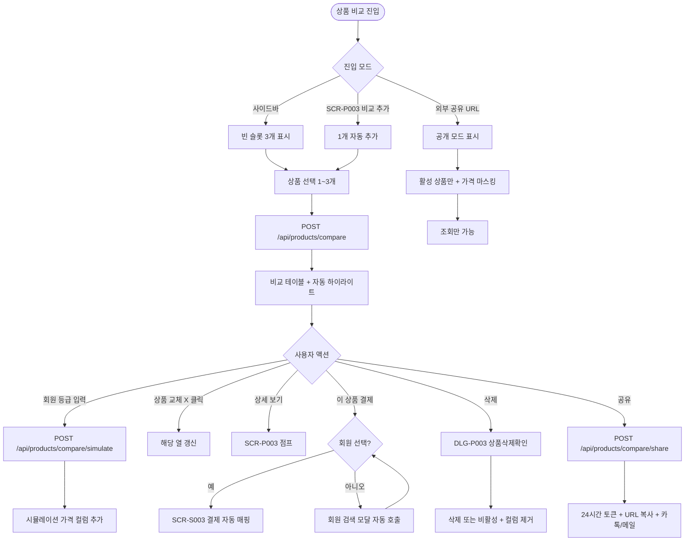

# SCR-P006 상품 비교 페이지

## 1. 화면 메타 정보

이 문서는 상품 비교 페이지에 대한 자기완결형 요구사항 정의서입니다. 다른 문서를 함께 보지 않아도 이 문서 한 장만으로 상품 비교의 모든 영역, 모든 모달, 모든 권한, 모든 예외 처리, 그리고 이 화면을 지탱하는 운영 정책까지 전부 이해하고 구현할 수 있도록 작성합니다.

| 항목 | 값 |
|---|---|
| 작성일 | 2026-05-22 |
| 버전 | v1.0 |
| 상태 | 최신 통합본 반영 (정합화 완료) |
| 도메인 | D05 상품관리 |
| 화면 ID | SCR-P006 |
| 화면명 | 상품 비교 |
| 화면 유형 | 비교 테이블 화면 + 외부 공유 모드 |
| 라우트 (URL) | `/products/compare` (내부), `/products/compare/public/:token` (외부) |
| 플랫폼 | 데스크톱(기본), 태블릿(상담용 우선), 모바일(가로 스크롤 카드) |
| 우선순위 | P1 (출시 권장) |
| 기능코드 | PRD-06 (상품 비교 최대 3개 나란히) |
| 계약코드 | PRD-06 |
| 계약 상태 | 계약 범위 본기능 |
| 부모 기능 prefix | PRD |
| Lv1 코드 | PRD-06 |
| Lv2 / Lv3 세분화 | PRD-06-01 ~ PRD-06-08 (상품 선택, 비교 테이블, 강조 표시, 시뮬레이션, 상품 교체, 상품 삭제, 결제 점프, 공유) |
| 연계 화면 | SCR-P001 상품관리, SCR-P003 상품상세패널, SCR-P004 할인설정, SCR-P008 시즌가격관리, SCR-S003 결제처리, SCR-M001 회원 검색 |
| 호출 다이얼로그 | DLG-P003 상품삭제확인 |

## 2. 화면 개요와 목적

상품 비교 페이지는 최대 3개 상품을 나란히 비교하여 회원 상담 시 최적의 상품을 안내할 수 있는 화면입니다. 가격(현금가/카드가/시즌 특가/할인 적용가), 이용 기간·횟수, 포함 서비스, 옵션 항목(홀딩/양도/포인트/키오스크), 일일 횟수 제한, 휴회 정책을 동일한 기준으로 표시하여 상품 간 차이를 직관적으로 파악할 수 있도록 합니다. 항목별로 가장 유리한 값(최저가, 최장 기간, 최다 횟수, 옵션 우위)에는 자동 하이라이트가 표시되어 운영자가 회원에게 추천 포인트를 쉽게 식별·전달할 수 있습니다. 회원 등급이나 세그먼트가 입력되면 자동 적용 할인까지 시뮬레이션 가격으로 제시됩니다.

이 화면이 다루는 운영 흐름은 다음과 같습니다. 카운터 매니저는 PT 10/20/30회 세 상품을 비교해 "30회가 회당 가격이 가장 저렴" 같은 추천 포인트를 자동으로 도출하고, FC는 헬스 6개월 회원권과 PT 결합 패키지를 비교해 합산 정가와 할인가, 혜택을 한눈에 보여 줍니다. GX 정규 클래스 비교에서는 요가·필라테스·스피닝의 시간·요일·정원을 비교하고, 매니저는 회원의 VIP 등급을 입력해 자동 15% 할인이 적용된 시뮬레이션 가격을 그 자리에서 보여 줍니다. 시즌 특가가 진행 중인 상품은 시즌 특가 라벨과 할인율이 자동 강조되며, 회원이 어느 상품을 선택하면 "이 상품 결제하기" 버튼으로 결제 화면(SCR-S003)에 회원과 상품이 자동 매핑되어 진입합니다. 비교 결과는 URL 발급으로 회원에게 카카오톡이나 메일로 공유할 수 있습니다.

이 화면은 어드민 모드와 외부 공유 모드 두 가지를 지원합니다. 외부 공유 모드는 24시간 만료 토큰을 사용하며 비로그인 사용자도 접근 가능하지만 결제 점프나 삭제 같은 어드민 액션은 모두 차단됩니다.

## 3. 진입 경로와 인접 화면

내부 진입 경로는 사이드바의 "상품관리 > 상품 비교" 메뉴 클릭이 기본이며 URL은 `/products/compare`입니다. 상품 상세 패널(SCR-P003)의 "비교 추가" 액션으로도 진입하며 이 경우 현재 상품이 자동으로 비교 대상에 추가됩니다.

외부 진입 경로는 운영자가 발급한 외부 공유 URL(`/products/compare/public/:token`)로 비로그인 사용자가 접근하는 경우이며 24시간 만료 토큰이 적용됩니다.

이 화면에서 빠져나가는 인접 화면으로는 "이 상품 결제하기" 버튼으로 진입하는 결제 화면(SCR-S003), 상품 카드 클릭으로 점프하는 상품 상세 패널(SCR-P003), 회원 검색 모달(SCR-M001)로 점프하는 회원 선택, 그리고 상품 삭제 시 호출되는 DLG-P003 상품삭제확인이 있습니다.

## 4. 레이아웃과 UI 구성

상품 비교 페이지는 위에서 아래로 세로형 레이아웃입니다.

가장 위에는 페이지 헤더가 있습니다. 좌측에 "상품 비교" 타이틀, 우측에 회원 등급/세그먼트 입력 영역과 공유 버튼이 배치됩니다.

헤더 아래에는 상품 선택 영역이 있습니다. 가로로 3개의 슬롯이 배치되며 각 슬롯에는 드롭다운 또는 검색창이 있어 비교할 상품을 선택합니다. 선택된 슬롯은 상품명과 X 버튼(상품 제거)을 표시하고, 비어 있는 슬롯은 "상품 추가" 점선 박스로 표시됩니다.

상품 선택 영역 아래에는 비교 테이블이 있습니다. 좌측 컬럼에는 비교 항목(상품명, 대분류/종목, 현금가, 카드가, 시즌 특가, 시뮬레이션 할인가, 회당 가격, 일당 가격, 이용 기간, 이용 횟수, 이용 요일, 이용 시간, 일일 횟수 제한, 홀딩 가능, 양도 가능, 포인트 적립, 키오스크 노출, 휴회 가능)이 라벨로 표시되고, 우측 1~3개 컬럼에는 선택된 상품들의 값이 나란히 표시됩니다.

각 행의 값들 중 가장 유리한 값에는 자동 하이라이트가 표시됩니다. 가격은 최저가, 기간은 최장, 횟수는 최다가 하이라이트되고, 옵션(O/X)은 O가 더 유리한 항목(홀딩/양도/포인트)에서 O인 열이 강조됩니다. 동률은 모두 하이라이트됩니다. 시즌 특가가 정상가보다 유리한 경우 "시즌 특가" 라벨과 할인율이 함께 표시됩니다.

비교 테이블 아래에는 각 상품별 액션 영역이 있습니다. 각 컬럼 하단에 "이 상품 결제하기" 버튼이 있고, 어드민 모드에서는 추가로 "상세 보기"와 "삭제" 액션이 표시됩니다.

회원 등급/세그먼트 입력 영역은 헤더 우측에 위치하며, 회원 검색으로 특정 회원을 선택하면 그 회원의 등급·세그먼트·만료일이 자동으로 입력되고 시뮬레이션 가격이 즉시 재계산됩니다.

공유 버튼은 헤더 우측에 위치하며 클릭 시 외부 공유 URL이 발급되고 클립보드에 복사되며 카카오톡/메일 발송 옵션이 제공됩니다.

외부 공유 모드(`/products/compare/public/...`)에서는 어드민 헤더와 사이드바가 숨겨지고 비교 테이블 본문만 표시됩니다. 결제 점프와 삭제 액션은 모두 차단되며 가격은 테넌트 정책에 따라 마스킹될 수 있습니다.

모바일에서는 비교 테이블이 가로 스크롤 카드 형태로 자동 전환되어 한 카드씩 좌우 스와이프로 탐색합니다.

## 5. 탭 구성과 탭별 동작

이 화면은 별도의 탭 구성이 없는 단일 비교 화면입니다. 상품 선택은 3개의 슬롯으로 처리되며 슬롯 전환은 클릭/드래그 없이 즉시 일어납니다.

## 6. 버튼·아이콘·링크 액션 전체 정의

상품 선택 슬롯의 드롭다운/검색창은 클릭 시 활성 상품 목록이 펼쳐지며 선택하면 해당 슬롯에 상품이 추가됩니다. 동일 상품을 두 번째로 선택하려고 하면 "이미 선택된 상품입니다" 안내가 뜨고 차단됩니다. 비활성 상품도 선택 가능하지만 회색 처리와 "비활성" 배지가 함께 표시되며 결제 점프가 차단됩니다.

슬롯의 X 버튼은 그 슬롯의 상품을 제거하며 다른 슬롯은 그대로 유지됩니다. 자동 하이라이트는 남은 상품들끼리 재계산됩니다.

회원 등급/세그먼트 입력은 직접 입력하거나 회원 검색 모달로 특정 회원을 선택할 수 있습니다. 선택 시 자동 적용 할인(PRD-04)이 시뮬레이션되어 가격 행에 추가 컬럼으로 표시됩니다. 회원 검색 미선택 + 결제 점프 시도는 회원 검색 모달이 자동으로 호출됩니다.

"이 상품 결제하기" 버튼은 결제 화면(SCR-S003)으로 이동하면서 선택된 회원과 그 상품을 자동 매핑합니다. 비활성 상품이나 카탈로그 노출 OFF 상품이나 적용 기간 외 상품은 이 버튼이 차단되고 안내가 표시됩니다.

상세 보기 버튼(어드민 모드만)은 상품 상세 패널(SCR-P003)로 점프하여 그 상품의 모든 정보를 확인할 수 있게 합니다.

삭제 버튼(어드민 + 권한자만)은 DLG-P003 상품삭제확인 모달을 호출하여 그 상품을 시스템에서 완전 삭제하거나 비활성 전환합니다. 비교 화면에서 삭제하면 해당 컬럼이 자동으로 제거되고 "삭제됨" 토스트가 표시됩니다.

공유 버튼은 외부 공유 URL을 발급(24시간 만료)하고 클립보드에 복사하면서 카카오톡·메일 발송 옵션을 제공합니다. 어드민 모드에서만 보입니다.

검색 디바운스는 300ms이며 AbortController로 이전 요청이 취소됩니다.

모든 버튼은 응답이 돌아오기 전까지 자동으로 비활성화됩니다.

## 7. 호출되는 모달 동작

### 7-1. DLG-P003 상품삭제확인 모달

비교 화면에서 특정 상품의 삭제 버튼을 눌렀을 때 호출됩니다. 모달은 대상 상품명과 함께 누적 판매 이력에 따라 분기 안내를 표시합니다. 판매 이력 0건이면 완전 삭제 확인, 1건 이상이면 비활성 전환 확인입니다. 확인 시 상품이 시스템에서 삭제 또는 비활성 전환되며 비교 화면에서도 그 컬럼이 자동으로 제거됩니다.

### 7-2. 회원 검색 모달 (SCR-M001 임베드)

결제 점프 + 회원 미선택 시 자동으로 호출됩니다. 모달에서 회원을 선택하면 등급·세그먼트·만료일이 자동 입력되고 시뮬레이션이 즉시 재계산되며, 결제 화면으로 진입할 수 있게 됩니다.

## 8. 토스트와 확인 팝업과 알럿

성공 토스트는 "비교가 갱신되었어요", "URL이 복사되었어요", "결제 화면으로 이동했어요" 같은 짧은 문구로 결과를 알려 줍니다.

실패 토스트는 "상품 정보를 불러올 수 없어요", "이 상품은 신규 판매 불가", "공유 링크 만료" 같은 빨강 톤 안내가 표시됩니다.

인라인 안내는 동일 상품 중복 선택, 비활성 상품 회색 처리, 시뮬레이션 조건 미충족 라벨 같은 검증 정보에 사용됩니다.

확인 팝업은 DLG-P003 상품삭제확인이 사용됩니다.

알럿은 외부 공유 모드에서 24시간 토큰 만료 시 "링크가 만료되었습니다" 차단형 안내가 표시됩니다.

## 9. 데이터 흐름과 외부 연동

화면 진입 시 비교 데이터는 `POST /api/products/compare`로 IDs 배열을 요청해 조회합니다. 응답에는 선택된 상품들의 전체 정보와 자동 하이라이트 계산 결과가 포함됩니다.

회원 등급/세그먼트 입력 시 `POST /api/products/compare/simulate`로 시뮬레이션 가격을 요청합니다. 자동 적용 할인(PRD-04)이 회원 정보에 맞춰 계산되고 결과가 추가 컬럼으로 응답됩니다.

공유 URL 발급은 `POST /api/products/compare/share`로 처리되며 응답에 24시간 만료 토큰과 URL이 포함됩니다.

외부 공유 모드 접근은 `GET /products/compare/public/:token`으로 처리되며 비로그인 사용자도 접근 가능하지만 결제 점프와 삭제는 차단됩니다.

상품 삭제는 `DELETE /api/products/:id`로 처리되어 비교 화면뿐 아니라 전체 상품 마스터에서 제거됩니다.

자동 하이라이트는 클라이언트 사이드에서 계산되어 즉시 표시됩니다. 가격·기간·횟수의 최저/최장/최다 값과 옵션 O 우위가 동적으로 강조됩니다.

회당 가격은 가격 / 횟수, 일당 가격은 가격 / 기간으로 자동 계산되며 분모 0이면 "-" 표시됩니다.

시즌 특가 자동 강조는 PRD-08 시즌 가격 진행 중 상품에 자동 적용됩니다.

비교 데이터는 5분 캐시되어 같은 상품 조합 요청 시 빠르게 응답됩니다. 가격 변경 이벤트가 발생하면 캐시가 무효화됩니다.

화면에서 호출하는 주요 API는 `POST /api/products/compare`, `POST /api/products/compare/simulate`, `POST /api/products/compare/share`, `GET /products/compare/public/:token`, `DELETE /api/products/:id`입니다.

결제 점프와 공유 URL 발급은 SCR-097 감사 로그에 기록됩니다.

## 10. 화면 상태와 예외 처리

초기 상태는 상품이 0개 선택된 상태로, "비교할 상품을 선택하세요" 안내와 검색 강조가 표시됩니다.

1개 선택 상태는 1열만 정보가 채워지고 나머지 2개 열은 "상품 추가" 영역으로 표시됩니다.

비교 중 상태는 2~3개 상품이 선택되어 비교 테이블 전체가 표시되는 상태입니다.

시뮬레이션 모드 상태는 회원 등급/세그먼트가 입력되어 시뮬레이션 가격이 별도 컬럼으로 추가된 상태입니다.

비활성 포함 상태는 선택된 상품 중 비활성이 있을 때로, 해당 컬럼이 회색 처리되고 "비활성" 배지가 표시되며 결제 점프가 차단됩니다.

결제 점프 진입 상태는 "이 상품 결제하기" 클릭 후 결제 화면으로 자동 매핑된 상태입니다.

공유 모드 상태는 외부 URL이 발급되고 카카오톡·메일 옵션이 표시된 상태입니다.

외부 공유 모드 상태는 비로그인 사용자가 토큰으로 접근한 공개 모드로, 어드민 액션이 모두 차단됩니다.

예외 케이스별 처리는 다음과 같습니다. 상품 0개는 "비교할 상품을 선택하세요" + 검색 강조입니다. 상품 1개는 1열 + "상품 추가" 영역, 동일 상품 중복은 "이미 선택된 상품입니다" + 추가 차단입니다. 비활성 상품 선택은 회색 + "비활성" 배지 + 결제 점프 차단입니다. 최저가 동일은 모두 하이라이트, 시뮬레이션 조건 미충족은 시뮬레이션가가 정상가로 표시되고 "조건 미충족" 라벨이 붙습니다. 시즌 특가 진행 중 + 일반 할인 동시는 정책 우선순위(PRD-04)에 따른 최종가가 표시됩니다. 횟수제 + 회당 가격 계산에서 횟수 0이면 "-", 기간제 + 일당 가격 계산에서 기간 0이면 "-"입니다. 상품 교체 시 비교 데이터는 다른 열을 그대로 유지하면서 교체된 열만 갱신됩니다. 상품 삭제 후 비교 화면은 해당 컬럼이 자동 제거되고 "삭제됨" 토스트가 표시됩니다. 회원 등급 입력 후 변경 시 시뮬레이션이 즉시 재계산됩니다. 카테고리 다른 상품 비교(헬스 vs PT)는 일부 항목이 N/A로 표시되어 공통 항목만 강조됩니다. 결제 점프 + 회원 미선택은 회원 검색 모달이 자동 호출됩니다. 결제 점프 + 비활성 상품은 "이 상품은 신규 판매 불가" + 차단, 결제 점프 + 적용 기간 외는 "할인 미적용" + 정상가 결제입니다. 공유 URL 24시간 만료 시 "링크 만료" 안내와 재발급 옵션이 제공됩니다. 외부 공유 가격 마스킹은 테넌트 정책에 따라 가격이 ***** 표시됩니다. 검색 결과 0건은 "검색 결과 없음" + [전체 보기], 데이터 로딩 실패는 "불러올 수 없어요" + [재시도]입니다. 카테고리 충돌(헬스 vs PT)은 N/A 표시로 공통 항목만 강조됩니다. 비교 중 가격 변경(다른 사용자) 시 5분 캐시 무효화로 자동 갱신됩니다.

## 11. 권한별 처리

superAdmin와 primary는 비교·삭제·결제 점프·공유 모두 가능합니다.

Owner(지점장)도 비교·삭제·결제 점프·공유 모두 가능합니다.

매니저(manager)는 비교·결제 점프·공유는 가능하지만 삭제는 제외됩니다.

FC(fc)는 비교·결제 점프·공유가 가능하지만 결제 점프는 본인 담당 회원에 한정됩니다.

일반 직원과 readonly는 비교 조회만 가능하며 삭제·결제 점프·공유는 차단됩니다.

외부 공유 링크 접근자(비로그인)는 비교 결과를 공개 모드로 조회만 가능합니다.

권한이 부족한 경우 사용자 경험은 일관됩니다. 버튼이 권한 부족 시 보이지 않거나 비활성화되고, 외부 모드에서는 어드민 액션이 모두 차단됩니다.

## 12. 메인 흐름



## 13. 에러와 예외 흐름

```mermaid
flowchart TD
    A([액션 트리거]) --> B{상태}
    B -->|상품 0개| C["비교할 상품 선택" + 검색 강조]
    B -->|상품 1개| D[1열 + "상품 추가" 영역]
    B -->|동일 상품 중복| E["이미 선택된 상품" + 차단]
    B -->|비활성 선택| F[회색 + 배지 + 결제 차단]
    B -->|최저가 동일| G[모두 하이라이트]
    B -->|시뮬 조건 미충족| H["조건 미충족" 라벨 + 정상가]
    B -->|카테고리 다름| I[일부 N/A + 공통만 강조]
    B -->|횟수 0 + 회당| J["-" 표시]
    B -->|기간 0 + 일당| J
    B -->|결제 + 회원 미선택| K[회원 검색 모달]
    B -->|결제 + 비활성| L["신규 판매 불가" 차단]
    B -->|결제 + 적용 기간 외| M["할인 미적용" + 정상가]
    B -->|공유 URL 만료| N["링크 만료" + 재발급]
    B -->|외부 공유 마스킹| O[가격 ***** 표시]
    B -->|검색 결과 0건| P["검색 결과 없음" + 전체 보기]
    B -->|데이터 로딩 실패| Q["불러올 수 없어요" + 재시도]
    B -->|등급 변경| R[시뮬레이션 즉시 재계산]
    B -->|비교 중 가격 변경| S[5분 캐시 무효화 + 자동 갱신]
    B -->|readonly| T[결제/삭제 hidden + 조회만]
```

## 14. 핵심 디자인 요청사항

비교 테이블은 좌측 항목 라벨 컬럼과 우측 1~3개 상품 컬럼이 명확히 분리되어야 합니다. 항목 라벨은 회색 톤, 상품 값은 진한 톤으로 위계가 구분됩니다.

자동 하이라이트는 강한 색상 톤(녹색 배경 또는 굵은 글씨)으로 항목별 최우위 값을 시각적으로 즉시 식별할 수 있게 합니다. 동률은 모두 하이라이트됩니다.

시즌 특가는 "시즌 특가" 라벨이 카드 모서리에 강조 색으로 배지화되고 할인율이 함께 표시됩니다.

시뮬레이션 가격은 정상가 아래에 별도 라인으로 "VIP 시뮬레이션가" 라벨과 함께 표시되어 운영자가 어느 가격이 실제 결제가가 될지 즉시 인지할 수 있게 합니다.

상품 슬롯의 X 버튼은 호버 시 빨강 톤으로 변해 제거 동작을 시각적으로 알립니다.

결제하기 버튼은 가장 강한 시각적 강조(브랜드 톤)로 회원에게 선택을 유도합니다.

비활성 상품 컬럼은 전체가 회색 처리되고 "비활성" 배지가 상단에 표시되어 결제 불가 상태를 명확히 알립니다.

모바일에서는 가로 스크롤 카드 형태로 자동 전환되며 한 카드씩 좌우 스와이프로 탐색합니다.

## 15. 운영 정책 (이 화면에 연결된 부분)

비교 가능 상품 수 제한 정책은 최대 3개입니다. 가독성을 위한 정책이며 3개 초과는 슬롯이 부족하므로 추가 불가입니다.

자동 하이라이트 정책은 가격·기간·횟수 등 수치 항목은 자동 비교하여 가장 유리한 값을 강조하고, 옵션 O가 더 유리한 항목은 O인 열을 강조하며, 동일 값은 모두 하이라이트한다는 것입니다.

비활성 상품 비교 가능 정책은 비활성도 비교 가능하지만 시각적으로 회색 처리되고 결제 점프는 차단된다는 것입니다.

가격 정책 자동 반영은 시즌가격(PRD-08)과 할인(PRD-04)이 시뮬레이션 모드에서 자동 반영된다는 것입니다.

상품 삭제 권한 제한 정책은 비교 화면에서 상품 삭제는 슈퍼관리자/Owner(지점장)/상품 편집 권한자만 가능하며 일반 매니저는 비교·결제 점프·공유만 가능하다는 것입니다.

회원 등급 시뮬레이션 정책은 회원 등급 또는 세그먼트 입력 시 자동 적용 할인(PRD-04)을 시뮬레이션하며 최소 계약 기간 등 조건 미충족 시 "조건 미충족" 라벨이 표시된다는 것입니다.

시즌 특가 자동 강조 정책은 PRD-08 시즌 가격 진행 중 상품에 자동 강조와 할인율 표시가 적용된다는 것입니다.

회당/일당 가격 자동 계산 정책은 회당 = 가격 / 횟수, 일당 = 가격 / 기간이며 분모 0이면 "-"입니다.

카테고리 다른 상품 비교 정책은 일부 항목을 N/A로 처리하고 비교 가능한 공통 항목만 강조한다는 것입니다.

상품 교체 시 데이터 보존 정책은 다른 열은 그대로 유지하고 교체된 열만 갱신한다는 것입니다.

결제 점프 정책은 회원 선택 시 결제 화면 자동 진입, 회원 미선택 시 회원 검색 모달 자동 호출입니다.

결제 점프 차단 조건은 비활성 상품, 카탈로그 노출 OFF, 적용 기간 외입니다.

공유 URL 정책은 `/products/compare/public/{token}` 형태이며 토큰 만료가 24시간(외부 노출 보안)입니다.

외부 공유 가격 마스킹 정책은 테넌트 정책에 따라 외부 사용자에게 가격을 노출 또는 숨김 토글 가능합니다.

회원 정보 시뮬레이션 정책은 회원 검색 → 선택 시 등급·세그먼트·만료일이 자동 입력되고 시뮬레이션이 즉시 재계산된다는 것입니다.

권한별 액션 정책은 슈퍼관리자/Owner(지점장)은 비교·삭제·결제 점프·공유, 매니저는 비교·결제 점프·공유(삭제 제외), FC는 비교·결제 점프·공유(담당 회원 한정 결제 점프), 일반 직원은 비교 조회, readonly는 조회만입니다.

자동 하이라이트 정책은 각 항목 독립적이며 가격은 시즌·할인 적용가 기준, 옵션은 O 우위입니다.

검색 디바운스 정책은 300ms이며 AbortController로 이전 요청이 취소됩니다.

카드가 vs 현금가 정책은 회원 등급에 따라 결제 수단 시뮬레이션이 가능(현금/카드 토글)하다는 것입니다.

비교 데이터 캐시 정책은 5분 캐시이며 가격 변경 이벤트 시 무효화됩니다.

공유 토큰 만료 정책은 24시간 경과 시 외부 사용자 접근이 차단되며 새 토큰 재발급이 필요하다는 것입니다.

감사 로그 정책은 결제 점프와 공유 URL 발급을 SCR-097에 기록한다는 것입니다.

이상의 모든 정책은 이 화면을 구현하고 운영하는 사람이 별도 문서 없이 이 한 장만 보면 이해할 수 있도록 풀어 적었습니다.
