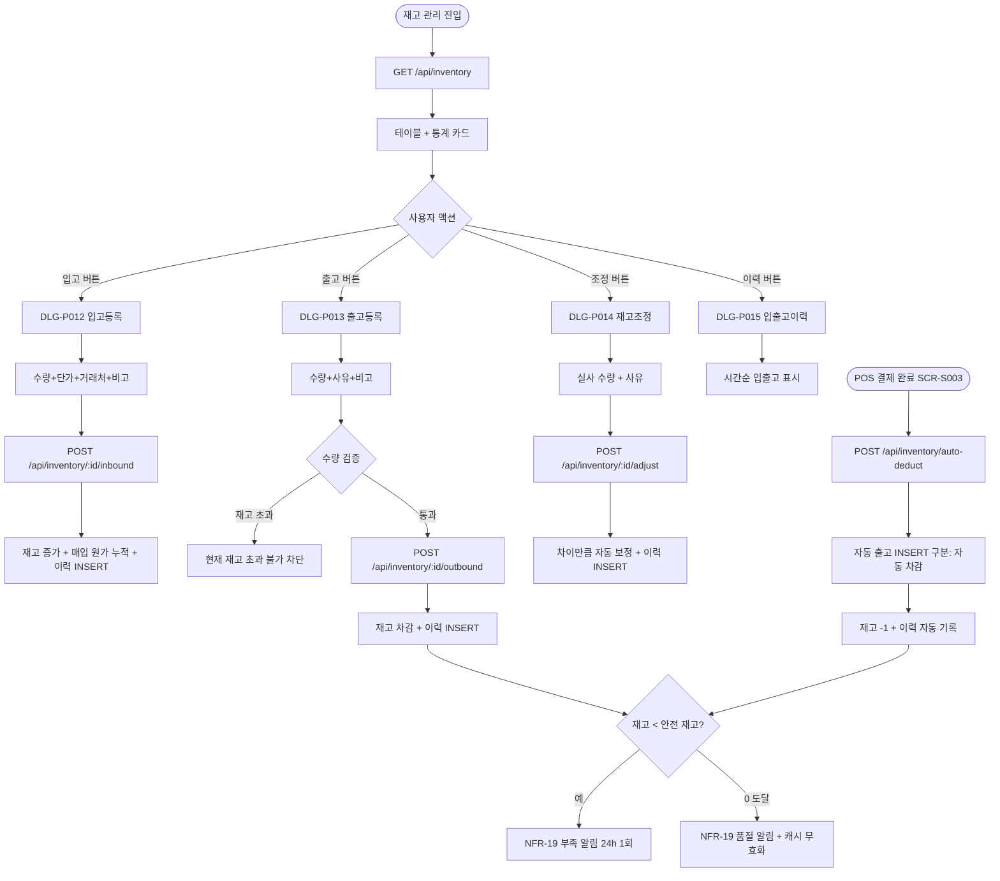
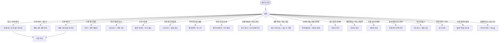

# SCR-P007 재고 관리 페이지

## 1. 화면 메타 정보

이 문서는 재고 관리 페이지에 대한 자기완결형 요구사항 정의서입니다. 다른 문서를 함께 보지 않아도 이 문서 한 장만으로 재고 관리의 모든 영역, 모든 모달, 모든 권한, 모든 예외 처리, 그리고 이 화면을 지탱하는 운영 정책까지 전부 이해하고 구현할 수 있도록 작성합니다.

| 항목 | 값 |
|---|---|
| 작성일 | 2026-05-22 |
| 버전 | v1.0 |
| 상태 | 최신 통합본 반영 (정합화 완료) |
| 도메인 | D05 상품관리 |
| 화면 ID | SCR-P007 |
| 화면명 | 재고 관리 |
| 화면 유형 | 일반 화면 (실물 상품 재고 관리) |
| 라우트 (URL) | `/products/inventory` |
| 플랫폼 | 데스크톱(기본), 태블릿, 모바일(카드형) |
| 우선순위 | P1 (출시 권장) |
| 기능코드 | PRD-07 (재고 관리 실물 상품 입출고 + 재고 조정) |
| 계약코드 | PRD-07 |
| 계약 상태 | 계약 범위 본기능 |
| 부모 기능 prefix | PRD |
| Lv1 코드 | PRD-07 |
| Lv2 / Lv3 세분화 | PRD-07-01 ~ PRD-07-09 (통계 카드, 필터/검색, 재고 현황 테이블, 입고 등록, 출고 등록, 재고 조정, 입출고 이력, 부족 알림, POS 자동 차감) |
| 연계 화면 | SCR-P001 상품관리, SCR-P002 상품등록수정, SCR-S002 POS 판매, SCR-S003 결제처리, SCR-S004 매출통계, SCR-097 감사로그, NFR-19 알림 센터 |
| 호출 다이얼로그 | DLG-P012 입고등록, DLG-P013 출고등록, DLG-P014 재고조정, DLG-P015 입출고이력 |

## 2. 화면 개요와 목적

재고 관리 페이지는 운동복, 보충제, 용품, 식음료 등 실물 상품(`category=PRODUCT`, `productType=GENERAL`)의 재고 현황을 관리하는 화면입니다. 현재 재고 수량을 확인하고 입고·출고 처리를 기록하며, 재고 실사 후 수동 조정(가감)이 가능합니다. 안전 재고 미달 시 경고 표시와 자동 알림으로 재주문 시점을 식별하고, 모든 입출고·조정 이력은 처리자·시간·사유와 함께 추적됩니다. POS 판매(SCR-S002·SCR-S003)에서 결제 완료 시 자동으로 차감되며, 매입 단가 입력으로 마진 분석(SCR-S004 매출통계)도 지원합니다.

이 화면이 다루는 운영 흐름은 다음과 같습니다. 신규 상품을 입고하는 매니저는 거래처에서 운동복 100벌이 들어왔을 때 DLG-P012 입고 등록으로 수량·단가·거래처·비고를 입력하고, POS 판매가 일어나면 카운터 직원이 결제 완료 시 자동 출고 처리로 재고가 -1 되도록 합니다. 유통기한 초과 보충제를 폐기하는 매니저는 DLG-P013 출고 등록에서 사유 "폐기"를 선택하고 비고를 필수 입력하며, 분기 실사를 진행하는 Owner(지점장)은 DLG-P014 재고 조정으로 시스템 100 vs 실물 95 같은 차이를 보정하고 사유 "분실/파손"을 기록합니다. 안전 재고 미달 알림을 받은 본사 마케팅은 알림 센터(NFR-19)에서 알림을 확인한 뒤 즉시 입고 등록으로 보충하고, 매입 원가 마진 분석이 필요한 매니저는 DLG-P015 입출고 이력에서 단가 평균과 판매가를 비교해 SCR-S004에 반영합니다.

이 화면은 실물 상품에만 적용되며 회원권·이용권 같은 무형 상품은 표시되지 않습니다. POS 자동 차감과 동시성 처리, 안전 재고 알림, 거래처별 매입 통계가 핵심 기능입니다.

## 3. 진입 경로와 인접 화면

이 화면에 진입하는 경로는 두 가지입니다.

첫 번째 경로는 사이드바입니다. "상품관리 > 재고 관리" 메뉴를 클릭하면 진입하며 URL은 `/products/inventory`입니다. 두 번째 경로는 알림 센터(NFR-19)에서 안전 재고 미달 알림 또는 품절 알림을 클릭한 경우이며, 해당 상품으로 필터된 상태로 진입합니다.

이 화면에서 빠져나가는 인접 화면으로는 POS 판매 화면(SCR-S002)과 결제 화면(SCR-S003)의 자동 차감 이벤트, 매출통계(SCR-S004)의 매입 원가 누적 + 마진 분석, 상품 관리(SCR-P001)에서 안전 재고 설정, 감사 로그(SCR-097)의 입출고·조정 이력 추적, 알림 센터(NFR-19)의 부족·품절 알림이 있습니다.

## 4. 레이아웃과 UI 구성

재고 관리 페이지는 위에서 아래로 세로형 레이아웃입니다.

가장 위에는 페이지 헤더가 있고, 좌측에 "재고 관리" 타이틀과 지점 컨텍스트가 표시됩니다.

헤더 아래에는 재고 통계 카드 3개가 가로로 배치됩니다. 첫 번째 카드는 "전체 품목 수"로 관리 중인 실물 상품 총 종류이고, 두 번째 카드는 "부족 재고"로 안전 재고 미달 품목 수, 세 번째 카드는 "품절"로 재고 0인 품목 수입니다. 부족 카드는 노랑/주황 톤, 품절 카드는 빨강 톤으로 시각적 경고를 줍니다.

통계 카드 아래에는 필터와 검색 영역이 있습니다. 상품 카테고리 필터, 재고 상태 필터(충분/부족/품절), 상품명 검색창, 거래처 필터(선택)가 가로로 배치됩니다.

필터 영역 아래에는 재고 현황 테이블이 있습니다. 컬럼은 좌측부터 상품명(실물 상품 이름), 카테고리(분류), 현재 재고(보유 수량), 안전 재고(최소 유지 기준), 재고 상태(충분/부족/품절 배지), 최근 입고일, 최근 입고 단가(매입 단가), 누적 매입 원가, 액션([입고]/[출고]/[조정]/[이력] 버튼)의 9개 컬럼입니다.

재고 상태 배지는 충분은 기본 톤, 부족은 노랑/주황(0 < 현재 재고 < 안전 재고), 품절은 빨강(현재 재고 = 0)으로 단계적으로 표시됩니다. 부족이나 품절인 행은 전체 행이 색상 톤으로 강조되어 멀리서도 즉시 식별 가능합니다.

각 행의 액션 영역에는 4개 버튼(입고·출고·조정·이력)이 작은 아이콘 형태로 가로 배치되며, 권한이 있는 사용자에게는 모두 활성화되고 권한이 부족하면 일부가 숨겨집니다.

테이블 아래에는 페이지네이션 영역이 있고, 일반 페이지네이션(20/50/100, 이전·다음, 총 건수)을 제공합니다.

## 5. 탭 구성과 탭별 동작

이 화면은 별도의 탭 구성이 없는 단일 화면입니다. 재고 상태 필터(충분/부족/품절)가 사실상 탭과 비슷한 역할을 하며, 선택값이 URL 쿼리 파라미터로 저장됩니다.

## 6. 버튼·아이콘·링크 액션 전체 정의

상품 카테고리 필터, 재고 상태 필터, 거래처 필터, 상품명 검색은 클릭/입력 시 즉시 테이블 재조회를 트리거합니다. 검색은 300ms 디바운스가 적용됩니다.

통계 카드는 클릭으로 해당 상태 필터를 자동 적용합니다. 부족 재고 카드를 누르면 재고 상태가 부족으로, 품절 카드를 누르면 품절로 자동 설정됩니다.

각 행의 [입고] 버튼은 DLG-P012 입고등록 모달을 호출합니다. 권한이 없는 일반 직원에게는 숨겨집니다.

각 행의 [출고] 버튼은 DLG-P013 출고등록 모달을 호출합니다. 일반 직원에게는 숨겨지며, POS 자동 차감은 별도 채널이므로 일반 직원도 결제를 통해 간접적으로 출고를 일으킬 수 있습니다.

각 행의 [조정] 버튼은 DLG-P014 재고조정 모달을 호출합니다. 일반 직원에게는 숨겨집니다.

각 행의 [이력] 버튼은 DLG-P015 입출고이력 모달을 호출하여 그 상품의 입출고·조정 이력을 시간순으로 표시합니다.

상품명 셀은 클릭 시 SCR-P002 상품 등록/수정으로 점프하여 안전 재고 설정이나 매입 단가 기본값을 변경할 수 있습니다.

페이지네이션 컨트롤은 일반 동작(이전·다음·페이지 번호 직접 입력)을 따릅니다.

모든 버튼은 클릭 후 응답이 돌아오기 전까지 자동으로 비활성화되며, 동시 입출고로 인한 race condition 방지를 위한 락이 백엔드에 적용됩니다.

## 7. 호출되는 모달 동작

### 7-1. DLG-P012 입고등록 모달

[입고] 버튼을 눌렀을 때 호출됩니다. 모달에서는 입고 수량(필수), 입고일(기본 오늘), 단가(선택, 마진 분석용), 거래처(선택), 비고(선택)를 입력합니다. 저장 시 재고가 갱신되고 매입 원가가 누적되며, 입출고 이력에 INSERT 됩니다. 단가 0 입력은 빨강 인라인 + 비고 필수, 단가 미입력은 노랑 경고 "단가 입력 시 마진 분석 가능"입니다.

### 7-2. DLG-P013 출고등록 모달

[출고] 버튼을 눌렀을 때 호출됩니다. 모달에서는 출고 수량(필수), 출고 사유(판매/폐기/이동/내부 사용/분실), 출고일(기본 오늘), 비고(폐기/분실 시 필수)를 입력합니다. 출고 수량이 현재 재고를 초과하면 빨강 인라인 "현재 재고 {개수}개를 초과할 수 없어요" + 저장 차단입니다. 저장 시 재고가 차감되고 이력에 기록되며, 부족 재고 도달 시 NFR-19 알림이 발송됩니다.

### 7-3. DLG-P014 재고조정 모달

[조정] 버튼을 눌렀을 때 호출됩니다. 실사 후 실제 수량을 입력하면 시스템 수량과의 차이만큼 자동으로 보정됩니다(양수는 추가, 음수는 감소). 사유 입력은 필수이며 차이 0은 "변경 사항이 없어요" + 저장 차단, 결과가 음수가 되도록 입력하면 차단됩니다.

### 7-4. DLG-P015 입출고이력 모달

[이력] 버튼을 눌렀을 때 호출됩니다. 그 상품의 입출고·조정 이력이 시간순(최신 위)으로 표시되며, 컬럼은 일시·구분(입고/출고/조정/자동 차감)·수량(+N/-N)·사유·단가·처리자·잔량입니다. 1년 경과 이력은 SCR-097 감사 로그에서 조회 가능하며, 모달 내에서는 페이지네이션으로 추가 로드합니다. 1만 건을 초과하면 페이지네이션 또는 기간 필터로 처리됩니다.

## 8. 토스트와 확인 팝업과 알럿

성공 토스트는 "입고가 등록되었어요", "출고가 등록되었어요", "재고가 조정되었어요" 같은 짧은 문구로 결과를 알려 줍니다.

실패 토스트는 "재고 부족", "권한이 없어요", "다른 직원이 동시에 처리했어요", "POS 판매로 인한 자동 차감 실패" 같은 빨강 톤 안내가 표시됩니다.

인라인 검증은 모달 내부에서 출고 수량 초과, 단가 0, 사유 미선택, 비고 미입력(폐기/분실), 재고 조정 차이 0 같은 검증 실패에 사용됩니다.

확인 팝업은 별도로 사용되지 않으며 모든 처리는 모달 안에서 저장 버튼 클릭으로 즉시 일어납니다.

알럿은 권한 없는 계정의 직접 URL 진입 시 표시되며 대시보드로 자동 이동됩니다.

부족 재고 알림은 NFR-19 알림 센터로 발송되며 동일 상품 24시간에 1회로 제한되어 스팸을 방지합니다.

품절 알림은 재고 0 도달 시 즉시 발송되며 키오스크와 회원앱에 "품절" 배지가 자동으로 표시됩니다.

## 9. 데이터 흐름과 외부 연동

화면 진입 시 `GET /api/inventory`로 재고 현황 목록을 조회합니다. 응답에는 실물 상품 배열, 통계 카드 카운트(전체/부족/품절)가 함께 내려옵니다.

각 상품의 입고는 `POST /api/inventory/:id/inbound`, 출고는 `POST /api/inventory/:id/outbound`, 조정은 `POST /api/inventory/:id/adjust`로 처리됩니다.

입출고 이력 조회는 `GET /api/inventory/:id/history`, 통계 카드는 `GET /api/inventory/stats`, 부족 재고 목록은 `GET /api/inventory/low-stock`으로 조회됩니다.

POS 자동 차감은 SCR-S003 결제 완료 이벤트에 의해 트리거되어 `POST /api/inventory/auto-deduct`가 호출됩니다. 자동 출고 INSERT 시 구분이 "자동 차감", 처리자가 결제자, 잔량이 갱신 후로 기록됩니다.

부족 재고 알림은 출고 후 현재 재고 < 안전 재고 도달 시 NFR-19 알림 센터로 발송되며 동일 상품 24시간에 1회로 제한됩니다.

품절 알림은 재고 0 도달 시 즉시 발송되고 키오스크·회원앱 캐시가 무효화되어 "품절" 배지가 자동으로 표시됩니다. 카탈로그(PRD-05)에서도 "품절" 배지가 자동 표시됩니다.

매입 원가 평균은 입고 INSERT 시 가중 평균 매입가가 자동 갱신되어 SCR-S004 매출통계에서 마진율 = (판매가 - 평균 매입가) / 판매가로 계산됩니다.

거래처별 매입 통계는 거래처 텍스트 입력값으로 집계되며, 거래처 미입력은 "미지정" 그룹으로 분류됩니다. 오타가 있으면 통계가 흩어지므로 자동 완성 기능이 권장됩니다.

이력 1년 경과는 매월 1일 04:00에 SCR-097 감사 로그로 아카이브됩니다.

POS 자동 차감 시 동시성 충돌은 비관적 락으로 race condition을 방지하며, 동시 결제로 재고 부족이 발생하면 결제 트랜잭션이 롤백되고 "재고 부족" 토스트가 표시됩니다.

회원앱과 키오스크에서는 재고 정보가 직접 노출되지 않고 "재고 부족" 또는 "품절" 배지만 표시됩니다. 어드민 전용 정보로 유지됩니다.

화면에서 호출하는 주요 API 엔드포인트는 `GET /api/inventory`, `POST /api/inventory/:id/inbound`, `POST /api/inventory/:id/outbound`, `POST /api/inventory/:id/adjust`, `GET /api/inventory/:id/history`, `GET /api/inventory/stats`, `GET /api/inventory/low-stock`, `POST /api/inventory/auto-deduct`입니다.

모든 입출고·조정·자동 차감은 감사 로그(SCR-097)에 INSERT 됩니다. 기록 필드는 `actor_id, product_id, type, quantity, before, after, reason`입니다.

매일 09:00에는 일일 부족·품절 리포트 Cron이 발송되어 운영자에게 종합 알림이 전달됩니다.

## 10. 화면 상태와 예외 처리

로딩 중 상태는 테이블 자리에 스켈레톤이 표시됩니다.

빈 상태는 등록된 실물 상품이 0개일 때로, "관리 중인 상품이 없어요" 안내가 표시됩니다.

부족 재고 경고 상태는 안전 재고 미달 품목이 존재할 때로 해당 행이 노랑/주황 톤으로 강조됩니다.

품절 경고 상태는 재고 0 품목이 존재할 때로 해당 행이 빨강 톤으로 강조됩니다.

처리 중 상태는 입고·출고·조정 버튼 클릭 후 응답을 기다리는 상태로 버튼이 로딩 상태로 전환됩니다.

이력 페이지네이션 상태는 DLG-P015에서 1만 건 초과 이력을 페이지네이션으로 탐색하는 상태입니다.

본사 통합 모드 + 등록 시도 상태는 본사 슈퍼관리자가 통합 모드에서 입출고를 시도한 상태로, "지점을 먼저 선택해주세요" 안내가 표시됩니다.

권한 부족 상태는 일반 직원이 화면에 진입한 상태로 액션 버튼이 모두 숨겨집니다.

예외 케이스별 처리는 다음과 같습니다. 출고 수량이 현재 재고를 초과하면 빨강 인라인 "현재 재고 초과 불가" + 저장 차단입니다. POS 자동 차감 + 재고 0은 결제 사전 검증으로 차단되어 결제 자체가 막힙니다. 재고 조정 차이 0은 "변경 사항 없음" + 저장 차단, 재고 조정 음수 결과(현재 재고 < 차이)는 차단됩니다. 단가 미입력 입고는 매입 원가가 누적되지 않고 노랑 경고가 표시됩니다. 단가 0 입력은 빨강 인라인 + 비고 필수입니다. 안전 재고 미설정 상품은 부족 알림이 발송되지 않고 노랑 경고 "안전 재고 설정 권유"가 표시됩니다. POS 동시성 충돌은 결제 롤백 + 토스트 안내로 처리됩니다. 이력 1만 건 초과는 페이지네이션 또는 기간 필터로 처리됩니다. 상품 비활성 + 재고 보유는 재고 관리는 정상이지만 신규 판매만 차단되며, 잔여 재고 출고는 "이동" 사유로 처리됩니다. 상품 삭제 시도 + 재고 보유는 "재고 {개수}개 보유 중" 안내와 함께 출고 후 삭제 안내가 표시됩니다. 거래처 텍스트 자유 입력 + 오타는 통계가 흩어지므로 자동 완성으로 정규화가 권장됩니다. 출고 사유 미선택은 인라인 "사유 선택 필수" + 저장 차단, 폐기/분실 + 비고 미입력은 인라인 "비고 입력 필수" + 저장 차단입니다. 재고 조정 + 사유 미입력은 인라인 "사유 입력 필수" + 저장 차단입니다. 권한 없음 + 직접 URL은 읽기 전용 모드입니다. 이력 조회 + 다른 사용자 입출고 진행 중은 5초 캐시 + [새로고침] 버튼으로 처리됩니다. 본사 통합 모드 + 입출고 시도는 "지점을 먼저 선택해주세요" + 차단입니다. 회원앱 재고 노출 시도는 어드민 전용 정보로 회원앱에는 노출되지 않습니다.

## 11. 권한별 처리

superAdmin와 primary는 전체 화면과 통계를 모두 사용할 수 있으며 입고·출고·조정·이력이 모두 가능합니다.

Owner(지점장)은 자기 지점의 재고를 입고·출고·조정·이력 모두 처리할 수 있습니다.

매니저(manager)도 동일하게 자기 지점의 재고를 모두 처리할 수 있습니다.

재고 관리 권한이 별도로 부여된 직원은 입고·출고·조정이 가능합니다.

일반 직원은 재고 현황 조회만 가능하며, 출고는 POS 결제를 통한 자동 차감으로만 일어납니다.

읽기 전용(readonly)은 이 화면 자체에 접근할 수 없으며, 직접 URL 접근 시 대시보드로 자동 이동됩니다.

권한이 부족한 경우 사용자 경험은 일관됩니다. 버튼이 권한 부족 시 보이지 않거나 비활성화되고, 직접 URL 접근 시 403 응답으로 "권한이 없어요" 토스트가 표시됩니다.

## 12. 메인 흐름

## 13. 에러와 예외 흐름

## 14. 핵심 디자인 요청사항

재고 상태 배지는 충분(기본 톤)·부족(노랑/주황)·품절(빨강)의 단계적 색상으로 표시되어 멀리서도 즉시 인식 가능해야 합니다.

부족이나 품절 행 전체가 색상 톤으로 강조되어 운영자가 스크롤하지 않고도 문제 상품을 식별할 수 있어야 합니다.

통계 카드 3개는 동일 크기·동일 그리드로 배치되며 부족과 품절 카드는 각 색상 톤(노랑·빨강)으로 즉시 경고를 줍니다.

액션 버튼 4개는 작은 아이콘 형태로 가로 배치되며 입고는 녹색·출고는 파랑·조정은 보라·이력은 회색 톤으로 시각적으로 구분됩니다.

매입 원가 누적과 최근 입고 단가는 우측 정렬로 표시되어 숫자 비교가 쉽게 이뤄집니다.

DLG-P015 입출고 이력은 타임라인 형태로 표시되어 입고는 위(+)·출고는 아래(-)·조정은 중앙으로 시각적 방향성을 알리고, 자동 차감 이력은 별도 아이콘으로 구분됩니다.

모바일에서는 테이블이 카드형 리스트로 자동 전환되어 한 카드에 상품명·카테고리·재고 상태가 위에, 현재 재고·안전 재고·최근 입고일이 아래에 표시됩니다.

## 15. 운영 정책 (이 화면에 연결된 부분)

안전 재고 미달 경고 정책은 자동으로 노랑/주황 색상이 표시되고 NFR-19 알림 센터로 발주 권유 알림이 발송된다는 것입니다. 동일 상품 24시간 1회로 스팸이 방지됩니다.

품절 자동 표시 정책은 재고 0 품목은 자동 품절 표시되고 카운트에 포함되며 키오스크·회원앱·카탈로그에 "품절" 배지가 자동으로 표시된다는 것입니다.

재고 조정 사유 필수화 정책은 모든 재고 조정에 사유 입력이 필수이며 감사 로그에 기록된다는 것입니다.

출고 사유 분류 정책은 판매/폐기/이동/내부 사용/분실의 5종으로 구분되어 통계에 반영된다는 것입니다. 폐기와 분실은 비고 입력이 필수이며 판매·이동·내부 사용은 선택입니다.

매입 단가 활용 정책은 입고 시 단가가 선택이지만 입력 시 매입 원가 추적에 활용되어 SCR-S004 마진 분석에 사용된다는 것입니다.

POS 판매 자동 차감 정책은 SCR-S003 결제 완료 이벤트가 자동 출고 INSERT를 트리거하여 구분 "자동 차감", 처리자 결제자, 잔량 갱신 후로 기록한다는 것입니다.

출고 사유 비고 필수 정책은 폐기/분실은 비고 입력 필수, 판매/이동/내부 사용은 선택입니다.

재고 조정 차이 계산 정책은 실사 수량 - 시스템 수량으로 양수는 추가·음수는 감소이며 0이면 변경 없음으로 차단됩니다.

안전 재고 정책은 상품 등록(PRD-EXT-01)에서 설정하며 미설정 시 부족 알림이 발송되지 않고 노랑 경고로 설정이 권유됩니다.

부족 알림 트리거 정책은 출고 후 현재 재고 < 안전 재고 시 NFR-19로 발송되며 동일 상품 24시간 1회입니다.

품절 알림 트리거 정책은 재고 0 도달 시 즉시 알림 + 키오스크/회원앱에 "품절" 배지가 표시되는 것입니다.

매입 원가 누적 정책은 입고 시 단가 × 수량이 누적되며 SCR-S004 매출통계에서 마진율 = (판매가 - 평균 매입가) / 판매가로 계산됩니다.

거래처 정보 정책은 텍스트 자유 입력이며 거래처별 통계는 정규화 후 집계됩니다. 오타로 통계가 흩어지지 않도록 자동 완성이 권장됩니다.

이력 보존 정책은 최근 1년은 즉시 조회이며 1년 경과는 SCR-097 감사 로그에서 조회됩니다.

재고 음수 차단 정책은 현재 재고 - 출고 수량 ≥ 0이 필수이며 음수 결과는 저장 차단됩니다.

권한별 액션 정책은 슈퍼관리자/Owner(지점장)/매니저/재고 관리 권한자는 입고·출고·조정·이력 모두 가능, 일반 직원은 조회만(출고는 POS 자동만), readonly는 접근 불가입니다.

POS 자동 차감 동시성 정책은 동시 결제로 재고 부족이 발생하면 결제 트랜잭션 롤백 + 토스트 안내로 처리됩니다. 비관적 락으로 race condition을 방지합니다.

상품 비활성 + 재고 보유 정책은 재고 관리는 정상이고 신규 판매만 차단되며, 잔여 재고 출고는 "이동" 사유로 처리합니다.

상품 삭제 + 재고 보유 정책은 차단됩니다. 재고를 0으로 만든 후에만 삭제 가능합니다.

본사·지점 컨텍스트 정책은 재고가 지점 단위로 관리되며 본사 통합 모드는 조회만 가능하고 입출고는 지점 컨텍스트가 필수입니다.

회원앱·키오스크 연동 정책은 재고 정보가 어드민 전용이며 카탈로그·키오스크에는 "재고 부족" / "품절" 배지만 표시됩니다.

감사 로그 정책은 입고·출고·조정·자동 차감 모두 SCR-097에 기록되며 `actor_id, product_id, type, quantity, before, after, reason`이 INSERT 됩니다.

이상의 모든 정책은 이 화면을 구현하고 운영하는 사람이 별도 문서 없이 이 한 장만 보면 이해할 수 있도록 풀어 적었습니다.
