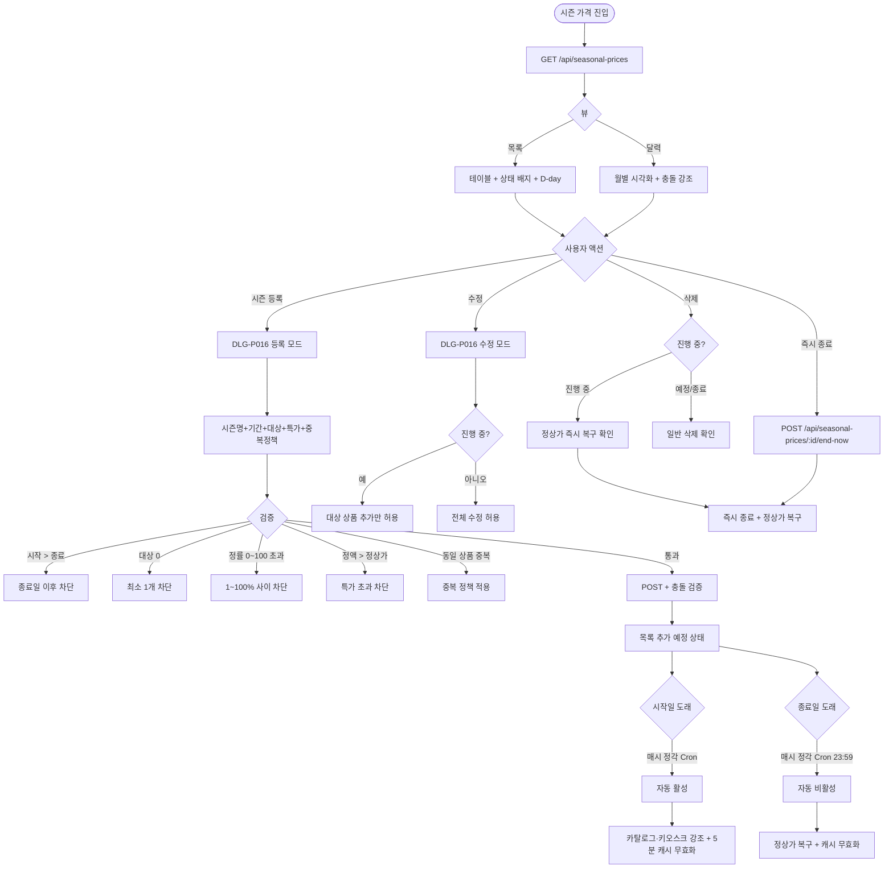

# SCR-P008 시즌 가격 관리 페이지

## 1. 화면 메타 정보

이 문서는 시즌 가격 관리 페이지에 대한 자기완결형 요구사항 정의서입니다. 다른 문서를 함께 보지 않아도 이 문서 한 장만으로 시즌 가격 관리의 모든 영역, 모든 모달, 모든 권한, 모든 예외 처리, 그리고 이 화면을 지탱하는 운영 정책까지 전부 이해하고 구현할 수 있도록 작성합니다.

| 항목 | 값 |
|---|---|
| 작성일 | 2026-05-22 |
| 버전 | v1.0 |
| 상태 | 최신 통합본 반영 (정합화 완료) |
| 도메인 | D05 상품관리 |
| 화면 ID | SCR-P008 |
| 화면명 | 시즌 가격 관리 |
| 화면 유형 | 일반 화면 (목록 + 달력 뷰) |
| 라우트 (URL) | `/products/seasonal-price` |
| 플랫폼 | 데스크톱(기본), 태블릿, 모바일(목록 뷰 자동) |
| 우선순위 | P1 (출시 권장) |
| 기능코드 | PRD-08 (시즌 가격 관리 기간 한정 특별가) |
| 계약코드 | PRD-08 |
| 계약 상태 | 계약 범위 본기능 |
| 부모 기능 prefix | PRD |
| Lv1 코드 | PRD-08 |
| Lv2 / Lv3 세분화 | PRD-08-01 ~ PRD-08-08 (시즌 목록, 달력 뷰, 등록, 수정, 삭제, 자동 적용, 중복 검증, 카탈로그/키오스크 강조) |
| 연계 화면 | SCR-P001 상품관리, SCR-P004 할인설정, SCR-P005 상품카탈로그, SCR-S003 결제처리, SCR-S004 매출통계, SCR-097 감사로그, NFR-19 알림 센터, 회원앱 상품 화면, 키오스크 |
| 호출 다이얼로그 | DLG-P016 시즌가격등록수정 |

## 2. 화면 개요와 목적

시즌 가격 관리 페이지는 여름 특가, 신년 이벤트, 가정의 달 등 특정 기간에만 적용되는 시즌 특별 가격을 설정하고 관리하는 화면입니다. 기간(시작일~종료일), 대상 상품(다중 선택 또는 카테고리 일괄), 특가 금액(정액) 또는 할인율(정률)을 지정하여 시작일 도래 시 자동으로 활성화되고 종료일 후 자동으로 정상가로 복구되도록 합니다. 일반 할인(PRD-04)·쿠폰·마일리지와의 중복 정책은 우선순위 규칙으로 처리되며, 진행 중 시즌은 카탈로그(PRD-05)·키오스크·결제(SCR-S003)에 자동 강조 표시됩니다. 달력 뷰로 월별 캠페인 일정을 시각화하고, 종료된 시즌도 회색 처리되어 이력으로 보존됩니다.

이 화면이 다루는 운영 흐름은 다음과 같습니다. 본사 마케팅은 여름 시즌 특가 캠페인으로 6~8월 헬스 6개월 회원권 -20%를 등록하고 자동 활성 ON으로 설정해 시작일 도래 시 자동 활성, 종료일 23:59 자동 종료가 되도록 합니다. 신년 이벤트를 등록하는 Owner(지점장)은 1/1~1/15 모든 회원권 -15%와 마케팅 메시지 발송을 동시에 설정하고, 가정의 달 패밀리 시즌을 운영하는 본사 마케팅은 5월 패밀리 회원권 25%를 MBR-EXT-02 가족 그룹과 연계해 가족 회원에게 자동 적용합니다. 블랙프라이데이 24시간 단기 특가를 진행하는 매니저는 카탈로그 카운트다운 표시가 자동으로 들어가게 하고, FC는 재등록 우대 시즌으로 만료 30일 이내 회원에게 정률 10%가 자동 적용되도록 설정합니다. 시즌 종료 후 정산을 검토하는 슈퍼관리자는 회색 처리된 종료 시즌을 매출통계(SCR-S004)에서 시즌 매출·할인액·전환율로 분석하고, 충돌을 검토하는 매니저는 달력 뷰의 빨강 강조로 동일 상품에 겹친 시즌을 식별합니다. 진행 중 시즌의 일부 수정은 대상 상품 추가만 가능하고 기간·금액 변경은 차단되어 운영 혼선이 방지되며, 이슈가 발생하면 진행 중 시즌의 종료일을 오늘로 변경해 즉시 종료하고 정상가로 복구할 수 있습니다.

이 화면은 캠페인 자동화·중복 정책·달력 시각화·매출 분석이 결합된 시즌 마케팅 운영 도구로 동작해야 합니다.

## 3. 진입 경로와 인접 화면

이 화면에 진입하는 경로는 두 가지입니다.

첫 번째 경로는 사이드바입니다. "상품관리 > 시즌 가격 관리" 메뉴를 클릭하면 진입하며 URL은 `/products/seasonal-price`입니다. 두 번째 경로는 매출통계(SCR-S004)에서 시즌별 매출 분석 행을 클릭한 경우로, 해당 시즌으로 필터된 상세 화면이 함께 표시됩니다.

이 화면에서 빠져나가는 인접 화면으로는 카탈로그(SCR-P005)의 시즌 특가 자동 강조 결과 확인, 결제 화면(SCR-S003)의 가격 락인 적용 결과, 할인 설정(SCR-P004)의 중복 정책 검토, 매출통계(SCR-S004)의 시즌별 매출 분석, 감사 로그(SCR-097)의 변경 이력 추적, 알림 센터(NFR-19)의 시즌 D-1·시작·종료 알림이 있습니다.

## 4. 레이아웃과 UI 구성

시즌 가격 관리 페이지는 위에서 아래로 세로형 레이아웃입니다.

가장 위에는 페이지 헤더가 있습니다. 좌측에 "시즌 가격 관리" 타이틀, 우측에 뷰 전환 토글(목록/달력)과 "시즌 특가 등록" 버튼이 배치됩니다. 권한이 없는 계정에서는 등록 버튼이 숨겨집니다.

목록 뷰 본문에는 시즌 특가 목록 테이블이 있습니다. 컬럼은 좌측부터 시즌명(예: "2026 여름 특가"), 적용 기간(시작일 ~ 종료일), 대상 상품({개수}개), 특가 금액/할인율, 상태(예정/진행 중/종료), 상태별 D-day(예정 시 시작 D-N, 진행 중 시 종료 D-N, 종료 시 종료 후 N일), 액션(수정·삭제)의 7개 컬럼입니다.

상태 배지는 예정(파랑)·진행 중(초록)·종료(회색)의 색상으로 단계적으로 표시됩니다. 진행 중 시즌은 목록 상단에 고정 또는 강조 표시되어 운영자가 즉시 인지할 수 있습니다.

각 행 호버 시 액션 아이콘(수정·삭제)이 우측에 나타납니다. 권한이 없는 계정에서는 아이콘이 숨겨집니다.

달력 뷰 본문에는 월별 달력에서 시즌 특가 기간이 시각화됩니다. 각 시즌은 색상 막대로 시작일~종료일이 표시되고, 동일 상품 또는 카테고리에 2개 이상 시즌이 겹친 기간은 빨강으로 강조됩니다. 달력은 이전 달/다음 달 화살표로 탐색할 수 있고, 클릭한 날짜의 활성 시즌이 사이드 패널에 요약 표시됩니다.

테이블 아래에는 페이지네이션이 있고 일반 동작(20/50/100, 이전·다음, 총 건수)을 제공합니다.

진행 중 시즌이 있는 경우 페이지 상단에 강조 배너가 표시되어 "현재 N개 시즌이 진행 중입니다" 안내와 함께 진행 중 시즌 목록 점프 링크가 제공됩니다.

모바일에서는 달력 뷰가 자동으로 목록 뷰로 전환됩니다.

## 5. 탭 구성과 탭별 동작

이 화면의 1차 탭은 뷰 전환 토글(목록/달력)입니다. 목록 뷰는 테이블 기반 조회·관리에 최적화되고, 달력 뷰는 캠페인 일정 시각화와 충돌 식별에 최적화됩니다. 두 뷰 간 전환은 즉시 일어나며 필터·검색 상태가 유지됩니다.

향후 확장으로 상태별 필터 탭(예정/진행 중/종료)이 추가될 수 있으나 현재 정합 범위에서는 단일 목록입니다.

## 6. 버튼·아이콘·링크 액션 전체 정의

"시즌 특가 등록" 버튼은 페이지 헤더 우측에 위치하며 클릭 시 DLG-P016 시즌가격등록수정 모달을 등록 모드로 호출합니다. 권한이 없는 계정에서는 버튼이 숨겨집니다.

각 행의 수정 아이콘은 DLG-P016 시즌가격등록수정 모달을 수정 모드로 호출하여 그 시즌 정보가 채워진 폼을 띄웁니다. 진행 중 시즌인 경우 대상 상품 추가만 가능하고 기간·금액 변경은 차단됩니다.

각 행의 삭제 아이콘은 삭제 확인 다이얼로그를 호출합니다. 진행 중 시즌 삭제 시 "정상가로 즉시 복구됩니다" 안내가 표시되며 확인 시 즉시 종료 처리되어 정상가로 복구됩니다. 권한이 없는 계정에서는 아이콘이 숨겨집니다.

뷰 전환 토글(목록/달력)은 클릭 시 즉시 본문이 전환됩니다. 달력 뷰에서는 이전 달/다음 달 화살표로 탐색 가능하고 특정 날짜 클릭 시 사이드 패널에 활성 시즌이 표시됩니다.

진행 중 시즌의 "즉시 종료" 버튼(별도 액션)은 진행 중 시즌의 종료일을 오늘로 변경해 즉시 종료하는 기능으로, 이슈 발생 시 운영자가 빠르게 시즌을 멈출 수 있습니다.

자동 활성 토글은 모달 내부의 옵션으로 ON일 때 시작일 도래 시 자동 활성, OFF일 때 수동 활성([활성화] 버튼)이 필요합니다. 자동 비활성은 OFF여도 종료일 도달 시 항상 작동합니다.

각 시즌 행의 대상 상품 셀에 마우스를 올리면 적용 상품 목록이 툴팁으로 펼쳐집니다.

페이지네이션 컨트롤은 일반 동작을 따릅니다.

모든 버튼은 응답이 돌아오기 전까지 자동으로 비활성화됩니다.

## 7. 호출되는 모달 동작

### 7-1. DLG-P016 시즌가격등록수정 모달

등록 또는 수정 버튼을 눌렀을 때 호출됩니다. 모달에서는 시즌명(필수, 1~30자), 시작일~종료일(필수, 날짜 범위), 대상 상품(다중 선택 또는 카테고리 일괄), 특가 유형(정액/정률), 특가 값(금액 또는 %), 중복 정책(일반 할인과 중복 허용/단독/큰 것만), 비고(textarea), 자동 활성 토글(ON/OFF)을 입력합니다. 저장 시 충돌 검증(동일 상품 중복 시즌)이 이뤄지고 통과하면 목록에 추가되거나 갱신됩니다. 진행 중 시즌 수정 시에는 대상 상품 추가만 허용되고 기간·금액 변경은 차단됩니다. 모든 변경은 감사 로그(SCR-097)에 기록됩니다.

### 7-2. 시즌 삭제 확인 다이얼로그

삭제 아이콘 클릭 시 호출됩니다. 진행 중 시즌인 경우 "정상가로 즉시 복구됩니다" 안내가 표시되고, 예정 또는 종료된 시즌은 단순 삭제 확인입니다. 진행 중 시즌 삭제 시 이미 결제 완료된 회원에게는 영향이 없으며 가격이 락인되어 유지됩니다.

## 8. 토스트와 확인 팝업과 알럿

성공 토스트는 "시즌이 등록되었어요", "시즌이 수정되었어요", "시즌이 즉시 종료되었어요", "시즌이 삭제되었어요" 같은 짧은 문구로 결과를 알려 줍니다.

실패 토스트는 "저장에 실패했어요", "권한이 없어요", "진행 중 시즌의 기간 변경은 불가능합니다", "동일 상품 중복 시즌이 있습니다" 같은 빨강 톤 안내가 표시됩니다.

인라인 검증 메시지는 모달 내부에서 시작일 > 종료일, 대상 상품 0개, 정률 0~100 초과/이하, 정액 0 이하, 정액 > 정상가(음수 결제) 같은 모든 검증 실패에 사용됩니다.

확인 팝업은 진행 중 시즌 즉시 삭제 시 "정상가로 즉시 복구됩니다" 안내가 사용됩니다.

알럿은 권한 없는 계정의 직접 URL 진입 시 표시되며 대시보드로 자동 이동됩니다.

진행 중 시즌 강조 배너는 페이지 상단에 표시되어 "현재 N개 시즌이 진행 중입니다" 안내와 점프 링크를 제공합니다.

종료일 자동 비활성 실패(시스템 오류) 시에는 운영자에게 알림이 발송되고 화면에 "자동 종료에 실패했습니다, 수동 종료가 필요합니다" 안내가 표시됩니다.

## 9. 데이터 흐름과 외부 연동

화면 진입 시 `GET /api/seasonal-prices`로 시즌 특가 목록을 조회합니다. 응답에는 시즌 배열, 상태별 카운트, 진행 중 시즌 정보가 포함됩니다.

진행 중 시즌만 조회는 `GET /api/seasonal-prices/active`, 달력 뷰는 `GET /api/seasonal-prices/calendar?year=&month=`로 월별 데이터를 조회합니다.

시즌 등록은 `POST /api/seasonal-prices`, 수정은 `PUT /api/seasonal-prices/:id`, 삭제는 `DELETE /api/seasonal-prices/:id`로 처리됩니다.

진행 중 시즌의 즉시 종료는 `POST /api/seasonal-prices/:id/end-now`로 처리되어 종료일이 즉시 오늘로 변경되고 정상가가 복구됩니다.

충돌 검증은 `POST /api/seasonal-prices/conflicts`로 등록·수정 전에 동일 상품 중복 시즌 여부를 확인합니다.

자동 활성/비활성은 매시 정각 Cron 배치로 처리됩니다. 시작일 도래 시 자동 활성, 종료일 23:59 자동 비활성으로 전환되어 운영자가 수동으로 켜고 끄지 않아도 됩니다. 자동 활성 토글 OFF인 시즌도 자동 비활성은 작동합니다.

카탈로그·키오스크 자동 강조는 진행 중 시즌에 자동 적용되어 "할인" 배지 + 정상가 취소선 + 특가 표시가 자동 렌더링됩니다. 종료 후 5분 이내에 캐시가 무효화되어 정상가로 복구됩니다.

결제 시점 가격 락인은 결제 트랜잭션 시작 시점의 시즌 가격으로 결제가 처리되어 결제 중 시즌이 종료되어도 영향이 없습니다.

PRD-04 일반 할인과의 중복 정책은 결제 시점에 우선순위 규칙(시즌가격 → 할인 → 쿠폰 → 마일리지)으로 처리되며, 중복 토글(중복 허용/단독/큰 것만)에 따라 결합 방식이 달라집니다.

D-1 알림은 NFR-19 알림 센터로 운영자에게 발송되어 캠페인 종료 임박을 안내합니다. 회원앱 푸시 알림은 시즌 시작·종료 시 옵션으로 발송할 수 있습니다.

본사 정의 시즌은 전 지점에 자동 동기화되어 모든 지점에서 동일하게 적용됩니다. Owner(지점장) 정의 시즌은 소속 지점에만 적용됩니다.

재등록 우대 시즌은 만료 30일 이내 회원에게 자동 매칭되어 결제 시점에 자동 적용됩니다.

카운트다운 표시는 종료 24시간 이내 시즌에 자동 적용되어 카탈로그·키오스크에 카운트다운이 강조됩니다.

종료된 시즌은 회색 처리 + 1년 보존이 적용되며 1년 경과 시 SCR-097 감사 로그로 이관됩니다.

화면에서 호출하는 주요 API는 `GET /api/seasonal-prices`, `POST /api/seasonal-prices`, `PUT /api/seasonal-prices/:id`, `DELETE /api/seasonal-prices/:id`, `GET /api/seasonal-prices/active`, `POST /api/seasonal-prices/:id/end-now`, `GET /api/seasonal-prices/calendar?year=&month=`, `POST /api/seasonal-prices/conflicts`입니다.

모든 등록·수정·삭제·즉시 종료는 감사 로그(SCR-097)에 기록되고, 매출통계(SCR-S004)에는 시즌별 매출·할인액·전환율이 집계됩니다.

## 10. 화면 상태와 예외 처리

로딩 중 상태는 테이블 자리에 스켈레톤이 표시됩니다.

빈 상태는 등록된 시즌 특가가 0개일 때로, "등록된 시즌 특가가 없어요" 안내와 권한자에게 "시즌 특가 등록" CTA가 표시됩니다.

진행 중 있음 상태는 현재 적용 중 시즌이 1개 이상일 때로, 상단 배너 또는 상단 고정 강조가 표시됩니다.

종료된 이력 상태는 과거 시즌이 회색 처리되어 표시되는 상태입니다.

달력 뷰 상태는 월별 시각화가 표시된 상태입니다.

충돌 강조 상태는 동일 상품 또는 카테고리에 2개 이상 시즌이 겹친 기간이 빨강으로 강조된 상태입니다.

자동 비활성 실패 상태는 종료일 도래 시 자동 비활성이 시스템 오류로 실패한 상태로, 운영자에게 알림이 발송되고 수동 종료 안내가 표시됩니다.

동기화 중 상태는 카탈로그·키오스크 갱신이 진행 중인 상태입니다.

예외 케이스별 처리는 다음과 같습니다. 시작일 > 종료일은 "종료일은 시작일 이후여야 해요" + 저장 차단입니다. 시작일이 과거이면 노랑 경고 "즉시 활성됩니다"가 표시되지만 저장은 가능합니다(소급 적용 의도). 시작일 = 종료일(당일 특가)은 허용되어 당일 23:59에 종료됩니다. 대상 상품 0개는 "최소 1개 상품을 선택해주세요" + 저장 차단입니다. 카테고리 일괄 선택 + 비활성 상품 포함은 비활성 상품이 자동 제외되고 안내가 표시됩니다. 동일 상품 + 중복 시즌은 중복 정책 토글에 따라 처리되며 충돌 경고가 표시됩니다. 정률 100% 초과 또는 0 이하는 "1~100% 사이" + 차단, 정액 0 이하는 "0보다 큰 금액" + 차단, 정액 > 정상가(음수 결제)는 "특가가 정상가를 초과합니다" + 차단입니다. 진행 중 시즌 기간 변경 시도는 "진행 중 시즌은 기간 변경 불가" + 차단, 금액 변경 시도도 "금액 변경 불가" + 차단입니다. 진행 중 시즌 대상 상품 추가는 허용 + 즉시 적용이고, 대상 상품 제거는 "이미 결제 완료된 회원에게는 영향 없음" 안내 + 진행입니다. 진행 중 시즌 즉시 삭제는 "정상가로 즉시 복구됩니다" 확인 → 즉시 종료입니다. 시즌명 중복은 허용됩니다(의미 있음, 예: "2026 여름 특가" + "2026 여름 특가 추가"). 종료일 도래 시 자동 비활성 실패는 운영자에게 알림 + 수동 종료 안내가 처리됩니다. 카탈로그·키오스크 동기화 지연은 5분 캐시 + [지금 동기화] 버튼으로 처리됩니다. PRD-04 일반 할인과의 중복은 중복 정책 우선순위 규칙(중복 허용/단독/큰 것만)으로 처리됩니다. 결제(SCR-S003) 중 시즌 종료는 결제 트랜잭션 시점 가격 보호(락인)로 영향이 없습니다. 자동 활성 OFF + 수동 활성은 운영자가 수동으로 [활성화] 클릭 시 즉시 활성됩니다. 본사 정의 시즌 + 지점 수정 시도는 "본사 정의 시즌은 수정 불가" + 차단입니다. 달력 뷰 + 모바일은 자동으로 목록 뷰로 전환됩니다.

## 11. 권한별 처리

superAdmin와 primary는 전체 화면을 사용할 수 있으며 등록·수정·삭제·즉시 종료가 모두 가능합니다. 본사 정의 시즌은 전 지점에 자동 동기화됩니다.

Owner(지점장)은 자기 지점의 시즌 특가를 등록·수정·삭제·즉시 종료할 수 있지만, 본사 정의 시즌은 수정·삭제가 차단됩니다.

매니저(manager)는 등록·수정은 가능하지만 삭제는 제외됩니다. 즉시 종료는 Owner(지점장) 권한이 필요합니다.

상품 편집 권한이 별도로 부여된 직원은 등록·수정·삭제가 모두 가능합니다.

일반 직원은 시즌 특가 목록 조회만 가능하며 등록·수정·삭제 버튼은 모두 숨겨집니다.

읽기 전용(readonly)은 이 화면 자체에 접근할 수 없으며, 직접 URL 접근 시 대시보드로 자동 이동됩니다.

권한이 부족한 경우 사용자 경험은 일관됩니다. 메뉴와 버튼이 권한 부족 시 보이지 않거나 비활성화되고, 백엔드 응답이 403이 되면 "권한이 없어요" 토스트가 표시되며 모든 차단 이벤트는 감사 로그에 기록됩니다.

## 12. 메인 흐름



## 13. 에러와 예외 흐름

```mermaid
flowchart TD
    A([액션 트리거]) --> B{검증/상태}
    B -->|시작 > 종료| C["종료일 이후" 차단]
    B -->|시작 과거| D[노랑 경고 "즉시 활성"]
    B -->|대상 0| E["최소 1개" 차단]
    B -->|카테고리 + 비활성 포함| F[자동 제외 + 안내]
    B -->|동일 상품 중복| G[충돌 경고 + 정책 토글]
    B -->|정률 ≤0 또는 >100| H["1~100% 사이" 차단]
    B -->|정액 ≤0| I["0보다 큰 금액" 차단]
    B -->|정액 > 정상가| J["특가 초과" 차단]
    B -->|진행 중 기간 변경| K["변경 불가" 차단]
    B -->|진행 중 금액 변경| L["변경 불가" 차단]
    B -->|진행 중 상품 제거| M["결제 완료자 영향 없음" + 진행]
    B -->|진행 중 즉시 삭제| N["정상가 즉시 복구" 확인]
    B -->|자동 비활성 실패| O[운영자 알림 + 수동 종료]
    B -->|카탈로그 동기화 지연| P[5분 캐시 + 지금 동기화]
    B -->|결제 중 시즌 종료| Q[가격 락인 + 결제 진행]
    B -->|본사 정의 + 지점 수정| R["수정 불가" 차단]
    B -->|시즌명 중복| S[허용 - 의미 있음]
    B -->|카테고리 일괄 + 변경 후| T[신규 상품 자동 미포함]
    B -->|PRD-04 할인 결합| U[중복 정책 우선순위 적용]
    B -->|달력 뷰 모바일| V[자동 목록 뷰 responsive]
    B -->|권한 없음 + URL| W[읽기 전용]
```

## 14. 핵심 디자인 요청사항

상태 배지는 예정(파랑)·진행 중(초록)·종료(회색)의 색상으로 단계적으로 표시되어 운영자가 즉시 시즌 상태를 인지할 수 있어야 합니다.

진행 중 시즌은 목록 상단에 고정되거나 강조 표시되어 즉시 시야에 들어와야 합니다. 진행 중 시즌이 있으면 페이지 상단에 강조 배너가 표시됩니다.

D-day 카운트는 예정은 "시작 D-N", 진행 중은 "종료 D-N", 종료는 "종료 후 N일"로 명확히 구분되어 표시됩니다.

달력 뷰의 시즌 막대는 시작일~종료일이 색상 막대로 표시되고, 충돌 기간은 빨강으로 강조되어 운영자가 즉시 캠페인 충돌을 식별할 수 있어야 합니다.

특가 유형 배지는 정률(% 아이콘)과 정액(원 아이콘)으로 시각적으로 구분되며 값과 함께 표시됩니다.

모달 내부의 자동 활성 토글은 큰 스위치 형태로 표시되어 ON/OFF 상태가 명확합니다.

진행 중 시즌의 기간·금액 변경 차단 시에는 해당 입력 필드가 회색 처리되고 "진행 중 시즌은 변경 불가" 안내가 함께 표시되어 운영자가 시도조차 하지 않도록 합니다.

대상 상품 다중 선택은 칩 형태로 표시되고 각 칩의 X로 제거 가능합니다. 카테고리 일괄 선택 시에는 "카테고리: GX 전체" 같은 묶음 라벨이 표시됩니다.

종료된 시즌은 회색 톤으로 전체가 dim 처리되어 활성 시즌과 시각적으로 분리됩니다.

모바일에서는 달력 뷰가 자동으로 목록 뷰로 전환되어 가로 스크롤 없이 시즌을 탐색할 수 있게 합니다.

## 15. 운영 정책 (이 화면에 연결된 부분)

자동 활성/비활성 정책은 매시 정각 Cron 배치로 처리됩니다. 시작일 도래 시 자동 활성, 종료일 23:59 자동 비활성으로 전환되며, 자동 활성 토글 OFF 시에도 자동 비활성은 작동합니다.

동일 상품 중복 시즌 정책은 충돌 경고를 표시하며 기본 정책이 마지막 등록 우선입니다. 정책 토글로 큰 할인 우선 또는 명시 우선순위가 가능합니다.

진행 중 시즌 수정 제한 정책은 일부 항목만 수정 가능하다는 것입니다. 대상 상품 추가는 가능하지만 기간·금액 변경은 차단됩니다.

진행 중 시즌 삭제 정책은 즉시 종료 처리되며 정상가로 복구된다는 것입니다. 이미 결제 완료된 회원에게는 영향이 없으며 가격이 락인되어 유지됩니다.

시즌 가격과 일반 할인 별도 적용 정책은 시즌 가격(PRD-08)이 일반 할인(PRD-04)과 별도로 적용되며 중복 적용 정책은 설정에 따른다는 것입니다.

D-day 카운트 정책은 예정은 "시작 D-{남은일수}", 진행 중은 "종료 D-{남은일수}", 종료는 "종료 후 {경과일수}일"로 표시됩니다.

카탈로그·키오스크 자동 강조 정책은 진행 중 시즌에 자동으로 "할인" 배지 + 정상가 취소선 + 특가 표시가 적용된다는 것입니다.

결제 시점 가격 락인 정책은 결제 트랜잭션 시작 시점의 시즌 가격으로 결제 처리한다는 것입니다. 결제 중 시즌이 종료되어도 영향이 없어 회원이 결제를 시작하다가 가격이 갑자기 바뀌는 일이 없습니다.

중복 정책 우선순위는 시즌가격 → 일반 할인 → 쿠폰 → 마일리지 순서로 순차 적용됩니다. 시즌 + 할인 중복 정책 토글은 중복 허용·단독·큰 것만의 3종입니다.

시즌명 정책은 1~30자, 동일 지점 내 중복이 허용됩니다(의미 있는 중복이 가능, 예: "2026 여름 특가" + "2026 여름 특가 추가").

대상 상품 정책은 다중 선택 또는 카테고리(MEMBERSHIP/LESSON_PASS/LOCKER/WEAR/GENERAL) 일괄이며 비활성 상품은 자동 제외됩니다.

자동 활성 OFF 정책은 OFF 시에도 자동 비활성은 종료일 도달 시 작동한다는 것입니다.

본사·지점 정책은 본사 슈퍼관리자가 정의한 시즌은 전 지점 공통이고 Owner(지점장)이 정의한 시즌은 소속 지점에만 적용된다는 것입니다.

권한별 액션 정책은 슈퍼관리자/Owner(지점장)/상품 편집 권한자는 등록·수정·삭제, 매니저는 등록·수정(삭제 제외), 일반 직원은 조회만입니다.

자동 종료 시 회원앱·키오스크 동기화 정책은 종료 직후 5분 이내에 캐시가 무효화되고 정상가가 복구된다는 것입니다.

진행 중 시즌 즉시 종료 정책은 진행 중 시즌 삭제 또는 종료일을 오늘로 변경하면 즉시 종료된다는 것입니다.

달력 뷰 충돌 표시 정책은 동일 상품 또는 카테고리에 2개 이상 시즌이 겹친 기간을 빨강으로 강조한다는 것입니다.

변경 이력 추적 정책은 등록·수정·삭제·즉시 종료를 모두 SCR-097에 기록하고 DLG-P016 내부에 변경 이력 표시 옵션을 제공한다는 것입니다.

시즌 매출 통계 정책은 SCR-S004 매출통계에서 시즌별 매출·할인액·전환율 분석을 제공한다는 것입니다.

재등록 우대 시즌 정책은 만료 30일 이내 회원에게 자동 적용 조건이 적용되어 PRD-04와 결합 가능합니다.

카운트다운 표시 정책은 종료 24시간 이내 시즌에 자동으로 카탈로그·키오스크에 카운트다운 강조가 적용된다는 것입니다.

종료된 시즌 보존 정책은 종료 후 회색 처리되고 1년 보존되며 1년 경과 시 SCR-097 감사 로그로 이관된다는 것입니다.

회원앱 푸시 알림 정책은 진행 중 시즌 시작·종료 시 회원앱 푸시 알림(NFR-19) 발송이 옵션으로 제공된다는 것입니다.

이상의 모든 정책은 이 화면을 구현하고 운영하는 사람이 별도 문서 없이 이 한 장만 보면 이해할 수 있도록 풀어 적었습니다.
