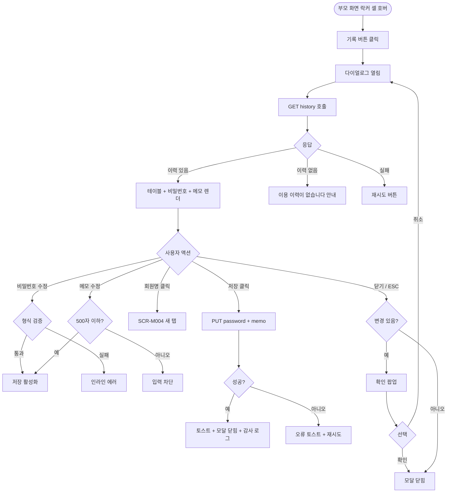

# DLG-050-001 락커 기록 다이얼로그

## 1. 다이얼로그 메타 정보

| 항목 | 값 |
|---|---|
| 작성일 | 2026-05-22 |
| 버전 | v1.0 |
| 상태 | 최신 통합본 반영 (정합화 완료) |
| 도메인 | D06 시설관리 |
| 다이얼로그 ID | DLG-050-001 |
| 다이얼로그명 | 락커 기록 조회 |
| 다이얼로그 유형 | 조회 + 편집 모달 |
| 부모 화면 | SCR-050 락커 관리 |
| 호출 트리거 | 락커 셀 호버 시 [기록] 버튼 클릭(사용중·고장 락커) |
| 기능코드 | FAC-01 (락커 관리) |
| 계약코드 | FAC-01-09 (기록 조회) |
| 관련 API | `GET /api/lockers/:id/history` · `PUT /api/lockers/:id/password` · `PUT /api/lockers/:id/memo` |

이 문서는 DLG-050-001 락커 기록 조회 다이얼로그에 대한 자기완결형 요구사항 정의서입니다.

## 2. 다이얼로그 개요와 목적

락커 기록 조회 다이얼로그는 특정 락커의 과거 사용 이력(배정 · 회수 기록)을 시간 역순으로 조회하고, 해당 락커의 비밀번호와 운영자 메모를 확인 · 수정하는 모달입니다. 운영자가 락커 상태를 점검하거나 회원 분쟁 시 어느 회원이 언제 사용했는지 추적해야 할 때 사용됩니다. 락커별 비밀번호와 메모는 운영자만 볼 수 있는 정보로, 회원에게 안내해야 하는 비밀번호를 확인하거나 락커 상태에 대한 운영 메모를 남기는 데 활용됩니다.

## 3. 호출 트리거와 부모 화면 연결

호출 트리거는 SCR-050 락커 관리 페이지의 박스 뷰 또는 리스트 뷰에서 사용중 락커 또는 고장 락커의 호버 액션 [기록] 버튼입니다. 빈 락커에는 [기록] 버튼이 노출되지 않으므로 트리거가 발생하지 않습니다.

부모 화면에서 호출 시점에 락커 ID를 다이얼로그에 전달하며, 다이얼로그는 진입 직후 `GET /api/lockers/:id/history` API를 호출해 이력 데이터를 fetch합니다. 부모 화면은 다이얼로그가 열린 상태에서도 그리드와 필터가 그대로 유지되며, 다이얼로그가 닫히면 부모 화면의 데이터는 자동 갱신되지 않고 기존 상태를 유지합니다(이력 조회 후 비밀번호·메모만 변경 가능하므로 그리드 갱신 불필요).

## 4. 레이아웃과 UI 구성

다이얼로그는 화면 중앙에 떠 있는 모달 형태이며 너비는 데스크톱 기준 640px, 태블릿에서는 화면의 80% 너비를 사용합니다.

모달 상단에는 "[락커 번호]번 락커 이용 이력"이라는 제목이 표시되고, 그 우측 상단에 닫기 X 버튼이 있습니다.

본문은 위에서 아래로 다음과 같은 세 영역으로 구성됩니다. 첫 번째 영역은 이력 테이블입니다. 컬럼은 좌측부터 날짜 / 상태(배정·회수 배지) / 회원명 순서이며 시간 역순으로 정렬되어 가장 최근 이벤트가 맨 위에 표시됩니다. 회원명 클릭은 SCR-M004 회원 상세로 이동합니다. 이력이 없는 락커에서는 테이블 자리에 "이용 이력이 없습니다"라는 안내가 표시됩니다.

두 번째 영역은 비밀번호 편집 영역입니다. 현재 락커에 설정된 비밀번호가 입력란에 표시되며 운영자가 수정 가능합니다. 비밀번호 형식 검증은 4~6자리 숫자 또는 테넌트 정책에 따른 형식입니다.

세 번째 영역은 메모 편집 영역입니다. textarea로 운영자가 락커 상태에 대한 자유 메모를 입력할 수 있습니다. 최대 500자 제한이 있습니다.

모달 하단에는 [저장] · [닫기] 버튼이 좌우로 배치됩니다. [저장]은 비밀번호 또는 메모 변경 사항을 저장하며, [닫기]는 변경 없이 모달을 종료합니다.

## 5. 입력 필드와 검증

비밀번호 입력 필드는 텍스트 입력란이며 4~6자리 숫자만 허용됩니다. 형식 위반 시 인라인 에러 "비밀번호는 4~6자리 숫자로 입력해주세요"가 표시되어 저장이 차단됩니다. 비밀번호 변경은 다음 회원 배정 시점부터 적용되며 현재 사용중인 회원에게는 영향이 없습니다.

메모 입력 필드는 textarea이며 최대 500자입니다. 초과 입력 시 인라인 카운터에 빨강 색상이 표시되며 500자에서 입력이 차단됩니다. 메모는 운영자만 볼 수 있는 내부 메모이며 회원에게 노출되지 않습니다.

[저장] 버튼은 비밀번호 또는 메모가 변경된 경우에만 활성화됩니다. 변경 없이 [저장] 버튼을 누르려고 시도하면 비활성 상태로 클릭이 차단됩니다.

## 6. 버튼·아이콘·링크 액션 전체 정의

[저장] 버튼은 변경된 비밀번호와 메모를 동시에 저장합니다. `PUT /api/lockers/:id/password`와 `PUT /api/lockers/:id/memo`가 호출되며 둘 다 성공해야 모달이 닫힙니다. 한쪽만 변경된 경우 변경된 API만 호출됩니다. 저장 성공 시 "비밀번호/메모가 저장되었습니다" 토스트가 표시되며 모달이 자동으로 닫힙니다. 저장 실패 시 "저장에 실패했습니다" 오류 토스트가 표시되고 모달은 닫히지 않아 운영자가 재시도할 수 있습니다.

[닫기] 버튼과 우측 상단 X 버튼은 변경 없이 모달을 종료합니다. 입력 도중 변경 사항이 있는 상태에서 [닫기]를 클릭하면 "변경 사항이 사라집니다. 닫으시겠습니까?" 확인 팝업이 표시되어 [확인] / [취소] 선택지가 제공됩니다.

이력 테이블의 회원명 클릭은 새 탭에서 SCR-M004 회원 상세를 엽니다. 다이얼로그는 닫히지 않고 유지됩니다.

ESC 키 또는 배경 클릭은 닫기와 동일하게 동작하지만, 입력 변경 사항이 있는 경우 확인 팝업이 한 번 더 표시됩니다.

## 7. 토스트와 확인 팝업

성공 토스트는 "비밀번호/메모가 저장되었습니다"가 5초간 표시됩니다.

실패 토스트는 "저장에 실패했습니다", "비밀번호는 4~6자리 숫자로 입력해주세요", "권한이 없어요" 같은 문구가 표시됩니다.

확인 팝업은 변경 사항이 있는 상태에서 모달을 닫으려고 할 때 "변경 사항이 사라집니다. 닫으시겠습니까?" + [확인] / [취소]가 제공됩니다.

## 8. 데이터 흐름과 외부 연동

모달 진입 시 `GET /api/lockers/:id/history`가 호출되며 응답으로 이력 배열(시간 역순 정렬)과 현재 비밀번호 · 메모가 함께 내려옵니다. 이력 한 건은 timestamp · action(배정/회수) · member_id · member_name · actor_id(처리한 운영자)로 구성됩니다.

비밀번호 저장은 `PUT /api/lockers/:id/password`로 처리되며 요청에는 새 비밀번호가 포함됩니다. 메모 저장은 `PUT /api/lockers/:id/memo`로 처리됩니다.

모든 변경은 감사 로그(SCR-097)에 actor · locker_id · before-after 형태로 기록됩니다. 비밀번호 변경 이력은 별도로 보안 관점에서 추적 가능하도록 저장됩니다.

## 9. 다이얼로그 상태와 예외 처리

로딩 중 상태는 이력 테이블 자리에 스켈레톤이 표시됩니다.

이력 있음 상태는 시간 역순 행으로 표시됩니다.

이력 없음 상태는 "이용 이력이 없습니다" 안내가 표시됩니다.

저장 중 상태는 [저장] 버튼이 비활성화되고 스피너가 표시됩니다.

저장 성공 상태는 토스트 표시 + 모달 자동 닫힘이 일어납니다.

저장 실패 상태는 오류 토스트 + 모달 유지로 재시도가 가능합니다.

예외 케이스별 처리는 다음과 같습니다.

비밀번호 형식 오류 시 인라인 에러로 저장이 차단됩니다.

메모 500자 초과 시 입력이 차단되고 카운터에 빨강이 표시됩니다.

이력 조회 실패 시 "이력을 불러올 수 없습니다" + 재시도 버튼이 표시됩니다.

권한 부족 시 다이얼로그 진입이 차단되며 부모 화면에서 권한 안내가 표시됩니다.

동시 편집 충돌 시 "다른 사용자가 변경했습니다" 안내 + 새로고침이 안내됩니다.

ESC/배경 클릭 시 입력 변경이 있으면 확인 팝업이 표시됩니다.

## 10. 권한별 처리

owner / manager는 부모 화면에서 허용된 경우 조회 · 입력 · 저장이 가능합니다.

trainer / fc / staff는 담당 업무 범위에 포함된 데이터만 조회하며 수정 권한은 부모 화면 정책을 따릅니다. 일반적으로 staff는 비밀번호 조회만 가능하고 메모 편집은 매니저 이상 권한자만 가능합니다.

readonly는 조회만 가능하며 비밀번호와 메모 영역이 read-only로 표시됩니다. [저장] 버튼이 hidden 처리됩니다.

권한 없음은 다이얼로그 진입이 차단되고 부모 화면에서 권한 안내가 표시됩니다.

## 11. 화면 흐름

## 12. 운영 정책 (이 다이얼로그에 연결된 부분)

락커별 비밀번호는 4~6자리 숫자(또는 테넌트 정책에 따른 형식)이며 운영자가 자유롭게 변경 가능합니다. 비밀번호 변경은 다음 회원 배정 시점부터 적용되며 현재 사용중인 회원의 비밀번호는 그대로 유지됩니다.

메모는 운영자만 볼 수 있는 내부 메모이며 최대 500자입니다. 메모는 회원에게 노출되지 않습니다.

이력 테이블은 락커의 모든 배정 · 회수 이벤트를 시간 역순으로 표시합니다. 90일 초과 이력은 별도 분석 화면(데이터 웨어하우스)에서 조회 가능하며 본 다이얼로그에는 최근 90일 이력이 표시됩니다.

회원명 클릭은 SCR-M004로 이동하며 회원이 탈퇴 · 삭제된 경우 마스킹된 이름(예: "홍**")이 표시될 수 있습니다.

비밀번호와 메모 변경은 모두 감사 로그(SCR-097)에 actor · locker_id · before-after 형태로 기록됩니다. 비밀번호 변경 이력은 보안 추적용으로 별도 보관되며 본사 감사 시 조회 가능합니다.

이력 자체는 읽기 전용이며 운영자가 임의로 수정 · 삭제할 수 없습니다. 잘못된 이력 수정이 필요한 경우 슈퍼관리자가 직접 데이터베이스에서 조정합니다.

권한별 가시성은 부모 화면(SCR-050)의 권한 정책을 따르며, 일반적으로 비밀번호 조회는 모든 운영자가 가능하지만 메모 편집은 매니저 이상으로 제한됩니다.

이상의 모든 정책은 이 다이얼로그를 구현하고 운영하는 사람이 별도 문서 없이 이 한 장만 보면 이해할 수 있도록 풀어 적었습니다.
