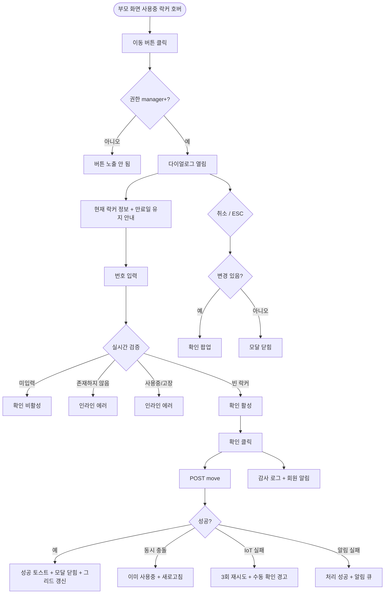

# DLG-050-002 락커 이동 다이얼로그

## 1. 다이얼로그 메타 정보

| 항목 | 값 |
|---|---|
| 작성일 | 2026-05-22 |
| 버전 | v1.0 |
| 상태 | 최신 통합본 반영 (정합화 완료) |
| 도메인 | D06 시설관리 |
| 다이얼로그 ID | DLG-050-002 |
| 다이얼로그명 | 락커 이동 |
| 다이얼로그 유형 | 입력 + 처리 모달 |
| 부모 화면 | SCR-050 락커 관리 |
| 호출 트리거 | 사용중 락커 셀 호버 시 [이동] 버튼 클릭 |
| 기능코드 | FAC-01 (락커 관리) |
| 계약코드 | FAC-01-07 (이동) |
| 관련 API | `POST /api/lockers/:id/move` |

이 문서는 DLG-050-002 락커 이동 다이얼로그에 대한 자기완결형 요구사항 정의서입니다.

## 2. 다이얼로그 개요와 목적

락커 이동 다이얼로그는 사용중 락커에 배정된 회원 정보를 다른 빈 락커 번호로 이전하는 모달입니다. 회원 요청(예: 다른 구역으로 옮기고 싶다) 또는 관리 목적(예: 만료 임박 락커를 빈 공간으로 정리)으로 락커 번호를 변경할 때 사용됩니다.

운영 정책상 락커 이동은 위치 변경이지 권리 이전이 아닙니다. 따라서 이동 시 만료일은 그대로 유지되며, 만료일을 변경하고 싶으면 별도 액션(개별 배정 갱신 등)으로 처리해야 합니다. 이동 이력은 from 락커 번호 / to 락커 번호 / 변경 시각 / 운영자 정보가 모두 기록되어 DLG-050-001 락커 기록에서 시간 역순으로 조회됩니다.

## 3. 호출 트리거와 부모 화면 연결

호출 트리거는 SCR-050 락커 관리 페이지의 박스 뷰 또는 리스트 뷰에서 사용중 락커 셀 호버 시 [이동] 버튼 클릭입니다. 빈 락커나 고장 락커에는 [이동] 버튼이 노출되지 않으므로 트리거가 발생하지 않습니다.

부모 화면에서 호출 시점에 현재 락커 ID와 락커 번호, 배정 회원 정보가 다이얼로그에 전달됩니다. 다이얼로그가 닫히면 부모 화면의 락커 그리드와 리스트가 자동 갱신되어 이동 결과가 즉시 반영됩니다.

## 4. 레이아웃과 UI 구성

다이얼로그는 화면 중앙에 떠 있는 모달 형태이며 너비는 데스크톱 기준 480px입니다.

모달 상단에는 "[현재 락커 번호]번 락커 이동" 제목이 표시되고, 그 우측 상단에 닫기 X 버튼이 있습니다.

본문은 위에서 아래로 다음과 같이 구성됩니다.

첫 번째 영역은 현재 락커 정보입니다. 현재 락커 번호와 배정된 회원명이 읽기 전용으로 표시되며, 만료일도 함께 표시되어 운영자가 이동 후에도 만료일이 유지됨을 인지할 수 있게 합니다.

두 번째 영역은 이동할 번호 입력입니다. 텍스트 입력란에 변경할 락커 번호를 입력하거나 드롭다운으로 빈 락커 목록에서 선택할 수 있습니다. 락커 번호 입력 시 실시간 검증으로 해당 번호가 빈 락커인지 확인되고, 사용중·고장·만료 임박 락커이면 인라인 에러가 표시됩니다.

세 번째 영역은 이동 안내 메시지입니다. "이동 시 만료일은 그대로 유지됩니다"라는 안내 문구가 작은 회색 글씨로 표시되어 운영자가 정책을 즉시 이해할 수 있게 합니다.

모달 하단에는 [확인] · [취소] 버튼이 좌우로 배치됩니다.

## 5. 입력 필드와 검증

이동할 락커 번호 입력 필드는 숫자 또는 락커 식별자(예: A-12) 형식이며 테넌트 정책에 따릅니다. 입력 시 실시간 검증이 일어나며 빈 락커가 아닌 경우 인라인 에러가 표시됩니다.

번호 미입력 시 [확인] 버튼이 비활성 상태로 표시되며 인라인 안내 "이동할 락커 번호를 입력해주세요"가 표시됩니다.

번호가 존재하지 않으면 "선택한 번호가 존재하지 않습니다" 인라인 에러가 표시되어 저장이 차단됩니다.

번호가 사용중·고장이면 "선택한 번호는 [상태] 상태입니다. 빈 락커만 선택 가능합니다" 인라인 에러가 표시됩니다.

번호가 만료 임박이면 운영자에게 안내 + 진행 옵션이 제공됩니다.

## 6. 버튼·아이콘·링크 액션 전체 정의

[확인] 버튼은 입력된 번호로 이동을 실행합니다. `POST /api/lockers/:id/move`가 호출되며 요청에 from 락커 ID와 to 락커 번호가 포함됩니다. 저장 성공 시 "락커가 [N]번으로 이동되었습니다" 토스트가 표시되고 모달이 자동으로 닫히며 부모 화면의 그리드가 갱신됩니다.

[취소] 버튼과 우측 상단 X 버튼은 변경 없이 모달을 종료합니다. 입력 도중 변경 사항이 있는 경우 "변경 사항이 사라집니다. 닫으시겠습니까?" 확인 팝업이 표시됩니다.

ESC 키 또는 배경 클릭은 취소와 동일하게 동작하지만 입력 변경이 있으면 확인 팝업이 한 번 더 표시됩니다.

## 7. 토스트와 확인 팝업

성공 토스트는 "락커가 [N]번으로 이동되었습니다"가 5초간 표시됩니다.

실패 토스트는 "락커 이동에 실패했습니다", "선택한 번호가 이미 사용중입니다", "권한이 없어요", "이동할 락커 번호를 입력해주세요" 같은 문구가 표시됩니다.

확인 팝업은 변경 사항이 있는 상태에서 모달을 닫으려고 할 때 표시됩니다.

스마트 락커(IoT) 명령 실패 시 차단형 알럿 "게이트 명령 실패, 수동 확인 필요"가 표시됩니다.

## 8. 데이터 흐름과 외부 연동

`POST /api/lockers/:id/move`는 from 락커 ID와 to 락커 번호를 전송하고 응답으로 갱신된 락커 상태를 반환합니다. 만료일은 그대로 유지됩니다.

이동 이력은 자동으로 락커별 이력 테이블에 INSERT되어 DLG-050-001 락커 기록에서 시간 역순으로 조회 가능합니다. 이력 한 건에는 from 락커 번호 · to 락커 번호 · 변경 시각 · 운영자 정보가 모두 포함됩니다.

스마트 락커(IoT) 연동이 활성화된 테넌트에서는 이동 시 from 락커 잠금 해제 + to 락커 잠금 명령이 호출됩니다. 3회 재시도 후 모두 실패하면 운영자에게 경고가 표시되고 락커 상태는 DB 기준으로 유지됩니다.

회원에게 NFR-19 알림이 자동 발송됩니다(앱 푸시 + 새 락커 번호 안내).

모든 이동 처리는 감사 로그(SCR-097)에 actor · from_locker_id · to_locker_id · member_id · before-after 형태로 기록됩니다.

## 9. 다이얼로그 상태와 예외 처리

번호 미입력 상태에서는 [확인] 비활성 + 인라인 안내가 표시됩니다.

이동 성공 상태는 토스트 + 모달 자동 닫힘 + 그리드 갱신이 일어납니다.

이동 실패 상태는 오류 토스트 + 모달 유지로 재시도가 가능합니다.

예외 케이스별 처리는 다음과 같습니다.

번호 미입력 시 [확인] 비활성화 + 인라인 안내가 표시됩니다.

번호가 존재하지 않으면 "선택한 번호가 존재하지 않습니다" 인라인 에러가 표시됩니다.

번호가 사용중·고장이면 "빈 락커만 선택 가능합니다" 인라인 에러가 표시됩니다.

이동 중 다른 운영자가 동일 대상 락커를 동시 처리한 경우 락 충돌이 감지되어 "선택한 번호가 이미 사용중입니다" 안내 + 새로고침이 안내됩니다.

스마트 락커 IoT 명령 실패 시 3회 재시도 후 차단형 알럿 + 수동 확인 가이드가 표시됩니다.

알림 발송 실패 시 이동 처리는 성공으로 처리되고 알림 재시도 큐에 등록됩니다.

권한 부족 시 다이얼로그 진입이 차단되고 부모 화면에서 권한 안내가 표시됩니다.

ESC/배경 클릭 시 입력 변경이 있으면 확인 팝업이 표시됩니다.

## 10. 권한별 처리

owner / manager는 락커 이동이 가능합니다.

trainer / fc / staff는 이동 권한이 없으므로 부모 화면에서 [이동] 버튼이 노출되지 않습니다. 직접 URL 접근 시 백엔드 403으로 차단됩니다.

readonly는 다이얼로그 진입 자체가 차단됩니다.

권한 없음은 다이얼로그 진입이 차단되고 부모 화면에서 권한 안내가 표시됩니다.

## 11. 화면 흐름

## 12. 운영 정책 (이 다이얼로그에 연결된 부분)

락커 이동은 위치 변경이지 권리 이전이 아닙니다. 이동 시 만료일은 그대로 유지되며 만료일을 변경하고 싶으면 별도 액션이 필요합니다.

이동 이력은 from 락커 번호 / to 락커 번호 / 변경 시각 / 운영자 정보가 모두 기록되어 DLG-050-001에서 시간 역순으로 조회 가능합니다.

이동 대상 락커는 반드시 빈 락커여야 하며 사용중 · 고장 · 만료 경과 락커는 선택할 수 없습니다.

이동 시 만료 임박 락커를 대상으로 선택하는 경우 운영자에게 안내가 표시되고 진행 옵션이 제공됩니다.

스마트 락커(IoT) 연동이 활성화된 테넌트에서는 이동 시 from 락커 잠금 해제 + to 락커 잠금 명령이 호출됩니다. 3회 재시도가 자동 수행되며 모두 실패하면 운영자에게 경고가 표시되고 락커 상태는 DB 기준으로 유지됩니다.

이동 시 회원에게 NFR-19 알림이 자동 발송됩니다(앱 푸시 + 새 락커 번호 안내). 알림 발송 실패는 이동 처리와 분리되어 재시도 큐에 등록됩니다.

권한별 가시성: 슈퍼관리자 · Owner(지점장) · 매니저만 이동 가능합니다. FC · 스태프 · 프런트는 이동 불가능합니다.

모든 이동 처리는 감사 로그(SCR-097)에 actor · from_locker_id · to_locker_id · member_id · before-after 형태로 기록됩니다.

본사 통합 모드에서 다른 지점 락커 이동 시도 시 권한자 외 차단됩니다.

이상의 모든 정책은 이 다이얼로그를 구현하고 운영하는 사람이 별도 문서 없이 이 한 장만 보면 이해할 수 있도록 풀어 적었습니다.
