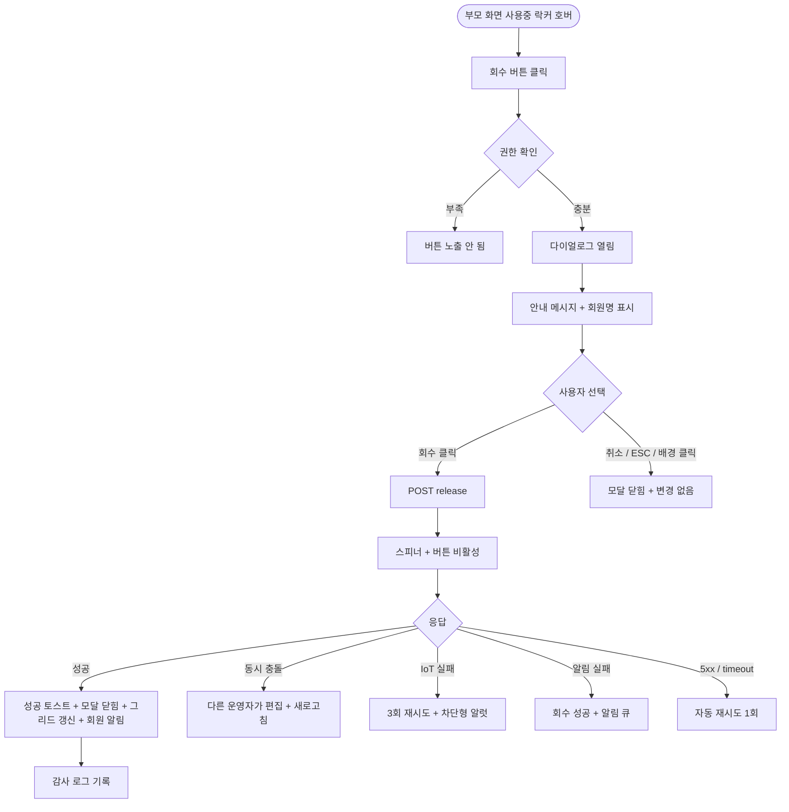

# DLG-050-003 락커 회수 확인 다이얼로그

## 1. 다이얼로그 메타 정보

| 항목 | 값 |
|---|---|
| 작성일 | 2026-05-22 |
| 버전 | v1.0 |
| 상태 | 최신 통합본 반영 (정합화 완료) |
| 도메인 | D06 시설관리 |
| 다이얼로그 ID | DLG-050-003 |
| 다이얼로그명 | 락커 회수 확인 |
| 다이얼로그 유형 | 확인 모달 (danger) |
| 부모 화면 | SCR-050 락커 관리 |
| 호출 트리거 | 사용중 락커 셀 호버 시 [회수] 버튼 클릭 |
| 기능코드 | FAC-01 (락커 관리) |
| 계약코드 | FAC-01-06 (회수) |
| 관련 API | `POST /api/lockers/:id/release` |

이 문서는 DLG-050-003 락커 회수 확인 다이얼로그에 대한 자기완결형 요구사항 정의서입니다.

## 2. 다이얼로그 개요와 목적

락커 회수 확인 다이얼로그는 사용중 락커를 빈 락커 상태로 되돌리기 전 최종 의사를 확인하는 모달입니다. 회수 시 배정된 회원 정보가 모두 초기화된다는 점을 명확히 안내하여 운영자가 실수로 회원의 락커를 잘못 회수하는 것을 방지합니다.

회수가 일어나면 락커는 빈 상태로 즉시 전환되고, 회원에게는 NFR-19 알림(앱 푸시 + SMS)이 자동 발송됩니다. 스마트 락커(IoT) 연동이 활성화된 테넌트에서는 게이트 잠금 해제 명령이 호출되며, 모든 회수 이벤트는 감사 로그(SCR-097)에 actor · locker_id · member_id · before-after 형태로 기록됩니다.

## 3. 호출 트리거와 부모 화면 연결

호출 트리거는 SCR-050 락커 관리 페이지에서 사용중 락커 셀 호버 시 [회수] 버튼 클릭입니다. 빈 락커나 고장 락커에는 [회수] 버튼이 노출되지 않습니다.

부모 화면에서 호출 시점에 락커 ID와 현재 배정된 회원 정보가 다이얼로그에 전달됩니다. 다이얼로그가 닫히면(확인 성공 시) 부모 화면의 락커 그리드와 리스트가 자동 갱신되어 해당 셀이 빈 락커(회색)로 즉시 변경됩니다.

## 4. 레이아웃과 UI 구성

다이얼로그는 화면 중앙에 떠 있는 모달 형태이며 너비는 데스크톱 기준 400px의 컴팩트한 확인 모달입니다.

모달 상단에는 "락커 회수"라는 제목이 표시되고, 그 우측 상단에 닫기 X 버튼이 있습니다.

본문에는 단순한 안내 메시지가 표시됩니다. "[락커 번호]번 락커를 회수하시겠습니까? 배정된 회원 정보가 초기화됩니다." 회원명도 함께 표시되어 운영자가 어떤 회원의 락커를 회수하는지 명확히 인지할 수 있게 합니다.

모달 하단에는 [회수] · [취소] 버튼이 좌우로 배치됩니다. [회수] 버튼은 위험(danger) 스타일(빨강 배경 또는 빨강 텍스트)로 표시되어 운영자가 신중하게 결정하도록 유도합니다.

## 5. 입력 필드와 검증

본 다이얼로그는 입력 필드가 없으며 단순 확인 모달입니다. 운영자가 [회수] 버튼을 누르는 행위 자체가 의사 확인입니다.

권한 검증은 부모 화면에서 미리 처리되어 권한 부족 시 [회수] 버튼이 노출되지 않습니다. 직접 URL 접근 시 백엔드 403으로 차단됩니다.

## 6. 버튼·아이콘·링크 액션 전체 정의

[회수] 버튼은 위험(danger) 스타일로 표시되며 클릭 시 `POST /api/lockers/:id/release`가 호출됩니다. 처리 중에는 스피너가 표시되고 [회수] 버튼이 비활성화됩니다. 성공 시 "락커가 회수되었습니다" 토스트가 표시되고 모달이 자동으로 닫히며 부모 화면 그리드가 갱신됩니다. 실패 시 "락커 회수에 실패했습니다" 오류 토스트가 표시되고 모달은 닫히지 않아 재시도가 가능합니다.

[취소] 버튼과 우측 상단 X 버튼은 변경 없이 모달을 종료합니다.

ESC 키 또는 배경 클릭은 취소와 동일하게 동작합니다.

## 7. 토스트와 확인 팝업

성공 토스트는 "락커가 회수되었습니다"가 5초간 표시됩니다.

실패 토스트는 "락커 회수에 실패했습니다", "권한이 없어요", "다른 운영자가 동시에 편집했어요" 같은 문구가 표시됩니다.

스마트 락커 IoT 명령 실패 시 차단형 알럿 "게이트 명령 실패, 수동 확인 필요"가 표시되며 3회 재시도 후 운영자에게 가이드가 표시됩니다.

## 8. 데이터 흐름과 외부 연동

`POST /api/lockers/:id/release`는 락커 ID를 전송하고 응답으로 갱신된 락커 상태(빈 락커)를 반환합니다.

회수 시점에 회원의 보유 락커 정보가 초기화되며 회원에게 NFR-19 알림이 자동 발송됩니다(앱 푸시 + SMS).

스마트 락커(IoT) 연동이 활성화된 테넌트에서는 게이트 잠금 해제 명령이 호출됩니다. 3회 재시도 후 모두 실패하면 운영자에게 경고가 표시되고 락커 상태는 DB 기준으로 빈 락커로 유지됩니다(IoT 실패와 DB 처리 분리).

모든 회수 처리는 감사 로그(SCR-097)에 actor · locker_id · member_id · before-after 형태로 기록됩니다.

알림 발송 실패는 회수 처리와 분리되어 재시도 큐에 등록됩니다.

## 9. 다이얼로그 상태와 예외 처리

기본 상태는 안내 메시지 + 회수/취소 버튼이 표시된 상태입니다.

처리 중 상태는 [회수] 버튼이 비활성화되고 스피너가 표시됩니다.

회수 성공 상태는 토스트 + 모달 자동 닫힘 + 그리드 갱신이 일어납니다.

회수 실패 상태는 오류 토스트 + 모달 유지로 재시도가 가능합니다.

예외 케이스별 처리는 다음과 같습니다.

권한 부족 시 부모 화면에서 [회수] 버튼이 노출되지 않습니다. 직접 URL 접근 시 백엔드 403으로 차단됩니다.

동시 편집 충돌(다른 운영자가 같은 락커를 동시 처리) 시 "다른 운영자가 동시에 편집했어요" 안내 + 새로고침이 안내됩니다.

스마트 락커 IoT 명령 실패 시 3회 재시도 후 차단형 알럿 + 수동 확인 가이드가 표시됩니다. DB 상의 락커 상태는 빈 락커로 정상 처리됩니다.

알림 발송 실패 시 회수 처리는 성공으로 처리되고 알림은 재시도 큐에 등록됩니다.

네트워크 오류(5xx / timeout) 시 자동 재시도 1회 후 사용자 액션을 기다립니다.

이미 회수된 락커에 대한 회수 시도 시 "이미 빈 락커입니다" 안내가 표시됩니다.

## 10. 권한별 처리

owner / manager / staff / fc / front는 부모 화면에서 [회수] 버튼이 노출되어 다이얼로그를 호출할 수 있습니다(부모 화면 권한 정책에 따라).

trainer는 회수 권한이 없으므로 부모 화면에서 [회수] 버튼이 노출되지 않습니다.

readonly는 다이얼로그 진입 자체가 차단됩니다.

권한 없음은 다이얼로그 진입이 차단되고 부모 화면에서 권한 안내가 표시됩니다.

## 11. 화면 흐름

## 12. 운영 정책 (이 다이얼로그에 연결된 부분)

락커 회수는 락커를 빈 락커 상태로 되돌리는 액션이며 회원의 보유 락커 정보가 즉시 초기화됩니다.

회수 시 회원에게 NFR-19 알림이 자동 발송됩니다(앱 푸시 + SMS).

스마트 락커(IoT) 연동이 활성화된 테넌트에서는 회수 시 게이트 잠금 해제 명령이 호출됩니다. 3회 재시도 후 모두 실패하면 운영자에게 경고가 표시되고 락커 상태는 DB 기준으로 빈 락커로 유지됩니다.

알림 발송 실패는 회수 처리와 분리되어 재시도 큐에 등록되며 회수 자체는 성공으로 처리됩니다.

[회수] 버튼은 위험(danger) 스타일로 표시되어 운영자가 신중하게 결정하도록 시각적으로 유도합니다.

회수가 일어나면 만료일이 도래하지 않은 락커도 즉시 빈 락커가 됩니다. 회원의 락커 사용 권리(만료일까지)는 남아 있지만 락커 자체는 다른 회원에게 재배정 가능 상태가 됩니다. 만료일 도래 전 임의 회수에 대한 운영 정책(예: 회원 동의 필요)은 별도 운영 가이드에서 다룹니다.

모든 회수 처리는 감사 로그(SCR-097)에 actor · locker_id · member_id · before-after 형태로 기록됩니다.

권한별 가시성은 부모 화면(SCR-050) 정책을 따르며 일반적으로 스태프 이상이 회수 가능합니다.

본사 통합 모드에서 다른 지점 락커 회수 시도 시 권한자 외 차단됩니다.

회원 탈퇴 · 이관 · 삭제 이벤트 시 보유 락커가 자동 회수되며 본 다이얼로그를 거치지 않습니다.

이용권 만료 자동 회수 정책이 활성화된 테넌트에서는 만료 경과 락커가 매일 02:00 배치로 자동 회수되며 본 다이얼로그를 거치지 않습니다.

이상의 모든 정책은 이 다이얼로그를 구현하고 운영하는 사람이 별도 문서 없이 이 한 장만 보면 이해할 수 있도록 풀어 적었습니다.
