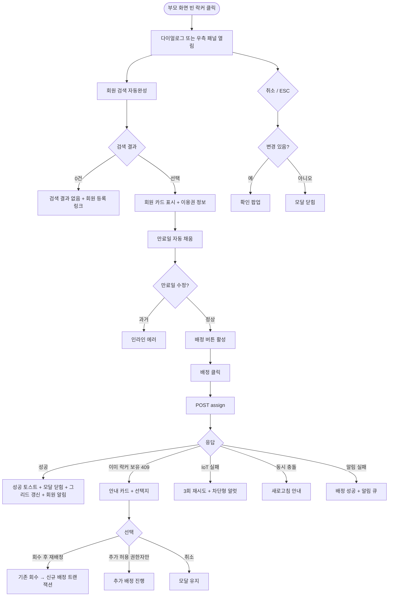

# DLG-050-004 개별 배정 다이얼로그

## 1. 다이얼로그 메타 정보

| 항목 | 값 |
|---|---|
| 작성일 | 2026-05-22 |
| 버전 | v1.0 |
| 상태 | 최신 통합본 반영 (정합화 완료) |
| 도메인 | D06 시설관리 |
| 다이얼로그 ID | DLG-050-004 |
| 다이얼로그명 | 개별 배정 |
| 다이얼로그 유형 | 입력 + 처리 모달 |
| 부모 화면 | SCR-050 락커 관리 |
| 호출 트리거 | 빈 락커 셀 호버 시 [배정] 버튼 클릭 또는 빈 락커 셀 직접 클릭 |
| 기능코드 | FAC-01 (락커 관리) |
| 계약코드 | FAC-01-05 (개별 배정) |
| 관련 API | `POST /api/lockers/:id/assign` |

이 문서는 DLG-050-004 개별 배정 다이얼로그에 대한 자기완결형 요구사항 정의서입니다.

## 2. 다이얼로그 개요와 목적

개별 배정 다이얼로그는 빈 락커에 회원을 한 명 배정하는 모달입니다. 회원 검색 자동완성으로 대상 회원을 선택하고 만료일을 설정해 배정을 완료합니다. SCR-050의 우측 회원 배정 패널(슬라이드 인 형태)과 본 다이얼로그는 동일한 동작을 하며, 디바이스/플랫폼에 따라 표시 형태가 달라질 수 있습니다.

배정 시점에는 자동 검증이 수행되어 동일 회원이 이미 다른 락커를 보유하고 있으면 모달 안에 안내 + 기존 락커 정보 노출 + 운영자 선택지(기존 회수 후 재배정 / 추가 허용 권한자만 / 취소)가 제공됩니다. 회원의 이용권 만료일이 만료일 입력 필드에 자동 채워지며 운영자가 수동 변경할 수도 있습니다.

## 3. 호출 트리거와 부모 화면 연결

호출 트리거는 SCR-050 락커 관리 페이지의 박스 뷰에서 빈 락커 셀 호버 시 [배정] 버튼 클릭, 또는 리스트 뷰에서 빈 락커 행의 [배정] 액션 클릭입니다. 빈 락커 셀 직접 클릭으로도 호출될 수 있으며 이 경우 우측 패널이 슬라이드 인 되는 형태로 표시되거나 본 다이얼로그가 모달로 표시됩니다(테넌트 정책).

부모 화면에서 호출 시점에 락커 ID와 락커 번호가 다이얼로그에 전달됩니다. 다이얼로그가 닫히면(배정 성공 시) 부모 화면의 그리드와 리스트가 자동 갱신되어 해당 셀이 사용중(파란색)으로 즉시 변경됩니다.

## 4. 레이아웃과 UI 구성

다이얼로그는 화면 중앙에 떠 있는 모달 형태이며 너비는 데스크톱 기준 560px입니다.

모달 상단에는 "[락커 번호]번 락커 회원 배정" 제목이 표시되고, 그 우측 상단에 닫기 X 버튼이 있습니다.

본문은 위에서 아래로 다음과 같이 구성됩니다.

첫 번째 영역은 회원 검색 자동완성 입력란입니다. 회원명·연락처·회원 번호를 동시 OR 조건으로 자동완성하며 디바운스 300ms가 적용됩니다. 최소 2자 이상 입력해야 검색이 시작되며 검색 결과 0건이면 "검색 결과가 없습니다" 안내와 회원 등록 화면 진입 링크가 함께 노출됩니다. 회원을 선택하면 회원명 + 회원 번호 + 연락처가 카드 형태로 표시되며 X 버튼으로 선택 취소가 가능합니다.

두 번째 영역은 회원의 이용권 정보입니다. 회원이 선택되면 현재 보유 이용권명과 이용권 만료일이 작은 글씨로 표시되어 운영자가 만료일을 설정할 때 참고할 수 있습니다.

세 번째 영역은 만료일 입력 필드입니다. 날짜 선택기로 만료일을 설정하며 회원의 이용권 만료일이 자동으로 채워집니다. 운영자가 직접 수정 가능하며, 과거 일자 입력 시 인라인 에러 "과거 일자로 배정할 수 없습니다"가 표시되어 저장이 차단됩니다.

네 번째 영역은 안내 메시지입니다. 회원이 이미 다른 락커를 보유한 경우 안내 카드가 표시됩니다. 카드 안에는 "[회원명]님은 이미 [기존 락커 번호]번 락커를 보유 중입니다"와 기존 락커의 만료일이 노출되고, [기존 회수 후 재배정] / [추가 허용(권한자만)] / [취소] 선택지가 제공됩니다.

모달 하단에는 [배정] · [취소] 버튼이 좌우로 배치됩니다.

## 5. 입력 필드와 검증

회원 검색은 디바운스 300ms + 최소 2자 입력 정책을 따릅니다. 검색은 회원명 부분 매치 + 연락처 부분 매치 + 회원 번호 정확 매치를 OR 조건으로 수행합니다. 검색 결과 0건이면 "검색 결과가 없습니다" + 회원 등록 안내가 표시됩니다.

만료일 입력은 날짜 선택기이며 과거 일자 입력 시 인라인 에러로 저장이 차단됩니다. 만료일이 비어 있으면 "만료일을 선택해주세요" 안내가 표시됩니다.

회원이 미선택 상태이거나 만료일이 미입력 상태에서는 [배정] 버튼이 비활성화됩니다.

## 6. 버튼·아이콘·링크 액션 전체 정의

[배정] 버튼은 입력된 회원과 만료일로 배정을 실행합니다. `POST /api/lockers/:id/assign`이 호출되며 요청에 락커 ID · 회원 ID · 만료일이 포함됩니다. 처리 중에는 스피너가 표시되고 [배정] 버튼이 비활성화됩니다. 성공 시 "[락커 번호]번 락커가 [회원명]님께 배정되었습니다" 토스트가 표시되고 모달이 자동으로 닫히며 부모 화면 그리드가 갱신됩니다. 실패 시 "락커 배정에 실패했습니다" 오류 토스트가 표시되고 모달은 닫히지 않아 재시도가 가능합니다.

회원 카드의 X 버튼은 회원 선택을 취소하고 다시 회원 검색 상태로 돌아갑니다.

기존 락커 보유 안내 카드의 [기존 회수 후 재배정] 버튼은 기존 락커를 먼저 회수한 다음 신규 배정을 실행하는 트랜잭션입니다. 두 작업이 모두 성공해야 모달이 닫힙니다.

[추가 허용(권한자만)] 버튼은 슈퍼관리자·센터장만 활성화되며 기존 락커를 유지한 채 추가 배정을 진행합니다.

[취소] 버튼과 우측 상단 X 버튼은 변경 없이 모달을 종료합니다. 입력 도중 변경 사항이 있는 경우 확인 팝업이 표시됩니다.

ESC 키 또는 배경 클릭은 취소와 동일하게 동작합니다.

회원 등록 안내 링크 클릭 시 SCR-M002 회원 등록 화면이 새 탭에서 열립니다.

## 7. 토스트와 확인 팝업

성공 토스트는 "[락커 번호]번 락커가 [회원명]님께 배정되었습니다"가 5초간 표시됩니다.

실패 토스트는 "락커 배정에 실패했습니다", "과거 일자로 배정할 수 없습니다", "선택한 락커가 다른 운영자에 의해 처리되었어요", "권한이 없어요" 같은 문구가 표시됩니다.

확인 팝업은 입력 변경 사항이 있는 상태에서 모달을 닫으려고 할 때 "변경 사항이 사라집니다. 닫으시겠습니까?" + [확인] / [취소]가 표시됩니다.

스마트 락커 IoT 명령 실패 시 차단형 알럿 "게이트 명령 실패, 수동 확인 필요"가 표시됩니다.

## 8. 데이터 흐름과 외부 연동

회원 검색은 `GET /api/members/search`(또는 동등 엔드포인트)로 디바운스 300ms 후 호출됩니다.

회원 선택 시 회원의 이용권 정보가 함께 fetch되어 만료일 입력 필드에 자동 채워집니다.

배정은 `POST /api/lockers/:id/assign`으로 처리되며 응답으로 갱신된 락커 상태가 반환됩니다. 백엔드 검증으로 회원이 이미 다른 락커를 보유한 경우 409 응답 + 기존 락커 정보가 함께 반환되어 모달에 안내 카드가 표시됩니다.

스마트 락커(IoT) 연동이 활성화된 테넌트에서는 배정 시 게이트 잠금 명령이 호출됩니다. 3회 재시도 후 모두 실패하면 운영자에게 경고가 표시되고 락커 상태는 DB 기준으로 유지됩니다.

회원에게 NFR-19 알림이 자동 발송됩니다(앱 푸시 + 락커 번호 + 비밀번호 안내).

모든 배정 처리는 감사 로그(SCR-097)에 actor · locker_id · member_id · before-after 형태로 기록됩니다.

## 9. 다이얼로그 상태와 예외 처리

기본 상태는 회원 검색이 비어 있고 [배정] 버튼이 비활성 상태입니다.

회원 선택 + 만료일 입력 완료 상태는 [배정] 버튼이 활성화됩니다.

처리 중 상태는 [배정] 버튼이 비활성화되고 스피너가 표시됩니다.

배정 성공 상태는 토스트 + 모달 자동 닫힘 + 그리드 갱신이 일어납니다.

배정 실패 상태는 오류 토스트 + 모달 유지로 재시도가 가능합니다.

회원 이미 보유 상태는 안내 카드가 표시되고 운영자 선택지가 제공됩니다.

예외 케이스별 처리는 다음과 같습니다.

회원 검색 0건 시 "검색 결과가 없습니다" 자동완성 안내 + 회원 등록 링크가 표시됩니다.

만료일 미입력 시 인라인 에러 "만료일을 선택해주세요"가 표시됩니다.

만료일 과거 입력 시 인라인 에러로 저장이 차단됩니다.

회원 미선택 시 [배정] 버튼이 비활성화됩니다.

이미 다른 락커 보유 회원 추가 배정 시도 시 안내 카드 + [기존 회수 후 재배정] / [추가 허용 권한자만] / [취소] 선택지가 제공됩니다.

추가 허용 권한 부족 시 [추가 허용] 버튼이 비활성화되거나 hidden 됩니다.

동시 배정 충돌 시 "선택한 락커가 다른 운영자에 의해 처리되었어요" 안내 + 새로고침이 안내됩니다.

스마트 락커 IoT 명령 실패 시 3회 재시도 후 차단형 알럿이 표시됩니다.

알림 발송 실패 시 배정은 성공으로 처리되고 알림은 재시도 큐에 등록됩니다.

권한 부족 시 다이얼로그 진입이 차단됩니다.

ESC/배경 클릭 시 입력 변경이 있으면 확인 팝업이 표시됩니다.

## 10. 권한별 처리

owner / manager / staff / fc / front는 부모 화면에서 [배정] 버튼이 노출되어 다이얼로그를 호출할 수 있습니다.

추가 허용(이미 락커 보유 회원에 추가 배정)은 슈퍼관리자 · 센터장만 가능합니다. 매니저 이하는 [추가 허용] 버튼이 비활성화되거나 hidden 됩니다.

trainer는 배정 권한이 없으므로 부모 화면에서 [배정] 버튼이 노출되지 않습니다.

readonly는 다이얼로그 진입 자체가 차단됩니다.

권한 없음은 다이얼로그 진입이 차단되고 부모 화면에서 권한 안내가 표시됩니다.

## 11. 화면 흐름

## 12. 운영 정책 (이 다이얼로그에 연결된 부분)

회원 1명당 락커 보유 수 정책은 기본 1개이며 테넌트 토글로 무제한 운영도 가능합니다.

1개 정책 테넌트에서 추가 배정 시도 시 모달에 기존 락커가 노출되고 [회수 후 재배정] / [추가 허용 권한자만] / [취소] 선택지가 제공됩니다. 추가 허용은 슈퍼관리자 · 센터장에 한정됩니다.

만료일은 회원의 이용권 만료일이 자동 채워지며 운영자가 수동 변경 가능합니다. 과거 일자 입력은 차단됩니다.

회원 검색은 디바운스 300ms + 최소 2자 입력 정책을 따릅니다. 검색은 회원명 부분 매치 + 연락처 부분 매치 + 회원 번호 정확 매치를 OR 조건으로 수행합니다.

스마트 락커(IoT) 연동이 활성화된 테넌트에서는 배정 시 게이트 잠금 명령이 호출됩니다. 3회 재시도 후 모두 실패하면 운영자에게 경고가 표시되고 락커 상태는 DB 기준으로 유지됩니다.

배정 시 회원에게 NFR-19 알림이 자동 발송됩니다(앱 푸시 + 락커 번호 + 비밀번호 안내).

알림 발송 실패는 배정 처리와 분리되어 재시도 큐에 등록됩니다.

모든 배정 처리는 감사 로그(SCR-097)에 actor · locker_id · member_id · before-after 형태로 기록됩니다.

본사 통합 모드에서 다른 지점 락커 배정 시도 시 권한자 외 차단됩니다.

탈퇴 · 삭제된 회원은 검색 결과에서 제외되며 다시 배정할 수 없습니다.

미등록 회원(앱 연동 등으로 부분 정보만 있음)에 대한 배정 가능 여부는 테넌트 정책에 따릅니다.

이상의 모든 정책은 이 다이얼로그를 구현하고 운영하는 사람이 별도 문서 없이 이 한 장만 보면 이해할 수 있도록 풀어 적었습니다.
