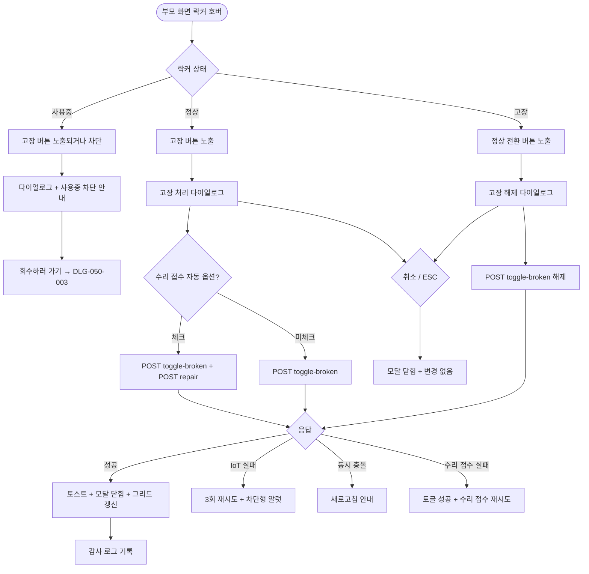

# DLG-050-005 고장 토글 확인 다이얼로그

## 1. 다이얼로그 메타 정보

| 항목 | 값 |
|---|---|
| 작성일 | 2026-05-22 |
| 버전 | v1.0 |
| 상태 | 최신 통합본 반영 (정합화 완료) |
| 도메인 | D06 시설관리 |
| 다이얼로그 ID | DLG-050-005 |
| 다이얼로그명 | 고장 토글 확인 |
| 다이얼로그 유형 | 확인 모달 (양방향: 고장 처리 / 고장 해제) |
| 부모 화면 | SCR-050 락커 관리 |
| 호출 트리거 | 정상 락커의 [고장] 버튼 또는 고장 락커의 [정상 전환] 버튼 클릭 |
| 기능코드 | FAC-01 (락커 관리) |
| 계약코드 | FAC-01-08 (고장 처리) |
| 관련 API | `POST /api/lockers/:id/toggle-broken` |

이 문서는 DLG-050-005 고장 토글 확인 다이얼로그에 대한 자기완결형 요구사항 정의서입니다.

## 2. 다이얼로그 개요와 목적

고장 토글 확인 다이얼로그는 락커의 고장 상태를 활성화하거나 해제하기 전 최종 의사를 확인하는 모달입니다. 현재 상태에 따라 두 가지 방향으로 동작합니다. 정상 락커의 [고장] 버튼을 누르면 "고장 처리" 방향으로 열리고, 고장 락커의 [정상 전환] 버튼을 누르면 "고장 해제" 방향으로 열립니다.

사용중 락커는 고장 처리 전에 회수가 선행되어야 하므로, 사용중 락커에서 [고장] 버튼이 노출되지 않거나, 노출되더라도 본 다이얼로그에 진입했을 때 "사용중 락커는 회수 후 고장 처리 가능합니다"라는 안내가 표시되고 회수 안내가 함께 노출됩니다.

고장 처리 시 테넌트 정책이 활성화되어 있으면 수리 접수(SCR-056 장비 점검)가 자동으로 등록되는 옵션이 제공됩니다.

## 3. 호출 트리거와 부모 화면 연결

호출 트리거는 SCR-050 락커 관리 페이지에서 정상 락커의 호버 액션 [고장] 버튼 또는 고장 락커의 [정상 전환] 버튼 클릭입니다.

부모 화면에서 호출 시점에 락커 ID와 현재 상태(정상/고장)가 다이얼로그에 전달됩니다. 다이얼로그가 닫히면 부모 화면의 그리드와 리스트가 자동 갱신되어 해당 셀이 즉시 새 상태로 변경됩니다.

## 4. 레이아웃과 UI 구성

다이얼로그는 화면 중앙에 떠 있는 컴팩트한 확인 모달이며 너비는 420px입니다.

모달 상단의 제목은 현재 방향에 따라 동적으로 표시됩니다. 고장 처리 방향에서는 "고장 처리", 고장 해제 방향에서는 "고장 해제"가 표시됩니다.

본문에는 방향에 따라 다른 안내 메시지가 표시됩니다.

고장 처리 방향에서는 "[락커 번호]번 락커를 고장 처리하시겠습니까?"가 표시되고, 그 아래에 "고장 처리 시 신규 배정이 차단됩니다"라는 부가 안내가 작은 글씨로 표시됩니다. 테넌트 정책이 활성화된 경우 수리 접수 자동 등록 옵션 체크박스가 함께 표시됩니다.

고장 해제 방향에서는 "[락커 번호]번 락커의 고장 상태를 해제하시겠습니까?"가 표시되고, 그 아래에 "정상 락커로 전환되며 다시 배정 가능합니다"라는 부가 안내가 표시됩니다.

사용중 락커에서 [고장] 버튼 클릭으로 다이얼로그가 호출된 경우, 본문에 "사용중 락커는 회수 후 고장 처리 가능합니다"라는 안내가 표시되고 [회수하러 가기] / [닫기] 선택지가 제공됩니다.

모달 하단에는 [확인] · [취소] 버튼이 좌우로 배치됩니다.

## 5. 입력 필드와 검증

본 다이얼로그는 기본적으로 입력 필드가 없으며 단순 확인 모달입니다.

테넌트 정책이 활성화된 경우 고장 처리 방향에서 "수리 접수 자동 등록" 체크박스가 표시되며, 체크 시 고장 처리와 동시에 SCR-056 장비 점검에 수리 접수가 자동 등록됩니다.

권한 검증은 부모 화면에서 미리 처리되어 권한 부족 시 [고장] / [정상 전환] 버튼이 노출되지 않습니다.

## 6. 버튼·아이콘·링크 액션 전체 정의

[확인] 버튼은 락커 상태를 토글합니다. `POST /api/lockers/:id/toggle-broken`이 호출되며 응답으로 갱신된 락커 상태가 반환됩니다. 처리 중에는 스피너가 표시되고 [확인] 버튼이 비활성화됩니다.

고장 처리 성공 시 "고장 처리되었습니다" 토스트가 표시되고, 고장 해제 성공 시 "고장 해제되었습니다" 토스트가 표시됩니다. 모달이 자동으로 닫히며 부모 화면 그리드가 갱신됩니다.

수리 접수 자동 등록 체크가 활성화된 경우 SCR-056에 수리 접수가 자동 등록되고 추가 토스트 "수리 접수가 등록되었습니다"가 표시됩니다.

[취소] 버튼과 우측 상단 X 버튼은 변경 없이 모달을 종료합니다.

ESC 키 또는 배경 클릭은 취소와 동일하게 동작합니다.

사용중 락커 안내의 [회수하러 가기] 버튼은 본 모달을 닫고 DLG-050-003 락커 회수 확인 모달을 호출합니다.

## 7. 토스트와 확인 팝업

성공 토스트는 방향에 따라 "고장 처리되었습니다" 또는 "고장 해제되었습니다"가 5초간 표시됩니다.

수리 접수 자동 등록 시 "수리 접수가 등록되었습니다" 추가 토스트가 표시됩니다.

실패 토스트는 "고장 상태 변경에 실패했습니다", "권한이 없어요", "사용중 락커는 회수 후 처리해주세요" 같은 문구가 표시됩니다.

스마트 락커 IoT 명령 실패 시 차단형 알럿 "게이트 명령 실패, 수동 확인 필요"가 표시됩니다.

## 8. 데이터 흐름과 외부 연동

`POST /api/lockers/:id/toggle-broken`은 락커 ID + 새 상태(broken/operating)를 전송하고 응답으로 갱신된 락커 상태를 반환합니다.

수리 접수 자동 등록 옵션이 활성화된 경우 동시에 `POST /api/equipment/:id/repair`가 호출되어 수리 접수 레코드가 SCR-056에 생성됩니다.

스마트 락커(IoT) 연동이 활성화된 테넌트에서는 고장 처리 시 게이트 잠금 명령(또는 비활성화), 고장 해제 시 게이트 활성화 명령이 호출됩니다. 3회 재시도 후 실패하면 운영자에게 경고가 표시되고 락커 상태는 DB 기준으로 변경됩니다.

모든 토글 처리는 감사 로그(SCR-097)에 actor · locker_id · before-after 형태로 기록됩니다. 수리 접수 자동 등록도 별도로 감사 로그에 기록됩니다.

## 9. 다이얼로그 상태와 예외 처리

기본 상태는 방향에 맞는 안내 메시지 + 확인/취소 버튼이 표시된 상태입니다.

수리 접수 자동 등록 체크 상태는 고장 처리 방향에서만 노출되며 체크 시 동시 처리됩니다.

처리 중 상태는 [확인] 버튼이 비활성화되고 스피너가 표시됩니다.

성공 상태는 토스트 + 모달 자동 닫힘 + 그리드 갱신이 일어납니다.

실패 상태는 오류 토스트 + 모달 유지로 재시도가 가능합니다.

사용중 락커 차단 상태는 안내 메시지 + [회수하러 가기] / [닫기] 선택지가 제공됩니다.

예외 케이스별 처리는 다음과 같습니다.

사용중 락커 고장 토글 시도 시 "사용중 락커는 회수 후 고장 처리 가능합니다" 안내 + 회수 안내가 표시됩니다.

권한 부족 시 부모 화면에서 [고장]/[정상 전환] 버튼이 노출되지 않습니다.

스마트 락커 IoT 명령 실패 시 3회 재시도 후 차단형 알럿이 표시됩니다.

수리 접수 자동 등록 실패 시 고장 토글은 성공으로 처리되고 수리 접수 등록은 별도로 재시도 안내가 표시됩니다.

동시 편집 충돌 시 "다른 운영자가 이미 처리했어요" 안내 + 새로고침이 안내됩니다.

이미 같은 상태인 경우(예: 이미 고장인 락커를 고장 처리 시도) "이미 [상태] 상태입니다" 안내가 표시됩니다.

## 10. 권한별 처리

owner / manager는 고장 토글이 가능합니다.

staff / fc / front는 테넌트 정책에 따라 고장 토글 가능 여부가 달라집니다. 기본적으로 staff 이상이 가능하지만 일부 테넌트에서는 manager 이상으로 제한됩니다.

trainer는 권한이 없으므로 부모 화면에서 [고장] 버튼이 노출되지 않습니다.

readonly는 다이얼로그 진입 자체가 차단됩니다.

권한 없음은 다이얼로그 진입이 차단되고 부모 화면에서 권한 안내가 표시됩니다.

## 11. 화면 흐름

## 12. 운영 정책 (이 다이얼로그에 연결된 부분)

락커의 고장 상태는 운영자가 명시적으로 토글한 상태로, 배정 차단 + 시각적 사선 + 수리 접수 자동 등록 옵션이 함께 동작합니다.

고장 락커는 배정이 불가능합니다. 사용중 락커를 고장으로 전환하려면 회수가 선행되어야 하며 다이얼로그 안에 회수 안내가 함께 표시됩니다.

고장 해제는 운영자가 수동 토글로 정상 전환을 수행합니다. 수리 완료 기록 없이 고장 → 정상 전환을 허용할지 여부는 테넌트 정책에 따릅니다.

테넌트 정책이 활성화된 경우 고장 토글 시 수리 접수(SCR-056)가 자동 등록되는 옵션이 다이얼로그에 표시됩니다.

수리 접수 자동 등록 실패는 고장 토글과 분리되어 처리됩니다. 고장 토글은 성공으로 처리되고 수리 접수 등록은 별도로 재시도 안내가 표시됩니다.

스마트 락커(IoT) 연동이 활성화된 테넌트에서는 고장 토글 시 게이트 잠금/활성화 명령이 호출됩니다. 3회 재시도 후 실패하면 운영자에게 경고가 표시되고 락커 상태는 DB 기준으로 변경됩니다.

모든 토글 처리는 감사 로그(SCR-097)에 actor · locker_id · before-after 형태로 기록됩니다.

권한별 가시성: 슈퍼관리자 · 센터장 · 매니저는 고장 토글 가능. FC · 스태프 · 프런트는 테넌트 정책에 따라 가능 여부가 달라집니다. 트레이너 · 읽기 전용은 조회만 가능합니다.

본사 통합 모드에서 다른 지점 락커 고장 토글 시도 시 권한자 외 차단됩니다.

이상의 모든 정책은 이 다이얼로그를 구현하고 운영하는 사람이 별도 문서 없이 이 한 장만 보면 이해할 수 있도록 풀어 적었습니다.
