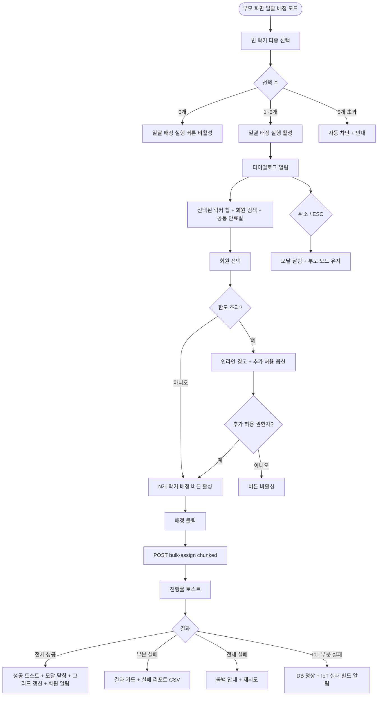

# DLG-050-006 일괄 배정 다이얼로그

## 1. 다이얼로그 메타 정보

| 항목 | 값 |
|---|---|
| 작성일 | 2026-05-22 |
| 버전 | v1.0 |
| 상태 | 최신 통합본 반영 (정합화 완료) |
| 도메인 | D06 시설관리 |
| 다이얼로그 ID | DLG-050-006 |
| 다이얼로그명 | 일괄 배정 |
| 다이얼로그 유형 | 입력 + 일괄 처리 모달 |
| 부모 화면 | SCR-050 락커 관리 |
| 호출 트리거 | 일괄 배정 모드에서 빈 락커 다중 선택 후 [일괄 배정 실행] 버튼 클릭 |
| 기능코드 | FAC-01 (락커 관리) |
| 계약코드 | FAC-01-11 (일괄 배정) |
| 관련 API | `POST /api/lockers/bulk-assign` |

이 문서는 DLG-050-006 일괄 배정 다이얼로그에 대한 자기완결형 요구사항 정의서입니다.

## 2. 다이얼로그 개요와 목적

일괄 배정 다이얼로그는 여러 빈 락커를 한 명의 회원에게 동시에 배정하는 모달입니다. 그리드에서 빈 락커를 다중 선택한 뒤 본 다이얼로그에서 회원 정보와 공통 만료일을 입력해 한 번에 배정합니다. 부부 · 가족 회원이 인접 락커 여러 개를 동시 사용하고 싶다고 요청하거나, 한 회원이 옷 락커 + 신발 락커 같은 분리 자산을 동시 운영해야 할 때 사용됩니다.

일괄 배정은 한 회원당 최대 5개까지 제한됩니다(테넌트 정책). chunked 트랜잭션으로 처리되어 부분 성공이 허용되며 결과는 "성공 N건 / 실패 M건" 카드와 실패 리포트 CSV 다운로드 링크로 표시됩니다.

## 3. 호출 트리거와 부모 화면 연결

호출 트리거는 SCR-050 락커 관리 페이지에서 [일괄 배정] 버튼으로 일괄 배정 모드에 진입한 후 빈 락커를 한 개 이상 선택하고 하단의 [일괄 배정 실행] 버튼을 클릭하는 것입니다.

부모 화면에서 호출 시점에 선택된 락커 ID 배열이 다이얼로그에 전달됩니다. 다이얼로그가 닫히면(배정 성공 또는 부분 성공 시) 부모 화면의 그리드가 갱신되고 일괄 배정 모드가 종료되어 선택이 초기화됩니다. 다이얼로그를 취소로 닫는 경우 부모 화면은 일괄 배정 모드 상태와 선택을 그대로 유지합니다.

## 4. 레이아웃과 UI 구성

다이얼로그는 화면 중앙에 떠 있는 모달 형태이며 너비는 데스크톱 기준 600px입니다.

모달 상단에는 "일괄 배정" 제목이 표시되고, 그 우측 상단에 닫기 X 버튼이 있습니다.

본문은 위에서 아래로 다음과 같이 구성됩니다.

첫 번째 영역은 선택된 락커 안내 배너입니다. "빈 락커를 클릭하여 선택하세요. 현재 [N]개 선택됨" 형태로 현재 선택된 락커 수가 표시되며, 선택된 락커 번호 목록이 작은 칩 형태로 노출되어 운영자가 선택 내역을 확인할 수 있습니다. 칩의 X 버튼 클릭은 부모 화면의 해당 락커 선택을 해제합니다.

두 번째 영역은 회원 검색 자동완성 입력란입니다. 회원명·연락처·회원 번호를 동시 OR 조건으로 자동완성하며 디바운스 300ms가 적용됩니다. 회원이 선택되면 회원명·회원 번호·연락처가 카드 형태로 표시됩니다.

세 번째 영역은 공통 만료일 입력 필드입니다. 모든 선택 락커에 동일한 만료일이 적용되며 회원의 이용권 만료일이 자동 채워집니다. 운영자가 직접 수정 가능하며 과거 일자 입력 시 인라인 에러로 차단됩니다.

네 번째 영역은 한도 안내입니다. 회원이 이미 보유한 락커 수 + 선택 락커 수가 정책 한도(기본 5개)를 초과하면 인라인 경고가 표시되며 [추가 허용(권한자만)] 옵션이 함께 제공됩니다.

모달 하단에는 [N개 락커 배정] · [취소] 버튼이 좌우로 배치됩니다. 버튼 라벨에 선택된 락커 수가 동적으로 표시됩니다.

## 5. 입력 필드와 검증

선택된 락커가 0개인 경우 [N개 락커 배정] 버튼이 비활성화됩니다.

회원 검색은 디바운스 300ms + 최소 2자 입력 정책을 따릅니다. 회원 선택 전까지 [N개 락커 배정] 버튼이 비활성화됩니다.

공통 만료일 입력은 회원의 이용권 만료일이 자동 채워지며 운영자가 수동 변경 가능합니다. 과거 일자 입력 시 인라인 에러로 저장이 차단됩니다.

회원이 이미 보유한 락커 수 + 선택 락커 수가 정책 한도를 초과하면 인라인 경고 "한도 [N]개 초과"가 표시되며 슈퍼관리자 · 센터장에게만 [추가 허용] 옵션이 활성화됩니다.

## 6. 버튼·아이콘·링크 액션 전체 정의

[N개 락커 배정] 버튼은 선택된 락커 모두에게 회원과 만료일로 일괄 배정을 실행합니다. `POST /api/lockers/bulk-assign`이 호출되며 요청에 락커 ID 배열 · 회원 ID · 공통 만료일이 포함됩니다. 처리 중에는 chunked 진행률 토스트가 화면 하단에 표시됩니다.

전체 성공 시 "[N]개 락커가 [회원명]님께 배정되었습니다" 토스트가 표시되고 모달이 자동으로 닫히며 부모 화면 그리드가 갱신됩니다. 부분 실패 시 모달이 닫히지 않고 "성공 N건 / 실패 M건" 결과 카드가 표시되며 실패 리포트 CSV 다운로드 링크가 함께 제공됩니다. 운영자는 실패 리포트를 다운로드하여 사후 처리할 수 있습니다.

선택된 락커 칩의 X 버튼은 부모 화면의 해당 락커 선택을 해제하며 다이얼로그의 선택 수와 버튼 라벨도 함께 갱신됩니다.

[추가 허용(권한자만)] 옵션은 슈퍼관리자 · 센터장만 활성화되며 클릭 시 한도 초과를 무시하고 배정을 진행합니다.

[취소] 버튼과 우측 상단 X 버튼은 모달을 종료하며 부모 화면의 일괄 배정 모드와 선택은 유지됩니다.

ESC 키 또는 배경 클릭은 취소와 동일하게 동작합니다.

실패 리포트 CSV 다운로드 링크는 클릭 시 실패한 락커 ID · 사유가 포함된 CSV 파일이 다운로드됩니다.

## 7. 토스트와 확인 팝업

성공 토스트는 "[N]개 락커가 [회원명]님께 배정되었습니다"가 5초간 표시됩니다.

실패 토스트는 "일괄 배정에 실패했습니다", "한도 [N]개 초과", "권한이 없어요", "다른 운영자가 동시에 처리했어요" 같은 문구가 표시됩니다.

부분 실패 결과 카드는 화면 중앙 하단에 표시되며 "성공 N건 / 실패 M건" + 실패 사유 분류 + 실패 리포트 CSV 다운로드 링크가 포함됩니다. 사용자가 닫기 버튼을 누를 때까지 사라지지 않습니다.

chunked 진행률 토스트는 처리 중 "3/10 처리 중..." 형태로 표시되어 운영자가 진행 상황을 인지할 수 있습니다.

## 8. 데이터 흐름과 외부 연동

`POST /api/lockers/bulk-assign`은 락커 ID 배열 + 회원 ID + 공통 만료일을 전송하고 chunked 처리로 응답을 스트리밍합니다. 응답에는 성공한 락커 배열 + 실패한 락커 배열(사유 포함)이 포함됩니다.

부분 실패 사유는 다음과 같이 분류됩니다. 락커가 이미 다른 운영자에 의해 처리됨, 락커가 고장 상태로 전환됨, 회원 한도 초과(추가 허용 미체크), 만료일 검증 실패 등.

스마트 락커(IoT) 연동이 활성화된 테넌트에서는 각 락커별로 게이트 잠금 명령이 호출됩니다. 일부 락커의 IoT 명령이 실패하더라도 DB 배정은 정상 처리되며 IoT 실패 락커는 별도 알림으로 운영자에게 안내됩니다.

회원에게는 NFR-19 알림이 한 번에 발송됩니다(모든 배정 락커 번호 + 비밀번호 정보가 한 통의 메시지에 포함됨).

모든 배정 처리는 감사 로그(SCR-097)에 actor · locker_id · member_id · before-after 형태로 락커별로 기록됩니다.

## 9. 다이얼로그 상태와 예외 처리

기본 상태는 선택된 락커 안내 + 회원 검색이 표시되고 [N개 락커 배정] 버튼이 비활성 상태입니다.

회원 선택 + 만료일 입력 완료 상태는 [N개 락커 배정] 버튼이 활성화됩니다.

처리 중 상태는 [N개 락커 배정] 버튼이 비활성화되고 chunked 진행률 토스트가 표시됩니다.

전체 성공 상태는 토스트 + 모달 자동 닫힘 + 그리드 갱신이 일어납니다.

부분 실패 상태는 모달 유지 + 결과 카드 + 실패 리포트 CSV가 제공됩니다.

전체 실패 상태는 트랜잭션 롤백 안내 + 재시도 또는 개별 처리 전환이 안내됩니다.

한도 초과 상태는 인라인 경고 + [추가 허용 권한자만] 옵션이 표시됩니다.

예외 케이스별 처리는 다음과 같습니다.

선택된 락커 0개 시 [N개 락커 배정] 버튼이 비활성화됩니다.

회원 미선택 시 [N개 락커 배정] 버튼이 비활성화됩니다.

만료일 미입력 또는 과거 일자 시 인라인 에러로 저장이 차단됩니다.

회원 한도 초과 시 인라인 경고 + 추가 허용 옵션이 표시됩니다.

처리 중 일부 락커의 동시 편집 충돌 시 해당 락커만 실패 처리되고 결과 카드에 포함됩니다.

스마트 락커 IoT 명령 부분 실패 시 DB 배정은 정상 처리되고 IoT 실패 락커는 별도 알림으로 안내됩니다.

알림 발송 실패 시 배정은 성공으로 처리되고 알림은 재시도 큐에 등록됩니다.

ESC/배경 클릭 시 모달은 닫히지만 부모 화면의 일괄 배정 모드와 선택은 유지됩니다.

## 10. 권한별 처리

owner / manager는 일괄 배정이 가능합니다.

추가 허용(한도 초과 배정)은 슈퍼관리자 · 센터장만 가능합니다. 매니저 이하는 [추가 허용] 버튼이 비활성화되거나 hidden 됩니다.

trainer / fc / staff / front는 일괄 배정 권한이 없으므로 부모 화면의 [일괄 배정] 버튼이 노출되지 않아 본 다이얼로그에 진입할 수 없습니다.

readonly는 다이얼로그 진입 자체가 차단됩니다.

권한 없음은 다이얼로그 진입이 차단되고 부모 화면에서 권한 안내가 표시됩니다.

## 11. 화면 흐름

## 12. 운영 정책 (이 다이얼로그에 연결된 부분)

일괄 배정은 한 회원에게 다중 락커를 배정할 수 있으나 테넌트 정책에 따라 최대 5개까지로 제한됩니다.

5개 초과 선택 시도는 부모 화면에서 차단되며 본 다이얼로그에는 5개 이하만 전달됩니다.

회원 한도(기본 5개) 초과 배정은 슈퍼관리자 · 센터장의 [추가 허용] 옵션으로만 가능합니다. 매니저 이하는 한도를 초과할 수 없습니다.

일괄 배정은 chunked 트랜잭션으로 처리되어 부분 성공이 허용됩니다. 일부 락커가 동시 편집 충돌이나 IoT 실패로 실패하더라도 정상 처리된 락커는 그대로 유지됩니다.

부분 실패는 결과 카드로 표시되며 실패 리포트 CSV에 락커 ID · 사유가 포함되어 운영자가 사후 처리를 이어갈 수 있습니다.

회원에게 NFR-19 알림이 한 번에 발송됩니다(모든 배정 락커 번호 + 비밀번호 정보가 한 통의 메시지에 포함됨).

알림 발송 실패는 배정 처리와 분리되어 재시도 큐에 등록됩니다.

스마트 락커(IoT) 연동이 활성화된 테넌트에서는 각 락커별로 게이트 잠금 명령이 호출됩니다. 일부 IoT 실패는 DB 배정과 분리되어 별도 알림으로 안내됩니다.

모든 배정 처리는 감사 로그(SCR-097)에 actor · locker_id · member_id · before-after 형태로 락커별로 기록됩니다.

본사 통합 모드에서 다른 지점 락커 일괄 배정 시도 시 권한자 외 차단됩니다.

권한별 가시성: 슈퍼관리자 · 센터장 · 매니저만 일괄 배정 가능합니다.

이상의 모든 정책은 이 다이얼로그를 구현하고 운영하는 사람이 별도 문서 없이 이 한 장만 보면 이해할 수 있도록 풀어 적었습니다.
