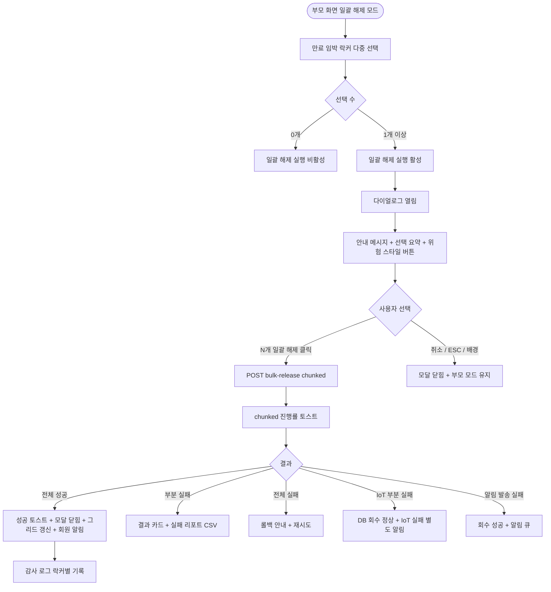

# DLG-050-007 일괄 해제 확인 다이얼로그

## 1. 다이얼로그 메타 정보

| 항목 | 값 |
|---|---|
| 작성일 | 2026-05-22 |
| 버전 | v1.0 |
| 상태 | 최신 통합본 반영 (정합화 완료) |
| 도메인 | D06 시설관리 |
| 다이얼로그 ID | DLG-050-007 |
| 다이얼로그명 | 일괄 해제 확인 |
| 다이얼로그 유형 | 확인 모달 (danger) + 일괄 처리 |
| 부모 화면 | SCR-050 락커 관리 |
| 호출 트리거 | 일괄 해제 모드에서 만료 임박 락커 다중 선택 후 [일괄 해제 실행] 클릭 |
| 기능코드 | FAC-01 (락커 관리) |
| 계약코드 | FAC-01-10 (일괄 해제) |
| 관련 API | `POST /api/lockers/bulk-release` |

이 문서는 DLG-050-007 일괄 해제 확인 다이얼로그에 대한 자기완결형 요구사항 정의서입니다.

## 2. 다이얼로그 개요와 목적

일괄 해제 확인 다이얼로그는 선택한 여러 만료 임박 락커를 한 번에 회수하기 전 최종 의사를 확인하는 모달입니다. 해제 시 모든 선택 락커의 회원 배정 정보가 초기화된다는 점을 명확히 안내하여 운영자가 실수로 다수 회원의 락커를 잘못 회수하는 것을 방지합니다.

매월 말 만료 임박 락커를 한 번에 정리하는 운영 흐름에 사용되며, chunked 트랜잭션으로 처리되어 부분 성공이 허용됩니다. 각 회원에게는 회수 알림(NFR-19)이 자동 발송되며 발송 실패는 알림 재시도 큐에 등록되어 락커 회수 자체는 성공으로 처리됩니다.

## 3. 호출 트리거와 부모 화면 연결

호출 트리거는 SCR-050 락커 관리 페이지에서 [만료 임박 일괄 해제] 버튼으로 일괄 해제 모드에 진입한 후 만료 임박 락커(D-7 이내)를 한 개 이상 선택하고 하단의 [일괄 해제 실행] 버튼을 클릭하는 것입니다.

부모 화면에서 호출 시점에 선택된 락커 ID 배열이 다이얼로그에 전달됩니다. 다이얼로그가 닫히면(해제 성공 또는 부분 성공 시) 부모 화면의 그리드가 갱신되어 해당 락커들이 빈 락커(회색)로 변경되고 일괄 해제 모드가 종료되어 선택이 초기화됩니다.

## 4. 레이아웃과 UI 구성

다이얼로그는 화면 중앙에 떠 있는 모달 형태이며 너비는 데스크톱 기준 500px입니다.

모달 상단에는 "만료 임박 락커 일괄 해제" 제목이 표시되고, 그 우측 상단에 닫기 X 버튼이 있습니다.

본문은 위에서 아래로 다음과 같이 구성됩니다.

첫 번째 영역은 안내 메시지입니다. "선택한 [N]개의 락커를 일괄 해제하시겠습니까? 해제 시 배정된 회원 정보가 모두 초기화됩니다." 메시지가 표시되며 선택된 락커 수가 큰 글씨로 강조됩니다.

두 번째 영역은 선택된 락커 요약입니다. 락커 번호와 회원명이 작은 칩 또는 목록 형태로 노출되어 운영자가 해제 대상을 확인할 수 있게 합니다. 락커 수가 많은 경우(예: 30개 이상) 앞쪽 5~10개만 노출하고 "외 N개" 표시가 추가됩니다.

세 번째 영역은 부가 안내입니다. "각 회원에게 회수 알림이 발송됩니다"라는 작은 글씨가 표시되어 운영자가 회원 알림 발송을 인지하게 합니다.

모달 하단에는 [N개 일괄 해제] · [취소] 버튼이 좌우로 배치됩니다. [N개 일괄 해제] 버튼은 위험(danger) 스타일(빨강 배경)로 표시되어 신중한 선택을 유도합니다.

## 5. 입력 필드와 검증

본 다이얼로그는 입력 필드가 없으며 단순 확인 모달입니다. 운영자가 [N개 일괄 해제] 버튼을 누르는 행위 자체가 의사 확인입니다.

선택된 락커가 0개인 경우 부모 화면에서 [일괄 해제 실행] 버튼이 비활성화되어 본 다이얼로그에 진입할 수 없습니다.

권한 검증은 부모 화면에서 미리 처리되어 권한 부족 시 [만료 임박 일괄 해제] 버튼이 노출되지 않습니다.

## 6. 버튼·아이콘·링크 액션 전체 정의

[N개 일괄 해제] 버튼은 위험(danger) 스타일로 표시되며 클릭 시 `POST /api/lockers/bulk-release`가 호출됩니다. 요청에 락커 ID 배열이 포함되고 chunked 트랜잭션으로 처리되어 응답이 스트리밍됩니다. 처리 중에는 chunked 진행률 토스트가 화면 하단에 표시됩니다.

전체 성공 시 "[N]개 락커가 일괄 해제되었습니다" 토스트가 표시되고 모달이 자동으로 닫히며 부모 화면 그리드가 갱신됩니다. 부분 실패 시 모달이 닫히지 않고 "성공 N건 / 실패 M건" 결과 카드가 표시되며 실패 리포트 CSV 다운로드 링크가 함께 제공됩니다.

[취소] 버튼과 우측 상단 X 버튼은 변경 없이 모달을 종료하며 부모 화면의 일괄 해제 모드와 선택은 유지됩니다.

ESC 키 또는 배경 클릭은 취소와 동일하게 동작합니다.

실패 리포트 CSV 다운로드 링크는 클릭 시 실패한 락커 ID · 회원 ID · 사유가 포함된 CSV 파일이 다운로드됩니다.

## 7. 토스트와 확인 팝업

성공 토스트는 "[N]개 락커가 일괄 해제되었습니다"가 5초간 표시됩니다.

실패 토스트는 "일괄 해제에 실패했습니다", "권한이 없어요", "다른 운영자가 동시에 처리했어요" 같은 문구가 표시됩니다.

부분 실패 결과 카드는 화면 중앙 하단에 표시되며 "성공 N건 / 실패 M건" + 실패 사유 분류(이미 회수됨, 동시 편집 충돌, 권한 부족 등) + 실패 리포트 CSV 다운로드 링크가 포함됩니다.

chunked 진행률 토스트는 처리 중 "5/30 처리 중..." 형태로 표시됩니다.

알림 발송 실패는 락커 회수와 분리되어 처리되며 별도의 토스트는 표시되지 않고 재시도 큐에 등록됩니다.

## 8. 데이터 흐름과 외부 연동

`POST /api/lockers/bulk-release`는 락커 ID 배열을 전송하고 chunked 처리로 응답을 스트리밍합니다. 응답에는 성공한 락커 배열 + 실패한 락커 배열(사유 포함)이 포함됩니다.

각 회원에게 NFR-19 알림이 일괄 발송됩니다(앱 푸시 + 회수 안내 메시지). 만료 임박 알림과 회수 알림이 동일 회원에게 동시에 발송되지 않도록 알림 시스템이 중복을 자동 필터링합니다.

스마트 락커(IoT) 연동이 활성화된 테넌트에서는 각 락커별로 게이트 잠금 해제 명령이 호출됩니다. 일부 락커의 IoT 명령이 실패하더라도 DB 회수는 정상 처리되며 IoT 실패 락커는 별도 알림으로 운영자에게 안내됩니다.

모든 회수 처리는 감사 로그(SCR-097)에 actor · locker_id · member_id · before-after 형태로 락커별로 기록됩니다.

알림 발송 실패는 재시도 큐에 등록되어 큐 모니터링에서 추적 가능합니다.

## 9. 다이얼로그 상태와 예외 처리

기본 상태는 안내 메시지 + 선택 락커 요약 + 일괄 해제/취소 버튼이 표시된 상태입니다.

처리 중 상태는 [N개 일괄 해제] 버튼이 비활성화되고 chunked 진행률 토스트가 표시됩니다.

전체 성공 상태는 토스트 + 모달 자동 닫힘 + 그리드 갱신이 일어납니다.

부분 실패 상태는 모달 유지 + 결과 카드 + 실패 리포트 CSV가 제공됩니다.

전체 실패 상태는 트랜잭션 롤백 안내 + 재시도 또는 개별 처리 전환이 안내됩니다.

예외 케이스별 처리는 다음과 같습니다.

권한 부족 시 부모 화면에서 [만료 임박 일괄 해제] 버튼이 노출되지 않습니다.

처리 중 일부 락커의 동시 편집 충돌(다른 운영자가 같은 락커를 동시 처리)이 발생하면 해당 락커만 실패 처리되고 결과 카드에 포함됩니다.

이미 회수된 락커(만료 경과 자동 회수 배치가 먼저 처리한 경우)는 실패 처리되어 결과 카드에 "이미 회수됨" 사유로 포함됩니다.

스마트 락커 IoT 명령 부분 실패 시 DB 회수는 정상 처리되고 IoT 실패 락커는 별도 알림으로 안내됩니다.

알림 발송 실패 시 회수 처리는 성공으로 처리되고 알림은 재시도 큐에 등록됩니다.

ESC/배경 클릭 시 모달은 닫히지만 부모 화면의 일괄 해제 모드와 선택은 유지됩니다.

대량 처리(100개 초과) 시 chunked 백그라운드 처리로 전환되며 진행률 토스트가 화면 하단에 고정 표시됩니다.

## 10. 권한별 처리

owner / manager만 일괄 해제가 가능합니다.

trainer / fc / staff / front는 일괄 해제 권한이 없으므로 부모 화면의 [만료 임박 일괄 해제] 버튼이 노출되지 않습니다.

readonly는 다이얼로그 진입 자체가 차단됩니다.

권한 없음은 다이얼로그 진입이 차단되고 부모 화면에서 권한 안내가 표시됩니다.

## 11. 화면 흐름

## 12. 운영 정책 (이 다이얼로그에 연결된 부분)

일괄 해제는 만료 임박 모드에서만 가능하며 만료 임박(D-7 이내) 락커만 선택할 수 있습니다. 그 외 락커는 부모 화면에서 선택 자체가 차단됩니다.

일괄 해제는 chunked 트랜잭션으로 처리되어 부분 성공이 허용됩니다. 일부 락커가 실패하더라도 정상 처리된 락커는 그대로 유지됩니다.

부분 실패는 결과 카드로 표시되며 실패 리포트 CSV에 락커 ID · 회원 ID · 사유가 포함되어 운영자가 사후 처리를 이어갈 수 있습니다.

각 회원에게 NFR-19 알림이 일괄 발송됩니다(앱 푸시 + 회수 안내). 만료 임박 알림과 회수 알림이 동일 회원에게 동시 발송되지 않도록 알림 시스템이 자동 필터링합니다.

알림 발송 실패는 회수 처리와 분리되어 재시도 큐에 등록되며 회수 자체는 성공으로 처리됩니다.

스마트 락커(IoT) 연동이 활성화된 테넌트에서는 각 락커별로 게이트 잠금 해제 명령이 호출됩니다. 일부 IoT 실패는 DB 회수와 분리되어 별도 알림으로 안내됩니다.

대량 처리(100개 초과) 시 chunked 백그라운드 처리로 전환되며 진행률 토스트가 화면 하단에 고정 표시됩니다.

모든 회수 처리는 감사 로그(SCR-097)에 actor · locker_id · member_id · before-after 형태로 락커별로 기록됩니다.

[N개 일괄 해제] 버튼은 위험(danger) 스타일로 표시되어 운영자가 신중하게 결정하도록 시각적으로 유도합니다.

본사 통합 모드에서 다른 지점 락커 일괄 해제 시도 시 권한자 외 차단됩니다.

권한별 가시성: 슈퍼관리자 · Owner(지점장) · 매니저만 일괄 해제가 가능합니다.

만료 경과 자동 회수 배치(매일 02:00)와 본 다이얼로그가 동시에 같은 락커를 처리할 가능성이 있으므로 백엔드에서 락 처리로 중복을 방지합니다. 이미 자동 회수된 락커에 대한 일괄 해제 시도는 "이미 회수됨" 사유로 실패 처리됩니다.

이상의 모든 정책은 이 다이얼로그를 구현하고 운영하는 사람이 별도 문서 없이 이 한 장만 보면 이해할 수 있도록 풀어 적었습니다.
