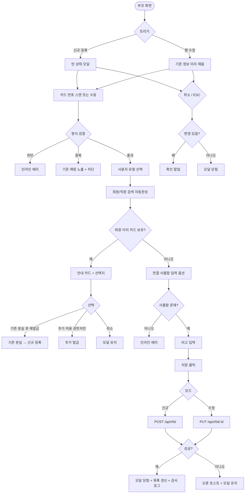

# DLG-052-001 RFID 등록/수정 다이얼로그

## 1. 다이얼로그 메타 정보

| 항목 | 값 |
|---|---|
| 작성일 | 2026-05-22 |
| 버전 | v1.0 |
| 상태 | 최신 통합본 반영 (정합화 완료) |
| 도메인 | D06 시설관리 |
| 다이얼로그 ID | DLG-052-001 |
| 다이얼로그명 | RFID 등록/수정 |
| 다이얼로그 유형 | 입력 + 처리 모달 (양방향: 신규 등록 / 수정) |
| 부모 화면 | SCR-052 밴드/카드 관리 |
| 호출 트리거 | 헤더 [신규 등록] 버튼 또는 행 [수정] 버튼 클릭 |
| 기능코드 | FAC-03 (RFID 밴드/카드 관리) |
| 계약코드 | FAC-03-04 (신규 등록), FAC-03-05 (수정) |
| 관련 API | `POST /api/rfid` (신규) · `PUT /api/rfid/:id` (수정) |

이 문서는 DLG-052-001 RFID 등록/수정 다이얼로그에 대한 자기완결형 요구사항 정의서입니다.

## 2. 다이얼로그 개요와 목적

RFID 등록/수정 다이얼로그는 새로운 RFID 카드 또는 밴드를 시스템에 등록하거나 기존 카드 정보를 수정하는 모달입니다. 카드 번호를 RFID 리더로 스캔하거나 수동으로 입력하고, 연결할 회원 또는 직원을 지정합니다.

운영 흐름은 신규 회원 등록 직후 카드를 발급하거나, 손상된 카드를 교체하거나, 직원 출입 카드를 발급하거나, 회원 락커 변경 시 카드의 연결 사물함 정보를 동기화하는 등 다양합니다. 카드 번호는 시스템 내 고유이며 형식은 16자리 HEX(또는 테넌트 정의)입니다.

## 3. 호출 트리거와 부모 화면 연결

호출 트리거는 SCR-052 밴드/카드 관리 페이지의 헤더 [신규 등록] 버튼(신규 모드) 또는 카드 목록 테이블 행의 [수정] 버튼(수정 모드)입니다.

부모 화면에서 호출 시점에 신규 모드에서는 빈 상태로, 수정 모드에서는 카드 ID와 기존 정보(카드 번호 · 사용자 유형 · 회원/직원 · 연결 사물함)가 다이얼로그에 전달되어 미리 채워진 상태로 열립니다.

다이얼로그가 닫히면(저장 성공 시) 부모 화면의 카드 목록이 자동 갱신됩니다.

## 4. 레이아웃과 UI 구성

다이얼로그는 화면 중앙에 떠 있는 모달 형태이며 너비는 데스크톱 기준 560px입니다.

모달 상단의 제목은 모드에 따라 동적으로 표시됩니다. 신규 모드에서는 "RFID 카드 등록", 수정 모드에서는 "RFID 카드 수정"이 표시됩니다.

본문은 위에서 아래로 다음과 같이 구성됩니다.

첫 번째 영역은 카드 번호 입력입니다. 스캔 대기 상태가 시각적으로 표시(무선 아이콘 + 깜빡임 효과)되어 운영자가 카드를 리더에 가져다 대거나 직접 16자리 HEX로 수동 입력할 수 있습니다. 형식 위반 시 인라인 에러 "올바른 형식이 아닙니다 (16자리 HEX)"가 표시됩니다. 중복 등록 시 인라인 에러 "동일 카드 번호가 이미 등록되어 있습니다"와 기존 매핑 정보가 함께 노출됩니다. 수정 모드에서는 카드 번호가 일반적으로 읽기 전용(비활성)으로 표시됩니다.

두 번째 영역은 사용자 유형 선택입니다. 회원 / 직원 라디오 또는 토글로 단일 선택합니다. 발급 후 변경 시 매핑 재설정이 필요합니다.

세 번째 영역은 회원 또는 직원 연결 자동완성입니다. 사용자 유형이 회원인 경우 회원 검색 자동완성(이름 · 회원 번호 · 연락처)이 활성화되고, 직원인 경우 직원 검색 자동완성이 활성화됩니다. 디바운스 300ms + 최소 2자 입력 정책을 따릅니다.

네 번째 영역은 연결 사물함 입력입니다. 락커 번호를 입력하면 카드-사물함 매핑이 생성됩니다. 선택 사항이며 사물함이 존재하지 않으면 인라인 에러 "선택한 사물함이 존재하지 않습니다"가 표시됩니다.

다섯 번째 영역은 비고 입력란입니다. textarea로 운영자 메모를 자유 입력합니다.

여섯 번째 영역은 이미 카드 보유 회원에 대한 안내 카드입니다. 회원 선택 후 해당 회원이 이미 활성 카드를 보유한 경우 카드가 표시되어 기존 카드 정보 노출 + [기존 분실 후 재발급] / [추가 허용(권한자만)] / [취소] 선택지가 제공됩니다.

모달 하단에는 [저장] · [취소] 버튼이 좌우로 배치됩니다.

## 5. 입력 필드와 검증

카드 번호는 16자리 HEX(또는 테넌트 정의 형식) 필수 입력이며 형식 위반 시 인라인 에러가 표시됩니다. 시스템 내 고유로 중복 등록은 차단됩니다.

사용자 유형 선택은 회원 / 직원 단일 선택이며 필수입니다.

회원/직원 검색 자동완성은 디바운스 300ms + 최소 2자 입력입니다. 검색 결과 0건이면 "검색 결과가 없어요" + 회원 등록 안내가 표시됩니다.

연결 사물함은 선택 사항이며 존재하지 않는 사물함 번호 입력 시 인라인 에러로 차단됩니다.

[저장] 버튼은 카드 번호와 사용자 유형 + 회원/직원 선택이 모두 완료된 경우에만 활성화됩니다.

## 6. 버튼·아이콘·링크 액션 전체 정의

[저장] 버튼은 입력된 정보로 카드를 등록 또는 수정합니다. 신규 모드에서는 `POST /api/rfid`, 수정 모드에서는 `PUT /api/rfid/:id`가 호출됩니다. 저장 성공 시 모달이 자동으로 닫히고 부모 화면 목록이 갱신됩니다. 저장 실패 시 오류 토스트가 표시되고 모달은 닫히지 않습니다.

[취소] 버튼과 우측 상단 X 버튼은 변경 없이 모달을 종료합니다. 입력 도중 변경 사항이 있는 경우 확인 팝업이 표시됩니다.

ESC 키 또는 배경 클릭은 취소와 동일하게 동작합니다.

회원 카드의 X 버튼은 회원 선택을 취소하고 다시 회원 검색 상태로 돌아갑니다.

스캔 대기 영역 클릭 시 RFID 리더가 활성화됩니다. 리더 미연결 시 수동 입력으로 자동 폴백되고 상단에 빨강 배지가 표시됩니다.

이미 카드 보유 회원 안내 카드의 [기존 분실 후 재발급] 버튼은 기존 카드를 먼저 분실 처리하고 신규 등록을 진행하는 트랜잭션입니다. [추가 허용(권한자만)] 버튼은 슈퍼관리자·센터장만 활성화되며 기존 카드 유지 + 추가 발급을 진행합니다.

## 7. 토스트와 확인 팝업

성공 토스트는 "카드가 등록되었어요" 또는 "카드 정보가 수정되었어요"가 5초간 표시됩니다.

실패 토스트는 "카드 번호 중복", "올바른 형식이 아닙니다", "선택한 사물함이 존재하지 않아요", "리더 장치 확인 필요", "권한이 없어요" 같은 문구가 표시됩니다.

확인 팝업은 변경 사항이 있는 상태에서 모달을 닫으려고 할 때 "변경 사항이 사라집니다. 닫으시겠습니까?" + [확인] / [취소]가 표시됩니다.

## 8. 데이터 흐름과 외부 연동

신규 등록은 `POST /api/rfid`, 수정은 `PUT /api/rfid/:id`로 처리됩니다. 요청에 카드 번호 · 사용자 유형 · 회원/직원 ID · 연결 사물함 · 비고가 포함됩니다.

회원 검색은 `GET /api/members/search`, 직원 검색은 `GET /api/staff/search`로 디바운스 300ms 후 호출됩니다.

RFID 리더 상태는 부모 화면의 30초 주기 폴링으로 갱신되며, 본 다이얼로그 진입 시점의 상태가 스캔 영역에 반영됩니다.

회원이 이미 활성 카드를 보유한 경우 백엔드에서 409 응답 + 기존 카드 정보가 함께 반환되어 모달에 안내 카드가 표시됩니다.

연결 사물함 변경 시 카드-사물함 매핑이 즉시 갱신됩니다.

모든 등록 · 수정 처리는 감사 로그(SCR-097)에 actor · card_id · user_id · before-after 형태로 기록됩니다.

## 9. 다이얼로그 상태와 예외 처리

기본 상태는 신규 모드는 모든 필드 빈 상태, 수정 모드는 기존 정보가 미리 채워진 상태입니다.

카드 번호 미입력 상태는 [저장] 버튼이 비활성 상태입니다.

저장 중 상태는 [저장] 버튼이 비활성화되고 스피너가 표시됩니다.

저장 성공 상태는 모달 자동 닫힘 + 목록 갱신이 일어납니다.

저장 실패 상태는 오류 토스트 + 모달 유지로 재시도가 가능합니다.

예외 케이스별 처리는 다음과 같습니다.

카드 번호 중복 시 인라인 에러 + 기존 매핑 정보 노출로 차단됩니다.

카드 형식 오류 시 인라인 에러로 차단됩니다.

리더 미연결 시 상단 빨강 배지 + 수동 입력 가이드가 표시됩니다.

회원 검색 0건 시 "검색 결과가 없어요" 안내가 표시됩니다.

이미 카드 보유 회원 추가 발급 시 안내 카드 + [기존 분실 후 재발급] / [추가 허용 권한자만] / [취소] 선택지가 제공됩니다.

추가 허용 권한 부족 시 [추가 허용] 버튼이 비활성화되거나 hidden 됩니다.

연결 사물함 미존재 시 인라인 에러로 차단됩니다.

동시 매핑 충돌 시 "이미 다른 회원에게 매핑되었습니다" 안내 + 새로고침이 안내됩니다.

권한 부족 시 다이얼로그 진입이 차단됩니다.

ESC/배경 클릭 시 입력 변경이 있으면 확인 팝업이 표시됩니다.

## 10. 권한별 처리

owner / manager는 신규 등록 · 수정 모두 가능합니다.

staff / fc / front는 부모 화면 정책에 따라 신규 등록 · 분실 처리만 가능합니다. 삭제는 불가능합니다.

추가 허용(이미 카드 보유 회원에 추가 발급)은 슈퍼관리자 · 센터장만 가능합니다.

trainer / readonly는 다이얼로그 진입 자체가 차단됩니다.

권한 없음은 다이얼로그 진입이 차단되고 부모 화면에서 권한 안내가 표시됩니다.

## 11. 화면 흐름

## 12. 운영 정책 (이 다이얼로그에 연결된 부분)

RFID 카드 번호는 시스템 내 고유값으로 중복 등록이 차단됩니다(UNIQUE 제약). 형식은 16자리 HEX(또는 테넌트 정의)이며 형식 위반 시 등록이 차단됩니다.

카드 등록 방식은 RFID 리더 스캔(권장) 또는 수동 입력입니다. 수동 입력은 형식 검증 통과 시에만 허용됩니다.

사용자 유형은 회원 / 직원 단일 선택이며 발급 후 변경 시 매핑 재설정이 필요합니다.

회원 1명당 활성 카드 보유 수 정책은 1개가 기본이며 테넌트 토글로 무제한 운영 가능합니다. 정책 위반 시 모달에서 [기존 분실 후 재발급] / [추가 허용 권한자만] / [취소] 선택지가 제공됩니다. 추가 허용은 슈퍼관리자 · 센터장에 한정됩니다.

직원 1명당 활성 카드 보유 수는 1개가 기본입니다.

연결 사물함은 선택 사항이며 변경 시 카드-사물함 매핑이 즉시 갱신됩니다.

수정 모드에서 카드 번호 자체는 일반적으로 변경 불가하며 매핑 정보(사용자 유형 · 회원/직원 · 사물함)만 수정 가능합니다.

모든 등록 · 수정 처리는 감사 로그(SCR-097)에 actor · card_id · user_id · before-after 형태로 기록됩니다.

권한별 가시성: 슈퍼관리자 · 센터장 · 매니저는 모든 작업 가능. FC · 스태프 · 프런트는 등록 가능, 삭제 불가. 트레이너 · 읽기 전용은 조회만 가능합니다.

본사 통합 모드에서 다른 지점 카드 등록/수정 시도 시 권한자 외 차단됩니다.

RFID 리더 미연결 시 수동 입력으로 자동 폴백되며 상단에 빨강 배지가 표시됩니다.

이상의 모든 정책은 이 다이얼로그를 구현하고 운영하는 사람이 별도 문서 없이 이 한 장만 보면 이해할 수 있도록 풀어 적었습니다.
