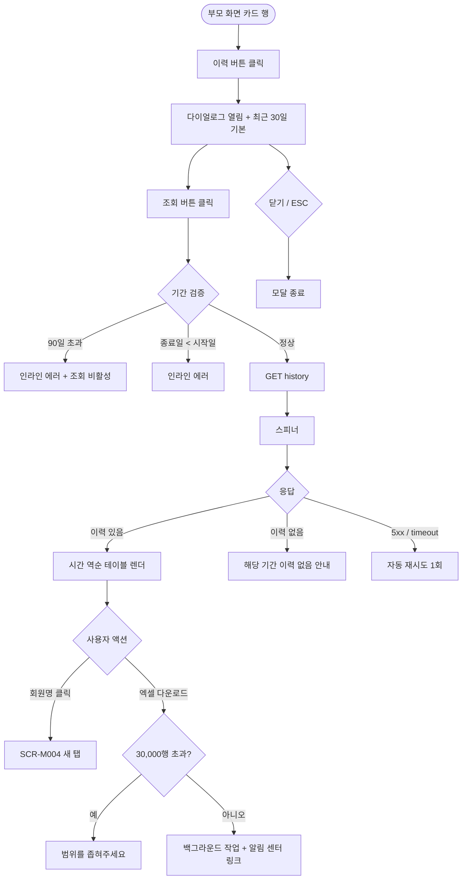

# DLG-052-002 RFID 이력 조회 다이얼로그

## 1. 다이얼로그 메타 정보

| 항목 | 값 |
|---|---|
| 작성일 | 2026-05-22 |
| 버전 | v1.0 |
| 상태 | 최신 통합본 반영 (정합화 완료) |
| 도메인 | D06 시설관리 |
| 다이얼로그 ID | DLG-052-002 |
| 다이얼로그명 | RFID 이력 조회 |
| 다이얼로그 유형 | 조회 모달 |
| 부모 화면 | SCR-052 밴드/카드 관리 |
| 호출 트리거 | 카드 행의 [이력] 버튼 클릭 |
| 기능코드 | FAC-03 (RFID 밴드/카드 관리) |
| 계약코드 | FAC-03-07 (이력 조회) |
| 관련 API | `GET /api/rfid/:id/history` |

이 문서는 DLG-052-002 RFID 이력 조회 다이얼로그에 대한 자기완결형 요구사항 정의서입니다.

## 2. 다이얼로그 개요와 목적

RFID 이력 조회 다이얼로그는 특정 카드의 과거 사용 이력을 기간별로 조회하는 모달입니다. 언제 어디서 해당 카드가 사용되었는지(출입 · 락커 · 결제 등) 확인할 수 있어 보안 사고 발생 시 카드 사용 이력 추적이나 회원 분쟁 시 사용 증빙 자료로 활용됩니다.

이력 기간은 최대 90일 범위로 제한됩니다. 90일 초과 이력은 별도 분석 화면(데이터 웨어하우스)에서 조회 가능합니다. 카드 사용 이력은 90일 이상 보관되며 정책에 따라 1~3년까지 보관 가능합니다.

## 3. 호출 트리거와 부모 화면 연결

호출 트리거는 SCR-052 밴드/카드 관리 페이지의 카드 목록 테이블 행의 [이력] 버튼 클릭입니다.

부모 화면에서 호출 시점에 카드 ID와 카드 번호가 다이얼로그에 전달됩니다. 다이얼로그는 부모 화면의 변경 없이 조회 전용이므로 닫을 때 부모 화면 갱신이 일어나지 않습니다.

## 4. 레이아웃과 UI 구성

다이얼로그는 화면 중앙에 떠 있는 모달 형태이며 너비는 데스크톱 기준 720px의 넓은 모달입니다(이력 테이블 표시 공간 확보).

모달 상단에는 "RFID 이력 조회 — [카드 번호]" 제목이 표시되고, 그 우측 상단에 닫기 X 버튼이 있습니다.

본문은 위에서 아래로 다음과 같이 구성됩니다.

첫 번째 영역은 기간 선택입니다. 조회 시작일과 종료일 날짜 선택기가 가로로 배치되며 기본값은 최근 30일입니다. 기간이 90일을 초과하면 인라인 에러 "최대 90일 범위로 조회 가능합니다"가 표시됩니다. 우측에 [조회] 버튼이 배치됩니다.

두 번째 영역은 이력 테이블입니다. 컬럼은 등록일 / 카드 번호 / 회원명 / 상태(출입 · 락커 · 결제 등) 순서이며 시간 역순으로 표시됩니다. 회원명 클릭은 SCR-M004 회원 상세로 이동합니다.

이력 테이블 우측 상단에는 [엑셀 다운로드] 버튼이 있어 현재 조회된 이력을 엑셀로 다운로드할 수 있습니다.

모달 하단에는 [닫기] 버튼이 우측에 배치됩니다.

## 5. 입력 필드와 검증

기간 선택은 시작일과 종료일을 각각 날짜 선택기로 입력하며 기본값은 최근 30일입니다.

종료일이 시작일보다 빠른 경우 인라인 에러 "종료일은 시작일 이후여야 합니다"가 표시됩니다.

기간이 90일을 초과하면 인라인 에러 "최대 90일 범위로 조회 가능합니다"가 표시되며 [조회] 버튼이 비활성화됩니다.

기간을 미래 날짜로 설정해도 조회 결과는 0건이며 별도 에러는 표시되지 않습니다.

## 6. 버튼·아이콘·링크 액션 전체 정의

[조회] 버튼은 선택한 기간의 이력을 fetch합니다. `GET /api/rfid/:id/history`가 호출되며 시작일·종료일이 쿼리 파라미터로 전송됩니다. 처리 중에는 스피너가 표시됩니다.

이력 테이블의 회원명 클릭은 새 탭에서 SCR-M004 회원 상세를 엽니다. 다이얼로그는 닫히지 않고 유지됩니다.

[엑셀 다운로드] 버튼은 현재 조회된 이력을 엑셀로 다운로드합니다. 파일명은 `RFID이력_[카드번호]_YYYYMMDD.xlsx` 규칙을 따릅니다.

[닫기] 버튼과 우측 상단 X 버튼은 다이얼로그를 종료합니다.

ESC 키 또는 배경 클릭은 닫기와 동일하게 동작합니다.

## 7. 토스트와 확인 팝업

성공 토스트는 일반적으로 표시되지 않으며 조회는 즉시 테이블에 반영됩니다.

실패 토스트는 "이력을 불러올 수 없어요", "최대 90일 범위로 조회 가능합니다", "권한이 없어요" 같은 문구가 표시됩니다.

엑셀 다운로드 시 "엑셀 다운로드가 시작되었어요" 토스트가 표시됩니다.

## 8. 데이터 흐름과 외부 연동

`GET /api/rfid/:id/history`는 카드 ID + 시작일 + 종료일을 쿼리 파라미터로 전송하고 응답으로 이력 배열(시간 역순)이 내려옵니다.

이력 한 건은 timestamp · action(출입/락커/결제 등) · location(게이트/락커번호/POS 등) · member_id · member_name으로 구성됩니다.

90일 초과 이력은 데이터 웨어하우스에 보관되어 별도 분석 화면에서 조회됩니다. 본 다이얼로그에서는 최근 90일 이력만 조회 가능합니다.

엑셀 다운로드는 백그라운드 작업으로 분리되어 완료 시 알림 센터에 다운로드 링크가 푸시됩니다.

이력 조회는 감사 로그(SCR-097)에 actor · card_id · query_period 형태로 기록되어 누가 언제 어떤 카드의 이력을 조회했는지 추적 가능합니다.

## 9. 다이얼로그 상태와 예외 처리

기본 상태는 기간 선택 기본값(최근 30일) + 비어 있는 이력 테이블이 표시되며 [조회] 버튼을 누르면 데이터가 로드됩니다.

로딩 중 상태는 이력 테이블 자리에 스켈레톤이 표시됩니다.

이력 있음 상태는 시간 역순 행으로 표시됩니다.

이력 없음 상태는 "해당 기간의 이력이 없습니다" 안내가 표시됩니다.

기간 90일 초과 상태는 인라인 에러 + [조회] 버튼 비활성화로 차단됩니다.

오류 상태는 5xx 또는 timeout 시 "이력을 불러올 수 없어요" + 재시도 버튼이 표시됩니다.

예외 케이스별 처리는 다음과 같습니다.

기간 90일 초과 시 인라인 에러 + 별도 분석 화면 안내가 표시됩니다.

종료일이 시작일보다 빠른 경우 인라인 에러로 차단됩니다.

조회 결과 0건 시 "해당 기간의 이력이 없습니다" 안내가 표시됩니다.

권한 부족 시 다이얼로그 진입이 차단되고 부모 화면에서 권한 안내가 표시됩니다.

네트워크 오류 시 자동 재시도 1회 후 사용자 액션을 기다립니다.

엑셀 다운로드 30,000행 초과 시 차단되며 "범위를 좁혀주세요" 안내가 표시됩니다.

## 10. 권한별 처리

owner / manager는 이력 조회와 엑셀 다운로드 모두 가능합니다.

staff / fc / front는 이력 조회만 가능하며 엑셀 다운로드는 제한될 수 있습니다.

trainer / readonly는 다이얼로그 진입 자체가 차단됩니다.

권한 없음은 다이얼로그 진입이 차단되고 부모 화면에서 권한 안내가 표시됩니다.

## 11. 화면 흐름

## 12. 운영 정책 (이 다이얼로그에 연결된 부분)

카드 사용 이력은 90일 이상 보관되며 테넌트 정책에 따라 1~3년까지 보관 가능합니다.

이력 기간 선택은 최대 90일 범위로 제한됩니다. 90일 초과 이력은 별도 분석 화면(데이터 웨어하우스)에서 조회 가능합니다.

이력 한 건은 timestamp · action(출입/락커/결제 등) · location · member_id · member_name으로 구성됩니다.

이력 자체는 읽기 전용이며 운영자가 임의로 수정 · 삭제할 수 없습니다.

회원명 클릭은 SCR-M004로 이동하며 회원이 탈퇴 · 삭제된 경우 마스킹된 이름이 표시될 수 있습니다.

엑셀 다운로드는 현재 조회된 이력을 다운로드하며 파일명은 `RFID이력_[카드번호]_YYYYMMDD.xlsx`입니다.

이력 조회는 감사 로그(SCR-097)에 actor · card_id · query_period 형태로 기록되어 누가 언제 어떤 카드의 이력을 조회했는지 추적 가능합니다. 이는 개인정보 보호 정책에 따른 조치이며 본사 감사 시 활용됩니다.

권한별 가시성: 슈퍼관리자 · 센터장 · 매니저 · 스태프는 이력 조회 가능. 매니저 이상은 엑셀 다운로드 가능. 트레이너 · 읽기 전용은 조회 불가.

본사 통합 모드에서 다른 지점 카드 이력 조회 시도 시 권한자 외 차단됩니다.

분실 카드 외부 사용 시도 로그는 본 이력 조회와 별도로 시도 로그 테이블에 기록되어 보안 분석에 활용됩니다.

이상의 모든 정책은 이 다이얼로그를 구현하고 운영하는 사람이 별도 문서 없이 이 한 장만 보면 이해할 수 있도록 풀어 적었습니다.
