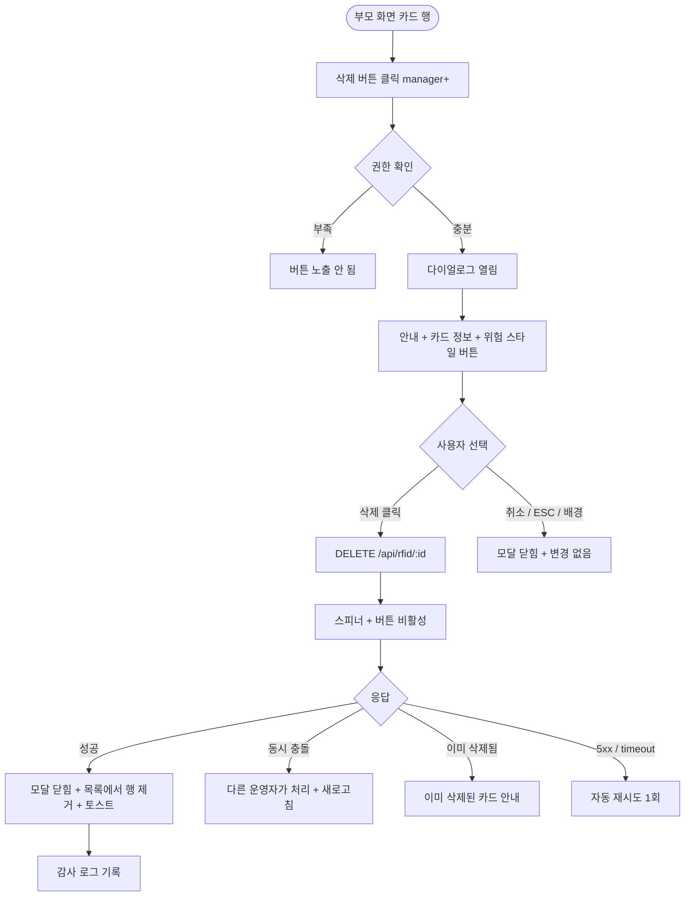

# DLG-052-003 RFID 삭제 확인 다이얼로그

## 1. 다이얼로그 메타 정보

| 항목 | 값 |
|---|---|
| 작성일 | 2026-05-22 |
| 버전 | v1.0 |
| 상태 | 최신 통합본 반영 (정합화 완료) |
| 도메인 | D06 시설관리 |
| 다이얼로그 ID | DLG-052-003 |
| 다이얼로그명 | RFID 삭제 확인 |
| 다이얼로그 유형 | 확인 모달 (danger) |
| 부모 화면 | SCR-052 밴드/카드 관리 |
| 호출 트리거 | 카드 행의 [삭제] 버튼 클릭 |
| 기능코드 | FAC-03 (RFID 밴드/카드 관리) |
| 계약코드 | FAC-03-08 (삭제) |
| 관련 API | `DELETE /api/rfid/:id` |

이 문서는 DLG-052-003 RFID 삭제 확인 다이얼로그에 대한 자기완결형 요구사항 정의서입니다.

## 2. 다이얼로그 개요와 목적

RFID 삭제 확인 다이얼로그는 카드 정보를 영구 삭제하기 전 최종 의사를 확인하는 모달입니다. 삭제 시 연결된 회원·직원과의 매핑 관계가 끊어지며 복구할 수 없습니다. 다만 감사 로그에는 삭제 이력이 보존되어 사후 추적이 가능합니다.

운영 흐름은 퇴직 직원의 출입 카드 회수, 손상된 카드 영구 폐기, 오등록 카드 정리 등에 사용됩니다. 매니저 이상 권한자만 사용 가능하며 FC · 스태프 · 프런트는 분실 처리만 가능하고 삭제는 불가능합니다.

## 3. 호출 트리거와 부모 화면 연결

호출 트리거는 SCR-052 밴드/카드 관리 페이지의 카드 목록 테이블 행의 [삭제] 버튼 클릭입니다. [삭제] 버튼은 매니저 이상 권한자에게만 노출됩니다.

부모 화면에서 호출 시점에 카드 ID와 카드 번호가 다이얼로그에 전달됩니다. 다이얼로그가 닫히면(삭제 성공 시) 부모 화면의 카드 목록에서 해당 행이 즉시 제거됩니다.

## 4. 레이아웃과 UI 구성

다이얼로그는 화면 중앙에 떠 있는 컴팩트한 확인 모달이며 너비는 480px입니다.

모달 상단에는 "카드 삭제" 제목이 표시되고, 그 우측 상단에 닫기 X 버튼이 있습니다.

본문에는 안내 메시지가 표시됩니다. "카드 ID: [카드 번호]를 삭제하시겠습니까? 삭제된 정보는 복구할 수 없으며, 연결된 회원과의 관계가 끊어집니다." 메시지 아래에 카드 번호와 연결된 사용자(회원명 또는 직원명)가 강조 표시되어 운영자가 어떤 카드를 삭제하는지 명확히 인지할 수 있게 합니다.

모달 하단에는 [삭제] · [취소] 버튼이 좌우로 배치됩니다. [삭제] 버튼은 위험(danger) 스타일(빨강 배경 또는 빨강 텍스트)로 표시되어 운영자가 신중하게 결정하도록 유도합니다.

## 5. 입력 필드와 검증

본 다이얼로그는 입력 필드가 없으며 단순 확인 모달입니다.

권한 검증은 부모 화면에서 미리 처리되어 권한 부족 시 [삭제] 버튼이 노출되지 않습니다. 직접 URL 또는 API 호출 시도 시 백엔드 403으로 차단됩니다.

## 6. 버튼·아이콘·링크 액션 전체 정의

[삭제] 버튼은 위험(danger) 스타일로 표시되며 클릭 시 `DELETE /api/rfid/:id`가 호출됩니다. 처리 중에는 스피너가 표시되고 [삭제] 버튼이 비활성화됩니다. 성공 시 모달이 자동으로 닫히고 부모 화면 목록에서 해당 행이 제거됩니다. 실패 시 오류 토스트가 표시되고 모달은 닫히지 않습니다.

[취소] 버튼과 우측 상단 X 버튼은 변경 없이 모달을 종료합니다.

ESC 키 또는 배경 클릭은 취소와 동일하게 동작합니다.

## 7. 토스트와 확인 팝업

성공 토스트는 "카드가 삭제되었어요"가 5초간 표시됩니다.

실패 토스트는 "삭제에 실패했습니다", "권한이 없어요", "다른 운영자가 이미 처리했어요" 같은 문구가 표시됩니다.

## 8. 데이터 흐름과 외부 연동

`DELETE /api/rfid/:id`는 카드 ID를 전송하며 백엔드에서 영구 삭제 처리됩니다. 단, 감사 로그에는 삭제 이력이 보존되어 사후 추적이 가능합니다.

연결된 회원·직원과의 매핑 관계가 자동으로 끊어집니다. 연결된 사물함이 있는 경우 사물함은 그대로 유지되며 카드 매핑만 해제됩니다.

삭제된 카드의 이전 사용 이력은 별도 이력 테이블에 보존되어 보안 추적이 가능합니다. 다만 본 다이얼로그를 통해 삭제된 카드는 더 이상 활성 카드 목록에 노출되지 않습니다.

모든 삭제 처리는 감사 로그(SCR-097)에 actor · card_id · user_id · before-after 형태로 기록됩니다. 삭제 이력은 영구 보존되어 사후 감사 시 활용됩니다.

## 9. 다이얼로그 상태와 예외 처리

기본 상태는 안내 메시지 + 카드 정보 + 삭제/취소 버튼이 표시된 상태입니다.

처리 중 상태는 [삭제] 버튼이 비활성화되고 스피너가 표시됩니다.

삭제 성공 상태는 모달 자동 닫힘 + 목록에서 행 제거 + 토스트가 일어납니다.

삭제 실패 상태는 오류 토스트 + 모달 유지로 재시도가 가능합니다.

예외 케이스별 처리는 다음과 같습니다.

권한 부족 시 부모 화면에서 [삭제] 버튼이 노출되지 않습니다.

동시 편집 충돌(다른 운영자가 같은 카드를 동시 처리) 시 "다른 운영자가 이미 처리했어요" 안내가 표시되며 새로고침이 안내됩니다.

이미 삭제된 카드에 대한 삭제 시도 시 "이미 삭제된 카드입니다" 안내가 표시됩니다.

네트워크 오류 시 자동 재시도 1회 후 사용자 액션을 기다립니다.

## 10. 권한별 처리

owner / manager만 삭제가 가능합니다. 부모 화면에서 [삭제] 버튼이 매니저 이상에게만 노출됩니다.

staff / fc / front는 삭제 권한이 없으므로 부모 화면에서 [삭제] 버튼이 노출되지 않습니다. 분실 처리만 가능합니다.

trainer / readonly는 다이얼로그 진입 자체가 차단됩니다.

권한 없음은 다이얼로그 진입이 차단되고 부모 화면에서 권한 안내가 표시됩니다.

## 11. 화면 흐름

## 12. 운영 정책 (이 다이얼로그에 연결된 부분)

RFID 카드 삭제는 영구 삭제이며 연결된 회원·직원과의 매핑 관계가 끊어집니다. 단, 감사 로그에는 삭제 이력이 보존되어 사후 추적이 가능합니다.

연결된 사물함은 그대로 유지되며 카드 매핑만 해제됩니다.

삭제된 카드의 이전 사용 이력은 별도 이력 테이블에 보존되어 보안 추적이 가능합니다.

분실 → 삭제 순서로 처리한 카드는 분실 시각 · 삭제 시각 모두 이력 보존됩니다. 분실 처리 후 일정 기간(예: 30일) 경과 후 삭제하는 운영 정책이 있을 수 있습니다.

분실 처리만 가능한 권한자(FC · 스태프 · 프런트)는 삭제 권한이 없으므로 본 다이얼로그에 진입할 수 없습니다. 분실 처리는 SCR-052의 행 [분실 처리] 버튼으로 별도 처리됩니다.

모든 삭제 처리는 감사 로그(SCR-097)에 actor · card_id · user_id · before-after 형태로 기록됩니다. 삭제 이력은 영구 보존되어 사후 감사 시 활용됩니다.

[삭제] 버튼은 위험(danger) 스타일로 표시되어 운영자가 신중하게 결정하도록 시각적으로 유도합니다.

권한별 가시성: 슈퍼관리자 · 센터장 · 매니저만 삭제 가능합니다.

본사 통합 모드에서 다른 지점 카드 삭제 시도 시 권한자 외 차단됩니다.

직원 퇴직 이벤트 시 직원 카드가 자동 분실 처리되며 운영자가 본 다이얼로그로 별도 삭제하지 않아도 됩니다. 단, 운영 정리 차원에서 삭제하려는 경우 본 다이얼로그를 사용할 수 있습니다.

회원 탈퇴 · 이관 · 삭제 이벤트 시 보유 카드가 자동으로 분실 또는 삭제 처리될 수 있습니다(테넌트 정책).

이상의 모든 정책은 이 다이얼로그를 구현하고 운영하는 사람이 별도 문서 없이 이 한 장만 보면 이해할 수 있도록 풀어 적었습니다.
