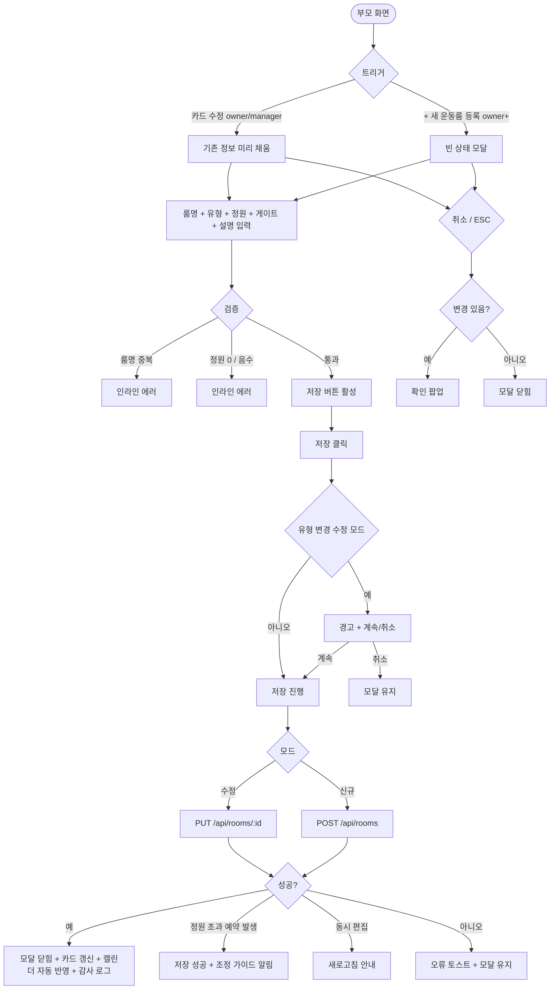

# DLG-053-001 룸 등록/수정 다이얼로그

## 1. 다이얼로그 메타 정보

| 항목 | 값 |
|---|---|
| 작성일 | 2026-05-22 |
| 버전 | v1.0 |
| 상태 | 최신 통합본 반영 (정합화 완료) |
| 도메인 | D06 시설관리 |
| 다이얼로그 ID | DLG-053-001 |
| 다이얼로그명 | 룸 등록/수정 |
| 다이얼로그 유형 | 입력 + 처리 모달 (양방향: 신규 등록 / 수정) |
| 부모 화면 | SCR-053 운동룸 관리 |
| 호출 트리거 | 헤더 [+ 새 운동룸 등록] 버튼 또는 카드 [수정] 버튼 클릭 |
| 기능코드 | FAC-04 (운동룸 관리) |
| 계약코드 | FAC-04-06 (등록), FAC-04-07 (수정) |
| 관련 API | `POST /api/rooms` (신규) · `PUT /api/rooms/:id` (수정) |

이 문서는 DLG-053-001 룸 등록/수정 다이얼로그에 대한 자기완결형 요구사항 정의서입니다.

## 2. 다이얼로그 개요와 목적

룸 등록/수정 다이얼로그는 새 운동룸을 등록하거나 기존 운동룸의 정보를 수정하는 모달입니다. 룸명 · 유형 · 수용 인원 · 게이트 · 룸 설명을 입력해 운동룸을 관리합니다.

신규 등록 시 등록 직후 예약 가능 상태가 되며 SCR-C001 캘린더에 자동 반영됩니다. 수정 시 유형 변경(GX → PT 등)은 기존 예약에 영향이 있을 수 있어 경고 + [계속] / [취소] 선택지가 제공됩니다. 정원 변경 후 기존 예약이 신정원을 초과하면 운영자에게 경고가 발송됩니다.

## 3. 호출 트리거와 부모 화면 연결

호출 트리거는 SCR-053 운동룸 관리 페이지의 헤더 [+ 새 운동룸 등록] 버튼(신규 모드) 또는 룸 카드 [수정] 버튼(수정 모드)입니다.

부모 화면에서 호출 시점에 신규 모드에서는 빈 상태로, 수정 모드에서는 룸 ID와 기존 정보(룸명·유형·수용 인원·게이트·설명)가 다이얼로그에 전달되어 미리 채워진 상태로 열립니다.

다이얼로그가 닫히면(저장 성공 시) 부모 화면의 카드 목록이 자동 갱신되어 신규 룸이 추가되거나 기존 룸 정보가 변경됩니다.

## 4. 레이아웃과 UI 구성

다이얼로그는 화면 중앙에 떠 있는 모달 형태이며 너비는 데스크톱 기준 600px입니다.

모달 상단의 제목은 모드에 따라 동적으로 표시됩니다. 신규 모드에서는 "운동룸 등록", 수정 모드에서는 "운동룸 수정"이 표시됩니다.

본문은 위에서 아래로 다음과 같이 구성됩니다.

첫 번째 영역은 룸명 입력입니다. 필수 항목이며 동일 지점 내 고유여야 합니다. 중복 시 인라인 에러 "동일 룸명이 이미 존재합니다"가 표시되어 저장이 차단됩니다.

두 번째 영역은 유형 선택입니다. GX / PT / 스피닝 / 필라테스 / 기타 5종 중 단일 선택이며 버튼 그룹으로 표시됩니다. 수정 모드에서 유형 변경 시 "기존 예약 일정에 영향이 있을 수 있습니다" 경고 + [계속] / [취소] 선택지가 표시됩니다.

세 번째 영역은 수용 인원 입력입니다. 숫자 직접 입력 또는 퀵 선택 버튼(1·2·6·10·14·16·20·22명)으로 빠르게 설정 가능합니다. 정원은 1 이상 자연수여야 하며 0 또는 음수 입력 시 인라인 에러 "정원은 1 이상 입력해주세요"가 표시됩니다. 수정 모드에서 정원 변경 시 기존 예약이 신정원을 초과하면 경고가 표시됩니다.

네 번째 영역은 게이트 정보 입력입니다. 텍스트 입력란이며 출입구 정보(예: 1층 정문, 2층 우측)를 자유 입력합니다. 선택 사항이며 출입 안내 · RFID 매핑(FAC-03)에 활용됩니다.

다섯 번째 영역은 룸 설명 입력입니다. textarea로 룸 용도 · 특징을 자유 입력합니다. 선택 사항입니다.

모달 하단에는 [등록하기 / 수정 완료] · [취소] 버튼이 좌우로 배치됩니다. 버튼 라벨은 모드에 따라 동적으로 표시됩니다.

## 5. 입력 필드와 검증

룸명은 필수 입력이며 동일 지점 내 고유여야 합니다. 중복 시 인라인 에러로 차단됩니다.

유형 선택은 5종 중 단일 선택 필수입니다.

정원은 1 이상 자연수 필수입니다. 직접 입력 또는 퀵 선택 버튼으로 설정합니다.

게이트 정보와 룸 설명은 선택 사항입니다.

[등록하기 / 수정 완료] 버튼은 룸명 · 유형 · 정원이 모두 유효한 경우에만 활성화됩니다.

## 6. 버튼·아이콘·링크 액션 전체 정의

[등록하기 / 수정 완료] 버튼은 입력된 정보로 룸을 등록 또는 수정합니다. 신규 모드에서는 `POST /api/rooms`, 수정 모드에서는 `PUT /api/rooms/:id`가 호출됩니다. 처리 중에는 스피너가 표시되고 버튼이 비활성화됩니다.

수정 모드에서 유형 변경이 감지되면 저장 직전에 "기존 예약 일정에 영향이 있을 수 있습니다" 경고 + [계속] / [취소] 선택지가 표시됩니다. [계속] 클릭 시 저장이 진행됩니다.

저장 성공 시 "운동룸이 등록되었습니다" 또는 "운동룸이 수정되었습니다" 토스트가 표시되고 모달이 자동으로 닫히며 부모 화면 카드 목록이 갱신됩니다. SCR-C001 캘린더에도 자동 반영됩니다.

정원 변경 후 기존 예약 초과 시 토스트 "기존 예약 N건이 신정원을 초과합니다. 별도 조정이 필요합니다" 안내가 표시되며 저장 자체는 성공으로 처리됩니다(영향 평가 배치가 별도 알림 발송).

[취소] 버튼과 우측 상단 X 버튼은 변경 없이 모달을 종료합니다. 입력 변경이 있는 경우 확인 팝업이 표시됩니다.

ESC 키 또는 배경 클릭은 취소와 동일하게 동작합니다.

수용 인원 퀵 선택 버튼 클릭은 정원 입력 필드에 해당 값이 즉시 채워집니다.

## 7. 토스트와 확인 팝업

성공 토스트는 "운동룸이 등록되었습니다" 또는 "운동룸이 수정되었습니다"가 5초간 표시됩니다.

실패 토스트는 "동일 룸명이 이미 존재합니다", "정원은 1 이상 입력해주세요", "권한이 없어요", "다른 사용자가 변경했습니다" 같은 문구가 표시됩니다.

확인 팝업은 변경 사항이 있는 상태에서 모달을 닫으려고 할 때 + 유형 변경 시 + 정원 변경으로 기존 예약 초과 시에 표시됩니다.

정원 변경 후 기존 예약 초과 시 토스트 + 별도 조정 가이드가 표시됩니다.

## 8. 데이터 흐름과 외부 연동

신규 등록은 `POST /api/rooms`, 수정은 `PUT /api/rooms/:id`로 처리됩니다. 요청에 룸명 · 유형 · 정원 · 게이트 · 설명이 포함됩니다.

룸명 중복 검증은 백엔드에서 동일 지점 내에서 수행되며 중복 시 409 응답이 반환됩니다.

저장 성공 시 SCR-C001 캘린더에 자동 반영되어 신규 룸이 즉시 예약 가능 상태가 되며, 수정된 룸 정보(정원 등)는 모든 예약 시스템에 즉시 동기화됩니다.

정원 변경 시 회원 예약 영향 평가 배치가 트리거되어 초과 예약을 검출하고 운영자에게 알림을 발송합니다.

SCR-C006 강사 근무에는 룸 상태 · 정원 변경 시 강사 배정 가능 룸이 자동 갱신됩니다.

모든 등록 · 수정 처리는 감사 로그(SCR-097)에 actor · room_id · before-after 형태로 기록됩니다.

## 9. 다이얼로그 상태와 예외 처리

기본 상태는 신규 모드는 모든 필드 빈 상태, 수정 모드는 기존 정보가 미리 채워진 상태입니다.

저장 중 상태는 버튼이 비활성화되고 스피너가 표시됩니다.

저장 성공 상태는 토스트 + 모달 자동 닫힘 + 카드 목록 갱신이 일어납니다.

저장 실패 상태는 오류 토스트 + 모달 유지로 재시도가 가능합니다.

유형 변경 확인 상태는 경고 모달이 표시되고 [계속] / [취소] 선택지가 제공됩니다.

예외 케이스별 처리는 다음과 같습니다.

룸명 미입력 시 [저장] 버튼이 비활성화되며 인라인 안내가 표시됩니다.

룸명 중복 시 인라인 에러로 저장이 차단됩니다.

정원 0 또는 음수 시 인라인 에러로 저장이 차단됩니다.

유형 변경 시 경고 + [계속] / [취소] 선택지가 제공됩니다.

정원 변경 후 기존 예약 초과 시 저장은 성공으로 처리되고 별도 조정 가이드가 안내됩니다.

권한 부족 시 다이얼로그 진입이 차단됩니다.

본사 통합 모드 다른 지점 변경 시 권한 안내가 표시됩니다.

동시 편집 충돌 시 "다른 사용자가 변경했습니다, 새로고침" 안내가 표시됩니다.

ESC/배경 클릭 시 입력 변경이 있으면 확인 팝업이 표시됩니다.

## 10. 권한별 처리

owner만 신규 등록 · 수정 · 삭제 모두 가능합니다.

manager는 수정만 가능합니다. 부모 화면에서 [+ 새 운동룸 등록] 버튼이 노출되지 않을 수 있습니다(테넌트 정책).

staff / fc / front는 등록 · 수정 권한이 없으므로 부모 화면에서 [+ 새 운동룸 등록] · [수정] 버튼이 노출되지 않습니다.

trainer / readonly는 다이얼로그 진입 자체가 차단됩니다.

권한 없음은 다이얼로그 진입이 차단되고 부모 화면에서 권한 안내가 표시됩니다.

## 11. 화면 흐름

## 12. 운영 정책 (이 다이얼로그에 연결된 부분)

룸 유형은 GX / PT / 스피닝 / 필라테스 / 기타 5종이며 등록 시 단일 선택입니다.

룸명은 동일 지점 내 고유이며 중복 등록이 차단됩니다.

정원은 1 이상 자연수이며 캘린더 예약 시 동시 예약 인원 한도로 사용됩니다.

게이트 정보는 옵션이며 출입 안내 · RFID 매핑(FAC-03)에 활용됩니다.

유형 변경은 가능하지만 기존 예약에 영향이 있을 수 있어 경고가 표시됩니다.

정원 변경 후 기존 예약이 신정원을 초과하면 회원 예약 영향 평가 배치가 실행되어 운영자에게 알림이 발송됩니다. 별도 조정이 필요합니다.

룸 등록 직후 예약 가능하며 캘린더 자동 반영이 일어납니다(별도 활성화 불필요).

저장 시 SCR-C001 캘린더 + 모든 예약 시스템에 즉시 동기화됩니다.

강사 근무(SCR-C006) 연계로 룸 상태 · 정원 변경 시 강사 배정 가능 룸이 자동 갱신됩니다.

모든 등록 · 수정 처리는 감사 로그(SCR-097)에 actor · room_id · before-after 형태로 기록됩니다.

권한별 가시성: 슈퍼관리자 · Owner(지점장)은 등록 · 수정 모두 가능. 매니저는 수정 가능, 등록 가능 여부는 테넌트 정책. FC · 스태프 · 프런트는 진입 불가. 트레이너 · 읽기 전용은 진입 불가.

본사 통합 모드에서 다른 지점 룸 등록/수정 시도 시 권한자 외 차단됩니다.

이상의 모든 정책은 이 다이얼로그를 구현하고 운영하는 사람이 별도 문서 없이 이 한 장만 보면 이해할 수 있도록 풀어 적었습니다.
