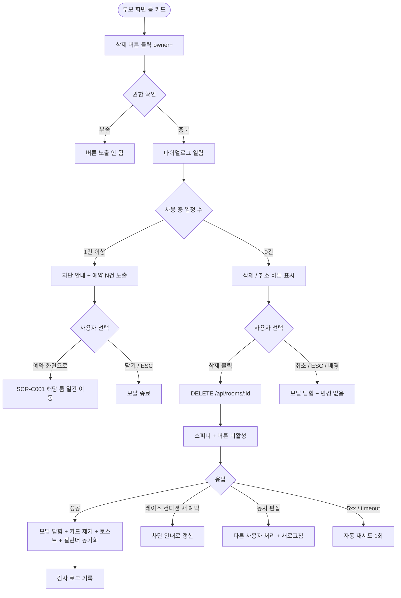

# DLG-053-002 룸 삭제 확인 다이얼로그

## 1. 다이얼로그 메타 정보

| 항목 | 값 |
|---|---|
| 작성일 | 2026-05-22 |
| 버전 | v1.0 |
| 상태 | 최신 통합본 반영 (정합화 완료) |
| 도메인 | D06 시설관리 |
| 다이얼로그 ID | DLG-053-002 |
| 다이얼로그명 | 룸 삭제 확인 |
| 다이얼로그 유형 | 확인 모달 (danger) |
| 부모 화면 | SCR-053 운동룸 관리 |
| 호출 트리거 | 룸 카드의 [삭제] 버튼 클릭 |
| 기능코드 | FAC-04 (운동룸 관리) |
| 계약코드 | FAC-04-08 (룸 삭제) |
| 관련 API | `DELETE /api/rooms/:id` |

이 문서는 DLG-053-002 룸 삭제 확인 다이얼로그에 대한 자기완결형 요구사항 정의서입니다.

## 2. 다이얼로그 개요와 목적

룸 삭제 확인 다이얼로그는 운동룸을 삭제하기 전 최종 의사를 확인하는 모달입니다. 삭제는 soft delete로 처리되어 과거 예약 이력은 보존되지만, 사용 중인 일정(오늘 + 미래)이 0건일 때만 삭제 가능합니다. 사용 중 일정이 있으면 모달 안에 차단 안내와 예약 화면 이동 옵션이 표시됩니다.

운영 흐름은 더 이상 사용하지 않는 룸 폐지, 시설 구조 변경으로 인한 룸 통폐합 등에 사용됩니다. owner 이상 권한자만 사용 가능합니다.

## 3. 호출 트리거와 부모 화면 연결

호출 트리거는 SCR-053 운동룸 관리 페이지의 룸 카드 [삭제] 버튼 클릭입니다. [삭제] 버튼은 owner 이상 권한자에게만 노출됩니다.

부모 화면에서 호출 시점에 룸 ID와 룸명, 사용 중 일정 수가 다이얼로그에 전달됩니다. 다이얼로그가 닫히면(삭제 성공 시) 부모 화면의 카드 목록에서 해당 카드가 즉시 제거됩니다.

## 4. 레이아웃과 UI 구성

다이얼로그는 화면 중앙에 떠 있는 컴팩트한 확인 모달이며 너비는 480px입니다.

모달 상단에는 "운동룸 삭제" 제목이 표시되고, 그 우측 상단에 닫기 X 버튼이 있습니다.

본문은 사용 중 일정 유무에 따라 다르게 표시됩니다.

사용 중 일정 0건인 경우: 안내 메시지 "[룸명]을 삭제하시겠습니까? 삭제 후에는 복구할 수 없습니다." 메시지 아래에 룸명이 강조 표시됩니다.

사용 중 일정 1건 이상인 경우: 차단 안내 "[룸명]을 삭제할 수 없습니다. 오늘/이후 예약 N건이 있습니다. 일정 정리 후 다시 시도하세요." 메시지와 함께 사용 중 일정 수와 가장 가까운 예약 정보가 표시되며, [예약 화면으로] 버튼이 함께 노출됩니다.

모달 하단에는 사용 중 일정 0건일 때 [삭제] · [취소] 버튼이, 사용 중 일정이 있을 때 [예약 화면으로] · [닫기] 버튼이 표시됩니다. [삭제] 버튼은 위험(danger) 스타일로 표시됩니다.

## 5. 입력 필드와 검증

본 다이얼로그는 입력 필드가 없으며 단순 확인 모달입니다.

권한 검증은 부모 화면에서 미리 처리되어 권한 부족 시 [삭제] 버튼이 노출되지 않습니다.

사용 중 일정 검증은 다이얼로그 진입 시점에 자동으로 수행되며, 있으면 차단 안내로 분기됩니다.

## 6. 버튼·아이콘·링크 액션 전체 정의

[삭제] 버튼은 위험(danger) 스타일로 표시되며 사용 중 일정 0건일 때만 노출됩니다. 클릭 시 `DELETE /api/rooms/:id`가 호출되어 soft delete로 처리됩니다. 처리 중에는 스피너가 표시되고 [삭제] 버튼이 비활성화됩니다.

[예약 화면으로] 버튼은 사용 중 일정이 있을 때 표시되며 클릭 시 SCR-C001 캘린더의 해당 룸 일간 보기로 이동합니다. 운영자는 거기서 예약을 정리한 후 다시 본 다이얼로그를 호출해 삭제할 수 있습니다.

[취소] · [닫기] 버튼과 우측 상단 X 버튼은 변경 없이 모달을 종료합니다.

ESC 키 또는 배경 클릭은 취소와 동일하게 동작합니다.

## 7. 토스트와 확인 팝업

성공 토스트는 "운동룸이 삭제되었습니다"가 5초간 표시됩니다.

실패 토스트는 "저장에 실패했습니다", "권한이 없어요", "다른 사용자가 이미 처리했어요" 같은 문구가 표시됩니다.

확인 팝업은 별도로 표시되지 않으며 다이얼로그 자체가 확인 역할을 합니다.

## 8. 데이터 흐름과 외부 연동

`DELETE /api/rooms/:id`는 룸 ID를 전송하며 백엔드에서 soft delete로 처리됩니다. 과거 예약 이력은 보존되며 통계 · 분석에 활용 가능합니다.

다이얼로그 진입 시점에 사용 중 일정 수가 부모 화면 데이터에 포함되어 전달되거나, 별도 API 호출(`GET /api/rooms/:id/active-schedules`)로 실시간 확인됩니다.

삭제 성공 시 SCR-C001 캘린더 + 예약 시스템에서 해당 룸이 제거됩니다. 과거 예약 이력은 캘린더에 그대로 표시되지만 신규 예약은 불가능합니다.

강사 근무(SCR-C006)에는 삭제된 룸이 강사 배정 가능 목록에서 제외됩니다.

소프트 삭제 후 같은 룸명 재등록은 허용됩니다(soft delete 상태이므로 활성 룸명과 충돌하지 않음).

모든 삭제 처리는 감사 로그(SCR-097)에 actor · room_id · before-after 형태로 기록됩니다.

## 9. 다이얼로그 상태와 예외 처리

기본 상태는 사용 중 일정 유무에 따라 다르게 표시됩니다.

사용 중 일정 0건 상태는 안내 메시지 + [삭제] · [취소] 버튼이 표시됩니다.

사용 중 일정 1건 이상 상태는 차단 안내 + [예약 화면으로] · [닫기] 버튼이 표시되며 [삭제] 버튼은 노출되지 않습니다.

처리 중 상태는 [삭제] 버튼이 비활성화되고 스피너가 표시됩니다.

삭제 성공 상태는 모달 자동 닫힘 + 카드 제거 + 토스트가 일어납니다.

삭제 실패 상태는 오류 토스트 + 모달 유지로 재시도가 가능합니다.

예외 케이스별 처리는 다음과 같습니다.

사용 중 일정 존재 시 [삭제] 차단 + [예약 화면으로] 옵션이 제공됩니다.

권한 부족 시 부모 화면에서 [삭제] 버튼이 노출되지 않습니다.

동시 편집 충돌 시 "다른 사용자가 이미 처리했어요" 안내 + 새로고침이 안내됩니다.

다이얼로그 진입과 [삭제] 클릭 사이에 새로운 예약이 추가된 경우(레이스 컨디션) 백엔드가 차단하고 다이얼로그가 갱신되어 사용 중 일정 차단 안내로 전환됩니다.

네트워크 오류 시 자동 재시도 1회 후 사용자 액션을 기다립니다.

## 10. 권한별 처리

owner만 삭제가 가능합니다. 부모 화면에서 [삭제] 버튼이 owner에게만 노출됩니다.

manager / staff / fc / front는 삭제 권한이 없으므로 [삭제] 버튼이 노출되지 않습니다.

trainer / readonly는 다이얼로그 진입 자체가 차단됩니다.

권한 없음은 다이얼로그 진입이 차단되고 부모 화면에서 권한 안내가 표시됩니다.

## 11. 화면 흐름

## 12. 운영 정책 (이 다이얼로그에 연결된 부분)

룸 삭제는 사용 중 일정(오늘 + 미래)이 0건일 때만 가능합니다. 사용 중 일정이 있으면 모달 안에 차단 안내 + [예약 화면으로] 옵션이 표시됩니다.

삭제는 soft delete로 처리되어 과거 예약 이력은 보존됩니다. 통계 · 분석에 과거 데이터가 활용 가능합니다.

소프트 삭제 후 같은 룸명 재등록은 허용됩니다(soft delete 상태이므로 활성 룸명과 충돌하지 않음).

삭제 성공 시 SCR-C001 캘린더 + 예약 시스템에서 해당 룸이 제거됩니다.

강사 근무(SCR-C006)에는 삭제된 룸이 강사 배정 가능 목록에서 제외됩니다.

[삭제] 버튼은 위험(danger) 스타일로 표시되어 운영자가 신중하게 결정하도록 시각적으로 유도합니다.

다이얼로그 진입과 [삭제] 클릭 사이에 새로운 예약이 추가된 경우(레이스 컨디션) 백엔드가 차단하고 다이얼로그가 차단 안내로 갱신됩니다.

모든 삭제 처리는 감사 로그(SCR-097)에 actor · room_id · before-after 형태로 기록되며 soft delete 이력은 영구 보존됩니다.

권한별 가시성: 슈퍼관리자 · 센터장(owner)만 삭제 가능합니다. 매니저 이하는 삭제 불가입니다.

본사 통합 모드에서 다른 지점 룸 삭제 시도 시 권한자 외 차단됩니다.

이상의 모든 정책은 이 다이얼로그를 구현하고 운영하는 사람이 별도 문서 없이 이 한 장만 보면 이해할 수 있도록 풀어 적었습니다.
