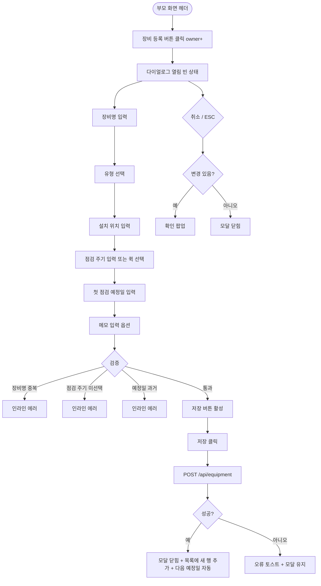

# DLG-056-001 장비 등록 다이얼로그

## 1. 다이얼로그 메타 정보

| 항목 | 값 |
|---|---|
| 작성일 | 2026-05-22 |
| 버전 | v1.0 |
| 상태 | 최신 통합본 반영 (정합화 완료) |
| 도메인 | D06 시설관리 |
| 다이얼로그 ID | DLG-056-001 |
| 다이얼로그명 | 장비 등록 |
| 다이얼로그 유형 | 입력 + 처리 모달 |
| 부모 화면 | SCR-056 장비 점검 일정 |
| 호출 트리거 | 헤더 [장비 등록] 버튼 클릭 |
| 기능코드 | FAC-EXT-02 (장비 점검 일정) |
| 계약코드 | FAC-EXT-02-03 (장비 등록) |
| 관련 API | `POST /api/equipment` |

이 문서는 DLG-056-001 장비 등록 다이얼로그에 대한 자기완결형 요구사항 정의서입니다.

## 2. 다이얼로그 개요와 목적

장비 등록 다이얼로그는 새로운 운동 장비를 시스템에 등록하는 모달입니다. 장비명 · 장비 유형 · 설치 위치 · 점검 주기를 입력해 이후 정기 점검 일정이 자동으로 생성됩니다. 신규 트레드밀 도입, 레그프레스 추가 설치 등 시설 확장 시 사용됩니다.

장비 등록 시 첫 점검 예정일을 운영자가 직접 설정하며, 이후 점검 등록(DLG-056-002) 시 다음 점검 예정일이 점검 주기에 따라 자동 갱신됩니다.

## 3. 호출 트리거와 부모 화면 연결

호출 트리거는 SCR-056 장비 점검 일정 페이지의 헤더 [장비 등록] 버튼 클릭입니다. owner 이상 권한자에게만 노출됩니다.

부모 화면에서 호출 시점에 빈 상태로 다이얼로그가 열립니다. 다이얼로그가 닫히면(저장 성공 시) 부모 화면의 장비 목록에 새 행이 추가됩니다.

## 4. 레이아웃과 UI 구성

다이얼로그는 화면 중앙에 떠 있는 모달 형태이며 너비는 데스크톱 기준 600px입니다.

모달 상단에는 "장비 등록" 제목이 표시되고, 그 우측 상단에 닫기 X 버튼이 있습니다.

본문은 위에서 아래로 다음과 같이 구성됩니다.

첫 번째 영역은 장비명 입력입니다. 필수 항목이며 동일 지점 + 동일 위치 내 고유여야 합니다. 예: "트레드밀 1번", "레그프레스 A". 중복 시 인라인 에러 "동일 장비명 + 위치가 존재합니다"가 표시됩니다.

두 번째 영역은 장비 유형 선택입니다. 유산소기구 / 웨이트기구 / GX장비 / 기타 중 단일 선택이며 드롭다운 또는 버튼 그룹으로 표시됩니다.

세 번째 영역은 설치 위치 입력입니다. 텍스트 입력란이며 해당 장비가 위치한 구역 · 룸 · 층을 자유 입력합니다.

네 번째 영역은 점검 주기 설정입니다. 일 단위 직접 입력 또는 퀵 선택 버튼(30일 / 90일 / 180일 / 365일)으로 빠르게 설정 가능합니다. 점검 주기 미선택 시 인라인 에러 "점검 주기를 선택해주세요"가 표시됩니다.

다섯 번째 영역은 첫 점검 예정일 입력입니다. 날짜 선택기로 최초 점검 예정일을 설정합니다. 과거 일자 입력 시 인라인 에러 "과거 일자 불가"가 표시됩니다.

여섯 번째 영역은 메모 입력입니다. textarea로 운영자 메모(장비 시리얼 번호, 구매일, 보증 기간 등)를 자유 입력합니다. 선택 사항입니다.

모달 하단에는 [저장] · [취소] 버튼이 좌우로 배치됩니다.

## 5. 입력 필드와 검증

장비명은 필수 입력이며 동일 지점 + 동일 위치 내 고유여야 합니다. 중복 시 인라인 에러로 차단됩니다.

장비 유형은 4종 중 단일 선택 필수입니다.

설치 위치는 필수 입력입니다.

점검 주기는 일 단위 자연수 필수입니다. 0 또는 음수 입력 시 인라인 에러가 표시됩니다.

첫 점검 예정일은 날짜 선택 필수이며 과거 일자는 차단됩니다.

메모는 선택 사항입니다.

[저장] 버튼은 모든 필수 항목이 유효하게 입력된 경우에만 활성화됩니다.

## 6. 버튼·아이콘·링크 액션 전체 정의

[저장] 버튼은 입력된 정보로 장비를 등록합니다. `POST /api/equipment`가 호출되며 처리 중에는 스피너가 표시되고 버튼이 비활성화됩니다.

저장 성공 시 "장비가 등록되었어요" 토스트가 표시되고 모달이 자동으로 닫히며 부모 화면 목록에 새 장비가 추가됩니다. 다음 점검 예정일이 자동 생성되어 목록에 즉시 반영됩니다.

[취소] 버튼과 우측 상단 X 버튼은 변경 없이 모달을 종료합니다. 입력 변경이 있는 경우 확인 팝업이 표시됩니다.

ESC 키 또는 배경 클릭은 취소와 동일하게 동작합니다.

점검 주기 퀵 선택 버튼 클릭은 점검 주기 입력 필드에 해당 값이 즉시 채워집니다.

## 7. 토스트와 확인 팝업

성공 토스트는 "장비가 등록되었어요"가 5초간 표시됩니다.

실패 토스트는 "동일 장비명 + 위치가 존재합니다", "점검 주기 선택", "과거 일자 불가", "권한이 없어요" 같은 문구가 표시됩니다.

확인 팝업은 변경 사항이 있는 상태에서 모달을 닫으려고 할 때 표시됩니다.

## 8. 데이터 흐름과 외부 연동

`POST /api/equipment`는 장비명 · 유형 · 위치 · 점검 주기 · 첫 점검 예정일 · 메모를 전송하며 응답으로 생성된 장비 정보가 반환됩니다.

장비명 + 위치 중복 검증은 백엔드에서 동일 지점 내에서 수행됩니다.

저장 성공 시 다음 점검 예정일이 첫 점검 예정일로 설정되며, 이후 점검 등록 시 점검 주기에 따라 자동 갱신됩니다.

모든 등록 처리는 감사 로그(SCR-097)에 actor · equipment_id · before-after 형태로 기록됩니다.

## 9. 다이얼로그 상태와 예외 처리

기본 상태는 모든 필드 빈 상태이며 [저장] 버튼이 비활성 상태입니다.

저장 중 상태는 [저장] 버튼이 비활성화되고 스피너가 표시됩니다.

저장 성공 상태는 토스트 + 모달 자동 닫힘 + 목록에 새 장비 추가가 일어납니다.

저장 실패 상태는 오류 토스트 + 모달 유지로 재시도가 가능합니다.

예외 케이스별 처리는 다음과 같습니다.

장비명 중복(같은 지점 + 같은 위치) 시 인라인 에러로 차단됩니다.

점검 주기 미선택 시 인라인 에러로 차단됩니다.

점검 예정일 과거 입력 시 인라인 에러로 차단됩니다.

권한 부족 시 다이얼로그 진입이 차단됩니다.

본사 통합 모드 다른 지점 등록 시도 시 권한 안내가 표시됩니다.

ESC/배경 클릭 시 입력 변경이 있으면 확인 팝업이 표시됩니다.

## 10. 권한별 처리

Owner(지점장)만 등록 가능합니다.

manager는 등록 권한이 없으므로 부모 화면에서 [장비 등록] 버튼이 노출되지 않습니다(테넌트 정책에 따라 일부 매니저에게 권한 부여 가능).

staff / fc / front는 등록 권한이 없습니다.

trainer / readonly는 다이얼로그 진입 자체가 차단됩니다.

권한 없음은 다이얼로그 진입이 차단되고 부모 화면에서 권한 안내가 표시됩니다.

## 11. 화면 흐름

## 12. 운영 정책 (이 다이얼로그에 연결된 부분)

장비명 + 위치(룸 · 층) 조합은 동일 지점 내 고유이며 중복 등록이 차단됩니다.

장비 유형은 유산소기구 / 웨이트기구 / GX장비 / 기타 4종 + 테넌트 정의 가능입니다.

점검 주기는 일 단위 자연수이며 퀵 선택(30/90/180/365일) 또는 직접 입력으로 설정합니다.

첫 점검 예정일은 등록 시 운영자가 직접 설정하며, 이후 점검 등록 시 점검 주기에 따라 자동 갱신됩니다.

장비 등록 직후 다음 점검 예정일은 첫 점검 예정일로 설정됩니다.

장비 등록 시 status는 기본 정상(normal)으로 설정됩니다.

모든 등록 처리는 감사 로그(SCR-097)에 actor · equipment_id · before-after 형태로 기록됩니다.

권한별 가시성: 슈퍼관리자 · Owner(지점장)만 등록 가능. 매니저는 테넌트 정책에 따라 가능 여부 결정. FC · 스태프는 등록 불가. 트레이너 · 읽기 전용은 진입 불가.

본사 통합 모드에서 다른 지점 장비 등록 시도 시 권한자 외 차단됩니다.

이상의 모든 정책은 이 다이얼로그를 구현하고 운영하는 사람이 별도 문서 없이 이 한 장만 보면 이해할 수 있도록 풀어 적었습니다.
