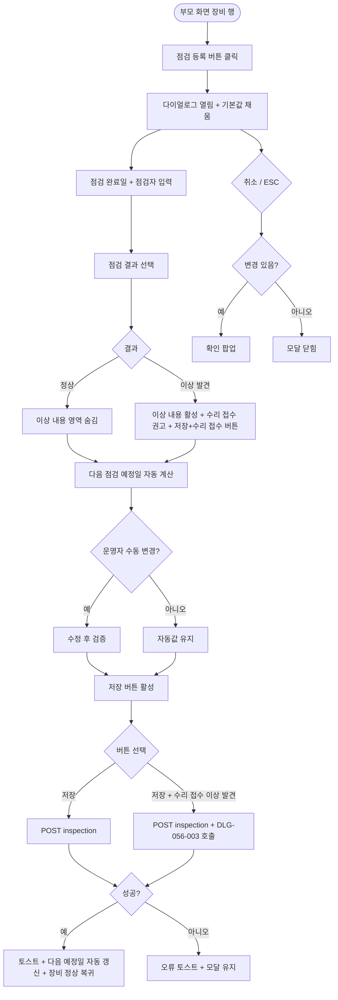

# DLG-056-002 점검 등록 다이얼로그

## 1. 다이얼로그 메타 정보

| 항목 | 값 |
|---|---|
| 작성일 | 2026-05-22 |
| 버전 | v1.0 |
| 상태 | 최신 통합본 반영 (정합화 완료) |
| 도메인 | D06 시설관리 |
| 다이얼로그 ID | DLG-056-002 |
| 다이얼로그명 | 점검 등록 |
| 다이얼로그 유형 | 입력 + 처리 모달 |
| 부모 화면 | SCR-056 장비 점검 일정 |
| 호출 트리거 | 장비 행의 [점검 등록] 버튼 클릭 |
| 기능코드 | FAC-EXT-02 (장비 점검 일정) |
| 계약코드 | FAC-EXT-02-04 (점검 등록) |
| 관련 API | `POST /api/equipment/:id/inspection` |

이 문서는 DLG-056-002 점검 등록 다이얼로그에 대한 자기완결형 요구사항 정의서입니다.

## 2. 다이얼로그 개요와 목적

점검 등록 다이얼로그는 운동 장비의 점검을 완료한 후 점검 결과를 기록하는 모달입니다. 점검 완료일 · 점검자 · 점검 결과(정상 / 이상 발견)를 입력하면 다음 점검 예정일이 점검 주기에 따라 자동으로 갱신됩니다.

점검 결과가 "이상 발견"인 경우 이상 내용 입력 + 수리 접수 권고 안내가 함께 표시되어 운영자가 DLG-056-003 수리 등록으로 이어 처리할 수 있습니다.

## 3. 호출 트리거와 부모 화면 연결

호출 트리거는 SCR-056 장비 점검 일정 페이지의 장비 목록 테이블 행 [점검 등록] 버튼 클릭입니다. 매니저 이상 권한자에게 노출됩니다(스태프는 점검 완료 기록만 가능한 제한 모드일 수 있음).

부모 화면에서 호출 시점에 장비 ID와 장비명, 현재 점검 주기, 다음 점검 예정일 정보가 다이얼로그에 전달됩니다. 다이얼로그가 닫히면(저장 성공 시) 부모 화면의 장비 목록이 자동 갱신되어 마지막 점검일과 다음 점검 예정일이 새 값으로 업데이트됩니다.

## 4. 레이아웃과 UI 구성

다이얼로그는 화면 중앙에 떠 있는 모달 형태이며 너비는 데스크톱 기준 600px입니다.

모달 상단에는 "점검 등록 — [장비명]" 제목이 표시되고, 그 우측 상단에 닫기 X 버튼이 있습니다.

본문은 위에서 아래로 다음과 같이 구성됩니다.

첫 번째 영역은 점검 완료일 입력입니다. 날짜 선택기로 실제 점검이 완료된 날짜를 설정하며 기본값은 오늘입니다. 미래 일자는 입력할 수 없으며 시도 시 인라인 에러가 표시됩니다.

두 번째 영역은 점검자 입력입니다. 텍스트 입력란 또는 직원 검색 자동완성으로 점검을 수행한 담당자 이름을 입력합니다. 디바운스 300ms가 적용됩니다.

세 번째 영역은 점검 결과 선택입니다. 정상 / 이상 발견 라디오 또는 토글로 단일 선택합니다.

네 번째 영역은 이상 내용 입력입니다. 점검 결과가 "이상 발견"인 경우에만 활성화되며 textarea로 이상 내용을 자세히 입력합니다. 수리 접수 권고 안내가 함께 표시됩니다.

다섯 번째 영역은 다음 점검 예정일 입력입니다. 점검 주기에 따라 자동 계산되어 표시되지만 운영자가 수동 변경 가능합니다. 기본 계산은 점검 완료일 + 점검 주기로 설정됩니다.

모달 하단에는 [저장] · [취소] 버튼이 좌우로 배치됩니다. 점검 결과가 "이상 발견"인 경우 [저장 + 수리 접수] 추가 버튼이 함께 표시되어 점검 등록과 수리 접수를 연속 처리할 수 있습니다.

## 5. 입력 필드와 검증

점검 완료일은 필수 입력이며 미래 일자는 차단됩니다.

점검자는 필수 입력입니다.

점검 결과는 정상 / 이상 발견 단일 선택 필수입니다.

이상 내용은 점검 결과가 "이상 발견"인 경우에만 필수이며 미입력 시 인라인 에러 "이상 내용을 입력해주세요"가 표시됩니다.

다음 점검 예정일은 점검 주기에 따라 자동 계산되며 수동 변경 가능합니다. 과거 일자 또는 점검 완료일 이전 일자 입력 시 인라인 에러가 표시됩니다.

[저장] 버튼은 모든 필수 항목이 유효하게 입력된 경우에만 활성화됩니다.

## 6. 버튼·아이콘·링크 액션 전체 정의

[저장] 버튼은 입력된 점검 정보를 저장합니다. `POST /api/equipment/:id/inspection`이 호출되며 처리 중에는 스피너가 표시되고 버튼이 비활성화됩니다.

저장 성공 시 "점검이 등록되었어요" 토스트가 표시되고 모달이 자동으로 닫히며 부모 화면 장비 목록이 갱신됩니다. 다음 점검 예정일이 새 값으로 표시되고 장비 상태가 정상(normal)으로 복귀됩니다(이전에 점검 예정 상태였던 경우).

[저장 + 수리 접수] 버튼은 점검 결과가 "이상 발견"인 경우에만 표시됩니다. 클릭 시 점검 등록을 먼저 저장하고 모달을 닫지 않은 채 DLG-056-003 수리 등록 다이얼로그를 신규 모드로 이어서 호출합니다. 운영자는 수리 접수까지 연속으로 처리할 수 있습니다.

점검자 검색 자동완성은 디바운스 300ms 후 직원 검색 결과를 표시합니다. 직원 검색 0건 시 "직원을 등록 후 다시 시도" 안내가 표시됩니다.

[취소] 버튼과 우측 상단 X 버튼은 변경 없이 모달을 종료합니다. 입력 변경이 있는 경우 확인 팝업이 표시됩니다.

ESC 키 또는 배경 클릭은 취소와 동일하게 동작합니다.

## 7. 토스트와 확인 팝업

성공 토스트는 "점검이 등록되었어요"가 5초간 표시됩니다. [저장 + 수리 접수] 사용 시 추가로 "수리 접수가 등록되었어요" 토스트가 함께 표시됩니다.

실패 토스트는 "점검 등록에 실패했습니다", "이상 내용 입력 필요", "점검 주기 위반", "권한이 없어요" 같은 문구가 표시됩니다.

확인 팝업은 변경 사항이 있는 상태에서 모달을 닫으려고 할 때 표시됩니다.

이상 발견 시 수리 접수 권고 안내가 화면 내 인라인 메시지로 표시됩니다.

## 8. 데이터 흐름과 외부 연동

`POST /api/equipment/:id/inspection`은 점검 완료일 · 점검자 · 점검 결과 · 이상 내용 · 다음 점검 예정일을 전송하며 응답으로 갱신된 장비 정보가 반환됩니다.

다음 점검 예정일은 백엔드에서 점검 주기에 따라 자동 계산되며 운영자가 수동 변경한 경우 변경값이 우선됩니다.

점검 등록 시 장비 상태가 점검 예정(due)이었다면 정상(normal)으로 복귀됩니다.

점검 결과가 "이상 발견"인 경우 운영자에게 수리 접수 권고가 인라인 표시되며, [저장 + 수리 접수] 버튼으로 DLG-056-003 수리 등록을 연속 호출할 수 있습니다.

점검 이력은 영구 보관되며 매일 03:00 보관 배치로 90일 초과 데이터가 데이터 웨어하우스로 이관됩니다.

NFR-19 운영자 알림은 점검 등록 시 별도로 발송되지 않지만, 수리 접수가 함께 등록되면 수리 접수 알림이 발송됩니다.

모든 점검 등록 처리는 감사 로그(SCR-097)에 actor · equipment_id · inspection_result · before-after 형태로 기록됩니다.

## 9. 다이얼로그 상태와 예외 처리

기본 상태는 점검 완료일 = 오늘 기본값, 점검 결과 = 정상 기본값, 다음 점검 예정일 = 자동 계산값으로 표시됩니다.

이상 발견 선택 상태는 이상 내용 입력 필드가 활성화되고 수리 접수 권고 안내 + [저장 + 수리 접수] 버튼이 표시됩니다.

저장 중 상태는 [저장] 버튼이 비활성화되고 스피너가 표시됩니다.

저장 성공 상태는 토스트 + 모달 자동 닫힘 + 장비 목록 갱신이 일어납니다.

저장 실패 상태는 오류 토스트 + 모달 유지로 재시도가 가능합니다.

예외 케이스별 처리는 다음과 같습니다.

점검 완료일 미래 입력 시 인라인 에러로 차단됩니다.

이상 발견 선택 + 이상 내용 미입력 시 인라인 에러로 차단됩니다.

다음 점검 예정일 과거 또는 점검 완료일 이전 입력 시 인라인 에러로 차단됩니다.

점검자 검색 0건 시 직원 등록 안내가 표시됩니다.

권한 부족 시 다이얼로그 진입이 차단됩니다.

본사 통합 모드 다른 지점 점검 등록 시 권한 안내가 표시됩니다.

동시 편집 충돌 시 "다른 사용자가 변경" 안내 + 새로고침이 안내됩니다.

ESC/배경 클릭 시 입력 변경이 있으면 확인 팝업이 표시됩니다.

## 10. 권한별 처리

owner / manager는 점검 등록과 [저장 + 수리 접수] 연속 처리가 모두 가능합니다.

staff는 점검 완료 기록만 가능합니다. 이상 발견 선택은 가능하지만 [저장 + 수리 접수]는 비활성화되며 매니저 이상 권한자에게 수리 접수 요청을 별도로 해야 합니다.

fc는 부모 화면 정책에 따라 점검 등록 가능 여부가 달라집니다.

trainer / readonly는 다이얼로그 진입 자체가 차단됩니다.

권한 없음은 다이얼로그 진입이 차단됩니다.

## 11. 화면 흐름

## 12. 운영 정책 (이 다이얼로그에 연결된 부분)

점검 결과는 정상 / 이상 발견 2종이며 점검 결과에 따라 후속 처리가 분기됩니다.

다음 점검 예정일은 점검 주기에 따라 자동 계산됩니다(예: 월간 → +30일, 분기 → +90일).

운영자가 다음 점검 예정일을 수동 변경한 경우 변경값이 우선되며 점검 주기 자동 계산은 무시됩니다.

점검 등록 시 장비 상태가 점검 예정(due)이었다면 정상(normal)으로 복귀됩니다.

이상 발견 시 [저장 + 수리 접수] 옵션으로 DLG-056-003 수리 등록을 연속 호출할 수 있어 운영자가 한 번에 점검과 수리 접수를 처리할 수 있습니다.

점검자는 텍스트 입력 또는 직원 검색 자동완성이며 디바운스 300ms가 적용됩니다.

점검 이력은 영구 보관되며 매일 03:00 보관 배치로 90일 초과 데이터가 데이터 웨어하우스로 이관됩니다.

모든 점검 등록 처리는 감사 로그(SCR-097)에 actor · equipment_id · inspection_result · before-after 형태로 기록됩니다.

권한별 가시성: 슈퍼관리자 · Owner(지점장) · 매니저는 점검 등록과 수리 접수 모두 가능. 스태프는 점검 완료 기록만 가능. FC는 테넌트 정책에 따라. 트레이너 · 읽기 전용은 진입 불가.

본사 통합 모드에서 다른 지점 장비 점검 등록 시도 시 권한자 외 차단됩니다.

이상의 모든 정책은 이 다이얼로그를 구현하고 운영하는 사람이 별도 문서 없이 이 한 장만 보면 이해할 수 있도록 풀어 적었습니다.
