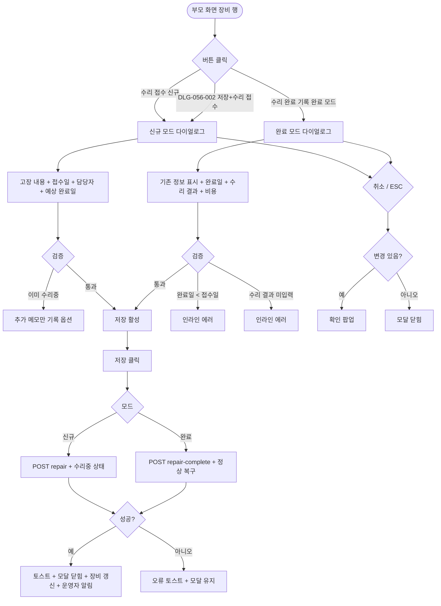

# DLG-056-003 수리 등록 다이얼로그

## 1. 다이얼로그 메타 정보

| 항목 | 값 |
|---|---|
| 작성일 | 2026-05-22 |
| 버전 | v1.0 |
| 상태 | 최신 통합본 반영 (정합화 완료) |
| 도메인 | D06 시설관리 |
| 다이얼로그 ID | DLG-056-003 |
| 다이얼로그명 | 수리 등록 |
| 다이얼로그 유형 | 입력 + 처리 모달 (양방향: 수리 접수 / 수리 완료 기록) |
| 부모 화면 | SCR-056 장비 점검 일정 |
| 호출 트리거 | 장비 행의 [수리 접수] 또는 [수리 완료 기록] 버튼 클릭 |
| 기능코드 | FAC-EXT-02 (장비 점검 일정) |
| 계약코드 | FAC-EXT-02-05 (수리 접수) |
| 관련 API | `POST /api/equipment/:id/repair` (신규) · `POST /api/equipment/:id/repair-complete` (완료) |

이 문서는 DLG-056-003 수리 등록 다이얼로그에 대한 자기완결형 요구사항 정의서입니다.

## 2. 다이얼로그 개요와 목적

수리 등록 다이얼로그는 고장 · 이상이 발견된 운동 장비의 수리를 접수하고 수리 완료 후 결과를 기록하는 모달입니다. 두 가지 모드로 동작합니다.

수리 접수 모드(신규): 회원 신고 또는 점검 시 이상 발견 후 고장 내용 · 담당자 · 예상 완료일을 입력해 수리를 접수합니다. 장비 상태가 "수리중"으로 전환되며 회원 사용 차단 안내가 표시됩니다.

수리 완료 기록 모드(완료): 수리 완료 후 실제 완료일 · 수리 결과 · 비용을 기록합니다. 장비 상태가 "정상"으로 복구되며 다음 점검 예정일은 기존 주기를 유지합니다(수리는 점검과 별개).

운영 흐름은 회원이 트레드밀 고장을 신고하면 프런트가 [수리 접수]로 증상·담당자 입력 → 수리중 상태로 전환 → 수리업체가 처리 → 완료 후 [수리 완료 기록] → 정상 운영 복구로 이어집니다.

## 3. 호출 트리거와 부모 화면 연결

호출 트리거는 SCR-056 장비 점검 일정 페이지의 장비 목록 테이블 행 [수리 접수] 버튼(신규 모드) 또는 수리중 장비 행의 [수리 완료 기록] 버튼(완료 모드) 클릭입니다.

DLG-056-002 점검 등록의 [저장 + 수리 접수] 버튼으로도 본 다이얼로그가 신규 모드로 호출될 수 있습니다.

부모 화면에서 호출 시점에 장비 ID와 장비명이 다이얼로그에 전달됩니다. 완료 모드에서는 기존 수리 접수 정보(고장 내용 · 담당자 · 예상 완료일)가 미리 채워진 상태로 표시됩니다.

다이얼로그가 닫히면(저장 성공 시) 부모 화면의 장비 목록이 자동 갱신되어 상태가 변경됩니다. 신규 모드 저장 시 "수리중"으로, 완료 모드 저장 시 "정상"으로 갱신됩니다.

## 4. 레이아웃과 UI 구성

다이얼로그는 화면 중앙에 떠 있는 모달 형태이며 너비는 데스크톱 기준 600px입니다.

모달 상단의 제목은 모드에 따라 동적으로 표시됩니다. 신규 모드에서는 "수리 접수 — [장비명]", 완료 모드에서는 "수리 완료 기록 — [장비명]"이 표시됩니다.

본문은 모드에 따라 다른 입력 필드를 표시합니다.

신규 모드(수리 접수)의 입력 필드는 다음과 같습니다.

첫 번째 영역은 고장 내용 입력입니다. textarea로 발견된 고장 또는 이상 내용을 자세히 입력합니다. 필수 입력입니다.

두 번째 영역은 수리 접수일 입력입니다. 날짜 선택기로 수리 접수 날짜를 설정하며 기본값은 오늘입니다.

세 번째 영역은 담당 수리업체 또는 담당자 입력입니다. 텍스트 입력란 또는 직원 검색 자동완성으로 수리를 맡길 업체 또는 담당자를 입력합니다. 필수 입력입니다.

네 번째 영역은 예상 완료일 입력입니다. 날짜 선택기로 수리 완료 예정일을 설정합니다. 선택 사항이지만 입력 권장입니다.

완료 모드(수리 완료 기록)의 입력 필드는 다음과 같습니다.

첫 번째 영역은 기존 수리 접수 정보 표시입니다. 신규 접수 시 입력한 고장 내용 · 담당자 · 예상 완료일이 읽기 전용으로 표시됩니다.

두 번째 영역은 수리 완료일 입력입니다. 날짜 선택기로 실제 수리가 완료된 날짜를 설정하며 기본값은 오늘입니다.

세 번째 영역은 수리 결과 입력입니다. textarea로 수리 완료 내용 · 교체 부품 · 작업 내역을 자유 입력합니다. 필수 입력입니다.

네 번째 영역은 비용 입력입니다. 숫자 입력으로 수리 비용을 입력합니다. 선택 사항이며 비용 관리에 활용됩니다.

모달 하단에는 [저장] · [취소] 버튼이 좌우로 배치됩니다.

## 5. 입력 필드와 검증

신규 모드에서 고장 내용 · 수리 접수일 · 담당자는 필수 입력이며 예상 완료일은 선택입니다.

완료 모드에서 수리 완료일 · 수리 결과는 필수 입력이며 비용은 선택입니다.

수리중 장비 재수리 시도 시 인라인 안내 "이미 수리중 상태입니다" + 추가 메모 옵션이 제공됩니다.

수리 완료일이 수리 접수일보다 빠른 경우 인라인 에러 "완료일은 접수일 이후여야 합니다"가 표시됩니다.

[저장] 버튼은 모든 필수 항목이 유효하게 입력된 경우에만 활성화됩니다.

## 6. 버튼·아이콘·링크 액션 전체 정의

[저장] 버튼은 모드에 따라 다른 API를 호출합니다. 신규 모드에서는 `POST /api/equipment/:id/repair`, 완료 모드에서는 `POST /api/equipment/:id/repair-complete`가 호출됩니다.

저장 성공 시 모드에 따라 다른 토스트가 표시됩니다. 신규 모드는 "수리가 접수되었어요" + 장비 상태 "수리중"으로 전환, 완료 모드는 "수리 완료 기록되었어요" + 장비 상태 "정상" 복구가 일어납니다.

[취소] 버튼과 우측 상단 X 버튼은 변경 없이 모달을 종료합니다. 입력 변경이 있는 경우 확인 팝업이 표시됩니다.

담당자 검색 자동완성은 직원 검색이 활성화된 경우 디바운스 300ms 후 결과를 표시합니다.

ESC 키 또는 배경 클릭은 취소와 동일하게 동작합니다.

수리중 장비 재수리 시 [추가 메모만 기록] 옵션이 제공되어 새 수리 접수 대신 기존 수리에 메모를 추가할 수 있습니다.

## 7. 토스트와 확인 팝업

성공 토스트는 모드에 따라 "수리가 접수되었어요" 또는 "수리 완료 기록되었어요"가 5초간 표시됩니다.

실패 토스트는 "수리 등록에 실패했습니다", "이미 수리중 상태입니다", "완료일은 접수일 이후여야 합니다", "권한이 없어요" 같은 문구가 표시됩니다.

확인 팝업은 변경 사항이 있는 상태에서 모달을 닫으려고 할 때 표시됩니다.

수리중 → 회원 사용 차단 안내가 신규 모드 저장 성공 시 함께 표시됩니다.

## 8. 데이터 흐름과 외부 연동

신규 모드는 `POST /api/equipment/:id/repair`로 처리되며 고장 내용 · 접수일 · 담당자 · 예상 완료일이 전송됩니다. 응답으로 갱신된 장비 정보(상태 = 수리중)가 반환됩니다.

완료 모드는 `POST /api/equipment/:id/repair-complete`로 처리되며 완료일 · 수리 결과 · 비용이 전송됩니다. 응답으로 갱신된 장비 정보(상태 = 정상)가 반환됩니다.

수리중 상태 장비는 회원 사용 차단 안내(시설 입구)가 표시됩니다.

수리 완료 후 정상 복구 시 다음 점검 예정일은 기존 주기를 유지합니다(수리는 점검과 별개 처리).

FAC-04 운동룸 · FAC-05 골프 타석 고장 토글 시 본 다이얼로그가 자동 호출되어 수리 접수가 자동 등록되는 옵션이 있습니다(테넌트 정책).

NFR-19 운영자 알림은 수리 완료 시 운영자에게 발송되어 정상 운영 복구를 인지하게 합니다.

모든 수리 등록 · 완료 처리는 감사 로그(SCR-097)에 actor · equipment_id · repair_status · before-after 형태로 기록됩니다.

## 9. 다이얼로그 상태와 예외 처리

기본 상태는 모드에 따라 다르게 표시됩니다. 신규 모드는 빈 상태, 완료 모드는 기존 수리 접수 정보가 미리 표시됩니다.

저장 중 상태는 [저장] 버튼이 비활성화되고 스피너가 표시됩니다.

저장 성공 상태는 토스트 + 모달 자동 닫힘 + 장비 목록 갱신이 일어납니다.

저장 실패 상태는 오류 토스트 + 모달 유지로 재시도가 가능합니다.

예외 케이스별 처리는 다음과 같습니다.

수리중 장비 재수리 시도 시 인라인 안내 + [추가 메모만 기록] 옵션이 제공됩니다.

수리 완료 미입력 필드 시 인라인 에러 "수리 결과를 입력해주세요"가 표시됩니다.

완료일이 접수일보다 빠른 경우 인라인 에러로 차단됩니다.

담당자 검색 0건 시 "직원을 등록 후 다시 시도" 안내가 표시됩니다.

권한 부족 시 다이얼로그 진입이 차단됩니다.

본사 통합 모드 다른 지점 수리 등록 시도 시 권한 안내가 표시됩니다.

동시 편집 충돌 시 "다른 사용자가 이미 처리했어요" 안내 + 새로고침이 안내됩니다.

ESC/배경 클릭 시 입력 변경이 있으면 확인 팝업이 표시됩니다.

## 10. 권한별 처리

owner / manager는 수리 접수와 수리 완료 기록 모두 가능합니다.

staff / fc / front는 부모 화면 정책에 따라 수리 접수 가능 여부가 달라집니다. 일반적으로 매니저 이상이 가능합니다.

trainer / readonly는 다이얼로그 진입 자체가 차단됩니다.

권한 없음은 다이얼로그 진입이 차단됩니다.

## 11. 화면 흐름

## 12. 운영 정책 (이 다이얼로그에 연결된 부분)

수리 접수 시 고장 내용 · 담당자 · 예상 완료일 필수 입력이며 담당자는 직원 검색입니다.

수리 완료 처리 시 수리 결과 · 소요 시간 · 비용 입력이 가능합니다. 비용은 비용 관리에 활용됩니다.

수리중 장비 재수리 시도 시 "이미 수리중 상태입니다" 안내가 표시되며 [추가 메모만 기록] 옵션이 제공됩니다.

수리 완료 후 정상 복구 시 다음 점검 예정일은 기존 주기를 유지합니다(수리는 점검과 별개 처리).

수리중 상태 장비는 회원 사용 차단 안내가 시설 입구에 표시됩니다.

FAC-04 운동룸 · FAC-05 골프 타석 고장 토글 시 본 다이얼로그가 자동 호출되어 수리 접수가 자동 등록되는 옵션이 있습니다(테넌트 정책).

DLG-056-002 점검 등록의 [저장 + 수리 접수] 옵션으로 본 다이얼로그가 신규 모드로 연속 호출될 수 있습니다.

수리 완료 시 운영자에게 NFR-19 알림이 발송되어 정상 운영 복구를 인지하게 합니다.

모든 수리 등록 · 완료 처리는 감사 로그(SCR-097)에 actor · equipment_id · repair_status · before-after 형태로 기록됩니다.

수리 이력은 영구 보관되며 매일 03:00 보관 배치로 90일 초과 데이터가 데이터 웨어하우스로 이관됩니다.

권한별 가시성: 슈퍼관리자 · 센터장 · 매니저는 수리 접수와 수리 완료 모두 가능. FC · 스태프는 테넌트 정책에 따라. 트레이너 · 읽기 전용은 진입 불가.

본사 통합 모드에서 다른 지점 장비 수리 등록 시도 시 권한자 외 차단됩니다.

이상의 모든 정책은 이 다이얼로그를 구현하고 운영하는 사람이 별도 문서 없이 이 한 장만 보면 이해할 수 있도록 풀어 적었습니다.
