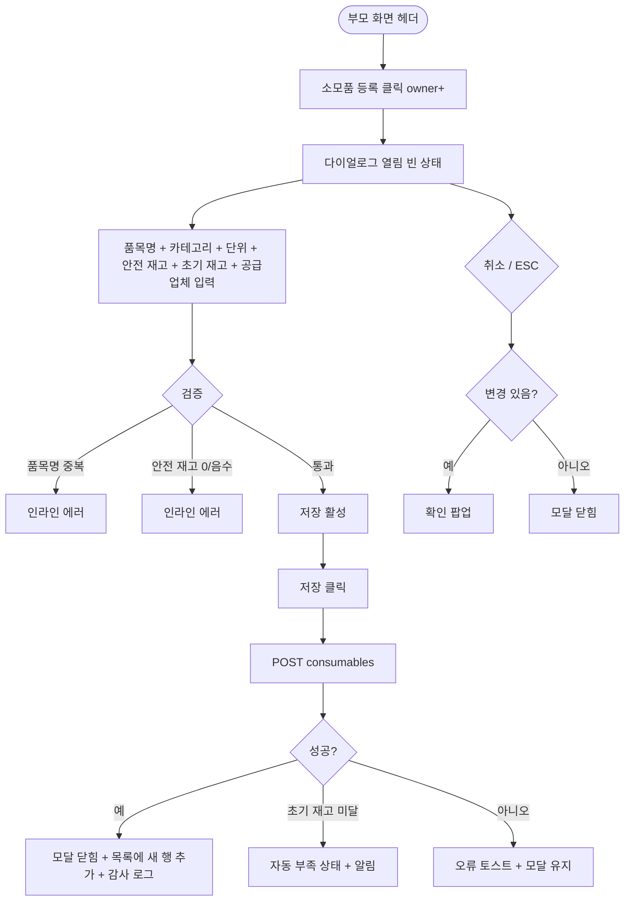

# DLG-057-001 소모품 등록 다이얼로그

## 1. 다이얼로그 메타 정보

| 항목 | 값 |
|---|---|
| 작성일 | 2026-05-22 |
| 버전 | v1.0 |
| 상태 | 최신 통합본 반영 (정합화 완료) |
| 도메인 | D06 시설관리 |
| 다이얼로그 ID | DLG-057-001 |
| 다이얼로그명 | 소모품 등록 |
| 다이얼로그 유형 | 입력 + 처리 모달 |
| 부모 화면 | SCR-057 소모품 재고 관리 |
| 호출 트리거 | 헤더 [소모품 등록] 버튼 클릭 |
| 기능코드 | FAC-EXT-03 (소모품 재고 관리) |
| 계약코드 | FAC-EXT-03-04 (소모품 등록) |
| 관련 API | `POST /api/consumables` |

이 문서는 DLG-057-001 소모품 등록 다이얼로그에 대한 자기완결형 요구사항 정의서입니다.

## 2. 다이얼로그 개요와 목적

소모품 등록 다이얼로그는 새로운 소모품 항목을 재고 관리 시스템에 등록하는 모달입니다. 품목명 · 카테고리 · 단위 · 안전 재고 기준 수량 · 초기 재고 수량 · 공급업체를 설정합니다. 신규 샴푸 도입, 새 청소 도구 추가 등 운영 도입 시 사용됩니다.

등록 후 출고가 발생하여 안전 재고 미달 시 자동 "부족" 상태로 전환되고 운영자에게 알림이 발송됩니다.

## 3. 호출 트리거와 부모 화면 연결

호출 트리거는 SCR-057 소모품 재고 관리 페이지의 헤더 [소모품 등록] 버튼 클릭입니다. owner 이상 권한자에게만 노출됩니다.

부모 화면에서 호출 시점에 빈 상태로 다이얼로그가 열립니다. 다이얼로그가 닫히면(저장 성공 시) 부모 화면의 소모품 목록에 새 행이 추가됩니다.

## 4. 레이아웃과 UI 구성

다이얼로그는 화면 중앙에 떠 있는 모달 형태이며 너비는 데스크톱 기준 580px입니다.

모달 상단에는 "소모품 등록" 제목이 표시되고, 그 우측 상단에 닫기 X 버튼이 있습니다.

본문은 위에서 아래로 다음과 같이 구성됩니다.

첫 번째 영역은 품목명 입력입니다. 필수 항목이며 동일 지점 내 고유여야 합니다. 예: "샴푸 500ml", "면 타월". 중복 시 인라인 에러 "동일 품목명이 존재합니다"가 표시됩니다.

두 번째 영역은 카테고리 선택입니다. 위생용품 / 청소도구 / 사무용품 / 운동기구 / 기타 5종 중 단일 선택이며 드롭다운으로 표시됩니다(SCR-057 운영 정책의 카테고리 마스터와 동일). 테넌트 정의 카테고리가 추가될 수 있습니다.

세 번째 영역은 단위 입력입니다. 텍스트 입력란이며 재고를 측정하는 단위(개 · 박스 · L · m · kg 등)를 자유 입력합니다.

네 번째 영역은 안전 재고 기준 입력입니다. 숫자 입력으로 재고 부족 알림을 받을 기준 수량을 설정합니다. 1 이상 자연수 필수이며 0 또는 음수 입력 시 인라인 에러가 표시됩니다.

다섯 번째 영역은 초기 재고 수량 입력입니다. 숫자 입력으로 등록 시 초기 보유 수량을 설정합니다. 0 이상 자연수 허용입니다.

여섯 번째 영역은 공급업체 입력입니다. 텍스트 입력란으로 주요 공급업체 정보를 자유 입력합니다. 선택 사항이며 발주 시 자동 채워집니다.

모달 하단에는 [저장] · [취소] 버튼이 좌우로 배치됩니다.

## 5. 입력 필드와 검증

품목명은 필수 입력이며 동일 지점 내 고유여야 합니다. 중복 시 인라인 에러로 차단됩니다.

카테고리는 단일 선택 필수입니다.

단위는 필수 입력입니다.

안전 재고 기준은 1 이상 자연수 필수입니다. 0 또는 음수 입력 시 인라인 에러로 차단됩니다.

초기 재고 수량은 0 이상 자연수 허용입니다.

공급업체는 선택 사항입니다.

[저장] 버튼은 모든 필수 항목이 유효하게 입력된 경우에만 활성화됩니다.

## 6. 버튼·아이콘·링크 액션 전체 정의

[저장] 버튼은 입력된 정보로 소모품을 등록합니다. `POST /api/consumables`가 호출되며 처리 중에는 스피너가 표시되고 버튼이 비활성화됩니다. 저장 성공 시 "소모품이 등록되었어요" 토스트가 표시되고 모달이 자동으로 닫히며 부모 화면 목록에 새 행이 추가됩니다.

[취소] 버튼과 우측 상단 X 버튼은 변경 없이 모달을 종료합니다. 입력 변경이 있는 경우 확인 팝업이 표시됩니다.

ESC 키 또는 배경 클릭은 취소와 동일하게 동작합니다.

## 7. 토스트와 확인 팝업

성공 토스트는 "소모품이 등록되었어요"가 5초간 표시됩니다.

실패 토스트는 "동일 품목명이 존재해요", "안전 재고는 1 이상", "권한이 없어요" 같은 문구가 표시됩니다.

확인 팝업은 변경 사항이 있는 상태에서 모달을 닫으려고 할 때 표시됩니다.

## 8. 데이터 흐름과 외부 연동

`POST /api/consumables`는 품목명 · 카테고리 · 단위 · 안전 재고 · 초기 재고 · 공급업체를 전송하며 응답으로 생성된 소모품 정보가 반환됩니다.

품목명 중복 검증은 백엔드에서 동일 지점 내에서 수행되며 중복 시 409 응답이 반환됩니다.

저장 성공 시 초기 재고가 안전 재고 기준 이하면 자동으로 "부족" 상태로 표시되고 운영자 알림이 발송됩니다.

모든 등록 처리는 감사 로그(SCR-097)에 actor · consumable_id · before-after 형태로 기록됩니다.

## 9. 다이얼로그 상태와 예외 처리

기본 상태는 모든 필드 빈 상태이며 [저장] 버튼이 비활성 상태입니다.

저장 중 상태는 [저장] 버튼이 비활성화되고 스피너가 표시됩니다.

저장 성공 상태는 토스트 + 모달 자동 닫힘 + 목록에 새 행 추가가 일어납니다.

저장 실패 상태는 오류 토스트 + 모달 유지로 재시도가 가능합니다.

예외 케이스별 처리는 다음과 같습니다.

품목명 중복 시 인라인 에러로 차단됩니다.

안전 재고 0 또는 음수 입력 시 인라인 에러로 차단됩니다.

권한 부족 시 다이얼로그 진입이 차단됩니다.

본사 통합 모드 다른 지점 등록 시 권한 안내가 표시됩니다.

ESC/배경 클릭 시 입력 변경이 있으면 확인 팝업이 표시됩니다.

## 10. 권한별 처리

owner만 등록 가능합니다.

manager는 부모 화면 정책에 따라 등록 가능 여부가 달라집니다.

staff / fc / front는 등록 권한이 없으므로 부모 화면에서 [소모품 등록] 버튼이 노출되지 않습니다.

trainer / readonly는 다이얼로그 진입 자체가 차단됩니다.

## 11. 화면 흐름

## 12. 운영 정책 (이 다이얼로그에 연결된 부분)

품목명은 동일 지점 내 고유이며 중복 등록이 차단됩니다.

카테고리는 위생용품 / 청소도구 / 사무용품 / 운동기구 / 기타 5종이며 테넌트 정의 가능합니다(SCR-057 운영 정책 카테고리 마스터와 동일).

단위는 개 · 박스 · L · m · kg 등이며 테넌트 정의 가능합니다.

안전 재고 기준은 1 이상 자연수 필수입니다.

초기 재고가 안전 재고 기준 이하면 등록 직후 자동으로 "부족" 상태로 표시되고 운영자 알림이 발송됩니다.

공급업체는 선택 사항이며 발주 시 기본값으로 자동 채워집니다.

모든 등록 처리는 감사 로그(SCR-097)에 actor · consumable_id · before-after 형태로 기록됩니다.

권한별 가시성: 슈퍼관리자 · 센터장(owner)만 등록 가능. 매니저는 테넌트 정책에 따라. FC · 스태프는 등록 불가. 트레이너 · 읽기 전용은 진입 불가.

본사 통합 모드에서 다른 지점 소모품 등록 시도 시 권한자 외 차단됩니다.

이상의 모든 정책은 이 다이얼로그를 구현하고 운영하는 사람이 별도 문서 없이 이 한 장만 보면 이해할 수 있도록 풀어 적었습니다.
