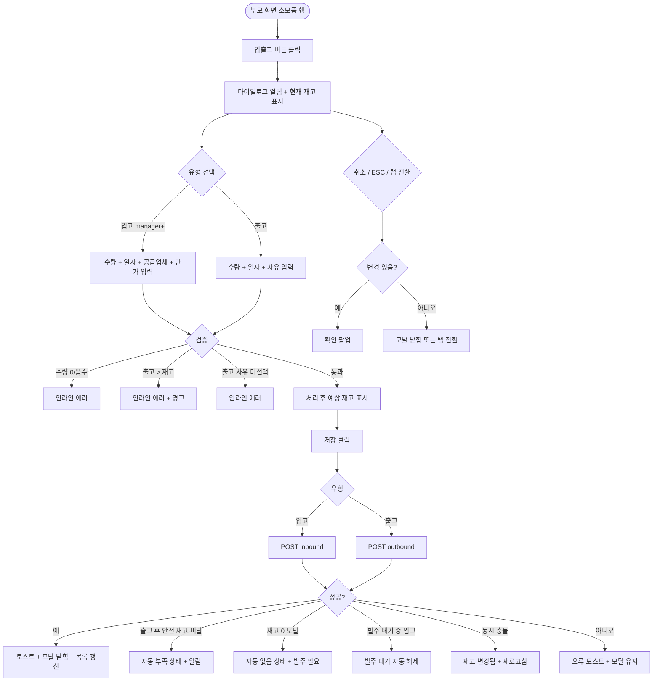

# DLG-057-002 입출고 처리 다이얼로그

## 1. 다이얼로그 메타 정보

| 항목 | 값 |
|---|---|
| 작성일 | 2026-05-22 |
| 버전 | v1.0 |
| 상태 | 최신 통합본 반영 (정합화 완료) |
| 도메인 | D06 시설관리 |
| 다이얼로그 ID | DLG-057-002 |
| 다이얼로그명 | 입출고 처리 |
| 다이얼로그 유형 | 입력 + 처리 모달 (양방향: 입고 / 출고) |
| 부모 화면 | SCR-057 소모품 재고 관리 |
| 호출 트리거 | 소모품 행의 [입출고] 버튼 클릭 |
| 기능코드 | FAC-EXT-03 (소모품 재고 관리) |
| 계약코드 | FAC-EXT-03-05 (입출고 처리) |
| 관련 API | `POST /api/consumables/:id/inbound` · `POST /api/consumables/:id/outbound` |

이 문서는 DLG-057-002 입출고 처리 다이얼로그에 대한 자기완결형 요구사항 정의서입니다.

## 2. 다이얼로그 개요와 목적

입출고 처리 다이얼로그는 소모품의 입고 또는 출고 수량을 기록하는 모달입니다. 처리 유형(입고/출고)을 선택하고 수량을 입력하면 현재 재고 수량이 자동 갱신됩니다.

운영 흐름은 일일 사용 시 출고 탭에서 수량·사유 기록 → 재고 자동 차감, 공급업체 입고 시 입고 탭에서 수량·공급업체·단가·일자 기록 → 재고 자동 증가로 이어집니다. 안전 재고 미달 시 자동 "부족" 상태 전환 + 알림이 발송됩니다.

## 3. 호출 트리거와 부모 화면 연결

호출 트리거는 SCR-057 소모품 재고 관리 페이지의 소모품 목록 테이블 행 [입출고] 버튼 클릭입니다. 매니저 이상에게 노출되지만 스태프는 출고만 가능한 제한 모드일 수 있습니다.

부모 화면에서 호출 시점에 소모품 ID와 품목명, 현재 재고 수량이 다이얼로그에 전달됩니다. 다이얼로그가 닫히면(저장 성공 시) 부모 화면의 소모품 목록이 자동 갱신되어 현재 재고가 새 값으로 업데이트됩니다.

## 4. 레이아웃과 UI 구성

다이얼로그는 화면 중앙에 떠 있는 모달 형태이며 너비는 데스크톱 기준 560px입니다.

모달 상단에는 "입출고 처리 — [품목명]" 제목이 표시되고, 그 우측 상단에 닫기 X 버튼이 있습니다.

본문은 위에서 아래로 다음과 같이 구성됩니다.

첫 번째 영역은 처리 유형 선택 탭입니다. 입고 / 출고 두 탭으로 분리되며 탭 전환 시 하단 입력 필드가 동적으로 변경됩니다. 스태프 권한의 경우 입고 탭이 비활성화되거나 hidden 됩니다.

두 번째 영역은 현재 재고 표시입니다. 처리 전 현재 재고 수량이 큰 글씨로 읽기 전용 표시됩니다.

세 번째 영역은 처리 수량 입력입니다. 숫자 입력으로 입고 또는 출고할 수량을 입력합니다. 0 또는 음수 입력 시 인라인 에러가 표시됩니다. 출고 탭에서 현재 재고를 초과하는 수량 입력 시 인라인 에러 "현재 재고를 초과할 수 없습니다 (현재: N)"가 표시됩니다.

네 번째 영역은 처리 일자 입력입니다. 날짜 선택기로 실제 입출고 일자를 설정하며 기본값은 오늘입니다.

다섯 번째 영역은 처리 유형별 부가 정보입니다. 입고 탭에서는 공급업체(자동완성, 등록 시 기본값) · 단가(숫자 입력, 비용 집계용)가 표시됩니다. 출고 탭에서는 사용 사유 선택(청소 / 시설 / 이벤트 / 회원 제공 / 기타) 또는 자유 입력이 표시됩니다. 출고 사유 미선택 시 인라인 에러로 차단됩니다.

여섯 번째 영역은 처리 후 예상 재고 표시입니다. 입력한 수량 반영 시 예상 재고 수량이 자동 계산되어 미리 표시됩니다. 운영자가 잘못된 수량을 입력하지 않도록 시각적으로 즉시 확인 가능합니다.

모달 하단에는 [저장] · [취소] 버튼이 좌우로 배치됩니다.

## 5. 입력 필드와 검증

처리 수량은 1 이상 자연수 필수입니다. 0 또는 음수 입력 시 인라인 에러가 표시됩니다.

출고 시 처리 수량이 현재 재고를 초과하면 인라인 에러로 차단됩니다.

처리 일자는 기본 오늘이며 미래 일자 입력은 차단됩니다.

입고 시 공급업체 · 단가는 권장 입력입니다. 미입력 시 저장은 가능하지만 비용 집계가 누락됩니다.

출고 시 사유는 필수 입력입니다. 미선택 시 인라인 에러로 차단됩니다.

[저장] 버튼은 모든 필수 항목이 유효하게 입력된 경우에만 활성화됩니다.

## 6. 버튼·아이콘·링크 액션 전체 정의

[저장] 버튼은 처리 유형에 따라 다른 API를 호출합니다. 입고 탭은 `POST /api/consumables/:id/inbound`, 출고 탭은 `POST /api/consumables/:id/outbound`가 호출됩니다.

저장 성공 시 "재고가 갱신되었어요" 토스트가 표시되고 모달이 자동으로 닫히며 부모 화면 목록이 갱신됩니다. 출고 후 안전 재고 미달 시 자동으로 "부족" 상태로 전환되며 운영자 알림이 발송됩니다.

처리 유형 탭 전환은 입력 필드를 동적으로 변경합니다. 입력 도중 탭을 전환하면 입력값 초기화 확인 팝업이 표시됩니다.

[취소] 버튼과 우측 상단 X 버튼은 변경 없이 모달을 종료합니다. 입력 변경이 있는 경우 확인 팝업이 표시됩니다.

ESC 키 또는 배경 클릭은 취소와 동일하게 동작합니다.

처리 후 예상 재고는 수량 입력 시 실시간으로 자동 계산되어 표시됩니다.

## 7. 토스트와 확인 팝업

성공 토스트는 "재고가 갱신되었어요"가 5초간 표시됩니다.

실패 토스트는 "재고 초과 (현재: N)", "1 이상", "사유 선택", "권한이 없어요", "재고가 변경되었습니다, 새로고침" 같은 문구가 표시됩니다.

확인 팝업은 변경 사항이 있는 상태에서 모달을 닫으려고 할 때 + 처리 유형 탭 전환 시 입력값 초기화 확인이 표시됩니다.

## 8. 데이터 흐름과 외부 연동

입고는 `POST /api/consumables/:id/inbound`로 처리되며 수량 · 일자 · 공급업체 · 단가가 전송됩니다. 출고는 `POST /api/consumables/:id/outbound`로 처리되며 수량 · 일자 · 사유가 전송됩니다.

출고 처리 후 재고 수량이 안전 재고 기준 이하로 떨어지면 자동 "부족" 상태로 전환되며 NFR-19 알림이 운영자에게 발송됩니다.

재고 0 도달 시 자동 "없음" 상태 + "발주 필요" 강조 표시가 일어납니다.

입고 처리 시 발주 대기 상태였던 소모품은 자동으로 발주 대기 해제됩니다.

출고 사유는 분류별 통계로 매주 월요일 04:00 배치로 집계됩니다.

청소 완료 시 자동 출고 기록(FAC-EXT-04 청소 연계, 테넌트 정책)도 본 API를 통해 처리됩니다.

모든 입출고 처리는 감사 로그(SCR-097)에 actor · consumable_id · type(inbound/outbound) · quantity · before-after 형태로 기록됩니다.

## 9. 다이얼로그 상태와 예외 처리

기본 상태는 출고 탭이 기본 선택되어 있고 처리 수량이 비어 있는 상태입니다.

처리 후 예상 재고 표시 상태는 수량 입력 시 실시간으로 계산되어 표시됩니다.

저장 중 상태는 [저장] 버튼이 비활성화되고 스피너가 표시됩니다.

저장 성공 상태는 토스트 + 모달 자동 닫힘 + 목록 갱신이 일어납니다.

저장 실패 상태는 오류 토스트 + 모달 유지로 재시도가 가능합니다.

예외 케이스별 처리는 다음과 같습니다.

수량 미입력 또는 0 / 음수 시 [저장] 버튼이 비활성화되고 인라인 에러가 표시됩니다.

출고 시 수량 > 재고 시 인라인 에러 "재고 초과 (현재: N)" + 경고 메시지가 표시되어 저장이 차단됩니다.

출고 사유 미선택 시 인라인 에러로 차단됩니다.

동시 입출고 충돌(다른 운영자가 같은 소모품을 동시 처리) 시 "재고가 변경되었습니다, 새로고침" 안내가 표시됩니다.

스태프가 입고 탭 선택 시도 시 입고 탭이 비활성화되거나 hidden 됩니다.

본사 통합 모드 다른 지점 입출고 시 권한 안내가 표시됩니다.

권한 부족 시 다이얼로그 진입이 차단됩니다.

ESC/배경 클릭 시 입력 변경이 있으면 확인 팝업이 표시됩니다.

## 10. 권한별 처리

owner / manager는 입고 · 출고 모두 가능합니다.

staff / fc는 출고만 가능합니다. 입고 탭이 비활성화되거나 hidden 됩니다.

front는 출고 제한이 있을 수 있습니다(테넌트 정책).

trainer / readonly는 다이얼로그 진입 자체가 차단됩니다.

권한 없음은 다이얼로그 진입이 차단됩니다.

## 11. 화면 흐름

## 12. 운영 정책 (이 다이얼로그에 연결된 부분)

처리 수량은 1 이상 자연수 필수입니다.

출고 시 수량 > 현재 재고이면 차단되며 운영자 수동 조정이 필요합니다.

입고 처리 시 수량 · 공급업체 · 단가 · 일자 권장 입력입니다. 단가는 비용 집계용이며 매주 월요일 04:00 배치로 카테고리별 사용량 · 재고 회전율이 집계됩니다.

출고 처리 시 수량 · 사유 · 일자 필수입니다. 사유는 분류별 통계 활용입니다.

출고 사유 분류는 청소 / 시설 / 이벤트 / 회원 제공 / 기타이며 테넌트 정의 가능합니다.

출고 후 안전 재고 기준 이하 시 자동 "부족" 상태 + 운영자 알림이 발송됩니다.

재고 0 도달 시 자동 "없음" 상태 + "발주 필요" 강조가 표시됩니다.

입고 처리 시 발주 대기 상태였던 소모품은 자동으로 발주 대기 해제됩니다(전체 입고 시).

청소 완료 시 자동 출고 기록(FAC-EXT-04 청소 연계)도 본 API를 통해 처리됩니다(테넌트 정책).

권한별 가시성: 슈퍼관리자 · Owner(지점장) · 매니저는 입고 · 출고 모두 가능. FC · 스태프는 출고만 가능. 트레이너 · 읽기 전용은 진입 불가.

모든 입출고 처리는 감사 로그(SCR-097)에 actor · consumable_id · type · quantity · before-after 형태로 기록됩니다.

처리 후 예상 재고는 수량 입력 시 실시간 자동 계산되어 표시되어 운영자가 잘못된 수량을 입력하지 않도록 시각적으로 즉시 확인 가능합니다.

본사 통합 모드에서 다른 지점 소모품 입출고 시도 시 권한자 외 차단됩니다.

이상의 모든 정책은 이 다이얼로그를 구현하고 운영하는 사람이 별도 문서 없이 이 한 장만 보면 이해할 수 있도록 풀어 적었습니다.
