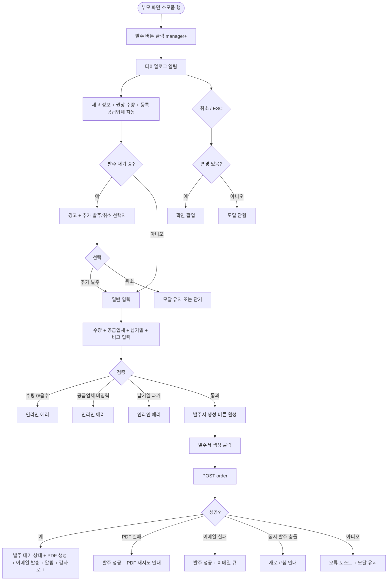

# DLG-057-003 발주 생성 다이얼로그

## 1. 다이얼로그 메타 정보

| 항목 | 값 |
|---|---|
| 작성일 | 2026-05-22 |
| 버전 | v1.0 |
| 상태 | 최신 통합본 반영 (정합화 완료) |
| 도메인 | D06 시설관리 |
| 다이얼로그 ID | DLG-057-003 |
| 다이얼로그명 | 발주 생성 |
| 다이얼로그 유형 | 입력 + 처리 모달 |
| 부모 화면 | SCR-057 소모품 재고 관리 |
| 호출 트리거 | 재고 부족 소모품 행의 [발주] 버튼 클릭 |
| 기능코드 | FAC-EXT-03 (소모품 재고 관리) |
| 계약코드 | FAC-EXT-03-06 (발주 생성) |
| 관련 API | `POST /api/consumables/:id/order` · `GET /api/consumables/order-pdf` |

이 문서는 DLG-057-003 발주 생성 다이얼로그에 대한 자기완결형 요구사항 정의서입니다.

## 2. 다이얼로그 개요와 목적

발주 생성 다이얼로그는 재고가 부족한 소모품에 대해 재발주를 요청하는 모달입니다. 발주 수량과 공급업체를 입력하면 발주서가 생성되고 담당자에게 알림이 발송됩니다.

운영 흐름은 안전 재고 미달 또는 재고 0 도달 후 운영자가 [발주] 버튼 클릭 → 본 다이얼로그에서 발주 수량 · 공급업체 · 희망 납기일 입력 → [발주서 생성] 클릭 → 소모품 상태가 "발주 대기"로 전환되며 발주서가 PDF로 생성되고 이메일로 발송됩니다. 입고 처리 시 발주 대기 자동 해제됩니다.

## 3. 호출 트리거와 부모 화면 연결

호출 트리거는 SCR-057 소모품 재고 관리 페이지의 소모품 목록 테이블 행 [발주] 버튼 클릭입니다. 매니저 이상 권한자에게 노출되며 재고 부족 또는 재고 0 상태인 소모품에 활성화됩니다. 정상 재고 소모품에서도 사전 발주를 위해 사용 가능합니다.

부모 화면에서 호출 시점에 소모품 ID와 품목명, 현재 재고 수량, 안전 재고 기준, 등록 시 공급업체 정보가 다이얼로그에 전달됩니다. 다이얼로그가 닫히면(저장 성공 시) 부모 화면의 소모품 목록이 자동 갱신되어 상태가 "발주 대기"로 표시됩니다.

## 4. 레이아웃과 UI 구성

다이얼로그는 화면 중앙에 떠 있는 모달 형태이며 너비는 데스크톱 기준 560px입니다.

모달 상단에는 "발주 생성 — [품목명]" 제목이 표시되고, 그 우측 상단에 닫기 X 버튼이 있습니다.

본문은 위에서 아래로 다음과 같이 구성됩니다.

첫 번째 영역은 재고 정보 표시입니다. 현재 재고 수량 · 안전 재고 기준이 카드 형태로 읽기 전용 표시됩니다. 운영자가 발주 수량을 결정할 때 참고합니다.

두 번째 영역은 발주 수량 입력입니다. 숫자 입력으로 주문할 수량을 입력합니다. 권장 수량(안전 재고 + 평균 출고량 기반)이 기본값으로 자동 표시되며 운영자가 수정 가능합니다. 1 이상 자연수 필수이며 0 또는 음수 입력 시 인라인 에러로 차단됩니다.

세 번째 영역은 공급업체 선택/입력입니다. 등록 시 공급업체가 기본값으로 자동 채워지며 운영자가 수정 가능합니다. 텍스트 입력 또는 드롭다운으로 자주 사용하는 공급업체 목록에서 선택할 수도 있습니다. 미입력 시 인라인 에러로 차단됩니다.

네 번째 영역은 희망 납기일 입력입니다. 날짜 선택기로 납품 받기를 원하는 날짜를 설정합니다. 선택 사항이지만 입력 권장입니다. 과거 일자 입력은 차단됩니다.

다섯 번째 영역은 비고 입력입니다. textarea로 발주 시 특이사항을 자유 입력합니다. 선택 사항입니다.

여섯 번째 영역은 발주 대기 중 재발주 안내입니다. 해당 소모품이 이미 발주 대기 상태이면 경고 "이미 발주 대기 중입니다" + [추가 발주] / [취소] 선택지가 표시됩니다.

모달 하단에는 [발주서 생성] · [취소] 버튼이 좌우로 배치됩니다.

## 5. 입력 필드와 검증

발주 수량은 1 이상 자연수 필수입니다.

공급업체는 필수 입력입니다. 미입력 시 인라인 에러로 차단됩니다.

희망 납기일은 선택 사항이며 과거 일자는 차단됩니다.

비고는 선택 사항입니다.

[발주서 생성] 버튼은 발주 수량과 공급업체가 모두 유효하게 입력된 경우에만 활성화됩니다.

## 6. 버튼·아이콘·링크 액션 전체 정의

[발주서 생성] 버튼은 입력된 정보로 발주를 확정합니다. `POST /api/consumables/:id/order`가 호출되며 처리 중에는 스피너가 표시되고 버튼이 비활성화됩니다.

저장 성공 시 "발주가 생성되었어요" 토스트가 표시되고 모달이 자동으로 닫히며 부모 화면 소모품 상태가 "발주 대기"로 갱신됩니다. 발주서 PDF가 자동 생성되어 이메일로 발송되며, 알림 센터에도 발주 생성 알림이 푸시됩니다.

발주 대기 중 재발주 안내 카드의 [추가 발주] 버튼은 기존 발주를 유지하면서 추가 발주를 진행합니다.

[취소] 버튼과 우측 상단 X 버튼은 변경 없이 모달을 종료합니다. 입력 변경이 있는 경우 확인 팝업이 표시됩니다.

ESC 키 또는 배경 클릭은 취소와 동일하게 동작합니다.

발주서 PDF 미리보기 링크가 있을 수 있어 운영자가 발주 전 PDF 내용을 확인할 수 있습니다.

## 7. 토스트와 확인 팝업

성공 토스트는 "발주가 생성되었어요" + "발주서가 이메일로 발송되었어요"가 5초간 표시됩니다.

실패 토스트는 "공급업체 입력", "수량 1 이상", "권한이 없어요", "PDF 생성 실패" 같은 문구가 표시됩니다.

확인 팝업은 변경 사항이 있는 상태에서 모달을 닫으려고 할 때 + 발주 대기 중 재발주 시 [추가 발주] / [취소] 선택지가 표시됩니다.

## 8. 데이터 흐름과 외부 연동

`POST /api/consumables/:id/order`는 발주 수량 · 공급업체 · 희망 납기일 · 비고를 전송하며 응답으로 발주 ID와 발주서 PDF URL이 반환됩니다.

발주 처리 시 소모품 상태가 "발주 대기(pending)"로 자동 전환됩니다.

발주서 PDF는 백엔드에서 자동 생성되며 운영자 이메일과 공급업체 이메일로 발송됩니다(공급업체 이메일 정보가 등록된 경우).

발주 대기 자동 해제는 입고 처리(전체 입고) 시 자동으로 트리거됩니다. 부분 입고 시 잔여 수량은 발주 대기 상태가 유지됩니다.

발주 권장 알림 배치는 재고 0 품목을 매일 09:00에 운영자에게 알립니다(발주 생성을 유도).

모든 발주 생성 처리는 감사 로그(SCR-097)에 actor · consumable_id · order_id · quantity · supplier · before-after 형태로 기록됩니다.

## 9. 다이얼로그 상태와 예외 처리

기본 상태는 재고 정보 표시 + 권장 수량 자동 채움 + 등록 시 공급업체 자동 채움 상태입니다.

발주 대기 중 재발주 상태는 경고 + [추가 발주] / [취소] 선택지가 표시됩니다.

처리 중 상태는 [발주서 생성] 버튼이 비활성화되고 스피너가 표시됩니다.

저장 성공 상태는 토스트 + 모달 자동 닫힘 + 상태 갱신 + 발주서 발송이 일어납니다.

저장 실패 상태는 오류 토스트 + 모달 유지로 재시도가 가능합니다.

예외 케이스별 처리는 다음과 같습니다.

수량 미입력 또는 0 / 음수 시 인라인 에러로 차단됩니다.

공급업체 미입력 시 인라인 에러 "공급업체 입력"이 표시됩니다.

희망 납기일 과거 입력 시 인라인 에러로 차단됩니다.

발주 대기 중 재발주 시 경고 + [추가 발주] / [취소] 선택지가 제공됩니다.

PDF 생성 실패 시 발주는 성공으로 처리되지만 토스트 "PDF 생성 실패, 재시도 안내"가 표시되며 운영자가 별도로 PDF를 재생성할 수 있습니다.

이메일 발송 실패 시 발주는 성공으로 처리되고 이메일 재시도 큐에 등록됩니다.

권한 부족 시 다이얼로그 진입이 차단됩니다.

본사 통합 모드 다른 지점 발주 시도 시 권한 안내가 표시됩니다.

동시 발주 충돌 시 "이미 발주가 생성되었습니다" 안내 + 새로고침이 안내됩니다.

ESC/배경 클릭 시 입력 변경이 있으면 확인 팝업이 표시됩니다.

## 10. 권한별 처리

owner / manager는 발주 생성 가능합니다.

staff / fc / front는 발주 권한이 없으므로 부모 화면에서 [발주] 버튼이 노출되지 않습니다.

trainer / readonly는 다이얼로그 진입 자체가 차단됩니다.

권한 없음은 다이얼로그 진입이 차단됩니다.

## 11. 화면 흐름

## 12. 운영 정책 (이 다이얼로그에 연결된 부분)

발주 생성 시 수량 · 공급업체 · 예상 도착일 입력이며 발주서는 PDF 또는 이메일 발송 옵션이 제공됩니다.

발주 수량 권장값은 안전 재고 + 평균 출고량 기반으로 자동 계산되어 기본값으로 표시됩니다.

발주 후 부분 입고가 가능하며 잔여 수량은 발주 대기 상태를 유지합니다. 전체 입고 시에만 발주 대기가 자동 해제됩니다.

발주 대기 상태에서 재발주 시도 시 경고 + [추가 발주] / [취소] 선택지가 제공됩니다.

발주 생성 시 상태가 "발주 대기(pending)"로 자동 전환됩니다.

발주서 PDF는 자동 생성되며 운영자 이메일과 공급업체 이메일로 발송됩니다.

PDF 생성 또는 이메일 발송 실패는 발주 처리와 분리되어 별도 재시도가 가능합니다.

발주 권장 알림 배치는 재고 0 품목을 매일 09:00에 운영자에게 알립니다.

모든 발주 생성 처리는 감사 로그(SCR-097)에 actor · consumable_id · order_id · quantity · supplier · before-after 형태로 기록됩니다.

권한별 가시성: 슈퍼관리자 · 센터장 · 매니저만 발주 가능. FC · 스태프는 발주 불가. 트레이너 · 읽기 전용은 진입 불가.

본사 통합 모드에서 다른 지점 소모품 발주 시도 시 권한자 외 차단됩니다.

이상의 모든 정책은 이 다이얼로그를 구현하고 운영하는 사람이 별도 문서 없이 이 한 장만 보면 이해할 수 있도록 풀어 적었습니다.
