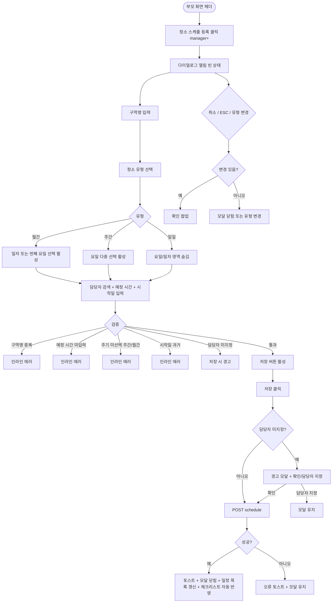

# DLG-058-001 청소 스케줄 등록 다이얼로그

## 1. 다이얼로그 메타 정보

| 항목 | 값 |
|---|---|
| 작성일 | 2026-05-22 |
| 버전 | v1.0 |
| 상태 | 최신 통합본 반영 (정합화 완료) |
| 도메인 | D06 시설관리 |
| 다이얼로그 ID | DLG-058-001 |
| 다이얼로그명 | 청소 스케줄 등록 |
| 다이얼로그 유형 | 입력 + 처리 모달 |
| 부모 화면 | SCR-058 청소 스케줄 |
| 호출 트리거 | 헤더 [청소 스케줄 등록] 버튼 클릭 |
| 기능코드 | FAC-EXT-04 (청소 스케줄) |
| 계약코드 | FAC-EXT-04-04 (스케줄 등록) |
| 관련 API | `POST /api/cleaning/schedule` |

이 문서는 DLG-058-001 청소 스케줄 등록 다이얼로그에 대한 자기완결형 요구사항 정의서입니다.

## 2. 다이얼로그 개요와 목적

청소 스케줄 등록 다이얼로그는 청소 구역 · 담당자 · 주기 · 예정 시간을 설정해 청소 일정을 등록하는 모달입니다. 등록된 일정은 이후 해당 주기마다 자동으로 체크리스트에 생성됩니다.

운영 흐름은 매니저가 새로운 청소 구역(예: 남자 탈의실)을 도입할 때 본 다이얼로그로 구역명 · 청소 유형(일일/주간/월간) · 담당자 · 예정 시간 · 주기를 설정 → 등록 후 매일 00:00 배치가 자동으로 다음 일정을 생성 → 체크리스트에 자동 반영됩니다.

## 3. 호출 트리거와 부모 화면 연결

호출 트리거는 SCR-058 청소 스케줄 페이지의 헤더 [청소 스케줄 등록] 버튼 클릭입니다. 매니저 이상 권한자에게 노출됩니다.

부모 화면에서 호출 시점에 빈 상태로 다이얼로그가 열립니다. 다이얼로그가 닫히면(저장 성공 시) 부모 화면의 청소 일정 목록과 오늘 체크리스트(해당 날짜에 해당하는 경우)가 자동 갱신됩니다.

## 4. 레이아웃과 UI 구성

다이얼로그는 화면 중앙에 떠 있는 모달 형태이며 너비는 데스크톱 기준 600px입니다.

모달 상단에는 "청소 스케줄 등록" 제목이 표시되고, 그 우측 상단에 닫기 X 버튼이 있습니다.

본문은 위에서 아래로 다음과 같이 구성됩니다.

첫 번째 영역은 구역명 입력입니다. 텍스트 입력란으로 청소할 구역 이름을 자유 입력합니다. 예: "남자 탈의실", "GX룸", "로비". 필수 입력이며 동일 지점 내 고유여야 합니다. 중복 시 인라인 에러 "동일 구역명이 존재합니다"가 표시됩니다.

두 번째 영역은 청소 유형 선택입니다. 일일 청소 / 주간 청소 / 월간 청소 중 단일 선택이며 라디오 또는 버튼 그룹으로 표시됩니다. 청소 유형에 따라 하단 주기 입력 필드가 동적으로 변경됩니다.

세 번째 영역은 담당자 선택입니다. 직원 검색 자동완성(디바운스 300ms + 최소 2자)으로 청소를 담당할 직원을 선택합니다. 미지정 시 경고 "담당자 미지정으로 저장할까요?" + [확인] / [담당자 지정] 선택지가 표시됩니다(저장 가능). 담당자 미지정 일정은 부모 화면의 상단 강조 영역에 표시되어 운영자가 즉시 배정하도록 유도됩니다.

네 번째 영역은 예정 시간 입력입니다. HH:mm 형식의 시간 선택기로 청소 예정 시간을 입력합니다. 필수 입력이며 운영 시간 내 권장입니다.

다섯 번째 영역은 청소 유형에 따라 동적으로 표시됩니다. 일일 청소 선택 시 요일·일자 선택 필드가 숨겨집니다. 주간 청소 선택 시 요일 선택 필드(월·화·수·목·금·토·일 다중 선택)가 활성화되며 다중 선택이 가능합니다(예: 월·수·금). 월간 청소 선택 시 매월 몇 일에 수행할지 일자 선택 필드가 활성화되거나, 매월 지정 번째 요일(예: 매월 둘째 토요일) 선택 옵션이 표시됩니다.

여섯 번째 영역은 시작일 입력입니다. 날짜 선택기로 이 스케줄을 적용하기 시작할 날짜를 설정합니다. 기본값은 오늘이며 과거 일자는 차단됩니다.

모달 하단에는 [저장] · [취소] 버튼이 좌우로 배치됩니다.

## 5. 입력 필드와 검증

구역명은 필수 입력이며 동일 지점 내 고유여야 합니다. 중복 시 인라인 에러로 차단됩니다.

청소 유형은 일일 / 주간 / 월간 단일 선택 필수입니다.

담당자는 권장 입력입니다. 미지정 시 경고 + 저장 가능 선택지가 제공됩니다.

예정 시간은 HH:mm 형식 필수 입력입니다.

주간 청소 선택 시 요일 다중 선택이 최소 1개 이상 필요합니다. 미선택 시 인라인 에러 "주기를 선택해주세요"가 표시됩니다.

월간 청소 선택 시 일자 또는 번째 요일 선택이 필수입니다. 미선택 시 인라인 에러로 차단됩니다.

시작일은 오늘 또는 미래 일자이며 과거 일자는 차단됩니다.

[저장] 버튼은 모든 필수 항목이 유효하게 입력된 경우에만 활성화됩니다.

## 6. 버튼·아이콘·링크 액션 전체 정의

[저장] 버튼은 입력된 정보로 청소 스케줄을 등록합니다. `POST /api/cleaning/schedule`이 호출되며 처리 중에는 스피너가 표시되고 버튼이 비활성화됩니다.

저장 성공 시 "청소 스케줄이 등록되었어요" 토스트가 표시되고 모달이 자동으로 닫히며 부모 화면 일정 목록과 오늘 체크리스트(해당 일자에 해당하는 경우)가 갱신됩니다.

담당자 미지정 등록 시 경고 모달이 표시되고 [확인] 클릭 시 저장이 진행됩니다. [담당자 지정] 클릭 시 모달이 유지되고 운영자가 담당자를 추가 입력합니다.

청소 유형 라디오 선택 시 하단 주기 입력 필드가 동적으로 변경됩니다. 일일 → 요일·일자 영역 숨김, 주간 → 요일 다중 선택 표시, 월간 → 일자/번째 요일 선택 표시입니다.

[취소] 버튼과 우측 상단 X 버튼은 변경 없이 모달을 종료합니다. 입력 변경이 있는 경우 확인 팝업이 표시됩니다.

ESC 키 또는 배경 클릭은 취소와 동일하게 동작합니다.

담당자 검색 자동완성은 디바운스 300ms 후 직원 검색 결과를 표시합니다. 직원 검색 0건 시 "직원을 등록 후 다시 시도" 안내가 표시됩니다.

## 7. 토스트와 확인 팝업

성공 토스트는 "청소 스케줄이 등록되었어요"가 5초간 표시됩니다.

실패 토스트는 "동일 구역명이 존재해요", "예정 시간 입력", "주기 선택", "권한이 없어요" 같은 문구가 표시됩니다.

확인 팝업은 변경 사항이 있는 상태에서 모달을 닫으려고 할 때 + 담당자 미지정 등록 시 + 청소 유형 변경 시 입력값 초기화 확인이 표시됩니다.

담당자 미지정 등록 시 "담당자 미지정으로 저장할까요?" + [확인] / [담당자 지정] 선택지가 모달로 제공됩니다.

## 8. 데이터 흐름과 외부 연동

`POST /api/cleaning/schedule`은 구역명 · 청소 유형 · 담당자 · 예정 시간 · 주기 정보(요일/일자) · 시작일을 전송하며 응답으로 생성된 스케줄 정보가 반환됩니다.

구역명 중복 검증은 백엔드에서 동일 지점 내에서 수행됩니다.

저장 성공 시 정기 일정 자동 반복 생성 배치(매일 00:00)가 등록된 주기 기반으로 자동 일정을 생성합니다. 시작일이 오늘이면 즉시 오늘 체크리스트에 반영됩니다.

담당자 미지정 일정은 매일 09:00 운영자 알림 배치로 NFR-19 알림이 발송됩니다.

직원 변경 이벤트 연계로 직원 퇴직 · 이관 시 담당 일정이 자동 미지정 + 알림으로 처리됩니다.

모든 등록 처리는 감사 로그(SCR-097)에 actor · schedule_id · before-after 형태로 기록됩니다.

## 9. 다이얼로그 상태와 예외 처리

기본 상태는 일일 청소가 기본 선택되어 있고 시작일이 오늘 기본값으로 설정된 상태입니다.

청소 유형 변경 상태는 하단 주기 입력 필드가 동적으로 변경됩니다.

담당자 미지정 상태는 저장 시 경고 + 저장 가능 선택지가 표시됩니다.

저장 중 상태는 [저장] 버튼이 비활성화되고 스피너가 표시됩니다.

저장 성공 상태는 토스트 + 모달 자동 닫힘 + 일정 목록 갱신이 일어납니다.

저장 실패 상태는 오류 토스트 + 모달 유지로 재시도가 가능합니다.

예외 케이스별 처리는 다음과 같습니다.

구역명 중복 시 인라인 에러로 차단됩니다.

담당자 미지정 등록 시 경고 + [확인] / [담당자 지정] 선택지가 제공됩니다.

예정 시간 미입력 시 인라인 에러로 차단됩니다.

정기 일정 주기 미선택 시 인라인 에러로 차단됩니다.

시작일 과거 입력 시 인라인 에러로 차단됩니다.

청소 유형 변경 시 기존 주기 입력값이 초기화되며 확인 팝업이 표시됩니다.

직원 검색 0건 시 직원 등록 안내가 표시됩니다.

권한 부족 시 다이얼로그 진입이 차단됩니다.

본사 통합 모드 다른 지점 등록 시 권한 안내가 표시됩니다.

동시 편집 충돌 시 "다른 사용자가 변경" 안내 + 새로고침이 안내됩니다.

ESC/배경 클릭 시 입력 변경이 있으면 확인 팝업이 표시됩니다.

## 10. 권한별 처리

owner / manager는 청소 스케줄 등록 가능합니다.

staff / fc는 등록 권한이 없으므로 부모 화면에서 [청소 스케줄 등록] 버튼이 노출되지 않습니다. 본인 담당 구역 완료 체크만 가능합니다.

trainer / readonly는 다이얼로그 진입 자체가 차단됩니다.

권한 없음은 다이얼로그 진입이 차단됩니다.

## 11. 화면 흐름

## 12. 운영 정책 (이 다이얼로그에 연결된 부분)

청소 유형은 일일 / 주간 / 월간 3종이며 등록 시 단일 선택입니다.

청소 주기 정책: 일일은 매일, 주간은 요일 선택(다중), 월간은 매월 지정일 또는 지정 번째 요일입니다.

구역명은 동일 지점 내 고유이며 중복 등록이 차단됩니다.

담당자는 직원 검색으로 지정하며 미지정 시 경고 + 저장 가능 선택지가 제공됩니다. 미지정 일정은 부모 화면 상단 강조 영역에 표시되고 매일 09:00 운영자 알림 배치로 NFR-19 알림이 발송됩니다.

예정 시간은 HH:mm 형식 필수 입력이며 운영 시간 내 권장입니다.

정기 청소 일정은 매일 자정에 자동 반복 생성됩니다(등록된 주기 기반).

정기 일정 변경 시 미래 분만 영향이며 과거 이력은 유지됩니다.

정기 일정 삭제 시 미래 인스턴스 모두 삭제, 과거 이력은 유지됩니다.

시작일이 오늘이면 즉시 오늘 체크리스트에 반영됩니다.

직원 변경 이벤트 연계로 직원 퇴직 · 이관 시 담당 일정이 자동 미지정 + 알림으로 처리됩니다.

권한별 가시성: 슈퍼관리자 · Owner(지점장) · 매니저만 청소 스케줄 등록 가능. FC · 스태프는 등록 불가. 트레이너 · 읽기 전용은 진입 불가.

모든 등록 처리는 감사 로그(SCR-097)에 actor · schedule_id · before-after 형태로 기록됩니다.

본사 통합 모드에서 다른 지점 청소 스케줄 등록 시도 시 권한자 외 차단됩니다.

이상의 모든 정책은 이 다이얼로그를 구현하고 운영하는 사람이 별도 문서 없이 이 한 장만 보면 이해할 수 있도록 풀어 적었습니다.
