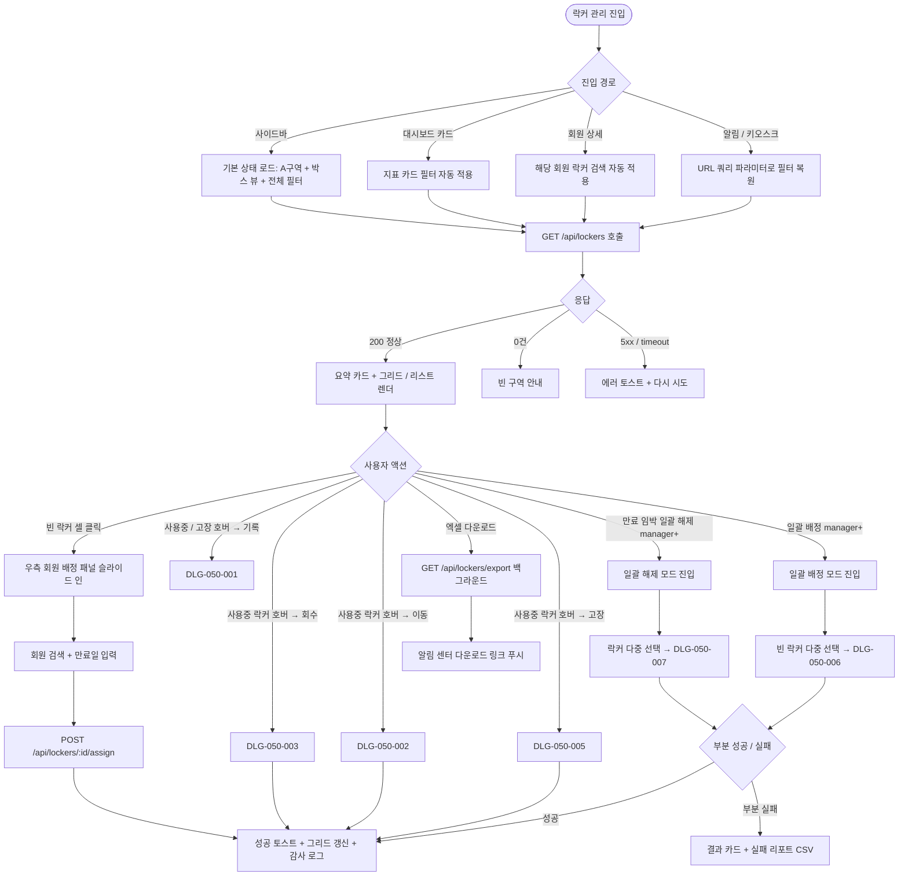
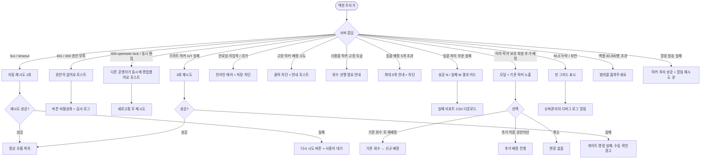

# SCR-050 락커 관리 페이지

## 1. 화면 메타 정보

이 문서는 락커 관리 페이지에 대한 자기완결형 요구사항 정의서입니다. 다른 문서를 함께 보지 않아도 이 문서 한 장만으로 락커 관리 페이지에 들어가는 모든 영역, 모든 버튼, 모든 모달, 모든 권한, 모든 예외 처리, 그리고 이 화면을 지탱하는 운영 정책까지 전부 이해하고 구현할 수 있도록 작성합니다.

| 항목 | 값 |
|---|---|
| 작성일 | 2026-05-22 |
| 버전 | v1.0 |
| 상태 | 최신 통합본 반영 (정합화 완료) |
| 도메인 | D06 시설관리 |
| 화면 ID | SCR-050 |
| 화면명 | 락커 관리 |
| 화면 유형 | 허브 화면 (Hub Screen) |
| 라우트 (URL) | `/locker` |
| 플랫폼 | 데스크톱(기본), 태블릿, 모바일(풀스크린 진입) |
| 우선순위 | P0 (출시 필수) |
| 기능코드 | FAC-01 (락커 관리) |
| 계약코드 | FAC-01, FAC-01-01 ~ FAC-01-12 |
| 계약 상태 | 계약 범위 본기능 |
| 부모 기능 prefix | FAC |
| Lv1 코드 | FAC-01 |
| Lv2 / Lv3 세분화 | FAC-01-01 ~ FAC-01-12 (현황 요약 카드, 구역 탭, 배치 그리드, 검색, 개별 배정, 회수, 이동, 고장 처리, 기록 조회, 일괄 해제, 일괄 배정, 엑셀 다운로드) |
| 연계 화면 | SCR-051 사물함 배정 관리, SCR-052 밴드/카드 관리, SCR-M004 회원 상세, SCR-097 감사 로그, SCR-C001 캘린더, KIO-201/202/204/304 (키오스크) |
| 호출 다이얼로그 | DLG-050-001 락커 기록, DLG-050-002 락커 이동, DLG-050-003 락커 회수 확인, DLG-050-004 개별 배정, DLG-050-005 고장 토글 확인, DLG-050-006 일괄 배정, DLG-050-007 일괄 해제 확인 |

## 2. 화면 개요와 목적

락커 관리 페이지는 센터에 설치된 모든 락커의 배정 현황과 상태를 한눈에 파악하고, 회원에게 락커를 배정·이동·회수하거나 고장 락커를 격리하는 시설관리 도메인의 핵심 허브 화면입니다. 락커는 회원의 부가 이용권 또는 옵션 상품과 연결되어 운영되며, 만료일이 도래하면 자동 또는 수동으로 회수되어야 합니다. 이 화면은 단순한 자산 관리 도구가 아니라 회원 운영, 키오스크 자동 배정, 스마트 락커 IoT 명령, 본사 통합 모드 운영, 만료 알림 발송, 감사 로그 기록까지 모두 묶어 처리하는 운영 허브로 동작해야 합니다.

이 화면이 다루는 운영 흐름은 매우 다양합니다. 프런트는 신규 회원이 등록된 직후 가까운 빈 락커를 그리드에서 클릭해 즉시 배정하고, 매니저는 매월 말 만료 임박 7일 이내 락커를 한 번에 일괄 해제해 운영 회의에서 정리합니다. 부부·가족 회원이 인접 락커 여러 개를 동시 사용하고 싶다고 요청하면 매니저는 일괄 배정으로 빈 락커 여러 개를 한 회원에게 동시 배정합니다. 락커 키가 분실되거나 잠금이 불량이면 프런트가 즉시 고장 토글을 켜 배정 차단 상태로 격리하고 수리 접수(SCR-056 장비 점검)를 연결합니다. 본사 슈퍼관리자는 통합 모드에서 전 지점 락커 가동률을 한 화면에서 확인하고, 키오스크 자동 배정에 사용되는 락커 풀을 운영자가 이 화면에서 직접 관리합니다.

따라서 이 화면은 권한별로 가능한 액션이 단계적으로 제한되어야 하고, 일괄 작업에는 부분 실패 처리가 보장되어야 하며, 모든 상태 변경은 감사 로그에 기록되어야 합니다.

## 3. 진입 경로와 인접 화면

락커 관리 페이지에 진입하는 경로는 여러 가지가 있고, 각 경로마다 진입 직후 화면의 초기 상태가 조금씩 달라집니다.

첫 번째 경로는 사이드바입니다. 좌측 사이드바의 "시설 관리" 메뉴 아래 "락커 관리" 항목을 클릭하면 진입합니다. 이 경우 URL은 단순히 `/locker`가 되고, 화면은 기본 상태(구역 A 탭, 박스 뷰, 상태 필터 전체)로 시작합니다.

두 번째 경로는 대시보드의 시설관리 지표 카드 클릭입니다. 대시보드(SCR-101)에서 "만료 임박 락커 수", "고장 락커 수" 같은 카드를 클릭하면 락커 관리 페이지로 이동하면서 해당 지표에 대응하는 필터가 URL 쿼리 파라미터로 자동 적용된 상태로 진입합니다. 예를 들어 "만료 임박 락커 수" 카드를 누르면 `/locker?status=expiring`처럼 만료 임박 락커만 보이는 상태로 열립니다.

세 번째 경로는 회원 상세 화면(SCR-M004)에서의 진입입니다. 회원 상세의 부가서비스 영역에 표시된 락커 정보 옆의 "락커 관리로 이동" 링크를 누르면, 해당 회원이 보유한 락커가 자동으로 검색된 상태로 진입합니다.

네 번째 경로는 알림 센터(SCR-104)에서 만료 임박 알림 또는 고장 신고 알림을 누르는 경우입니다. 만료 임박 알림에서는 만료 임박 필터가 자동 적용되고, 고장 신고 알림에서는 해당 락커가 검색된 상태로 진입합니다.

다섯 번째 경로는 키오스크(KIO-201) 자동 배정 실패 알림입니다. 키오스크에서 회원 출석 후 자동 락커 배정에 실패한 경우, 운영자에게 알림이 가고 알림 클릭 시 락커 관리 페이지로 이동해 수동 배정을 처리합니다.

이 화면에서 다시 빠져나가는 인접 화면으로는, 락커 셀의 회원명을 클릭하면 진입하는 회원 상세(SCR-M004), DLG-050-001 락커 기록의 회원명 클릭 시 이동하는 회원 상세, 사이드바를 통해 이동하는 사물함 배정 관리(SCR-051)와 밴드/카드 관리(SCR-052), 고장 처리 후 수리 접수로 연결되는 장비 점검 일정(SCR-056), 그리고 모든 배정·회수·일괄 작업이 기록되는 감사 로그(SCR-097)가 있습니다.

## 4. 레이아웃과 UI 구성

락커 관리 페이지는 위에서 아래로 차곡차곡 쌓이는 세로형 단일 컬럼 레이아웃을 기본으로 합니다. 데스크톱에서는 가로 폭이 충분하므로 우측 회원 배정 패널이 슬라이드 인 될 때 본문 가로폭이 자동으로 축소됩니다. 태블릿에서는 본문 가로폭을 유지하면서 배정 패널이 우측 오버레이로 뜨고, 모바일에서는 락커를 누르면 풀스크린으로 배정 모달이 진입합니다.

가장 위에는 페이지 헤더가 있습니다. 헤더 좌측에는 "락커 관리"라는 페이지 타이틀과 함께, 현재 조회 중인 지점이 "전체 지점(통합)"인지 특정 지점인지를 알려주는 지점 컨텍스트 배지가 따라옵니다. 본사 통합 모드에서는 헤더 우측에 지점 전환 드롭다운이 표시되어, 본사 슈퍼관리자가 전체 지점과 개별 지점을 자유롭게 전환할 수 있습니다. 헤더 우측 끝에는 "엑셀 다운로드" 버튼이 있고, 다운로드 권한이 없는 계정에서는 이 버튼이 표시되지 않습니다.

페이지 헤더 바로 아래에는 현황 요약 카드 4개가 가로로 배치됩니다. 첫 번째 카드는 "전체 락커 수"로 등록된 모든 락커의 합계를 보여주며, 이 카드를 클릭하면 상태 필터가 "전체"로 자동 적용됩니다. 두 번째 카드는 "사용중 수"로 status=in_use 상태인 락커만 카운트되며, 클릭 시 "사용중" 필터가 자동 적용됩니다. 세 번째 카드는 "만료 임박 수"로 만료일이 7일 이내인 락커의 수를 보여주며, 클릭 시 만료 임박 필터가 자동 적용됩니다. 만료 임박 기준일(기본 7일)은 테넌트 정책에 따라 7~14일 범위 안에서 조정 가능합니다. 네 번째 카드는 "고장 수"로 status=broken 상태인 락커의 수를 보여주며, 클릭 시 고장 필터가 자동 적용됩니다.

요약 카드 아래에는 운영 제어 바가 있습니다. 좌측에는 구역 탭(A구역 / B구역 / C구역)이 배치되어 락커 배치 도면과 동일한 구역 단위로 필터링됩니다. 각 구역 탭에는 해당 구역의 락커 수가 작은 배지로 표시됩니다. 구역 탭 우측에는 보기 전환(박스 뷰 / 리스트 뷰) 토글이 있습니다. 박스 뷰는 실제 락커 배치와 동일한 격자 시각화에 최적화되어 있고, 리스트 뷰는 대량 검색과 정렬에 최적화되어 있습니다. 그 우측에는 상태 필터 칩(전체 / 사용중 / 미배정 / 만료 임박 / 고장)이 배치되며 각 칩에는 현재 적용된 구역 안에서의 해당 상태 건수가 작은 배지로 표시됩니다. 운영 제어 바의 가장 오른쪽에는 통합 검색창이 있어서 락커 번호 정확 매치 또는 배정된 회원명 부분 매치로 빠르게 락커를 찾을 수 있습니다. 검색은 입력 후 300ms 디바운스가 적용되어 타이핑이 끝나면 자동으로 결과가 갱신됩니다.

운영 제어 바 아래에는 일괄 작업 진입 버튼이 두 개 배치됩니다. 첫 번째는 "만료 임박 일괄 해제" 버튼이고, 누르면 일괄 해제 모드로 진입하면서 주황색 안내 배너 "만료 임박 락커를 클릭하여 선택하세요"가 그리드 상단에 표시됩니다. 일괄 해제 모드에서는 만료일이 D-7 이내인 락커만 클릭 가능하며, 그 외 락커는 클릭이 차단됩니다. 두 번째는 "일괄 배정" 버튼이고, 누르면 일괄 배정 모드로 진입하면서 파란색 안내 배너 "빈 락커를 클릭하여 선택하세요"가 그리드 상단에 표시됩니다. 일괄 배정 모드에서는 빈 락커만 클릭 가능하며, 사용중·고장 락커는 클릭이 차단됩니다. 두 일괄 모드 모두 상단에 "취소" 링크가 노출되어 모드를 종료할 수 있습니다.

본문 중앙에는 락커 배치 그리드가 표시됩니다. 그리드는 실제 락커 배치와 동일한 형태의 격자로 구성되며, 각 셀이 하나의 락커를 의미합니다. 셀의 색상은 락커 상태에 따라 분기됩니다. 사용중 락커는 파란색 계열로 표시되고 회원명과 남은 일수가 함께 노출됩니다. 만료 임박 락커는 주황색 계열로 표시되고 남은 일수가 강조됩니다. 만료가 이미 경과한 락커는 빨간색 굵은 글씨로 강조되어 즉시 회수 대상임을 알립니다. 고장 락커는 반투명 사선 처리 + "고장" 텍스트로 표시되어 배정 불가 상태를 시각적으로 즉시 인지할 수 있게 합니다. 빈 락커는 회색으로 표시됩니다. 셀 색상 우선순위는 고장 > 만료 경과 > 만료 임박 > 사용중 > 빈 락커 순서이며, 한 락커가 여러 상태에 해당해도 가장 높은 우선순위의 색상만 표시됩니다.

각 셀에 마우스를 올리면 호버 액션 버튼이 나타납니다. 셀의 상태에 따라 노출되는 버튼이 달라지는데, 빈 락커에는 [배정] 버튼만 노출되고, 사용중 락커에는 [기록] · [이동] · [회수] · [고장] 버튼이 노출되며, 고장 락커에는 [기록] · [정상 전환] 버튼만 노출됩니다. 각 버튼은 권한에 맞게 보이거나 숨겨지며, 권한이 없는 계정에서는 버튼이 아예 노출되지 않습니다.

그리드 하단에는 색상 범례가 표시되어 운영자가 상태 색상과 의미를 즉시 매칭할 수 있게 합니다.

리스트 뷰로 전환하면 그리드 자리에 테이블이 표시됩니다. 테이블 컬럼은 좌측부터 락커 번호 / 구역 / 상태 배지 / 배정 회원 / 상품명 / 시작일 / 만료일 / 남은 일수 / 비고 / 액션 순서로 배치됩니다. 박스 뷰의 호버 액션과 동일한 동작이 행의 우측 액션 메뉴에서 제공됩니다. 리스트 뷰에서는 컬럼 정렬이 지원되며, 만료일·남은 일수·시작일은 오름차순/내림차순 정렬이 가능합니다. 본사 통합 모드일 때는 "소속 지점" 컬럼이 자동으로 추가됩니다.

빈 락커를 클릭하면 본문 우측에 회원 배정 패널이 슬라이드 인 됩니다. 이 패널에는 회원 검색 자동완성 입력란, 검색 결과 추천 후보 목록, 만료일 입력 필드가 있고, 하단에 [배정] 버튼이 배치됩니다. 회원을 선택하지 않은 상태에서는 [배정] 버튼이 비활성화됩니다. 만료일 입력은 기본값으로 회원이 가진 이용권의 만료일이 자동 채워지며, 운영자가 직접 수정할 수도 있습니다. 패널 우측 상단에는 닫기 X 버튼이 있어서 변경 없이 패널을 닫을 수 있습니다.

페이지 가장 아래에는 일괄 작업 진행 상태 영역이 있습니다. 일괄 모드가 활성화된 상태에서 락커를 한 개 이상 선택하면, 하단에 "n개 선택됨"이라는 표시와 함께 [일괄 해제 실행] 또는 [일괄 배정 실행] 버튼이 활성화됩니다. 선택이 없으면 이 버튼은 비활성 상태입니다.

## 5. 탭 구성과 탭별 동작

이 화면은 탭이 두 단계로 중첩되어 있습니다. 1차는 구역 탭, 2차는 보기 전환과 상태 필터 칩입니다. 어느 탭을 누르든 검색·페이지·정렬 같은 다른 상태는 그대로 유지되고, 탭이 바뀌면서 그리드 또는 테이블 데이터 fetch만 새로 일어납니다. 일괄 모드 진행 중에 구역 탭을 바꾸면 선택된 락커가 자동으로 해제되며, 안내 토스트로 "다른 구역으로 이동하여 선택이 초기화되었습니다"가 표시됩니다.

구역 탭(1차)은 A구역 · B구역 · C구역의 3개가 기본이며, 센터가 사용하는 실제 구역 수에 따라 더 많거나 적을 수 있습니다. 어느 탭을 누르느냐에 따라 그리드 또는 리스트에 표시되는 락커가 달라지며, 각 탭 우측에는 해당 구역의 락커 수가 작은 배지로 표시됩니다. 락커가 등록되지 않은 구역의 탭은 클릭은 가능하지만 그리드 자리에 "이 구역에 등록된 락커가 없습니다"라는 안내와 락커 등록 화면 진입 링크가 표시됩니다.

보기 전환(2차)은 박스 뷰와 리스트 뷰의 2개이며, 어느 뷰를 선택해도 데이터셋은 동일하고 표시 방식만 다릅니다. 박스 뷰는 락커의 실제 배치를 시각적으로 보여주는 데 적합하고, 리스트 뷰는 대량 검색·정렬·엑셀 다운로드 직전 확인에 적합합니다. 보기 전환 상태는 URL 쿼리 파라미터 `view`로 반영되며, 페이지를 새로고침하거나 북마크로 다시 진입해도 같은 뷰가 유지됩니다.

상태 필터 칩(2차)은 전체 / 사용중 / 미배정 / 만료 임박 / 고장의 5개이며, 어느 칩을 누르면 해당 상태의 락커만 표시됩니다. 각 칩 우측에는 해당 상태에 해당하는 락커 수가 작은 배지로 표시되어, 운영자가 칩을 누르지 않고도 상태별 분포를 즉시 파악할 수 있습니다. 어느 칩이 선택되었는지는 URL 쿼리 파라미터 `status`로 반영되며, 페이지를 새로고침하거나 북마크로 다시 진입해도 같은 칩이 유지됩니다. 칩이 여러 개 동시에 선택되지는 않으며, 한 번에 하나만 활성화됩니다.

## 6. 버튼·아이콘·링크 액션 전체 정의

이 화면에 등장하는 모든 클릭 가능한 요소를 빠짐없이 정의합니다.

현황 요약 카드 4개는 각각 클릭 가능합니다. 전체 락커 수 카드를 누르면 상태 필터가 전체로 자동 변경되고 구역 탭은 유지됩니다. 사용중 수 카드를 누르면 상태 필터가 사용중으로 자동 변경되고, 만료 임박 수 카드를 누르면 만료 임박 필터로 자동 변경되며, 고장 수 카드를 누르면 고장 필터로 자동 변경됩니다. 어느 카드를 누르든 페이지 또는 일괄 모드는 초기화되지 않으며 상태 필터만 변경됩니다.

구역 탭은 클릭으로 A·B·C 구역 간 전환을 수행합니다. 일괄 모드가 활성화된 상태에서 다른 구역으로 전환하면 선택된 락커가 자동으로 해제됩니다.

보기 전환 토글은 박스 뷰와 리스트 뷰 사이에서 전환하며, URL의 `view` 쿼리 파라미터에 반영됩니다.

상태 필터 칩은 클릭 시 해당 칩이 활성화되고 다른 칩은 비활성화됩니다. 칩 선택은 URL의 `status` 쿼리 파라미터에 반영됩니다.

통합 검색창은 락커 번호 정확 매치 또는 회원명 부분 매치로 락커를 검색합니다. 검색은 300ms 디바운스가 적용되며, 최소 2자 이상 입력해야 검색이 시작됩니다. 검색어가 비어 있으면 현재 구역과 상태 필터에 해당하는 전체 락커가 표시됩니다.

만료 임박 일괄 해제 버튼은 클릭 시 일괄 해제 모드로 진입하며, 주황색 안내 배너가 그리드 상단에 표시됩니다. 모드 진입 후에는 만료일이 D-7 이내인 락커만 클릭 가능하며, 그 외 락커 클릭은 무시되거나 안내 토스트가 표시됩니다. 권한이 manager 이상이 아닌 계정에서는 이 버튼이 비활성 또는 숨김 처리됩니다.

일괄 배정 버튼은 클릭 시 일괄 배정 모드로 진입하며, 파란색 안내 배너가 그리드 상단에 표시됩니다. 모드 진입 후에는 빈 락커만 클릭 가능합니다. 일괄 배정은 한 회원에게 최대 5개까지 가능하며, 6개째 클릭 시 "최대 5개까지 선택 가능합니다" 안내 토스트가 표시되고 추가 클릭이 차단됩니다. 권한이 manager 이상이 아닌 계정에서는 이 버튼이 비활성 또는 숨김 처리됩니다.

일괄 모드 상단의 취소 링크는 클릭 시 모드를 종료하고 선택을 초기화합니다.

엑셀 다운로드 버튼은 현재 적용된 구역·상태 필터·검색·정렬을 그대로 반영한 락커 전체 현황(페이지네이션 무시)을 엑셀 파일로 다운로드합니다. 다운로드는 백그라운드 작업으로 분리되어 페이지를 떠나도 계속 진행되며, 완료되면 알림 센터(SCR-104)에 다운로드 링크 알림이 푸시됩니다. 데이터가 30,000행을 초과하면 "범위를 좁혀주세요"라는 에러가 즉시 반환되어 작업이 시작되지 않습니다. 파일명은 `락커현황_지점_YYYYMMDD.xlsx` 규칙을 따르고, 본사 통합 모드에서는 "소속 지점" 컬럼이 자동으로 추가됩니다. 다운로드 권한이 없는 계정에서는 이 버튼이 아예 화면에 나타나지 않습니다.

박스 뷰의 셀 호버 액션 버튼은 락커 상태에 따라 다르게 노출됩니다. 빈 락커의 [배정] 버튼을 누르면 우측 패널이 슬라이드 인 되거나 또는 DLG-050-004 개별 배정 다이얼로그가 열립니다. 사용중 락커의 [기록] 버튼을 누르면 DLG-050-001 락커 기록 다이얼로그가 열려 해당 락커의 과거 배정·회수 이력을 시간 역순으로 확인하고 비밀번호·메모를 편집할 수 있습니다. [이동] 버튼을 누르면 DLG-050-002 락커 이동 다이얼로그가 열려 다른 락커 번호로 회원 정보를 이전할 수 있고, 이동 시 만료일은 그대로 유지됩니다. [회수] 버튼을 누르면 DLG-050-003 락커 회수 확인 다이얼로그가 열려 최종 확인 후 락커가 빈 상태로 초기화됩니다. [고장] 버튼을 누르면 DLG-050-005 고장 토글 확인 다이얼로그가 열려 락커를 고장 상태로 전환합니다. 고장 락커의 [정상 전환] 버튼을 누르면 동일한 DLG-050-005가 역방향(고장 해제)으로 열립니다.

리스트 뷰의 행 액션 메뉴는 박스 뷰의 호버 액션과 동일한 동작을 제공합니다. 행의 회원명 클릭은 회원 상세(SCR-M004)로 이동합니다.

우측 회원 배정 패널의 [배정] 버튼은 회원 검색 자동완성으로 회원을 선택하고 만료일을 입력한 다음 누르면 단건 배정이 수행됩니다. 회원을 선택하지 않거나 만료일이 비어 있으면 버튼은 비활성 상태입니다.

일괄 모드에서 락커를 한 개 이상 선택한 후 표시되는 [일괄 해제 실행] 또는 [일괄 배정 실행] 버튼은 각각 DLG-050-007 또는 DLG-050-006을 호출합니다.

모든 버튼은 클릭 후 응답이 돌아오기 전까지 자동으로 비활성화되어 더블클릭이나 연타로 인한 중복 요청이 차단됩니다. 일괄 작업 진행 중에는 진행 스피너가 표시되고 다른 일괄 작업 버튼이 모두 비활성화되어, 같은 작업의 중복 실행을 막습니다.

## 7. 호출되는 모달 동작

이 화면에서 호출되는 모달은 일곱 가지이며, 각각 어떤 트리거로 열리고, 어떤 입력을 받고, 확인/취소를 누르면 부모 화면에서 어떤 변화가 일어나는지가 모두 달라집니다.

### 7-1. DLG-050-001 락커 기록 다이얼로그

락커 기록 다이얼로그는 특정 락커의 과거 사용 이력을 시간 역순으로 조회하고, 해당 락커의 비밀번호와 운영자 메모를 확인·수정하는 모달입니다. 사용중 락커 또는 고장 락커의 호버 액션 [기록] 버튼으로 열립니다. 모달 상단에는 "[락커 번호]번 락커 이용 이력"이라는 제목이 표시되고, 그 아래 이력 테이블에 날짜 · 상태 배지(배정·회수) · 회원명이 시간 역순으로 표시됩니다. 이력 테이블 아래에는 비밀번호 편집 입력란과 메모 편집 입력란이 있고, [저장] 버튼을 누르면 비밀번호와 메모가 갱신됩니다. 저장 성공 시 "비밀번호/메모가 저장되었습니다" 토스트가 표시되며, 이력 자체는 읽기 전용입니다. [닫기]를 누르면 모달이 변경 없이 종료됩니다. 이력이 없는 락커에서는 테이블 자리에 "이용 이력이 없습니다"라는 안내가 표시됩니다.

### 7-2. DLG-050-002 락커 이동 다이얼로그

락커 이동 다이얼로그는 사용중 락커에 배정된 회원 정보를 다른 빈 락커 번호로 이전하는 모달입니다. 사용중 락커의 호버 액션 [이동] 버튼으로 열립니다. 모달 상단에는 "[현재 락커 번호]번 락커 이동"이라는 제목이 표시되고, 그 아래에 현재 락커 번호와 배정된 회원명이 읽기 전용으로 표시됩니다. 이어서 이동할 락커 번호를 입력하는 필드가 있고, [확인] 버튼을 누르면 락커가 이동되면서 만료일은 그대로 유지됩니다. 이동 이력에는 from 락커 번호, to 락커 번호, 변경 시각, 운영자 정보가 모두 기록되며, 이동 대상 락커가 비어 있지 않거나 이미 사용중인 경우에는 "선택한 번호는 이미 사용중입니다"라는 인라인 에러가 표시되어 저장이 차단됩니다. 이동 후 만료일 변경은 별도 액션으로 처리해야 하며, 본 모달에서는 위치만 바뀝니다. [취소]를 누르면 변경 없이 모달이 닫힙니다.

### 7-3. DLG-050-003 락커 회수 확인 다이얼로그

락커 회수 확인 다이얼로그는 사용중 락커를 빈 락커 상태로 되돌리기 전 최종 확인을 받는 모달입니다. 사용중 락커의 호버 액션 [회수] 버튼으로 열립니다. 모달 상단에는 "락커 회수"라는 제목이 표시되고, 그 아래에 "[락커 번호]번 락커를 회수하시겠습니까? 배정된 회원 정보가 초기화됩니다"라는 안내 메시지가 표시됩니다. [회수] 버튼은 위험(danger) 스타일로 강조되어 신중한 선택을 유도하며, 누르면 락커가 빈 상태로 초기화되고 회원에게 NFR-19 알림이 자동 발송됩니다. 모든 회수 처리는 감사 로그(SCR-097)에 actor · locker_id · member_id · before-after 상태로 기록됩니다. [취소]를 누르면 변경 없이 모달이 닫힙니다. 회수가 완료되면 부모 화면의 해당 셀이 즉시 빈 락커(회색)로 갱신됩니다.

### 7-4. DLG-050-004 개별 배정 다이얼로그

개별 배정 다이얼로그는 빈 락커에 회원을 한 명 배정하는 모달입니다. 빈 락커의 호버 액션 [배정] 버튼으로 열리거나, 우측 회원 배정 패널이 슬라이드 인 되는 형태로 열리기도 합니다. 모달 상단에는 "[락커 번호]번 락커 회원 배정"이라는 제목이 표시되고, 그 아래에 회원 검색 자동완성 입력란과 만료일 입력 필드가 있습니다. 회원 검색은 이름·연락처·회원 번호를 동시 OR 조건으로 자동완성하며 디바운스 300ms가 적용됩니다. 회원을 선택하지 않은 상태에서는 [배정] 버튼이 비활성화됩니다.

배정 시점에는 자동 검증이 수행되어, 동일 회원이 이미 다른 락커를 보유하고 있으면 "해당 회원에게 이미 락커가 배정되어 있습니다"라는 안내와 기존 락커 번호가 모달 안에 노출되고, 운영자는 [기존 회수 후 재배정] / [추가 허용(권한자만)] / [취소] 중에서 선택할 수 있습니다. 정책에 따라 회원 1명당 락커 보유 수가 1개로 제한되는 경우 추가 허용은 권한자(슈퍼관리자·Owner(지점장))만 가능하고, 무제한 정책 테넌트에서는 추가 배정이 바로 가능합니다.

만료일 입력은 회원의 이용권 만료일이 자동 채워지며, 과거 일자를 입력하면 "과거 일자로 배정할 수 없습니다"라는 인라인 에러가 표시되어 저장이 차단됩니다. 만료일이 비어 있으면 "만료일을 선택해주세요"라는 에러가 표시됩니다.

[배정]을 누르면 락커가 회원에게 배정되고 회원에게 NFR-19 알림이 자동 발송되며, 스마트 락커(IoT) 연동 테넌트에서는 게이트 잠금/해제 명령이 호출됩니다. IoT 명령이 실패하면 3회 재시도가 수행되고, 그래도 실패하면 운영자에게 경고가 표시되며 락커 상태는 DB 기준으로 유지됩니다. [취소]를 누르면 변경 없이 모달이 닫힙니다.

### 7-5. DLG-050-005 고장 토글 확인 다이얼로그

고장 토글 확인 다이얼로그는 락커의 고장 상태를 활성화하거나 해제하기 전 최종 확인을 받는 모달입니다. 현재 상태에 따라 두 가지 방향으로 동작합니다. 정상 락커의 호버 액션 [고장] 버튼을 누르면 "고장 처리" 방향으로 열리고, 고장 락커의 호버 액션 [정상 전환] 버튼을 누르면 "고장 해제" 방향으로 열립니다. 모달 상단에는 현재 방향에 따라 "고장 처리" 또는 "고장 해제" 제목이 표시되고, 그 아래에 "[락커 번호]번 락커를 고장 처리하시겠습니까?" 또는 "[락커 번호]번 락커의 고장 상태를 해제하시겠습니까?"라는 안내가 표시됩니다.

사용중 락커는 고장 처리하기 전에 회수가 먼저 필요합니다. 사용중 락커에서 [고장] 버튼을 누르면 "사용중 락커는 회수 후 고장 처리 가능합니다"라는 안내가 표시되고 회수 안내가 함께 노출됩니다. [확인]을 누르면 상태가 변경되고 부모 화면의 해당 셀이 즉시 갱신되며, 모든 토글 처리는 감사 로그에 기록됩니다. 고장 처리 시 테넌트 정책이 활성화되어 있으면 수리 접수(SCR-056 장비 점검)가 자동으로 등록되는 옵션도 제공됩니다. [취소]를 누르면 변경 없이 모달이 닫힙니다.

### 7-6. DLG-050-006 일괄 배정 다이얼로그

일괄 배정 다이얼로그는 여러 빈 락커를 한 명의 회원에게 동시에 배정하는 모달입니다. 일괄 배정 모드에서 빈 락커를 한 개 이상 선택한 후 [일괄 배정 실행] 버튼을 누르면 열립니다. 모달 상단에는 "일괄 배정"이라는 제목과 함께 "현재 N개 선택됨"이라는 선택 수 안내가 표시됩니다. 그 아래에는 회원 검색 자동완성 입력란과 공통 만료일 입력 필드가 있으며, 회원과 만료일과 선택 락커가 모두 준비된 경우에만 하단의 [N개 락커 배정] 버튼이 활성화됩니다.

일괄 배정은 한 회원당 최대 5개까지 가능하며, 그 이상 선택한 경우 모드 진입 시점에서 차단됩니다. 선택된 락커 중 일부가 다른 운영자에 의해 이미 배정되었거나 고장으로 전환된 경우에는 락 충돌 감지로 "선택한 락커 중 일부가 이미 처리되었습니다"라는 안내가 표시되며, 정상 락커만 처리하거나 전체 취소 후 재선택할 수 있습니다.

[N개 락커 배정] 버튼을 누르면 chunked 트랜잭션으로 처리되어 부분 성공이 허용되고, 결과는 "성공 N건 / 실패 M건" 카드와 실패 리포트 CSV 다운로드 링크로 표시됩니다. 회원에게 NFR-19 알림이 한 번에 발송되며, 모든 배정은 감사 로그에 기록됩니다. [취소]를 누르면 선택 해제와 함께 일괄 배정 모드가 종료됩니다.

### 7-7. DLG-050-007 일괄 해제 확인 다이얼로그

일괄 해제 확인 다이얼로그는 만료 임박 락커 여러 개를 한 번에 회수하기 전 최종 확인을 받는 모달입니다. 일괄 해제 모드에서 만료 임박 락커를 한 개 이상 선택한 후 [일괄 해제 실행] 버튼을 누르면 열립니다. 모달 상단에는 "만료 임박 락커 일괄 해제"라는 제목이 표시되고, 그 아래에 "선택한 N개의 락커를 일괄 해제하시겠습니까? 해제 시 배정된 회원 정보가 모두 초기화됩니다"라는 안내가 표시됩니다.

[N개 일괄 해제] 버튼은 위험(danger) 스타일로 강조되며, 누르면 chunked 트랜잭션으로 처리되어 부분 성공이 허용됩니다. 각 회원에게는 회수 알림(NFR-19)이 자동 발송되며, 발송 실패는 알림 재시도 큐에 등록되어 락커 회수 자체는 성공으로 처리됩니다. 결과는 "성공 N건 / 실패 M건" 카드와 실패 리포트 CSV 다운로드 링크로 표시됩니다. 모든 해제 처리는 감사 로그에 기록됩니다. [취소]를 누르면 변경 없이 모달이 닫히고 선택 상태도 유지됩니다(다시 닫기 X로 종료해야 모드가 끝남).

## 8. 토스트와 확인 팝업과 알럿

락커 관리 페이지에서 발생하는 모든 알림성 UI는 다음과 같은 패턴으로 동작합니다.

성공 토스트는 우측 상단에 녹색 계열로 5초 동안 표시됩니다. "락커가 [회원명]님께 배정되었습니다", "N개 락커가 [회원명]님께 배정되었습니다", "락커가 [N]번으로 이동되었습니다", "락커가 회수되었습니다", "고장 처리되었습니다", "고장 해제되었습니다", "N개 락커가 일괄 해제되었습니다", "비밀번호/메모가 저장되었습니다", "엑셀 다운로드가 시작되었어요"와 같은 짧은 문구로 결과를 알려줍니다.

실패 토스트는 우측 상단에 빨강 계열로 표시되며, "락커 배정에 실패했습니다", "락커 회수에 실패했습니다", "락커 이동에 실패했습니다", "고장 상태 변경에 실패했습니다", "일괄 해제에 실패했습니다", "권한이 없어요", "다른 운영자가 동시에 편집했어요", "데이터가 너무 많아요. 필터를 좁혀주세요" 같은 문구와 함께 "다시 시도" 또는 "필터 좁히기" 같은 보조 액션 버튼이 따라옵니다. 자동 재시도가 가능한 네트워크 오류는 1회까지 자동으로 다시 시도된 다음 사용자 액션을 기다립니다.

부분 결과 알림은 일괄 작업이 완료되었을 때 토스트가 아니라 결과 카드 형태로 화면 중앙 하단에 머무릅니다. "성공 80건 / 실패 20건"처럼 두 가지 숫자가 동시에 표시되며, 실패 사유별 분류와 실패 리포트 CSV 다운로드 링크가 함께 제공됩니다. 결과 카드는 사용자가 닫기 버튼을 누를 때까지 사라지지 않고, 다른 일괄 작업을 새로 시작하면 자동으로 교체됩니다.

확인 팝업은 별도의 다이얼로그가 아닌 단순한 안내성 토스트입니다. 예를 들어 일괄 모드 진입 후 다른 구역 탭을 누르면 "다른 구역으로 이동하여 선택이 초기화되었습니다"라는 안내가 표시됩니다. 만료 임박이 아닌 락커를 일괄 해제 모드에서 클릭하면 "만료 임박 락커만 선택할 수 있습니다"라는 토스트가 떠 클릭이 무시됩니다.

알럿은 시스템 메시지에 가까운 차단형 안내로, 권한 없는 계정이 직접 URL로 접근했을 때 페이지 본문이 전부 사라지고 "이 화면에 접근할 권한이 없습니다. 3초 후 대시보드로 이동합니다"라는 메시지가 표시된 후 자동 이동합니다. 본사 통합 모드에서 RLS가 누락된 락커가 감지된 경우에는 빈 그리드가 표시되는 보안 동작이 일어나며, 슈퍼관리자에게만 디버그 콘솔과 알림 센터를 통해 누락 사실이 전달됩니다. 스마트 락커 IoT 명령이 3회 연속 실패하면 "게이트 명령 실패, 수동 확인 필요" 차단형 알럿이 표시됩니다.

## 9. 데이터 흐름과 외부 연동

이 화면은 여러 데이터 소스와 외부 연동에 의존합니다. 화면 단위로 어떤 데이터가 어디서 오고 어디로 가는지를 모두 풀어 씁니다.

화면 진입 시점에는 락커 목록 조회 API `GET /api/lockers`가 호출됩니다. 요청에는 현재 활성화된 구역 탭, 보기 전환, 상태 필터 칩, 검색어, 정렬 기준이 모두 쿼리 파라미터로 들어갑니다. 본사 통합 모드일 때는 `branchId` 파라미터가 빠지거나 `all`로 전달되어 전체 지점의 락커가 합산 조회됩니다. 응답으로는 락커 배열과 4개 요약 카드의 카운트(전체·사용중·만료 임박·고장)가 함께 내려옵니다. 카드 카운트는 같은 구역 필터를 기준으로 계산됩니다.

만료 임박 자동 감지 배치는 매일 새벽 00:30에 실행되어 만료일이 D-7 이내인 락커를 자동으로 `status=expiring`으로 표시하고, 회원에게 D-7 / D-3 / D-1 시점의 만료 임박 알림을 발송합니다. 알림 발송 실패는 NFR-19 알림 재시도 큐에 등록되어 락커 상태 변경 자체는 정상 처리됩니다.

만료 경과 자동 회수 배치는 매일 새벽 02:00에 실행됩니다. 정책이 활성화된 테넌트에서는 만료일 < 오늘인 락커가 자동으로 빈 상태로 해제되고 회원에게 NFR-19 알림이 발송됩니다. 정책이 비활성인 테넌트에서는 자동 회수가 일어나지 않고 운영자가 수동으로 회수해야 합니다.

배정 처리는 단건 트랜잭션으로 처리됩니다. `POST /api/lockers/:id/assign`에 락커 ID와 회원 ID, 만료일이 전송되며, 응답으로는 갱신된 락커 상태가 반환됩니다. 일괄 배정은 `POST /api/lockers/bulk-assign`을 사용하며 chunked 처리로 부분 성공이 허용됩니다. 회수는 `POST /api/lockers/:id/release`, 일괄 해제는 `POST /api/lockers/bulk-release`로 처리됩니다.

이동 처리는 `POST /api/lockers/:id/move`로 처리되며, from 락커 ID와 to 락커 번호가 함께 전송됩니다. 이동 이력은 자동으로 락커 별 이력 테이블에 INSERT되며, DLG-050-001 락커 기록에서 시간 역순으로 조회 가능합니다.

고장 토글은 `POST /api/lockers/:id/toggle-broken`으로 처리됩니다. 사용중 락커의 고장 토글 시도는 백엔드에서 차단되어 "사용중 락커는 회수 후 고장 처리 가능합니다"라는 에러가 반환됩니다.

스마트 락커(IoT) 연동이 활성화된 테넌트에서는 배정·회수·이동·고장 처리 시 게이트 잠금/해제 명령이 `POST /api/lockers/:id/iot-command`로 호출됩니다. 3회 재시도가 자동으로 수행되며, 모두 실패하면 운영자에게 경고가 표시되고 락커 상태는 DB 기준으로 유지됩니다. 스마트 락커가 비활성인 테넌트에서는 IoT 호출이 생략되고 DB 상태만 변경됩니다.

회원 탈퇴 · 이관 · 삭제 이벤트가 발생하면 보유 락커가 자동으로 회수되며 NFR-19 알림이 회원에게 발송됩니다. 이용권 만료 이벤트 발생 시 정책이 활성화된 테넌트에서는 락커가 자동 회수됩니다.

키오스크(KIO-201) 자동 배정 정책은 이 화면의 락커 풀을 사용합니다. KIO-201은 출석 후처리에서 자동 배정 존(기본 A, B)을 검색하고 가용 락커를 회원에게 배정합니다. 자동 배정 실패 시 KIO-201은 수동 배정 안내로 분기하며, 운영자에게 알림이 발송됩니다. KIO-202 영수증 출력은 배정된 락커 번호를 출력하고, KIO-204 신발장 밴드는 신발장 번호 = 옷락커 번호 매핑을 사용하며, KIO-304 락커 조회는 회원의 오늘 배정 락커를 표시합니다.

엑셀 내보내기는 백그라운드 작업으로 분리됩니다. 사용자가 엑셀 다운로드 버튼을 누르면 즉시 "다운로드가 시작되었어요"라는 토스트가 뜨고, 실제 파일 생성은 백그라운드에서 진행됩니다. 데이터가 30,000행을 초과하면 "범위를 좁혀주세요"라는 에러가 즉시 반환되어 작업이 시작되지 않습니다. 완료된 다운로드 파일의 링크는 NFR-19 알림 센터에 푸시됩니다.

모든 일괄 작업(배정 · 회수 · 이동 · 고장 · 일괄 처리)은 감사 로그 시스템(SCR-097)에 비동기로 INSERT됩니다. 기록되는 필드는 `actor_id`(운영자 ID), `locker_id`(락커 ID), `member_id`(회원 ID), `action`(작업 종류), `before`(변경 전 상태), `after`(변경 후 상태), `reason`(사유 입력값), `timestamp`(처리 시각)입니다. 감사 로그 INSERT는 작업 결과 응답이 사용자에게 돌아간 후 5초 안에 보장됩니다.

락커 KPI 배치는 매주 월요일 04:00에 실행되어 락커별 사용률, 만료율, 평균 보유 기간을 집계합니다. 본사 통합 모드에서는 지점별 가동률이 함께 집계되어 본사 대시보드에 노출됩니다.

화면에서 호출하는 주요 API 엔드포인트는 다음과 같습니다. 락커 목록 조회 `GET /api/lockers`, 개별 배정 `POST /api/lockers/:id/assign`, 회수 `POST /api/lockers/:id/release`, 이동 `POST /api/lockers/:id/move`, 고장 토글 `POST /api/lockers/:id/toggle-broken`, 일괄 배정 `POST /api/lockers/bulk-assign`, 일괄 해제 `POST /api/lockers/bulk-release`, 이력 조회 `GET /api/lockers/:id/history`, 엑셀 다운로드 `GET /api/lockers/export`, IoT 명령 `POST /api/lockers/:id/iot-command`.

## 10. 화면 상태와 예외 처리

락커 관리 페이지는 다음 상태들을 가질 수 있고, 각 상태마다 사용자에게 보이는 모습이 달라집니다.

로딩 중 상태에서는 그리드와 요약 카드 자리에 스켈레톤이 표시되어 데이터를 불러오고 있음을 알려줍니다. 헤더의 토글과 필터 칩은 미리 렌더되지만 상호작용은 잠시 막혀 있습니다.

정상 상태는 200 응답과 함께 락커가 한 개 이상 존재할 때 표시되는 가장 일반적인 상태입니다. 그리드 또는 리스트에 락커가 채워지고, 모든 버튼이 권한에 맞게 활성/비활성으로 동작합니다.

검색 결과 없음 상태는 검색어를 입력했으나 일치하는 락커가 없을 때 표시됩니다. 그리드 자리에 "검색 결과가 없습니다"라는 안내가 표시되며, 검색어를 지우면 원래 그리드로 복귀합니다.

빈 그리드 상태는 어떤 검색도 적용되지 않은 상태에서 해당 구역에 락커가 한 개도 등록되지 않은 경우입니다. 그리드 자리에 "이 구역에 등록된 락커가 없습니다"라는 안내와 락커 등록 화면으로 이동하는 링크가 표시됩니다.

일괄 해제 모드 상태에서는 그리드 상단에 주황색 안내 배너 "만료 임박 락커를 클릭하여 선택하세요"가 표시되고, 만료 임박이 아닌 락커 클릭이 차단됩니다. 모드 종료는 상단 취소 링크 클릭 또는 [일괄 해제 실행] 후 모달 확인을 통해 일어납니다.

일괄 배정 모드 상태에서는 그리드 상단에 파란색 안내 배너 "빈 락커를 클릭하여 선택하세요"가 표시되고, 빈 락커가 아닌 락커 클릭이 차단됩니다. 5개 초과 선택 시도 시 클릭이 차단되며 안내 토스트가 표시됩니다.

고장 락커 상태는 셀이 반투명 사선 처리 + "고장" 텍스트로 시각화됩니다. 만료 임박 상태는 주황색 배경 + 남은 일수 표시이며, 만료 경과 상태는 빨강 굵은 글씨로 강조됩니다.

우측 회원 배정 패널 열림 상태에서는 본문 가로폭이 약 65% 정도로 축소되면서 우측에 35% 폭의 패널이 슬라이드 인 됩니다. 패널 내부의 회원 검색과 만료일 입력이 진행됩니다.

오류 상태는 서버에서 5xx 응답이 오거나 네트워크 타임아웃이 발생했을 때 표시됩니다. 화면 중앙에 큰 에러 아이콘과 "데이터를 불러오지 못했어요"라는 메시지, 그리고 "다시 시도" 버튼이 표시됩니다. 자동 재시도가 1회까지 백그라운드에서 일어나고, 그래도 실패하면 사용자의 액션을 기다립니다.

접근 불가 상태는 권한이 없는 계정이 직접 URL로 접근했을 때 표시됩니다. 페이지 본문이 전부 가려지고 "이 화면에 접근할 권한이 없습니다"라는 메시지와 함께 3초 카운트다운이 진행되어 대시보드로 자동 이동합니다.

예외 케이스별 처리는 다음과 같이 정의됩니다.

이미 다른 락커를 보유한 회원에게 추가 배정을 시도하면 "해당 회원에게 이미 락커가 배정되어 있습니다"라는 안내와 기존 락커 번호가 모달 안에 노출되며 [기존 회수 후 재배정] / [추가 허용] / [취소] 중에서 운영자가 직접 선택합니다. 정책이 1개 제한인 테넌트에서 추가 허용은 슈퍼관리자·Owner(지점장)만 가능합니다.

만료일 미입력 또는 과거 일자 입력 시 인라인 에러가 표시되어 저장이 차단됩니다.

고장 락커 배정 시도 시 클릭 자체가 차단되고 "고장 상태 락커는 배정할 수 없습니다. 먼저 정상으로 전환하세요"라는 안내가 토스트로 표시됩니다.

사용중 락커 고장 토글 시도 시 "사용중 락커는 회수 후 고장 처리 가능합니다"라는 안내가 모달 안에 표시되고 회수 안내가 함께 노출됩니다.

일괄 배정 6개 이상 선택 시도 시 "최대 5개까지 선택 가능합니다"라는 안내가 토스트로 표시되고 추가 클릭이 차단됩니다.

일괄 작업 중 다른 운영자가 동일 락커를 동시 처리한 경우 락 충돌이 감지되어 "선택한 락커 중 일부가 이미 처리되었습니다"라는 안내가 표시되며, 정상 락커만 진행하거나 전체 취소 후 재선택할 수 있습니다.

일괄 처리 부분 실패 시 "성공 N건 / 실패 M건" 결과 카드와 실패 리포트 CSV 다운로드 링크가 제공됩니다. 실패 회원·락커의 ID와 사유가 CSV에 포함되어, 운영자가 사유별로 추후 처리를 이어갈 수 있게 합니다.

스마트 락커 IoT 명령 실패 시 토스트 "게이트 명령 실패, 수동 확인 필요"가 표시되며 3회 재시도가 자동 수행됩니다. 모두 실패하면 운영자에게 경고가 표시되고 락커 상태는 DB 기준으로 유지됩니다.

본사 통합 모드에서 다른 지점 락커 변경 시도 시 버튼이 비활성화되거나 권한 안내가 표시되며, 슈퍼관리자는 지점 컨텍스트 전환 후 처리할 수 있습니다.

엑셀 다운로드 30,000행 초과 시 "범위를 좁혀주세요"라는 에러가 반환되며 작업이 시작되지 않습니다.

알림 발송 실패는 락커 처리 결과와 분리되어 NFR-19 재시도 큐에 등록되고, 큐는 별도 운영 화면에서 모니터링됩니다.

## 11. 권한별 처리

이 화면은 권한에 따라 진입 가능 여부, 보이는 영역, 가능한 액션이 모두 달라집니다. 각 권한별로 어떻게 동작해야 하는지를 빠짐없이 정의합니다.

superAdmin와 primary는 모든 기능을 사용할 수 있습니다. 화면 진입에 제약이 없고, 헤더에서 지점 전환 드롭다운이 노출되어 전체 지점(통합)과 개별 지점을 자유롭게 전환할 수 있습니다. 통합 모드에서는 모든 지점의 락커가 합산 조회되고 리스트 뷰 테이블에 "소속 지점" 컬럼이 자동으로 표시됩니다. 배정 · 이동 · 회수 · 고장 토글 · 일괄 배정 · 일괄 해제 · 엑셀 다운로드 · 본사 통합 모드 다운로드까지 이 화면의 모든 기능을 사용할 수 있습니다. 회원 1명당 락커 보유 수 정책 위반 시에도 강제 추가 배정이 가능합니다.

Owner(지점장)은 자기 지점의 락커 전체를 조회하고 모든 변경 액션을 수행할 수 있습니다. 본사 통합 모드 토글은 표시되지 않거나 비활성화되며, 자기 지점에 한정해서 작업합니다. 배정 · 이동 · 회수 · 고장 토글 · 일괄 배정 · 일괄 해제 · 엑셀 다운로드 모두 가능하고, 회원 1명당 락커 보유 수 정책 위반 시 추가 허용도 가능합니다.

매니저(manager)는 자기 지점의 락커 전체를 조회하고 배정 · 이동 · 회수 · 고장 토글 · 일괄 배정 · 일괄 해제를 수행할 수 있습니다. 엑셀 다운로드도 가능합니다. 다만 회원 1명당 락커 보유 수 정책 위반 시 추가 허용은 owner 이상 권한이 필요하므로, 매니저 화면에서는 추가 허용 옵션이 비활성화 상태로 표시됩니다.

FC(fc) · 스태프(staff) · 프런트(front)는 자기 지점의 락커 전체를 조회하고 배정 · 회수 · 기록 조회를 수행할 수 있습니다. 이동과 일괄 작업은 불가능하므로 호버 액션의 [이동] 버튼과 헤더의 [만료 임박 일괄 해제] · [일괄 배정] 버튼은 노출되지 않거나 비활성화됩니다. 고장 토글도 일반적으로 불가능하며, 테넌트 정책에 따라 가능한 경우도 있습니다. 엑셀 다운로드는 불가능하므로 헤더의 엑셀 다운로드 버튼은 화면에 표시되지 않습니다.

트레이너(trainer)와 읽기 전용(readonly)은 현황 조회만 가능합니다. 그리드 셀의 호버 액션 버튼이 모두 비활성화되고, 헤더의 일괄 작업 버튼과 엑셀 다운로드 버튼은 노출되지 않습니다. 락커 셀 클릭은 회원명 클릭으로 회원 상세 진입만 허용됩니다.

권한 외에도 운영 모드에 따라 일부 영역이 추가로 보이거나 숨겨집니다. 통합 운영 모드(브랜드 단위)가 활성화된 경우 본사 권한자에 한해 지점 전환 드롭다운이 표시되고, 통합 모드에서만 소속 지점 컬럼이 노출됩니다. 락커를 사용하지 않는 센터에서는 이 화면 자체가 사이드바 메뉴에서 숨겨집니다.

권한이 부족해서 액션이 차단된 경우의 사용자 경험은 단계별로 일관됩니다. 첫째, 사이드바 · 헤더 · 호버 액션 같은 1차 진입점에서는 메뉴 또는 버튼 자체가 숨겨집니다. 둘째, 화면 내부의 버튼은 권한이 부족하면 아예 보이지 않거나(엑셀 · 일괄 작업) 비활성화 상태로 표시됩니다. 셋째, 클릭 가능하지만 권한이 모자란 경우(예: 직접 URL 접근으로 모달까지 도달한 경우)에는 백엔드 응답이 403이 되어 "권한이 없어요" 토스트가 표시되고 변경이 적용되지 않습니다. 모든 권한 차단 이벤트는 감사 로그에 기록되어, 사후에 권한 우회 시도를 추적할 수 있게 합니다.

## 12. 메인 흐름

락커 관리 페이지의 핵심 동작 흐름을 다이어그램으로 표현합니다. 사용자가 화면에 진입한 시점부터 락커 배정·회수·일괄 처리까지 이르는 가장 일반적인 정상 흐름입니다.

## 13. 에러와 예외 흐름

에러와 예외 상황에서의 분기를 별도 흐름으로 표현합니다.

## 14. 핵심 디자인 요청사항

이 화면이 운영자에게 잘 작동하려면 다음 디자인 원칙이 시각적으로 명확히 드러나야 합니다. 색상 토큰·간격·폰트 같은 일반적 디자인 시스템 규칙은 별도로 다루고, 여기서는 락커 관리 화면에 고유한 디자인 요청만 적습니다.

락커 셀 색상은 상태가 멀리서도 즉시 인식되어야 합니다. 사용중은 파란색 계열, 만료 임박은 주황 계열, 만료 경과는 빨강 굵은 글씨, 고장은 반투명 사선 + 빨강, 빈 락커는 회색으로 분리합니다. 색맹 운영자를 고려해 색상만으로 구별되지 않도록 텍스트 라벨(만료 임박은 남은 일수, 고장은 "고장" 텍스트)이 함께 표시되어야 합니다. 셀 색상 우선순위(고장 > 만료 경과 > 만료 임박 > 사용중 > 빈)는 디자인 가이드에 명시되어 있어 한 락커가 여러 상태에 해당해도 한 가지 색상만 표시됩니다.

호버 액션 버튼은 셀 위에 떠 있는 오버레이 형태로 표시되며, 셀의 색상을 가리지 않도록 반투명 배경 + 명확한 아이콘 + 짧은 텍스트 라벨이 함께 사용됩니다. 버튼이 권한에 따라 노출되거나 숨겨질 때는 부드러운 페이드 인/아웃이 일어나며, 빈 락커와 사용중 락커의 버튼 세트가 다르므로 디자인이 명확히 구분되어야 합니다.

요약 카드 4개는 한눈에 비교가 가능하도록 동일 크기 · 동일 그리드로 배치되며, 카드 안의 숫자는 가장 큰 폰트로, 라벨은 그 아래 작은 글씨로 배치합니다. 카드 호버 시 약간의 그림자와 색상 변화로 클릭 가능함을 알려야 합니다.

일괄 모드 안내 배너는 그리드 상단에 가로로 길게 배치되며, 주황색(해제) 또는 파란색(배정)으로 모드를 즉시 구분할 수 있게 합니다. 배너 우측 끝에는 모드 종료 X 버튼이 표시되어 모드를 빠르게 빠져나갈 수 있어야 합니다.

우측 회원 배정 패널은 부드럽게 슬라이드 인 되며, 본문 가로폭이 동시에 축소되는 애니메이션이 함께 일어나야 합니다. 패널 닫을 때는 슬라이드 아웃과 본문 가로폭 확장이 동시에 일어납니다. 회원 검색 자동완성 결과는 패널 안에서 스크롤 가능하며, 결과가 많을 때도 패널이 늘어나지 않고 내부 스크롤로 처리됩니다.

박스 뷰 그리드는 실제 락커 배치와 동일한 비례로 표시되어, 운영자가 시각적으로 락커 위치를 즉시 찾을 수 있어야 합니다. 셀 간격은 충분히 넓게, 셀 안의 텍스트는 락커 번호 가장 크게 · 회원명 중간 · 남은 일수 가장 작게의 위계가 명확해야 합니다.

리스트 뷰는 박스 뷰와 데이터셋은 같지만 컬럼 정렬과 대량 검색에 최적화되어야 하므로, 행 간격은 넓게, 폰트는 균일하게, 상태 배지는 컬러 + 라벨로 통일합니다.

진행 스피너와 로딩 스켈레톤은 동일한 톤으로 통일하여, 운영자가 어떤 영역이 로딩 중인지 직관적으로 파악할 수 있어야 합니다. 일괄 작업 진행 중에는 화면 하단에 고정 진행 바가 표시되어 chunked 처리 진행률(예: "3/10 처리 중")이 시각화됩니다.

## 15. 운영 정책 (이 화면에 연결된 부분)

이 화면은 단순한 UI가 아니라 락커 운영의 정책 결정이 그대로 반영된 도구입니다. 다른 문서를 보지 않아도 이 화면을 구현·운영하는 사람이 알아야 할 정책을 모두 풀어 씁니다.

락커 상태는 운영 정의에 따라 명확히 분리됩니다. 사용중(in_use)은 회원에게 배정되어 활성화된 상태이며, 만료 임박(expiring)은 만료일이 D-7 이내인 락커로 매일 새벽 00:30 배치가 자동 감지합니다. 만료 임박 기준일은 테넌트 정책에 따라 7~14일 범위에서 조정 가능합니다. 만료 경과는 만료일 < 오늘 상태로 빨강 굵은 글씨로 표시되며 자동 회수 정책이 활성화된 테넌트에서는 매일 02:00 배치로 자동 해제됩니다. 자동 회수 정책이 비활성인 테넌트에서는 운영자가 수동으로 회수해야 합니다. 고장(broken)은 운영자가 명시적으로 토글한 상태로, 배정 차단 + 시각적 사선 + 수리 접수 자동 등록 옵션이 함께 동작합니다. 빈 락커는 status가 없거나 available로 표시되며, 일괄 배정 모드에서 선택 가능합니다.

락커 이동은 위치 변경이지 권리 이전이 아닙니다. 따라서 이동 시 만료일은 그대로 유지되며, 만료일을 변경하고 싶으면 별도 액션(개별 배정 갱신 등)으로 처리해야 합니다. 이동 이력은 from 락커 번호 / to 락커 번호 / 변경 시각 / 운영자 정보가 모두 기록되어 DLG-050-001 락커 기록에서 시간 역순으로 조회됩니다.

고장 락커는 배정이 불가능합니다. 사용중 락커를 고장으로 전환하려면 회수가 선행되어야 하며, 모달 안에 회수 안내가 함께 표시됩니다. 고장 해제는 운영자가 수동 토글로 정상 전환을 수행하며, 테넌트 정책이 활성화된 경우 고장 토글 시 수리 접수(SCR-056)가 자동 등록됩니다.

일괄 배정은 한 회원에게 다중 락커를 배정할 수 있으나 테넌트 정책에 따라 최대 5개까지로 제한됩니다. 5개 초과 선택 시도는 차단됩니다. 일괄 해제는 만료 임박 모드에서만 가능하며, 만료 임박(D-7 이내) 락커만 선택 가능합니다. 그 외 락커는 선택 시 무시되거나 안내 토스트가 표시됩니다.

회원 1명당 락커 보유 수 정책은 기본 1개이며, 테넌트 토글로 무제한 운영도 가능합니다. 1개 정책 테넌트에서 추가 배정 시도 시 모달에 기존 락커가 노출되고 [회수 후 재배정] / [추가 허용(권한자만)] / [취소]가 표시됩니다. 추가 허용은 슈퍼관리자 · Owner(지점장)에 한정되며, 매니저 이하는 추가 허용 옵션이 비활성화 상태로 표시됩니다.

회수 · 배정 · 이동 · 고장 · 일괄 처리 모두 감사 로그(SCR-097)에 actor / locker_id / member_id / before-after 상태로 기록됩니다. 감사 로그 INSERT는 비동기로 처리되며 작업 응답 후 5초 안에 보장됩니다.

본사 통합 모드는 본사 권한자(슈퍼관리자 · 본사 최고관리자)에게만 활성화됩니다. 통합 모드에서는 전 지점 락커가 합산 조회되고, 리스트 뷰 테이블에 "소속 지점" 컬럼이 자동 추가됩니다. 일반 지점 사용자는 자기 지점 외 락커에 접근할 수 없으며, 다른 지점 락커 변경 시도 시 권한 안내가 표시됩니다.

회원 탈퇴 · 이관 · 삭제 이벤트 시 보유 락커가 자동 회수되며 회원에게 NFR-19 알림이 발송됩니다. 이용권 만료 이벤트 시 정책이 활성화된 테넌트에서는 자동 회수가 일어납니다.

만료 임박 알림은 D-7 / D-3 / D-1 시점에 회원에게 자동 발송됩니다(NFR-19 + 모바일 푸시). 알림 발송 실패는 락커 상태 변경과 분리되어 알림 재시도 큐에 등록되며, 락커 상태 변경 자체는 정상 처리됩니다.

스마트 락커(IoT) 연동이 활성화된 테넌트에서는 배정 · 회수 · 이동 · 고장 처리 시 게이트 잠금/해제 명령이 호출됩니다. 3회 재시도가 자동 수행되며, 모두 실패하면 운영자에게 경고가 표시되고 락커 상태는 DB 기준으로 유지됩니다. 스마트 락커가 비활성인 테넌트에서는 IoT 호출이 생략됩니다.

엑셀 다운로드는 현재 적용된 구역 · 상태 · 검색 · 정렬 필터를 그대로 반영합니다. 본사 통합 모드에서는 본사 권한자만 통합 모드로 다운로드할 수 있으며, 통합 모드 다운로드 시 "소속 지점" 컬럼이 자동 추가됩니다. FC · 트레이너 · 스태프 · 프런트 · 읽기 전용은 다운로드 자체가 차단됩니다. 데이터 30,000행 초과 시 다운로드가 즉시 차단되며 "범위를 좁혀주세요"라는 에러가 반환됩니다.

키오스크 자동 배정 정책은 SCR-I002에서 설정되며, 자동 배정 존(기본 A, B)과 자동 배정 우선순위(회원 등급/이력 기반)가 결정됩니다. 자동 배정 실패 시 KIO-201은 수동 배정 안내로 분기하고 운영자에게 알림이 발송됩니다. 키오스크에서 결정되는 락커 번호 전달 방식(영수증 / 앱 / 신발장 밴드)에 따라 본 화면의 락커 풀 운영 정책이 달라질 수 있습니다. 신발장 밴드 방식은 신발장 번호 = 옷락커 번호 1:1 매핑을 본 화면 정책에 추가해야 하며 SCR-052 밴드 재고와 결합됩니다.

KPI 측정 기준은 운영 정책의 일부로서 이 화면의 요약 카드와 연결됩니다. 사용률은 사용중 락커 수 ÷ 전체 락커 수로 일 단위로 측정합니다. 만료율은 당월 만료 락커 수 ÷ 당월 시작 사용중 락커 수로 월 단위로 측정합니다. 평균 보유 기간은 회수 시점 - 배정 시점의 평균으로 월 단위로 측정합니다. 고장률은 고장 락커 수 ÷ 전체 락커 수로 일 단위로 측정합니다.

검색 디바운스 300ms와 최소 2자 입력 제한은 검색 부하 분산과 의미 없는 단일 글자 쿼리 차단을 위한 정책이며, 회원 목록뿐 아니라 다른 화면의 검색에도 공통 적용됩니다. 검색은 락커 번호 정확 매치 또는 회원명 부분 매치로 동작합니다.

이상의 모든 정책은 이 화면을 구현하고 운영하는 사람이 별도 문서 없이 이 한 장만 보면 이해할 수 있도록 풀어 적었습니다. 정책이 바뀌면 이 문서가 함께 갱신되어야 하며, 코드 변경과 정책 변경은 항상 짝지어 진행됩니다.
