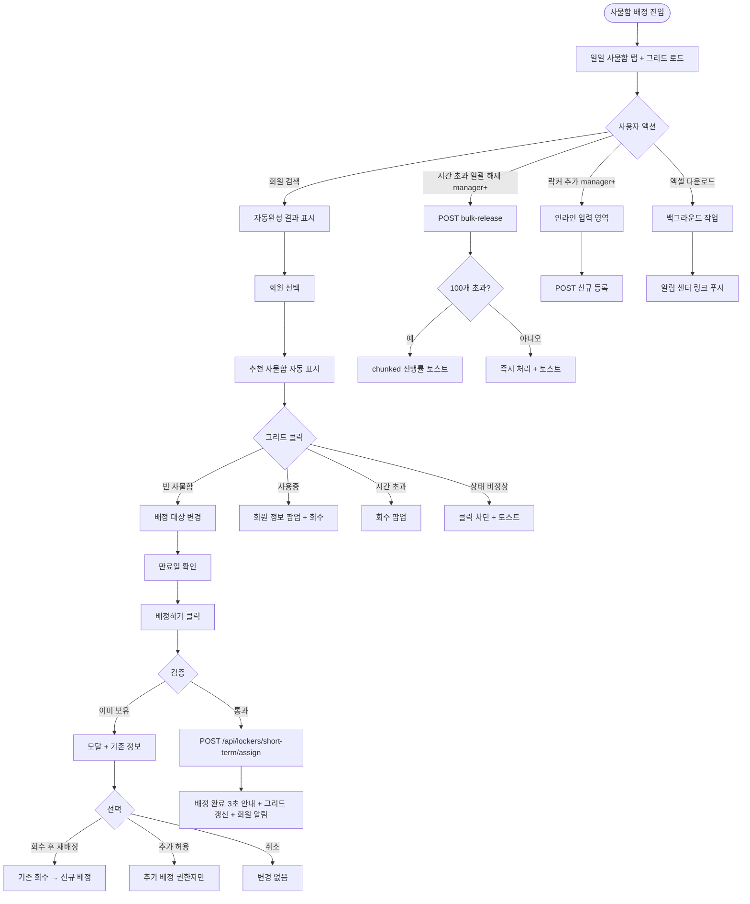
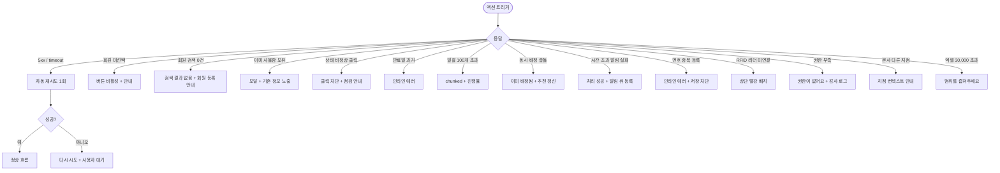

# SCR-051 사물함 배정 관리 페이지

## 1. 화면 메타 정보

이 문서는 사물함 배정 관리 페이지에 대한 자기완결형 요구사항 정의서입니다. 다른 문서를 함께 보지 않아도 이 문서 한 장만으로 이 화면에 들어가는 모든 영역, 모든 버튼, 모든 권한, 모든 예외 처리, 그리고 운영 정책까지 전부 이해하고 구현할 수 있도록 작성합니다.

| 항목 | 값 |
|---|---|
| 작성일 | 2026-05-22 |
| 버전 | v1.0 |
| 상태 | 최신 통합본 반영 (정합화 완료) |
| 도메인 | D06 시설관리 |
| 화면 ID | SCR-051 |
| 화면명 | 사물함 배정 관리 |
| 화면 유형 | 운영 화면 (Operational Screen) |
| 라우트 (URL) | `/locker/management` |
| 플랫폼 | 데스크톱(기본), 태블릿 |
| 우선순위 | P0 (출시 필수) |
| 기능코드 | FAC-02 (사물함 배정 관리) |
| 계약코드 | FAC-02, FAC-02-01 ~ FAC-02-08 |
| 계약 상태 | 계약 범위 본기능 |
| 부모 기능 prefix | FAC |
| Lv1 코드 | FAC-02 |
| Lv2 / Lv3 세분화 | FAC-02-01 ~ FAC-02-08 (현황 요약, 유형 탭, 회원 배정 패널, 사물함 그리드, 배정 처리, 일괄 해제, 사물함 추가, 엑셀 다운로드) |
| 연계 화면 | SCR-050 락커 관리, SCR-052 밴드/카드 관리, SCR-054 골프 타석 관리, SCR-M004 회원 상세, SCR-097 감사 로그 |
| 호출 다이얼로그 | 본 화면 직접 호출 다이얼로그 없음 (인라인 패널 + 그리드 클릭으로 처리) |

## 2. 화면 개요와 목적

사물함 배정 관리 페이지는 센터 내 일일 사물함 · 개인 사물함 · 골프 사물함의 실시간 이용 현황을 시각적 그리드로 보여주고, 회원을 검색해 빈 사물함에 즉시 배정하는 화면입니다. SCR-050 락커 관리가 장기 배정 운영에 초점을 맞춘다면, 본 화면은 당일 또는 단기 보관용 사물함의 빠른 배정 · 해제에 최적화되어 있습니다.

이 화면이 다루는 운영 흐름은 회원이 입장하는 순간부터 시작됩니다. 프런트는 회원이 카운터에 도착하면 회원 검색 자동완성으로 회원을 선택하고, 추천 사물함이 자동 표시되거나 그리드에서 원하는 빈 사물함을 직접 클릭한 다음 [배정하기]를 1초 안에 처리합니다. 매니저는 매일 22시 마감 시간이 지나면 시간 초과(overtime) 상태로 깜빡이는 사물함을 일괄 해제로 한 번에 회수하고, 다음 날 운영을 위한 준비를 합니다. 골프 회원에게는 일반 사물함과 별도로 골프 사물함을 분리 배정하며, 잠금 불량 사물함은 점검 등록(SCR-056) 후 클릭 차단 상태로 유지됩니다.

따라서 이 화면은 빠른 회전과 시각적 상태 인지가 가장 중요하며, 시간 초과 깜빡임 · 상태 비정상 표시 · 추천 사물함 자동 갱신 같은 실시간 요소가 핵심입니다.

## 3. 진입 경로와 인접 화면

사물함 배정 관리 페이지에 진입하는 경로는 다음과 같습니다.

첫 번째 경로는 사이드바입니다. "시설 관리 > 사물함 배정 관리" 메뉴를 클릭하면 `/locker/management`로 진입합니다. 기본 상태는 일일 사물함 탭이 선택되어 있고, 검색·필터는 모두 초기 상태입니다.

두 번째 경로는 대시보드의 시설 카드 클릭입니다. 시간 초과 사물함 수가 대시보드 카드로 노출되어 있어 클릭 시 시간 초과 필터가 자동 적용된 상태로 진입합니다.

세 번째 경로는 SCR-050 락커 관리에서의 연계 이동입니다. 락커 관리 화면 우측 탭 영역에서 "사물함 배정"으로 빠르게 전환됩니다.

네 번째 경로는 알림 센터의 시간 초과 일괄 해제 알림입니다. 22시 자동 만료 배치가 일정 수 이상 회수한 경우 운영자에게 알림이 발송되고, 알림 클릭 시 본 화면으로 진입합니다.

이 화면에서 빠져나가는 인접 화면으로는, 그리드 클릭 후 우측 회원 검색에서 회원명을 선택할 때 진입하는 회원 상세(SCR-M004), 골프 사물함 탭에서 골프 타석 관리(SCR-054)로의 이동, 잠금 불량 사물함에서 장비 점검(SCR-056)으로의 점검 등록, 그리고 모든 배정 · 해제 · 일괄 작업이 기록되는 감사 로그(SCR-097)가 있습니다.

## 4. 레이아웃과 UI 구성

사물함 배정 관리 페이지는 위에서 아래로 쌓이는 세로형 단일 컬럼 레이아웃을 기본으로 합니다.

가장 위에는 페이지 헤더가 있습니다. 헤더 좌측에는 "사물함 배정 관리"라는 페이지 타이틀과 함께 지점 컨텍스트 배지가 따라옵니다. 본사 통합 모드에서는 지점 전환 드롭다운이 표시됩니다. 헤더 우측 끝에는 "락커 추가" 버튼(권한 manager 이상)과 "엑셀 다운로드" 버튼이 배치됩니다.

페이지 헤더 바로 아래에는 현황 요약 카드 5개가 가로로 배치됩니다. 첫 번째 카드는 "총 사물함 수"로 등록된 모든 사물함의 합계를 보여주고, 두 번째 카드는 "사용 가능"으로 status=available 사물함의 수, 세 번째 카드는 "사용중"으로 status=in_use, 네 번째 카드는 "시간 초과"로 status=overtime(주황 배지), 다섯 번째 카드는 "상태 비정상"으로 status=error(빨강 배지)를 표시합니다. 카드 자체는 통계 표시용이며 클릭 시 해당 상태 필터로 자동 이동합니다.

요약 카드 아래에는 사물함 유형 탭이 있습니다. 일일 사물함 · 개인 사물함 · 골프 사물함의 3개 탭이며, 각 탭 우측에 현재 사물함 수가 작은 배지로 표시됩니다. 센터가 골프를 운영하지 않으면 골프 사물함 탭이 숨겨집니다. 탭이 바뀌면 그리드가 새로 fetch되며 추천 사물함이 다시 계산됩니다.

탭 영역 바로 아래에는 회원 배정 패널이 있습니다. 이 패널이 본 화면의 핵심 운영 컴포넌트입니다. 좌측에는 회원 검색 자동완성 입력란이 있고, 회원명 · 회원 번호 · 연락처를 동시에 OR 조건으로 검색합니다. 디바운스 300ms가 적용되고 최소 2자 이상 입력 시 검색이 시작됩니다. 회원이 선택되면 이름과 회원 번호가 표시되고, 그 우측에는 추천 사물함 영역이 표시됩니다. 추천 사물함은 사용 가능한 사물함 중 번호가 가장 작은 것이 자동으로 표시되며, 운영자가 그리드에서 다른 빈 사물함을 직접 클릭하면 추천이 갱신됩니다(수동 우선). 그 우측에는 만료일 입력 필드가 있고 기본값은 일일/골프 사물함은 당일 22:00, 개인 사물함은 오늘로부터 3개월 후로 자동 채워집니다. 가장 우측에는 [배정하기] 버튼이 있어서 회원 · 사물함 · 만료일이 모두 준비된 경우에만 활성화됩니다.

배정 패널 우측 끝에는 "만료 사물함 일괄 해제" 버튼이 있습니다. 시간 초과 사물함이 한 개 이상 있을 때만 활성화되며, 누르면 즉시 해당 사물함들이 일괄 해제 확인 흐름으로 진입합니다.

본문 중앙에는 사물함 그리드가 표시됩니다. 현재 선택된 유형 탭의 모든 사물함이 격자로 표시되며, 사물함 번호 + 상태 색상으로 즉시 인지 가능합니다. 빈 사물함은 회색이고 클릭 시 배정 대상으로 선택되어 추천 영역이 갱신됩니다. 사용중 사물함은 파랑이고 클릭 시 회원명 · 만료일 · 회수 버튼이 팝업으로 표시됩니다. 시간 초과 사물함은 주황 + 깜빡임 효과로 표시되어 즉시 인지되고, 호버 시 [회수] 버튼이 노출됩니다. 상태 비정상 사물함은 빨강 + X 아이콘으로 표시되며 클릭이 차단됩니다. 그리드 색상 우선순위는 error > overtime > in_use > available 순서입니다.

배정 성공 시 그리드 상단에 "배정 완료!" 안내 메시지가 3초간 표시된 후 자동으로 사라집니다. 시간 초과 알림은 1분 주기 폴링으로 자동 갱신되며 만료 시점 경과 사물함이 자동으로 깜빡이기 시작합니다.

## 5. 탭 구성과 탭별 동작

이 화면은 사물함 유형 탭이 1단계 분기로 작동합니다. 일일 사물함 · 개인 사물함 · 골프 사물함의 3개 탭이며, 어느 탭을 선택하느냐에 따라 표시되는 사물함 집합과 만료일 기본값이 달라집니다.

일일 사물함 탭은 당일 22시 자동 만료가 적용되는 회전 사물함으로, 만료일 기본값이 당일 22:00으로 자동 설정됩니다. 일일 사물함은 회원이 매일 입장 시 새로 배정받는 형태로 운영됩니다.

개인 사물함 탭은 장기 보관형 사물함으로, 만료일 기본값이 오늘 + 3개월로 설정되며 운영자가 운영 정책에 맞춰 변경할 수 있습니다.

골프 사물함 탭은 골프 타석 이용자에게 별도로 배정되는 사물함으로, 만료일 기본값이 당일 22:00이며 골프 타석 운영(SCR-054)과 연계됩니다. 골프를 운영하지 않는 센터에서는 이 탭이 숨겨집니다.

탭 간 전환 시 회원 선택은 유지되지만 추천 사물함은 현재 탭의 사용 가능 사물함 중에서 다시 계산됩니다. URL 쿼리 파라미터 `type`으로 탭이 반영되어 새로고침이나 북마크로 다시 진입해도 같은 탭이 유지됩니다.

사물함 번호는 같은 유형 탭 내에서만 고유하며, 다른 탭 간 중복이 허용됩니다. 예를 들어 일일 1번 사물함과 골프 1번 사물함이 공존할 수 있습니다.

## 6. 버튼·아이콘·링크 액션 전체 정의

현황 요약 카드 5개는 클릭 시 해당 상태 필터가 자동 적용됩니다. 시간 초과 카드를 누르면 그리드가 시간 초과 사물함만 표시되도록 필터링됩니다. 상태 비정상 카드를 누르면 빨강 배지 사물함만 표시됩니다.

유형 탭 클릭은 탭 전환과 추천 갱신을 동시에 수행합니다.

회원 검색 자동완성은 입력 시 디바운스 300ms 후 결과가 표시됩니다. 검색 결과 0건이면 "검색 결과가 없어요" 안내가 표시되고 회원 등록 화면 진입 링크가 함께 노출됩니다.

추천 사물함 영역은 클릭 가능하며, 클릭 시 해당 사물함이 배정 대상으로 확정됩니다. 운영자가 그리드에서 다른 사물함을 클릭하면 추천 영역의 값이 갱신됩니다.

만료일 입력은 날짜 선택기로 변경 가능하며, 과거 일자를 입력하면 인라인 에러 "과거 일자로 배정할 수 없습니다"가 표시되어 저장이 차단됩니다.

[배정하기] 버튼은 회원 · 사물함 · 만료일이 모두 준비된 경우에만 활성화됩니다. 클릭 시 검증이 진행되어 동일 회원의 동일 유형 사물함 이미 보유 여부, 만료일 유효성, 사물함 상태가 확인되고 통과하면 단건 트랜잭션으로 저장됩니다. 저장 성공 시 그리드 상단에 "배정 완료!" 안내가 3초간 표시되고, 그리드가 갱신되며, 회원에게 NFR-19 알림이 발송됩니다.

만료 사물함 일괄 해제 버튼은 시간 초과 사물함이 한 개 이상 있을 때만 활성화됩니다. 클릭 시 시간 초과 사물함이 모두 해제되며, 100개를 초과하는 경우 chunked 백그라운드 처리로 전환되고 진행률 토스트가 표시됩니다. 매니저 이상 권한자만 사용 가능합니다.

락커 추가 버튼은 매니저 이상 권한자에게만 노출되며, 클릭 시 새 사물함을 등록할 수 있는 인라인 입력 영역이 표시됩니다. 번호는 현재 탭의 가장 큰 번호 + 1로 자동 부여되거나 운영자가 직접 수정할 수 있습니다. 동일 번호가 같은 탭 내에 이미 존재하면 인라인 에러가 표시되어 저장이 차단됩니다.

엑셀 다운로드 버튼은 현재 탭과 적용된 검색·필터 결과를 그대로 다운로드합니다. 파일명은 `사물함현황_지점_탭_YYYYMMDD.xlsx` 규칙을 따릅니다. 30,000행을 초과하면 "범위를 좁혀주세요" 에러가 반환됩니다. 권한 없는 계정에서는 버튼이 표시되지 않습니다.

그리드의 사물함 셀 클릭 동작은 셀 상태에 따라 다릅니다. 빈 사물함 클릭 시 해당 사물함이 배정 대상으로 선택되며 추천 영역에 표시됩니다. 사용중 사물함 클릭 시 회원명 · 만료일 · 회수 버튼이 작은 팝업으로 표시되며, 회수 버튼 클릭 시 즉시 해제됩니다. 시간 초과 사물함 클릭 시 회원 정보와 [회수] 버튼이 표시됩니다. 상태 비정상 사물함 클릭은 차단되며 "상태 비정상 사물함은 배정할 수 없습니다. 점검 후 사용하세요"라는 토스트가 표시됩니다.

모든 버튼은 클릭 후 응답이 돌아오기 전까지 자동 비활성화되어 중복 요청이 차단됩니다.

## 7. 호출되는 모달 동작

본 화면은 별도의 다이얼로그 컴포넌트를 호출하지 않고, 인라인 패널과 작은 팝업으로 모든 액션을 처리합니다. 사용중 사물함 클릭 시 표시되는 작은 회수 팝업은 모달이 아닌 셀 위에 떠 있는 컨텍스트 메뉴 형태로, 회원명 · 만료일 · 사용 시작 시각 · [회수] 버튼이 표시됩니다.

만료 사물함 일괄 해제 시에는 별도의 확인 다이얼로그 없이 바로 처리되지만, 100개 초과 시에는 chunked 처리 진행률 토스트가 화면 하단에 고정 표시되어 진행 상황을 안내합니다.

락커 추가 시에는 인라인 입력 영역이 헤더 아래에 펼쳐지며, 번호 · 메모를 입력하고 저장 버튼을 누르면 즉시 그리드에 추가됩니다. 입력 영역은 X 버튼으로 닫을 수 있습니다.

이미 사물함 보유 회원에 추가 배정 시도 시에는 모달이 표시됩니다. 모달에는 "해당 회원에게 이미 사물함이 배정되어 있습니다"라는 안내와 기존 사물함 번호 · 유형 · 만료일이 노출되며, 운영자는 [기존 회수 후 재배정] / [추가 허용(권한자만)] / [취소] 중에서 선택합니다. 정책이 1개 제한인 테넌트에서 추가 허용은 슈퍼관리자·Owner(지점장)만 가능합니다.

## 8. 토스트와 확인 팝업과 알럿

성공 토스트는 그리드 상단에 녹색 계열로 3초간 표시됩니다. "배정 완료!", "사물함이 해제되었습니다", "N개 사물함이 일괄 해제되었습니다", "사물함이 추가되었습니다", "엑셀 다운로드가 시작되었어요"와 같은 짧은 문구입니다.

실패 토스트는 우측 상단에 빨강 계열로 표시되며, "배정에 실패했습니다", "회원을 먼저 선택해주세요", "상태 비정상 사물함은 배정 불가", "과거 일자로 배정할 수 없습니다", "동일 번호가 이미 존재합니다", "다른 운영자가 이미 배정했어요", "권한이 없어요" 같은 문구가 표시됩니다.

확인 팝업은 별도의 다이얼로그 형태가 아닌 짧은 안내성 토스트로 처리됩니다. 시간 초과 상태가 갱신될 때마다 화면 어디서나 운영자가 인지할 수 있도록 깜빡임 효과로 표시합니다.

알럿은 시스템 메시지로, 권한 없는 계정 직접 URL 접근 시 페이지 본문이 가려지고 대시보드 자동 이동 안내가 표시됩니다. RFID 리더 미연결 같은 외부 장치 이슈가 발생하면 화면 상단에 빨강 배지로 "리더 장치 확인 필요"가 표시됩니다.

## 9. 데이터 흐름과 외부 연동

화면 진입 시점에 `GET /api/lockers/short-term`이 호출되며 요청에는 현재 탭(type=daily/personal/golf), 검색어, 필터가 들어갑니다. 응답으로는 사물함 배열과 5개 요약 카드 카운트가 함께 내려옵니다.

추천 사물함 갱신은 별도 엔드포인트 `GET /api/lockers/short-term/recommended`로 처리되며 5초 주기 폴링 또는 이벤트 기반으로 갱신됩니다. 사용 가능한 사물함 중 번호가 가장 작은 것이 자동 추천됩니다.

배정 처리는 단건 트랜잭션 `POST /api/lockers/short-term/assign`로 처리되며, 락커 ID + 회원 ID + 만료일이 전송됩니다. 응답으로는 갱신된 사물함 상태가 반환됩니다. 해제는 `POST /api/lockers/short-term/release`, 일괄 해제는 `POST /api/lockers/short-term/bulk-release`로 처리됩니다. 일괄 해제 100개 초과는 chunked 처리로 분리되어 진행률이 응답으로 스트리밍됩니다.

사물함 추가는 `POST /api/lockers/short-term`로 처리되며, 매니저 이상 권한이 필요합니다.

엑셀 다운로드는 `GET /api/lockers/short-term/export`로 처리되며 백그라운드 작업으로 분리됩니다.

일일 사물함 22:00 자동 만료 배치는 매일 22:00에 실행되어 일일 사물함 + 골프 사물함을 overtime 상태로 갱신하고, 정책이 활성화된 테넌트에서는 자동 회수까지 수행하며 회원에게 알림을 발송합니다.

시간 초과 자동 갱신 배치는 1분 주기로 실행되어 만료 시점이 경과한 사물함을 overtime 상태로 갱신하고 그리드에 깜빡임 효과를 표시합니다.

회원 탈퇴 · 이관 · 삭제 이벤트 시 보유 사물함이 자동 회수됩니다.

모든 배정 · 해제 · 일괄 · 추가 처리는 감사 로그(SCR-097)에 `actor_id`, `locker_id`, `member_id`, `before`, `after` 형태로 비동기 INSERT됩니다.

사물함 KPI 배치는 매주 월요일 04:00에 실행되어 탭별 사용률 · 평균 보유 시간 · 시간 초과율을 집계합니다.

## 10. 화면 상태와 예외 처리

로딩 중 상태에서는 그리드와 요약 카드 자리에 스켈레톤이 표시됩니다.

정상 상태는 사물함이 있는 경우 그리드가 정상 렌더링되는 상태입니다.

배정 성공 상태는 [배정하기] 클릭 후 3초간 그리드 상단에 "배정 완료!" 안내가 표시되는 상태로, 3초 후 자동으로 사라집니다.

시간 초과 사물함 상태는 만료 시점이 경과한 사물함이 주황 + 깜빡임으로 표시되는 상태입니다. 1분 주기 폴링으로 자동 갱신됩니다.

상태 비정상 사물함 상태는 잠금 불량 등으로 사용 불가한 사물함이 빨강 X 아이콘으로 표시되며 클릭이 차단된 상태입니다. 점검 등록(SCR-056) 후에만 정상 전환됩니다.

사용 가능 사물함 없음 상태는 현재 탭에 빈 사물함이 한 개도 없을 때 추천 영역에 "사용 가능한 사물함 없음"이 표시되고 [배정하기] 버튼이 비활성화됩니다.

오류 상태는 5xx 또는 timeout 시 표시되며 자동 재시도 1회 후 사용자 액션을 기다립니다.

예외 케이스별 처리는 다음과 같습니다.

회원 검색 0건 시 "검색 결과가 없어요" 안내가 표시됩니다.

회원 미선택 상태에서 [배정하기] 클릭 시 버튼이 비활성화 상태이며 "회원을 먼저 선택해주세요"라는 인라인 안내가 표시됩니다.

이미 사물함 보유 회원 추가 배정 시도 시 모달이 표시되며 기존 사물함 정보 노출 + 운영자 선택지가 제공됩니다.

상태 비정상 사물함 클릭은 차단되며 점검 안내 토스트가 표시됩니다.

만료일 과거 입력 시 인라인 에러로 저장이 차단됩니다.

일괄 해제 시 시간 초과 0개이면 버튼이 비활성화되거나 "해제 대상 없음" 안내가 표시됩니다.

탭 전환 중 회원 선택 유지: 회원 선택은 유지되지만 추천 사물함이 탭별로 재계산됩니다.

동시 배정 충돌 시 락 충돌이 감지되어 "선택한 사물함이 이미 배정되었습니다" 안내가 표시되며 추천이 갱신됩니다.

시간 초과 회원이 직접 회수 신청 시 자동 회수 + 알림 발송되며 운영자 그리드에서 깜빡임이 제거됩니다.

본사 통합 모드 다른 지점 사물함 변경 시도 시 지점 컨텍스트 미일치로 차단됩니다.

사물함 번호 중복 등록 시 인라인 에러로 저장이 차단됩니다.

자동완성 응답 지연 시 스피너가 표시되고 타임아웃 시 재시도가 안내됩니다.

시간 초과 알림 발송 실패는 사물함 처리는 성공으로 처리되고 알림 재시도 큐에 등록됩니다.

엑셀 다운로드 30,000행 초과 시 차단됩니다.

## 11. 권한별 처리

슈퍼관리자 · 본사 최고관리자 · Owner(지점장) · 매니저는 전체 탭 현황을 조회하고 배정 · 해제 · 일괄 해제 · 사물함 추가 · 엑셀 다운로드 모든 기능을 사용할 수 있습니다. 본사 권한자는 지점 전환 드롭다운으로 통합 모드 운영도 가능합니다.

FC · 스태프 · 프런트는 전체 탭 현황을 조회하고 배정 · 해제를 수행할 수 있습니다. 사물함 추가 · 일괄 해제 · 엑셀 다운로드는 불가능하므로 헤더의 해당 버튼이 노출되지 않습니다.

트레이너 · 읽기 전용은 현황 조회만 가능하며 그리드 클릭 시 사물함 정보만 표시되고 액션 버튼은 노출되지 않습니다. [배정하기] 버튼도 비활성 상태입니다.

권한 외에 운영 모드에 따라 골프 사물함 탭이 보이거나 숨겨집니다. 골프를 운영하지 않는 센터에서는 골프 탭이 자동으로 숨겨집니다.

권한 부족 시 단계별 차단: 사이드바에서 메뉴가 보이지 않거나, 화면 내부 버튼이 숨겨지거나, 직접 URL 접근 시 백엔드 403으로 차단됩니다. 모든 권한 차단 이벤트는 감사 로그에 기록됩니다.

## 12. 메인 흐름

## 13. 에러와 예외 흐름

## 14. 핵심 디자인 요청사항

사물함 그리드는 시각적 상태 인지가 가장 중요합니다. 셀 하나만 봐도 사용 가능 여부가 즉시 읽혀야 하며, 색상은 회색(빈) · 파랑(사용중) · 주황+깜빡임(시간 초과) · 빨강+X(상태 비정상)로 강하게 분리됩니다. 색상 우선순위(error > overtime > in_use > available)에 따라 한 셀에 여러 상태가 겹쳐도 가장 높은 우선순위만 표시됩니다.

시간 초과 사물함의 깜빡임 효과는 운영자가 화면을 잠깐 비웠다가 돌아와도 즉시 인지할 수 있을 정도로 명확해야 합니다. 다만 화면 전체를 산만하게 만들지 않도록 깜빡임 주기는 적절히 조절되어야 합니다.

상태 비정상 사물함은 클릭 자체가 차단된다는 점이 시각적으로 명확해야 합니다. X 아이콘 + 빨강 + 호버 시 커서 변화(not-allowed)로 운영자가 클릭을 시도하지 않게 유도합니다.

회원 배정 패널은 화면 상단의 가장 중요한 컴포넌트이므로 다른 영역보다 시각적으로 우선되어야 합니다. 회원 검색 자동완성, 추천 사물함, 만료일, [배정하기] 버튼이 한 줄에 깔끔하게 배치되어 운영자가 1초 안에 처리할 수 있게 합니다.

추천 사물함 영역은 회원이 선택되기 전에는 빈 상태로 표시되며, 회원이 선택되면 추천이 자동 채워지고, 운영자가 그리드에서 다른 사물함을 클릭하면 추천이 갱신되는 흐름이 부드럽게 시각화되어야 합니다.

배정 성공 안내 메시지는 3초간 그리드 상단에 표시된 후 자동으로 사라지며, 페이드 인/아웃이 부드럽게 일어나야 합니다.

골프 사물함 탭이 운영되지 않는 센터에서는 탭 자체가 보이지 않아야 하며, 일일/개인 탭만 표시될 때도 균형 있게 배치되어야 합니다.

엑셀 다운로드 진행 상태는 우측 상단 알림 영역에 작은 배지로 표시되며, 운영자가 페이지를 떠나도 작업이 계속 진행됨을 알 수 있어야 합니다.

## 15. 운영 정책 (이 화면에 연결된 부분)

사물함은 3가지 유형으로 분리 운영됩니다. 일일 사물함은 매일 22시 자동 만료로 회전 운영되며, 개인 사물함은 3개월 단위 장기 보관, 골프 사물함은 골프 타석 이용자에게 별도 배정됩니다. 각 유형의 만료일 기본값(일일=당일 22:00, 개인=오늘+3개월, 골프=당일 22:00)은 테넌트 정책에 따라 변경 가능합니다.

추천 사물함은 사용 가능 사물함 중 번호가 가장 작은 것이 자동 표시됩니다. 운영자가 그리드에서 다른 빈 사물함을 클릭하면 추천 영역이 갱신되어 수동 선택이 우선됩니다. 추천 사물함 캐싱은 5초 주기 폴링 또는 이벤트로 갱신됩니다.

시간 초과(overtime) 상태는 만료 시점 경과 후 1분 이내 자동 갱신되어 그리드에 깜빡임으로 표시됩니다. 시간 초과 자동 알림은 만료 시각 도달 시 회원에게 푸시 + 회수 안내 메시지가 발송됩니다.

상태 비정상(error) 사물함은 클릭 배정 차단이 적용되며, 점검 등록(SCR-056) 후에만 정상 전환 가능합니다.

회원 1명당 사물함 보유 수 정책은 유형별로 1개가 기본입니다(일일 1 / 개인 1 / 골프 1). 정책 위반 시 모달이 표시되고 [회수 후 재배정] / [추가 허용 권한자만] / [취소] 선택지가 제공됩니다. 추가 허용은 슈퍼관리자·Owner(지점장)에 한정됩니다.

일괄 해제는 한 번에 최대 100개까지 처리되며, 그 이상은 chunked 백그라운드 처리로 분리되고 진행률 토스트가 표시됩니다.

사물함 추가는 매니저 이상 권한이며, 번호 자동 부여(현재 탭 가장 큰 번호 + 1) 또는 수동 지정이 가능합니다. 사물함 번호는 같은 유형 탭 내 고유이며 다른 탭 간 중복이 허용됩니다.

권한별 가시성은 다음과 같이 분리됩니다. 슈퍼관리자 · Owner(지점장) · 매니저는 모든 작업이 가능합니다. FC · 스태프 · 프런트는 배정 · 해제만 가능합니다. 트레이너 · 읽기 전용은 조회만 가능합니다.

본사 통합 모드는 지점별 사물함이 분리 운영되며, 지점 컨텍스트 일치 시에만 변경 가능합니다. 본사 슈퍼관리자는 지점 전환 드롭다운으로 통합 운영이 가능합니다.

엑셀 다운로드는 현재 탭과 검색 필터를 적용한 결과를 다운로드하며, 파일명 규칙은 `사물함현황_지점_탭_YYYYMMDD.xlsx`입니다. 30,000행 초과 시 차단됩니다.

모든 배정 · 해제 · 일괄 · 추가 처리는 감사 로그(SCR-097)에 actor · locker_id · member_id · before-after 형태로 기록되며 비동기 INSERT로 5초 안에 보장됩니다.

KPI 측정 기준은 탭별 사용률 · 평균 보유 시간 · 시간 초과율로 매주 월요일 04:00 배치 집계됩니다.

검색 디바운스 300ms, 최소 2자 입력 제한은 검색 부하 분산 정책입니다.

이상의 모든 정책은 이 화면을 구현하고 운영하는 사람이 별도 문서 없이 이 한 장만 보면 이해할 수 있도록 풀어 적었습니다. 정책이 바뀌면 이 문서가 함께 갱신되어야 합니다.
