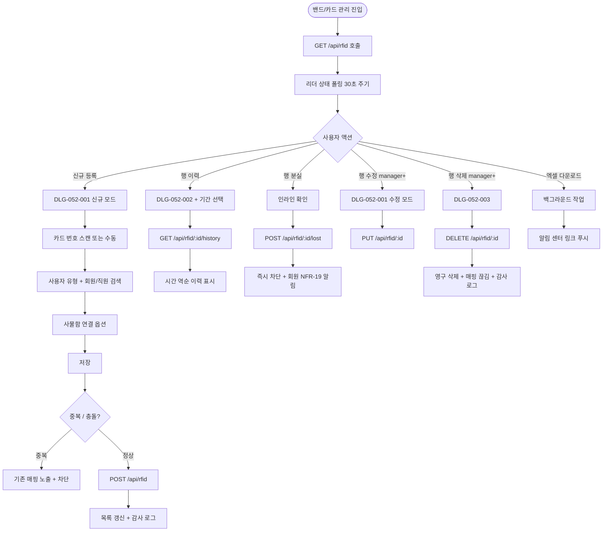
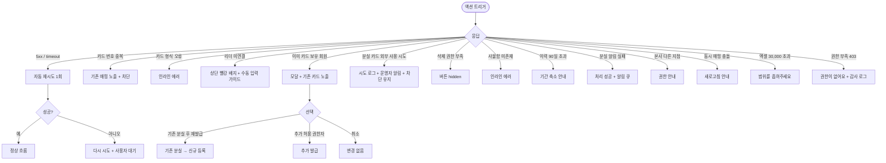

# SCR-052 밴드/카드 관리 페이지

## 1. 화면 메타 정보

이 문서는 밴드/카드 관리 페이지에 대한 자기완결형 요구사항 정의서입니다. 다른 문서를 함께 보지 않아도 이 문서 한 장만으로 이 화면에 들어가는 모든 영역, 모든 버튼, 모든 모달, 모든 권한, 모든 예외 처리, 그리고 운영 정책까지 전부 이해하고 구현할 수 있도록 작성합니다.

| 항목 | 값 |
|---|---|
| 작성일 | 2026-05-22 |
| 버전 | v1.0 |
| 상태 | 최신 통합본 반영 (정합화 완료) |
| 도메인 | D06 시설관리 |
| 화면 ID | SCR-052 |
| 화면명 | 밴드/카드 관리 |
| 화면 유형 | 운영 화면 (Operational Screen) |
| 라우트 (URL) | `/rfid` |
| 플랫폼 | 데스크톱(기본), 태블릿 |
| 우선순위 | P0 (출시 필수) |
| 기능코드 | FAC-03 (RFID 밴드/카드 관리) |
| 계약코드 | FAC-03, FAC-03-01 ~ FAC-03-08 |
| 계약 상태 | 계약 범위 본기능 |
| 부모 기능 prefix | FAC |
| Lv1 코드 | FAC-03 |
| Lv2 / Lv3 세분화 | FAC-03-01 ~ FAC-03-08 (현황 요약, 검색/필터, 카드 목록, 신규 등록, 수정, 분실 처리, 이력 조회, 삭제) |
| 연계 화면 | SCR-050 락커 관리, SCR-051 사물함 배정, SCR-M004 회원 상세, STF-02 직원 상세, SCR-097 감사 로그, KIO-204 신발장 밴드 |
| 호출 다이얼로그 | DLG-052-001 RFID 등록/수정, DLG-052-002 RFID 이력 조회, DLG-052-003 RFID 삭제 확인 |

## 2. 화면 개요와 목적

밴드/카드 관리 페이지는 센터에서 사용하는 RFID 밴드와 카드를 등록 · 관리하고 회원 또는 직원과 연결하는 화면입니다. 회원이 락커 · 출입문 · 시설을 이용할 때 사용하는 RF 장치의 전체 발급 현황을 한 화면에서 관리하며, 분실 신고 · 교체 · 삭제 처리를 수행합니다. 카드 사용 이력 추적은 보안 사고 발생 시 운영자가 즉시 대응할 수 있도록 90일 이상 보관됩니다.

이 화면이 다루는 운영 흐름은 신규 회원이 등록된 직후 카드를 발급하는 것부터, 회원 분실 신고를 받아 즉시 사용 차단하는 일, 직원 출입 카드 발급, 손상된 카드의 교체 처리, 보안 사고 대응을 위한 이력 조회, 퇴직 직원 카드 회수까지 다양합니다. 본사 슈퍼관리자는 통합 모드에서 전 지점 카드를 한 번에 조회할 수 있고, 신발장 밴드(KIO-204)와 매핑되는 옷락커 번호는 카드 자산 운영과 동시에 락커 운영(SCR-050)과 결합됩니다.

따라서 이 화면은 카드 자체 상태(활성/분실/해제)와 회원 매핑 상태를 분리해서 관리하며, 분실 처리된 카드의 외부 사용 시도까지 추적 가능한 보안 중심 운영 화면입니다.

## 3. 진입 경로와 인접 화면

밴드/카드 관리 페이지에 진입하는 경로는 다음과 같습니다.

첫 번째 경로는 사이드바입니다. "시설 관리 > 밴드/카드 관리" 메뉴를 클릭하면 `/rfid`로 진입합니다. 기본 상태는 전체 카드 목록이 등록일 역순으로 표시됩니다.

두 번째 경로는 회원 상세(SCR-M004)에서의 연계 이동입니다. 회원 상세의 카드 영역에서 "카드 관리로 이동" 링크를 누르면 해당 회원의 카드만 검색된 상태로 진입합니다.

세 번째 경로는 직원 상세(STF-02)에서의 연계 이동입니다. 직원 카드 발급 또는 회수를 위해 직원 상세에서 진입할 수 있습니다.

네 번째 경로는 알림 센터의 분실 카드 외부 사용 시도 알림입니다. 분실 처리된 카드가 출입문 · 락커에서 사용 시도되면 운영자에게 알림이 발송되고, 알림 클릭 시 본 화면의 해당 카드가 검색된 상태로 진입합니다.

이 화면에서 빠져나가는 인접 화면으로는 회원명 클릭 시 진입하는 회원 상세(SCR-M004), 직원명 클릭 시 진입하는 직원 상세(STF-02), 연결 사물함 클릭 시 진입하는 SCR-050 락커 관리 또는 SCR-051 사물함 배정 관리, 그리고 모든 등록 · 분실 · 삭제 · 이력 조회 이벤트가 기록되는 감사 로그(SCR-097)가 있습니다.

## 4. 레이아웃과 UI 구성

밴드/카드 관리 페이지는 세로형 단일 컬럼 레이아웃을 기본으로 합니다.

가장 위에는 페이지 헤더가 있습니다. 헤더 좌측에는 "밴드/카드 관리" 타이틀과 지점 컨텍스트 배지, 그리고 RFID 리더 연결 상태 배지가 표시됩니다. 리더가 정상 연결되어 있으면 녹색 배지로 "리더 연결됨"이 표시되고, 미연결 시 빨강 배지로 "리더 장치 확인 필요"가 표시되어 운영자가 즉시 인지할 수 있습니다. 헤더 우측에는 "신규 등록" 버튼(권한 staff 이상)과 "엑셀 다운로드" 버튼이 배치됩니다.

페이지 헤더 바로 아래에는 현황 요약 카드 3개가 가로로 배치됩니다. 첫 번째 카드는 "전체 카드 수"로 등록된 모든 카드의 합계, 두 번째 카드는 "활성(사용중)"으로 status=active 카드의 수, 세 번째 카드는 "미사용 · 해제 · 분실 합계"로 비활성 카드의 수를 표시합니다. 카드 클릭 시 해당 상태 필터로 자동 이동합니다.

요약 카드 아래에는 검색 및 상태 필터 바가 있습니다. 좌측에는 통합 검색창이 있고 카드 번호 정확 매치 또는 회원명 부분 매치로 검색합니다. 디바운스 300ms가 적용되며 최소 2자 이상 입력 시 검색이 시작됩니다. 검색창 우측에는 상태 필터 드롭다운(전체/활성/분실/해제)이 있고, 변경 시 즉시 결과가 갱신되며 URL 쿼리 파라미터로 반영됩니다.

본문 중앙에는 카드 목록 테이블이 표시됩니다. 컬럼은 좌측부터 순번 / 등록일 / 카드 번호 / 연결 회원명 / 연락처 / 사용자 유형(회원/직원) / 상태 배지 / 배정일 / 연결 사물함 / 액션 순서로 배치됩니다. 회원명 클릭은 회원 상세(SCR-M004)로 이동하고, 직원명 클릭은 직원 상세(STF-02)로 이동합니다. 연결 사물함 번호 클릭은 락커 관리 또는 사물함 배정 관리로 이동합니다. 본사 통합 모드에서는 "소속 지점" 컬럼이 자동 추가됩니다.

상태 배지는 색상으로 분리됩니다. 활성은 초록색, 분실은 빨강색, 해제는 회색입니다. 분실 카드는 시각적으로 강조되어 운영자가 즉시 위험 카드를 인지할 수 있게 합니다.

각 행의 액션 컬럼에는 [이력] · [분실 처리] · [수정] · [삭제] 버튼이 있습니다. [이력] 버튼은 DLG-052-002 이력 조회 다이얼로그를 호출합니다. [분실 처리] 버튼은 인라인 확인 후 즉시 분실 상태로 변경합니다. [수정] 버튼은 DLG-052-001 RFID 등록/수정 다이얼로그를 호출하며 카드 정보가 미리 채워진 상태로 열립니다. [삭제] 버튼은 DLG-052-003 RFID 삭제 확인 다이얼로그를 호출합니다.

테이블 아래에는 페이지네이션이 있습니다. 페이지당 표시 건수(20·50·100), 페이지 이동 컨트롤, 총 건수 표시가 있습니다.

## 5. 탭 구성과 탭별 동작

본 화면은 별도의 탭 분리가 없으며 상태 필터 드롭다운(전체/활성/분실/해제)이 탭 역할을 대신합니다. 상태 필터 변경 시 즉시 결과가 갱신되며 URL 쿼리 파라미터 `status`로 반영됩니다.

사용자 유형(회원/직원) 별 보기는 별도의 필터로 제공될 수 있으며, 컬럼의 사용자 유형 라벨로 즉시 식별 가능합니다. 직원 카드는 일반적으로 매니저 이상 권한자만 발급 · 회수하므로 권한에 따라 가시성이 다를 수 있습니다.

## 6. 버튼·아이콘·링크 액션 전체 정의

현황 요약 카드 3개는 클릭 시 해당 상태 필터로 자동 이동합니다. 전체 카드를 누르면 상태 필터가 전체로, 활성 카드를 누르면 활성으로, 미사용/해제/분실 합계 카드를 누르면 분실 또는 해제 필터로 이동합니다.

통합 검색창은 카드 번호 정확 매치 또는 회원명 부분 매치를 디바운스 300ms로 수행합니다. 검색 결과 0건이면 "검색 결과가 없어요" 안내가 표시됩니다.

상태 필터 드롭다운은 전체/활성/분실/해제 중 하나를 선택하면 즉시 결과가 갱신되고 URL 쿼리 파라미터로 반영됩니다.

신규 등록 버튼은 클릭 시 DLG-052-001 RFID 등록/수정 다이얼로그를 신규 등록 모드로 호출합니다. 모든 필드가 빈 상태로 열리고 RFID 리더 스캔 또는 수동 입력으로 카드 번호를 입력할 수 있습니다.

엑셀 다운로드 버튼은 현재 검색·필터 결과를 그대로 다운로드합니다. 파일명은 `RFID현황_지점_YYYYMMDD.xlsx`이며, 분실 카드 포함 여부 토글 옵션이 함께 제공됩니다. 30,000행 초과 시 차단됩니다. 권한 없는 계정에서는 버튼이 표시되지 않습니다.

행의 [이력] 버튼은 DLG-052-002 이력 조회 다이얼로그를 호출하며, 기간 선택 후 해당 카드의 출입 · 락커 · 결제 사용 이력을 시간 역순으로 조회할 수 있습니다.

행의 [분실 처리] 버튼은 클릭 시 인라인 확인 후 카드 상태를 즉시 분실로 변경합니다. 분실 처리 즉시 카드 사용이 차단되며 회원에게 NFR-19 알림이 자동 발송됩니다.

행의 [수정] 버튼은 DLG-052-001을 수정 모드로 호출합니다. 기존 카드 정보(번호 · 사용자 유형 · 회원 · 사물함)가 미리 채워진 상태로 열리고 운영자가 변경할 수 있습니다. 카드 번호 자체는 일반적으로 수정 불가하며 매핑 정보만 수정합니다.

행의 [삭제] 버튼은 DLG-052-003 RFID 삭제 확인 다이얼로그를 호출합니다. 영구 삭제는 매니저 이상 권한자만 가능하며, FC · 스태프 · 프런트 화면에서는 이 버튼이 노출되지 않습니다.

회원명 · 직원명 · 사물함 번호 클릭은 각각 SCR-M004, STF-02, SCR-050/051로 이동합니다. 클릭 가능 요소는 시각적으로 링크 스타일(밑줄 또는 색상)로 표시됩니다.

페이지네이션은 페이지당 건수 드롭다운(20·50·100), 이전·다음·페이지 번호 직접 입력을 제공합니다. 첫 페이지에서 이전 버튼, 마지막 페이지에서 다음 버튼이 비활성화됩니다.

## 7. 호출되는 모달 동작

이 화면에서 호출되는 모달은 세 가지입니다.

### 7-1. DLG-052-001 RFID 등록/수정 다이얼로그

RFID 등록/수정 다이얼로그는 신규 카드를 등록하거나 기존 카드 정보를 수정하는 모달입니다. 신규 등록은 헤더 [신규 등록] 버튼으로, 수정은 행 [수정] 버튼으로 열립니다. 모달 상단에는 "RFID 카드 등록"(신규) 또는 "RFID 카드 수정"(수정) 제목이 표시됩니다.

본문에는 카드 번호 입력 영역이 있어서 RFID 리더 스캔 대기 상태가 시각적으로 표시(무선 아이콘 + 깜빡임)됩니다. 운영자는 카드를 리더에 가져다 대거나 직접 16자리 HEX(또는 테넌트 정의 형식)로 입력할 수 있습니다. 카드 번호는 시스템 내 고유이므로 중복 등록 시 인라인 에러 "동일 카드 번호가 이미 등록되어 있습니다"와 기존 매핑 정보가 노출되어 등록이 차단됩니다.

사용자 유형 선택은 회원 / 직원 라디오 또는 토글로 제공됩니다. 회원 선택 시 회원 검색 자동완성이 활성화되고, 직원 선택 시 직원 검색 자동완성이 활성화됩니다. 회원이 이미 활성 카드를 보유한 경우 모달 안에 안내 + 기존 카드 노출 + [기존 분실 후 재발급] / [추가 허용 권한자만] / [취소] 선택지가 제공됩니다.

연결 사물함 입력은 선택 사항으로 락커 번호를 입력하면 카드-사물함 매핑이 생성됩니다. 사물함이 존재하지 않으면 인라인 에러가 표시되어 저장이 차단됩니다.

비고 입력란이 있어 운영자 메모를 자유 입력할 수 있습니다. [저장] 버튼은 카드 번호 입력 후에만 활성화됩니다.

저장 성공 시 모달이 닫히고 목록이 갱신됩니다. 모든 등록 · 수정 처리는 감사 로그에 actor · card_id · user_id · before-after 형태로 기록됩니다.

### 7-2. DLG-052-002 RFID 이력 조회 다이얼로그

RFID 이력 조회 다이얼로그는 특정 카드의 과거 사용 이력을 기간별로 조회하는 모달입니다. 행의 [이력] 버튼으로 열립니다. 모달 상단에는 "RFID 이력 조회 — [카드 번호]" 제목이 표시됩니다.

본문에는 기간 선택 영역(시작일 · 종료일)과 [조회] 버튼이 있습니다. 기간은 최대 90일 범위까지 지원되며 90일 초과 시 "최대 90일 범위로 조회 가능합니다"라는 안내가 표시됩니다. 90일 초과 이력은 별도 분석 화면(데이터 웨어하우스)에서 조회해야 합니다.

기간 선택 후 [조회] 클릭 시 이력 테이블에 등록일 / 카드 번호 / 회원명 / 상태(출입 · 락커 · 결제 등 사용 이벤트)가 시간 역순으로 표시됩니다. 이력이 없으면 "해당 기간의 이력이 없습니다" 안내가 표시됩니다.

[닫기] 버튼으로 모달을 종료합니다.

### 7-3. DLG-052-003 RFID 삭제 확인 다이얼로그

RFID 삭제 확인 다이얼로그는 카드 정보를 영구 삭제하기 전 최종 확인을 받는 모달입니다. 행의 [삭제] 버튼으로 열립니다. 모달 상단에는 "카드 삭제" 제목이 표시되고, 그 아래에 "카드 ID: [카드 번호]를 삭제하시겠습니까? 삭제된 정보는 복구할 수 없으며, 연결된 회원과의 관계가 끊어집니다"라는 안내가 표시됩니다.

[삭제] 버튼은 위험(danger) 스타일로 강조되며, 누르면 카드 정보가 영구 삭제되고 연결된 회원·직원 매핑이 끊어집니다. 단 감사 로그에는 삭제 이력이 보존되어, 사후에 어느 카드가 언제 누구에 의해 삭제되었는지 추적 가능합니다.

매니저 이상 권한자만 삭제 가능하며, FC · 스태프 · 프런트는 이 모달에 진입할 수 없습니다(부모 화면에서 [삭제] 버튼이 노출되지 않음). [취소]를 누르면 변경 없이 모달이 닫힙니다.

## 8. 토스트와 확인 팝업과 알럿

성공 토스트는 우측 상단에 녹색 계열로 5초 동안 표시됩니다. "카드가 등록되었습니다", "카드 정보가 수정되었습니다", "분실 처리되었습니다", "카드가 삭제되었습니다", "엑셀 다운로드가 시작되었어요" 같은 문구가 표시됩니다.

실패 토스트는 우측 상단에 빨강 계열로 표시되며, "카드 번호가 이미 등록되어 있어요", "올바른 형식이 아닙니다", "권한이 없어요", "리더 장치 확인이 필요해요", "선택한 사물함이 존재하지 않아요" 같은 문구가 표시됩니다.

확인 팝업은 별도 다이얼로그 형태가 아닌 단순 안내성 토스트로, 예를 들어 분실 카드 외부 사용 시도가 감지되면 운영자에게 실시간 알림이 표시됩니다.

알럿은 시스템 메시지로, 권한 없는 계정 직접 URL 접근 시 차단됩니다. RFID 리더가 30초 폴링 결과 연결 끊김으로 감지되면 화면 상단에 빨강 배지 + "리더 장치 확인 필요"가 표시되며 스캔 기능이 비활성화됩니다.

## 9. 데이터 흐름과 외부 연동

화면 진입 시점에 `GET /api/rfid`가 호출되며 요청에는 검색어 · 상태 필터 · 페이지 · 정렬이 포함됩니다. 응답으로는 카드 배열, 총 건수, 3개 요약 카드 카운트가 함께 내려옵니다.

RFID 리더 상태 폴링은 30초 주기로 `GET /api/rfid/reader-status`를 호출하여 화면 상단의 연결 상태 배지를 갱신합니다.

신규 등록은 `POST /api/rfid`, 수정은 `PUT /api/rfid/:id`, 분실 처리는 `POST /api/rfid/:id/lost`, 삭제는 `DELETE /api/rfid/:id`로 처리됩니다. 이력 조회는 `GET /api/rfid/:id/history`로 처리되며 기간 파라미터가 함께 전송됩니다.

엑셀 다운로드는 `GET /api/rfid/export`로 처리되며 백그라운드 작업으로 분리되어 완료 시 알림 센터에 다운로드 링크가 푸시됩니다.

분실 처리 시 회원·직원에게 NFR-19 알림이 자동 발송됩니다(앱 푸시 + SMS). 알림 발송 실패는 카드 처리 결과와 분리되어 재시도 큐에 등록됩니다.

분실 카드의 외부 사용 시도(출입·락커·결제 시도)는 시도 로그가 별도 기록되며 운영자에게 즉시 알림이 발송됩니다. 시도 로그에는 어떤 게이트·락커에서 언제 사용 시도가 있었는지 모두 기록됩니다.

회원 탈퇴·이관·삭제 이벤트 시 보유 카드가 자동으로 분실 또는 삭제 처리됩니다. 직원 퇴직 이벤트 시 직원 카드가 자동 분실 처리됩니다.

카드 사용 이력은 90일 이상 보관되며 매일 03:00 보관 배치로 90일 초과 데이터는 데이터 웨어하우스로 이관됩니다.

사물함 매핑 동기화는 락커 배정/회수 이벤트(FAC-01·FAC-02)와 연계되어 카드의 연결 사물함 정보가 자동 갱신됩니다.

모든 등록·수정·분실·삭제·이력 조회 처리는 감사 로그(SCR-097)에 actor · card_id · user_id · before · after 형태로 비동기 INSERT됩니다.

카드 KPI 배치는 매주 월요일 04:00에 실행되어 발급 수 · 분실율 · 평균 사용 기간을 집계합니다.

## 10. 화면 상태와 예외 처리

로딩 중 상태는 테이블 스켈레톤으로 표시됩니다. 정상 상태는 카드 목록이 표시된 일반적 상태입니다. 결과 없음 상태는 검색·필터 결과가 0건일 때 빈 상태 안내가 표시됩니다.

상태 배지는 활성(초록) · 분실(빨강) · 해제(회색)로 시각적으로 분리됩니다.

리더 미연결 상태는 화면 상단에 빨강 배지 "리더 장치 확인 필요"가 표시되고 신규 등록 다이얼로그의 스캔 기능이 비활성화됩니다. 수동 입력은 여전히 가능합니다.

예외 케이스별 처리는 다음과 같습니다.

카드 번호 중복 등록 시 인라인 에러 "동일 카드 번호가 이미 등록됨"이 표시되고 기존 매핑 정보가 노출됩니다.

카드 번호 형식 오류(16자리 HEX 위반) 시 인라인 에러 "올바른 형식이 아닙니다"가 표시되어 저장이 차단됩니다.

회원 검색 0건 시 "검색 결과가 없어요" 안내가 표시되며 회원 등록 화면 진입 링크가 함께 노출됩니다.

이미 활성 카드 보유 회원 추가 발급 시도 시 모달 내 안내 + 기존 카드 노출 + [기존 분실 후 재발급] / [추가 허용 권한자만] / [취소] 선택지가 제공됩니다.

분실 카드 외부 사용 시도는 시도 로그 기록 + 운영자 즉시 알림으로 처리되며 카드 차단은 유지됩니다.

삭제 권한 부족 시 [삭제] 버튼이 화면에 노출되지 않습니다.

연결 사물함 미존재 시 인라인 에러 "선택한 사물함이 존재하지 않습니다"가 표시되어 저장이 차단됩니다.

이력 기간 90일 초과 조회 시 "최대 90일 범위로 조회 가능합니다" 안내가 표시되며 기간 축소가 안내됩니다.

분실 처리 알림 발송 실패 시 카드 처리는 성공으로 처리되고 알림 재시도 큐에 등록됩니다.

본사 통합 모드 다른 지점 카드 변경 시도 시 권한 안내가 표시됩니다.

동시 매핑 충돌 시 "이미 다른 회원에게 매핑되었습니다" 안내와 새로고침 안내가 표시됩니다.

엑셀 다운로드 30,000행 초과 시 "범위를 좁혀주세요" 에러로 차단됩니다.

## 11. 권한별 처리

슈퍼관리자 · 본사 최고관리자 · Owner(지점장) · 매니저는 전체 카드 + 이력을 조회하고 등록 · 수정 · 분실 · 삭제 · 이력 조회 모든 기능을 사용할 수 있습니다. 본사 권한자만 통합 모드 조회가 가능합니다.

FC · 스태프 · 프런트는 전체 카드를 조회하고 등록 · 분실 처리를 수행할 수 있습니다. 삭제는 불가능하므로 행의 [삭제] 버튼이 노출되지 않습니다. 엑셀 다운로드도 제한될 수 있습니다.

트레이너 · 읽기 전용은 목록 조회만 가능하며 모든 액션 버튼이 비활성 또는 숨김 처리됩니다.

권한 외에 운영 모드에 따라 직원 카드 발급은 매니저 이상 권한자만 가능하도록 제한될 수 있습니다(테넌트 정책).

권한 부족 시 단계별 차단: 사이드바에서 메뉴가 보이지 않거나, 화면 내부 버튼이 숨겨지거나, 직접 URL 접근 시 백엔드 403으로 차단됩니다. 모든 권한 차단 이벤트는 감사 로그에 기록됩니다.

## 12. 메인 흐름

## 13. 에러와 예외 흐름

## 14. 핵심 디자인 요청사항

상태 배지는 활성(초록) · 분실(빨강) · 해제(회색)로 시각적으로 강하게 분리되어 운영자가 멀리서 봐도 분실 카드를 즉시 식별할 수 있어야 합니다. 분실 카드는 시각적으로 가장 두드러지게 강조되어 보안 위험이 인지 가능해야 합니다.

RFID 리더 연결 상태 배지는 화면 상단에 항상 표시되어 운영자가 리더 장치 상태를 즉시 파악할 수 있어야 합니다. 미연결 시 빨강 배지로 즉시 인지 가능해야 합니다.

DLG-052-001 등록 다이얼로그의 카드 번호 입력 영역은 스캔 대기 상태가 시각적으로 매력적으로 표시되어야 합니다. 무선 아이콘 + 깜빡임 효과로 "지금 스캔하세요"라는 메시지를 시각적으로 전달합니다. 스캔이 완료되면 깜빡임이 멈추고 카드 번호가 채워집니다.

카드 목록 테이블은 컬럼이 많으므로 가로 스크롤 또는 컬럼 토글로 화면 폭에 맞춰 조정되어야 합니다. 본사 통합 모드에서 추가되는 "소속 지점" 컬럼이 자연스럽게 통합되어야 합니다.

회원명 · 직원명 · 사물함 번호 같은 클릭 가능 요소는 링크 스타일(밑줄 또는 색상)로 시각적으로 즉시 식별되어야 합니다.

엑셀 다운로드 진행 상태는 우측 상단 알림 영역에 작은 배지로 표시되어 운영자가 페이지를 떠나도 작업이 계속 진행됨을 알 수 있어야 합니다.

## 15. 운영 정책 (이 화면에 연결된 부분)

RFID 카드 번호는 시스템 내 고유값으로 중복 등록이 차단됩니다(UNIQUE 제약). 카드 번호 형식은 16자리 HEX(또는 테넌트 정의 형식)이며 형식 위반 시 등록이 차단됩니다.

카드 등록 방식은 RFID 리더 스캔(권장) 또는 수동 입력입니다. 수동 입력은 형식 검증 통과 시에만 허용됩니다.

사용자 유형은 회원 / 직원 중 단일 선택이며, 발급 후 변경 시 매핑 재설정이 필요합니다.

분실 처리된 카드는 즉시 사용이 차단되며 출입 · 락커 · 결제 · QR 어떤 시도에도 응답하지 않습니다. 분실 카드 재발급은 신규 등록으로 처리되며 분실 카드는 영구 비활성 상태로 유지됩니다.

회원 1명당 활성 카드 보유 수 정책은 1개가 기본이며 테넌트 토글로 무제한 운영도 가능합니다. 직원 1명당 활성 카드 보유 수는 1개가 기본입니다. 정책 위반 시 모달에서 [기존 분실 후 재발급] / [추가 허용 권한자만] / [취소] 선택지가 제공됩니다.

연결 사물함은 선택 사항이며 변경 시 카드-사물함 매핑이 즉시 갱신됩니다.

카드 삭제는 매니저 이상 권한이며 영구 삭제이지만 감사 로그에는 보존됩니다. 분실 → 삭제 시 분실 시각 · 삭제 시각 모두 이력 보존됩니다.

분실 처리된 카드 재사용 시도(외부 출입 시도)는 시도 로그를 기록하고 운영자에게 즉시 알림을 발송합니다.

카드 사용 이력은 90일 이상 보관되며 정책에 따라 1~3년까지 가능합니다. 90일 초과 조회는 데이터 웨어하우스의 별도 분석 화면에서 처리됩니다.

이력 기간 선택은 최대 90일 범위로 제한됩니다.

분실 처리 시 회원에게 NFR-19 알림이 자동 발송됩니다(앱 푸시 + SMS).

권한별 가시성은 다음과 같이 분리됩니다. 슈퍼관리자 · Owner(지점장) · 매니저는 모든 작업이 가능합니다. FC · 스태프 · 프런트는 등록 · 분실 처리가 가능하지만 삭제는 불가능합니다. 트레이너 · 읽기 전용은 조회만 가능합니다.

본사 통합 모드는 지점별 카드가 분리 운영되며 슈퍼관리자만 통합 조회가 가능합니다.

모든 분실 · 삭제 · 등록 · 수정 · 이력 조회 처리는 감사 로그(SCR-097)에 actor · card_id · user_id · before-after 형태로 기록됩니다.

RFID 리더 연결 상태 표시는 화면 상단에 항상 노출됩니다(녹색/빨강). 미연결 시 스캔이 비활성화됩니다.

카드 번호 검색은 정확 매치, 회원명 검색은 부분 매치이며 디바운스 300ms가 적용됩니다.

상태 필터(활성/분실/해제) 변경 시 즉시 결과 갱신 + URL 쿼리 파라미터 동기화가 일어납니다.

엑셀 다운로드 시 분실 카드 포함 여부 토글 옵션이 있으며 파일명은 `RFID현황_지점_YYYYMMDD.xlsx`입니다.

키오스크 신발장 밴드(KIO-204) 방식이 활성화된 테넌트에서는 신발장 번호 = 옷락커 번호 1:1 매핑이 본 화면 정책에 추가되며 SCR-052 밴드 재고와 결합됩니다.

이상의 모든 정책은 이 화면을 구현하고 운영하는 사람이 별도 문서 없이 이 한 장만 보면 이해할 수 있도록 풀어 적었습니다.
