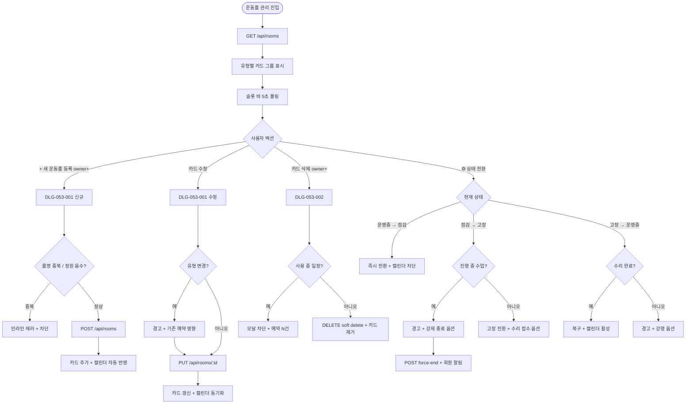
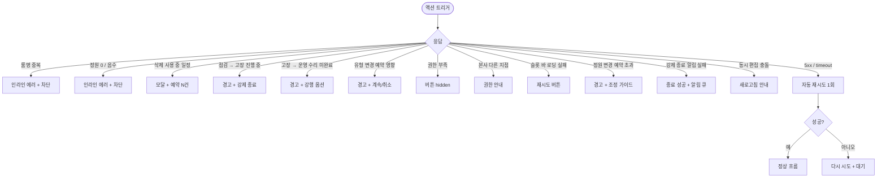

# SCR-053 운동룸 관리 페이지

## 1. 화면 메타 정보

| 항목 | 값 |
|---|---|
| 작성일 | 2026-05-22 |
| 버전 | v1.0 |
| 상태 | 최신 통합본 반영 (정합화 완료) |
| 도메인 | D06 시설관리 |
| 화면 ID | SCR-053 |
| 화면명 | 운동룸 관리 |
| 화면 유형 | 운영 화면 (Operational Screen) |
| 라우트 (URL) | `/rooms` |
| 플랫폼 | 데스크톱(기본), 태블릿 |
| 우선순위 | P0 (출시 필수) |
| 기능코드 | FAC-04 (운동룸 관리) |
| 계약코드 | FAC-04, FAC-04-01 ~ FAC-04-09 |
| 계약 상태 | 계약 범위 본기능 |
| 부모 기능 prefix | FAC |
| Lv1 코드 | FAC-04 |
| Lv2 / Lv3 세분화 | FAC-04-01 ~ FAC-04-09 (현황 요약, 뷰 전환, 유형 필터, 카드 정보, 예약 슬롯 바, 룸 등록, 룸 수정, 룸 삭제, 운영 상태 전환) |
| 연계 화면 | SCR-C001 캘린더, SCR-C002 예약, SCR-C006 강사 근무, SCR-097 감사 로그, SCR-056 장비 점검 |
| 호출 다이얼로그 | DLG-053-001 룸 등록/수정, DLG-053-002 룸 삭제 확인 |

이 문서는 운동룸 관리 페이지에 대한 자기완결형 요구사항 정의서입니다. 다른 문서를 함께 보지 않아도 이 문서 한 장만으로 화면의 모든 영역, 모든 버튼, 모든 모달, 모든 권한, 모든 예외 처리, 그리고 운영 정책까지 전부 이해하고 구현할 수 있도록 작성합니다.

## 2. 화면 개요와 목적

운동룸 관리 페이지는 센터 내 운동룸(GX룸 · PT룸 · 스피닝룸 · 필라테스룸 등)의 현황과 오늘의 예약 슬롯을 관리하는 화면입니다. 각 룸의 운영 상태(운영중 · 점검중 · 고장)를 확인하고, 시간대별 예약 혼잡도를 시각적으로 파악하며, 새 룸을 등록하거나 기존 룸 정보를 수정 · 삭제하고, 운영 상태를 빠르게 전환합니다.

이 화면은 단순한 자산 등록 도구가 아니라 SCR-C001 캘린더 예약 시스템 · SCR-C006 강사 근무 · SCR-056 장비 점검과 실시간 동기화되는 운영 허브입니다. 매니저가 룸을 점검중으로 전환하면 캘린더의 신규 예약이 즉시 차단되고, 고장 토글 시 진행 중 수업이 강제 종료될 수 있으며 회원에게 알림이 자동 발송됩니다. 룸 정원이 변경되면 기존 예약이 신정원을 초과하는지 자동 평가되고 운영자에게 경고가 발송됩니다.

## 3. 진입 경로와 인접 화면

진입 경로는 사이드바 "시설 관리 > 운동룸 관리", 캘린더(SCR-C001)에서 룸 관리로 이동, 강사 근무(SCR-C006)에서 룸 정보 확인, 장비 점검(SCR-056)에서 룸 고장 토글 후 수리 접수, 알림 센터의 룸 고장/점검 알림 등이 있습니다.

빠져나가는 인접 화면으로는 카드의 [수정]·[삭제] 후 캘린더 영향 확인을 위한 SCR-C001, 강사 배정 가능 룸 변경 시 SCR-C006, 고장 토글 시 수리 접수 자동 등록을 위한 SCR-056, 모든 상태 전환 · 등록 · 삭제 이벤트가 기록되는 SCR-097 감사 로그가 있습니다.

## 4. 레이아웃과 UI 구성

운동룸 관리 페이지는 세로형 단일 컬럼 레이아웃입니다.

페이지 헤더 좌측에는 "운동룸 관리" 타이틀과 지점 컨텍스트 배지가 있고, 우측에는 [+ 새 운동룸 등록] 버튼(권한 owner 이상)이 배치됩니다. 본사 통합 모드에서는 헤더에 지점 전환 드롭다운이 표시됩니다.

페이지 헤더 아래에는 현황 요약 카드 4개가 가로로 배치됩니다. 첫 번째 카드는 "전체 룸 수", 두 번째는 "운영중"(status=operating), 세 번째는 "점검·고장·미사용 합계"(비운영), 네 번째는 "GX룸/PT룸" 같은 유형별 카운트입니다. 카드 클릭 시 해당 상태 또는 유형 필터가 자동 적용됩니다.

요약 카드 아래에는 뷰 전환 탭(카드 보기 / 목록 보기)과 유형 필터(전체 / GX / PT / 스피닝 / 필라테스 / 기타)가 배치됩니다. 뷰 전환은 운영자 설정으로 저장되어 다음 진입 시에도 유지됩니다.

본문은 카드 보기일 때는 유형별로 묶인 룸 카드들이 표시됩니다. 각 카드에는 룸명 · 유형 배지 · 수용 인원 · 게이트 정보 · 운영 상태 배지 · 룸 설명 · 오늘 시간대별 예약 슬롯 바(07:00~20:00) · 카드 우측 액션 버튼([수정] · [삭제] · [⚙ 상태 전환])이 표시됩니다.

예약 슬롯 바는 색상으로 즉시 혼잡도를 인지할 수 있습니다. 여유(50% 미만)는 초록, 혼잡(50~80%)은 주황, 만석(80% 이상)은 빨강, 빈 시간은 회색입니다. 점검중·고장 룸의 슬롯 바에는 "점검 중 - 예약 불가" 텍스트가 오버레이됩니다.

운영 상태 전환 버튼(⚙)을 누르면 운영중 → 점검중 → 고장 → 운영중 순서로 상태가 순환 전환됩니다. 사용중 룸을 점검·고장으로 전환할 때 진행 중 수업이 있으면 경고와 강제 종료 옵션이 모달로 표시됩니다.

목록 보기로 전환하면 룸 정보가 테이블 형태로 표시되어 대량 조회·정렬에 적합합니다.

룸이 한 개도 등록되지 않은 센터에서는 본문 자리에 "등록된 운동룸이 없습니다" 안내와 [+ 새 운동룸 등록] CTA가 표시됩니다.

## 5. 탭 구성과 탭별 동작

본 화면의 1차 분기는 뷰 전환(카드 보기 / 목록 보기)이며, 2차 분기는 유형 필터(전체 / GX / PT / 스피닝 / 필라테스 / 기타)입니다.

뷰 전환은 데이터셋은 같지만 표시 방식만 다르며, URL 쿼리 파라미터 `view`로 반영됩니다. 유형 필터는 URL 쿼리 파라미터 `type`으로 반영되어 새로고침 시에도 유지됩니다.

운영 상태별 필터는 별도 컴포넌트가 아니라 카드 자체의 시각적 강조(점검중은 투명도 80% + 주황, 고장은 빨강 강조)로 표현됩니다.

## 6. 버튼·아이콘·링크 액션 전체 정의

현황 요약 카드 4개는 클릭 시 해당 필터로 자동 이동합니다.

뷰 전환 탭과 유형 필터는 클릭 시 즉시 결과가 갱신되며 URL 쿼리에 반영됩니다.

[+ 새 운동룸 등록] 버튼은 owner 이상 권한자에게만 노출되며 클릭 시 DLG-053-001 룸 등록/수정 다이얼로그를 신규 모드로 호출합니다.

룸 카드의 [수정] 버튼은 owner 또는 manager 권한자에게 노출되며 클릭 시 DLG-053-001을 수정 모드로 호출하고 기존 정보가 미리 채워진 상태로 열립니다.

룸 카드의 [삭제] 버튼은 owner 이상 권한자에게만 노출되며 클릭 시 DLG-053-002 룸 삭제 확인 다이얼로그를 호출합니다. 사용 중 일정(오늘 + 미래)이 0건일 때만 삭제 가능합니다.

룸 카드의 [⚙ 상태 전환] 버튼은 클릭 시 운영중 → 점검중 → 고장 → 운영중 순서로 순환 전환됩니다. 사용중 룸을 점검·고장으로 전환할 때 진행 중 수업이 있으면 경고 모달이 표시되어 [강제 종료] / [취소] 선택지를 제공합니다. 강제 종료 시 회원에게 NFR-19 알림이 자동 발송됩니다.

예약 슬롯 바 클릭은 SCR-C001 캘린더의 해당 룸 일간 보기로 이동합니다.

## 7. 호출되는 모달 동작

### 7-1. DLG-053-001 룸 등록/수정 다이얼로그

신규 룸을 등록하거나 기존 룸을 수정하는 모달입니다. 신규 등록은 헤더 버튼으로, 수정은 카드 [수정] 버튼으로 열립니다. 모달 상단에는 "운동룸 등록"(신규) 또는 "운동룸 수정"(수정) 제목이 표시됩니다.

본문 입력 필드는 다음과 같습니다. 룸명(필수, 동일 지점 내 고유), 유형 선택(GX / PT / 스피닝 / 필라테스 / 기타 중 단일 선택), 수용 인원(직접 입력 또는 퀵 선택 버튼 1·2·6·10·14·16·20·22명), 룸 설명(자유 입력 선택). 룸명 중복 시 인라인 에러 "동일 룸명이 이미 존재합니다", 정원 0 또는 음수 입력 시 "정원은 1 이상 입력해주세요"가 표시됩니다.

[등록하기 / 수정 완료] 버튼은 룸명이 입력된 경우에만 활성화됩니다. 저장 성공 시 모달이 닫히고 카드 목록에 즉시 추가/갱신되며 캘린더에 자동 반영됩니다. 유형 변경(GX → PT 등)은 기존 예약에 영향이 있을 수 있어 경고가 표시되며 [계속] / [취소] 선택지가 제공됩니다.

### 7-2. DLG-053-002 룸 삭제 확인 다이얼로그

룸을 삭제하기 전 최종 확인을 받는 모달입니다. 카드 [삭제] 버튼으로 열립니다. 모달 상단에는 "운동룸 삭제" 제목이 표시되고, 그 아래에 "[룸명]을 삭제하시겠습니까? 삭제 후에는 복구할 수 없습니다"라는 안내가 표시됩니다.

[삭제] 버튼은 위험(danger) 스타일이며 누르면 룸이 soft delete됩니다(과거 예약 이력은 보존). 사용 중 일정(오늘 + 미래)이 있으면 모달에 "오늘/이후 예약 N건이 있어 삭제할 수 없습니다. 일정 정리 후 다시 시도하세요" 안내와 [예약 화면으로] / [취소] 선택지가 표시됩니다. owner 이상 권한자만 사용 가능합니다.

## 8. 토스트와 확인 팝업과 알럿

성공 토스트는 "운동룸이 등록되었습니다", "운동룸이 수정되었습니다", "운동룸이 삭제되었습니다", "운영 상태가 변경되었습니다" 같은 문구로 5초간 표시됩니다.

실패 토스트는 "동일 룸명이 이미 존재합니다", "사용 중 일정이 있어 삭제할 수 없어요", "권한이 없어요", "예약 정보 로딩 실패" 같은 문구로 표시됩니다.

확인 팝업은 사용중 룸을 점검·고장으로 전환할 때 표시되며 "현재 진행 중인 수업 N건이 있습니다. 강제 종료하시겠어요?" + [강제 종료] / [취소]가 모달로 제공됩니다.

알럿은 권한 없는 계정 직접 URL 접근 시 차단되며 대시보드로 자동 이동됩니다.

## 9. 데이터 흐름과 외부 연동

화면 진입 시 `GET /api/rooms`가 호출되며 응답으로 룸 배열과 4개 요약 카드 카운트가 내려옵니다. 슬롯 바 데이터는 `GET /api/rooms/:id/today-slots`로 5초 주기 폴링되어 카드별 슬롯 바가 갱신됩니다.

룸 등록은 `POST /api/rooms`, 수정은 `PUT /api/rooms/:id`, 삭제는 `DELETE /api/rooms/:id`, 상태 전환은 `POST /api/rooms/:id/toggle-status`, 강제 종료는 `POST /api/rooms/:id/force-end-class`로 처리됩니다.

상태 전환·정원 변경·삭제는 SCR-C001 캘린더와 모든 예약 시스템에 즉시 동기화됩니다. 강사 근무(SCR-C006)에는 룸 상태 · 정원 변경 시 강사 배정 가능 룸이 자동 갱신됩니다.

정원 변경 후 기존 예약이 신정원을 초과하면 회원 예약 영향 평가 배치가 실행되어 운영자에게 알림이 발송됩니다.

고장 토글 시 테넌트 정책이 활성화된 경우 SCR-056 장비 점검에 수리 접수가 자동 등록됩니다.

강제 종료 시 회원에게 NFR-19 알림(푸시 + SMS)이 발송되며, 알림 실패는 큐에 등록되어 종료 처리 자체는 성공으로 처리됩니다.

모든 등록·수정·상태 전환·삭제 처리는 감사 로그(SCR-097)에 actor · room_id · before-after 형태로 기록됩니다.

룸 KPI 배치는 매주 월요일 04:00에 룸별 사용률 · 만석율 · 점검 빈도를 집계합니다.

## 10. 화면 상태와 예외 처리

로딩 중 상태는 헤더와 카드 영역의 스켈레톤으로 표시됩니다.

정상 상태는 유형별 룸 카드 또는 목록이 표시되는 상태입니다.

고장 룸 상태는 카드 테두리와 배경이 빨간색 계열로 강조됩니다. 점검중 룸 상태는 카드 투명도 80% + 주황색 테두리 + 슬롯 바에 "점검 중 - 예약 불가" 오버레이가 표시됩니다.

운동룸 없음 상태는 "등록된 운동룸이 없습니다" 안내와 [새 운동룸 등록] CTA가 표시됩니다.

예외 케이스별 처리는 다음과 같습니다.

룸명 중복 등록 시 인라인 에러로 저장이 차단됩니다.

정원 0 또는 음수 입력 시 인라인 에러로 저장이 차단됩니다.

삭제 시 사용 중 일정 존재 시 모달 안내 + [예약 화면으로] / [취소] 선택지가 제공됩니다.

점검중 → 고장 전환 시 진행 중 수업이 있으면 경고 + 강제 종료 옵션이 제공됩니다.

고장 → 운영중 복구 시 수리 완료 기록이 없으면 경고 "수리 완료 기록이 없습니다"가 표시되며 강행 옵션이 제공됩니다.

유형 변경(GX → PT 등) 시 기존 예약 영향 경고 + [계속] / [취소] 선택지가 표시됩니다.

권한 부족 시 버튼이 hidden 또는 비활성화됩니다.

본사 통합 모드 다른 지점 변경 시 권한 안내가 표시됩니다.

슬롯 바 데이터 로딩 실패 시 "슬롯 정보를 불러올 수 없습니다" + 재시도 버튼이 표시됩니다.

정원 변경 후 기존 예약 초과 시 경고와 별도 조정 가이드가 제공됩니다.

강제 종료 알림 발송 실패 시 종료는 성공으로 처리되고 알림은 재시도 큐에 등록됩니다.

동시 편집 충돌 시 "다른 사용자가 변경했습니다, 새로고침" 안내가 표시됩니다.

## 11. 권한별 처리

슈퍼관리자 · 본사 최고관리자 · 센터장(owner)은 전체 룸 현황을 조회하고 등록 · 수정 · 삭제 · 상태 전환 모든 기능을 사용할 수 있습니다.

매니저는 전체 룸 현황을 조회하고 상태 전환 · 수정이 가능하지만 삭제는 불가능합니다. 카드의 [삭제] 버튼이 노출되지 않습니다.

FC · 스태프 · 프런트는 전체 룸 현황을 조회하고 상태 전환만 가능합니다. [수정] · [삭제] · [+ 새 운동룸 등록] 버튼이 노출되지 않습니다.

트레이너 · 읽기 전용은 현황 조회만 가능하며 모든 액션이 비활성화됩니다.

권한 부족 시 단계별 차단이 적용됩니다. 모든 권한 차단 이벤트는 감사 로그에 기록됩니다.

## 12. 메인 흐름

## 13. 에러와 예외 흐름

## 14. 핵심 디자인 요청사항

룸 카드는 한눈에 운영 상태가 읽혀야 합니다. 운영중은 일반, 점검중은 투명도 80% + 주황 테두리 + 슬롯 바에 "예약 불가" 오버레이, 고장은 빨강 + 사선 강조로 시각적으로 즉시 식별 가능해야 합니다.

예약 슬롯 바는 색상으로 혼잡도가 즉시 인지 가능해야 합니다. 여유(초록) · 혼잡(주황) · 만석(빨강) · 빈 시간(회색)이 명확히 구분되며, 점검중 룸은 슬롯 바 위에 "예약 불가" 텍스트가 오버레이되어 시각적으로 차단 상태가 명확해야 합니다.

운영 상태 전환 버튼(⚙)은 톱니바퀴 아이콘으로 직관적으로 표시되며 호버 시 다음 전환될 상태가 툴팁으로 미리 보입니다(예: "운영중 → 점검중").

룸 등록/수정 다이얼로그의 수용 인원 입력 영역은 직접 입력란 + 퀵 선택 버튼이 함께 표시되어 운영자가 빠르게 입력할 수 있어야 합니다.

카드 보기와 목록 보기 전환은 부드러운 트랜지션으로 일어나야 하며, 운영자가 선호하는 뷰가 다음 진입 시에도 유지되어야 합니다.

## 15. 운영 정책 (이 화면에 연결된 부분)

룸 유형은 GX / PT / 스피닝 / 필라테스 / 기타 5종이며 등록 시 단일 선택입니다. 유형 변경은 가능하지만 기존 예약에 영향이 있을 수 있어 경고가 표시됩니다.

룸명은 동일 지점 내 고유이며 중복 등록이 차단됩니다.

정원은 1 이상 자연수이며 캘린더 예약 시 동시 예약 인원 한도로 사용됩니다. 정원 변경 시 기존 예약이 신정원을 초과하면 회원 예약 영향 평가 배치가 실행되어 운영자에게 알림이 발송됩니다.

게이트 정보는 옵션이며 출입 안내 · RFID 매핑(FAC-03)에 활용됩니다.

운영 상태는 운영중(operating) / 점검중(maintenance) / 고장(broken) 3종이며 ⚙ 버튼으로 순환 전환됩니다. 점검중·고장 룸은 신규 예약이 차단됩니다.

점검중 → 고장 전환 시 진행 중 수업이 있으면 경고 + 강제 종료 옵션이 제공됩니다. 강제 종료 시 회원에게 NFR-19 알림이 자동 발송됩니다.

고장 → 운영중 복구 시 수리 완료 기록이 없으면 경고가 표시되고 강행 옵션이 제공됩니다.

운영 상태 전환 · 정원 변경 · 삭제는 즉시 캘린더(SCR-C001)와 모든 예약 시스템에 반영됩니다.

룸 삭제는 사용 중 일정(오늘 + 미래)이 0건일 때만 가능하며 soft delete로 과거 이력은 보존됩니다.

예약 슬롯 바는 SCR-C001 캘린더의 룸별 예약 데이터를 5초 주기 폴링으로 실시간 반영합니다. 슬롯 바 색상 임계값은 여유(< 50%) 초록, 혼잡(50~80%) 주황, 만석(≥ 80%) 빨강입니다. 표시 시간은 07:00~20:00이며 테넌트 영업시간 정책으로 변경 가능합니다.

카드 보기 / 목록 보기 전환은 사용자 설정으로 저장되어 다음 진입 시에도 유지됩니다.

유형 필터 변경 시 URL 쿼리 동기화로 새로고침 시에도 유지됩니다.

권한별 가시성은 다음과 같이 분리됩니다. 슈퍼관리자 · 센터장은 등록 · 수정 · 삭제 · 상태 전환 모두 가능합니다. 매니저는 상태 전환 · 수정이 가능하지만 삭제는 불가능합니다. FC · 스태프 · 프런트는 상태 전환만 가능합니다. 트레이너 · 읽기 전용은 조회만 가능합니다.

본사 통합 모드는 지점별 룸이 분리 운영되며 슈퍼관리자만 통합 조회가 가능합니다.

모든 등록 · 수정 · 상태 전환 · 삭제는 감사 로그(SCR-097)에 actor · room_id · before-after 형태로 기록됩니다.

강사 근무(SCR-C006) 연계로 룸 상태 · 정원 변경 시 강사 배정 가능 룸이 자동 갱신됩니다.

FAC-EXT-02 수리 접수 연계: 고장 토글 시 수리 접수가 자동 등록되는 옵션이 있습니다(테넌트 정책).

룸 등록 직후 예약 가능하며 캘린더 자동 반영이 일어납니다(별도 활성화 불필요).

룸 삭제 후 같은 룸명 재등록은 허용됩니다(soft delete 후 신규 등록).

이상의 모든 정책은 이 화면을 구현하고 운영하는 사람이 별도 문서 없이 이 한 장만 보면 이해할 수 있도록 풀어 적었습니다.
