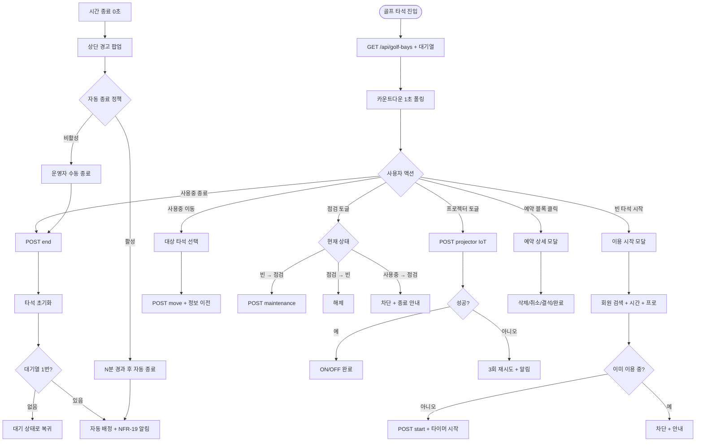
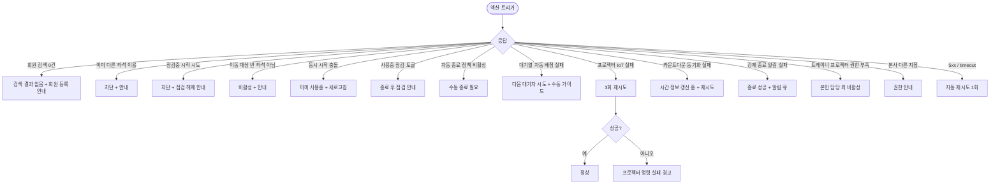

# SCR-054 골프 타석 관리 페이지

## 1. 화면 메타 정보

| 항목 | 값 |
|---|---|
| 작성일 | 2026-05-22 |
| 버전 | v1.0 |
| 상태 | 최신 통합본 반영 (정합화 완료) |
| 도메인 | D06 시설관리 |
| 화면 ID | SCR-054 |
| 화면명 | 골프 타석 관리 |
| 화면 유형 | 허브 화면 (Hub Screen) |
| 라우트 (URL) | `/golf-bays` |
| 플랫폼 | 데스크톱(기본), 태블릿 |
| 우선순위 | P0 (출시 필수) |
| 기능코드 | FAC-05 (골프 타석 관리) |
| 계약코드 | FAC-05, FAC-05-01 ~ FAC-05-09 |
| 계약 상태 | 계약 범위 본기능 |
| 부모 기능 prefix | FAC |
| Lv1 코드 | FAC-05 |
| Lv2 / Lv3 세분화 | FAC-05-01 ~ FAC-05-09 (현황 요약, 타석 그리드, 이용 시작, 이용 종료, 타석 이동, 점검 처리, 프로젝터 제어, 시간 종료 알림, 대기열) |
| 연계 화면 | SCR-053 운동룸 관리, SCR-C001 캘린더, SCR-M004 회원 상세, SCR-097 감사 로그, SCR-051 골프 사물함, SCR-056 장비 점검 |
| 호출 다이얼로그 | 본 화면 직접 호출 다이얼로그 없음 (인라인 모달 + 예약 상세 모달로 처리) |

이 문서는 골프 타석 관리 페이지에 대한 자기완결형 요구사항 정의서입니다. 다른 문서를 함께 보지 않아도 이 문서 한 장만으로 화면의 모든 영역, 모든 버튼, 모든 모달, 모든 권한, 모든 예외 처리, 그리고 운영 정책까지 전부 이해하고 구현할 수 있도록 작성합니다.

## 2. 화면 개요와 목적

골프 타석 관리 페이지는 골프 연습장 내 타석의 실시간 이용 현황과 예약 운영을 함께 다루는 시설관리 도메인의 핵심 허브 화면입니다. 타석별 사용자 · 담당 프로 · 남은 이용 시간을 실시간 카운트다운으로 표시하고, 이용 시작 · 종료 · 타석 간 이동 · 점검 처리를 수행하며, 일간/월간 예약 캘린더 · 개인레슨/정규/시설예약 구분 · 예약 상세 처리 모달을 통해 골프 연습장 특화 운영 흐름을 한 화면군에서 모두 다룹니다.

이 화면이 다루는 운영 흐름은 회원 입장 시점부터 시작됩니다. 프런트는 빈 타석의 [시작] 버튼을 누르고 회원을 검색해 이용 시간(30분 / 1시간 / 2시간 / 사용자 정의)을 입력하면 타이머가 즉시 카운트다운을 시작합니다. 카운트다운이 0초에 도달하면 화면 상단에 "⏰ [타석명] 시간 종료! ([회원명])"이라는 경고 팝업이 표시되어 운영자가 즉시 인지하고 종료 처리합니다. 매니저는 회원 요청에 따라 사용중 타석을 다른 빈 타석으로 이동시키고, 스크린·매트·프로젝터 고장 시 점검 토글로 신규 시작을 차단합니다. 트레이너는 본인 담당 타석의 프로젝터를 강의 모드 시작 시 ON/OFF 제어합니다. 대기 중인 회원은 하단 대기열 패널에 순서대로 표시되며, 사용중 타석이 종료되면 1번 대기자가 자동 배정되고 회원에게 NFR-19 알림이 발송됩니다.

따라서 이 화면은 실시간 카운트다운 · 시간 종료 알림 · 대기열 자동 배정 · 프로젝터 IoT 제어가 모두 결합된 실시간 운영 허브이며, 캘린더 예약 시스템(SCR-C001)과 강하게 동기화되어 작동합니다.

## 3. 진입 경로와 인접 화면

진입 경로는 사이드바 "시설 관리 > 골프 타석", 대시보드 골프 가동률 카드 클릭(통합 모드에서는 골프 운영 지점만 노출), 캘린더(SCR-C001)에서 골프 타석 일정 클릭, 알림 센터의 시간 종료/장기 대기 알림 클릭 등이 있습니다.

빠져나가는 인접 화면으로는 회원명 클릭 시 SCR-M004 회원 상세, 골프 사물함 배정을 위한 SCR-051 사물함 배정 관리(골프 탭), 룸 관리와 연계되는 SCR-053 운동룸 관리, 캘린더 일간 보기를 위한 SCR-C001, 고장 타석의 수리 접수를 위한 SCR-056 장비 점검, 모든 시작·종료·이동·점검·자동 배정 이벤트가 기록되는 SCR-097 감사 로그가 있습니다.

## 4. 레이아웃과 UI 구성

골프 타석 관리 페이지는 위에서 아래로 쌓이는 세로형 레이아웃입니다.

가장 위에는 페이지 헤더와 상단 운영 툴바가 있습니다. 헤더 좌측에는 "골프 타석 관리" 타이틀과 지점 컨텍스트 배지가 있고, 상단 운영 툴바에는 기간 헤더(`YYYY년 MM월 ~ YYYY년 MM월`), 이전/다음 이동 버튼, 오늘 바로가기 버튼, 보기 전환(일간 / 월간) 토글, 예약 구분 필터(전체 / 개인레슨 / 정규 / 시설예약)가 배치됩니다. 기간과 보기 전환은 URL 쿼리 파라미터로 반영됩니다.

페이지 헤더 바로 아래에는 현황 요약 카드 5개가 가로로 배치됩니다. 첫 번째 "전체 타석 수", 두 번째 "사용중", 세 번째 "대기(빈 타석)", 네 번째 "예약", 다섯 번째 "대기열 인원"입니다. 카드 클릭 시 해당 상태 필터가 자동 적용됩니다.

본문은 보기 전환에 따라 두 가지로 표시됩니다.

일간 보기에서는 예약 가용성 스트립이 먼저 표시되어 날짜 가로 스트립과 각 날짜 아래 타석별 예약 건수 또는 남은 슬롯 수가 작은 뱃지로 노출됩니다. 그 아래에는 일간 타임테이블 뷰가 표시됩니다. 가로축은 타석 번호이고 세로축은 5분 단위 시간 슬롯입니다. 각 타석 헤더에 오늘 예약 건수/사용중 건수 뱃지가 표시되고, 현재 시각은 붉은 가로선과 시각 라벨로 강조됩니다. 예약 블록은 유형별 색상(일반 시설예약 / 개인레슨 / 점검 블록)으로 구분되며 블록 내부에 시간 · 회원명 · 프로 또는 예약 유형이 표시됩니다. 블록 클릭 시 예약 상세 모달이 열립니다.

월간 보기에서는 월간 캘린더 뷰로 일자별 예약 건수가 집계되어 표시됩니다. 일자 셀 우상단에 총 예약 건수 배지, 셀 내부에 타석/프로별 예약 건수 요약이 최대 3줄 노출되며 초과분은 `+n` 또는 상세 패널에서 확인할 수 있습니다. 날짜 클릭 시 해당 일자의 일간 타임테이블로 drill-down 됩니다.

본문 우측에는 실시간 타석 카드/오버레이가 표시됩니다. 운영자는 타임테이블에서 사용중 타석의 현재 상태를 카드형 오버레이로 볼 수 있습니다. 각 카드 내용은 타석 번호 · 상태 배지(대기/사용중/예약/점검) · 이용 회원명 · 담당 프로명 · 남은 시간 카운트다운 · 프로젝터 on/off 토글 · 시작·종료·이동·점검 버튼입니다.

타석 상태는 색상으로 즉시 인지됩니다. 대기는 초록, 사용중은 파랑, 예약은 노랑, 점검은 회색입니다. 그리드 색상 우선순위는 점검 > 사용중 > 예약 > 대기 순서입니다.

화면 하단에는 대기열 패널이 있습니다. 현재 대기 중인 회원 목록이 순서대로 표시되며 각 항목에는 순서 번호 · 회원명 · 대기 시작 시간 · 예상 대기 시간이 표시됩니다. 회원명 클릭 시 SCR-M004로 이동합니다.

시간 종료 알림은 화면 상단에 경고 팝업으로 표시됩니다. 남은 시간이 0초에 도달하면 "⏰ [타석명] 시간 종료! ([회원명])"이 화면 상단에 떠 운영자가 즉시 종료 처리 또는 자동 종료 정책에 따라 자동 종료가 일어나기를 기다립니다.

## 5. 탭 구성과 탭별 동작

본 화면의 1차 분기는 보기 전환(일간 / 월간)이며, 2차 분기는 예약 구분 필터(전체 / 개인레슨 / 정규 / 시설예약)입니다.

보기 전환은 URL 쿼리 파라미터 `view`로 반영되고, 일간은 5분 단위 타임테이블, 월간은 일자별 집계로 표시됩니다. 월간 보기의 날짜 셀 클릭 시 일간으로 drill-down 됩니다.

예약 구분 필터는 운영자가 어떤 유형의 예약을 집중해서 볼지 결정합니다. 개인레슨 필터를 선택하면 개인레슨 블록만 색상 강조되어 표시되고 다른 유형은 회색 처리됩니다. URL 쿼리 파라미터 `category`로 반영됩니다.

## 6. 버튼·아이콘·링크 액션 전체 정의

현황 요약 카드 5개는 클릭 시 해당 상태 필터가 자동 적용됩니다.

상단 운영 툴바의 이전/다음 버튼은 기간을 한 단위씩 이동시킵니다. 오늘 바로가기 버튼은 기간을 오늘로 즉시 이동시킵니다. 보기 전환 토글은 일간과 월간 사이에서 전환됩니다. 예약 구분 필터 드롭다운은 전체/개인레슨/정규/시설예약 중 하나를 선택합니다.

타석 카드의 [시작] 버튼은 빈 타석에서만 노출되며 클릭 시 인라인 모달이 열려 회원 검색 자동완성 · 이용 시간 선택(30분/1시간/2시간/사용자 정의) · 담당 프로 선택(트레이너) 입력 후 확정하면 타이머가 즉시 카운트다운을 시작합니다.

타석 카드의 [종료] 버튼은 사용중 타석에서만 노출되며 클릭 시 인라인 확인 후 타석이 초기화되고 대기열 1번 회원이 자동 배정됩니다.

타석 카드의 [이동] 버튼은 사용중 타석에서만 노출되며 클릭 시 대상 빈 타석 선택 모달이 열려 회원 정보와 남은 시간이 그대로 이전됩니다. 점검중·사용중 타석은 선택 영역에 비활성으로 표시되며 "빈 타석만 선택 가능합니다" 안내가 함께 노출됩니다.

타석 카드의 [점검] 버튼은 빈 타석에서만 노출되며 클릭 시 점검 상태로 즉시 전환됩니다. 사용중 타석은 종료 선행이 필요하므로 [점검] 버튼이 노출되지 않거나 비활성 상태로 표시됩니다. 점검중 타석의 [점검 해제] 버튼 클릭 시 빈 타석으로 복구됩니다.

프로젝터 on/off 토글은 사용중 타석에서 노출되며 클릭 시 IoT 명령이 호출됩니다. 트레이너는 본인 담당 타석의 프로젝터만 제어 가능하며, 매니저 이상은 모든 타석 제어가 가능합니다. IoT 명령 실패 시 3회 재시도 후 운영자 알림이 표시됩니다.

타임테이블의 예약 블록 클릭은 예약 상세 모달을 열어 회원명 · 연락처 · 예약 유형 · 사용 상품 · 남은 레슨 횟수 · 모바일 알림 여부를 표시하고 [삭제] · [취소] · [결석] · [완료] 처리 버튼을 제공합니다.

월간 캘린더의 날짜 셀 클릭은 해당 일자의 일간 타임테이블로 drill-down 됩니다. `+n` 표시 클릭은 상세 패널을 열어 모든 예약을 표시합니다.

시간 종료 경고 팝업의 [종료] 버튼 클릭은 타석을 즉시 종료하고 대기열 자동 배정을 트리거합니다.

대기열 패널의 회원명 클릭은 SCR-M004 회원 상세로 이동합니다.

## 7. 호출되는 모달 동작

본 화면에서 호출되는 모달은 인라인 형태로 처리되는 여러 모달입니다.

### 7-1. 이용 시작 모달

빈 타석의 [시작] 버튼으로 열립니다. 모달 상단에 "[타석명] 이용 시작" 제목이 표시되고, 본문에 회원 검색 자동완성 입력란 · 이용 시간 선택(30분/1시간/2시간/사용자 정의) · 담당 프로 선택(트레이너, 옵션)이 있습니다. 회원이 이미 다른 타석을 이용 중이면 "해당 회원은 이미 [타석명]에서 이용 중입니다" 안내가 표시되어 시작이 차단됩니다. [시작] 버튼 클릭 시 타이머가 즉시 카운트다운을 시작하고 감사 로그에 기록됩니다.

### 7-2. 이용 종료 확인 모달

사용중 타석의 [종료] 버튼으로 열립니다. 인라인 확인 형태로 "이용을 종료하시겠습니까?" 안내가 표시됩니다. [종료] 클릭 시 타석이 초기화되고 대기열 1번 회원이 자동 배정됩니다. 자동 배정 시 회원에게 NFR-19 알림이 발송됩니다.

### 7-3. 타석 이동 모달

사용중 타석의 [이동] 버튼으로 열립니다. 모달 상단에 "[현재 타석] → 대상 타석 선택" 제목이 표시되고, 본문에 빈 타석 목록이 표시됩니다. 점검중·사용중 타석은 비활성 상태로 표시되며 클릭이 차단됩니다. 대상 타석 선택 후 [확인] 클릭 시 회원 정보와 남은 시간이 새 타석으로 이전되고 이동 이력이 기록됩니다.

### 7-4. 예약 상세 모달

타임테이블의 예약 블록 클릭으로 열립니다. 모달 상단에 선택한 시간 블록의 날짜 · 시간 · 타석 번호가 표시되고, 본문에 예약 카드(회원명 · 연락처 · 예약 유형(시설/개인레슨) · 사용 상품 · 남은 레슨 횟수 · 모바일 알림 여부)와 [삭제] · [취소] · [결석] · [완료] 처리 버튼이 제공됩니다. 동일 시간대에 복수 예약이 걸린 예외 상황도 한 모달에서 일괄 처리됩니다.

### 7-5. 점검 토글 인라인 확인

빈 타석의 [점검] 버튼으로 인라인 확인이 호출됩니다. 사용중 타석은 [점검] 버튼이 노출되지 않거나 비활성 상태로 표시됩니다. 강제 점검은 매니저 이상 권한자만 가능하며 강제 종료가 함께 일어납니다.

## 8. 토스트와 확인 팝업과 알럿

성공 토스트는 "이용 시작되었어요", "이용 종료되었어요", "타석이 이동되었어요", "점검 처리되었어요", "프로젝터가 켜졌어요", "대기열 1번이 자동 배정되었어요" 같은 문구로 5초간 표시됩니다.

실패 토스트는 "회원을 먼저 선택해주세요", "이미 다른 타석에서 이용 중이에요", "점검중 타석은 시작할 수 없어요", "이미 사용중인 타석이에요", "프로젝터 명령 실패, 수동 확인 필요" 같은 문구가 표시됩니다.

확인 팝업은 시간 종료 경고로, 카운트다운 0초 도달 시 화면 상단에 "⏰ [타석명] 시간 종료! ([회원명])"이 차단형으로 표시되며 운영자가 종료 처리하거나 자동 종료 정책이 활성화된 경우 N분 경과 후 자동 종료됩니다. 자동 종료 시 대기열 1번 회원이 자동 배정되고 회원에게 NFR-19 알림이 발송됩니다.

장기 대기 알림은 대기열에서 30분 이상 대기 중인 회원이 있을 때 운영자에게 알림이 표시되어 회원 안내를 유도합니다.

알럿은 권한 없는 계정 직접 URL 접근 시 차단되며 대시보드로 자동 이동됩니다.

## 9. 데이터 흐름과 외부 연동

화면 진입 시 `GET /api/golf-bays`가 호출되며 응답으로 타석 배열, 5개 요약 카드 카운트, 대기열 정보가 함께 내려옵니다.

카운트다운 폴링은 1초 주기로 `GET /api/golf-bays/:id/countdown`을 호출하여 서버 시간 동기화로 정확한 남은 시간을 표시합니다.

이용 시작은 `POST /api/golf-bays/:id/start`, 종료는 `POST /api/golf-bays/:id/end`, 이동은 `POST /api/golf-bays/:id/move`, 점검 토글은 `POST /api/golf-bays/:id/maintenance`, 프로젝터 토글은 `POST /api/golf-bays/:id/projector`로 처리됩니다.

대기열 조회는 `GET /api/golf-bays/queue`, 대기 등록은 `POST /api/golf-bays/queue/:memberId`, 자동 종료는 `POST /api/golf-bays/:id/auto-end`로 처리됩니다.

시간 종료 알림 배치는 0초 도달 시 화면 상단 경고 팝업을 표시하고 회원에게 알림을 발송합니다. 자동 종료 배치는 시간 종료 + N분(기본 5분) 경과 시 자동 종료를 수행하며 정책 활성 시에만 작동합니다.

대기열 자동 배정은 타석 종료 시 자동으로 1번 회원이 시작되며 회원에게 NFR-19 알림이 발송됩니다. 자동 배정 실패(회원 부재 등) 시 다음 대기자가 자동 시도되며 모두 실패하면 운영자에게 수동 가이드가 표시됩니다.

NFR-19 장기 대기 알림은 대기 30분 경과 시 회원에게 발송됩니다.

IoT 프로젝터 제어는 ON/OFF 명령이 호출되며 실패 시 3회 재시도 후 운영자 알림이 표시됩니다.

대기열 예상 시간 계산은 평균 사용 시간 기반으로 자동 계산되어 대기 패널에 표시됩니다.

회원 탈퇴·이관·삭제 이벤트 시 보유 대기열 등록이 자동 제거됩니다.

골프 KPI 배치는 매주 월요일 04:00에 타석 가동률 · 평균 사용 시간 · 대기 시간을 집계합니다.

모든 시작·종료·이동·점검·프로젝터·자동 배정 처리는 감사 로그(SCR-097)에 actor · bay_id · member_id · before-after 형태로 기록됩니다.

본사 통합 모드는 골프 운영 지점만 노출되며 지점별 분리 운영됩니다.

## 10. 화면 상태와 예외 처리

대기 상태는 초록 카드 + [시작] 버튼 활성화로 표시됩니다.

사용중 상태는 파랑 카드 + 회원명 · 프로명 · 남은 시간 + [종료] · [이동] 버튼으로 표시됩니다.

예약 상태는 노랑 카드 + 예약 회원명으로 표시됩니다.

점검 상태는 회색 카드 + [점검 해제] 버튼으로 표시됩니다.

일간 타임테이블 상태는 5분 단위 슬롯 + 현재 시각선 + 블록형 예약 표시입니다.

월간 캘린더 상태는 일자별 예약 건수 집계 + 상세 drill-down 가능 상태입니다.

예약 상세 모달 열림 상태는 날짜/시간/타석 기준 예약 카드와 처리 버튼이 표시됩니다.

시간 종료 상태는 화면 상단에 차단형 경고 팝업이 표시됩니다.

대기열 없음 상태는 대기열 패널에 "대기 중인 회원이 없습니다" 안내가 표시됩니다.

예외 케이스별 처리는 다음과 같습니다.

회원 검색 0건 시 "검색 결과가 없어요" 안내가 표시되며 회원 등록 안내가 함께 노출됩니다.

이미 다른 타석 이용 중인 회원에 시작 시도 시 "이미 [타석명]에서 이용 중" 안내가 표시되어 차단됩니다.

점검중 타석 시작 시도 시 "점검중 타석은 시작 불가, 점검 해제 후 시도하세요" 안내가 표시되어 차단됩니다.

이동 시 대상 타석이 점검중·사용중이면 비활성 + "빈 타석만 선택 가능합니다" 안내가 표시됩니다.

동시 시작 충돌 시 락 충돌로 "선택한 타석이 이미 사용중입니다" 안내 + 새로고침 안내가 표시됩니다.

사용중 타석 점검 토글 시도 시 "사용중 타석은 종료 후 점검 처리 가능합니다" 안내가 표시되어 종료 안내가 함께 노출됩니다.

자동 종료 정책 비활성 시 시간 종료 후 자동 종료가 발생하지 않으며 운영자 수동 종료가 필요합니다.

대기열 자동 배정 실패(회원 부재 등) 시 다음 대기자가 자동 시도되며 모두 실패하면 운영자 수동 가이드가 표시됩니다.

트레이너 프로젝터 제어 권한 부족 시 본인 담당 타석 외 토글이 비활성화됩니다.

프로젝터 IoT 명령 실패 시 토스트 "프로젝터 명령 실패, 수동 확인 필요" + 3회 재시도가 수행됩니다.

카운트다운 동기화 실패 시 "시간 정보 갱신 중..." + 재시도 폴링이 일어납니다.

강제 종료 알림 실패 시 종료는 성공으로 처리되고 알림은 재시도 큐에 등록됩니다.

본사 통합 모드 다른 지점 변경 시 권한 안내가 표시됩니다.

## 11. 권한별 처리

슈퍼관리자 · 본사 최고관리자 · Owner(지점장) · 매니저는 전체 타석 + 대기열을 조회하고 시작 · 종료 · 이동 · 점검 · 프로젝터 모든 액션을 수행할 수 있습니다.

FC · 스태프 · 프런트는 전체 타석 + 대기열을 조회하고 시작 · 종료 · 점검을 수행할 수 있습니다. 이동은 불가능하므로 카드의 [이동] 버튼이 노출되지 않습니다.

트레이너는 담당 타석 현황을 조회하고 본인 담당 타석의 프로젝터만 제어할 수 있습니다. 타석 시작·종료·이동·점검은 모두 불가능합니다.

읽기 전용(readonly)은 현황 조회만 가능하며 모든 액션이 비활성화됩니다.

권한 외에 본사 통합 모드는 골프 운영 지점만 노출되며 지점별 분리 운영됩니다. 본사 슈퍼관리자만 통합 조회 가능합니다.

권한 부족 시 단계별 차단이 적용됩니다. 모든 권한 차단 이벤트는 감사 로그에 기록됩니다.

## 12. 메인 흐름

## 13. 에러와 예외 흐름

## 14. 핵심 디자인 요청사항

타석 카드의 색상은 즉시 인지되어야 합니다. 대기(초록) · 사용중(파랑) · 예약(노랑) · 점검(회색)이 명확히 구분되며, 색상 우선순위(점검 > 사용중 > 예약 > 대기)에 따라 한 타석에 여러 상태가 겹쳐도 한 가지 색상만 표시됩니다.

남은 시간 카운트다운은 큰 글씨로 명확히 표시되며 1초 단위로 부드럽게 갱신됩니다. 남은 시간이 5분 이내가 되면 색상이 주황으로 변하고, 0초가 되면 빨강 + 깜빡임 효과가 적용되어 운영자가 즉시 인지할 수 있어야 합니다.

시간 종료 경고 팝업은 화면 상단에 차단형으로 표시되어 운영자가 다른 작업을 진행 중이어도 즉시 인지 가능해야 합니다. "⏰" 이모지 + 타석명 + 회원명이 명확히 표시되며 [종료] 버튼이 즉시 클릭 가능합니다.

일간 타임테이블은 5분 단위 슬롯이 잘게 나뉘어 표시되어 운영자가 정확한 시간대를 확인할 수 있어야 합니다. 현재 시각은 붉은 가로선 + 시각 라벨로 강조됩니다. 예약 블록은 유형별 색상(시설예약 / 개인레슨 / 점검 블록)으로 구분됩니다.

월간 캘린더는 일자별 예약 건수가 한눈에 비교 가능해야 하며, 셀 우상단의 총 예약 건수 배지와 셀 내부의 타석/프로별 요약이 균형 있게 배치되어야 합니다.

프로젝터 on/off 토글은 IoT 명령 실행 중 로딩 스피너로 처리 상태를 명확히 표시합니다. 명령 성공 시 토글 상태가 즉시 갱신되고, 실패 시 빨강 + 경고 아이콘으로 운영자에게 수동 확인을 유도합니다.

대기열 패널은 화면 하단에 fixed로 떠 있는 형태로 디자인되어 운영자가 페이지를 스크롤해도 계속 보입니다. 30분 이상 장기 대기 회원은 시각적으로 강조됩니다.

## 15. 운영 정책 (이 화면에 연결된 부분)

타석 그리드는 4열 격자로 표시되며 타석 수에 따라 행이 자동 확장됩니다.

타석 상태는 대기(available) / 사용중(in_use) / 예약(reserved) / 점검(maintenance) 4종이며 색상 우선순위는 점검 > 사용중 > 예약 > 대기 순서입니다.

이용 시작 시 회원 검색은 자동완성(이름 · 연락처 · 번호)이며 디바운스 300ms가 적용됩니다.

이용 시간은 30분 / 1시간 / 2시간 / 사용자 정의이며 테넌트 정책으로 단위 설정이 가능합니다.

카운트다운은 1초 단위로 서버 시간 동기화하여 타석 카드에 실시간 표시됩니다.

시간 종료(0초 도달) 시 화면 상단에 경고 팝업이 표시됩니다.

자동 종료 정책: 시간 종료 후 N분(기본 5분) 경과 시 자동 종료 + 대기열 자동 배정이 일어납니다(테넌트 토글로 활성화). 정책이 비활성인 테넌트에서는 자동 종료가 발생하지 않으며 운영자가 수동 종료해야 합니다.

타석 종료 시 대기열 1번 회원이 있으면 자동 배정되고 회원에게 NFR-19 알림이 발송됩니다.

타석 이동 시 회원 정보 · 남은 시간 · 담당 프로 모두 새 타석으로 이전되며 이동 이력이 기록됩니다.

점검중 타석은 시작·예약이 불가능하며 점검 해제 후 정상 복구됩니다.

사용중 타석 점검 토글은 종료 선행이 필수이며, 강제 점검 옵션은 권한자만 사용 가능(강제 종료 동반)합니다.

대기열은 도착 순(FIFO) + 회원 우선순위(VIP/일반) 정책 옵션입니다.

대기 시간 30분 이상이면 회원에게 알림이 발송됩니다(정책 한도 변경 가능).

예상 대기 시간은 평균 사용 시간 기반으로 자동 계산됩니다.

트레이너는 본인 담당 타석의 프로젝터만 제어 가능하며, 매니저 이상은 모든 타석 제어 가능입니다.

프로젝터 토글은 IoT 명령 호출이며 실패 시 3회 재시도 후 운영자 알림이 표시됩니다.

권한별 액션은 다음과 같이 분리됩니다. 슈퍼관리자 · Owner(지점장) · 매니저는 시작·종료·이동·점검·프로젝터 모두 가능합니다. FC · 스태프 · 프런트는 시작·종료·점검 가능, 이동은 불가능합니다. 트레이너는 담당 타석 프로젝터만 가능합니다. 읽기 전용은 조회만 가능합니다.

본사 통합 모드는 골프 운영 지점만 노출되며 지점별 분리 운영됩니다.

모든 시작·종료·이동·점검·프로젝터·자동 배정 처리는 감사 로그(SCR-097)에 actor · bay_id · member_id · before-after 형태로 기록됩니다.

강제 종료(점검 토글 시) 시 회원에게 NFR-19 알림이 자동 발송됩니다.

대기열 자동 배정 실패(회원 부재 등) 시 다음 대기자가 자동 시도되며 모두 실패하면 운영자에게 수동 가이드가 표시됩니다.

이상의 모든 정책은 이 화면을 구현하고 운영하는 사람이 별도 문서 없이 이 한 장만 보면 이해할 수 있도록 풀어 적었습니다.
