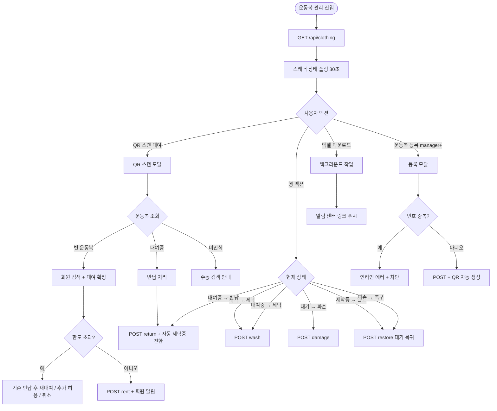
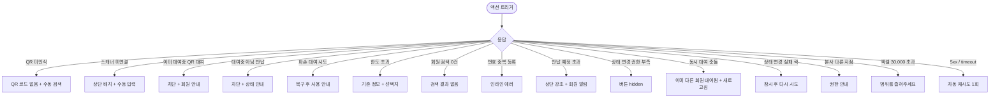

# SCR-055 운동복 관리 페이지

## 1. 화면 메타 정보

| 항목 | 값 |
|---|---|
| 작성일 | 2026-05-22 |
| 버전 | v1.0 |
| 상태 | 최신 통합본 반영 (정합화 완료) |
| 도메인 | D06 시설관리 |
| 화면 ID | SCR-055 |
| 화면명 | 운동복 관리 |
| 화면 유형 | 운영 화면 (Operational Screen) |
| 라우트 (URL) | `/clothing` |
| 플랫폼 | 데스크톱(기본), 태블릿 |
| 우선순위 | P1 (정식 운영) |
| 기능코드 | FAC-06 (운동복 관리) |
| 계약코드 | FAC-06, FAC-06-01 ~ FAC-06-09 |
| 부모 기능 prefix | FAC |
| Lv1 코드 | FAC-06 |
| Lv2 / Lv3 세분화 | FAC-06-01 ~ FAC-06-09 (현황 요약, 상태 탭, 검색, 목록 테이블, QR 대여, QR 반납, 상태 변경, 운동복 등록, 엑셀 다운로드) |
| 연계 화면 | SCR-051 사물함 배정, SCR-M004 회원 상세, SCR-057 소모품(세탁세제), SCR-097 감사 로그 |
| 호출 다이얼로그 | 본 화면 직접 호출 다이얼로그 없음 (인라인 모달 + QR 스캔 모달로 처리) |

이 문서는 운동복 관리 페이지에 대한 자기완결형 요구사항 정의서입니다.

## 2. 화면 개요와 목적

운동복 관리 페이지는 센터에서 회원에게 대여하는 운동복의 재고 현황과 대여 · 반납 · 세탁 · 파손 상태를 관리하는 화면입니다. QR 코드 스캔으로 대여와 반납을 빠르게 처리할 수 있으며, 운동복별 현재 상태와 대여 이력을 한눈에 파악할 수 있습니다.

운영 흐름은 회원 입장 시 QR 스캔으로 1초 대여, 반납 시 QR 스캔으로 자동 세탁중 전환, 세탁 완료 후 [세탁 완료] 액션으로 대기 복귀, 파손 발견 시 [파손] 토글로 대여 차단, 회원 1인당 대여 한도 정책 위반 시 모달 안내, 반납 예정일 초과 시 회원 알림 발송 등으로 이어집니다. 운동복 신규 등록 시 QR 코드가 자동 생성되어 인쇄·부착되며, 본사 통합 모드에서는 지점별 운동복이 분리 운영됩니다.

## 3. 진입 경로와 인접 화면

진입 경로는 사이드바 "시설 관리 > 운동복 관리", 대시보드의 반납 예정 초과 카드 클릭, 알림 센터의 반납 예정 초과 알림 클릭 등이 있습니다. 빠져나가는 인접 화면은 회원명 클릭 시 SCR-M004, 사물함 연계가 필요한 경우 SCR-051, 세탁 세제 등 소모품 출고 시 SCR-057, 감사 로그 SCR-097이 있습니다.

## 4. 레이아웃과 UI 구성

페이지 헤더 좌측에는 "운동복 관리" 타이틀과 지점 컨텍스트 배지가 있고, QR 스캐너 연결 상태 배지가 함께 표시됩니다. 미연결 시 빨강 배지로 "스캐너 미연결"이 표시됩니다. 헤더 우측에는 [QR 스캔] · [운동복 등록] · [엑셀 다운로드] 버튼이 배치됩니다.

현황 요약 카드 4개는 전체 운동복 수 / 대기(사용 가능) / 대여중 / 세탁중을 표시합니다. 카드 클릭 시 해당 상태 필터로 자동 이동합니다.

상태 탭은 전체 / 대기 / 대여중 / 세탁중 / 파손 5개이며 각 탭 우측에 카운트 배지가 표시됩니다. URL 쿼리 파라미터 `status`로 반영됩니다.

검색창은 운동복 번호 정확 매치 또는 대여 회원명 부분 매치로 디바운스 300ms를 적용합니다.

운동복 목록 테이블의 컬럼은 번호 / 사이즈(S·M·L·XL·XXL) / 타입(상의·하의·세트) / 상태 배지 / 대여 회원명 / 대여일 / 반납 예정일 / 메모 / 상태별 액션 버튼 순서입니다. 회원명 클릭은 SCR-M004로 이동합니다.

상태별 액션 버튼은 다음과 같이 분리됩니다.
- 대기: [세탁] · [파손]
- 대여중: [반납] · [세탁]
- 세탁중: [세탁 완료]
- 파손: [복구]

상태 배지는 색상으로 분리됩니다. 대기는 초록, 대여중은 주황, 세탁중은 회색, 파손은 빨강입니다.

반납 예정일이 초과된 운동복은 목록 상단에 강조 표시되어 운영자가 즉시 인지할 수 있습니다.

## 5. 탭 구성과 탭별 동작

상태 탭은 전체 / 대기 / 대여중 / 세탁중 / 파손 5개이며 어느 탭을 선택하느냐에 따라 표시되는 운동복 집합이 달라집니다. URL 쿼리 파라미터 `status`로 반영되며 탭별 카운트가 작은 배지로 표시됩니다.

탭 간 전환 시 검색어와 정렬은 유지되며, 데이터셋만 새로 fetch됩니다.

## 6. 버튼·아이콘·링크 액션 전체 정의

현황 요약 카드 4개는 클릭 시 해당 상태 필터가 자동 적용됩니다.

상태 탭 클릭은 즉시 결과 갱신 + URL 쿼리 동기화를 수행합니다.

[QR 스캔] 버튼은 QR 스캔 모달을 호출합니다. 모달에서 QR 코드를 스캔하거나 수동으로 번호를 입력하면 운동복이 조회됩니다. 빈 운동복이면 회원 검색 자동완성 + [대여 확정] 버튼이 표시되고, 대여중 운동복이면 [반납 처리] 버튼이 표시됩니다.

[운동복 등록] 버튼은 매니저 이상 권한자에게만 노출되며 클릭 시 신규 등록 모달이 열려 번호 · 사이즈 · 타입 · 메모를 입력합니다. 저장 시 QR 코드가 자동 생성되어 인쇄 가능합니다.

[엑셀 다운로드] 버튼은 현재 탭과 검색 필터를 적용한 결과를 다운로드합니다. 파일명은 `운동복현황_지점_YYYYMMDD.xlsx`이며 30,000행 초과 시 차단됩니다.

행의 상태별 액션 버튼은 현재 상태에 맞는 옵션만 노출됩니다. 대기의 [세탁] 클릭 시 즉시 세탁중 전환, [파손] 클릭 시 파손 상태 전환. 대여중의 [반납] 클릭 시 자동 세탁중 전환 + 회원 알림. 세탁중의 [세탁 완료] 클릭 시 대기 상태 복귀. 파손의 [복구] 클릭 시 대기 상태 복귀.

회원명 클릭은 SCR-M004로 이동합니다.

## 7. 호출되는 모달 동작

본 화면은 별도의 다이얼로그 컴포넌트 없이 인라인 모달로 처리됩니다.

### 7-1. QR 스캔 모달

[QR 스캔] 버튼으로 열립니다. 모달 상단에 "QR 스캔" 제목이 표시되고, QR 코드 입력 영역이 스캔 대기 상태(무선 아이콘 + 깜빡임)로 시각화됩니다. 스캐너 미연결 시 수동 번호 입력으로 폴백됩니다.

QR 조회 결과 빈 운동복이면 회원 검색 자동완성 입력란이 표시되어 회원을 선택하고 [대여 확정]을 누르면 단건 트랜잭션으로 대여 처리됩니다. 회원이 이미 한도(1세트 기본)에 도달했으면 "해당 회원은 이미 N세트 대여 중입니다" 안내가 표시되어 차단됩니다.

QR 조회 결과 대여중 운동복이면 [반납 처리] 버튼이 표시되어 누르면 즉시 세탁중 전환 + 회원 알림이 발송됩니다.

QR 코드 미인식 시 "해당 QR 코드의 운동복을 찾을 수 없습니다" 안내가 표시되며 수동 검색이 안내됩니다.

### 7-2. 운동복 등록 모달

[운동복 등록] 버튼으로 열립니다. 본문에 번호 입력 · 사이즈 선택 · 타입 선택 · 메모 입력이 있고, [저장] 클릭 시 QR 코드가 자동 생성되어 목록에 추가됩니다. 번호 중복 시 인라인 에러 "동일 번호가 이미 존재합니다"가 표시됩니다.

### 7-3. 회원 한도 초과 안내 모달

대여 시 회원이 이미 대여 한도에 도달한 경우 모달 안에 안내 + 기존 대여 정보 노출 + [기존 반납 후 재대여] / [추가 허용 권한자만] / [취소] 선택지가 제공됩니다.

## 8. 토스트와 확인 팝업과 알럿

성공 토스트는 "대여 완료", "반납 완료 + 세탁중 전환", "세탁 완료", "파손 처리", "복구 완료" 같은 문구로 표시됩니다.

실패 토스트는 "QR 코드를 찾을 수 없어요", "이미 [회원명]에게 대여 중이에요", "대여중 상태가 아니에요", "파손 운동복은 대여 불가", "한도 N세트 초과", "권한이 없어요" 같은 문구가 표시됩니다.

확인 팝업은 반납 예정일 초과 시 회원에게 자동 알림이 발송되며 운영자에게도 알림이 표시됩니다.

알럿은 권한 없는 계정 직접 URL 접근 시 차단됩니다. QR 스캐너 미연결 시 상단 배지로 즉시 안내됩니다.

## 9. 데이터 흐름과 외부 연동

화면 진입 시 `GET /api/clothing`이 호출되며 응답으로 운동복 배열과 4개 요약 카드 카운트가 내려옵니다.

QR 스캔은 `POST /api/clothing/qr-scan`으로 코드 조회를 수행합니다.

대여는 `POST /api/clothing/:id/rent`, 반납은 `POST /api/clothing/:id/return`, 세탁 전환은 `POST /api/clothing/:id/wash`, 파손은 `POST /api/clothing/:id/damage`, 복구는 `POST /api/clothing/:id/restore`로 처리됩니다.

운동복 등록은 `POST /api/clothing`이며 응답으로 자동 생성된 QR 코드가 포함됩니다.

엑셀 다운로드는 `GET /api/clothing/export`, QR 스캐너 상태는 `GET /api/clothing/scanner-status`, 사이즈별 재고는 `GET /api/clothing/size-stock`으로 조회됩니다.

반납 후 자동 세탁 전환은 반납 액션 처리 시 서버에서 자동으로 상태를 세탁중으로 갱신합니다.

NFR-19 반납 예정 초과 알림은 D+1 / D+3 시점에 회원에게 발송됩니다. NFR-19 파손 알림은 파손 처리 시 회원·운영자에게 발송됩니다.

회원 탈퇴·이관·삭제 이벤트 시 보유 운동복이 자동 반납 처리됩니다.

QR 스캐너 상태 폴링은 30초 주기로 화면 상단 연결 상태 배지를 갱신합니다.

사이즈별 재고 부족 알림 배치는 매일 08:00에 부족 사이즈를 운영자에게 알립니다.

운동복 대여 KPI 배치는 매주 월요일 04:00에 사이즈별 가동률 · 평균 대여 시간 · 파손율을 집계합니다.

일일 자동 만료 처리 배치는 매일 22:00에 당일 미반납 운동복을 운영자에게 알리며 강제 회수 옵션을 제공합니다.

모든 대여·반납·상태 변경·등록·삭제 처리는 감사 로그(SCR-097)에 actor · clothing_id · member_id · before-after 형태로 기록됩니다.

## 10. 화면 상태와 예외 처리

로딩 중 상태는 테이블 스켈레톤으로 표시됩니다. 정상 상태는 목록 표시, 빈 상태는 "운동복 데이터가 없습니다" 안내가 표시됩니다.

상태 배지는 대기(초록) · 대여중(주황) · 세탁중(회색) · 파손(빨강)으로 분리됩니다.

QR 조회 실패 상태는 "해당 QR 코드의 운동복을 찾을 수 없습니다" 오류 메시지가 표시됩니다.

예외 케이스별 처리는 다음과 같습니다.

QR 코드 미인식 시 수동 검색 안내가 표시됩니다.

QR 스캐너 미연결 시 상단 빨강 배지 + 수동 입력 가이드가 표시됩니다.

이미 대여중인 운동복 QR로 대여 시도 시 "이미 [회원명]에게 대여 중" 안내가 표시되어 차단됩니다.

대여중 아닌 운동복 반납 시도 시 "대여중 상태 아님 (현재: [상태])" 안내가 표시되어 반납이 차단됩니다.

파손 운동복 대여 시도 시 "파손 운동복은 대여 불가, 복구 후 사용하세요" 안내가 표시됩니다.

1인당 대여 한도 초과 시 "한도 N세트 초과" 안내 + 기존 대여 정보 노출 + 선택지가 제공됩니다.

회원 검색 0건 시 "검색 결과가 없어요" 안내가 표시됩니다.

번호 중복 등록 시 인라인 에러 "동일 번호 존재"가 표시되어 저장이 차단됩니다.

반납 예정일 초과 시 목록 상단 강조 + 회원 알림 발송이 일어납니다.

상태 변경 권한 부족 시 액션 버튼이 hidden 또는 비활성화됩니다.

동시 대여 충돌 시 "이미 다른 회원에게 대여됨" 안내 + 새로고침 안내가 표시됩니다.

상태 변경 실패(DB 락) 시 토스트 "잠시 후 다시 시도"가 표시됩니다.

본사 통합 모드 다른 지점 변경 시 권한 안내가 표시됩니다.

엑셀 다운로드 30,000행 초과 시 차단됩니다.

## 11. 권한별 처리

슈퍼관리자 · 본사 최고관리자 · 센터장 · 매니저는 전체 목록을 조회하고 등록 · 상태 변경 · QR 대여·반납 · 엑셀 다운로드 모든 기능을 사용할 수 있습니다.

FC · 스태프 · 프런트는 전체 목록을 조회하고 QR 대여 · 반납 · 상태 변경을 수행할 수 있습니다. 운동복 등록은 불가능하므로 [운동복 등록] 버튼이 노출되지 않습니다.

트레이너 · 읽기 전용은 현황 조회만 가능합니다.

권한 부족 시 단계별 차단이 적용되며 모든 권한 차단 이벤트는 감사 로그에 기록됩니다.

## 12. 메인 흐름

## 13. 에러와 예외 흐름

## 14. 핵심 디자인 요청사항

상태 배지는 대기(초록) · 대여중(주황) · 세탁중(회색) · 파손(빨강)으로 시각적으로 강하게 분리되어야 합니다. 색맹 운영자를 고려해 색상 + 텍스트 라벨이 함께 표시됩니다.

QR 스캔 모달의 스캔 대기 영역은 무선 아이콘 + 깜빡임으로 "지금 스캔하세요" 메시지를 시각적으로 전달해야 합니다.

스캐너 미연결 시 화면 상단에 빨강 배지가 항상 표시되어 운영자가 즉시 인지 가능해야 합니다.

목록 테이블의 상태별 액션 버튼은 현재 상태에 맞는 옵션만 노출되어 운영자가 잘못된 액션을 선택하지 않도록 가이드되어야 합니다.

반납 예정일 초과 운동복은 목록 상단에 강조 표시되어 운영자가 즉시 인지하고 회원에게 안내할 수 있어야 합니다.

운동복 등록 후 자동 생성된 QR 코드는 인쇄 가능한 형태로 미리보기가 표시되어야 합니다.

## 15. 운영 정책 (이 화면에 연결된 부분)

운동복 번호는 시스템 내 고유이며 중복 등록이 차단됩니다(UNIQUE 제약).

QR 코드는 운동복별 고유값으로 등록 시 자동 생성되며 인쇄 후 운동복에 부착됩니다.

사이즈는 S / M / L / XL / XXL 5종, 타입은 상의 / 하의 / 세트 3종입니다.

운동복 상태는 대기(available) / 대여중(rented) / 세탁중(washing) / 파손(damaged) 4종입니다.

대여 시 반납 예정일은 정책 기본값으로 자동 설정됩니다(당일 22:00 또는 +1일, 변경 가능).

반납 시 운동복 상태는 자동으로 "세탁중"으로 전환되며, 운영자가 직접 [세탁 완료]를 클릭해야 대기로 복귀합니다.

파손 처리된 운동복은 [복구] 액션으로 재사용 가능하며 폐기는 별도 삭제 처리됩니다.

회원 1인당 동시 대여 개수 정책: 1세트 기본 / N세트(테넌트 정책). 초과 시 대여 차단됩니다.

QR 스캔 대여는 빈 운동복 QR + 회원 검색 + [대여 확정] 트랜잭션 단건 처리이며, QR 스캔 반납은 대여중 운동복 QR + [반납 처리]로 상태 자동 세탁중 전환됩니다.

반납 예정일 초과 미반납 시 회원에게 NFR-19 알림이 발송됩니다(D+1 / D+3).

상태 변경 시 액션 버튼은 현재 상태에 맞는 옵션만 노출됩니다.

권한별 가시성은 다음과 같이 분리됩니다. 슈퍼관리자 · 센터장 · 매니저는 등록 · 삭제 · QR · 상태 모든 액션 가능. FC · 스태프 · 프런트는 QR 대여 · 반납 · 상태 변경 가능, 등록 불가. 트레이너 · 읽기 전용은 조회만 가능합니다.

본사 통합 모드는 지점별 운동복 분리 운영, 슈퍼관리자만 통합 조회 가능합니다.

모든 대여 · 반납 · 상태 변경 · 등록 · 삭제 처리는 감사 로그(SCR-097)에 actor · clothing_id · member_id · before-after 형태로 기록됩니다.

검색은 운동복 번호 정확 매치 또는 회원명 부분 매치이며 디바운스 300ms가 적용됩니다.

상태 탭 변경 시 즉시 결과 갱신 + URL 쿼리 동기화가 일어납니다.

엑셀 다운로드는 현재 적용된 탭·검색 결과이며 파일명은 `운동복현황_지점_YYYYMMDD.xlsx`입니다.

QR 스캐너 미연결 시 수동 번호 입력이 가능하며 상단 스캐너 연결 상태 배지가 노출됩니다.

파손 처리 시 운영자에게 [폐기 처리] 옵션 안내가 표시됩니다(폐기는 영구 삭제).

사이즈별 재고 통계는 카드 또는 부가 패널로 노출되며 부족 사이즈 알림이 발송됩니다.

대여 이력은 운동복별로 보관되며 90일 이상 유지됩니다.

이상의 모든 정책은 이 화면을 구현하고 운영하는 사람이 별도 문서 없이 이 한 장만 보면 이해할 수 있도록 풀어 적었습니다.
