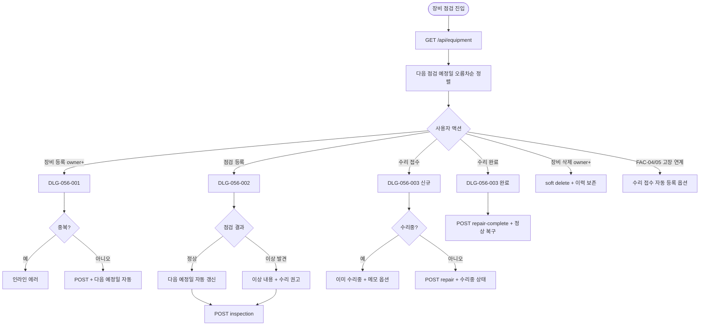

# SCR-056 장비 점검 일정 페이지

## 1. 화면 메타 정보

| 항목 | 값 |
|---|---|
| 작성일 | 2026-05-22 |
| 버전 | v1.0 |
| 상태 | 최신 통합본 반영 (정합화 완료) |
| 도메인 | D06 시설관리 |
| 화면 ID | SCR-056 |
| 화면명 | 장비 점검 일정 |
| 화면 유형 | 운영 화면 (Operational Screen) |
| 라우트 (URL) | `/equipment-check` |
| 플랫폼 | 데스크톱(기본), 태블릿 |
| 우선순위 | P1 (정식 운영) |
| 기능코드 | FAC-EXT-02 (장비 점검 일정) |
| 계약코드 | FAC-EXT-02, FAC-EXT-02-01 ~ FAC-EXT-02-07 |
| 부모 기능 prefix | FAC |
| Lv1 코드 | FAC-EXT-02 |
| Lv2 / Lv3 세분화 | FAC-EXT-02-01 ~ FAC-EXT-02-07 (현황 요약, 장비 목록, 장비 등록, 점검 등록, 수리 접수, 자동 알림, 점검 이력) |
| 연계 화면 | SCR-053 운동룸 관리, SCR-054 골프 타석 관리, STF-02 직원 상세, SCR-097 감사 로그 |
| 호출 다이얼로그 | DLG-056-001 장비 등록, DLG-056-002 점검 등록, DLG-056-003 수리 등록 |

이 문서는 장비 점검 일정 페이지에 대한 자기완결형 요구사항 정의서입니다.

## 2. 화면 개요와 목적

장비 점검 일정 페이지는 센터 내 운동 장비의 정기 점검 일정과 수리 이력을 관리하는 화면입니다. 장비별로 다음 점검 예정일을 설정하고, 점검 완료 후 결과를 기록하며, 고장 · 수리 접수부터 완료까지의 이력을 추적합니다. 점검이 지연되거나 수리가 필요한 장비를 한눈에 파악해 시설 안전을 유지하는 것이 목적입니다.

운영 흐름은 신규 장비 도입 시 [장비 등록]으로 정보 + 점검 주기 + 첫 점검 예정일을 설정하고, 정기 점검 진행 시 [점검 등록]으로 결과를 기록하면 점검 주기에 따라 다음 예정일이 자동 갱신됩니다. 회원이 고장을 신고하면 [수리 접수]로 증상·담당자·예상 완료일을 등록해 장비 상태가 "수리중"으로 변경되고, 수리 완료 후 [수리 완료 기록]으로 정상 상태로 복구합니다. 점검 기한이 초과되면 빨강 + 경고로 강조되어 즉시 조치를 유도하며, 운동룸(SCR-053)·골프 타석(SCR-054)에서 고장 토글 시 수리 접수가 자동 등록되는 옵션이 있습니다.

## 3. 진입 경로와 인접 화면

진입 경로는 사이드바 "시설 관리 > 장비 점검 일정", 대시보드의 점검 임박 카드 클릭, 운동룸·골프 타석 고장 토글 후 수리 접수 자동 등록, 알림 센터의 점검 임박·기한 초과 알림 등이 있습니다. 빠져나가는 인접 화면은 SCR-053, SCR-054, STF-02 직원 상세(담당자 클릭), SCR-097 감사 로그가 있습니다.

## 4. 레이아웃과 UI 구성

페이지 헤더 좌측에는 "장비 점검 일정" 타이틀과 지점 컨텍스트 배지가 있고, 우측에는 [장비 등록] · [엑셀 다운로드] 버튼이 배치됩니다.

현황 요약 카드 4개는 전체 장비 수 / 점검 예정(7일 이내) / 수리 중 / 정상 운영을 표시합니다. 점검 예정 카드 클릭 시 임박 필터, 수리 중 카드 클릭 시 수리중 필터가 자동 적용됩니다.

장비 목록 테이블의 컬럼은 장비명 / 장비 유형 / 설치 위치 / 마지막 점검일 / 다음 점검 예정일 / 점검 주기(월/분기/반기/연간) / 현재 상태(정상/점검 예정/수리중/고장) / 액션 버튼([점검 등록] · [수리 접수] · [수정] · [삭제])입니다.

강조 표시는 다음과 같습니다. 7일 이내 점검 예정은 주황색, 점검 기한 초과는 빨강 + 경고, 수리 중은 빨강, 고장은 빨강 + "사용 금지"입니다. 강조 색상 우선순위는 고장 > 기한 초과 > 수리중 > 점검 예정 > 정상 순서입니다.

테이블은 다음 점검 예정일 기준 오름차순 정렬이 기본이며 운영자가 변경 가능합니다.

## 5. 탭 구성과 탭별 동작

본 화면은 별도의 탭 분리 없이 상태 필터 드롭다운(전체 / 정상 / 점검 예정 / 수리중 / 고장)으로 분리됩니다. 상태 필터 변경 시 즉시 결과 갱신 + URL 쿼리 동기화가 일어납니다.

장비 유형 필터(전체 / 유산소 / 웨이트 / GX / 기타)는 별도의 드롭다운으로 제공됩니다.

## 6. 버튼·아이콘·링크 액션 전체 정의

현황 요약 카드 4개는 클릭 시 해당 필터가 자동 적용됩니다.

[장비 등록] 버튼은 owner 이상 권한자에게만 노출되며 DLG-056-001 장비 등록 다이얼로그를 호출합니다.

행의 [점검 등록] 버튼은 매니저 이상에게 노출되며 DLG-056-002를 호출하여 점검 결과를 기록합니다. 스태프는 점검 완료 기록만 가능합니다.

행의 [수리 접수] 버튼은 매니저 이상에게 노출되며 DLG-056-003을 신규 모드로 호출합니다. 수리중 장비에 대해서는 [수리 완료 기록]으로 라벨이 바뀌어 완료 처리 모드로 호출됩니다.

행의 [수정] 버튼은 owner 이상에게 노출되며 장비 정보 수정 모달을 호출합니다.

행의 [삭제] 버튼은 owner 이상에게만 노출되며 soft delete로 처리됩니다. 점검 이력은 영구 보존됩니다.

담당자 클릭은 STF-02 직원 상세로 이동합니다.

[엑셀 다운로드] 버튼은 검색·필터 결과를 다운로드하며 파일명은 `장비점검현황_지점_YYYYMMDD.xlsx`입니다.

## 7. 호출되는 모달 동작

### 7-1. DLG-056-001 장비 등록 다이얼로그

[장비 등록] 버튼으로 열립니다. 본문에 장비명(필수) · 장비 유형(유산소/웨이트/GX/기타) · 설치 위치 · 점검 주기(일 단위 입력) · 첫 점검 예정일 · 메모(선택) 입력 필드가 있습니다.

장비명 + 위치 조합은 동일 지점 내 고유로 중복 등록이 차단됩니다. 점검 주기 미선택 시 인라인 에러 "점검 주기를 선택해주세요"가 표시됩니다. 다음 점검 예정일 과거 입력 시 "과거 일자 불가"가 표시됩니다.

[저장] 클릭 시 장비가 목록에 추가되고 다음 점검 예정일이 자동 생성됩니다.

### 7-2. DLG-056-002 점검 등록 다이얼로그

행의 [점검 등록] 버튼으로 열립니다. 모달 상단에 "점검 등록 — [장비명]" 제목이 표시됩니다. 본문에 점검 완료일(기본 오늘) · 점검자 · 점검 결과(정상 / 이상 발견) · 이상 내용(이상 발견 시 활성화) · 다음 점검 예정일(주기에 따라 자동 계산, 수동 변경 가능) 입력 필드가 있습니다.

이상 발견 선택 시 수리 접수 권고 안내가 함께 표시됩니다.

[저장] 클릭 시 점검 이력이 기록되고 다음 점검 예정일이 자동 갱신됩니다.

### 7-3. DLG-056-003 수리 등록 다이얼로그

행의 [수리 접수] 또는 [수리 완료 기록] 버튼으로 열립니다. 신규 접수 모드에는 고장 내용 · 수리 접수일(기본 오늘) · 담당 수리업체/담당자 · 예상 완료일(선택) 입력 필드가 있습니다. 완료 처리 모드에는 수리 완료일 · 수리 결과 · 비용(선택) 입력 필드가 표시됩니다.

수리중 장비에 재수리 접수 시도 시 "이미 수리중 상태입니다" 안내가 표시되어 차단되거나 추가 메모 옵션이 제공됩니다.

[저장] 클릭 시 신규 접수는 장비 상태 "수리중"으로, 완료 처리는 "정상"으로 복구됩니다.

## 8. 토스트와 확인 팝업과 알럿

성공 토스트는 "장비가 등록되었어요", "점검이 등록되었어요", "수리가 접수되었어요", "수리 완료 기록되었어요" 같은 문구로 표시됩니다.

실패 토스트는 "동일 장비명 + 위치가 존재해요", "점검 주기 선택", "과거 일자 불가", "이미 수리중 상태", "권한이 없어요" 같은 문구가 표시됩니다.

확인 팝업은 점검 기한 초과 + 사용 차단 안내가 회원 시설 이용 시 표시되며 운영자에게 알림이 발송됩니다.

알럿은 권한 없는 계정 직접 URL 접근 시 차단됩니다.

## 9. 데이터 흐름과 외부 연동

화면 진입 시 `GET /api/equipment`가 호출됩니다. 장비 등록은 `POST /api/equipment`, 수정은 `PUT /api/equipment/:id`, 삭제는 `DELETE /api/equipment/:id`, 점검 등록은 `POST /api/equipment/:id/inspection`, 수리 접수는 `POST /api/equipment/:id/repair`, 수리 완료는 `POST /api/equipment/:id/repair-complete`, 이력 조회는 `GET /api/equipment/:id/history`로 처리됩니다.

점검 임박 자동 감지 배치는 매일 00:30에 D-7 이내 장비를 status=due로 갱신하고 D-7/D-3/D-1 알림을 발송합니다. 점검 기한 초과 자동 강조는 매일 00:30에 예정일 < 오늘 장비를 빨강 강조 + 추가 알림으로 처리합니다.

다음 점검 예정일 자동 갱신은 점검 등록 시 점검 주기에 따라 +30/90/180/365일 자동 계산됩니다.

NFR-19 운영자 알림은 점검 임박 · 기한 초과 · 수리 완료 시 발송됩니다.

FAC-04 운동룸 · FAC-05 골프 타석 고장 토글 시 수리 접수가 자동 등록되는 옵션이 있습니다(테넌트 정책).

회원 사용 차단 연계는 수리중 · 고장 상태 장비를 시설 이용 시 안내합니다.

장비 KPI 배치는 매주 월요일 04:00에 점검 완료율 · 평균 수리 시간 · 고장률을 집계합니다.

점검 이력 보관 배치는 매일 03:00에 90일 초과 이력을 데이터 웨어하우스로 이관합니다.

모든 등록 · 수정 · 점검 · 수리 · 삭제 처리는 감사 로그(SCR-097)에 actor · equipment_id · before-after 형태로 기록됩니다.

## 10. 화면 상태와 예외 처리

정상 운영 상태는 초록 배지로 표시됩니다. 점검 예정 임박(7일 이내)은 주황 + 날짜 강조, 점검 기한 초과는 빨강 + 경고 표시, 수리 중은 빨강 + 수리 접수일, 고장은 빨강 + 사용 금지 안내가 표시됩니다.

장비 없음 상태는 "등록된 장비가 없습니다" 안내 + [장비 등록] CTA가 표시됩니다.

예외 케이스별 처리는 다음과 같습니다.

장비명 중복 시 인라인 에러 "동일 장비명 + 위치가 존재합니다"가 표시되어 저장이 차단됩니다.

점검 주기 미선택 시 인라인 에러 "점검 주기 선택"이 표시됩니다.

점검 예정일 과거 입력 시 "과거 일자 불가"가 표시됩니다.

수리중 장비 재수리 시도 시 "이미 수리중 상태"가 표시되어 차단되거나 메모 추가 옵션이 제공됩니다.

수리 완료 미입력 필드 시 "수리 결과 입력 필요"가 표시됩니다.

담당자 검색 0건 시 "직원을 등록 후 다시 시도" 안내가 표시됩니다.

점검 기한 초과 시 빨강 + "기한 초과" 강조로 즉시 조치가 유도됩니다.

회원 사용 시도(고장) 시 시설 입구에서 "사용 금지" 안내가 표시되어 차단됩니다.

삭제 권한 부족 시 버튼이 hidden 됩니다.

본사 통합 모드 다른 지점 변경 시 권한 안내가 표시됩니다.

이력 90일 초과 조회 시 "최대 90일 범위 조회" 안내 + 별도 화면 안내가 표시됩니다.

점검 주기 변경 시 다음 예정일 영향 경고 + [계속] / [취소] 선택지가 제공됩니다.

동시 편집 충돌 시 "다른 사용자가 변경" 안내 + 새로고침이 안내됩니다.

엑셀 다운로드 30,000행 초과 시 차단됩니다.

## 11. 권한별 처리

슈퍼관리자 · 본사 최고관리자 · 센터장(owner)은 전체 장비 + 이력을 조회하고 등록 · 수정 · 삭제 · 점검 · 수리 모든 기능을 사용할 수 있습니다.

매니저는 전체 장비 + 이력을 조회하고 점검 · 수리가 가능하지만 장비 삭제는 불가능합니다.

FC · 스태프는 장비 목록 + 이력 조회와 점검 완료 기록만 가능합니다.

트레이너 · 읽기 전용은 현황 조회만 가능합니다.

권한 부족 시 단계별 차단이 적용되며 모든 권한 차단 이벤트는 감사 로그에 기록됩니다.

## 12. 메인 흐름



## 13. 에러와 예외 흐름

```mermaid
flowchart TD
    A([액션 트리거]) --> B{응답}
    B -->|장비명 중복| C[인라인 에러]
    B -->|점검 주기 미선택| D[인라인 에러]
    B -->|예정일 과거| E[인라인 에러]
    B -->|수리중 재수리| F["이미 수리중" + 메모 옵션]
    B -->|수리 완료 미입력| G[인라인 에러]
    B -->|담당자 검색 0건| H[직원 등록 안내]
    B -->|점검 기한 초과| I[빨강 강조 + 즉시 조치]
    B -->|회원 사용 시도 고장| J[시설 입구 "사용 금지"]
    B -->|삭제 권한 부족| K[버튼 hidden]
    B -->|본사 다른 지점| L[권한 안내]
    B -->|이력 90일 초과| M[기간 축소 안내]
    B -->|점검 주기 변경| N[경고 + 재산정]
    B -->|동시 편집 충돌| O[새로고침]
    B -->|5xx / timeout| P[자동 재시도 1회]
```

## 14. 핵심 디자인 요청사항

장비 상태 강조는 색상 우선순위(고장 > 기한 초과 > 수리중 > 점검 예정 > 정상)에 따라 한 행에 여러 상태가 겹쳐도 한 가지만 표시됩니다.

점검 기한 초과 행은 빨강 + 경고 아이콘으로 즉시 인지 가능해야 합니다. 7일 이내 점검 예정 행은 주황 + 날짜 강조로 표시됩니다.

DLG-056-002 점검 등록의 다음 점검 예정일은 주기에 따라 자동 계산되어 표시되지만 운영자가 수동 변경할 수도 있어야 합니다.

DLG-056-003 수리 등록은 신규 접수와 완료 처리 두 가지 모드를 가지며, 모드에 따라 입력 필드가 다르게 표시되어야 합니다.

## 15. 운영 정책 (이 화면에 연결된 부분)

장비 상태는 정상(normal) / 점검 예정(due) / 수리중(repair) / 고장(broken) 4종입니다.

점검 주기는 월간 / 분기(3개월) / 반기(6개월) / 연간 4종이며 등록 시 단일 선택입니다.

다음 점검 예정일이 7일 이내인 장비는 자동 "점검 예정" 상태로 표시되고 알림이 발송됩니다.

점검 기한 초과(예정일 < 오늘) 장비는 빨강 + "기한 초과" 경고로 강조되어 즉시 조치가 유도됩니다.

수리중 · 고장 장비는 회원 사용 차단 안내가 표시되고 운영자에게 알림이 발송됩니다.

점검 완료 시 다음 점검 예정일이 점검 주기에 따라 자동 갱신됩니다(예: 월간 → +30일).

점검 결과는 정상 / 경미한 이상 / 수리 필요 3종 + 자유 메모입니다.

수리 접수 시 증상 · 담당자 · 예상 완료일 필수 입력이며 담당자는 직원 검색입니다.

수리 완료 처리 시 수리 결과 · 소요 시간 · 비용 입력이 가능합니다.

장비명 + 위치(룸·층) 조합은 동일 지점 내 고유이며 중복 등록이 차단됩니다.

점검 · 수리 이력은 영구 보관되며 90일 초과 조회는 별도 분석 화면에서 처리됩니다.

장비 삭제는 owner 이상 권한이며 soft delete로 이력이 보존됩니다.

점검 주기 변경 시 다음 예정일 재산정 안내 + 운영자 확인 후 적용됩니다.

FAC-04 운동룸 · FAC-05 골프 타석 고장 토글 시 수리 접수가 자동 등록되는 옵션이 있습니다(테넌트 정책).

권한별 가시성은 다음과 같이 분리됩니다. 슈퍼관리자 · 센터장은 등록 · 수정 · 삭제 · 점검 · 수리 모두 가능. 매니저는 점검 · 수리 가능, 삭제 불가. FC · 스태프는 점검 완료 기록만 가능. 트레이너 · 읽기 전용은 조회만 가능합니다.

본사 통합 모드는 지점별 장비 분리 운영, 슈퍼관리자만 통합 조회 가능합니다.

모든 등록 · 수정 · 점검 · 수리 · 삭제 처리는 감사 로그(SCR-097)에 actor · equipment_id · before-after 형태로 기록됩니다.

점검 임박 알림은 점검 예정일 D-7/D-3/D-1에 발송되며 기한 초과 시 추가 알림이 발송됩니다.

수리 완료 후 정상 복구 시 다음 점검 예정일은 기존 주기를 유지합니다(수리는 점검과 별개).

검색은 장비명 · 위치 · 점검자 다중 검색이며 디바운스 300ms가 적용됩니다.

엑셀 다운로드는 검색·필터 결과이며 파일명은 `장비점검현황_지점_YYYYMMDD.xlsx`입니다.

이상의 모든 정책은 이 화면을 구현하고 운영하는 사람이 별도 문서 없이 이 한 장만 보면 이해할 수 있도록 풀어 적었습니다.
