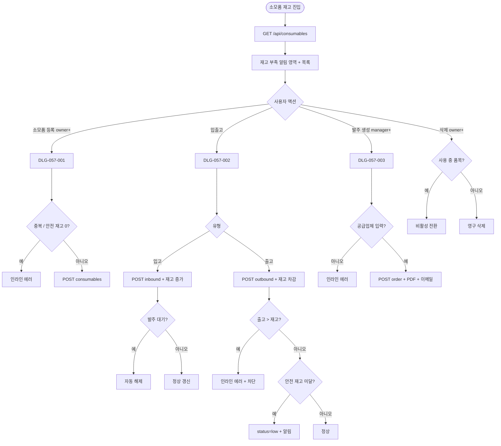
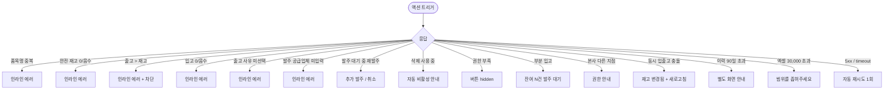

# SCR-057 소모품 재고 관리 페이지

## 1. 화면 메타 정보

| 항목 | 값 |
|---|---|
| 작성일 | 2026-05-22 |
| 버전 | v1.0 |
| 상태 | 최신 통합본 반영 (정합화 완료) |
| 도메인 | D06 시설관리 |
| 화면 ID | SCR-057 |
| 화면명 | 소모품 재고 관리 |
| 화면 유형 | 운영 화면 (Operational Screen) |
| 라우트 (URL) | `/consumables` |
| 플랫폼 | 데스크톱(기본), 태블릿 |
| 우선순위 | P1 (정식 운영) |
| 기능코드 | FAC-EXT-03 (소모품 재고 관리) |
| 계약코드 | FAC-EXT-03, FAC-EXT-03-01 ~ FAC-EXT-03-07 |
| 부모 기능 prefix | FAC |
| Lv1 코드 | FAC-EXT-03 |
| Lv2 / Lv3 세분화 | FAC-EXT-03-01 ~ FAC-EXT-03-07 (현황 요약, 재고 부족 알림, 소모품 목록, 등록, 입출고 처리, 발주 생성, 자동 알림) |
| 연계 화면 | SCR-058 청소 스케줄, SCR-055 운동복(세탁세제 등), SCR-097 감사 로그 |
| 호출 다이얼로그 | DLG-057-001 소모품 등록, DLG-057-002 입출고 처리, DLG-057-003 발주 생성 |

이 문서는 소모품 재고 관리 페이지에 대한 자기완결형 요구사항 정의서입니다.

## 2. 화면 개요와 목적

소모품 재고 관리 페이지는 샴푸 · 린스 · 바디워시 · 타월 · 비누 등 센터 운영에 필요한 소모품의 재고 현황을 관리하는 화면입니다. 현재 재고 수량을 실시간으로 파악하고, 입고 · 출고를 기록하며, 재고가 기준 수량 이하로 떨어진 품목을 식별해 적시에 발주할 수 있도록 지원합니다.

운영 흐름은 신규 소모품 도입 시 [소모품 등록]으로 품목명·카테고리·단위·안전 재고를 입력하고, 일일 사용 시 [입출고]→출고 탭에서 수량·사유를 기록해 재고를 자동 차감하며, 공급업체 입고 시 [입출고]→입고 탭에서 수량·공급업체·단가를 기록해 재고를 증가시킵니다. 안전 재고 미달 시 자동 "부족" 상태로 전환되고 운영자에게 알림이 발송되며, [발주 생성]으로 부족 품목에 발주서를 만들면 입고 시 자동으로 발주 대기가 해제됩니다.

## 3. 진입 경로와 인접 화면

진입 경로는 사이드바 "시설 관리 > 소모품 재고", 대시보드의 재고 부족 카드 클릭, 알림 센터의 부족·발주 권장 알림 등이 있습니다. 빠져나가는 인접 화면은 SCR-058 청소(소모품 자동 출고 연계), SCR-055 운동복(세탁세제 등), SCR-097 감사 로그가 있습니다.

## 4. 레이아웃과 UI 구성

페이지 헤더 좌측에는 "소모품 재고 관리" 타이틀과 지점 컨텍스트 배지가 있고, 우측에는 [소모품 등록] · [엑셀 다운로드] 버튼이 배치됩니다.

현황 요약 카드 4개는 전체 품목 수 / 재고 부족 품목 수 / 이번 달 총 출고량 / 발주 대기 건수를 표시합니다.

재고 부족 알림 영역은 기준 수량(안전 재고) 이하로 떨어진 품목을 상단에 별도로 강조 표시합니다. 운영자가 화면 진입 즉시 부족 품목을 인지하고 발주 결정을 할 수 있도록 시각적으로 두드러집니다.

소모품 목록 테이블의 컬럼은 품목명 / 카테고리 / 단위(개·박스·L) / 현재 재고 / 안전 재고 기준 / 최근 입고일 / 최근 출고일 / 재고 상태 배지 / 액션 버튼([입출고] · [발주] · [수정] · [삭제]) 순서입니다.

재고 상태 배지는 정상(초록) · 부족(빨강) · 없음(빨강 + "발주 필요") · 발주 대기(주황) 색상으로 분리됩니다. 강조 색상 우선순위는 없음 > 부족 > 발주 대기 > 정상 순서입니다.

## 5. 탭 구성과 탭별 동작

본 화면은 별도의 탭 분리 없이 카테고리 필터(전체 / 위생용품 / 청소도구 / 사무용품 / 운동기구 / 기타)와 상태 필터(전체 / 정상 / 부족 / 없음 / 발주 대기)로 분리됩니다. 필터 변경 시 즉시 결과 갱신 + URL 쿼리 동기화가 일어납니다.

## 6. 버튼·아이콘·링크 액션 전체 정의

현황 요약 카드 4개는 클릭 시 해당 필터가 자동 적용됩니다.

[소모품 등록] 버튼은 owner 이상 권한자에게 노출되며 DLG-057-001을 호출합니다.

행의 [입출고] 버튼은 매니저 이상에게 노출되며 DLG-057-002를 호출하여 입고 또는 출고 처리합니다. 스태프는 출고만 가능합니다.

행의 [발주] 버튼은 매니저 이상에게 노출되며 부족 품목 또는 발주 대상 품목에서 DLG-057-003을 호출합니다.

행의 [수정] 버튼은 owner 이상에게 노출되며 소모품 정보 수정 모달을 호출합니다.

행의 [삭제] 버튼은 owner 이상에게만 노출되며 사용 중 품목은 비활성 전환(soft delete), 미사용 품목은 영구 삭제됩니다.

[엑셀 다운로드] 버튼은 검색·필터 결과를 다운로드하며 파일명은 `소모품현황_지점_YYYYMMDD.xlsx`입니다.

## 7. 호출되는 모달 동작

### 7-1. DLG-057-001 소모품 등록 다이얼로그

[소모품 등록] 버튼으로 열립니다. 본문에 품목명(필수) · 카테고리(위생용품/청소도구/사무용품/운동기구/기타 5종) · 단위(개/박스/L/m/kg) · 안전 재고 기준 · 초기 재고 수량 · 공급업체(선택) 입력 필드가 있습니다. 카테고리는 본 화면 15장 운영 정책의 카테고리 마스터와 동일합니다.

품목명 중복 시 인라인 에러 "동일 품목명이 존재합니다"가 표시됩니다. 안전 재고 0 또는 음수 입력 시 "안전 재고는 1 이상"이 표시됩니다.

[저장] 클릭 시 소모품이 목록에 추가됩니다.

### 7-2. DLG-057-002 입출고 처리 다이얼로그

행의 [입출고] 버튼으로 열립니다. 모달 상단에 "입출고 처리 — [품목명]" 제목이 표시됩니다. 본문에 처리 유형 선택(입고/출고 탭) · 현재 재고 표시(읽기 전용) · 처리 수량 입력 · 처리 일자(기본 오늘) · 공급업체(입고)/사용 사유(출고) · 처리 후 예상 재고(자동 계산) 표시가 있습니다.

출고 수량 > 현재 재고 시 인라인 에러 "현재 재고를 초과할 수 없습니다 (현재: N)"가 표시되어 저장이 차단됩니다.

[저장] 클릭 시 재고 수량이 갱신되고 입출고 이력이 기록됩니다.

### 7-3. DLG-057-003 발주 생성 다이얼로그

재고 부족 품목의 [발주] 버튼으로 열립니다. 모달 상단에 "발주 생성 — [품목명]" 제목이 표시됩니다. 본문에 현재 재고 표시 · 안전 재고 기준 표시 · 발주 수량 입력(권장 수량 기본값) · 공급업체 선택/입력 · 희망 납기일(선택) · 비고(선택) 입력 필드가 있습니다.

발주 대기 상태에서 재발주 시도 시 경고 "이미 발주 대기 중입니다" + [추가 발주] / [취소] 선택지가 제공됩니다.

[발주서 생성] 클릭 시 발주 상태로 변경되고 담당자에게 알림이 발송되며 발주서가 PDF 또는 이메일로 발송됩니다.

## 8. 토스트와 확인 팝업과 알럿

성공 토스트는 "소모품이 등록되었어요", "재고가 갱신되었어요", "발주가 생성되었어요", "삭제되었어요" 같은 문구로 표시됩니다.

실패 토스트는 "동일 품목명 존재", "현재 재고 초과", "안전 재고 1 이상", "공급업체 입력", "권한이 없어요" 같은 문구가 표시됩니다.

확인 팝업은 사용 중 품목 삭제 시 자동 비활성 전환 안내 + [확인] / [취소] 선택지가 제공됩니다.

알럿은 권한 없는 계정 직접 URL 접근 시 차단됩니다.

## 9. 데이터 흐름과 외부 연동

화면 진입 시 `GET /api/consumables`가 호출됩니다. 등록은 `POST /api/consumables`, 수정은 `PUT /api/consumables/:id`, 삭제는 `DELETE /api/consumables/:id`, 입고는 `POST /api/consumables/:id/inbound`, 출고는 `POST /api/consumables/:id/outbound`, 발주는 `POST /api/consumables/:id/order`, 발주 완료는 `POST /api/consumables/:id/order-complete`, 이력 조회는 `GET /api/consumables/:id/history`, 발주서 PDF는 `GET /api/consumables/order-pdf`로 처리됩니다.

부족 자동 감지 배치는 매일 00:30 + 출고 이벤트 시 안전 재고 미달 품목을 status=low로 갱신하고 알림을 발송합니다.

재고 0 자동 감지는 출고 이벤트 시 status=empty + "발주 필요" 강조를 표시합니다.

발주 대기 자동 해제는 입고 처리(전체 입고) 시 status=normal/low로 자동 전환됩니다.

NFR-19 부족 알림은 부족 또는 없음 발생 시 + 매일 09:00에 운영자에게 발송됩니다.

출고 사유 통계 배치는 매주 월요일 04:00에 사유별 통계를 갱신합니다.

FAC-EXT-04 청소 연계: 청소 완료 시(옵션) 사용 소모품이 자동 출고 기록됩니다(테넌트 정책).

발주서 생성 자동화는 발주 생성 시 PDF가 생성되고 이메일이 발송됩니다.

소모품 KPI 배치는 매주 월요일 04:00에 카테고리별 사용량 · 재고 회전율을 집계합니다.

입출고 이력 보관 배치는 매일 03:00에 90일 초과 데이터를 데이터 웨어하우스로 이관합니다.

모든 등록 · 입출고 · 발주 · 삭제 처리는 감사 로그(SCR-097)에 actor · consumable_id · before-after 형태로 기록됩니다.

## 10. 화면 상태와 예외 처리

정상 재고 상태는 초록 배지로 표시됩니다. 재고 부족(안전 재고 이하)은 빨강 배지 + 현재 재고 수량 강조, 재고 없음은 빨강 + "발주 필요" 안내, 발주 대기 중은 주황 배지로 표시됩니다.

품목 없음 상태는 "등록된 소모품이 없습니다" 안내 + [소모품 등록] CTA가 표시됩니다.

예외 케이스별 처리는 다음과 같습니다.

품목명 중복 시 인라인 에러 "동일 품목명 존재"가 표시됩니다.

안전 재고 0 또는 음수 입력 시 인라인 에러 "1 이상"이 표시됩니다.

출고 수량 > 재고 시 인라인 에러 "재고 초과 (현재: N)"가 표시되어 차단됩니다.

입고 수량 0 또는 음수 시 인라인 에러 "1 이상"이 표시됩니다.

출고 사유 미선택 시 인라인 에러 "사유 선택"이 표시됩니다.

발주 공급업체 미입력 시 인라인 에러 "공급업체 입력"이 표시됩니다.

발주 대기 중 재발주 시 경고 + [추가 발주] / [취소] 선택지가 제공됩니다.

삭제 시 사용 중 품목은 자동 비활성 전환 안내가 표시됩니다.

권한 부족 액션 시 버튼이 hidden 됩니다.

부분 입고 처리 시 "잔여 N건 발주 대기 유지" 안내가 표시됩니다.

본사 통합 모드 다른 지점 변경 시 권한 안내가 표시됩니다.

동시 입출고 충돌 시 "재고가 변경되었습니다, 새로고침" 안내가 표시됩니다.

이력 90일 초과 조회 시 별도 화면 안내가 표시됩니다.

엑셀 다운로드 30,000행 초과 시 차단됩니다.

## 11. 권한별 처리

슈퍼관리자 · 본사 최고관리자 · Owner(지점장)은 전체 + 이력을 조회하고 등록 · 수정 · 삭제 · 입출고 · 발주 모든 기능을 사용할 수 있습니다.

매니저는 전체 + 이력을 조회하고 입출고 · 발주가 가능하지만 삭제는 불가능합니다.

FC · 스태프는 전체 + 이력을 조회하고 출고 기록만 가능합니다.

트레이너 · 읽기 전용은 현황 조회만 가능합니다.

권한 부족 시 단계별 차단이 적용되며 모든 권한 차단 이벤트는 감사 로그에 기록됩니다.

## 12. 메인 흐름

## 13. 에러와 예외 흐름

## 14. 핵심 디자인 요청사항

재고 부족 알림 영역은 화면 상단에 가장 두드러지게 배치되어 운영자가 진입 즉시 부족 품목을 인지할 수 있어야 합니다. 부족 품목 수가 큰 글씨로 표시되고 클릭 시 부족 필터로 이동합니다.

재고 상태 배지는 정상(초록) · 부족(빨강) · 없음(빨강 + "발주 필요") · 발주 대기(주황)으로 색상이 강하게 분리되어야 합니다. 색상 우선순위(없음 > 부족 > 발주 대기 > 정상)에 따라 한 행에 여러 상태가 겹쳐도 한 가지만 표시됩니다.

DLG-057-002 입출고 처리의 처리 후 예상 재고는 운영자가 수량 입력 시 실시간으로 자동 계산되어 표시되어야 합니다. 운영자가 잘못된 수량을 입력하지 않도록 시각적으로 즉시 확인 가능해야 합니다.

DLG-057-003 발주 생성의 권장 수량은 안전 재고 + 평균 출고량 기반으로 자동 계산되어 기본값으로 표시되어야 합니다.

## 15. 운영 정책 (이 화면에 연결된 부분)

소모품 상태는 정상(normal) / 부족(low) / 없음(empty) / 발주 대기(pending) 4종입니다.

카테고리는 위생용품 / 청소도구 / 사무용품 / 운동기구 / 기타이며 테넌트 정의가 가능합니다.

단위는 개 / 박스 / 리터 / 미터 / kg 등이며 테넌트 정의가 가능합니다.

안전 재고 기준은 등록 시 필수 입력이며 1 이상입니다.

안전 재고 기준 이하 품목은 자동으로 "부족" 상태로 표시되고 운영자 알림이 발송됩니다.

재고 0 품목은 자동 "없음" 상태 + "발주 필요" 강조로 표시됩니다.

발주 대기 상태는 발주서 생성 후 입고 처리 시 자동 해제됩니다.

입고 처리 시 수량 · 공급업체 · 단가 · 일자 필수 입력이며 단가는 비용 집계용입니다.

출고 처리 시 수량 · 사유 · 일자 필수 입력이며 사유는 분류별 통계에 활용됩니다.

출고 수량 > 현재 재고 시 차단되며 운영자 수동 조정이 필요합니다.

출고 사유 분류는 청소 / 시설 / 이벤트 / 회원 제공 / 기타이며 테넌트 정의가 가능합니다.

발주 생성 시 수량 · 공급업체 · 예상 도착일 입력이며 발주서는 PDF 또는 이메일 발송 옵션이 제공됩니다.

발주 후 부분 입고가 가능하며 잔여 수량은 발주 대기 상태를 유지합니다.

소모품 삭제는 owner 이상 권한이며 사용 중 품목은 비활성 전환(soft delete), 미사용 품목은 영구 삭제됩니다.

권한별 가시성은 다음과 같이 분리됩니다. 슈퍼관리자 · Owner(지점장)은 모든 작업 가능. 매니저는 입출고 · 발주 가능, 삭제 불가. FC · 스태프는 출고 기록만 가능. 트레이너 · 읽기 전용은 조회만 가능합니다.

본사 통합 모드는 지점별 소모품 분리 운영, 슈퍼관리자만 통합 조회 가능합니다.

모든 등록 · 입출고 · 발주 · 삭제는 감사 로그(SCR-097)에 actor · consumable_id · before-after 형태로 기록됩니다.

부족 알림은 안전 재고 미달 시 즉시 + 매일 09:00 운영자에게 재발송됩니다.

발주 권장 알림은 재고 0 품목 매일 09:00에 운영자 알림으로 발송됩니다.

입출고 이력 보관은 영구 보존이며 90일 초과는 별도 분석 화면에서 처리됩니다.

엑셀 다운로드는 검색·필터 결과이며 파일명은 `소모품현황_지점_YYYYMMDD.xlsx`입니다.

FAC-EXT-04 청소 연계: 청소 완료 시 사용 소모품이 자동 출고 기록되는 옵션이 있습니다(테넌트 정책).

이상의 모든 정책은 이 화면을 구현하고 운영하는 사람이 별도 문서 없이 이 한 장만 보면 이해할 수 있도록 풀어 적었습니다.
