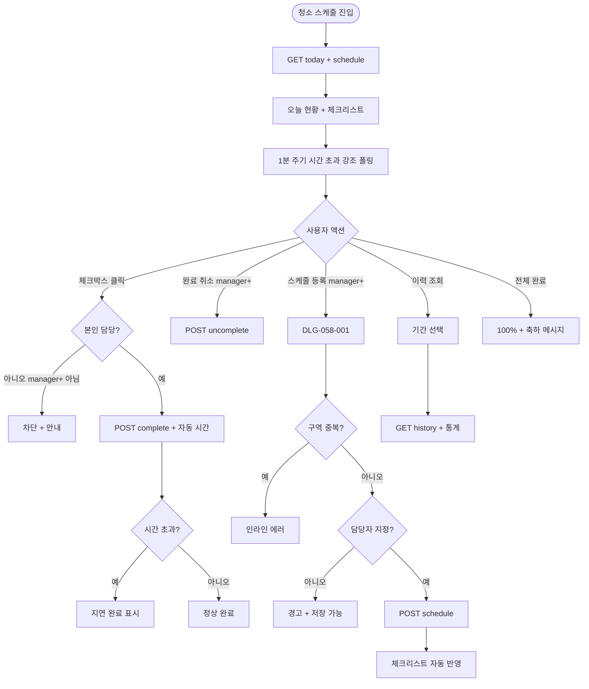
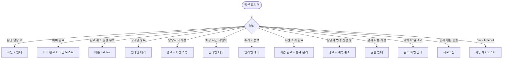

# SCR-058 청소 스케줄 페이지

## 1. 화면 메타 정보

| 항목 | 값 |
|---|---|
| 작성일 | 2026-05-22 |
| 버전 | v1.0 |
| 상태 | 최신 통합본 반영 (정합화 완료) |
| 도메인 | D06 시설관리 |
| 화면 ID | SCR-058 |
| 화면명 | 청소 스케줄 |
| 화면 유형 | 운영 화면 (Operational Screen) |
| 라우트 (URL) | `/cleaning-schedule` |
| 플랫폼 | 데스크톱(기본), 태블릿 |
| 우선순위 | P1 (정식 운영) |
| 기능코드 | FAC-EXT-04 (청소 스케줄) |
| 계약코드 | FAC-EXT-04, FAC-EXT-04-01 ~ FAC-EXT-04-07 |
| 부모 기능 prefix | FAC |
| Lv1 코드 | FAC-EXT-04 |
| Lv2 / Lv3 세분화 | FAC-EXT-04-01 ~ FAC-EXT-04-07 (오늘 현황, 체크리스트, 정기 일정, 스케줄 등록, 완료 처리, 이력 조회, 미지정 강조) |
| 연계 화면 | SCR-057 소모품, STF-02 직원 상세, SCR-097 감사 로그 |
| 호출 다이얼로그 | DLG-058-001 청소 스케줄 등록 |

이 문서는 청소 스케줄 페이지에 대한 자기완결형 요구사항 정의서입니다.

## 2. 화면 개요와 목적

청소 스케줄 페이지는 센터 내 구역별 청소 담당자와 정기 청소 일정을 관리하는 화면입니다. 오늘의 청소 완료 여부를 체크하고, 정기 청소(주간·월간) 일정을 등록하며, 청소 완료 이력을 기록합니다. 담당자별 청소 현황을 파악해 시설 위생 관리의 누락을 방지하는 것이 목적입니다.

운영 흐름은 매일 담당자가 청소 완료 후 체크박스를 클릭하면 완료 시간이 자동 기록되고, 매니저는 [청소 스케줄 등록]으로 정기 청소 일정을 등록하며, 시간 초과 미완료 구역은 빨강 강조로 즉시 인지됩니다. 담당자가 미지정된 정기 일정은 상단에 강조 + 매일 09:00 알림으로 운영자에게 인지가 유도되며, 모든 구역 완료 시 100% + 축하 메시지로 팀 사기를 진작합니다. 보건 감사 등 외부 감사 시 이력 조회로 PDF 출력하여 자료 제출이 가능합니다.

## 3. 진입 경로와 인접 화면

진입 경로는 사이드바 "시설 관리 > 청소 스케줄", 대시보드의 청소 미완료 카드 클릭, 알림 센터의 시간 초과·미지정 알림 등이 있습니다. 빠져나가는 인접 화면은 STF-02 직원 상세(담당자 클릭), SCR-057 소모품(자동 출고 연계), SCR-097 감사 로그가 있습니다.

## 4. 레이아웃과 UI 구성

페이지 헤더 좌측에는 "청소 스케줄" 타이틀과 지점 컨텍스트 배지가 있고, 우측에는 [청소 스케줄 등록] · [이력 조회] 버튼이 배치됩니다.

오늘의 청소 현황 카드 4개는 오늘 전체 구역 수 / 완료 구역 수 / 미완료 구역 수 / 완료율(%)을 표시합니다. 완료율 100%일 때 카드에 축하 메시지가 함께 표시됩니다.

본문 상단에는 청소 구역 체크리스트가 있습니다. 컬럼은 구역명 / 청소 유형(일일·정기) / 담당자 / 예정 시간 / 완료 체크박스 / 완료 시간 순서입니다. 담당자 클릭은 STF-02로 이동합니다.

체크박스 클릭 시 완료 시간이 자동 기록되며 행 배경이 옅은 초록으로 변합니다. 시간 초과 미완료(예정 시간 경과) 행은 빨강 강조로 표시됩니다. 담당자 미지정 행은 상단에 강조 표시됩니다.

본문 하단에는 정기 청소 일정 캘린더 · 목록 영역이 있어 주간 · 월간 정기 일정을 달력 또는 목록 뷰로 표시합니다.

이력 조회 영역은 기간 선택 후 완료 이력 + 담당자별 통계를 표시합니다.

## 5. 탭 구성과 탭별 동작

본 화면은 별도의 탭 분리 없이 보기 전환(오늘 체크리스트 / 정기 일정 캘린더 / 이력 조회)으로 분리됩니다. URL 쿼리 파라미터 `view`로 반영됩니다.

청소 유형 필터(전체 / 일일 / 주간 / 월간)는 별도의 드롭다운으로 제공됩니다.

## 6. 버튼·아이콘·링크 액션 전체 정의

오늘 현황 카드는 클릭 시 해당 상태 필터가 자동 적용됩니다.

[청소 스케줄 등록] 버튼은 매니저 이상 권한자에게 노출되며 DLG-058-001을 호출합니다.

체크리스트의 완료 체크박스 클릭 시 완료 시간이 자동 기록됩니다. 담당자는 본인 담당 구역만 체크 가능하며, 매니저 이상은 모든 구역 체크 가능합니다. 이미 완료된 구역의 재체크는 권한자(매니저+)만 가능합니다.

행의 [수정] · [삭제] 버튼은 owner 이상에게 노출되며 스케줄 수정 모달 또는 soft delete 처리가 진행됩니다.

담당자 이름 클릭은 STF-02 직원 상세로 이동합니다.

[이력 조회] 버튼은 기간 선택 후 완료 이력 + 담당자별 통계를 표시합니다.

## 7. 호출되는 모달 동작

### 7-1. DLG-058-001 청소 스케줄 등록 다이얼로그

[청소 스케줄 등록] 버튼으로 열립니다. 본문에 구역명 입력 · 청소 유형 선택(일일 / 주간 / 월간) · 담당자 선택(직원 검색) · 예정 시간 입력(HH:mm) · 요일 선택(주간 청소 시 활성화) · 일자 선택(월간 청소 시 활성화) · 시작일 입력 필드가 있습니다.

청소 유형에 따라 요일/일자 선택 필드가 동적으로 표시됩니다. 일일 선택 시 요일·일자 숨김, 주간 선택 시 요일 다중 선택 활성화, 월간 선택 시 일자 선택 활성화됩니다.

구역명 중복 시 인라인 에러 "동일 구역명 존재"가 표시됩니다. 담당자 미지정 등록 시 경고 "담당자 미지정으로 저장할까요?" + [확인] / [담당자 지정] 선택지가 제공됩니다(저장은 가능). 예정 시간 미입력 시 인라인 에러가 표시됩니다.

[저장] 클릭 시 청소 일정이 등록되고 체크리스트에 자동 반영됩니다.

## 8. 토스트와 확인 팝업과 알럿

성공 토스트는 "완료 처리되었어요", "청소 스케줄이 등록되었어요", "스케줄이 수정되었어요" 같은 문구로 표시됩니다.

실패 토스트는 "동일 구역명 존재", "예정 시간 입력", "본인 담당 구역만 체크 가능", "이미 완료 처리됨", "권한이 없어요" 같은 문구가 표시됩니다.

확인 팝업은 담당자 미지정 등록 시 "담당자 미지정으로 저장할까요?" + [확인] / [담당자 지정] 선택지가 제공됩니다.

알럿은 권한 없는 계정 직접 URL 접근 시 차단됩니다.

## 9. 데이터 흐름과 외부 연동

화면 진입 시 `GET /api/cleaning/today`와 `GET /api/cleaning/schedule`이 호출됩니다.

스케줄 등록은 `POST /api/cleaning/schedule`, 수정은 `PUT /api/cleaning/schedule/:id`, 삭제는 `DELETE /api/cleaning/schedule/:id`, 완료 처리는 `POST /api/cleaning/:id/complete`, 완료 취소는 `POST /api/cleaning/:id/uncomplete`, 이력 조회는 `GET /api/cleaning/history`, 담당자별 통계는 `GET /api/cleaning/staff-stats`로 처리됩니다.

정기 일정 자동 반복 생성 배치는 매일 00:00에 등록된 주기 기반으로 자동 일정을 생성합니다.

시간 초과 미완료 자동 강조 배치는 1분 주기로 예정 시간 경과 미완료 구역을 빨강 강조 + 알림 발송으로 처리합니다.

NFR-19 시간 초과 알림은 예정 시간 경과 + 미완료 시 운영자 + 담당자에게 푸시 · 앱 알림으로 발송됩니다.

NFR-19 담당자 미지정 알림은 매일 09:00에 미지정 일정을 운영자에게 알립니다.

FAC-EXT-03 소모품 자동 출고 연계는 청소 완료 시(정책 활성) 사용 소모품을 자동 출고 기록합니다.

담당자별 통계 배치는 매주 월요일 04:00에 직원별 완료율 · 지연율 · 구역 분포를 집계합니다.

청소 KPI 배치는 매주 월요일 04:00에 구역별 완료율 · 평균 소요 시간을 집계합니다.

이력 보관 배치는 매일 03:00에 90일 초과 이력을 데이터 웨어하우스로 이관합니다.

직원 변경 이벤트 연계는 직원 퇴직 · 이관 시 담당 일정을 자동 미지정 + 알림으로 처리합니다.

모든 등록 · 완료 · 수정 · 삭제 처리는 감사 로그(SCR-097)에 actor · schedule_id · completion_time · before-after 형태로 기록됩니다.

## 10. 화면 상태와 예외 처리

완료 상태는 초록 체크 아이콘 + 완료 시간 + 행 배경 옅은 초록으로 표시됩니다. 미완료 상태는 빈 체크박스로 표시됩니다. 시간 초과 미완료는 빨강 강조로 표시됩니다.

오늘 일정 없음 상태는 "오늘 예정된 청소 일정이 없습니다" 안내가 표시됩니다.

전체 완료 상태는 완료율 100% + 축하 메시지로 표시됩니다.

예외 케이스별 처리는 다음과 같습니다.

본인 담당 외 구역 체크 시도 시 "본인 담당 구역만 체크 가능합니다" 안내가 표시되어 차단됩니다(매니저+는 모든 구역 가능).

이미 완료된 구역 재체크 시도 시 토스트 "이미 완료 처리된 구역입니다"가 표시되어 변경이 차단됩니다. 완료 취소는 매니저+ 권한자만 가능합니다.

완료 취소 권한 부족 시 버튼이 hidden 됩니다.

구역명 중복 등록 시 인라인 에러로 차단됩니다.

담당자 미지정 등록 시 경고 + 저장 가능 선택지가 제공됩니다.

예정 시간 미입력 시 인라인 에러로 차단됩니다.

정기 일정 주기 미선택 시 인라인 에러로 차단됩니다.

시간 초과 후 완료 처리 시 "지연 완료" 표시 + 통계 분리 집계가 일어납니다.

담당자 변경 진행 중 일정 시 경고 + [계속] / [취소] 선택지가 제공됩니다.

본사 통합 모드 다른 지점 변경 시 권한 안내가 표시됩니다.

이력 90일 초과 조회 시 별도 화면 안내가 표시됩니다.

동시 편집 충돌 시 "다른 사용자가 변경" 안내 + 새로고침이 안내됩니다.

## 11. 권한별 처리

슈퍼관리자 · 본사 최고관리자 · Owner(지점장)은 전체 + 이력을 조회하고 등록 · 수정 · 삭제 · 담당자 지정 · 완료 처리 모든 기능을 사용할 수 있습니다.

매니저는 전체 + 이력을 조회하고 등록 · 완료 체크가 가능합니다.

FC · 스태프는 담당 구역만 조회하고 담당 구역 완료 체크만 가능합니다.

트레이너 · 읽기 전용은 현황 조회만 가능합니다.

권한 부족 시 단계별 차단이 적용됩니다.

## 12. 메인 흐름

## 13. 에러와 예외 흐름

## 14. 핵심 디자인 요청사항

완료 체크박스는 클릭 시 시간 기록과 함께 행 배경이 부드럽게 초록으로 변하는 시각적 피드백이 일어나야 합니다.

시간 초과 미완료 행은 빨강 강조로 즉시 인지 가능해야 하며, 1분 주기 폴링으로 자동 갱신됩니다.

담당자 미지정 행은 상단 강조 영역에 별도로 노출되어 운영자가 즉시 배정할 수 있도록 유도되어야 합니다.

전체 완료 시 100% + 축하 메시지는 시각적으로 두드러지게 표시되어 팀 사기를 진작시킵니다.

이력 조회 결과는 PDF 출력 가능한 형태로 표시되어 보건 감사 등 외부 자료 제출에 활용 가능해야 합니다.

## 15. 운영 정책 (이 화면에 연결된 부분)

청소 유형은 일일 / 주간 / 월간 3종이며 등록 시 단일 선택입니다.

청소 주기 정책은 일일은 매일, 주간은 요일 선택(다중), 월간은 매월 지정일 또는 지정 번째 요일입니다.

구역명은 동일 지점 내 고유이며 중복 등록이 차단됩니다.

담당자는 직원 검색으로 지정하며 미지정 시 경고 + 상단 강조가 표시됩니다(저장은 가능).

예정 시간은 HH:mm 형식 필수 입력이며 운영 시간 내 권장입니다.

완료 체크 시 현재 시간이 완료 시간으로 자동 기록되며 운영자 수동 변경은 불가능합니다(권한자만 정정 가능).

예정 시간 경과 후 미완료 구역은 빨강으로 강조되고 시간 초과 알림이 운영자에게 발송됩니다.

시간 초과 후 완료 처리 시 "지연 완료" 표시 + 통계가 정상 완료와 분리 집계됩니다.

담당자는 본인 담당 구역만 체크 가능하며 매니저+는 모든 구역 체크 가능합니다.

완료 취소(체크 해제)는 매니저+ 권한자만 가능하며 일반 담당자는 한 번 완료한 구역 변경 불가입니다.

정기 청소 일정은 매일 자정에 자동 반복 생성됩니다(등록된 주기 기반).

정기 일정 변경 시 미래 분만 영향이며 과거 이력은 유지됩니다.

정기 일정 삭제 시 미래 인스턴스 모두 삭제, 과거 이력은 유지됩니다.

완료 이력은 90일 이상 보관되며 담당자별 통계에 활용됩니다.

담당자 변경 시 진행 중 일정 영향 경고 + 운영자 확인 후 적용됩니다.

권한별 가시성은 다음과 같이 분리됩니다. 슈퍼관리자 · Owner(지점장)은 등록 · 수정 · 삭제 · 담당자 지정 · 완료. 매니저는 등록 · 완료 체크. FC · 스태프는 담당 구역 완료 체크만. 트레이너 · 읽기 전용은 조회만 가능합니다.

본사 통합 모드는 지점별 일정 분리, 슈퍼관리자만 통합 조회 가능합니다.

모든 등록 · 완료 · 수정 · 삭제 처리는 감사 로그(SCR-097)에 actor · schedule_id · completion_time · before-after 형태로 기록됩니다.

알림은 시간 초과 미완료 발생 시 운영자 + 담당자에게 NFR-19 알림이 발송됩니다.

담당자 미지정 알림은 정기 일정에 담당자 없는 경우 매일 09:00 운영자 알림으로 발송됩니다.

FAC-EXT-03 소모품 출고 연계는 청소 완료 시 사용 소모품 자동 출고 옵션이 있습니다(테넌트 정책).

전체 완료 시 100% + 축하 메시지가 표시되어 시각적 피드백이 제공됩니다.

이상의 모든 정책은 이 화면을 구현하고 운영하는 사람이 별도 문서 없이 이 한 장만 보면 이해할 수 있도록 풀어 적었습니다.
