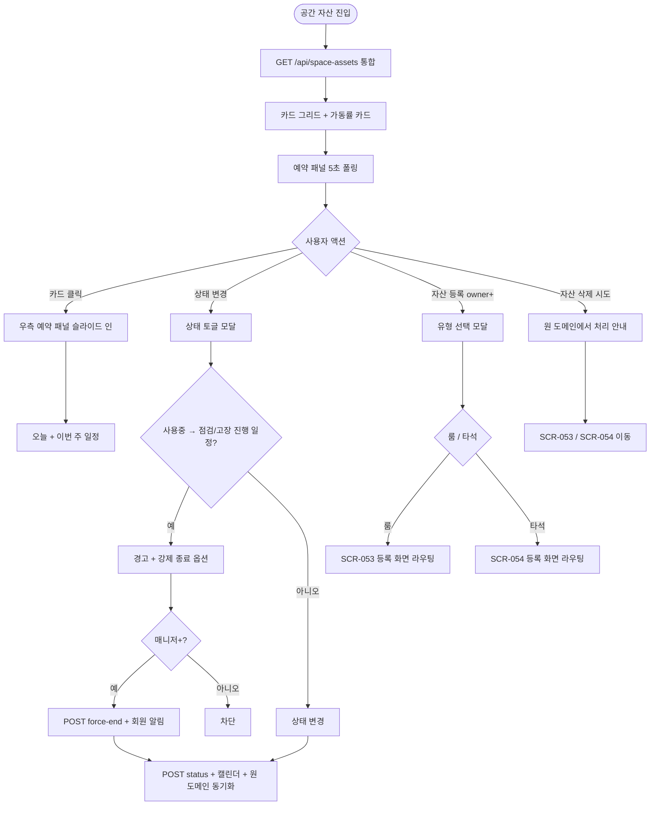
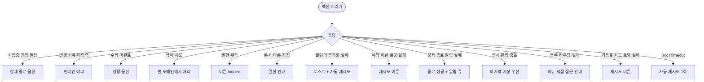

# SCR-059 공간 자산 관리 페이지

## 1. 화면 메타 정보

| 항목 | 값 |
|---|---|
| 작성일 | 2026-05-22 |
| 버전 | v1.0 |
| 상태 | 최신 통합본 반영 (정합화 완료) |
| 도메인 | D06 시설관리 |
| 화면 ID | SCR-059 |
| 화면명 | 공간 자산 관리 |
| 화면 유형 | 통합 뷰 (Aggregated View) |
| 라우트 (URL) | `/rooms` |
| 플랫폼 | 데스크톱(기본), 태블릿 |
| 우선순위 | P2 (선택 운영) |
| 기능코드 | FAC-EXT-05 (공간 자산 관리) |
| 계약코드 | FAC-EXT-05, FAC-EXT-05-01 ~ FAC-EXT-05-04 |
| 부모 기능 prefix | FAC |
| Lv1 코드 | FAC-EXT-05 |
| Lv2 / Lv3 세분화 | FAC-EXT-05-01 ~ FAC-EXT-05-04 (자산 카드 그리드, 상태 변경, 예약 현황, 자산 등록) |
| 연계 화면 | SCR-053 운동룸 관리(FAC-04), SCR-054 골프 타석 관리(FAC-05), SCR-C001 캘린더, SCR-097 감사 로그, SCR-056 장비 점검 |
| 호출 다이얼로그 | 본 화면 직접 호출 다이얼로그 없음 (인라인 모달로 처리) |

이 문서는 공간 자산 관리 페이지에 대한 자기완결형 요구사항 정의서입니다.

## 2. 화면 개요와 목적

공간 자산 관리 페이지는 룸과 골프 타석 같은 공간 자산을 한 화면에서 통합 운영하는 화면입니다. 운영자가 공간 자산의 사용 상태와 예약 상황을 카드 단위로 즉시 파악하고, 상태 변경 · 예약 현황을 한 곳에서 확인할 수 있도록 운동룸 관리(FAC-04)와 골프 타석 관리(FAC-05)의 상위 통합 뷰로 작동합니다.

운영 흐름은 운영자가 화면 진입 시 룸 + 타석을 한 카드 그리드로 한눈에 조회하고, 점검 필요 자산은 [상태 변경]으로 사용중/대기/점검/고장 토글 + 사유 입력 → 캘린더 자동 반영, 자산 카드 클릭 시 우측 패널에 오늘 + 이번 주 예약 일정이 표시되어 운영자가 즉시 안내 가능합니다. 신규 자산 등록은 본 화면에서 시작하여 유형(룸/타석) 선택 후 해당 도메인 등록 화면(SCR-053 또는 SCR-054)으로 라우팅됩니다.

## 3. 진입 경로와 인접 화면

진입 경로는 사이드바 "시설 관리 > 공간 자산 관리", 대시보드의 자산 가동률 카드 클릭, 본사 통합 운영 시 다지점 가동률 분석 진입 등이 있습니다. 빠져나가는 인접 화면은 SCR-053 운동룸 관리 · SCR-054 골프 타석 관리(자산 등록 라우팅), SCR-C001 캘린더(예약 현황), SCR-056 장비 점검(고장 토글 후), SCR-097 감사 로그가 있습니다.

## 4. 레이아웃과 UI 구성

페이지 헤더 좌측에는 "공간 자산 관리" 타이틀과 지점 컨텍스트 배지가 있고, 우측에는 [자산 등록] 버튼(권한 owner 이상)이 배치됩니다.

선택적으로 헤더 아래에 전체 가동률 카드(사용중 / 전체)가 표시되어 운영자가 즉시 가동률을 인지할 수 있습니다(테넌트 정책).

본문은 자산 카드 그리드로 구성됩니다. 각 자산 카드에는 자산명(룸명 / 타석 번호) · 유형(룸 GX/PT/스피닝/필라 또는 타석) · 상태 배지(사용중/대기/점검/고장) · 현재 사용자(사용중 시) · 오늘 예약 슬롯 시각화 · 액션 버튼([상세] · [상태 변경])이 표시됩니다.

상태 색상은 사용중(파랑) · 대기(초록) · 점검(주황) · 고장(빨강)으로 분리되며 색상 우선순위는 고장 > 점검 > 사용중 > 대기 순서입니다.

자산 카드 클릭은 우측 패널을 슬라이드 인 시켜 오늘 + 이번 주 예약 일정을 표시합니다. 패널에는 시간대별 예약 카드가 표시되고 회원명 · 예약 유형 · 시작 시각 · 종료 시각이 노출됩니다.

자산명 · 유형 · 상태 필터링이 화면 상단에 드롭다운으로 제공되며 URL 쿼리 동기화됩니다.

## 5. 탭 구성과 탭별 동작

본 화면은 **운동룸(SCR-053) / 골프 타석 / 기타 공간** 3개 탭으로 구성됩니다. 기본 탭은 운동룸(SCR-053)입니다. 탭 전환 시 선택 탭의 자산을 카드 또는 목록으로 표시하며, 자산별 상세 관리는 각 탭의 하위 정의(운동룸 탭 → SCR-053 기준)를 따릅니다. 각 탭 내에는 상태 필터(전체 / 사용중 / 대기 / 점검 / 고장)가 드롭다운으로 제공되며, 필터 변경 시 즉시 결과 갱신 + URL 쿼리 동기화가 일어납니다.

## 6. 버튼·아이콘·링크 액션 전체 정의

[자산 등록] 버튼은 owner 이상 권한자에게 노출되며 클릭 시 유형 선택(룸 / 타석 / 기타 공간) 후 해당 도메인 등록 화면(SCR-053 또는 SCR-054)으로 라우팅됩니다. 본 화면에서 자산 직접 등록은 차단됩니다.

자산 카드의 [상세] 버튼 또는 카드 자체 클릭은 우측 예약 패널을 슬라이드 인 시킵니다. 카드 헤더의 자산명 클릭은 원 도메인(SCR-053 또는 SCR-054)의 해당 자산 상세로 이동합니다.

자산 카드의 [상태 변경] 버튼은 상태 토글 모달을 호출합니다. 모달에는 상태 선택(사용중/대기/점검/고장)과 변경 사유 입력 필드가 있으며 사유 미입력 시 인라인 에러로 차단됩니다.

자산 삭제는 본 화면에서 차단됩니다. 카드에 [삭제] 버튼이 노출되지 않으며 운영자가 시도하면 "자산 삭제는 운동룸 관리(SCR-053) 또는 골프 타석 관리(SCR-054)에서 처리하세요" 안내가 표시됩니다.

예약 패널의 예약 카드 클릭은 SCR-C001 캘린더의 해당 예약 상세로 이동합니다.

## 7. 호출되는 모달 동작

본 화면은 별도의 다이얼로그 컴포넌트 없이 인라인 모달로 처리됩니다.

### 7-1. 상태 변경 모달

자산 카드의 [상태 변경] 버튼으로 열립니다. 모달 상단에 "[자산명] 상태 변경" 제목이 표시되고, 본문에 상태 선택(사용중 / 대기 / 점검 / 고장) · 변경 사유 입력 필드가 있습니다.

사용중 자산을 점검·고장으로 전환할 때 진행 중 일정이 있으면 경고 "현재 진행 중인 일정 N건이 있습니다. 강제 종료하시겠어요?" + [강제 종료] / [취소] 선택지가 제공됩니다. 강제 종료 권한은 매니저+ 이상자만 가능합니다.

고장 → 사용중 복구 시 수리 미완료 시 경고 "수리 완료 기록이 없습니다" + 강행 옵션이 제공됩니다.

[저장] 클릭 시 상태가 변경되고 SCR-C001 캘린더 + 원 도메인(FAC-04/05) 모두 동기화됩니다. 사유는 감사 로그에 기록됩니다.

### 7-2. 자산 등록 라우팅 안내 모달

[자산 등록] 버튼으로 열립니다. 모달에 "어떤 자산을 등록하시겠어요?" 안내와 [운동룸 등록] · [골프 타석 등록] 선택지가 표시되고, 선택 시 해당 도메인 등록 화면으로 이동합니다.

### 7-3. 자산 삭제 차단 안내 모달

운영자가 자산 삭제를 시도하면 "자산 삭제는 운동룸 관리(SCR-053) 또는 골프 타석 관리(SCR-054)에서 처리하세요" 안내와 [운동룸 관리로 이동] · [골프 타석 관리로 이동] · [닫기] 선택지가 표시됩니다.

## 8. 토스트와 확인 팝업과 알럿

성공 토스트는 "상태가 변경되었어요", "예약 정보가 갱신되었어요" 같은 문구로 표시됩니다.

실패 토스트는 "변경 사유 입력", "수리 완료 기록 없음", "권한이 없어요", "캘린더 반영 실패, 재시도 중" 같은 문구가 표시됩니다.

확인 팝업은 사용중 자산 점검·고장 전환 시 진행 일정 강제 종료 + [강제 종료] / [취소] 선택지가 모달로 제공됩니다.

알럿은 권한 없는 계정 직접 URL 접근 시 차단됩니다.

## 9. 데이터 흐름과 외부 연동

화면 진입 시 `GET /api/space-assets`가 호출됩니다. 응답으로 룸 + 타석 통합 배열이 내려옵니다.

상태 변경은 `POST /api/space-assets/:id/status`, 예약 조회는 `GET /api/space-assets/:id/reservations`, 가동률은 `GET /api/space-assets/utilization`, 강제 종료는 `POST /api/space-assets/:id/force-end`로 처리됩니다.

상태 변경은 즉시 SCR-C001 캘린더 + FAC-04 운동룸 + FAC-05 골프 타석 모두 동기화됩니다.

예약 패널 폴링은 5초 주기로 우측 패널 일정을 갱신합니다.

NFR-19 강제 종료 알림은 점검·고장 전환 시 강제 종료 발생 시 회원에게 푸시 + SMS로 발송됩니다.

가동률 카드 갱신은 30초 주기 또는 이벤트로 전체 가동률 표시를 갱신합니다.

공간 자산 KPI 배치는 매주 월요일 04:00에 자산별 가동률 · 점검 빈도 · 평균 사용 시간을 집계합니다.

점검 자동 강조 배치는 1분 주기로 점검 주기 경과 자산을 상단 강조합니다.

모든 등록 · 상태 변경 처리는 감사 로그(SCR-097)에 actor · asset_id · asset_type · before-after · reason 형태로 기록됩니다.

## 10. 화면 상태와 예외 처리

사용중 상태는 파랑 카드로 표시됩니다. 대기 상태는 초록 카드, 점검 상태는 주황 카드, 고장 상태는 빨강 카드로 표시됩니다.

자산 없음 상태는 "등록된 자산이 없습니다" 안내 + [자산 등록] CTA가 표시됩니다.

예외 케이스별 처리는 다음과 같습니다.

사용중 자산 점검·고장 전환 시 진행 일정 존재 시 경고 + 강제 종료 옵션이 제공됩니다.

상태 변경 사유 미입력 시 인라인 에러 "변경 사유 입력"이 표시됩니다.

고장 → 사용중 수리 미완료 시 경고 "수리 완료 기록 없음" + 강행 옵션이 제공됩니다.

자산 삭제 시도 시 "원 도메인에서 처리하세요" 안내가 표시됩니다.

권한 부족 액션 시 버튼이 hidden 또는 비활성화됩니다.

본사 통합 모드 다른 지점 변경 시 권한 안내가 표시됩니다.

캘린더 동기화 실패 시 토스트 + 자동 재시도가 일어납니다.

예약 패널 로딩 실패 시 "예약 정보 로딩 실패" + 재시도 버튼이 표시됩니다.

강제 종료 알림 발송 실패 시 종료는 성공으로 처리되고 알림은 재시도 큐에 등록됩니다.

동시 편집 충돌 시 "다른 사용자가 변경" 안내 + 마지막 저장 우선이 적용됩니다.

등록 라우팅 실패 시 "등록 화면으로 이동할 수 없습니다" 안내 + 메뉴 직접 접근 안내가 표시됩니다.

가동률 카드 데이터 로딩 실패 시 "가동률 정보 로딩 실패" 안내가 표시됩니다.

## 11. 권한별 처리

슈퍼관리자 · 본사 최고관리자 · Owner(지점장)은 전체 자산을 조회하고 등록 · 수정 · 상태 변경 모든 기능을 사용할 수 있습니다(삭제는 원 도메인에서만 가능).

매니저는 전체 자산을 조회하고 상태 변경 · 예약 확인이 가능합니다.

FC · 스태프는 전체 자산을 조회하고 상태 변경(룸 · 타석 한정)이 가능합니다.

트레이너 · 읽기 전용은 현황 조회만 가능합니다.

권한 부족 시 단계별 차단이 적용됩니다.

## 12. 메인 흐름

## 13. 에러와 예외 흐름

## 14. 핵심 디자인 요청사항

자산 카드는 색상으로 즉시 상태 인지가 가능해야 합니다. 사용중(파랑) · 대기(초록) · 점검(주황) · 고장(빨강)이 명확히 구분되며, 색상 우선순위(고장 > 점검 > 사용중 > 대기)에 따라 한 카드에 여러 상태가 겹쳐도 한 가지만 표시됩니다. 카드 단위에서 상태가 즉시 읽혀야 한다는 퍼블리싱 포인트를 반드시 따릅니다.

카드 클릭 vs [상태 변경] 버튼 클릭은 동작이 다릅니다. 카드 자체 클릭은 우측 예약 패널 슬라이드 인, [상태 변경] 버튼은 상태 토글 모달 호출로 시각적으로 구분되어야 합니다.

우측 예약 패널은 부드러운 슬라이드 인 애니메이션으로 표시되며 카드 그리드의 가로폭이 자동으로 축소됩니다. 패널 내부에는 오늘 + 이번 주 예약 일정이 시간순으로 표시됩니다.

전체 가동률 카드(선택)는 화면 상단에 가장 두드러지게 배치되어 운영자가 진입 즉시 전체 가동률을 인지할 수 있어야 합니다.

자산 등록 라우팅은 모달 안에서 룸 / 타석 선택을 명확히 시각화하여 운영자가 잘못된 도메인으로 진입하지 않도록 안내합니다.

## 15. 운영 정책 (이 화면에 연결된 부분)

본 화면은 운동룸(FAC-04)과 골프 타석(FAC-05)의 상위 통합 뷰로 두 도메인 데이터를 모두 표시합니다.

자산 유형은 룸(GX / PT / 스피닝 / 필라테스 / 기타) + 타석(단일 카테고리)이며 카드에 유형 배지가 표시됩니다.

자산 상태는 사용중(in_use) / 대기(available) / 점검(maintenance) / 고장(broken) 4종으로 통일됩니다.

상태 변경은 즉시 캘린더(SCR-C001) + 예약 시스템 + 원 도메인(FAC-04/FAC-05) 모두 동기화됩니다.

점검 · 고장 상태 자산은 신규 예약을 받지 못합니다.

사용중 자산 점검·고장 전환 시 진행 중 일정 경고 + 강제 종료 옵션(FAC-04와 동일 흐름)이 제공됩니다.

강제 종료 시 회원에게 NFR-19 알림이 자동 발송됩니다.

상태 변경 시 사유 입력 필수이며 사유는 감사 로그에 기록됩니다.

카드 단위에서 상태가 즉시 읽혀야 한다는 퍼블리싱 포인트를 따릅니다(색상 구분 명확).

자산 등록은 본 화면에서 시작하며 유형(룸/타석) 선택 후 해당 도메인 등록 화면으로 라우팅됩니다.

자산 삭제는 본 화면에서 차단되며 원 도메인(FAC-04/FAC-05)에서만 처리됩니다.

예약 현황 패널은 오늘 + 이번 주 일정 표시이며 SCR-C001 캘린더 데이터를 실시간 반영합니다(5초 폴링).

권한별 가시성은 다음과 같이 분리됩니다. 슈퍼관리자 · Owner(지점장) · 매니저는 등록 · 상태 변경. FC · 스태프는 상태 변경(룸 · 타석 한정). 트레이너 · 읽기 전용은 조회만 가능합니다.

본사 통합 모드는 지점별 자산 분리 운영, 슈퍼관리자만 통합 조회가 가능합니다.

모든 등록 · 상태 변경은 감사 로그(SCR-097)에 actor · asset_id · asset_type · before-after · reason 형태로 기록됩니다.

카드 색상 우선순위는 고장 > 점검 > 사용중 > 대기 순서입니다.

자산명 · 유형 · 상태 필터링이 지원되며 URL 쿼리 동기화로 새로고침 시에도 유지됩니다.

자산 카드 클릭 vs [상태 변경] 버튼 클릭은 분리됩니다. 카드 = 예약 패널, [상태 변경] 버튼 = 모달.

본 화면에서 변경된 상태는 FAC-04 / FAC-05에 반영되며 동시 편집 시 마지막 저장이 우선됩니다.

가동률 표시 옵션은 카드 그리드 상단에 전체 가동률(사용중 / 전체) 카드 표시입니다(테넌트 정책).

강제 종료 권한은 매니저+ 권한자만 가능하며 그 외는 일반 점검 토글만 가능합니다.

회원에게 영향 있는 상태 변경(점검·고장)은 진행 중 회원에게 자동 알림이 발송됩니다.

이상의 모든 정책은 이 화면을 구현하고 운영하는 사람이 별도 문서 없이 이 한 장만 보면 이해할 수 있도록 풀어 적었습니다.
