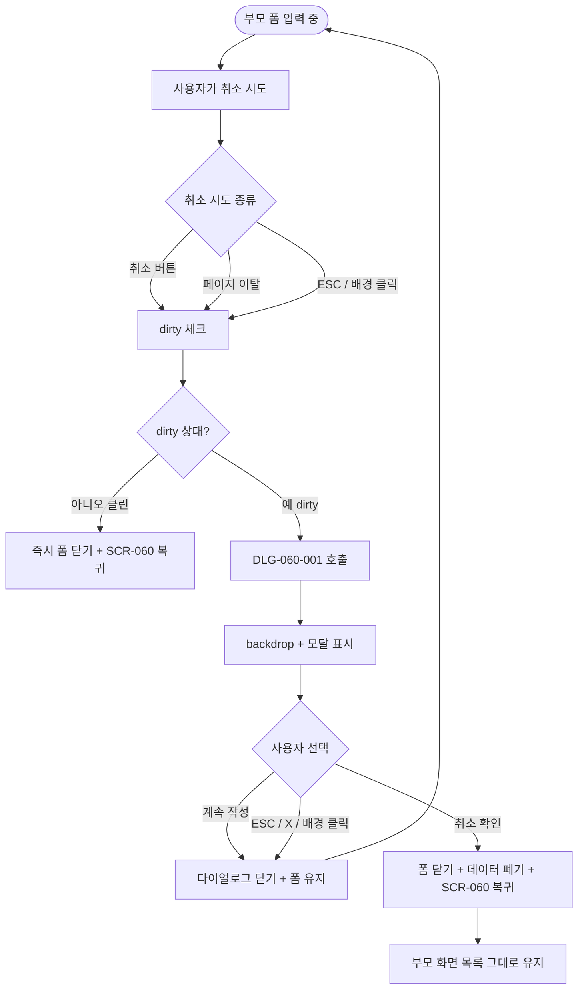
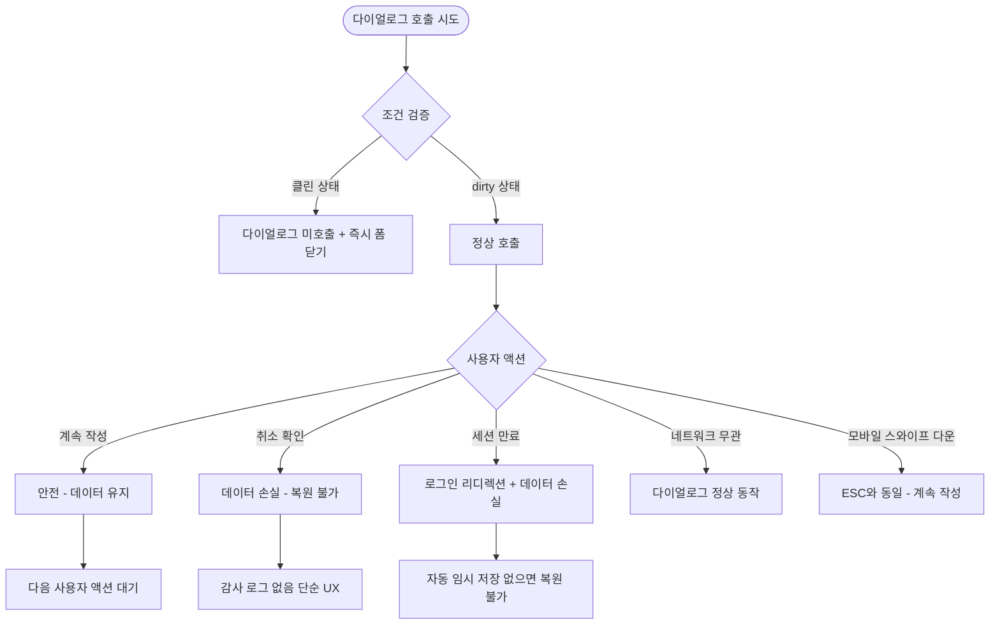

# DLG-060-001 등록/수정 취소 확인 다이얼로그

## 1. 다이얼로그 메타 정보

이 문서는 DLG-060-001 등록/수정 취소 확인 다이얼로그에 대한 자기완결형 요구사항 정의서입니다. 다른 문서를 함께 보지 않아도 이 한 장만으로 이 모달의 모든 트리거, 모든 입력, 모든 권한, 모든 예외 처리, 그리고 이 모달을 지탱하는 dirty 상태 추적·실수 방지 운영 정책까지 전부 이해하고 구현할 수 있도록 작성합니다.

| 항목 | 값 |
|---|---|
| 작성일 | 2026-05-22 |
| 버전 | v1.0 |
| 상태 | 최신 통합본 반영 (정합화 완료) |
| 도메인 | D07 직원관리 |
| 다이얼로그 ID | DLG-060-001 |
| 다이얼로그명 | 직원 등록/수정 취소 확인 |
| 다이얼로그 유형 | 이탈 확인 모달 (Confirmation Modal) |
| 부모 화면 | SCR-060 직원 목록 |
| 호출 트리거 | SCR-060 인라인 빠른 등록·수정 폼에서 [취소] 버튼 클릭 (dirty 상태) |
| 우선순위 | P1 (출시 필수) |
| 기능코드 | STF-01 (직원/트레이너 목록 조회) |
| 계약코드 | STF-01 |
| 부모 기능 prefix | STF |
| 연계 다이얼로그 | DLG-061-001 (SCR-061 전용 폼의 동일 패턴) |
| 연계 화면 | SCR-060 직원목록 |

## 2. 다이얼로그 개요와 목적

DLG-060-001은 직원 목록(SCR-060) 안에서 인라인으로 펼쳐지는 빠른 등록·수정 폼(예: 직원 행의 더보기 → 빠른 수정, 또는 신규 등록 미니 폼)에서 [취소] 버튼을 눌렀을 때 입력 데이터의 실수 손실을 방지하기 위해 호출되는 이탈 확인 모달입니다. 본격적인 SCR-061 전용 폼의 이탈 확인은 DLG-061-001이 담당하며, 두 다이얼로그는 동일한 패턴을 따르지만 호출 위치와 부모 화면이 다릅니다.

이 모달의 목적은 단 하나입니다. 사용자가 폼에 일부 데이터를 입력한 상태에서 실수로 [취소]를 눌러 데이터를 잃지 않도록, 명시적인 yes/no 확인을 한 번 더 받는 것입니다. 폼이 클린 상태(아무 입력도 변경하지 않은 상태)에서는 이 모달이 호출되지 않고 즉시 폼이 닫히므로, 운영자의 흐름을 불필요하게 방해하지 않습니다.

운영 맥락에서는 다음 시나리오가 대표적입니다. 매니저가 신규 직원 빠른 등록을 진행하다가 회의 시간이 가까워져 작업을 중단하려 할 때 이 모달이 호출됩니다. 또는 직원 행의 더보기 메뉴에서 빠른 수정을 시작했다가 잘못된 직원임을 깨닫고 [취소]를 누를 때 호출됩니다. 사용자가 "계속 작성"을 선택하면 폼이 유지되어 작업을 이어갈 수 있고, "취소 확인"을 선택하면 폼이 닫히고 SCR-060 목록으로 복귀합니다.

## 3. 호출 트리거와 부모 화면

이 다이얼로그는 SCR-060 직원 목록 화면에서 다음 조건에서 호출됩니다.

첫 번째 조건은 SCR-060 안에 인라인으로 펼쳐진 빠른 등록·수정 폼(또는 미니 모달 폼)에서 [취소] 버튼을 클릭한 경우입니다. 폼이 dirty 상태(한 필드라도 변경된 상태)일 때만 이 모달이 호출되며, 클린 상태에서는 호출되지 않고 즉시 폼이 닫힙니다.

두 번째 조건은 인라인 폼이 열려 있는 상태에서 사용자가 페이지를 이탈하려 시도하는 경우입니다. 사이드바 메뉴 클릭, 브라우저 뒤로 가기, 새로고침 등 페이지 자체를 떠나는 시도는 dirty 상태일 때 자동으로 차단되고 이 모달이 호출됩니다.

세 번째 조건은 인라인 폼이 열린 상태에서 ESC 키 또는 배경 클릭으로 모달을 닫으려 시도하는 경우입니다. dirty 상태일 때는 [계속 작성]과 동일한 동작으로 모달이 유지되며, 그래도 닫으려면 한 번 더 [취소] 버튼을 명시적으로 누르거나 이 다이얼로그의 [취소 확인]을 눌러야 합니다.

부모 화면인 SCR-060은 이 다이얼로그가 호출되는 동안 본문이 어둡게 처리되어(backdrop) 모달에 집중할 수 있는 시각적 환경을 만듭니다. 모달이 닫히면 어둡게 처리된 본문이 원래 상태로 돌아갑니다.

본격적인 SCR-061 전용 폼에서 발생하는 이탈 확인은 DLG-061-001이 담당하며, 두 다이얼로그는 같은 UX 패턴이지만 부모 화면 컨텍스트가 다르기 때문에 별도 ID로 관리됩니다.

## 4. 레이아웃과 UI 구성

이 다이얼로그는 화면 중앙에 배치되는 작은 모달입니다. 데스크톱·태블릿에서는 약 400px 가로폭의 카드형 모달이며, 모바일에서는 화면 하단에서 슬라이드 업되는 바텀시트 형태로 자동 전환됩니다. 모달 외부 본문은 backdrop으로 어둡게 처리되어 모달에 시선이 집중되게 합니다.

모달 상단에는 제목이 있습니다. 제목 텍스트는 "작성 중인 내용이 있습니다"이며, 본문 텍스트보다 큰 폰트와 굵은 weight로 표시됩니다. 제목 우측 끝에는 닫기(X) 아이콘이 있지만, 이 아이콘 클릭은 [계속 작성]과 동일하게 동작합니다(데이터를 보호하기 위한 정책).

제목 아래에는 안내 메시지가 한 줄로 표시됩니다. 메시지 텍스트는 "취소하면 입력한 내용이 저장되지 않습니다. 정말 취소하시겠습니까?"입니다. 텍스트는 일반 본문 폰트로 표시되며, "정말 취소" 부분에는 약간의 강조(굵은 weight 또는 색상 변화)가 들어가 사용자가 의미를 분명히 인지할 수 있게 합니다.

안내 메시지 아래에는 입력 데이터 요약이 선택적으로 표시될 수 있습니다(테넌트 정책). 예를 들어 "입력 중인 필드: 직원명, 연락처, 직무"처럼 어떤 필드가 변경되었는지 요약 표시하면 사용자가 실수 여부를 더 정확히 판단할 수 있습니다. 기본 정책에서는 이 요약을 표시하지 않고, 단순한 안내 메시지만 노출합니다.

모달 하단에는 액션 버튼 두 개가 가로로 배치됩니다. 좌측에 [계속 작성] 버튼이, 우측에 [취소 확인] 버튼이 있습니다. [계속 작성]은 기본 톤(회색 또는 보조 색)이며, [취소 확인]은 위험을 알리는 강조 톤(빨강 또는 주황)으로 표시되어 사용자가 어떤 액션이 데이터 손실을 일으키는지 시각적으로 인지할 수 있게 합니다. 기본 포커스는 [계속 작성]에 놓여, Enter 키 입력 시 안전한 액션이 선택되도록 설계됩니다.

## 5. 입력 필드와 검증

이 다이얼로그는 입력 필드가 없는 단순 확인 모달입니다. 사용자는 두 버튼 중 하나를 선택하기만 하면 되며, 별도의 입력 검증은 적용되지 않습니다. 텍스트 입력으로 이중 확인을 받는 패턴은 DLG-060-002 퇴사 처리 확인에서 사용되며, 이 모달은 단순한 yes/no 확인이므로 검증 패턴이 다릅니다.

다이얼로그가 호출될 때 부모 화면의 폼 dirty 상태가 확인됩니다. dirty 상태는 모든 필드의 변경 여부를 OR 조건으로 합산해 결정되며, 한 필드라도 초기값과 다르면 dirty=true가 됩니다. dirty=false일 때는 이 다이얼로그가 호출되지 않고 즉시 폼이 닫힙니다.

## 6. 버튼·아이콘·링크 액션 전체 정의

[계속 작성] 버튼은 다이얼로그를 닫고 부모 폼으로 돌아갑니다. 입력된 데이터는 그대로 유지되며, 사용자는 폼 작업을 이어갈 수 있습니다. 이 액션은 데이터 보호 목적이며, ESC 키, 배경 클릭, 모달 상단의 X 아이콘 클릭 모두 이 액션과 동일하게 동작합니다.

[취소 확인] 버튼은 부모 폼을 닫고 SCR-060 목록으로 복귀합니다. 입력된 데이터는 폐기되며, 복원할 방법이 없습니다(인라인 빠른 폼은 자동 임시 저장이 없으므로). 이 액션은 데이터 손실을 일으키는 위험한 액션이므로 강조 톤으로 표시되며, 기본 포커스는 [계속 작성]에 놓여 실수 클릭이 방지됩니다.

ESC 키 입력은 [계속 작성]과 동일하게 동작합니다. 이는 사용자가 모달을 닫으려는 의도가 명확하지 않을 때 데이터를 보호하기 위한 정책입니다.

배경 클릭(모달 외부 backdrop)은 [계속 작성]과 동일하게 동작합니다. 실수 클릭으로 데이터가 손실되지 않도록 보호하는 정책입니다.

모달 상단의 X 닫기 아이콘은 [계속 작성]과 동일하게 동작합니다. 일반적인 모달의 X 아이콘은 닫기 액션이지만, 이 다이얼로그에서는 데이터 보호를 위해 안전한 액션으로 통일됩니다.

키보드 Tab 키는 [계속 작성] → [취소 확인] 순서로 포커스가 이동합니다. Shift+Tab은 역순으로 동작합니다.

모든 버튼은 클릭 후 응답이 돌아오기 전까지 비활성화되어 중복 클릭이 차단됩니다. 다만 이 다이얼로그는 단순 yes/no 확인이므로 백엔드 호출이 거의 즉시 끝나며, 사용자가 인지할 만한 로딩 상태는 발생하지 않습니다.

## 7. 호출되는 모달과 토스트

이 다이얼로그는 다른 다이얼로그를 호출하지 않으며, 자기 자신이 종료 모달입니다.

[취소 확인] 클릭 후 폼이 닫힐 때 토스트는 별도로 표시되지 않습니다. 단순히 폼이 사라지고 SCR-060 목록 화면으로 복귀하는 것만으로 사용자에게 결과가 전달됩니다.

[계속 작성] 클릭 후에도 토스트는 표시되지 않습니다. 단순히 다이얼로그가 사라지고 부모 폼이 그대로 유지되는 것만으로 결과가 전달됩니다.

만약 부모 폼에서 자동 임시 저장(테넌트 정책에 따라 활성화될 수 있음)이 활성화된 환경이라면, [취소 확인] 후에도 임시 저장 데이터가 보존되어 다음 진입 시 "이전에 작성하던 내용이 있습니다. 복원하시겠습니까?" 안내가 표시될 수 있습니다. 이는 부모 화면 SCR-060의 책임이며, 이 다이얼로그 자체는 임시 저장에 관여하지 않습니다.

## 8. 데이터 흐름과 외부 연동

이 다이얼로그는 외부 API를 호출하지 않습니다. 모든 처리는 클라이언트 메모리 안에서 이루어지며, [계속 작성]은 단순히 모달을 닫고, [취소 확인]은 부모 폼의 상태를 reset해 SCR-060으로 복귀합니다.

다만 부모 폼에서 데이터 변경이 진행 중인 경우, 다이얼로그 호출 시점에 dirty 상태 플래그를 확인합니다. 이 플래그는 부모 화면(SCR-060)의 React/Vue 상태 관리에 의해 유지되며, 다이얼로그는 이 플래그를 읽어 호출 여부를 결정하지만 자체적으로 변경하지는 않습니다.

[취소 확인] 액션 직후에는 부모 폼이 닫히면서 dirty 플래그가 자동으로 초기화됩니다. SCR-060의 목록 데이터는 그대로 유지되며, 별도의 재조회 요청이 발생하지 않습니다.

감사 로그는 이 다이얼로그 자체에서는 기록되지 않습니다. 단순한 UX 확인 모달이므로 감사 추적 가치가 없으며, 부모 폼의 저장 실패·취소 이벤트가 별도로 SCR-097에 기록될 수도 있지만 그것은 부모 화면의 책임입니다.

세션 스토리지·로컬 스토리지에 데이터를 저장하지 않습니다. 다이얼로그 상태는 클라이언트 메모리에만 존재하며, 페이지 새로고침 시 자동으로 사라집니다.

## 9. 화면 상태와 예외 처리

이 다이얼로그는 다음 상태들을 가집니다.

기본 표시 상태는 다이얼로그가 호출된 직후의 일반 상태입니다. 제목·안내 메시지·두 버튼이 표시되고, 기본 포커스는 [계속 작성]에 놓입니다. 부모 화면 본문은 backdrop으로 어둡게 처리됩니다.

입력 중 상태는 이 다이얼로그에는 적용되지 않습니다(입력 필드가 없음). 다만 부모 폼이 입력 중 상태이며, 그 입력 도중에 [취소]를 눌러 이 다이얼로그가 호출된 상황입니다.

처리 중 상태는 [취소 확인] 클릭 직후 부모 폼이 닫히는 동안의 짧은 transition 상태입니다. 거의 즉시 끝나므로 사용자가 인지할 만한 시간은 아닙니다.

완료 상태는 [취소 확인] 후 폼이 닫히고 SCR-060 목록으로 복귀한 상태입니다. 다이얼로그 자체는 사라진 상태입니다.

실패 상태는 이 다이얼로그에 적용되지 않습니다. 외부 API 호출이 없으므로 실패할 케이스가 없습니다.

예외 케이스별 처리는 다음과 같습니다. 부모 폼이 클린 상태인데 [취소]를 눌렀다면 이 다이얼로그가 호출되지 않고 즉시 폼이 닫혀야 합니다. 다이얼로그 호출 자체가 잘못된 트리거이므로, 부모 화면에서 dirty 체크를 정확히 수행해야 합니다.

세션 만료 중 다이얼로그가 떠 있는 경우, 부모 화면이 자동으로 로그인 페이지로 리디렉션되면서 이 다이얼로그도 함께 사라집니다. 데이터 복원은 별도로 제공되지 않으며, 입력 중인 데이터는 손실됩니다.

권한이 부족한 사용자가 이 다이얼로그를 호출할 일은 없습니다. 부모 폼에 진입하려면 이미 적절한 권한이 있어야 하므로, 이 다이얼로그까지 도달했다면 권한 문제는 발생하지 않습니다.

네트워크 오류는 이 다이얼로그에 영향을 주지 않습니다. 외부 API 호출이 없으므로 네트워크 상태와 무관하게 동작합니다.

모바일에서는 다이얼로그가 바텀시트 형태로 자동 전환되며, 좌우 스와이프나 위에서 아래로 드래그하는 제스처는 ESC 키와 동일하게 [계속 작성]으로 동작합니다.

키보드만 사용하는 접근성 사용자는 Tab/Shift+Tab으로 버튼을 이동하고 Enter로 선택할 수 있습니다. Screen reader는 모달이 열릴 때 제목과 안내 메시지를 읽어주며, 두 버튼의 의미가 라벨로 명확히 전달됩니다.

## 10. 권한별 처리

이 다이얼로그는 부모 화면(SCR-060)의 권한 정책을 따릅니다. 다이얼로그 자체에는 별도의 권한 분기가 없으며, 부모 폼에 진입할 권한이 있는 사용자만 이 다이얼로그를 만날 수 있습니다. 9역할 매트릭스는 다음과 같습니다.

본사 슈퍼관리자(superAdmin) · 본사 최고관리자(primary)는 본사 통합 모드에서 SCR-060의 인라인 빠른 폼을 사용할 수 있으므로 이 다이얼로그를 호출하게 됩니다. 동일한 UX를 경험합니다.

센터장(owner)과 매니저(manager)는 자기 지점 직원 등록·수정이 가능하므로 SCR-060 인라인 빠른 폼에서 이 다이얼로그를 호출하게 됩니다. 두 권한 모두 동일한 UX를 경험합니다.

FC(fc) · 트레이너(trainer) · 스태프(staff) · 프런트(front)는 SCR-060에서 동료 직원 정보 수정 권한이 없으므로 이 다이얼로그를 만날 일이 없습니다. 본인 정보도 SCR-060에서 직접 수정할 수 없으므로 이 다이얼로그 호출 경로가 차단됩니다.

읽기 전용(readonly)은 SCR-060 자체에 접근할 수 없으므로 이 다이얼로그를 만날 수 없습니다.

권한이 없는 사용자가 직접 URL이나 우회 경로로 이 다이얼로그에 도달하려고 해도, 부모 화면이 권한 차단 페이지로 자동 리디렉션되므로 다이얼로그가 호출되지 않습니다.

이 다이얼로그가 호출된 시점에는 이미 권한 검증이 통과된 상태이므로, 다이얼로그 안에서 별도의 권한 차단은 발생하지 않습니다. [취소 확인] 후 폼이 닫히면 부모 화면의 일반 권한 체계로 돌아갑니다.

## 11. 메인 흐름

이 다이얼로그의 핵심 동작 흐름을 다이어그램으로 표현합니다.

## 12. 에러와 예외 흐름

에러와 예외 상황에서의 분기를 별도 흐름으로 표현합니다.

## 13. 핵심 디자인 요청사항

이 다이얼로그는 단순하지만 명확해야 합니다. 다음 디자인 원칙이 시각적으로 명확히 드러나야 합니다.

모달 크기는 너무 크지 않게, 화면 중앙에 살짝 떠 있는 느낌으로 배치됩니다. 가로 400px 정도가 적당하며, 사용자가 안내 메시지를 한눈에 읽을 수 있는 크기입니다.

제목은 본문보다 큰 폰트(18-20px 정도)와 굵은 weight로 표시되어, 사용자가 모달의 의도를 즉시 인지할 수 있게 합니다.

안내 메시지는 자연스러운 한국어 문장으로 표시되며, "정말 취소" 같은 핵심 단어는 약간 강조(굵은 weight)되어 의미가 분명히 전달됩니다.

두 버튼의 색상 분기가 가장 중요합니다. [계속 작성]은 회색 또는 보조 색(안전 톤)으로, [취소 확인]은 강조 톤(빨강 또는 주황 - 위험 톤)으로 표시되어, 사용자가 어떤 액션이 데이터 손실을 일으키는지 시각적으로 즉시 인지할 수 있습니다. 기본 포커스는 [계속 작성]에 놓여, Enter 키 실수 입력으로 데이터가 손실되지 않도록 보호합니다.

backdrop은 본문을 약 50% 정도 어둡게 처리해, 모달에 시선이 집중되면서도 본문이 완전히 가려지지 않아 컨텍스트가 유지됩니다.

모바일 바텀시트는 화면 하단에서 부드럽게 슬라이드 업되며, 모달 상단에 작은 드래그 핸들이 표시되어 사용자가 위에서 아래로 드래그해 닫을 수 있음을 시각적으로 알려줍니다. 다만 드래그 닫기는 [계속 작성]과 동일하게 동작해 데이터가 보호됩니다.

애니메이션은 모달 등장 시 fade-in + scale-up 또는 모바일 슬라이드-업으로 부드럽게 처리되며, 닫힐 때도 같은 방향으로 부드럽게 사라집니다. 너무 빠르거나 느리지 않은 200-300ms 정도가 적당합니다.

키보드 접근성은 Tab 키로 두 버튼 사이를 이동하고 Enter로 선택할 수 있어야 하며, screen reader는 모달 열림 시 제목과 안내 메시지, 그리고 두 버튼의 라벨을 순서대로 읽어주어야 합니다.

## 14. 운영 정책 (이 다이얼로그에 연결된 부분)

이 다이얼로그는 단순한 확인 모달이지만, 데이터 손실 방지라는 명확한 운영 정책을 담고 있습니다.

dirty 상태 추적 정책은 부모 폼의 모든 필드에 적용됩니다. 각 필드는 초기값과 현재값을 비교해 dirty 플래그를 유지하며, 한 필드라도 변경되면 폼 전체가 dirty=true가 됩니다. 이 플래그는 SCR-060의 React/Vue 상태 관리에 의해 유지됩니다. 클린 상태에서 [취소]를 누르면 이 다이얼로그가 호출되지 않고 즉시 폼이 닫혀, 운영자의 흐름을 불필요하게 방해하지 않습니다.

실수 방지 정책은 이 다이얼로그의 핵심 목적입니다. 사용자가 일부 데이터를 입력한 상태에서 실수로 [취소]를 눌러 데이터를 잃지 않도록, 명시적인 yes/no 확인을 한 번 더 받습니다. 기본 포커스를 [계속 작성]에 놓고, [취소 확인] 버튼을 강조 톤으로 표시해 위험한 액션임을 시각적으로 알리는 것도 같은 정책의 일환입니다.

데이터 보호 우선 정책은 ESC 키, 배경 클릭, 모달 상단 X 아이콘 모두를 [계속 작성]과 동일하게 동작시킵니다. 일반적인 모달의 X 아이콘은 닫기 액션이지만, 이 다이얼로그에서는 데이터 보호를 위해 안전한 액션으로 통일됩니다. 사용자가 데이터를 폐기하려면 명시적으로 [취소 확인] 버튼을 눌러야 합니다.

자동 임시 저장 정책은 이 다이얼로그 자체에는 적용되지 않습니다. SCR-060의 인라인 빠른 폼은 본격적인 SCR-061 전용 폼과 달리 자동 임시 저장이 없는 단순 폼이며, [취소 확인] 후 데이터는 복원할 수 없습니다. 본격적인 폼에서의 자동 임시 저장은 DLG-061-001과 SCR-061의 책임입니다.

권한 정책은 부모 화면의 권한을 따릅니다. 이 다이얼로그 자체에는 별도의 권한 분기가 없으며, 부모 폼에 진입할 권한이 있는 사용자만 이 다이얼로그를 만날 수 있습니다. owner와 manager 권한이 대상이며, FC·트레이너·스태프·프런트·readonly는 부모 폼 진입 자체가 차단되므로 이 다이얼로그를 만날 일이 없습니다.

감사 로그 정책은 이 다이얼로그에 적용되지 않습니다. 단순한 UX 확인 모달이므로 감사 추적 가치가 없으며, 부모 폼의 저장 실패·취소 이벤트는 SCR-097에 별도로 기록될 수 있지만 그것은 부모 화면의 책임입니다.

접근성 정책은 키보드 조작과 screen reader 지원을 보장합니다. Tab 키 포커스 이동, Enter 키 선택, screen reader 라벨 읽기가 모두 표준 a11y 가이드라인을 따라 구현되어야 합니다.

모바일 UX 정책은 바텀시트 패턴을 기본으로 합니다. 모바일에서는 화면 중앙 모달보다 화면 하단 바텀시트가 더 자연스러우므로 자동 전환되며, 드래그 닫기 제스처도 [계속 작성]과 동일하게 동작해 데이터 보호 원칙이 유지됩니다.

이상의 모든 정책은 이 다이얼로그를 구현하고 운영하는 사람이 별도 문서 없이 이 한 장만 보면 이해할 수 있도록 풀어 적었습니다. 정책이 바뀌면 이 문서가 함께 갱신되어야 하며, 코드 변경과 정책 변경은 항상 짝지어 진행됩니다.
