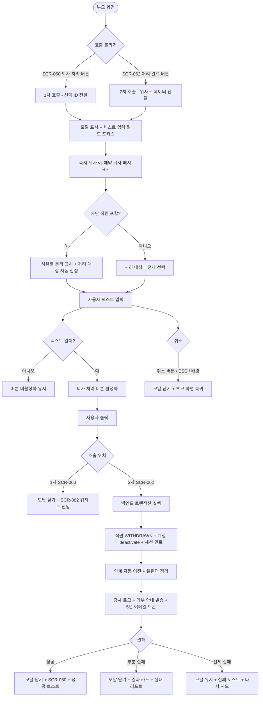
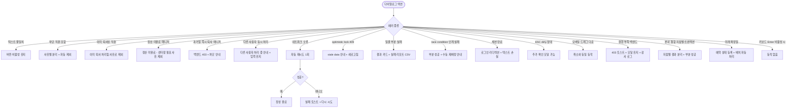

# DLG-060-002 직원 삭제(퇴사 처리) 확인 다이얼로그

## 1. 다이얼로그 메타 정보

이 문서는 DLG-060-002 직원 삭제(퇴사 처리) 확인 다이얼로그에 대한 자기완결형 요구사항 정의서입니다. 다른 문서를 함께 보지 않아도 이 한 장만으로 이 모달의 모든 트리거, 텍스트 입력 검증, 권한, 예외 처리, 그리고 이 모달을 지탱하는 이중 안전 장치·계정 비활성·감사 추적 정책까지 전부 이해하고 구현할 수 있도록 작성합니다.

| 항목 | 값 |
|---|---|
| 작성일 | 2026-05-22 |
| 버전 | v1.0 |
| 상태 | 최신 통합본 반영 (정합화 완료) |
| 도메인 | D07 직원관리 |
| 다이얼로그 ID | DLG-060-002 |
| 다이얼로그명 | 직원 퇴사 처리 확인 |
| 다이얼로그 유형 | 위험 확인 모달 (Destructive Confirmation Modal with Text Input) |
| 부모 화면 | SCR-060 직원 목록, SCR-062 직원 퇴사 처리 |
| 호출 트리거 | SCR-060에서 [퇴사 처리] 버튼 클릭, SCR-062에서 [처리 완료] 버튼 클릭 |
| 우선순위 | P0 (출시 필수) |
| 기능코드 | STF-01 (직원 목록), STF-04 (직원 퇴사 처리) |
| 계약코드 | STF-01, STF-04, PAY-STF-05 |
| 부모 기능 prefix | STF |
| 연계 다이얼로그 | 없음(단독 종료 모달) |
| 연계 화면 | SCR-060, SCR-062, SCR-097 감사로그 |

## 2. 다이얼로그 개요와 목적

DLG-060-002는 직원의 퇴사 처리를 최종 확정하기 전에 관리자의 의도를 재확인하는 위험 확인 모달입니다. 퇴사 처리는 해당 직원의 시스템 접근을 차단하고 활성 세션을 즉시 만료시키며, 재직 상태를 영구히 변경하는 중요한 작업입니다. 따라서 실수 방지를 위해 단순한 yes/no 확인이 아닌 텍스트 입력 확인 절차를 포함해, 사용자가 명시적으로 "퇴사처리" 단어를 직접 타이핑해야만 최종 버튼이 활성화되도록 설계되었습니다.

이 모달은 이중 안전 장치의 일환으로 두 번 호출됩니다. 첫 번째는 SCR-060 직원 목록에서 [퇴사 처리] 버튼을 클릭해 SCR-062 위자드에 진입하기 직전에 한 번 호출되어 위자드 진입을 차단할 수 있고, 두 번째는 SCR-062 4단계 위자드 마지막의 [처리 완료] 버튼을 클릭한 직후 한 번 더 호출되어 최종 실행 직전에 다시 한 번 확인을 받습니다. 두 번의 텍스트 입력 확인을 모두 통과해야 비로소 백엔드 퇴사 처리 트랜잭션이 실행됩니다.

운영 맥락에서는 다음 시나리오가 대표적입니다. 매니저가 계약 만료된 트레이너 5명을 동시에 퇴사 처리하려고 SCR-060에서 다중 선택 후 [퇴사 처리]를 누르면, 이 모달이 첫 번째로 호출되어 텍스트 확인을 받고, 통과 후 SCR-062 위자드에 진입해 인수인계 단계를 모두 거친 다음, 마지막 [처리 완료] 클릭 시 이 모달이 다시 호출되어 두 번째 텍스트 확인을 받습니다. 두 번의 확인은 모두 운영자의 명시적 의도 확인이며, 실수로 인한 잘못된 퇴사 처리를 방지하는 핵심 정책입니다.

## 3. 호출 트리거와 부모 화면

이 다이얼로그는 두 가지 부모 화면에서 호출됩니다.

첫 번째 호출 위치는 SCR-060 직원 목록입니다. 직원을 1명 이상 체크박스로 선택한 뒤 상단 액션 바의 [퇴사 처리] 버튼을 클릭하거나, 직원 행의 더보기 메뉴에서 [퇴사 처리] 항목을 선택할 때 이 모달이 호출됩니다. 이 시점에는 선택된 직원 ID 배열이 모달의 컨텍스트로 전달되며, 텍스트 확인을 통과하면 SCR-062 위자드로 이동합니다.

두 번째 호출 위치는 SCR-062 직원 퇴사 처리 위자드의 4단계입니다. 4단계 [처리 완료] 버튼을 클릭하면 이 모달이 한 번 더 호출되어 최종 텍스트 확인을 받습니다. 이때 위자드에서 입력된 퇴사 확정일·인계자·정리 미리보기 데이터가 모두 모달의 컨텍스트에 포함되어, 통과 시 백엔드 퇴사 처리 트랜잭션이 실행됩니다.

부모 화면은 이 모달이 호출되는 동안 본문이 어둡게 처리되어(backdrop) 모달에 집중할 수 있는 시각적 환경을 만듭니다. 텍스트 입력은 모달 가운데에 배치된 텍스트 박스에서 진행되며, 입력값과 "퇴사처리" 단어가 정확히 일치할 때만 [퇴사 처리] 버튼이 활성화됩니다.

매니저+ 권한자만 이 모달을 호출할 수 있으며, FC·트레이너·스태프·프런트·readonly에게는 부모 화면의 [퇴사 처리] 버튼 자체가 hidden되어 이 모달에 도달할 수 없습니다. 직원 본인 모드에서도 [퇴사 처리] 버튼이 hidden되며, 이 모달 호출 경로가 차단됩니다.

## 4. 레이아웃과 UI 구성

이 다이얼로그는 화면 중앙에 배치되는 중간 크기의 모달입니다. 데스크톱·태블릿에서는 약 500px 가로폭의 카드형 모달이며, 모바일에서는 화면 하단에서 슬라이드 업되는 바텀시트 형태로 자동 전환됩니다. 모달 외부 본문은 backdrop으로 어둡게 처리되어 모달에 시선이 집중되게 합니다.

모달 상단에는 제목이 있습니다. 제목 텍스트는 "직원 퇴사 처리"이며, 좌측에 빨강 또는 주황 톤의 경고 아이콘이 함께 표시되어 이 모달이 위험한 액션임을 즉시 알립니다. 제목 우측 끝에는 닫기(X) 아이콘이 있으며, 이 아이콘은 [취소]와 동일하게 동작합니다.

제목 아래에는 안내 메시지가 표시됩니다. 텍스트는 "선택한 {인원수}명의 직원을 퇴사 처리하시겠습니까? 퇴사 처리 시 해당 직원의 계정 접근이 제한됩니다"이며, `{인원수}`는 동적으로 부모 화면에서 전달된 직원 수가 들어갑니다. 1명일 때는 직원명이 그대로 표시될 수도 있고("홍길동님을 퇴사 처리하시겠습니까?"), 2명 이상일 때는 "총 5명을 퇴사 처리하시겠습니까?"처럼 카운트로 표시됩니다. 안내 메시지는 본문 폰트로 표시되며, "계정 접근이 제한됩니다" 부분은 약간 강조되어 위험성이 시각적으로 드러납니다.

안내 메시지 아래에는 즉시 퇴사 vs 예약 퇴사 안내 배지가 표시됩니다. 퇴사 확정일이 오늘 또는 과거이면 "즉시 퇴사 - 계정이 즉시 비활성화됩니다" 빨강 배지가, 미래이면 "예약 퇴사 - 확정일({날짜}) 도래 시 자동 처리됩니다" 노랑 배지가 표시됩니다. 이 정보는 SCR-062 4단계 호출 시에만 표시되며, SCR-060의 1차 호출에서는 표시되지 않습니다(아직 확정일이 입력되지 않은 상태).

배지 아래에는 차단 직원 안내가 선택적으로 표시될 수 있습니다. 일괄 선택에 이미 퇴사된 직원·정산 미완료 직원·권한 부족 직원이 포함되어 있으면 "{인원}명은 사유로 제외됩니다"가 표시되고, 사유별로 묶여 노출됩니다. 차단 사유는 "이미 퇴사 처리됨", "정산 미완료 - 센터장 권한 필요", "권한 부족" 등으로 분류됩니다.

차단 안내 아래에는 텍스트 입력 필드가 있습니다. 입력 필드 위에 라벨 "확인을 위해 '퇴사처리'를 입력해주세요"가 표시되고, 입력 박스 안에는 placeholder "퇴사처리"가 회색 톤으로 표시됩니다. 사용자가 정확히 "퇴사처리" 4글자를 입력해야 [퇴사 처리] 버튼이 활성화됩니다. 공백·특수문자·다른 단어는 모두 불일치로 처리됩니다.

모달 하단에는 액션 버튼 두 개가 가로로 배치됩니다. 좌측에 [취소] 버튼이, 우측에 [퇴사 처리] 버튼이 있습니다. [취소]는 기본 톤(회색 또는 보조 색)이며, [퇴사 처리]는 위험을 알리는 강조 톤(빨강)으로 표시됩니다. [퇴사 처리] 버튼은 텍스트 입력 검증이 통과되기 전까지 비활성화 상태로 표시되며, 통과 시에만 활성화 색상으로 변합니다. 기본 포커스는 텍스트 입력 필드에 놓여, 사용자가 즉시 타이핑을 시작할 수 있도록 합니다.

## 5. 입력 필드와 검증

이 다이얼로그의 핵심 입력은 텍스트 확인 필드 하나입니다. 사용자는 "퇴사처리" 4글자를 정확히 타이핑해야 [퇴사 처리] 버튼이 활성화됩니다.

텍스트 검증은 다음 규칙으로 동작합니다. 입력값이 "퇴사처리"와 정확히 일치할 때만 활성화되며, 대소문자 구분 없음(한글이므로 적용 안 됨), 공백 제거(앞뒤 공백은 trim 후 비교), 특수문자 차단(영문·숫자·특수문자 입력 시 인라인 에러), 다른 단어(예: "퇴사", "처리", "확인") 입력 시 불일치 처리. 이는 사용자가 정확한 의도를 가지고 명시적으로 단어를 타이핑하도록 강제하는 정책입니다.

검증 결과는 실시간으로 표시됩니다. 입력 도중에는 [퇴사 처리] 버튼이 비활성화 상태를 유지하다가, 정확히 일치하는 순간 강조 색으로 활성화됩니다. 불일치 상태에서는 별도 인라인 에러 메시지가 표시되지 않고, 단순히 버튼 비활성화로만 표시됩니다(에러 메시지가 과도한 부정 피드백을 줄 수 있어서).

일괄 모드(2명 이상)에서는 이 텍스트 확인이 안전 장치로 작동합니다. 한 명을 잘못 선택했을 가능성에 대해 운영자가 명시적으로 확인하도록 강제하며, 단순한 yes/no 확인이 아닌 텍스트 타이핑이라는 추가 행동을 요구해 실수 발생 가능성을 크게 낮춥니다.

차단 직원이 포함된 경우에는 처리 가능 직원만 모달 컨텍스트에 포함되며, 차단 직원은 사유별로 분리 표시됩니다. 텍스트 확인을 통과해도 차단 직원은 처리 대상에서 자동 제외되어 백엔드로 전송되지 않습니다.

## 6. 버튼·아이콘·링크 액션 전체 정의

[퇴사 처리] 버튼은 빨강 계열의 강조 색으로 표시되며, 텍스트 확인 통과 시에만 활성화됩니다. 클릭 시 모달이 로딩 상태로 전환되어 모든 버튼이 비활성화되고, 백엔드로 퇴사 처리 요청이 전송됩니다.

SCR-060의 1차 호출에서는 통과 시 모달이 닫히고 SCR-062 위자드로 이동합니다. SCR-062 4단계의 2차 호출에서는 통과 시 실제 백엔드 트랜잭션이 실행되어 직원 상태가 `WITHDRAWN`으로 전환되고 계정이 비활성화되며, 활성 세션이 강제 만료됩니다. 성공 시 모달이 닫히고 SCR-060으로 자동 복귀하면서 "n명의 퇴사 처리가 완료되었어요" 성공 토스트가 표시됩니다.

[취소] 버튼은 기본 톤으로 표시되며, 클릭 시 모달이 즉시 닫히고 부모 화면으로 복귀합니다. 어떤 변경도 일어나지 않습니다. ESC 키, 배경 클릭, 모달 상단의 X 아이콘도 [취소]와 동일하게 동작합니다. 다만 텍스트가 일부 입력된 dirty 상태에서는 "텍스트 입력이 사라집니다. 정말 닫으시겠습니까?"라는 추가 확인이 한 번 더 호출될 수 있습니다(테넌트 정책).

텍스트 입력 필드는 기본 포커스가 자동으로 놓여, 사용자가 모달 호출 직후 바로 타이핑을 시작할 수 있습니다. 입력 도중 Tab 키로 [취소]·[퇴사 처리] 버튼으로 포커스를 이동할 수 있으며, Enter 키 입력은 [퇴사 처리] 버튼이 활성화 상태일 때만 클릭과 동일하게 동작합니다(비활성화 상태에서는 동작 없음).

키보드 Tab 키는 텍스트 입력 → [취소] → [퇴사 처리] 순서로 포커스가 이동합니다. Shift+Tab은 역순으로 동작합니다.

모든 버튼은 처리 중 비활성화되어 중복 클릭이 차단됩니다. 처리 중에는 [퇴사 처리] 버튼이 로딩 스피너로 전환되어 진행 중임이 시각적으로 표시됩니다.

## 7. 호출되는 모달과 토스트

이 다이얼로그는 다른 다이얼로그를 호출하지 않으며, 자기 자신이 종료 모달입니다.

[퇴사 처리] 통과 후 성공 시 부모 화면에 토스트가 표시됩니다. SCR-060 1차 호출 통과는 SCR-062 위자드로의 이동만 일어나므로 별도 토스트가 없고, SCR-062 4단계의 2차 호출 통과는 "n명의 퇴사 처리가 완료되었어요" 성공 토스트가 SCR-060 복귀와 함께 표시됩니다.

일괄 모드 부분 실패 시 결과 카드가 토스트 대신 표시됩니다. "성공 4명 / 실패 1명" 카드와 함께 실패 직원 명단·사유(이미 퇴사·정산 미완료·race condition 등)가 분리 표시되며, 실패 리포트 CSV 다운로드 링크가 함께 제공됩니다.

실패 토스트는 백엔드 처리 실패(네트워크 오류·optimistic lock·권한 부족 등) 시 우측 상단에 빨강 계열로 표시됩니다. "퇴사 처리에 실패했습니다", "다른 사용자가 처리 중입니다", "권한이 없습니다" 같은 안내가 표시되며, 모달은 닫히지 않고 사용자가 [다시 시도]를 누를 수 있도록 입력 상태가 유지됩니다.

확인 팝업은 텍스트 dirty 상태에서 [취소] 또는 ESC 시 호출될 수 있습니다(테넌트 정책). "텍스트 입력이 사라집니다. 정말 닫으시겠습니까?" 확인을 거쳐 닫힙니다.

## 8. 데이터 흐름과 외부 연동

SCR-060 1차 호출 시점에는 외부 API가 호출되지 않습니다. 모달은 부모 화면에서 전달받은 선택된 직원 ID 배열만 사용하며, 텍스트 확인 통과 시 SCR-062로 라우팅하는 클라이언트 처리만 수행합니다.

SCR-062 4단계 2차 호출 시점에는 실제 백엔드 API가 호출됩니다. 개별 퇴사는 `POST /api/staff/:id/resign`, 일괄 퇴사는 `POST /api/staff/bulk-resign`이 호출되며, 요청에는 퇴사 확정일·사유 카테고리·추가 의견·인계자 매핑·정리 대상이 모두 포함됩니다.

백엔드 처리는 트랜잭션으로 다음 작업을 수행합니다.

1. 직원 상태를 `WITHDRAWN`으로 변경.
2. 로그인 계정을 deactivate(Supabase Auth `action: "deactivate"`).
3. 활성 세션을 강제 만료(모든 디바이스).
4. 인계 대상(회원·수업·계약·OT)을 지정된 인계자에게 자동 이전.
5. 자동 삭제 대상(휴가·외근)을 캘린더에서 제거.
6. 퇴사 D-30·D-7 알림 큐를 정리.
7. 퇴사 직원 본인에게 본인 명세서 5년 보존 이메일 링크 발송.
8. 임금 정산·4대 보험 외부 처리 안내 발송(권고/계약 만료 시).
9. 감사 로그(SCR-097)에 비동기 INSERT.

감사 로그 기록 필드는 `actor_id`(처리자 ID), `staff_id`(퇴사 대상 직원 ID), `action_type`("WITHDRAW"), `reason`(사유 카테고리 + 추가 의견), `handover_to`(인계자 매핑), `branch_id`(소속 지점), `timestamp`(처리 시각)입니다. append-only로 영구 보존되어 사후 감사가 가능합니다.

본사 통합 모드에서는 직원의 실제 `branchId` 기준으로 트랜잭션이 분기 처리됩니다. 따라서 한 지점의 트랜잭션이 실패해도 다른 지점은 정상 처리되며, 결과 카드에 지점별 성공/실패가 분리 표시됩니다.

race condition 처리는 다음과 같이 동작합니다. 같은 직원에 대해 다른 운영자가 동시에 퇴사 처리를 진행 중이면 백엔드가 optimistic lock 위반을 감지해 409 응답을 반환하고, 클라이언트는 "다른 사용자가 처리 중입니다" 안내를 표시합니다.

미래 퇴사 확정일의 경우 즉시 deactivate되지 않고 예약 상태로 등록되며, 확정일 도래 시 매일 새벽 4시 배치가 자동으로 직원 상태를 `WITHDRAWN`으로 전환하고 계정·캘린더 처리를 수행합니다.

## 9. 화면 상태와 예외 처리

이 다이얼로그는 다음 상태들을 가집니다.

기본 표시 상태는 다이얼로그 호출 직후의 일반 상태입니다. 제목·안내 메시지·차단 안내(있는 경우)·텍스트 입력 필드(빈 상태)·두 버튼이 표시되고, 기본 포커스는 텍스트 입력 필드에 놓입니다. [퇴사 처리] 버튼은 비활성화 상태입니다.

텍스트 입력 중 상태는 사용자가 텍스트를 타이핑하는 동안의 상태입니다. 입력값이 "퇴사처리"와 일치하지 않는 동안 [퇴사 처리] 버튼이 비활성화 유지됩니다.

텍스트 확인 통과 상태는 입력값이 정확히 "퇴사처리"와 일치하는 순간 [퇴사 처리] 버튼이 활성화 색상으로 전환된 상태입니다.

처리 중 상태는 [퇴사 처리] 버튼 클릭 후 백엔드 응답을 기다리는 동안입니다. 모든 버튼이 비활성화되고 [퇴사 처리] 버튼이 로딩 스피너로 전환됩니다.

완료 상태는 처리 성공 후 모달이 닫히고 부모 화면이 갱신된 상태입니다.

부분 실패 상태는 일괄 처리에서 일부 직원만 실패한 경우입니다. 모달이 닫히고 부모 화면에 결과 카드가 표시되며, 실패 직원 명단·사유·재시도 액션이 제공됩니다.

전체 실패 상태는 백엔드 처리가 완전히 실패한 경우입니다. 모달은 닫히지 않고 실패 토스트가 표시되며, 텍스트 입력은 유지되어 사용자가 [다시 시도]를 누를 수 있습니다.

차단 직원 표시 상태는 일괄 선택에 처리 불가 직원이 포함된 경우입니다. 차단 직원이 사유별로 분리 표시되고, 처리 대상은 자동으로 가능 직원만 카운트됩니다.

예외 케이스별 처리는 다음과 같습니다.

텍스트 불일치 시 [퇴사 처리] 버튼이 비활성화 유지됩니다. 별도 인라인 에러는 표시되지 않습니다.

차단 직원 포함 시 모달 안에 사유별로 분리 표시되고, 처리 대상은 자동으로 가능 직원만 산정됩니다.

다른 사용자 동시 처리 시 "다른 사용자가 처리 중입니다" 안내가 표시되고 텍스트 입력은 유지됩니다.

네트워크 오류 시 자동 재시도 1회 후 실패 토스트와 함께 [다시 시도] 액션이 제공됩니다.

권한 부족(매니저가 과거일 즉시 퇴사 시도 등) 시 백엔드 403 응답으로 "권한이 없습니다" 안내가 표시됩니다.

세션 만료 시 자동 로그인 페이지로 리디렉션됩니다. 텍스트 입력은 손실됩니다.

ESC 키·배경 클릭은 dirty 상태(텍스트 일부 입력)일 때 추가 확인 모달(테넌트 정책)을 거쳐 닫힐 수 있습니다.

키보드 접근성은 Tab 키 포커스 이동, Enter 키로 [퇴사 처리] 활성화 시 클릭, screen reader 라벨 읽기가 모두 지원됩니다.

모바일 바텀시트에서는 드래그 다운 제스처가 [취소]와 동일하게 동작합니다.

## 10. 권한별 처리

이 다이얼로그는 매니저+ 권한자에게만 호출 가능합니다.

본사 슈퍼관리자(superAdmin)·본사 최고관리자(primary)는 전 지점 직원에 대해 이 모달을 호출하고 통과시킬 수 있습니다. 통합 모드 처리도 가능합니다.

센터장(owner)은 소속 지점 직원에 대해 호출·통과가 가능합니다. 추가로 정산 미완료 강제 확정·과거일 즉시 퇴사 강행이 허용됩니다.

매니저(manager)는 소속 지점 직원에 대해 호출·통과가 가능합니다. 단, 정산 미완료 강제 확정·과거일 즉시 퇴사 강행은 차단되며, 이런 시도 시 백엔드가 403을 반환합니다.

기타 직원(FC·트레이너·스태프·프런트·readonly·직원 본인)에게는 부모 화면의 [퇴사 처리] 버튼이 hidden되어 이 모달에 도달할 수 없습니다.

직원 본인은 본인 자신을 퇴사 처리할 수 없으며, 부모 화면에서도 이 액션이 차단됩니다.

권한이 부족한 사용자가 직접 URL이나 우회 경로로 백엔드 API를 호출해도 백엔드에서 권한 검증이 이루어져 403 응답이 반환됩니다. 모든 권한 차단 이벤트는 감사 로그에 기록됩니다.

## 11. 메인 흐름

이 다이얼로그의 핵심 동작 흐름을 다이어그램으로 표현합니다.

## 12. 에러와 예외 흐름

에러와 예외 상황에서의 분기를 별도 흐름으로 표현합니다.

## 13. 핵심 디자인 요청사항

이 다이얼로그는 위험한 액션을 안전하게 처리하도록 시각적·UX적으로 강하게 설계되어야 합니다.

모달 크기는 SCR-060 1차 호출에서는 약 500px, SCR-062 4단계 2차 호출에서는 약 600px(차단 직원 안내 등 추가 정보 포함)이 적당합니다. 너무 작으면 텍스트 입력과 차단 직원 안내가 답답해 보이고, 너무 크면 위험성이 희석됩니다.

제목 좌측의 경고 아이콘은 빨강 또는 주황 톤으로 표시되어 위험한 액션임을 즉시 알립니다. 단순한 X 아이콘이나 일반 아이콘 대신 명확한 경고 표시(느낌표 삼각형 등)가 적합합니다.

안내 메시지의 "{인원수}"는 굵은 weight로 강조 표시되어, 운영자가 처리 대상 규모를 즉시 인지할 수 있게 합니다. "계정 접근이 제한됩니다" 부분도 약간 강조되어 위험성이 전달됩니다.

즉시 퇴사 vs 예약 퇴사 배지는 색상으로 강하게 분리됩니다. 즉시 퇴사는 빨강 배지(즉시 차단의 위험성), 예약 퇴사는 노랑 배지(예약된 처리)로 표시되어 운영자가 어떤 시나리오인지 즉시 알 수 있습니다.

차단 직원 안내는 카드 형태로 사유별로 묶여 표시됩니다. 각 사유는 작은 라벨 배지("이미 퇴사", "정산 미완료" 등)와 함께 카운트가 표시되어, 운영자가 어떤 직원이 왜 제외되는지 한눈에 파악할 수 있습니다.

텍스트 입력 필드는 모달 가운데에 다른 요소보다 약간 큰 사이즈로 배치됩니다. placeholder "퇴사처리"가 회색 톤으로 표시되어 사용자가 어떤 단어를 입력해야 할지 즉시 알 수 있으며, 입력 도중 실시간으로 검증이 이루어져 일치 시 입력 박스 테두리가 강조 색으로 변하는 시각적 피드백이 들어갑니다.

[퇴사 처리] 버튼의 색상은 빨강 계열(위험 톤)로 표시되어 단순한 [취소]와 명확히 구분됩니다. 비활성화 상태에서는 회색 톤으로 표시되고, 텍스트 확인 통과 시 강조 색으로 활성화됩니다. 활성화 전환은 부드러운 색상 변화 애니메이션으로 처리되어 사용자가 통과를 시각적으로 인지할 수 있게 합니다.

기본 포커스는 텍스트 입력 필드에 놓여, 사용자가 모달 호출 직후 바로 타이핑을 시작할 수 있습니다. 마우스 클릭 없이 키보드만으로 빠르게 진행할 수 있도록 설계됩니다.

처리 중 로딩 상태는 [퇴사 처리] 버튼 안에서 스피너로 표시되고, 다른 모든 버튼이 비활성화됩니다. 처리 시간이 길어질 수 있는 일괄 모드에서는 진행 바도 함께 표시되어 사용자가 진행 정도를 인지할 수 있게 합니다.

backdrop은 본문을 약 60-70% 정도 어둡게 처리해, 위험한 액션임을 강조하고 모달에 시선이 집중되도록 합니다. 일반 확인 모달보다 약간 더 어둡게 처리하는 것이 적합합니다.

모바일 바텀시트에서는 텍스트 입력 시 키보드가 자동으로 올라오며, 키보드가 화면을 가리지 않도록 모달이 자동 스크롤됩니다.

## 14. 운영 정책 (이 다이얼로그에 연결된 부분)

이 다이얼로그는 단순한 확인 모달이 아니라 직원 퇴사·계정 비활성·감사 추적 정책의 핵심 안전 장치입니다.

이중 안전 장치 정책에 따라 이 모달은 두 번 호출됩니다. SCR-060 1차 호출과 SCR-062 4단계 2차 호출입니다. 두 번의 텍스트 입력 확인을 모두 통과해야 비로소 백엔드 퇴사 처리 트랜잭션이 실행됩니다. 이는 운영자가 두 단계의 명시적 의도 확인을 거치도록 강제하는 정책이며, 실수로 인한 잘못된 퇴사 처리를 방지하는 핵심 안전 장치입니다.

텍스트 입력 확인 정책은 단순한 yes/no 확인이 아닌 명시적 텍스트 타이핑을 요구합니다. "퇴사처리" 4글자를 정확히 입력해야만 최종 버튼이 활성화되며, 이는 사용자가 명확한 의도를 가지고 액션을 진행하도록 강제하는 정책입니다. 단순 클릭 한 번으로 끝나는 일반 확인보다 훨씬 강한 안전 장치입니다.

직원 1명 = 로그인 계정 1개 정책에 따라 퇴사 처리는 직원 상태 변경과 로그인 계정 비활성화를 동시에 수행합니다. 활성 세션도 즉시 강제 만료되며, 어떤 예외도 허용되지 않습니다. 이는 보안 정책의 핵심입니다.

권한 분리 정책에 따라 일반 퇴사 처리 생성·진행은 매니저+가 가능하지만, 정산 미완료 강제 확정·과거일 즉시 퇴사 강행은 센터장+에게만 허용됩니다. 매니저가 시도하면 백엔드가 403을 반환하고, 차단 안내가 모달 안에 사유로 표시됩니다.

차단 직원 자동 제외 정책은 일괄 선택에 처리 불가 직원이 포함되어 있을 때 자동으로 제외합니다. 차단 사유는 "이미 퇴사", "정산 미완료 - 센터장 필요", "권한 부족" 등으로 분류되어 모달 안에 사유별로 분리 표시됩니다. 운영자가 명시적으로 차단 사유를 인지하도록 합니다.

본사 통합 모드 지점별 트랜잭션 정책에 따라 직원의 실제 `branchId` 기준으로 트랜잭션이 분기 처리됩니다. 한 지점의 트랜잭션이 실패해도 다른 지점은 정상 처리되어, 부분 성공이 가능합니다. 결과 카드에 지점별 성공/실패가 분리 표시됩니다.

즉시 퇴사 vs 예약 퇴사 정책은 퇴사 확정일에 따라 분기됩니다. 오늘 또는 과거이면 즉시 deactivate되고 활성 세션이 즉시 만료됩니다. 미래이면 예약 상태로 등록되어 확정일 도래 시 매일 새벽 4시 배치가 자동으로 처리합니다.

인계 자동 이전 정책에 따라 통과 후 트랜잭션은 인계 대상(회원·수업·계약·OT)을 지정된 인계자에게 자동 이전하고, 자동 삭제 대상(휴가·외근)을 캘린더에서 제거합니다. race condition으로 인계가 일부 실패하면 부분 성공 + 수동 재배정 안내가 제공됩니다.

5년 이메일 토큰 발급 정책에 따라 퇴사 직원 본인에게 본인 명세서 5년 보존 이메일 링크가 발송됩니다. 직원은 퇴사 후에도 5년간 본인 명세서를 조회할 수 있으며, 이는 직원 권리 보호와 법령 준수 목적입니다.

외부 노무 처리 안내 정책에 따라 권고 퇴사·계약 만료 시 임금 정산·4대 보험 상실 신고 외부 처리 안내가 발송됩니다. 시스템은 직원 상태 변경과 계정 비활성까지만 담당하고, 실제 정산·신고는 외부 노무사·세무사 시스템에서 진행됩니다.

감사 로그 정책에 따라 모든 퇴사 처리 이벤트가 SCR-097에 비동기로 기록됩니다. 기록 필드는 `actor_id`, `staff_id`, `action_type`, `reason`, `handover_to`, `branch_id`, `timestamp`이며, append-only로 영구 보존되어 사후 감사가 가능합니다. 권한 차단·텍스트 불일치 시도도 모두 기록되어 권한 우회 시도를 사후 추적할 수 있습니다.

세션 만료 즉시 처리 정책에 따라 퇴사 처리 직후 해당 직원의 모든 활성 세션이 강제 만료됩니다. 직원이 다른 디바이스에서 로그인 중이었더라도 즉시 로그아웃되며, 재로그인 시도는 "비활성 계정입니다" 안내와 함께 차단됩니다.

퇴사 취소(당일 한정) 정책은 별도로 적용됩니다. 이 다이얼로그를 통과해 퇴사 처리가 완료된 후에도, 센터장+ 권한자는 24시간 이내·인계 데이터 미변경 상태에서 SCR-060 상세 패널의 [퇴사 취소] 버튼으로 취소가 가능합니다. 24시간 초과 또는 인계 데이터 변경 후에는 취소 불가입니다.

접근성 정책은 키보드 조작(Tab/Enter)과 screen reader 지원을 보장합니다. 위험한 액션이므로 스크린 리더가 모달 열림 시 경고 아이콘과 위험성을 명확히 전달하도록 ARIA 라벨이 설정됩니다.

이상의 모든 정책은 이 다이얼로그를 구현하고 운영하는 사람이 별도 문서 없이 이 한 장만 보면 이해할 수 있도록 풀어 적었습니다. 정책이 바뀌면 이 문서가 함께 갱신되어야 하며, 코드 변경과 정책 변경은 항상 짝지어 진행됩니다.
