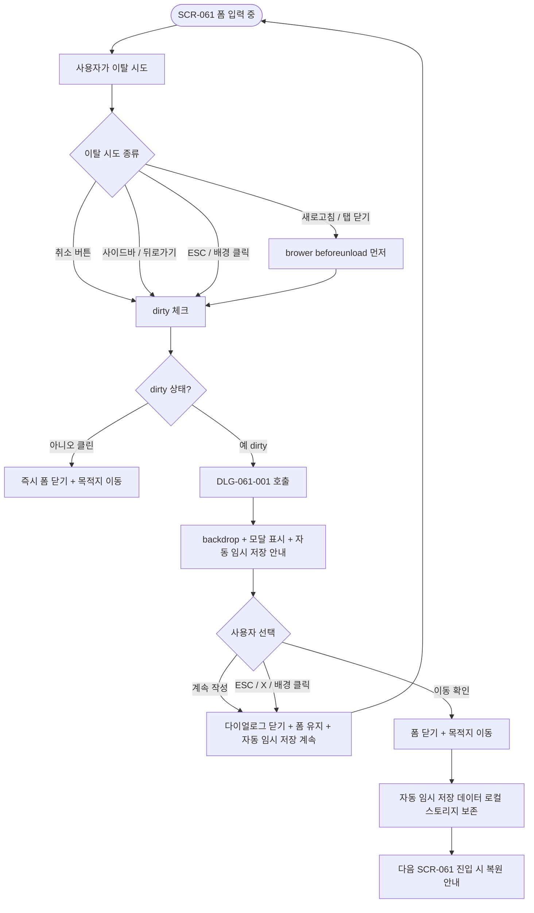
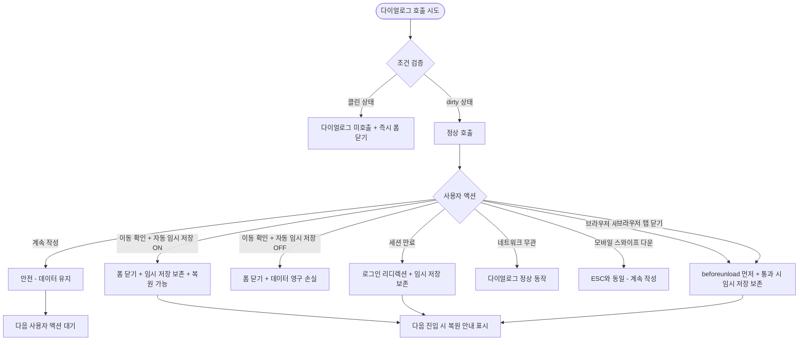

# DLG-061-001 직원 등록 폼 취소 확인 다이얼로그

## 1. 다이얼로그 메타 정보

이 문서는 DLG-061-001 직원 등록 폼 취소 확인 다이얼로그에 대한 자기완결형 요구사항 정의서입니다. 다른 문서를 함께 보지 않아도 이 한 장만으로 이 모달의 모든 트리거, 모든 입력, 모든 권한, 모든 예외 처리, 그리고 이 모달을 지탱하는 dirty 추적·자동 임시 저장·이탈 차단 운영 정책까지 전부 이해하고 구현할 수 있도록 작성합니다.

| 항목 | 값 |
|---|---|
| 작성일 | 2026-05-22 |
| 버전 | v1.0 |
| 상태 | 최신 통합본 반영 (정합화 완료) |
| 도메인 | D07 직원관리 |
| 다이얼로그 ID | DLG-061-001 |
| 다이얼로그명 | 직원 등록/수정 폼 취소 확인 (페이지 이탈 확인) |
| 다이얼로그 유형 | 페이지 이탈 확인 모달 (Navigation Guard Modal) |
| 부모 화면 | SCR-061 직원 등록/수정 |
| 호출 트리거 | SCR-061에서 [취소] 버튼 클릭, 사이드바·뒤로가기·새로고침 등 이탈 시도 (dirty 상태) |
| 우선순위 | P1 (출시 필수) |
| 기능코드 | STF-EXT-01 (직원 등록/수정) |
| 계약코드 | AUTH-02, STF-EXT-01 |
| 부모 기능 prefix | STF |
| 연계 다이얼로그 | DLG-060-001 (SCR-060 인라인 폼의 동일 패턴) |
| 연계 화면 | SCR-061 직원등록수정, SCR-060 직원목록 |

## 2. 다이얼로그 개요와 목적

DLG-061-001은 SCR-061 직원 등록/수정 전용 화면에서 작성 중인 폼을 취소하거나 페이지를 이탈할 때 입력 중인 데이터가 저장되지 않는다는 사실을 한 번 더 확인시켜 실수로 인한 데이터 손실을 방지하는 페이지 이탈 확인 모달입니다. SCR-060 인라인 빠른 폼의 이탈 확인은 DLG-060-001이 담당하며, 둘은 동일한 패턴을 따르지만 부모 화면이 다릅니다.

SCR-061은 본격적인 입력 폼 화면으로, 기본 정보·담당 서비스·급여 정보·로그인 계정·캘린더 색상·근로계약서까지 7개 섹션의 입력이 진행됩니다. 사용자가 여러 섹션을 입력하던 중 다른 작업이 생겨 페이지를 이탈하려 할 때, 또는 잘못된 직원을 선택해 수정하다가 돌아가려 할 때 이 모달이 호출되어 명시적 확인을 받습니다. SCR-061에는 30초 주기 자동 임시 저장이 활성화되어 있어, 사용자가 [이동 확인]을 선택해도 30초 이내의 데이터는 로컬 스토리지에 남아 다음 진입 시 복원 안내가 표시될 수 있습니다.

운영 맥락에서는 다음 시나리오가 대표적입니다. 매니저가 신규 트레이너 등록을 진행하다가 회의 시간이 가까워져 작업을 중단해야 할 때 이 모달이 호출되어 데이터 손실 여부를 묻습니다. 또는 직원 수정 모드에서 변경 사항을 적용하다가 다른 직원의 정보를 먼저 확인해야 할 때, 사이드바 메뉴 클릭으로 이탈을 시도하면 자동으로 이 모달이 차단합니다. 사용자가 "계속 작성"을 선택하면 폼이 유지되고, "이동 확인"을 선택하면 폼이 닫히고 SCR-060 목록으로 복귀합니다.

## 3. 호출 트리거와 부모 화면

이 다이얼로그는 SCR-061 직원 등록/수정 화면에서 다음 조건에서 호출됩니다.

첫 번째 조건은 SCR-061 페이지 하단 또는 sticky 헤더의 [취소] 버튼 클릭입니다. 폼이 dirty 상태(한 필드라도 변경된 상태)일 때만 이 모달이 호출되며, 클린 상태에서는 모달 없이 즉시 SCR-060으로 복귀합니다.

두 번째 조건은 브라우저 뒤로 가기 또는 사이드바 메뉴 클릭으로 페이지를 이탈하려 시도하는 경우입니다. SCR-061은 navigation guard가 설정되어 dirty 상태에서의 이탈 시도를 모두 가로채며, 이 모달이 자동으로 호출됩니다. 새로고침(F5 또는 Cmd+R) 시도도 브라우저 기본 확인("이 페이지를 떠나시겠습니까?") + 이 다이얼로그의 이중 차단으로 처리됩니다.

세 번째 조건은 브라우저 탭 닫기 또는 윈도우 닫기 시도입니다. 브라우저 기본 `beforeunload` 이벤트로 한 번 차단되며, 이 다이얼로그는 클라이언트 상태에 따라 후속으로 표시됩니다.

네 번째 조건은 SCR-061 내 다른 화면으로의 직접 이동입니다. 예를 들어 직무 변경 안내의 [SCR-081 권한 설정으로 이동] 링크나 임시 비밀번호 [재발급] 액션 같은 비대화형 이동은 자동 저장 또는 별도 처리로 분기되어 이 모달이 호출되지 않을 수 있습니다(테넌트 정책).

부모 화면인 SCR-061은 이 모달이 호출되는 동안 본문이 어둡게 처리되어(backdrop) 모달에 집중할 수 있는 시각적 환경을 만듭니다. 모달이 닫히면 어둡게 처리된 본문이 원래 상태로 돌아갑니다.

자동 임시 저장은 30초 주기로 로컬 스토리지에 dirty 데이터를 백업합니다. 따라서 사용자가 [이동 확인]을 선택해 폼이 닫혀도 30초 이내의 데이터는 로컬 스토리지에 남아 있으며, 같은 브라우저·디바이스에서 SCR-061에 재진입하면 "이전에 작성하던 내용이 있습니다. 복원하시겠습니까?" 안내가 표시됩니다(별도 알림 패널). 이는 이 다이얼로그의 직접 책임은 아니지만, 연계 정책으로 함께 동작합니다.

## 4. 레이아웃과 UI 구성

이 다이얼로그는 화면 중앙에 배치되는 작은 모달입니다. 데스크톱·태블릿에서는 약 400px 가로폭의 카드형 모달이며, 모바일에서는 화면 하단에서 슬라이드 업되는 바텀시트 형태로 자동 전환됩니다. 모달 외부 본문은 backdrop으로 어둡게 처리되어 모달에 시선이 집중되게 합니다.

모달 상단에는 제목이 있습니다. 제목 텍스트는 "페이지를 벗어나시겠습니까?"이며, 본문보다 큰 폰트와 굵은 weight로 표시됩니다. 제목 우측 끝에는 닫기(X) 아이콘이 있으며, 이 아이콘 클릭은 [계속 작성]과 동일하게 동작합니다(데이터 보호 정책).

제목 아래에는 안내 메시지가 한 줄로 표시됩니다. 메시지 텍스트는 "작성 중인 내용이 저장되지 않습니다. 페이지를 이동하시겠습니까?"이며, "저장되지 않습니다" 부분이 약간 강조되어 데이터 손실 위험을 알립니다.

안내 메시지 아래에는 자동 임시 저장 안내가 작은 글씨로 표시될 수 있습니다(테넌트 정책). 예를 들어 "이전에 작성한 내용은 30초 주기 임시 저장으로 일부 복원 가능합니다"처럼 사용자가 데이터 손실을 덜 두려워하도록 안내합니다. 자동 임시 저장이 비활성화된 환경에서는 이 안내가 표시되지 않습니다.

모달 하단에는 액션 버튼 두 개가 가로로 배치됩니다. 좌측에 [계속 작성] 버튼이, 우측에 [이동 확인] 버튼이 있습니다. [계속 작성]은 기본 톤(회색 또는 보조 색)이며, [이동 확인]은 강조 톤(빨강 또는 주황)으로 표시되어 데이터 손실 위험을 시각적으로 알립니다. 기본 포커스는 [계속 작성]에 놓여, Enter 키 입력 시 안전한 액션이 선택되도록 설계됩니다.

## 5. 입력 필드와 검증

이 다이얼로그는 입력 필드가 없는 단순 확인 모달입니다. 사용자는 두 버튼 중 하나를 선택하기만 하면 되며, 별도의 입력 검증은 적용되지 않습니다.

다이얼로그가 호출될 때 부모 화면의 폼 dirty 상태가 확인됩니다. dirty 상태는 SCR-061의 7개 섹션(기본 정보·담당 서비스·급여 정보·로그인 계정·캘린더 색상·근로계약서·권한 보안 요약) 모든 필드의 변경 여부를 OR 조건으로 합산해 결정됩니다. 한 필드라도 초기값과 다르면 dirty=true가 되며, 모든 필드가 초기값과 동일하면 dirty=false가 되어 이 다이얼로그가 호출되지 않고 즉시 폼이 닫힙니다.

dirty 판정은 실시간으로 갱신되므로, 사용자가 한 필드를 변경했다가 다시 원래 값으로 되돌리면 dirty=false로 자동 전환되어 이 다이얼로그가 호출되지 않습니다.

## 6. 버튼·아이콘·링크 액션 전체 정의

[계속 작성] 버튼은 다이얼로그를 닫고 부모 폼(SCR-061)으로 돌아갑니다. 입력된 데이터는 그대로 유지되며, 사용자는 폼 작업을 이어갈 수 있습니다. 30초 주기 자동 임시 저장은 백그라운드에서 계속 동작합니다.

이 액션은 데이터 보호 목적이며, ESC 키, 배경 클릭, 모달 상단의 X 아이콘 클릭 모두 이 액션과 동일하게 동작합니다.

[이동 확인] 버튼은 부모 폼(SCR-061)을 닫고 SCR-060 목록 또는 사용자가 시도한 목적지(사이드바·뒤로가기 등)로 이동합니다. 입력된 데이터는 폼에서 폐기되지만, 30초 주기 자동 임시 저장 데이터는 로컬 스토리지에 남아 다음 진입 시 복원 안내가 표시될 수 있습니다. 이 액션은 데이터 손실 위험이 있으므로 강조 톤으로 표시되며, 기본 포커스는 [계속 작성]에 놓여 실수 클릭이 방지됩니다.

ESC 키 입력은 [계속 작성]과 동일하게 동작합니다. 사용자가 모달을 닫으려는 의도가 명확하지 않을 때 데이터를 보호하기 위한 정책입니다.

배경 클릭(모달 외부 backdrop)은 [계속 작성]과 동일하게 동작합니다. 실수 클릭으로 데이터가 손실되지 않도록 보호하는 정책입니다.

모달 상단의 X 닫기 아이콘은 [계속 작성]과 동일하게 동작합니다. 일반적인 모달의 X 아이콘은 닫기 액션이지만, 이 다이얼로그에서는 데이터 보호를 위해 안전한 액션으로 통일됩니다.

키보드 Tab 키는 [계속 작성] → [이동 확인] 순서로 포커스가 이동합니다. Shift+Tab은 역순으로 동작합니다.

브라우저 뒤로 가기·새로고침·탭 닫기 같은 이탈 시도가 dirty 상태에서 발생하면, 이 다이얼로그가 자동으로 호출되어 사용자의 명시적 확인을 받기 전까지 이탈을 차단합니다. [이동 확인] 선택 시 원래 시도한 이탈 목적지로 이동합니다.

모든 버튼은 클릭 후 응답이 돌아오기 전까지 비활성화되어 중복 클릭이 차단됩니다. 다만 이 다이얼로그는 단순 yes/no 확인이므로 백엔드 호출이 거의 즉시 끝나며, 사용자가 인지할 만한 로딩 상태는 발생하지 않습니다.

## 7. 호출되는 모달과 토스트

이 다이얼로그는 다른 다이얼로그를 호출하지 않으며, 자기 자신이 종료 모달입니다.

[이동 확인] 클릭 후 폼이 닫힐 때 토스트는 별도로 표시되지 않습니다. 단순히 폼이 사라지고 사용자가 시도한 목적지(SCR-060 목록·다른 사이드바 메뉴 등)로 이동하는 것만으로 결과가 전달됩니다.

[계속 작성] 클릭 후에도 토스트는 표시되지 않습니다. 단순히 다이얼로그가 사라지고 부모 폼이 그대로 유지되는 것만으로 결과가 전달됩니다.

자동 임시 저장이 활성화된 환경에서 다음 진입 시에는 별도의 알림 패널 또는 토스트로 "이전에 작성하던 내용이 있습니다. 복원하시겠습니까?" 안내가 표시됩니다. 이는 SCR-061의 책임이며, 이 다이얼로그 자체에서는 처리되지 않습니다.

세션 만료 등 비정상 이탈이 발생하면 자동 임시 저장 데이터가 로컬 스토리지에 보존되어, 로그인 후 SCR-061 재진입 시 복원 안내가 표시됩니다.

## 8. 데이터 흐름과 외부 연동

이 다이얼로그는 외부 API를 호출하지 않습니다. 모든 처리는 클라이언트 메모리 안에서 이루어지며, [계속 작성]은 단순히 모달을 닫고, [이동 확인]은 부모 폼의 상태를 reset해 목적지로 이동합니다.

다만 부모 폼에서 데이터 변경이 진행 중인 경우, 다이얼로그 호출 시점에 dirty 상태 플래그를 확인합니다. 이 플래그는 SCR-061의 React/Vue 상태 관리에 의해 유지되며, 다이얼로그는 이 플래그를 읽어 호출 여부를 결정하지만 자체적으로 변경하지는 않습니다.

자동 임시 저장은 SCR-061의 책임이며, 30초 주기로 로컬 스토리지에 dirty 데이터를 저장합니다. 저장 키는 `staff-form-draft-{userId}` 형태이며, 사용자별로 분리되어 다른 운영자의 데이터와 섞이지 않습니다. 저장된 데이터에는 만료 시각(예: 24시간 후)이 함께 기록되어, 오래된 임시 데이터는 자동 무효화됩니다.

[이동 확인] 액션 직후에는 부모 폼이 닫히면서 dirty 플래그가 자동으로 초기화됩니다. 다만 자동 임시 저장 데이터는 로컬 스토리지에 남아 있으므로, 같은 브라우저·디바이스에서 SCR-061에 재진입하면 복원 안내가 표시됩니다.

navigation guard는 부모 화면(SCR-061)의 React Router · Vue Router level에서 등록되어, dirty 상태에서의 모든 이탈 시도를 가로챕니다. 이 다이얼로그는 navigation guard의 결과로 호출되는 UI 컴포넌트이며, 실제 이탈 결정은 [이동 확인] 클릭 직후 router가 처리합니다.

브라우저 `beforeunload` 이벤트는 새로고침·탭 닫기·윈도우 닫기 시도에 대응합니다. dirty 상태에서 이 이벤트가 발생하면 브라우저 기본 확인("이 페이지를 떠나시겠습니까?")이 먼저 표시되며, 이를 통과한 후에야 페이지가 실제로 떠나집니다. 이 다이얼로그는 SPA 내부 이동에 대응하며, 브라우저 기본 이벤트와 함께 이중 안전 장치를 구성합니다.

감사 로그는 이 다이얼로그 자체에서는 기록되지 않습니다. 단순한 UX 확인 모달이므로 감사 추적 가치가 없으며, 부모 폼의 저장 실패·취소 이벤트가 별도로 SCR-097에 기록될 수도 있지만 그것은 SCR-061의 책임입니다.

## 9. 화면 상태와 예외 처리

이 다이얼로그는 다음 상태들을 가집니다.

기본 표시 상태는 다이얼로그가 호출된 직후의 일반 상태입니다. 제목·안내 메시지·자동 임시 저장 안내(선택)·두 버튼이 표시되고, 기본 포커스는 [계속 작성]에 놓입니다. 부모 화면 본문은 backdrop으로 어둡게 처리됩니다.

처리 중 상태는 [이동 확인] 클릭 직후 부모 폼이 닫히고 목적지로 이동하는 동안의 짧은 transition 상태입니다. 거의 즉시 끝나므로 사용자가 인지할 만한 시간은 아닙니다.

완료 상태는 [이동 확인] 후 폼이 닫히고 목적지로 이동한 상태입니다. 다이얼로그 자체는 사라진 상태입니다.

예외 케이스별 처리는 다음과 같습니다.

부모 폼이 클린 상태인데 [취소]를 눌렀다면 이 다이얼로그가 호출되지 않고 즉시 폼이 닫혀야 합니다. SCR-061에서 dirty 체크를 정확히 수행해야 합니다.

세션 만료 중 다이얼로그가 떠 있는 경우, 부모 화면이 자동으로 로그인 페이지로 리디렉션됩니다. 자동 임시 저장 데이터는 로컬 스토리지에 보존되어, 로그인 후 SCR-061 재진입 시 복원 안내가 표시됩니다.

권한이 부족한 사용자가 이 다이얼로그를 호출할 일은 없습니다. SCR-061에 진입하려면 이미 매니저+ 권한이 있어야 하므로, 이 다이얼로그까지 도달했다면 권한 문제는 발생하지 않습니다.

네트워크 오류는 이 다이얼로그에 영향을 주지 않습니다. 외부 API 호출이 없으므로 네트워크 상태와 무관하게 동작합니다.

모바일에서는 다이얼로그가 바텀시트 형태로 자동 전환되며, 좌우 스와이프나 위에서 아래로 드래그하는 제스처는 ESC 키와 동일하게 [계속 작성]으로 동작합니다.

키보드만 사용하는 접근성 사용자는 Tab/Shift+Tab으로 버튼을 이동하고 Enter로 선택할 수 있습니다. Screen reader는 모달이 열릴 때 제목과 안내 메시지를 읽어주며, 두 버튼의 의미가 라벨로 명확히 전달됩니다.

브라우저 탭 닫기·새로고침 시도는 brower beforeunload 이벤트로 먼저 차단되며, 이 다이얼로그는 SPA 내부 이동에서만 호출됩니다.

자동 임시 저장이 비활성화된 환경(테넌트 정책)에서는 [이동 확인] 후 데이터가 영구 손실됩니다. 모달 안에 자동 임시 저장 안내가 표시되지 않아 사용자가 더 신중하게 결정하도록 합니다.

## 10. 권한별 처리

이 다이얼로그는 부모 화면(SCR-061)의 권한 정책을 따릅니다. 다이얼로그 자체에는 별도의 권한 분기가 없으며, SCR-061에 진입할 권한이 있는 사용자만 이 다이얼로그를 만날 수 있습니다.

본사 슈퍼관리자(superAdmin) · 본사 최고관리자(primary) · 센터장(owner) · 매니저(manager)는 SCR-061에서 직원 등록·수정이 가능하므로 이 다이얼로그를 호출하게 됩니다. 모든 권한이 동일한 UX를 경험합니다. 본사 권한자는 본사 통합 모드에서 다른 지점 직원도 등록·수정할 수 있으며, 센터장·매니저는 자기 지점 직원만 등록·수정합니다.

FC(fc) · 트레이너(trainer) · 스태프(staff) · 프런트(front)는 SCR-061에 진입할 수 없으므로 이 다이얼로그를 만날 수 없습니다. 사이드바·직원 목록의 등록·수정 진입점이 모두 hidden이며, 직접 URL 접근 시 권한 차단 페이지가 표시됩니다.

읽기 전용(readonly)은 SCR-061 자체에 접근할 수 없으므로 이 다이얼로그를 만날 수 없습니다. 사이드바에서도 메뉴가 숨겨지고, 직접 URL 접근 시 대시보드로 자동 이동됩니다.

직원 본인은 본인 정보 조회만 가능하고 직접 수정은 불가하므로, SCR-061에 수정 모드로 진입할 수 없습니다.

권한이 없는 사용자가 직접 URL이나 우회 경로로 이 다이얼로그에 도달하려고 해도, 부모 화면이 권한 차단 페이지로 자동 리디렉션되므로 다이얼로그가 호출되지 않습니다.

이 다이얼로그가 호출된 시점에는 이미 권한 검증이 통과된 상태이므로, 다이얼로그 안에서 별도의 권한 차단은 발생하지 않습니다.

## 11. 메인 흐름

이 다이얼로그의 핵심 동작 흐름을 다이어그램으로 표현합니다.

## 12. 에러와 예외 흐름

에러와 예외 상황에서의 분기를 별도 흐름으로 표현합니다.

## 13. 핵심 디자인 요청사항

이 다이얼로그는 단순하지만 명확해야 합니다. DLG-060-001과 동일한 디자인 패턴을 따르되, 자동 임시 저장 안내가 추가된 점이 차이점입니다.

모달 크기는 화면 중앙에 살짝 떠 있는 느낌으로 약 400px 가로폭이 적당합니다. 자동 임시 저장 안내가 표시되는 경우 세로가 약간 길어질 수 있습니다.

제목은 본문보다 큰 폰트(18-20px)와 굵은 weight로 표시되어, 사용자가 모달의 의도를 즉시 인지할 수 있게 합니다.

안내 메시지의 "저장되지 않습니다" 부분은 약간 강조(굵은 weight)되어 데이터 손실 위험이 전달됩니다.

자동 임시 저장 안내는 본문보다 작은 글씨(12-13px)로 회색 톤으로 표시되어, 정보 우선순위가 낮음을 시각적으로 알립니다. 사용자가 모달의 핵심 메시지를 먼저 인지하고, 보조 정보로 자동 임시 저장을 참고할 수 있도록 설계됩니다.

두 버튼의 색상 분기가 중요합니다. [계속 작성]은 회색 또는 보조 색(안전 톤)으로, [이동 확인]은 강조 톤(주황 또는 약한 빨강)으로 표시됩니다. DLG-060-002 퇴사 처리 확인보다는 약한 강조 톤이 적합한데, 이 다이얼로그는 데이터 손실 가능성이 있지만 자동 임시 저장으로 부분 복원이 가능하기 때문입니다.

기본 포커스는 [계속 작성]에 놓여, Enter 키 실수 입력으로 데이터가 손실되지 않도록 보호합니다.

backdrop은 본문을 약 50% 정도 어둡게 처리해, 모달에 시선이 집중되면서도 본문이 완전히 가려지지 않아 컨텍스트가 유지됩니다.

모바일 바텀시트는 화면 하단에서 부드럽게 슬라이드 업되며, 모달 상단에 작은 드래그 핸들이 표시되어 사용자가 위에서 아래로 드래그해 닫을 수 있음을 시각적으로 알려줍니다. 드래그 닫기는 [계속 작성]과 동일하게 동작해 데이터가 보호됩니다.

애니메이션은 모달 등장 시 fade-in + scale-up 또는 모바일 슬라이드-업으로 부드럽게 처리되며, 닫힐 때도 같은 방향으로 부드럽게 사라집니다.

키보드 접근성은 Tab 키로 두 버튼 사이를 이동하고 Enter로 선택할 수 있어야 하며, screen reader는 모달 열림 시 제목·안내 메시지·자동 임시 저장 안내·두 버튼의 라벨을 순서대로 읽어주어야 합니다.

## 14. 운영 정책 (이 다이얼로그에 연결된 부분)

이 다이얼로그는 SCR-061의 본격적인 입력 폼에 대한 데이터 손실 방지 정책의 일환입니다.

dirty 상태 추적 정책은 SCR-061의 7개 섹션 모든 필드에 적용됩니다. 한 필드라도 초기값과 다르면 dirty=true가 되며, 모든 필드가 초기값과 동일하면 dirty=false입니다. 사용자가 한 필드를 변경했다가 다시 원래 값으로 되돌리면 dirty=false로 자동 전환되어 이 다이얼로그가 호출되지 않습니다.

자동 임시 저장 정책은 30초 주기로 로컬 스토리지에 dirty 데이터를 백업합니다. 저장 키는 `staff-form-draft-{userId}` 형태이며 사용자별로 분리됩니다. 저장된 데이터에는 만료 시각(예: 24시간 후)이 함께 기록되어 오래된 데이터는 자동 무효화됩니다. 이 정책으로 사용자가 [이동 확인]을 선택해도 30초 이내의 데이터는 복원 가능합니다.

navigation guard 정책은 SCR-061의 React Router · Vue Router level에서 등록되어 dirty 상태에서의 모든 이탈 시도를 가로챕니다. 사이드바 클릭·뒤로가기·새로고침·탭 닫기 등 모든 이탈 경로가 자동으로 차단되며, 이 다이얼로그가 호출되어 명시적 확인을 받습니다.

브라우저 beforeunload 이중 안전 장치 정책은 브라우저 새로고침·탭 닫기·윈도우 닫기 시도에 대응합니다. 브라우저 기본 확인이 먼저 표시되고, 이를 통과한 후에야 페이지가 실제로 떠나집니다. 이 다이얼로그는 SPA 내부 이동에 대응하며, 브라우저 기본 이벤트와 함께 이중 안전 장치를 구성합니다.

데이터 보호 우선 정책은 ESC 키, 배경 클릭, 모달 상단 X 아이콘 모두를 [계속 작성]과 동일하게 동작시킵니다. 일반적인 모달의 X 아이콘은 닫기 액션이지만, 이 다이얼로그에서는 데이터 보호를 위해 안전한 액션으로 통일됩니다. 사용자가 데이터를 폐기하려면 명시적으로 [이동 확인] 버튼을 눌러야 합니다.

기본 포커스 정책은 [계속 작성]에 포커스를 두어 Enter 키 실수 입력으로 데이터가 손실되지 않도록 보호합니다. DLG-060-002의 위험한 액션과 달리 이 다이얼로그는 데이터 손실이 부분 복원 가능하므로, 강도가 약간 낮은 안전 장치만 적용됩니다.

권한 정책은 부모 화면(SCR-061)의 권한을 따릅니다. 매니저+ 권한자만 SCR-061에 진입할 수 있으므로 이 다이얼로그를 만날 수 있으며, FC·트레이너·스태프·프런트·readonly는 부모 화면 진입 자체가 차단됩니다.

감사 로그 정책은 이 다이얼로그에 적용되지 않습니다. 단순한 UX 확인 모달이므로 감사 추적 가치가 없습니다. 부모 폼의 저장 실패·취소 이벤트는 SCR-097에 별도로 기록될 수 있지만 그것은 SCR-061의 책임입니다.

접근성 정책은 키보드 조작과 screen reader 지원을 보장합니다. Tab 키 포커스 이동, Enter 키 선택, screen reader 라벨 읽기가 모두 표준 a11y 가이드라인을 따라 구현되어야 합니다.

모바일 UX 정책은 바텀시트 패턴을 기본으로 합니다. 드래그 닫기 제스처도 [계속 작성]과 동일하게 동작해 데이터 보호 원칙이 유지됩니다.

DLG-060-001과의 분리 정책에 따라 SCR-060 인라인 빠른 폼은 DLG-060-001이, SCR-061 전용 폼은 DLG-061-001이 담당합니다. 두 다이얼로그는 같은 UX 패턴이지만 부모 화면 컨텍스트가 다르고, SCR-061에는 자동 임시 저장이 추가되어 있어 별도 ID로 관리됩니다.

이상의 모든 정책은 이 다이얼로그를 구현하고 운영하는 사람이 별도 문서 없이 이 한 장만 보면 이해할 수 있도록 풀어 적었습니다. 정책이 바뀌면 이 문서가 함께 갱신되어야 하며, 코드 변경과 정책 변경은 항상 짝지어 진행됩니다.
