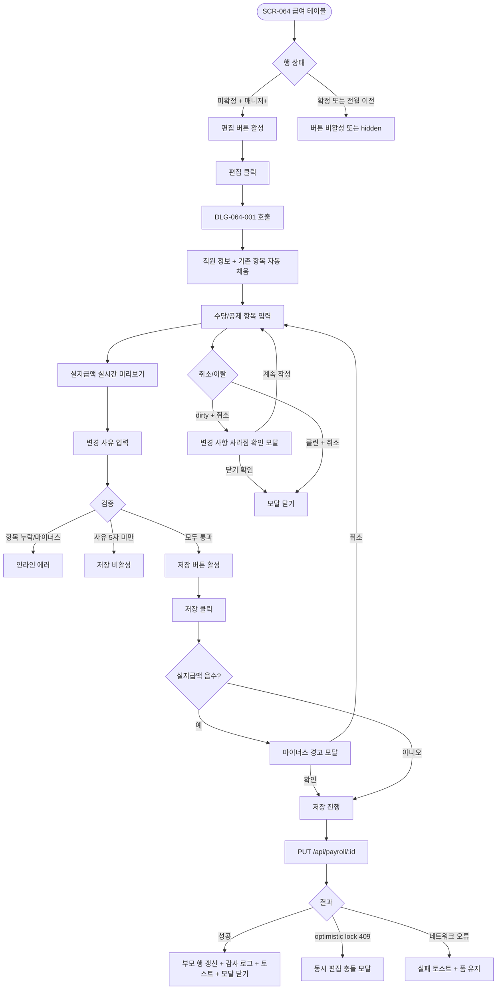

# DLG-064-001 급여 상세 편집 다이얼로그

## 1. 다이얼로그 메타 정보

이 문서는 DLG-064-001 급여 상세 편집 다이얼로그에 대한 자기완결형 요구사항 정의서입니다. 다른 문서를 함께 보지 않아도 이 한 장만으로 이 모달의 모든 트리거, 수당·공제 입력 검증, 실시간 계산, 권한, 예외 처리, 그리고 이 모달을 지탱하는 변경 사유 필수·마이너스 경고·감사 추적 정책까지 전부 이해하고 구현할 수 있도록 작성합니다.

| 항목 | 값 |
|---|---|
| 작성일 | 2026-05-22 |
| 버전 | v1.0 |
| 상태 | 최신 통합본 반영 (정합화 완료) |
| 도메인 | D07 직원관리 |
| 다이얼로그 ID | DLG-064-001 |
| 다이얼로그명 | 급여 상세 편집 (수당·공제 수동 조정) |
| 다이얼로그 유형 | 입력 폼 모달 (Form Modal with Realtime Calculation) |
| 부모 화면 | SCR-064 급여 관리 |
| 호출 트리거 | SCR-064 직원별 급여 테이블 행의 [편집] 버튼 클릭 |
| 우선순위 | P0 (출시 필수) |
| 기능코드 | PAY-STF-02 (급여 관리) |
| 계약코드 | PAY-STF-02 |
| 부모 기능 prefix | PAY-STF |
| 연계 다이얼로그 | DLG-064-002 (편집 후 확정 시), 마이너스 실지급 경고 모달 |
| 연계 화면 | SCR-064 급여관리, SCR-065 급여명세서, SCR-097 감사로그 |

## 2. 다이얼로그 개요와 목적

DLG-064-001은 SCR-064 급여 관리에서 자동 계산된 급여 항목 중 수당·공제 등 일부 항목을 관리자가 직접 조정해야 할 때 사용하는 입력 폼 모달입니다. 기본급은 직원 정보(SCR-061)에서 가져온 고정값이며, 이 다이얼로그에서는 부가 항목인 수당·공제만 수정합니다. 수당·공제 항목은 자유롭게 추가·삭제·금액 조정이 가능하며, 변경 사유는 필수 입력으로 감사 로그에 기록됩니다.

이 모달의 핵심 기능은 실지급액 미리보기입니다. 사용자가 수당·공제 항목을 변경하는 동안 실지급액이 실시간으로 재계산되어 모달 하단에 표시되며, 운영자가 입력 결과를 즉시 확인하면서 작업할 수 있습니다. 계산 공식은 **실지급액 = 기본급 + 수당 합계 − 공제 합계 + 수수료**이며, 공제가 기본급+수당을 초과해 실지급액이 음수가 될 때는 [저장] 클릭 시 별도 경고 모달이 호출됩니다.

운영 맥락에서는 다음 시나리오가 대표적입니다. 매니저가 월말에 자동 계산된 급여를 점검하다가 매출 우수 직원에게 성과 수당을 추가하려 할 때 이 모달을 열어 항목을 추가합니다. 지각·결근 자동 공제와 별개로 운영자가 명시적인 사유 공제를 추가할 때도 이 모달이 사용됩니다. 트레이너 수업 수수료는 자동 계산되지만, 특별 보너스나 일회성 수당 같은 비정기 항목은 이 모달에서 수동으로 추가합니다. 변경 사유는 감사 로그에 기록되어 사후 감사가 가능하므로, 운영자는 사유를 명확히 기록하는 것이 중요합니다.

확정된 급여 행에서는 이 모달이 read-only로 표시되어 편집이 불가하며, 편집하려면 먼저 [확정 취소]를 거쳐야 합니다. 전월 이전 월의 행도 마찬가지로 read-only이며 잠금 정책이 적용됩니다.

따라서 이 모달은 단순한 입력 폼이 아니라, 실시간 계산·변경 사유 추적·확정 상태 검증·마이너스 경고까지 모두 다루는 정밀 편집 도구입니다.

## 3. 호출 트리거와 부모 화면

이 다이얼로그는 SCR-064 급여 관리 화면에서 다음 조건에서 호출됩니다.

첫 번째 조건은 직원별 급여 테이블의 행 우측 [편집] 버튼 클릭입니다. 매니저+ 권한자가 누를 수 있으며, 확정 상태가 "미확정"인 행에서만 활성화됩니다. 확정된 행에서는 [편집] 버튼이 비활성화되거나 클릭 시 "확정 취소 후 편집하세요" 안내가 토스트로 표시됩니다.

두 번째 조건은 직원 행을 클릭해 상세 패널이 열린 상태에서 패널 안의 [편집] 액션 버튼 클릭입니다(테넌트에 따라 상세 패널 패턴 활성화). 이 경우 패널이 닫히면서 모달이 열립니다.

부모 화면인 SCR-064는 이 모달이 호출되는 동안 본문이 어둡게 처리되어(backdrop) 모달에 집중할 수 있는 시각적 환경을 만듭니다. 모달이 닫히면 부모 테이블의 해당 행이 즉시 갱신되며, 실지급액과 수당·공제 합계가 새 값으로 표시됩니다.

이 모달은 단일 직원 단위로만 동작하며, 일괄 편집은 지원하지 않습니다. 여러 직원을 동시에 편집하려면 직원별로 모달을 반복 호출해야 합니다. 이는 변경 사유를 개별 기록해야 한다는 감사 정책 때문입니다.

전월 이전 월에서는 모든 행에서 [편집] 버튼이 hidden되어 이 모달이 호출되지 않습니다. 매니저+ 미만 권한자에게는 [편집] 버튼이 hidden 또는 비활성화되어 이 모달에 도달할 수 없습니다.

## 4. 레이아웃과 UI 구성

이 다이얼로그는 화면 중앙에 배치되는 중간~큰 크기의 모달입니다. 데스크톱·태블릿에서는 약 600px 가로폭의 카드형 모달이며, 모바일에서는 화면 하단에서 슬라이드 업되는 풀스크린 바텀시트로 자동 전환됩니다. 모달 외부 본문은 backdrop으로 어둡게 처리되어 모달에 시선이 집중되게 합니다.

모달 상단에는 직원 정보 요약 헤더가 있습니다. 좌측에는 편집 대상 직원의 이름·역할(직무 배지)·지급 월이 한 줄로 표시되고, 그 아래에 작은 글씨로 기본급이 표시됩니다(기본급은 이 모달에서 편집 불가). 우측 끝에는 닫기(X) 아이콘이 있으며, dirty 상태에서는 이탈 확인을 거칩니다.

헤더 아래에는 수당 항목 목록 섹션이 있습니다. 섹션 제목 "수당" 아래에 항목별 행이 펼쳐지며, 각 행은 항목명(텍스트 입력 또는 사전 정의 드롭다운)과 금액(숫자 입력, 콤마 자동 포맷), 우측 끝에 [삭제] 아이콘이 있습니다. 사전 정의 항목으로는 "식대", "교통비", "특별 수당", "성과 수당" 등이 드롭다운으로 제공되며, 직접 입력도 가능합니다. 섹션 하단에 [+ 수당 항목 추가] 버튼이 있어 새 행을 추가할 수 있습니다.

수당 섹션 아래에는 공제 항목 목록 섹션이 있습니다. 동일한 구조로 항목명과 금액 입력 행이 펼쳐지며, 사전 정의 항목으로는 "국민연금", "건강보험", "고용보험", "산재보험", "소득세", "지각 공제", "결근 공제", "기타 공제"가 제공됩니다. 섹션 하단에 [+ 공제 항목 추가] 버튼이 있습니다.

자동 추가 항목(지각·결근 자동 공제 등)은 별도 라벨 배지("자동")가 붙어 표시되며, 사용자가 직접 추가한 항목과 시각적으로 구분됩니다. 자동 항목도 금액 수정·삭제가 가능하지만, 변경 사유에 그 내용을 기록하는 것이 권장됩니다.

공제 섹션 아래에는 수수료 표시 영역이 있습니다(트레이너 등 수수료 정책이 ON인 경우만). 트레이너의 수업 수수료는 진행 건수 × 단가로 자동 계산되어 read-only로 표시되며, 이 모달에서는 직접 편집이 불가합니다. 수수료 정책이 OFF인 경우 이 영역이 hidden됩니다.

수수료 아래에는 변경 사유 입력 textarea가 있습니다. 라벨은 "변경 사유 (필수)"이며, placeholder로 "예: 매출 우수자 성과 수당 추가, 회의 외근 지각 면제 등"이 표시됩니다. 미입력 시 [저장] 버튼이 비활성화되어 사용자가 사유를 기록하도록 강제합니다.

모달 하단에는 실지급액 미리보기가 sticky로 고정 배치됩니다. "기본급 + 수당 합계 − 공제 합계 + 수수료 = 실지급액" 공식이 큰 폰트로 시각화되며, 각 합계값과 최종 실지급액이 콤마 포맷으로 표시됩니다. 실지급액이 음수가 되면 빨강 톤으로 강조 표시됩니다.

미리보기 아래에는 액션 버튼 두 개가 가로로 배치됩니다. 좌측에 [취소] 버튼이, 우측에 [저장] 버튼이 있습니다. [취소]는 기본 톤이며, [저장]은 강조 색(파랑 또는 녹색)으로 표시됩니다. 변경 사유 미입력 또는 수당 마이너스 입력 같은 검증 실패 시 [저장] 버튼이 비활성화 유지됩니다.

확정된 행 또는 전월 이전 월에서 호출된 경우 모달 전체가 read-only로 표시되며, 입력 필드가 비활성화되고 [저장] 버튼이 hidden되며 [닫기] 버튼만 노출됩니다. 상단에 "확정 취소 후 편집하세요" 또는 "이전 월은 수정할 수 없습니다" 안내 배너가 표시됩니다.

## 5. 입력 필드와 검증 규칙

수당 항목 입력은 항목명(텍스트, 1~30자)과 금액(0 이상 정수, 콤마 자동 포맷) 두 필드로 구성됩니다. 항목명 미입력 시 인라인 에러 "항목명을 입력해주세요"가 표시되고, 금액 마이너스 입력 시 "수당은 0 이상이어야 합니다" 인라인 에러가 표시됩니다. 둘 다 [저장] 버튼을 비활성화합니다.

공제 항목 입력도 동일한 구조이며, 항목명과 금액 검증이 동일하게 적용됩니다. 공제는 0 이상이어야 하지만, 음수 공제(즉 가산 효과)는 정책적으로 차단됩니다. 가산 효과가 필요하면 수당 항목으로 추가해야 합니다.

항목 추가 시 같은 항목명이 중복되면 인라인 경고 "이미 존재하는 항목입니다"가 표시되고 저장은 가능하지만, 운영자가 의도를 한 번 더 확인하도록 합니다(예: 식대를 두 번 입력하는 경우 합산되어 계산됨).

변경 사유 textarea는 필수 입력이며, 최소 5자 이상이어야 합니다. 미입력 또는 5자 미만이면 인라인 에러 "변경 사유는 5자 이상 입력해주세요"가 표시되고 [저장] 버튼이 비활성화됩니다.

실지급액 검증은 다음과 같이 동작합니다. 공제 합계 > 기본급 + 수당 합계 + 수수료가 되면 실지급액이 음수가 되며, 이때 [저장] 버튼은 활성화되지만 클릭 시 별도 경고 모달이 호출됩니다. "실지급액이 음수가 됩니다. 진행하시겠습니까?"라는 안내와 함께 [확인] / [취소] 버튼이 있으며, 확인 시 음수 실지급액으로 저장되고 명세서 발송 시에도 음수로 표시됩니다.

검증은 클라이언트에서 실시간으로 이루어지지만, 저장 시 서버에서 한 번 더 검증됩니다. 동시 편집 race condition으로 서버 검증에서 충돌이 발견되면 인라인 에러 또는 모달 안내가 표시되고 폼 입력값은 유지됩니다.

## 6. 버튼·아이콘·링크 액션 전체 정의

[+ 수당 항목 추가] 버튼은 새 빈 수당 행을 섹션 하단에 추가합니다. 항목명과 금액이 비어 있는 상태로 추가되며, 사용자가 입력해야 검증이 진행됩니다. 사전 정의 항목 드롭다운에서 자주 쓰는 항목을 빠르게 선택할 수 있습니다.

[+ 공제 항목 추가] 버튼은 동일한 동작으로 새 공제 행을 추가합니다.

각 항목 행의 [삭제] 아이콘(우측 끝)은 해당 행을 즉시 제거합니다. 자동 추가 항목(지각·결근 공제 등)도 삭제 가능하며, 삭제 시 변경 사유에 그 내용을 기록하는 것이 권장됩니다.

각 항목 행의 항목명 필드는 텍스트 직접 입력 또는 사전 정의 드롭다운에서 선택할 수 있습니다. 드롭다운에는 자주 쓰는 항목 6~10종이 제공되며, "기타" 선택 시 직접 입력 모드로 전환됩니다.

각 항목 행의 금액 필드는 숫자만 입력되며, 입력 즉시 콤마가 자동 포맷됩니다(예: 100000 → 100,000). 빈 값은 0으로 처리되며 인라인 에러가 표시됩니다.

변경 사유 textarea는 자유 입력이며, 5자 이상이어야 [저장] 버튼이 활성화됩니다. 사전 정의 사유 드롭다운(예: "성과 수당 추가", "지각 면제", "기타")이 함께 제공되어 선택 시 textarea에 자동 입력됩니다.

[저장] 버튼은 강조 색으로 표시되며, 검증 통과 시 활성화됩니다. 클릭 시 모달이 로딩 상태로 전환되어 모든 버튼이 비활성화되고, 백엔드로 저장 요청이 전송됩니다. 음수 실지급액이면 별도 경고 모달이 먼저 호출됩니다. 성공 시 모달이 닫히고 부모 화면의 해당 행이 즉시 갱신되며 "급여 항목이 수정되었어요" 성공 토스트가 표시됩니다.

[취소] 버튼은 기본 톤이며, dirty 상태에서는 "변경 사항이 사라집니다. 닫으시겠습니까?" 확인을 거쳐 모달을 닫습니다. 클린 상태에서는 즉시 닫힙니다.

ESC 키, 배경 클릭, 모달 상단 X 아이콘은 [취소]와 동일하게 동작합니다.

키보드 Tab 키는 위에서 아래로 입력 필드를 순서대로 이동하며, Shift+Tab은 역순으로 동작합니다.

확정된 행 또는 전월 이전 월에서 호출된 경우 모든 입력 필드와 [저장] 버튼이 hidden되거나 비활성화되며, [닫기] 버튼만 노출됩니다.

모든 버튼은 처리 중 비활성화되어 중복 클릭이 차단됩니다.

## 7. 호출되는 모달과 토스트

### 7-1. 마이너스 실지급액 경고 모달

[저장] 클릭 시 공제가 기본급+수당을 초과해 실지급액이 음수가 되면 호출됩니다. "실지급액이 음수가 됩니다. 확인하시겠습니까?" 안내와 함께 [확인] / [취소] 버튼이 있습니다. 확인 시 음수 실지급액으로 저장이 진행되고, 취소 시 이 다이얼로그로 돌아옵니다. 이는 운영자가 음수 명세서가 발송될 수 있다는 점을 인지하도록 강제하는 안전 장치입니다.

### 7-2. 변경 사항 사라짐 확인 모달

dirty 상태에서 [취소] 또는 ESC·배경 클릭·X 아이콘으로 닫으려 할 때 호출됩니다. "변경 사항이 사라집니다. 닫으시겠습니까?" 안내와 함께 [계속 작성] / [닫기 확인] 버튼이 있습니다. 클린 상태에서는 이 확인 없이 즉시 닫힙니다.

### 7-3. 동시 편집 충돌 모달

저장 시 다른 운영자가 같은 직원의 급여를 동시에 편집해 optimistic lock 위반이 발생하면 "다른 사용자가 수정 중입니다. 새로고침 후 다시 시도해 주세요" 모달이 호출됩니다. [새로고침] / [닫기] 버튼이 있으며, 새로고침 시 모달이 닫히고 부모 화면이 갱신됩니다.

### 7-4. 토스트

성공 토스트: "급여 항목이 수정되었어요" (저장 성공), "수당 항목이 추가되었어요"(로컬 추가 시).

실패 토스트: "변경 사유는 필수입니다", "수당은 0 이상이어야 합니다", "다른 사용자가 수정 중입니다", "저장에 실패했습니다, 다시 시도해주세요" 같은 안내.

## 8. 데이터 흐름과 외부 연동

모달 호출 시점에는 별도 API 호출이 없습니다. 부모 화면에서 전달된 해당 직원의 급여 row 데이터(수당 항목·공제 항목·기본급·수수료·실지급액)를 그대로 사용해 모달에 표시합니다.

수당·공제 항목 입력과 변경 사유 입력은 모두 클라이언트 메모리 안에서 진행됩니다. 실지급액 계산도 클라이언트에서 실시간으로 이루어집니다.

[저장] 클릭 시 `PUT /api/payroll/:id` API가 호출됩니다. 요청 body에는 다음이 포함됩니다.

- `allowances[]`: 수당 항목 배열 (항목명·금액)
- `deductions[]`: 공제 항목 배열 (항목명·금액)
- `reason`: 변경 사유 (5자 이상)
- `actor_id`: 자동 첨부

백엔드는 트랜잭션으로 다음 작업을 수행합니다.

1. 급여 row의 수당·공제 항목을 업데이트.
2. 실지급액을 재계산하고 저장.
3. 감사 로그(SCR-097)에 비동기 INSERT (`actor_id`, `staff_id`, `month`, `before`(JSON), `after`(JSON), `reason`, `timestamp`).
4. before/after JSON snapshot 비교로 어떤 항목이 어떻게 변경되었는지가 사후 추적 가능합니다.

저장 직후 부모 화면의 해당 행이 갱신되며, 요약 카드의 카운트도 갱신됩니다. 일괄 확정 대상은 변하지 않으며, 실지급액과 수당·공제 합계만 새 값으로 표시됩니다.

자동 추가 항목(지각·결근 자동 공제)을 사용자가 삭제한 경우, 다음 자동 계산 트리거 시 다시 추가되지 않습니다. 사용자가 명시적으로 삭제했음이 감사 로그에 기록되어 사후 추적이 가능합니다. 자동 추가 정책이 재실행되더라도 사용자의 삭제 의도가 우선됩니다.

동시 편집 처리는 optimistic lock으로 동작합니다. 모달 호출 시점의 버전 번호가 저장 시 함께 전송되며, 백엔드에서 버전이 다르면 409 응답이 반환되어 동시 편집 충돌 모달이 호출됩니다.

변경 사유는 감사 로그에 reason 필드로 기록되며, 5초 안에 SCR-097에서 조회 가능합니다. 사후 감사 시 운영자별·직원별·기간별로 필터링해 변경 패턴을 분석할 수 있습니다.

## 9. 화면 상태와 예외 처리

이 다이얼로그는 다음 상태들을 가집니다.

기본 표시 상태는 모달 호출 직후의 일반 상태입니다. 직원 정보 헤더·수당 항목 목록·공제 항목 목록·수수료 표시·변경 사유 textarea·실지급액 미리보기·두 액션 버튼이 표시됩니다. 기존 항목 데이터가 자동 채움되어 있고, 변경 사유는 비어 있으며 [저장] 버튼은 비활성화 상태입니다.

입력 중 상태는 사용자가 항목을 추가·수정·삭제하는 동안의 상태입니다. dirty 플래그가 활성화되고, 실지급액 미리보기가 실시간으로 갱신됩니다.

검증 통과 상태는 변경 사유 5자 이상 입력 + 모든 항목 유효한 상태에서 [저장] 버튼이 활성화된 상태입니다.

처리 중 상태는 [저장] 클릭 후 백엔드 응답을 기다리는 동안입니다. 모든 버튼이 비활성화되고 [저장] 버튼이 로딩 스피너로 전환됩니다.

완료 상태는 저장 성공 후 모달이 닫히고 부모 화면이 갱신된 상태입니다.

실패 상태는 백엔드 오류 시 토스트와 함께 모달이 유지되어 사용자가 [다시 시도]할 수 있는 상태입니다.

read-only 상태는 확정된 행 또는 전월 이전 월에서 호출된 경우입니다. 모든 입력 필드가 비활성화되고 [저장] 버튼이 hidden되며 [닫기] 버튼만 노출됩니다.

마이너스 실지급 경고 상태는 [저장] 클릭 시 음수 실지급액이 감지되어 별도 경고 모달이 호출된 상태입니다.

동시 편집 충돌 상태는 optimistic lock 위반으로 다른 사용자 수정 중 모달이 호출된 상태입니다.

이탈 확인 상태는 dirty 상태에서 [취소] 또는 모달 닫기 시도 시 변경 사항 사라짐 확인 모달이 호출된 상태입니다.

예외 케이스별 처리는 다음과 같습니다.

수당 항목 미입력 시 인라인 에러 + [저장] 비활성화. 항목명 미입력 시 "항목명을 입력해주세요" 에러. 수당 마이너스 입력 시 "수당은 0 이상이어야 합니다" 에러. 공제 마이너스 입력 시 동일 에러. 변경 사유 미입력 또는 5자 미만 시 인라인 에러. 항목명 중복 시 인라인 경고(저장 가능). 음수 실지급액 시 [저장] 클릭 직후 경고 모달. 확정된 행 호출 시 read-only 모드. 전월 이전 월 호출 시 read-only 모드 + 잠금 안내. 권한 부족 매니저 미만 시 부모 화면의 [편집] 버튼 hidden. 동시 편집 충돌 시 모달 + 새로고침 안내. 네트워크 오류 시 토스트 + 폼 유지 + 다시 시도. 세션 만료 시 자동 로그인 리디렉션 + 입력 손실. ESC·배경·X 닫기 시 dirty 상태면 확인 모달. 모바일 풀스크린 바텀시트 자동 전환. 자동 추가 항목 삭제 시 감사 로그 기록 + 다음 자동 계산 시 재추가 안됨.

## 10. 권한별 처리

본사 슈퍼관리자(superAdmin) · 본사 최고관리자(primary) · Owner(지점장) · 매니저(manager)는 이 모달을 호출하고 저장할 수 있습니다. 매니저+ 권한이 모두 동일한 UX를 경험합니다. 본사 권한자는 본사 통합 모드에서 다른 지점 직원 급여도 편집할 수 있으며, Owner(지점장)·매니저는 자기 지점 직원 급여만 편집합니다.

직원 본인은 본인 급여 정보를 조회만 가능하며 이 모달을 호출할 수 없습니다. 부모 화면(SCR-064)에서 [편집] 버튼이 hidden입니다.

FC(fc) · 트레이너(trainer) · 스태프(staff) · 프런트(front)는 SCR-064 자체에 접근할 수 없으므로 이 모달을 만날 수 없습니다. 사이드바에서 메뉴가 hidden이며, 직접 URL 접근 시 권한 차단 페이지가 표시됩니다.

읽기 전용(readonly)은 SCR-064 자체에 접근할 수 없으므로 이 모달을 만날 수 없습니다.

권한이 없는 사용자가 직접 URL이나 우회 경로로 백엔드 API를 호출해도 백엔드에서 권한 검증이 이루어져 403 응답이 반환됩니다. 모든 권한 차단 이벤트는 감사 로그에 기록됩니다.

확정 권한은 별도이며, 매니저는 편집은 가능하지만 [확정] 자체는 Owner(지점장)+만 가능합니다. 이는 권한 분리 정책의 핵심이며, 매니저가 편집 후 Owner(지점장)이 검토·확정하는 워크플로우가 자연스럽게 형성됩니다.

## 11. 메인 흐름

이 다이얼로그의 핵심 동작 흐름을 다이어그램으로 표현합니다.



## 12. 에러와 예외 흐름

에러와 예외 상황에서의 분기를 별도 흐름으로 표현합니다.

```mermaid
flowchart TD
    A([다이얼로그 액션]) --> B{에러 종류}
    B -->|항목명 미입력| C[인라인 에러 + 저장 비활성]
    B -->|수당 마이너스| D["수당은 0 이상" 에러]
    B -->|공제 마이너스| E[동일 에러]
    B -->|변경 사유 5자 미만| F[필수 에러 + 저장 비활성]
    B -->|항목명 중복| G[인라인 경고 + 저장 가능]
    B -->|음수 실지급액| H[마이너스 경고 모달]
    B -->|확정된 행 호출| I[read-only 모드 + "확정 취소 후" 안내]
    B -->|전월 이전 월 호출| J[read-only 모드 + 잠금 안내]
    B -->|매니저 미만 권한| K[편집 버튼 hidden]
    B -->|동시 편집 충돌 409| L[새로고침 안내 모달]
    B -->|네트워크 5xx| M[실패 토스트 + 폼 유지 + 재시도]
    M --> N[자동 재시도 1회]
    N --> O{성공?}
    O -->|예| P[정상 저장]
    O -->|아니오| Q[다시 시도 버튼]
    B -->|세션 만료| R[로그인 리디렉션 + 입력 손실]
    B -->|dirty 이탈 시도| S[변경 사항 사라짐 확인 모달]
    B -->|자동 추가 항목 삭제| T[삭제 + 감사 로그 + 재추가 안됨]
    B -->|모바일 풀스크린| U[바텀시트 자동 전환]
    B -->|키보드 Enter| V[저장 활성 시 클릭과 동일]
    B -->|ESC/배경/X dirty| W[변경 사항 사라짐 확인]
```

## 13. 핵심 디자인 요청사항

이 다이얼로그는 정밀 편집과 실시간 피드백이 핵심입니다.

모달 크기는 약 600px 가로폭이 적당합니다. 수당·공제 항목이 여러 개 추가되어도 안정적으로 표시되며, 모바일에서는 풀스크린 바텀시트로 전환되어 작은 화면에서도 작업이 가능합니다.

직원 정보 헤더는 모달 상단에 sticky로 고정되어, 사용자가 스크롤해도 어떤 직원의 급여를 편집 중인지 항상 인지할 수 있습니다.

수당·공제 섹션은 명확히 분리되어 시각적으로 구분됩니다. 수당은 옅은 녹색 배경(양의 효과), 공제는 옅은 빨강 배경(음의 효과)으로 톤다운 처리되어 항목의 성격이 즉시 드러납니다.

자동 추가 항목 라벨은 작은 배지로 표시되며("자동" 텍스트), 사용자 추가 항목과 시각적으로 구분됩니다. 자동 항목 삭제 시 별도 강조 표시는 없지만, 변경 사유에 그 내용을 기록하도록 placeholder가 안내합니다.

항목별 금액 입력은 입력 박스 안에 통화 단위(₩)가 표시되고, 입력 즉시 콤마가 자동 포맷되어 가독성이 향상됩니다.

실지급액 미리보기는 모달 하단에 sticky로 고정되어, 사용자가 입력 도중에도 항상 결과를 볼 수 있습니다. 공식 "기본급 + 수당 합계 − 공제 합계 + 수수료 = 실지급액"이 시각화되며, 실지급액은 큰 폰트와 굵은 weight로 강조 표시됩니다. 음수일 때는 빨강 톤으로 즉시 강조됩니다.

[저장] 버튼은 강조 색(파랑 또는 녹색)으로 표시되며, 비활성화 상태에서는 회색 톤으로 표시됩니다. 변경 사유 입력 직후 활성화되는 시점이 부드러운 색상 변화 애니메이션으로 처리되어 사용자가 통과를 시각적으로 인지할 수 있습니다.

read-only 모드에서는 모달 상단에 노랑 또는 회색 톤 안내 배너("확정 취소 후 편집하세요" 또는 "이전 월은 수정할 수 없습니다")가 표시되어 편집 불가 사유가 명확히 전달됩니다.

마이너스 실지급 경고 모달은 빨강 톤 경고 아이콘과 함께 표시되어 위험성이 시각적으로 강조됩니다.

backdrop은 본문을 약 50% 정도 어둡게 처리해 모달에 시선이 집중되도록 합니다.

모바일 풀스크린 바텀시트에서는 키보드 입력 시 키보드가 화면을 가리지 않도록 모달이 자동 스크롤되며, 실지급액 미리보기 sticky가 화면 하단에 항상 표시됩니다.

키보드 접근성은 Tab 키 포커스 이동, screen reader 라벨이 모든 입력 필드와 액션에 적용됩니다.

## 14. 운영 정책 (이 다이얼로그에 연결된 부분)

이 다이얼로그는 단순한 편집 폼이 아니라 변경 사유 추적·실시간 계산·확정 상태 검증·감사 추적 정책의 결합점입니다.

급여 계산 공식 정책에 따라 실지급액 = 기본급 + 수당 합계 − 공제 합계 + 수수료로 통일됩니다. 모든 입력 변경 시 클라이언트에서 실시간 재계산되며, 백엔드에서도 동일 공식으로 재검증됩니다.

변경 사유 필수 정책은 모든 수당·공제 편집에 적용됩니다. 사유는 5자 이상 입력이 필요하며, 감사 로그에 reason 필드로 기록되어 사후 추적이 가능합니다. 이는 운영자가 명확한 의도를 가지고 변경을 진행하도록 강제하는 정책이며, 부정 또는 실수 변경을 사후 추적할 수 있게 합니다.

마이너스 실지급액 경고 정책은 공제가 기본급 + 수당을 초과할 때 별도 경고 모달을 호출합니다. 운영자가 명시적으로 확인해야 진행되며, 음수 명세서가 발송될 수 있다는 점을 인지하도록 합니다. 이는 단순 인라인 차단이 아닌 명시적 확인 절차를 통해 안전성을 확보하는 정책입니다.

확정 상태 검증 정책은 확정된 행에서 이 모달이 read-only로 표시되도록 합니다. 편집하려면 먼저 SCR-064에서 [확정 취소]를 거쳐야 하며, 확정 취소는 Owner(지점장)+ 권한자만 가능합니다. 이는 확정된 급여의 무결성을 보장하는 정책입니다.

전월 이전 잠금 정책은 전월 이전 월의 모든 행에서 이 모달이 read-only로 표시되도록 합니다. 매월 1일 00:00 배치가 전월의 모든 급여 row를 read-only로 전환하며, 어떤 권한도 잠금을 해제할 수 없습니다. 이는 회계 마감과 노무 정산의 무결성을 보장하는 정책입니다.

권한 분리 정책에 따라 매니저는 편집은 가능하지만 [확정] 자체는 Owner(지점장)+만 가능합니다. 매니저가 편집 후 Owner(지점장)이 검토·확정하는 워크플로우가 자연스럽게 형성되며, 잘못된 확정으로 인한 사고를 방지합니다.

자동 추가 항목 처리 정책은 지각·결근 자동 공제 같은 자동 항목을 사용자가 명시적으로 삭제할 수 있도록 허용하되, 삭제 사실이 감사 로그에 기록되도록 합니다. 사용자가 삭제한 항목은 다음 자동 계산 트리거 시 재추가되지 않으며, 사용자의 명시적 의도가 우선됩니다. 변경 사유에 삭제 이유를 기록하는 것이 권장됩니다.

수수료 자동 계산 정책은 트레이너의 수업 수수료를 진행 건수 × 단가로 자동 산출하며, 이 모달에서는 직접 편집이 불가합니다. 수수료를 조정하려면 수당 항목으로 별도 추가해야 하며, 이는 자동 계산 데이터의 무결성을 보장하는 정책입니다.

optimistic lock 동시 편집 정책은 모달 호출 시점의 버전 번호로 동시 편집을 감지합니다. 다른 운영자가 같은 직원의 급여를 동시 편집해 버전이 다르면 409 응답이 반환되어 동시 편집 충돌 모달이 호출되며, 새로고침 후 다시 시도하도록 안내합니다.

감사 로그 정책은 모든 편집 이벤트를 SCR-097에 비동기로 기록합니다. 기록 필드는 `actor_id`, `staff_id`, `month`, `before`(JSON snapshot), `after`(JSON snapshot), `reason`, `timestamp`이며, before/after 비교로 어떤 항목이 어떻게 변경되었는지가 사후 추적 가능합니다. append-only로 영구 보존됩니다.

명세서 자동 갱신 정책에 따라 편집 후 저장 시 부모 화면의 행이 즉시 갱신되며, 다음 확정 시 새 값으로 명세서가 생성됩니다. 이미 확정·발송된 명세서는 영향이 없으며, 새 편집은 [확정 취소] 후 [재확정]을 거쳐야 명세서에 반영됩니다.

데이터 보호 정책은 dirty 상태에서 ESC·배경·X 클릭 시 변경 사항 사라짐 확인 모달을 호출해 명시적 확인을 받습니다. 자동 임시 저장은 이 모달에 적용되지 않으며, 모달은 짧은 단일 폼이므로 자동 저장보다 즉시 저장 또는 즉시 취소가 적합합니다.

접근성 정책은 키보드 조작과 screen reader 지원을 보장합니다. 모든 입력 필드와 액션 버튼에 ARIA 라벨이 적용되며, 실지급액 미리보기 변경 시 screen reader가 새 값을 읽어주도록 aria-live 영역이 설정됩니다.

이상의 모든 정책은 이 다이얼로그를 구현하고 운영하는 사람이 별도 문서 없이 이 한 장만 보면 이해할 수 있도록 풀어 적었습니다. 정책이 바뀌면 이 문서가 함께 갱신되어야 하며, 코드 변경과 정책 변경은 항상 짝지어 진행됩니다.
