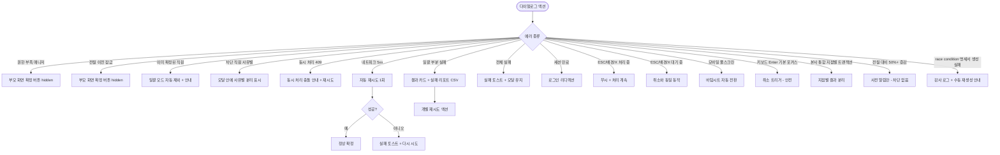

# DLG-064-002 급여 확정 확인 다이얼로그

## 1. 다이얼로그 메타 정보

이 문서는 DLG-064-002 급여 확정 확인 다이얼로그에 대한 자기완결형 요구사항 정의서입니다. 다른 문서를 함께 보지 않아도 이 한 장만으로 이 모달의 모든 트리거, 확정 절차, 권한, 예외 처리, 그리고 이 모달을 지탱하는 권한 분리·명세서 자동 생성·감사 추적 정책까지 전부 이해하고 구현할 수 있도록 작성합니다.

| 항목 | 값 |
|---|---|
| 작성일 | 2026-05-22 |
| 버전 | v1.0 |
| 상태 | 최신 통합본 반영 (정합화 완료) |
| 도메인 | D07 직원관리 |
| 다이얼로그 ID | DLG-064-002 |
| 다이얼로그명 | 급여 확정 확인 |
| 다이얼로그 유형 | 확정 확인 모달 (Confirmation Modal with Summary) |
| 부모 화면 | SCR-064 급여 관리 |
| 호출 트리거 | SCR-064 직원 행의 [확정] 또는 헤더의 [일괄 확정] 클릭 |
| 우선순위 | P0 (출시 필수) |
| 기능코드 | PAY-STF-02 (급여 관리) |
| 계약코드 | PAY-STF-02 |
| 부모 기능 prefix | PAY-STF |
| 연계 다이얼로그 | DLG-064-001 (편집 후 확정), 부분 실패 결과 카드 |
| 연계 화면 | SCR-064 급여관리, SCR-065 급여명세서, SCR-097 감사로그 |

## 2. 다이얼로그 개요와 목적

DLG-064-002는 SCR-064 급여 관리에서 직원의 급여를 최종 확정하기 전 관리자(Owner(지점장)+)의 의도를 재확인하는 확정 확인 모달입니다. 확정된 급여는 PAY-STF-03 급여 명세서로 자동 생성되어 직원에게 발송 가능한 상태가 되므로, 실수 방지를 위해 확인 절차를 거칩니다. 이 모달은 단일 직원 확정(개별 [확정] 버튼)과 다수 직원 확정(헤더 [일괄 확정] 버튼) 두 가지 경우 모두에서 호출되며, 확정 대상 인원과 총 지급 예정 금액이 요약 표시됩니다.

이 모달의 핵심은 권한 분리 정책의 시각적 표현입니다. 매니저는 편집은 가능하지만 [확정] 자체는 Owner(지점장)+만 가능하므로, 매니저 화면에서는 [확정] 버튼이 hidden되어 이 모달에 도달할 수 없습니다. Owner(지점장)이 매니저의 편집 결과를 최종 검토하고 확정을 승인하는 워크플로우가 자연스럽게 형성되며, 이는 잘못된 확정으로 인한 사고를 방지하는 안전 장치입니다.

운영 맥락에서는 다음 시나리오가 대표적입니다. 매니저가 월말에 직원별 급여를 점검하고 DLG-064-001로 항목을 조정한 뒤, Owner(지점장)이 SCR-064에서 [일괄 확정]을 누르면 이 모달이 호출됩니다. 모달은 "{인원수}명, {총 금액}"을 요약 표시하며, Owner(지점장)이 [확정] 버튼을 누르면 백엔드 트랜잭션이 실행되어 직원별 급여가 확정되고 명세서가 자동 생성됩니다. 일괄 모드에서 이미 확정된 직원은 자동 제외되며, 모달 안에 "이미 확정된 N명은 제외되었습니다" 안내가 표시됩니다. 부분 실패가 발생하면 결과 카드가 표시되어 성공/실패가 분리되어 노출됩니다.

확정 후에는 명세서가 SCR-065 급여 명세서에서 조회·발송 가능해지며, 직원에게 이메일·앱 알림을 통해 전달됩니다. 확정 후 오류가 발견되면 당월 내에 [확정 취소]가 가능하지만, 이미 발송된 명세서는 자동 무효 처리되고 직원에게 재발송 안내가 발송됩니다.

따라서 이 모달은 단순한 확인 모달이 아니라, 권한 분리·일괄 처리·부분 실패 처리·명세서 자동 생성까지 모두 다루는 정밀 확정 절차입니다.

## 3. 호출 트리거와 부모 화면

이 다이얼로그는 SCR-064 급여 관리 화면에서 다음 두 가지 조건에서 호출됩니다.

첫 번째 조건은 직원별 급여 테이블 행 우측의 [확정] 버튼 클릭입니다. Owner(지점장)+ 권한자가 단일 직원의 급여를 확정할 때 사용되며, 확정 상태가 "미확정"인 행에서만 버튼이 활성화됩니다. 이미 확정된 행에서는 [확정] 버튼이 [확정 취소] 버튼으로 대체됩니다.

두 번째 조건은 페이지 헤더 우측의 [일괄 확정] 버튼 클릭입니다. Owner(지점장)+ 권한자가 미확정 직원 전체를 한 번에 확정할 때 사용되며, 클릭 직전에 미확정 직원만 자동 필터링되어 모달에 표시됩니다. 체크박스로 일부 직원만 선택한 경우 그 직원들만 대상이 되며, 선택 없이 [일괄 확정]을 누르면 전체 미확정 직원이 대상이 됩니다.

부모 화면인 SCR-064는 이 모달이 호출되는 동안 본문이 어둡게 처리되어(backdrop) 모달에 집중할 수 있는 시각적 환경을 만듭니다. 모달이 닫히면 부모 테이블의 해당 행(또는 일괄 모드에서는 다수 행)이 즉시 갱신되며, 확정 상태 배지가 "확정"으로 변하고 명세서가 자동 생성됩니다.

매니저 화면에서는 [확정] 및 [일괄 확정] 버튼이 hidden되어 이 모달에 도달할 수 없습니다. FC·트레이너·스태프·프런트·readonly·직원 본인에게도 SCR-064 자체가 차단되어 이 모달을 만날 수 없습니다.

전월 이전 월에서는 모든 행의 [확정] 및 헤더의 [일괄 확정] 버튼이 hidden되거나 비활성화되어 이 모달이 호출되지 않습니다.

## 4. 레이아웃과 UI 구성

이 다이얼로그는 화면 중앙에 배치되는 중간 크기의 모달입니다. 데스크톱·태블릿에서는 약 500px 가로폭의 카드형 모달이며, 모바일에서는 화면 하단에서 슬라이드 업되는 바텀시트 형태로 자동 전환됩니다. 모달 외부 본문은 backdrop으로 어둡게 처리됩니다.

모달 상단에는 제목이 있습니다. 제목 텍스트는 "급여를 확정하시겠습니까?"이며, 본문보다 큰 폰트와 굵은 weight로 표시됩니다. 제목 좌측에 강조 색(파랑 또는 녹색) 체크 아이콘이 함께 표시되어 긍정적·확정적 액션임을 시각적으로 알립니다. 제목 우측 끝에는 닫기(X) 아이콘이 있으며, 이 아이콘 클릭은 [취소]와 동일하게 동작합니다.

제목 아래에는 안내 메시지가 표시됩니다. 텍스트는 "확정된 급여는 급여 명세서로 생성되며, 직원에게 발송할 수 있습니다. {인원수}명의 급여를 확정하시겠습니까?"이며, `{인원수}`는 동적으로 부모 화면에서 전달된 직원 수가 들어갑니다. 단일 모드에서는 직원명이 함께 표시될 수 있습니다("홍길동님의 급여를 확정하시겠습니까?"). "발송할 수 있습니다" 부분이 약간 강조되어 다음 단계가 명세서 발송임이 자연스럽게 인지됩니다.

안내 메시지 아래에는 확정 대상 요약 카드가 있습니다. 카드 안에는 다음 정보가 표시됩니다.

- **확정 대상 인원**: 큰 폰트로 "N명" 표시
- **총 지급 예정 금액**: 콤마 포맷으로 표시
- **자동 제외 인원** (일괄 모드, 해당 시): "이미 확정된 N명은 제외되었습니다" 안내가 작은 글씨로 표시
- **차단 인원** (있는 경우): 사유별로 묶여 표시 (예: "전월 이전 행 1명, 권한 부족 0명")

요약 카드 아래에는 명세서 발송 예고 안내가 작은 글씨로 표시됩니다. 예를 들어 "확정 후 SCR-065 급여 명세서에서 발송할 수 있습니다"처럼 다음 단계의 워크플로우가 안내됩니다.

모달 하단에는 액션 버튼 두 개가 가로로 배치됩니다. 좌측에 [취소] 버튼이, 우측에 [확정] 버튼이 있습니다. [취소]는 기본 톤(회색 또는 보조 색)이며, [확정]은 강조 색(파랑 또는 녹색)으로 표시됩니다. [확정] 버튼은 위험한 액션이 아니라 긍정적 액션이므로 빨강 톤이 아닌 강조 색이 적합합니다. 기본 포커스는 [취소]에 놓여 Enter 키 실수 입력으로 확정이 되지 않도록 보호합니다.

처리 중에는 [확정] 버튼이 로딩 스피너로 전환되고 모든 버튼이 비활성화됩니다. 일괄 처리의 경우 진행 바가 함께 표시되어 사용자가 진행 정도를 인지할 수 있게 합니다.

## 5. 입력 필드와 검증

이 다이얼로그는 입력 필드가 없는 단순 확인 모달입니다. 사용자는 두 버튼 중 하나를 선택하기만 하면 됩니다.

다만 호출 시점에 다음 검증이 자동으로 수행됩니다.

1. 권한 검증: 사용자가 Owner(지점장)+ 권한자인지 확인. 미충족 시 백엔드 403 응답으로 모달 호출 자체가 차단됩니다.
2. 월 잠금 검증: 확정 대상 월이 전월 이전이 아닌지 확인. 전월 이전이면 부모 화면의 [확정] 버튼 자체가 hidden입니다.
3. 일괄 모드에서 이미 확정된 직원 자동 제외: 일괄 모드 대상에 이미 확정된 직원이 포함되면 자동으로 제외되고 모달 안에 안내가 표시됩니다.
4. 차단 직원 검증: 권한 부족·전월 이전 등의 사유로 차단되는 직원이 있으면 사유별로 분리 표시됩니다.

확정 트랜잭션 실행 후 race condition으로 일부 직원이 실패할 경우 부분 실패 결과 카드가 모달 대신 표시됩니다.

## 6. 버튼·아이콘·링크 액션 전체 정의

[확정] 버튼은 강조 색(파랑 또는 녹색)으로 표시되며, 클릭 시 모달이 로딩 상태로 전환되어 모든 버튼이 비활성화되고 백엔드로 확정 요청이 전송됩니다. 단일 모드는 `POST /api/payroll/:id/confirm`, 일괄 모드는 `POST /api/payroll/bulk-confirm`이 호출됩니다.

확정 성공 시 모달이 닫히고 부모 화면의 해당 행(또는 다수 행)이 즉시 갱신되어 "확정" 배지로 표시됩니다. PAY-STF-03 명세서가 자동 생성되며, "n명의 급여를 확정했어요" 성공 토스트가 표시됩니다.

일괄 모드 부분 실패 시 모달이 닫히고 부모 화면에 결과 카드 "성공 N / 실패 M"이 표시됩니다. 실패 사유별 분류(권한 부족·race condition·전월 잠금 등)와 실패 리포트 CSV 다운로드 링크, 개별 재시도 액션이 함께 제공됩니다.

[취소] 버튼은 기본 톤으로 표시되며, 클릭 시 모달이 즉시 닫히고 부모 화면으로 복귀합니다. 어떤 변경도 일어나지 않습니다. ESC 키, 배경 클릭, 모달 상단 X 아이콘도 [취소]와 동일하게 동작합니다.

키보드 Tab 키는 [취소] → [확정] 순서로 포커스가 이동합니다. Shift+Tab은 역순으로 동작합니다. 기본 포커스는 [취소]에 놓여 Enter 키 실수 입력 시 안전한 액션이 선택됩니다.

모든 버튼은 처리 중 비활성화되어 중복 클릭이 차단됩니다.

확정 처리는 일반적으로 빠르게 끝나지만, 일괄 모드에서 직원 수가 많으면 수십 초가 걸릴 수 있습니다. 이때 진행 바가 모달 안에 표시되어 사용자가 진행 정도를 인지할 수 있게 합니다.

## 7. 호출되는 모달과 토스트

### 7-1. 부분 실패 결과 카드 (모달 대신 부모 화면에 표시)

일괄 확정에서 일부 직원만 실패한 경우 모달이 닫히고 부모 화면에 결과 카드가 표시됩니다. "성공 8명 / 실패 2명" 카운트와 함께 실패 직원 명단·사유가 분리 표시되며, 실패 리포트 CSV 다운로드 링크와 개별 재시도 액션이 제공됩니다. 카드는 사용자가 닫기 버튼을 누를 때까지 화면 중앙 하단에 머무릅니다.

### 7-2. 전체 실패 토스트

확정 트랜잭션이 완전히 실패한 경우 모달이 유지되고 실패 토스트 "확정에 실패했습니다, 다시 시도해주세요"가 표시됩니다. 사용자가 [다시 시도]를 누를 수 있도록 모달이 닫히지 않습니다. 네트워크 오류는 자동 재시도 1회 후 사용자 액션을 기다립니다.

### 7-3. 동시 처리 충돌 모달

같은 직원에 대해 다른 운영자가 동시 확정 처리를 시도 중이면 "다른 사용자가 처리 중입니다. 잠시 후 다시 시도해 주세요" 토스트 또는 모달이 표시되고, 이 다이얼로그는 닫히지 않습니다.

### 7-4. 토스트

성공 토스트: "n명의 급여를 확정했어요" (단일 또는 일괄 성공).

실패 토스트: "확정에 실패했습니다", "권한이 없습니다", "다른 사용자가 처리 중입니다", "전월 이전은 확정할 수 없습니다" 등.

명세서 자동 생성 안내: "급여 명세서가 생성되었어요. SCR-065에서 발송해 주세요" 보조 토스트가 성공 토스트와 함께 표시될 수 있습니다.

## 8. 데이터 흐름과 외부 연동

모달 호출 시점에는 부모 화면에서 전달된 확정 대상 직원 ID 배열과 요약 정보(인원 수·총 금액)만 사용하며, 별도 API 호출은 없습니다.

[확정] 클릭 시 백엔드 API가 호출됩니다. 단일 모드는 `POST /api/payroll/:id/confirm`, 일괄 모드는 `POST /api/payroll/bulk-confirm`이며, 요청 body에는 대상 직원 ID 배열이 포함됩니다.

백엔드는 트랜잭션으로 다음 작업을 수행합니다.

1. 급여 row의 확정 상태를 true로 변경.
2. 확정 일시와 확정자(actor_id) 기록.
3. PAY-STF-03 명세서를 자동 생성 (직원별 명세서 row INSERT).
4. 감사 로그(SCR-097)에 비동기 INSERT (`actor_id`, `staff_id`, `month`, `action_type: "CONFIRM"`, `amount`, `timestamp`).
5. 일괄 모드에서 이미 확정된 직원은 자동 제외 (트랜잭션 안에서).
6. 권한 검증 실패·전월 잠금 등의 차단 직원도 자동 제외.

명세서 자동 생성은 확정과 같은 트랜잭션 안에서 일어나므로, 확정 직후 SCR-065에서 즉시 조회·발송이 가능합니다.

일괄 모드 부분 실패 처리는 다음과 같이 동작합니다. 각 직원의 확정은 개별 트랜잭션으로 처리되어, 한 직원의 실패가 다른 직원의 확정을 막지 않습니다. 모든 직원의 처리 완료 후 성공·실패 결과가 종합되어 응답으로 반환되며, 클라이언트는 결과 카드를 표시합니다.

본사 통합 모드에서는 직원의 실제 `branchId` 기준으로 트랜잭션이 분기 처리됩니다. 지점별 결과가 분리되어 응답되며, 결과 카드에 지점별 성공/실패가 표시됩니다.

optimistic lock 동시 처리 정책에 따라 같은 직원에 대해 다른 운영자가 동시 확정을 시도하면 409 응답이 반환되어 동시 처리 충돌 안내가 표시됩니다.

전월 대비 ±50% 이상 증감이 감지된 직원은 별도 알림은 없지만, SCR-064 요약 카드에 빨강 강조가 표시되어 사전 인지가 가능합니다. 확정 시점에는 별도 차단이 없으므로, 운영자가 사전에 검토하는 것이 권장됩니다.

확정 직후 부모 화면의 요약 카드 카운트(확정 완료 인원·미확정 인원)가 갱신되며, 명세서 생성 카운트도 자동 갱신됩니다.

## 9. 화면 상태와 예외 처리

이 다이얼로그는 다음 상태들을 가집니다.

기본 표시 상태는 모달 호출 직후의 일반 상태입니다. 제목·안내 메시지·확정 대상 요약 카드·두 액션 버튼이 표시되고, 기본 포커스는 [취소]에 놓입니다.

자동 제외 표시 상태는 일괄 모드에서 이미 확정된 직원이 포함된 경우입니다. 요약 카드에 "이미 확정된 N명은 제외되었습니다" 안내가 추가 표시됩니다.

차단 직원 표시 상태는 차단 직원이 있는 경우입니다. 사유별로 분리 표시되며, 실제 처리 대상은 차단 직원을 제외한 인원만 산정됩니다.

처리 중 상태는 [확정] 클릭 후 백엔드 응답을 기다리는 동안입니다. [확정] 버튼이 로딩 스피너로 전환되고 모든 버튼이 비활성화됩니다. 일괄 모드에서는 진행 바가 함께 표시됩니다.

완료 상태는 확정 성공 후 모달이 닫히고 부모 화면이 갱신된 상태입니다.

부분 실패 상태는 일괄 모드에서 일부 실패한 경우입니다. 모달이 닫히고 부모 화면에 결과 카드가 표시되며, 실패 직원 명단과 사유, 재시도 액션이 제공됩니다.

전체 실패 상태는 트랜잭션이 완전히 실패한 경우입니다. 모달은 유지되고 실패 토스트가 표시되며, [다시 시도]가 가능합니다.

동시 처리 충돌 상태는 다른 운영자가 동시 처리 중인 경우입니다. 안내 표시 후 모달은 유지되며, 사용자는 잠시 후 [다시 시도]를 누를 수 있습니다.

예외 케이스별 처리는 다음과 같습니다.

권한 부족(매니저 등)은 부모 화면의 [확정] 버튼 hidden으로 차단됩니다. 직접 URL이나 백엔드 호출 우회 시도는 403 응답으로 차단되며 감사 로그에 기록됩니다.

전월 이전 잠금은 부모 화면의 [확정] 버튼 hidden으로 차단됩니다. 직접 호출 시도는 백엔드에서 차단됩니다.

이미 확정된 직원은 일괄 모드에서 자동 제외되며 안내가 표시됩니다.

차단 직원(다양한 사유)은 사유별로 분리 표시되어 운영자가 명시적으로 인지하도록 합니다.

동시 처리 충돌은 409 응답으로 표시되며, 사용자가 재시도하도록 안내합니다.

네트워크 오류는 자동 재시도 1회 후 사용자 액션을 기다립니다.

부분 실패는 결과 카드 + 실패 리포트 CSV로 처리되며, 개별 재시도가 가능합니다.

세션 만료는 자동 로그인 리디렉션 후 복귀 시 다시 시도해야 합니다.

ESC·배경·X 닫기는 [취소]와 동일하게 동작하며, 처리 중에는 무시됩니다.

모바일은 풀스크린 바텀시트로 자동 전환되며, 키보드 Enter는 [확정]이 아닌 [취소]를 트리거해 안전합니다.

키보드 접근성은 Tab 포커스 이동과 screen reader 라벨이 지원됩니다.

## 10. 권한별 처리

이 다이얼로그는 Owner(지점장)+ 권한자에게만 호출 가능합니다.

본사 슈퍼관리자(superAdmin)·본사 최고관리자(primary)는 전 지점 확정이 가능하지만, 정책상 확정 권한이 Owner(지점장)에 위임되어 본사 권한자도 통합 모드에서 같은 권한 분리를 따릅니다.

Owner(지점장)은 소속 지점 직원 전체 확정이 가능합니다. 단일·일괄·확정 취소·정산 미완료 강제 확정 모두 가능합니다.

매니저(manager)는 편집은 가능하지만 [확정] 자체는 차단됩니다. 부모 화면에서 [확정] / [일괄 확정] 버튼이 hidden이며, 이 모달에 도달할 수 없습니다.

직원 본인은 본인 급여 정보 조회만 가능하며 이 모달을 호출할 수 없습니다.

FC·트레이너·스태프·프런트는 SCR-064 자체에 접근할 수 없으므로 이 모달을 만날 수 없습니다.

readonly는 SCR-064 자체에 접근할 수 없습니다.

권한이 없는 사용자가 직접 URL이나 우회 경로로 백엔드 API를 호출해도 백엔드에서 권한 검증이 이루어져 403 응답이 반환됩니다. 모든 권한 차단 이벤트는 감사 로그에 기록됩니다.

권한 분리 정책에 따라 매니저가 편집한 결과를 Owner(지점장)이 검토·확정하는 워크플로우가 자연스럽게 형성됩니다. 이는 잘못된 확정으로 인한 사고를 방지하고, 직원 신뢰에 직접 영향을 미치는 액션에 추가 권한자의 검토를 강제하는 정책입니다.

## 11. 메인 흐름

이 다이얼로그의 핵심 동작 흐름을 다이어그램으로 표현합니다.

```mermaid
flowchart TD
    A([SCR-064 진입]) --> B{권한}
    B -->|매니저| C[확정 버튼 hidden]
    B -->|Owner(지점장)+| D[확정/일괄 확정 버튼 활성]
    D --> E{호출 트리거}
    E -->|개별 확정| F[단일 모드 호출 - 1명]
    E -->|일괄 확정| G[일괄 모드 호출 - N명]
    F --> H[DLG-064-002 호출]
    G --> H
    H --> I{차단/제외 검증}
    I -->|이미 확정 N명 있음| J[자동 제외 + 안내]
    I -->|차단 직원 있음| K[사유별 분리 표시]
    J --> L[요약 카드 + 인원 + 총 금액]
    K --> L
    I -->|없음| L
    L --> M[사용자 선택]
    M -->|취소/ESC/배경/X| N[모달 닫기 + 변경 없음]
    M -->|확정 클릭| O[처리 중 - 로딩 + 진행 바]
    O --> P[POST confirm 또는 bulk-confirm]
    P --> Q{결과}
    Q -->|전체 성공| R[부모 행 갱신 + 명세서 자동 생성 + 감사 로그]
    R --> S[성공 토스트 + 모달 닫기]
    Q -->|부분 실패 일괄| T[결과 카드 + 실패 리포트 CSV]
    T --> U[개별 재시도 가능]
    Q -->|전체 실패| V[실패 토스트 + 모달 유지 + 다시 시도]
    Q -->|optimistic lock 409| W[동시 처리 충돌 안내]
    Q -->|권한 부족 403| X[감사 로그 + 차단 안내]
```

## 12. 에러와 예외 흐름

에러와 예외 상황에서의 분기를 별도 흐름으로 표현합니다.



## 13. 핵심 디자인 요청사항

이 다이얼로그는 긍정적·확정적 액션을 명확하게 표현해야 합니다.

모달 크기는 약 500px 가로폭이 적당합니다. 단일·일괄 모드 모두 요약 카드와 자동 제외 안내가 안정적으로 표시되며, 모바일에서는 바텀시트로 자동 전환됩니다.

제목 좌측의 체크 아이콘은 강조 색(파랑 또는 녹색)으로 표시되어 긍정적·확정적 액션임을 시각적으로 알립니다. DLG-060-002 퇴사 확인의 빨강 경고 아이콘과 명확히 구분됩니다.

안내 메시지의 "{인원수}"는 굵은 weight로 강조 표시되어, 운영자가 확정 대상 규모를 즉시 인지할 수 있게 합니다. "발송할 수 있습니다" 부분도 약간 강조되어 다음 단계가 명세서 발송임이 자연스럽게 인지됩니다.

확정 대상 요약 카드는 옅은 강조 색 배경으로 표시되어 핵심 정보임이 시각적으로 드러납니다. 카드 안에서 인원 수와 총 금액은 큰 폰트와 굵은 weight로 강조되며, 자동 제외 안내는 작은 글씨로 회색 톤으로 표시되어 정보 우선순위가 분리됩니다.

차단 직원 안내는 사유별로 묶여 작은 카드 형태로 표시됩니다. 각 사유는 작은 라벨 배지("권한 부족", "전월 이전" 등)와 함께 카운트가 표시되어, 운영자가 어떤 사유로 제외되는지 한눈에 파악할 수 있습니다.

명세서 발송 예고 안내는 모달 하단의 액션 버튼 위에 작은 글씨로 회색 톤으로 표시됩니다. "확정 후 SCR-065 급여 명세서에서 발송할 수 있습니다"처럼 다음 단계 워크플로우를 안내하되, 시선이 분산되지 않도록 약하게 표시됩니다.

[확정] 버튼은 강조 색(파랑 또는 녹색)으로 표시되어 단순한 [취소]와 명확히 구분됩니다. 위험한 액션이 아니므로 빨강 톤이 아닌 강조 색이 적합합니다. 비활성화 상태에서는 회색 톤으로 표시되며, 활성화 전환은 부드러운 색상 변화로 처리됩니다.

기본 포커스는 [취소]에 놓여, Enter 키 실수 입력으로 확정이 되지 않도록 보호합니다. 이는 데이터 보호 원칙의 일관된 적용입니다.

처리 중 로딩 상태는 [확정] 버튼 안에서 스피너로 표시되고, 일괄 모드의 경우 진행 바가 모달 안에 함께 표시되어 사용자가 진행 정도를 인지할 수 있습니다. 진행 바는 가로 막대 형태로 0%에서 100%까지 부드럽게 채워집니다.

backdrop은 본문을 약 50% 정도 어둡게 처리해 모달에 시선이 집중되도록 합니다. 위험한 액션이 아니므로 DLG-060-002보다 살짝 약한 어둠 강도가 적합합니다.

모바일 바텀시트에서는 요약 카드가 화면 가운데에 큰 폰트로 표시되어, 작은 화면에서도 핵심 정보가 즉시 인지됩니다.

키보드 접근성은 Tab 포커스 이동, Enter로 [취소] 트리거(안전), screen reader 라벨 읽기가 모두 지원됩니다.

## 14. 운영 정책 (이 다이얼로그에 연결된 부분)

이 다이얼로그는 단순한 확인 모달이 아니라 권한 분리·일괄 처리·명세서 자동 생성·감사 추적 정책의 결합점입니다.

확정 권한 분리 정책이 엄격히 적용됩니다. 매니저는 편집은 가능하지만 [확정] 자체는 Owner(지점장)+만 가능합니다. 매니저 화면에서는 [확정] 버튼이 hidden되어 이 모달에 도달할 수 없습니다. 이는 급여 확정이 명세서 발송과 직접 연결되어 직원 신뢰에 직접 영향을 미치는 액션이므로, 추가 권한자에게만 허용해 사고를 방지하는 정책입니다.

권한 분리 워크플로우 정책에 따라 매니저가 편집한 결과를 Owner(지점장)이 검토·확정하는 자연스러운 워크플로우가 형성됩니다. 이는 단순한 권한 차단이 아닌 운영 절차의 일부이며, 매니저는 편집까지의 책임을, Owner(지점장)은 확정까지의 책임을 분담합니다.

일괄 처리 정책에 따라 [일괄 확정]은 미확정 직원 전체를 한 번에 처리합니다. 이미 확정된 직원은 자동 제외되며, 모달 안에 안내가 표시됩니다. 각 직원의 확정은 개별 트랜잭션으로 처리되어, 한 직원의 실패가 다른 직원의 확정을 막지 않습니다. 부분 실패는 결과 카드로 표시되어 개별 재시도가 가능합니다.

명세서 자동 생성 정책에 따라 확정 트랜잭션과 같은 트랜잭션 안에서 PAY-STF-03 명세서가 자동 생성됩니다. 따라서 확정 직후 SCR-065에서 즉시 조회·발송이 가능하며, 명세서 누락이 발생할 수 없습니다.

확정 취소 가능 기간 정책은 별도로 적용됩니다. 이 다이얼로그를 통과해 확정이 완료된 후에도, Owner(지점장)+ 권한자는 당월 내에 [확정 취소]가 가능합니다. 단, 이미 발송된 명세서는 자동 무효 처리되고 직원에게 재발송 안내가 발송됩니다. 전월 이전은 잠금되어 확정 취소가 불가합니다.

전월 이전 잠금 정책에 따라 전월 이전 월에서는 [확정] 버튼 자체가 hidden되어 이 모달이 호출되지 않습니다. 매월 1일 00:00 배치가 전월의 모든 급여 row를 read-only로 전환하며, 어떤 권한도 잠금을 해제할 수 없습니다.

본사 통합 모드 지점별 트랜잭션 정책에 따라 직원의 실제 `branchId` 기준으로 트랜잭션이 분기 처리됩니다. 한 지점의 트랜잭션이 실패해도 다른 지점은 정상 처리되어 부분 성공이 가능합니다.

optimistic lock 동시 처리 정책에 따라 같은 직원에 대해 다른 운영자가 동시 확정 처리를 시도하면 409 응답이 반환되어 동시 처리 충돌 안내가 표시됩니다.

전월 대비 ±50% 이상 증감 알림 정책은 별도로 동작합니다. 자동 계산 완료 후 매니저+에게 NFR-19 알림이 발송되어 사전 점검을 유도하며, 이 모달 단계에서는 별도 차단이 없습니다. 운영자가 사전에 검토하는 것이 권장됩니다.

부분 실패 처리 정책에 따라 일괄 모드 부분 실패 시 결과 카드 "성공 N / 실패 M"이 표시되고 실패 직원 명단·사유·재시도 액션이 제공됩니다. 실패 리포트 CSV 다운로드 링크도 함께 제공되어 사후 정리 자료로 활용됩니다.

데이터 보호 정책에 따라 기본 포커스가 [취소]에 놓여 Enter 키 실수 입력으로 확정이 되지 않도록 보호합니다. 위험한 액션이 아니지만, 의도하지 않은 확정을 방지하는 안전 장치입니다.

감사 로그 정책에 따라 모든 확정 이벤트를 SCR-097에 비동기로 기록합니다. 기록 필드는 `actor_id`, `staff_id`, `month`, `action_type: "CONFIRM"`, `amount`, `timestamp`이며, append-only로 영구 보존됩니다. 권한 차단·차단 직원 시도도 모두 기록되어 권한 우회 시도를 사후 추적할 수 있습니다.

명세서 발송 분리 정책에 따라 확정과 발송은 별도 액션입니다. 이 모달은 확정까지만 담당하며, 명세서 발송은 SCR-065 급여 명세서에서 별도로 진행됩니다. 이는 확정 후 명세서 내용을 검토하고 발송 여부를 결정할 시간을 운영자에게 제공하는 정책입니다.

접근성 정책은 키보드 조작과 screen reader 지원을 보장합니다. 모든 요약 정보가 ARIA 라벨로 명확히 전달되며, 처리 중 로딩 상태도 screen reader가 인지할 수 있도록 aria-live 영역이 설정됩니다.

이상의 모든 정책은 이 다이얼로그를 구현하고 운영하는 사람이 별도 문서 없이 이 한 장만 보면 이해할 수 있도록 풀어 적었습니다. 정책이 바뀌면 이 문서가 함께 갱신되어야 하며, 코드 변경과 정책 변경은 항상 짝지어 진행됩니다.
