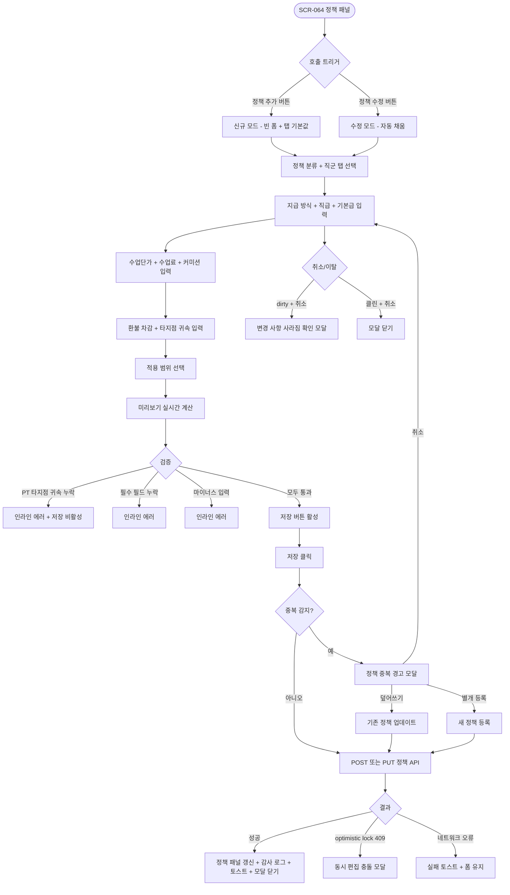
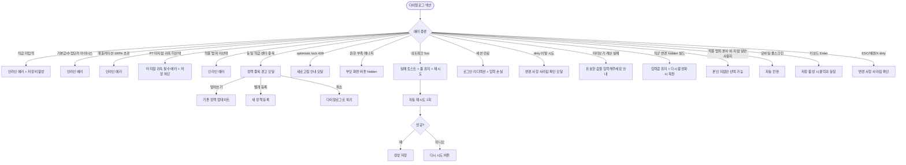

# DLG-064-003 급여 정책 추가/수정 다이얼로그

## 1. 다이얼로그 메타 정보

이 문서는 DLG-064-003 급여 정책 추가/수정 다이얼로그에 대한 자기완결형 요구사항 정의서입니다. 다른 문서를 함께 보지 않아도 이 한 장만으로 이 모달의 모든 트리거, 직급·직군별 산식 입력, 권한, 예외 처리, 그리고 이 모달을 지탱하는 직군별 산식·환불 차감·타지점 귀속·정책 적용 운영 정책까지 전부 이해하고 구현할 수 있도록 작성합니다.

| 항목 | 값 |
|---|---|
| 작성일 | 2026-05-22 |
| 버전 | v1.0 |
| 상태 | 최신 통합본 반영 (정합화 완료) |
| 도메인 | D07 직원관리 |
| 다이얼로그 ID | DLG-064-003 |
| 다이얼로그명 | 급여 정책 추가/수정 |
| 다이얼로그 유형 | 입력 폼 모달 (Policy Template Form Modal) |
| 부모 화면 | SCR-064 급여 관리 |
| 호출 트리거 | SCR-064 정책 패널의 [정책 추가] 또는 정책 카드의 [수정] 클릭 |
| 우선순위 | P1 (출시 필수) |
| 기능코드 | PAY-STF-02 (급여 관리) |
| 계약코드 | PAY-STF-02 |
| 부모 기능 prefix | PAY-STF |
| 연계 다이얼로그 | 정책 중복 경고 모달, 정책 삭제 확인 모달 |
| 연계 화면 | SCR-064 급여관리, SCR-097 감사로그 |

## 2. 다이얼로그 개요와 목적

DLG-064-003은 SCR-064 급여 관리에서 직급·직군별 급여 정산 기준이 되는 정책 템플릿을 등록하거나 수정하는 입력 폼 모달입니다. 월별 급여 확정 전에 계산 기준을 정비하는 용도로 사용되며, 정책 분류(매출 타입/수업 타입), 적용 직군(FC/PT/GX/공통), 지급 방식(정률제/고정급제/시급제/혼합제), 직급, 기본급, 수업단가, 수업료(%), 매출커미션(%), 재등록 커미션(%), 환불 차감 규칙, 타지점 수업 귀속 규칙, 적용 범위까지 정책의 모든 구성 요소를 한 화면에서 설정합니다.

이 모달의 핵심은 직군별 산식 정책의 정밀한 기준값 관리입니다. FC는 신규 등록/재등록/상품추가 커미션과 환불 차감, PT는 수업단가·정률·시급·타지점 귀속, GX는 클래스수당·시급·출석 보너스로 각각 분리되어 정책 템플릿으로 정의됩니다. 정책은 동일 직급 + 동일 센터 범위에서 중복이 허용되지 않으며, 중복 시 경고 모달이 호출되어 운영자의 명시적 확인을 받습니다. PT 정책은 타지점 수업 귀속 규칙이 필수 지정이며, 미선택 시 저장이 차단됩니다.

운영 맥락에서는 다음 시나리오가 대표적입니다. 본사 정책팀이 새로운 직급(예: "수석 트레이너")을 신설하고 그에 맞는 급여 정책을 등록할 때 이 모달을 사용합니다. 또는 매출 커미션 비율을 인상하거나 환불 차감 규칙을 강화할 때 기존 정책을 수정합니다. 미리보기 영역은 예시 정산 시나리오 기준으로 예상 지급액을 자동 계산해 표시하므로, 운영자가 정책 입력값을 바꿀 때마다 결과를 사전에 확인할 수 있습니다. 저장된 정책은 다음 자동 계산 트리거 시 새 기준값으로 적용됩니다.

따라서 이 모달은 단순한 입력 폼이 아니라, 직군별 산식·환불 차감·타지점 귀속·정책 적용 범위·미리보기 시뮬레이션까지 모두 다루는 정책 관리 도구입니다.

## 3. 호출 트리거와 부모 화면

이 다이얼로그는 SCR-064 급여 관리 화면의 우측 정책 패널에서 다음 조건에서 호출됩니다.

첫 번째 조건은 정책 패널 하단의 [정책 추가] 버튼 클릭입니다. 신규 정책 등록 모드로 모달이 호출되며, 모든 필드가 빈 상태로 시작합니다. 다만 정책 분류·직군 탭의 현재 선택값이 기본값으로 미리 입력됩니다(예: 현재 "수업 타입 > PT" 탭이 활성화되어 있으면 분류와 직군이 미리 선택됨).

두 번째 조건은 정책 카드의 [수정] 버튼 클릭입니다. 기존 정책의 모든 필드가 자동 채움된 수정 모드로 모달이 호출됩니다. 사용자는 필요한 필드만 변경하고 저장하면 됩니다.

부모 화면인 SCR-064는 이 모달이 호출되는 동안 본문이 어둡게 처리되어(backdrop) 모달에 집중할 수 있는 시각적 환경을 만듭니다. 모달이 닫히면 정책 패널의 해당 탭이 즉시 갱신되며, 새 정책 또는 수정된 정책이 카드 리스트에 반영됩니다.

이 모달은 Owner(지점장)+ 또는 정책에 따라 매니저+ 권한자에게만 호출 가능합니다. 일반 운영 매니저는 정책 추가·수정·삭제가 차단될 수 있으며, 이는 테넌트 정책에 따라 결정됩니다.

정책 삭제는 정책 카드의 [삭제] 버튼 클릭 시 별도 삭제 확인 모달이 호출되어 처리됩니다. 이 다이얼로그(추가/수정)와는 분리된 흐름입니다.

## 4. 레이아웃과 UI 구성

이 다이얼로그는 화면 중앙에 배치되는 큰 크기의 모달입니다. 데스크톱·태블릿에서는 약 700px 가로폭의 카드형 모달이며, 모바일에서는 화면 전체를 차지하는 풀스크린 모달로 자동 전환됩니다. 정책 입력 필드가 많고 미리보기 영역도 필요하므로 충분한 가로폭이 확보되어야 합니다.

모달 상단에는 제목과 정책 분류 탭이 있습니다. 제목은 "급여 정책 추가" (신규) 또는 "급여 정책 수정" (수정 모드)이며, 그 아래에 정책 분류 탭이 가로로 배치됩니다. 탭은 "매출 타입 / 수업 타입" 2종이며, 현재 선택된 탭은 강조 색으로 표시됩니다. 매출 타입은 회원 매출과 관련된 정책(FC 커미션·재등록 등), 수업 타입은 수업 진행과 관련된 정책(PT 수업단가·GX 클래스수당 등)으로 분리됩니다.

정책 분류 탭 아래에는 직군 선택 탭이 한 단계 더 분기됩니다. "FC / PT / GX / 공통" 4종이 가로로 배치되며, 현재 선택된 직군이 강조 색으로 표시됩니다. 직군에 따라 아래 입력 필드의 가시성과 검증 규칙이 동적으로 변합니다.

직군 탭 아래에는 본문 입력 영역이 펼쳐집니다. 입력 영역은 데스크톱에서 2단 그리드(좌/우 50%)로, 모바일에서는 1단으로 자동 전환됩니다.

좌측 컬럼에는 정책 기본 정보 입력이 배치됩니다. 지급 방식 선택(라디오 - 정률제/고정급제/시급제/혼합제), 직급 입력(텍스트, 예: "트레이너", "수석 트레이너", "FC 팀장"), 기본급 입력(숫자, 콤마 자동 포맷), 수업단가 입력(숫자, 콤마 자동 포맷)이 순서대로 배치됩니다. 직군에 따라 수업단가는 PT·GX만 해당되며, FC 탭에서는 hidden됩니다.

우측 컬럼에는 정률·커미션 입력이 배치됩니다. 수업료(%) 입력(숫자, 0~100), 매출커미션(%) 입력(숫자, 0~100), 재등록 커미션(%) 입력(숫자, 0~100, FC 한정), 환불 차감 규칙(드롭다운 + 차감 비율 입력), 타지점 수업 귀속 규칙(드롭다운 - 수행 지점/판매 지점/정산 지점, PT 필수)이 배치됩니다. 직군에 따라 일부 필드가 동적으로 hidden 또는 비활성화됩니다.

본문 입력 영역 아래에는 적용 범위 입력이 있습니다. 적용 범위 필드는 "소속 센터 / 팀 / 직군 제한"을 멀티 선택으로 지정합니다. 전체 적용일 경우 "모든 범위" 토글이 활성화되고, 특정 센터·팀·직군에만 적용일 경우 멀티 선택 드롭다운이 활성화됩니다.

적용 범위 아래에는 미리보기 영역이 sticky로 고정 배치됩니다. 미리보기에는 예시 정산 시나리오(예: "월 매출 1,000만 원, 수업 진행 20건")가 미리 정의되어 있고, 운영자가 정책 입력값을 바꿀 때마다 예상 지급액이 실시간으로 자동 계산되어 표시됩니다. "예상 기본급: 3,000,000원, 수업단가 합계: 800,000원, 매출 커미션: 100,000원, 환불 차감: -50,000원, 합계: 3,850,000원"처럼 항목별로 분해되어 표시되어, 운영자가 정책의 영향을 즉시 인지할 수 있습니다.

모달 하단에는 액션 버튼 두 개가 가로로 배치됩니다. 좌측에 [취소] 버튼이, 우측에 [저장] 버튼이 있습니다. [취소]는 기본 톤이며, [저장]은 강조 색(파랑 또는 녹색)으로 표시됩니다. 동일 직급·동일 센터 범위 정책이 중복 감지되면 [저장] 클릭 시 별도 경고 모달이 호출되어 운영자가 명시적으로 확인해야 진행됩니다.

## 5. 입력 필드와 검증 규칙

정책 분류 탭과 직군 탭은 라디오 형태로 단일 선택이며, 필수입니다. 미선택 시 [저장]이 비활성화됩니다.

지급 방식은 라디오 4종(정률제/고정급제/시급제/혼합제) 중 단일 선택 필수입니다. 직군에 따라 자동 추천이 적용될 수 있습니다(예: GX는 클래스당 고정수당 또는 시급제 추천).

직급은 텍스트 입력 필수이며, 2~30자 범위입니다. 동일 직급명이 이미 등록된 정책에 존재하고 동일 센터 범위와도 중복되면 인라인 경고 "동일 직급·센터에 이미 정책이 존재합니다"가 표시됩니다. 저장 시 별도 경고 모달이 호출되어 명시적 확인을 받습니다.

기본급은 숫자 입력이며, 0 이상의 정수만 허용됩니다. 콤마 자동 포맷이 적용되며, 마이너스 입력 시 인라인 에러가 표시됩니다.

수업단가는 0 이상의 정수이며, 수업 1건당 지급 단가를 의미합니다. PT·GX 직군에서만 활성화되고 FC 탭에서는 hidden됩니다.

수업료(%)는 0~100 범위의 숫자입니다. 수업 매출 기준 정률 정산 비율을 의미하며, PT 직군에서 주로 사용됩니다.

매출커미션(%)은 0~100 범위입니다. PT/상품/재등록 매출에 연동되는 커미션 비율이며, FC·PT 직군에서 활성화됩니다. 환불 확정 건과 미수금 상태 건은 기본 제외 대상입니다.

재등록 커미션(%)은 0~100 범위이며, FC 직군에서만 활성화됩니다. FC 재등록 매출에 별도 비율로 적용됩니다.

환불 차감 규칙은 드롭다운으로 "차감 없음 / 100% 차감 / 50% 차감 / 직접 입력"을 선택하며, 직접 입력 시 차감 비율(0~100%) 숫자 입력이 활성화됩니다. 환불 확정 건 발생 시 이전 지급분 차감 여부와 비율을 정의합니다.

타지점 수업 귀속 규칙은 드롭다운으로 "수행 지점 / 판매 지점 / 정산 지점"을 선택합니다. PT 정책은 필수 지정이며, 미선택 시 인라인 에러 "PT 정책은 타지점 귀속 규칙을 지정해야 합니다"가 표시되고 저장이 차단됩니다.

적용 범위는 멀티 선택 드롭다운이며, "모든 범위" 토글이 활성화되면 멀티 선택이 비활성화됩니다. 최소 한 개 이상의 범위가 선택되어야 저장 가능합니다.

수업단가와 수업료(%)는 동시 사용이 가능하며, 정책에 따라 합산 또는 우선순위 적용 방식을 선택할 수 있습니다. 이는 별도 옵션 토글로 제공될 수 있습니다.

매출커미션(%)은 환불 확정 건과 미수금 상태 건을 기본 제외 대상으로 계산합니다. 이는 시스템 기본 동작이며 별도 토글로 변경되지 않습니다.

저장 시 백엔드에서 다음 추가 검증이 수행됩니다.

1. 동일 직급 + 동일 센터 범위 정책 중복 감지: 중복 시 경고 모달 호출.
2. PT 정책 타지점 귀속 규칙 필수 검증: 미선택 시 저장 차단.
3. 권한 검증: 정책 추가·수정 권한이 있는지 확인.
4. 적용 범위 유효성 검증: 존재하지 않는 센터·팀 지정 시 에러.

## 6. 버튼·아이콘·링크 액션 전체 정의

정책 분류 탭(매출 타입/수업 타입)은 클릭 시 즉시 전환되며, 직군 탭과 입력 필드는 그대로 유지됩니다.

직군 탭(FC/PT/GX/공통)은 클릭 시 입력 필드의 가시성과 검증 규칙이 동적으로 변합니다. 직군 변경 시 일부 필드(수업단가·재등록 커미션 등)가 표시·숨김 처리되며, 입력값은 유지됩니다.

지급 방식 라디오 변경은 일부 필드의 활성화/비활성화에 영향을 줄 수 있습니다(예: 고정급제 선택 시 수업단가가 자동 0으로 설정 + 비활성화).

각 입력 필드는 변경 시 실시간으로 미리보기에 반영됩니다. 미리보기는 예시 정산 시나리오 기준으로 즉시 재계산되어 표시됩니다.

환불 차감 규칙 드롭다운에서 "직접 입력"을 선택하면 차감 비율 입력 필드가 활성화됩니다.

적용 범위의 [모든 범위] 토글을 켜면 멀티 선택 드롭다운이 비활성화되고, 모든 센터·팀·직군에 적용됩니다. 토글을 끄면 멀티 선택이 활성화됩니다.

[저장] 버튼은 모든 필수 필드가 입력되고 검증을 통과해야 활성화됩니다. 클릭 시 모달이 로딩 상태로 전환되어 모든 버튼이 비활성화됩니다. 정책 중복 감지 시 별도 경고 모달이 먼저 호출됩니다.

[취소] 버튼은 기본 톤이며, dirty 상태에서는 "변경 사항이 사라집니다. 닫으시겠습니까?" 확인 모달을 호출하고 클린 상태에서는 즉시 닫힙니다. ESC 키, 배경 클릭, 모달 상단 X 아이콘도 [취소]와 동일하게 동작합니다.

키보드 Tab 키는 정책 분류 탭 → 직군 탭 → 입력 필드들 → [취소] → [저장] 순서로 포커스가 이동합니다.

모든 버튼은 처리 중 비활성화되어 중복 클릭이 차단됩니다.

## 7. 호출되는 모달과 토스트

### 7-1. 정책 중복 경고 모달

[저장] 클릭 시 동일 직급 + 동일 센터 범위 정책이 이미 존재하면 호출됩니다. "동일 직급·센터에 이미 정책이 존재합니다. 새 정책으로 덮어쓰시겠습니까, 아니면 별개로 등록하시겠습니까?" 안내와 함께 [덮어쓰기] / [별개 등록] / [취소] 버튼이 있습니다.

- [덮어쓰기]: 기존 정책을 새 값으로 업데이트합니다.
- [별개 등록]: 새 정책으로 등록하되 적용 범위가 다른 경우에만 가능합니다.
- [취소]: 이 다이얼로그로 돌아갑니다.

### 7-2. 변경 사항 사라짐 확인 모달

dirty 상태에서 [취소] 또는 ESC·배경 클릭·X 아이콘으로 닫으려 할 때 호출됩니다. "변경 사항이 사라집니다. 닫으시겠습니까?" 안내와 함께 [계속 작성] / [닫기 확인] 버튼이 있습니다.

### 7-3. 동시 편집 충돌 모달

저장 시 다른 운영자가 같은 정책을 동시 편집해 optimistic lock 위반이 발생하면 "다른 사용자가 수정 중입니다. 새로고침 후 다시 시도해 주세요" 모달이 호출됩니다.

### 7-4. 토스트

성공 토스트: "급여 정책이 저장되었어요" (저장 성공), "정책이 추가되었어요"(신규).

실패 토스트: "PT 정책은 타지점 귀속 규칙을 지정해야 합니다", "직급을 입력해주세요", "적용 범위를 선택해주세요", "다른 사용자가 수정 중입니다", "저장에 실패했습니다, 다시 시도해주세요" 같은 안내.

## 8. 데이터 흐름과 외부 연동

모달 호출 시점에는 부모 화면에서 전달된 컨텍스트(현재 정책 분류 탭·직군 탭 선택값)만 사용합니다. 수정 모드에서는 기존 정책의 모든 필드가 자동 채움되며, 신규 모드에서는 빈 상태로 시작합니다.

미리보기 계산은 클라이언트에서 실시간으로 이루어집니다. 예시 정산 시나리오는 미리 정의되어 있으며, 운영자가 정책 입력값을 바꿀 때마다 즉시 재계산되어 표시됩니다.

[저장] 클릭 시 백엔드 API가 호출됩니다. 신규 등록은 `POST /api/payroll/policy`, 수정은 `PUT /api/payroll/policy/:id`이며, 요청 body에는 정책 분류·직군·지급 방식·직급·기본급·수업단가·수업료(%)·매출커미션(%)·재등록 커미션(%)·환불 차감 규칙·타지점 귀속 규칙·적용 범위가 모두 포함됩니다.

백엔드는 트랜잭션으로 다음 작업을 수행합니다.

1. 정책 row를 INSERT 또는 UPDATE.
2. 동일 직급 + 동일 센터 범위 중복 감지 (감지 시 409 응답).
3. PT 정책 타지점 귀속 규칙 검증 (미선택 시 400 응답).
4. 감사 로그(SCR-097)에 비동기 INSERT (`actor_id`, `policy_id`, `action_type: "POLICY_CREATE" / "POLICY_UPDATE"`, `before`(JSON), `after`(JSON), `timestamp`).

저장된 정책은 다음 자동 계산 트리거 시 새 기준값으로 적용됩니다. 이미 진행된 월의 자동 계산 결과는 영향을 받지 않으며, 다음 월 또는 [재계산] 트리거 시점에 적용됩니다.

정책 삭제는 별도 모달(삭제 확인)에서 처리되며, `DELETE /api/payroll/policy/:id`로 호출됩니다. 삭제된 정책에 의존하던 직원은 다음 자동 계산 시 직군 기본 정책 또는 공통 정책으로 자동 폴백됩니다.

본사 통합 모드에서 본사 권한자는 모든 지점 정책을 관리할 수 있으며, 일반 지점 사용자는 본인 지점 정책만 관리 가능합니다.

optimistic lock 동시 편집 정책에 따라 같은 정책에 대해 다른 운영자가 동시 편집 시 409 응답이 반환됩니다.

## 9. 화면 상태와 예외 처리

이 다이얼로그는 다음 상태들을 가집니다.

기본 표시 상태(신규 모드)는 모든 필드가 빈 상태로 표시되고, 현재 부모 화면의 탭 선택값이 기본값으로 미리 입력됩니다. [저장] 버튼은 비활성화 상태입니다.

기본 표시 상태(수정 모드)는 기존 정책 필드가 자동 채움된 상태로 시작합니다. dirty 플래그는 false이며, 사용자가 한 필드라도 변경하면 true가 됩니다.

입력 중 상태는 사용자가 필드를 입력·변경하는 동안입니다. dirty 플래그가 활성화되고, 미리보기가 실시간으로 갱신됩니다.

검증 통과 상태는 모든 필수 필드가 유효한 상태에서 [저장] 버튼이 활성화된 상태입니다.

처리 중 상태는 [저장] 클릭 후 백엔드 응답을 기다리는 동안입니다. 모든 버튼이 비활성화되고 [저장] 버튼이 로딩 스피너로 전환됩니다.

완료 상태는 저장 성공 후 모달이 닫히고 부모 화면의 정책 패널이 갱신된 상태입니다.

정책 중복 경고 상태는 [저장] 클릭 시 중복 감지되어 별도 경고 모달이 호출된 상태입니다.

실패 상태는 백엔드 오류 시 토스트와 함께 모달이 유지되어 사용자가 [다시 시도]할 수 있는 상태입니다.

이탈 확인 상태는 dirty 상태에서 [취소] 또는 모달 닫기 시도 시 변경 사항 사라짐 확인 모달이 호출된 상태입니다.

예외 케이스별 처리는 다음과 같습니다.

직급 미입력 시 인라인 에러 + [저장] 비활성화. 기본급·수업단가 마이너스 시 인라인 에러. 매출커미션 100% 초과 시 인라인 에러. PT 정책 타지점 귀속 미선택 시 인라인 에러 + 저장 차단. 적용 범위 미선택 시 인라인 에러. 동일 직급·센터 정책 중복 시 경고 모달. optimistic lock 위반 시 새로고침 안내 모달. 네트워크 오류 시 실패 토스트 + 모달 유지 + 재시도. 세션 만료 시 자동 로그인 리디렉션. dirty 이탈 시도 시 변경 사항 사라짐 확인 모달. 권한 부족 시 부모 화면의 [정책 추가/수정] 버튼 hidden. 모바일은 풀스크린 모달 자동 전환.

직군 변경 시 일부 필드가 hidden·표시되더라도 입력값은 유지됩니다. 다시 같은 직군으로 돌아가면 이전 입력값이 복원됩니다.

미리보기 계산이 실패하는 경우(잘못된 입력값 등) 미리보기 영역에 "유효한 값을 입력해주세요" 안내가 표시됩니다.

## 10. 권한별 처리

이 다이얼로그는 정책에 따라 권한이 분기됩니다.

본사 superAdmin · primary는 전 지점 정책 추가·수정·삭제가 가능합니다.

Owner(지점장)은 소속 지점 정책 추가·수정·삭제가 가능합니다.

매니저(manager)는 정책에 따라 제한될 수 있습니다. 일부 테넌트에서는 매니저도 정책 관리가 가능하지만, 다른 테넌트에서는 Owner(지점장)+ 한정으로 운영됩니다. 부모 화면의 [정책 추가/수정/삭제] 버튼이 권한에 따라 hidden 또는 활성화됩니다.

직원 본인 · FC(fc) · 트레이너(trainer) · 스태프(staff) · 프런트(front) · 읽기 전용(readonly)은 SCR-064 자체에 접근할 수 없으므로 이 모달을 만날 수 없습니다. 사이드바에서 메뉴가 hidden이며, 직접 URL 접근 시 권한 차단 페이지가 표시됩니다.

권한이 없는 사용자가 직접 URL이나 우회 경로로 백엔드 API를 호출해도 백엔드에서 권한 검증이 이루어져 403 응답이 반환됩니다. 모든 권한 차단 이벤트는 감사 로그에 기록됩니다.

본사 통합 모드에서는 본사 권한자가 모든 지점 정책을 관리할 수 있으며, 일반 지점 사용자는 본인 지점 정책만 관리 가능합니다. 적용 범위 입력에서도 본인 지점만 선택 가능합니다.

## 11. 메인 흐름

이 다이얼로그의 핵심 동작 흐름을 다이어그램으로 표현합니다.

## 12. 에러와 예외 흐름

에러와 예외 상황에서의 분기를 별도 흐름으로 표현합니다.

## 13. 핵심 디자인 요청사항

이 다이얼로그는 정책 입력의 복잡성을 명확하게 시각화해야 합니다.

모달 크기는 약 700px 가로폭이 적당합니다. 직군별 산식 입력 필드가 많아 충분한 공간이 필요하며, 모바일에서는 풀스크린으로 전환되어 작은 화면에서도 작업이 가능합니다.

정책 분류 탭과 직군 탭은 시각적으로 명확히 구분됩니다. 정책 분류는 큰 탭(주 분류)이고, 직군은 보조 탭(세부 분류)으로 표현되어 계층 구조가 시각적으로 드러납니다.

직군 색상 분기는 일관되게 적용됩니다. FC=보라, PT=녹색, GX=오렌지, 공통=회색으로 표시되어 SCR-064 본 화면과 동일한 색상 체계가 유지됩니다.

지급 방식 라디오는 각 방식의 의미를 작은 아이콘과 함께 표시합니다(예: 정률제는 % 아이콘, 고정급제는 고정 아이콘 등).

입력 필드별 활성화/비활성화는 부드러운 색상 변화로 처리되어, 직군 변경 시 어떤 필드가 표시되고 숨겨지는지 시각적으로 알 수 있습니다.

환불 차감 규칙 드롭다운은 사전 정의된 옵션을 선택하면 차감 비율이 자동 입력되고, "직접 입력" 선택 시에만 비율 입력 필드가 활성화됩니다. 활성화 전환은 부드러운 애니메이션으로 처리됩니다.

타지점 수업 귀속 규칙은 PT 직군에서 필수 필드임이 시각적으로 강조됩니다. 라벨 옆에 빨강 별표가 표시되고, 미선택 상태에서는 입력 박스 테두리가 빨강 톤으로 표시되어 즉시 인지됩니다.

적용 범위의 [모든 범위] 토글은 큰 사이즈로 표시되어, 운영자가 즉시 토글 가능함을 알 수 있습니다. 토글 ON 상태에서는 멀티 선택 드롭다운이 회색 톤으로 비활성화되어 선택 불가임이 시각적으로 드러납니다.

미리보기 영역은 모달 하단에 sticky로 고정되어, 사용자가 입력 도중에도 항상 결과를 볼 수 있습니다. 미리보기 카드는 옅은 강조 색 배경으로 표시되며, 예상 지급액은 큰 폰트와 굵은 weight로 강조됩니다. 항목별 분해(기본급·수업단가·커미션·환불 차감 등)가 작은 카드로 분리되어 표시되어, 어떤 정책 요소가 어떻게 영향을 미치는지 명확히 보입니다.

[저장] 버튼은 강조 색(파랑 또는 녹색)으로 표시되며, 검증 통과 시 활성화됩니다. PT 타지점 귀속 누락 같은 필수 필드 차단 상태에서는 [저장] 옆에 작은 안내 텍스트가 표시되어 어떤 필드를 채워야 하는지 즉시 알 수 있습니다.

정책 중복 경고 모달은 노랑 톤 경고 아이콘과 함께 표시되어, 운영자가 명시적으로 선택해야 함이 시각적으로 강조됩니다. [덮어쓰기] / [별개 등록] / [취소] 세 가지 옵션이 동일한 weight로 표시되어 어떤 선택지가 적절한지 운영자가 판단할 수 있게 합니다.

backdrop은 본문을 약 50% 정도 어둡게 처리해 모달에 시선이 집중되도록 합니다.

모바일 풀스크린에서는 정책 분류·직군 탭이 화면 상단에 sticky로 고정되며, 입력 필드는 세로로 스크롤됩니다. 미리보기는 화면 하단에 sticky로 고정되어 작은 화면에서도 결과를 항상 볼 수 있습니다.

키보드 접근성은 Tab 포커스 이동과 screen reader 라벨이 모든 입력 필드에 적용됩니다.

## 14. 운영 정책 (이 다이얼로그에 연결된 부분)

이 다이얼로그는 단순한 정책 입력 폼이 아니라 직군별 산식·환불 차감·타지점 귀속·정책 적용 범위 운영 정책의 결합점입니다.

직군별 산식 정책에 따라 FC·PT·GX·공통 4종으로 분리되어 정책 템플릿이 정의됩니다. 각 직군은 고유한 산식 구성요소를 가지며, 이 모달에서 직군에 따라 입력 필드가 동적으로 표시/숨김 처리됩니다. FC는 신규/재등록/추가판매 커미션과 환불 차감, PT는 수업단가/정률/시급/타지점 귀속, GX는 클래스수당/시급/출석 보너스로 각각 분리됩니다.

PT 정책 타지점 귀속 필수 정책에 따라 PT 직군 정책은 타지점 수업 귀속 규칙을 반드시 지정해야 합니다. 미선택 시 저장이 차단되며, 이는 다지점 운영 시 중복 정산이나 누락 정산을 방지하기 위한 핵심 정책입니다. 수행 지점·판매 지점·정산 지점 중 하나를 명시적으로 선택해야 합니다.

환불 차감 규칙 정책에 따라 환불 확정 건 발생 시 이전 지급분 차감 여부와 비율이 정책별로 정의됩니다. "차감 없음 / 100% 차감 / 50% 차감 / 직접 입력" 옵션이 제공되며, FC 커미션 계산에 적용됩니다. 이는 환불로 인한 매출 손실이 직원 급여에 어떻게 반영되는지를 명확히 하는 정책입니다.

매출커미션 자동 제외 정책에 따라 매출커미션(%)은 환불 확정 건과 미수금 상태 건을 기본 제외 대상으로 계산합니다. 이는 시스템 기본 동작이며 별도 토글로 변경되지 않아, 정확한 매출 기반 커미션 산출을 보장합니다.

정책 중복 감지 정책에 따라 동일 직급 + 동일 센터 범위에 이미 정책이 존재하면 경고 모달이 호출됩니다. 운영자가 명시적으로 [덮어쓰기] / [별개 등록] / [취소] 중 선택해야 하며, 이는 정책 충돌로 인한 잘못된 자동 계산을 방지하는 안전 장치입니다.

수업단가·수업료 동시 사용 정책은 PT 직군에서 둘을 동시에 활성화할 수 있도록 허용합니다. 합산 또는 우선순위 적용 방식을 선택할 수 있으며, 이는 지점별 운영 특성에 맞춰 유연한 정책 운영을 가능하게 합니다.

FC 정책 분리 저장 정책에 따라 FC 정책은 신규 등록 / 재등록 / 상품추가 / 환불차감 항목을 각각 분리해 저장할 수 있습니다. 이는 FC 매출의 다양한 카테고리에 맞춰 정밀한 커미션 산출을 가능하게 합니다.

PT 정책 산식 선택 정책에 따라 PT 정책은 고정급 + 수업단가, 정률제, 시급제, 혼합제 중 선택할 수 있으며, 각 산식에 맞는 입력 필드가 활성화됩니다. 직원별로 다른 산식을 적용할 수 있어, PT 트레이너의 다양한 계약 형태를 지원합니다.

GX 정책 조합 정책에 따라 GX 정책은 클래스당 고정수당, 출석 인원 연동 보너스, 시급제 조합을 지원합니다. GX 강사의 다양한 계약 형태와 출석 인원에 따른 인센티브를 반영할 수 있습니다.

정책 적용 시점 정책에 따라 저장된 정책은 다음 자동 계산 트리거 시 새 기준값으로 적용됩니다. 이미 진행된 월의 자동 계산 결과는 영향을 받지 않으며, 다음 월 또는 [재계산] 트리거 시점에 적용됩니다. 이는 정책 변경이 과거 데이터에 영향을 미치지 않도록 하는 데이터 무결성 정책입니다.

정책 적용 범위 정책에 따라 정책은 소속 센터·팀·직군 제한으로 적용 범위를 지정할 수 있습니다. "모든 범위" 토글로 전체 적용도 가능하며, 멀티 선택으로 특정 범위에만 적용도 가능합니다. 본사 권한자는 모든 지점 정책을 관리할 수 있고, 일반 지점 사용자는 본인 지점 정책만 관리 가능합니다.

정책 삭제 폴백 정책에 따라 정책이 삭제되면 그 정책에 의존하던 직원은 다음 자동 계산 시 직군 기본 정책 또는 공통 정책으로 자동 폴백됩니다. 이는 정책 삭제로 인한 급여 계산 누락을 방지하는 안전 장치입니다.

권한 분리 정책에 따라 정책 관리 권한은 Owner(지점장)+ 또는 정책에 따라 매니저+에게 부여됩니다. 매니저 권한이 정책 관리에 포함될지는 테넌트 정책에 따라 결정되며, 본사 권한자는 전 지점 정책 관리가 가능합니다.

optimistic lock 동시 편집 정책에 따라 같은 정책에 대해 다른 운영자가 동시 편집 시 409 응답이 반환되어 동시 편집 충돌 모달이 호출됩니다. 새로고침 후 다시 시도하도록 안내합니다.

데이터 보호 정책에 따라 dirty 상태에서 ESC·배경·X 클릭 시 변경 사항 사라짐 확인 모달을 호출해 명시적 확인을 받습니다.

감사 로그 정책에 따라 모든 정책 추가·수정·삭제 이벤트를 SCR-097에 비동기로 기록합니다. 기록 필드는 `actor_id`, `policy_id`, `action_type: "POLICY_CREATE" / "POLICY_UPDATE" / "POLICY_DELETE"`, `before`(JSON snapshot), `after`(JSON snapshot), `timestamp`이며, before/after 비교로 어떤 정책 필드가 어떻게 변경되었는지가 사후 추적 가능합니다.

미리보기 시뮬레이션 정책에 따라 모든 정책 변경은 미리보기를 통해 결과를 시뮬레이션할 수 있습니다. 예시 정산 시나리오 기준으로 예상 지급액이 자동 계산되어, 운영자가 정책의 영향을 사전에 인지하고 의사결정할 수 있게 합니다.

접근성 정책은 키보드 조작과 screen reader 지원을 보장합니다. 모든 입력 필드와 라디오, 드롭다운, 토글에 ARIA 라벨이 적용되며, 미리보기 변경 시 screen reader가 새 값을 읽어주도록 aria-live 영역이 설정됩니다.

이상의 모든 정책은 이 다이얼로그를 구현하고 운영하는 사람이 별도 문서 없이 이 한 장만 보면 이해할 수 있도록 풀어 적었습니다. 정책이 바뀌면 이 문서가 함께 갱신되어야 하며, 코드 변경과 정책 변경은 항상 짝지어 진행됩니다.
