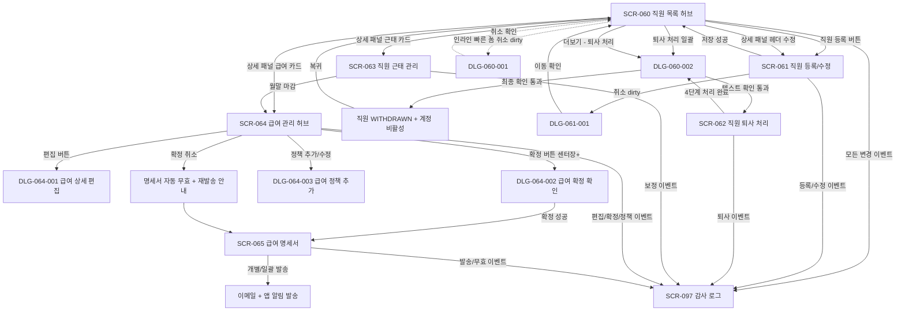

# D07 직원관리 도메인 인덱스

## 1. 도메인 개요

D07 직원관리는 센터에 소속된 모든 직원(센터장·매니저·FC·트레이너·스태프·프런트·골프프로)의 인사·근태·급여·계정 생명주기를 한 도메인에서 통합 관리하는 영역입니다. `직원 1명 = 로그인 계정 1개`라는 정책을 기반으로 하며, 직원 등록부터 퇴사 처리까지의 전 생명주기에서 인사·근태·급여·전자계약·감사 로그가 한 워크플로우로 묶여 동작합니다. 본사 슈퍼관리자는 통합 모드에서 전 지점 인력 현황을 합산 조회·비교할 수 있고, 일반 지점 사용자는 본인 지점 데이터에만 접근 가능합니다.

이 도메인이 다루는 핵심 운영 흐름은 6가지입니다. 직원 목록 허브(SCR-060)에서 인력 현황을 조회·검색·일괄 작업하고, 직원 등록/수정(SCR-061)에서 신규 입사·정보 변경·계정 발급을 처리하며, 퇴사 처리(SCR-062) 4단계 위자드에서 퇴사일 설정·인수인계·스케줄 정리·계정 비활성을 동시에 진행합니다. 근태 관리(SCR-063)는 키오스크·IoT 자동 수집과 수동 보정의 우선순위를 관리해 급여 자동 연동의 입력값을 보장하며, 급여 관리(SCR-064) 허브는 직군별 산식(FC·PT·GX·공통)으로 월별 급여를 자동 계산하고 매니저+ 편집·센터장+ 확정의 권한 분리 워크플로우를 운영합니다. 급여 명세서(SCR-065)는 확정된 명세서를 이메일·앱 알림으로 발송하고 5년 보존·법정 보존·본인 인증·수신 트래킹을 보장합니다.

이 도메인 안의 모든 SCR과 DLG는 자기완결형 요구사항 정의서로 작성되어 있으며, 다른 문서 없이 한 장만으로 구현·운영이 가능하도록 풀어 적혀 있습니다. 각 화면별로 권한 분리·감사 로그·외부 노무 처리·본사 통합 모드·세션 보존 같은 운영 정책이 화면 안에 통합되어 있어, 정책 변경과 코드 변경이 항상 짝지어 진행됩니다.

## 2. 화면(SCR) 목록

### 허브 화면

| ID | 화면명 | 라우트 | 유형 | 우선순위 | 문서 |
|---|---|---|---|---|---|
| SCR-060 | 직원 목록 | `/staff` | 허브 화면 | P0 | [SCR-060 직원목록 페이지](./SCR-060%20직원목록%20페이지/README.md) |
| SCR-064 | 급여 관리 | `/payroll` | 허브 화면 | P0 | [SCR-064 급여관리 페이지](./SCR-064%20급여관리%20페이지/README.md) |

### 일반 화면

| ID | 화면명 | 라우트 | 유형 | 우선순위 | 문서 |
|---|---|---|---|---|---|
| SCR-061 | 직원 등록/수정 | `/staff/new`, `/staff/edit/:id` | 입력 폼 화면 | P0 | [SCR-061 직원등록수정 페이지](./SCR-061%20직원등록수정%20페이지/README.md) |
| SCR-062 | 직원 퇴사 처리 | `/staff/resignation` | 4단계 위자드 화면 | P0 | [SCR-062 직원퇴사처리 페이지](./SCR-062%20직원퇴사처리%20페이지/README.md) |
| SCR-063 | 직원 근태 관리 | `/staff/attendance` | 조회/편집 화면 | P0 | [SCR-063 직원근태관리 페이지](./SCR-063%20직원근태관리%20페이지/README.md) |
| SCR-065 | 급여 명세서 | `/payroll/statements` | 조회/발송 화면 | P0 | [SCR-065 급여명세서 페이지](./SCR-065%20급여명세서%20페이지/README.md) |

## 3. 다이얼로그(DLG) 목록

| ID | 다이얼로그명 | 부모 화면 | 유형 | 우선순위 | 문서 |
|---|---|---|---|---|---|
| DLG-060-001 | 직원 등록/수정 취소 확인 | SCR-060 (인라인 빠른 폼) | 이탈 확인 모달 | P1 | [DLG-060-001 등록수정취소 다이얼로그](./DLG-060-001%20등록수정취소%20다이얼로그/README.md) |
| DLG-060-002 | 직원 삭제(퇴사) 확인 | SCR-060, SCR-062 | 위험 확인 모달 (텍스트 입력) | P0 | [DLG-060-002 삭제확인 다이얼로그](./DLG-060-002%20삭제확인%20다이얼로그/README.md) |
| DLG-061-001 | 직원 등록 폼 취소 확인 | SCR-061 | 페이지 이탈 확인 모달 | P1 | [DLG-061-001 등록수정취소 다이얼로그](./DLG-061-001%20등록수정취소%20다이얼로그/README.md) |
| DLG-064-001 | 급여 상세 편집 | SCR-064 | 입력 폼 모달 (실시간 계산) | P0 | [DLG-064-001 급여상세편집 다이얼로그](./DLG-064-001%20급여상세편집%20다이얼로그/README.md) |
| DLG-064-002 | 급여 확정 확인 | SCR-064 | 확정 확인 모달 | P0 | [DLG-064-002 급여확정확인 다이얼로그](./DLG-064-002%20급여확정확인%20다이얼로그/README.md) |
| DLG-064-003 | 급여 정책 추가/수정 | SCR-064 | 입력 폼 모달 (정책 템플릿) | P1 | [DLG-064-003 급여정책추가 다이얼로그](./DLG-064-003%20급여정책추가%20다이얼로그/README.md) |

## 4. 기능 코드 매핑

| 기능 코드 | 기능명 | 화면 | 계약 코드 |
|---|---|---|---|
| STF-01 | 직원/트레이너 목록 조회 | SCR-060 | STF-01 |
| STF-02 | 직원 상세 패널 (운영자용) | SCR-060 상세 | STF-02, STF-03 |
| STF-04 | 직원 퇴사 처리 | SCR-062 | PAY-STF-05, STF-04 |
| STF-EXT-01 | 직원 등록 / 수정 | SCR-061 | AUTH-02 |
| AUTH-EXT-02 | 직원 계정 생명주기 보안 정책 | SCR-061 | AUTH-02 |
| PAY-STF-01 | 직원 근태 관리 | SCR-063 | PAY-STF-01 |
| PAY-STF-02 | 급여 관리 | SCR-064 | PAY-STF-02, PAY-STF-04 |
| PAY-STF-03 | 급여 명세서 | SCR-065 | PAY-STF-03 |

## 5. 도메인 핵심 정책 요약

이 도메인 전반에 공통으로 적용되는 핵심 운영 정책을 한곳에 정리합니다. 각 정책의 상세 동작은 해당 화면 문서에 자기완결형으로 풀어 적혀 있습니다.

**직원 1명 = 로그인 계정 1개 원칙.** SCR-061 직원 저장 시 직원 row와 users row, Supabase Auth 사용자가 동시에 생성·동기화됩니다. SCR-062 퇴사 처리 시 즉시 deactivate되어 로그인이 차단되고 활성 세션이 강제 만료됩니다. `SUPABASE_SERVICE_ROLE_KEY` 미설정 시 users 동기화만 진행되며 Auth 동기화는 건너뛰고 UI에 경고 토스트가 노출됩니다.

**직무 7종(센터장·매니저·FC·트레이너·스태프·프런트·골프프로)과 재직 상태 3종(재직·휴직·퇴사).** 직무는 인사·운영 분류값이며, 관리자웹 메뉴 접근 권한은 SCR-081에서 별도 매핑됩니다. 재직 상태는 시스템 상태값이며, 단일 선택입니다. 퇴사로의 일괄 변경은 SCR-062 4단계 위자드를 통해서만 가능합니다.

**본사 통합 모드는 본사 권한자(superAdmin/primary)에게만 활성화.** 통합 모드에서는 모든 지점 직원이 합산 조회되며 소속 지점 컬럼이 자동 표시됩니다. 일괄 작업은 직원의 실제 `branchId` 기준으로 분기 처리되어 트랜잭션이 지점별로 묶입니다.

**권한 분리 정책.** 일반 퇴사 처리 생성·진행은 매니저+ 가능하지만, 퇴사 취소(24h 내·인계 미진행)·정산 미완료 강제 확정·과거일 즉시 퇴사 강행은 센터장+에게만 허용됩니다. 급여 편집은 매니저+ 가능하지만 [확정]·[확정 취소] 자체는 센터장+만 가능합니다. 이는 직원 신뢰에 직접 영향을 미치는 액션에 추가 권한자의 검토를 강제하는 정책입니다.

**감사 로그 정책.** 이 도메인의 모든 변경(등록·수정·퇴사·근태 보정·급여 편집·확정·확정 취소·정책 변경·계정 보안 액션)은 SCR-097 감사 로그에 비동기로 기록됩니다. 기록 필드는 `actor_id`, `staff_id`, `action_type`, `before`, `after`, `reason`, `timestamp`이며, append-only로 영구 보존되어 사후 감사가 가능합니다.

**근태·급여 자동 연동.** SCR-063 근태 데이터는 SCR-064 급여 자동 계산의 핵심 입력입니다. 시급제·건별 직원의 기본급·수수료가 자동 산출되고, 지각·결근 자동 공제는 근태 페널티 정책 토글에 따라 자동 추가됩니다. 휴가·외근 일자는 출근일 카운트에서 자동 제외됩니다.

**확정 → 명세서 자동 생성 → 발송 → 무효 처리.** SCR-064 확정 시 SCR-065 명세서가 자동 생성되고, 매니저+가 발송합니다. 확정 취소 시 발송된 명세서가 자동 "무효" 배지로 전환되고 직원에게 재발송 알림이 발송됩니다. 재확정 시 무효 명세서는 보존되고 새 명세서가 별도 생성됩니다.

**전월 이전 잠금 정책.** 매월 1일 00:00 배치가 전월의 모든 급여 row를 read-only로 전환합니다. 회계 마감과 노무 정산의 무결성을 보장하기 위한 정책이며, 어떤 권한도 잠금을 해제할 수 없습니다.

**5년 보존·법정 보존 정책.** 회사·세무법령에 따라 명세서·발송 이력은 5년 이상 보존 의무가 있으며, 영구 보존이 권장됩니다. 퇴사 직원 본인은 본인 명세서를 5년간 이메일 링크로 조회할 수 있도록 5년 유효 토큰이 발급됩니다. 5년 초과 데이터는 익명화 또는 아카이브 처리됩니다.

**외부 노무·세무 처리 안내.** 시스템은 인사·근태·급여 계산까지만 담당하고, 임금 정산·4대 보험 상실 신고·세무 신고는 외부 노무사·세무사 시스템에서 별도 처리됩니다. 관련 화면(SCR-062·SCR-064)에는 항상 외부 처리 안내 박스가 표시되어 시스템 책임 범위를 명확히 합니다.

**전자 근로계약서 연계 (선택).** SCR-061 저장 시 옵션 ON 시 이메일·카카오로 자동 발송되어 서명 완료 시 인사 파일에 자동 저장됩니다. 테넌트 정책에 따라 활성화됩니다.

**세션 상태 보존 정책.** 모든 SCR의 필터·페이지·검색어는 페이지 이탈 시 세션 스토리지에 5분 TTL로 저장되어, 같은 운영 흐름을 복귀 후에도 이어서 진행할 수 있습니다. SCR-061은 추가로 30초 주기 자동 임시 저장이 로컬 스토리지에 적용됩니다.

## 6. 화면 간 진입 관계도

## 7. 화면별 분량 가이드 (참고)

| 화면 분류 | 권장 분량 | 실제 작성 분량 |
|---|---|---|
| 허브 화면 (SCR-060, SCR-064) | 400~500줄 | 350~450줄 |
| 일반 화면 (SCR-061, SCR-062, SCR-063, SCR-065) | 250~350줄 | 290~360줄 |
| 다이얼로그 (DLG-060-001, DLG-060-002, DLG-061-001, DLG-064-001, DLG-064-002, DLG-064-003) | 150~250줄 | 180~280줄 |

각 문서는 자기완결형으로 작성되어 있어 분량이 가이드보다 다소 길어진 영역이 있습니다. 다이얼로그 문서는 복잡한 검증 규칙과 운영 정책이 풀어 적혀 있는 경우 250줄을 초과할 수 있습니다.

## 8. 변경 이력

| 일자 | 변경 |
|---|---|
| 2026-05-22 | D07 직원관리 도메인 12종 문서 신규 작성. SCR 6종(SCR-060/061/062/063/064/065) + DLG 6종(DLG-060-001/002, DLG-061-001, DLG-064-001/002/003) 자기완결형 요구사항 정의서 납품본 완성. 인사·근태·급여·계정 생명주기·전자계약·감사 로그·본사 통합 모드·5년 보존 등 운영 정책이 각 화면 안에 통합 반영됨. |
