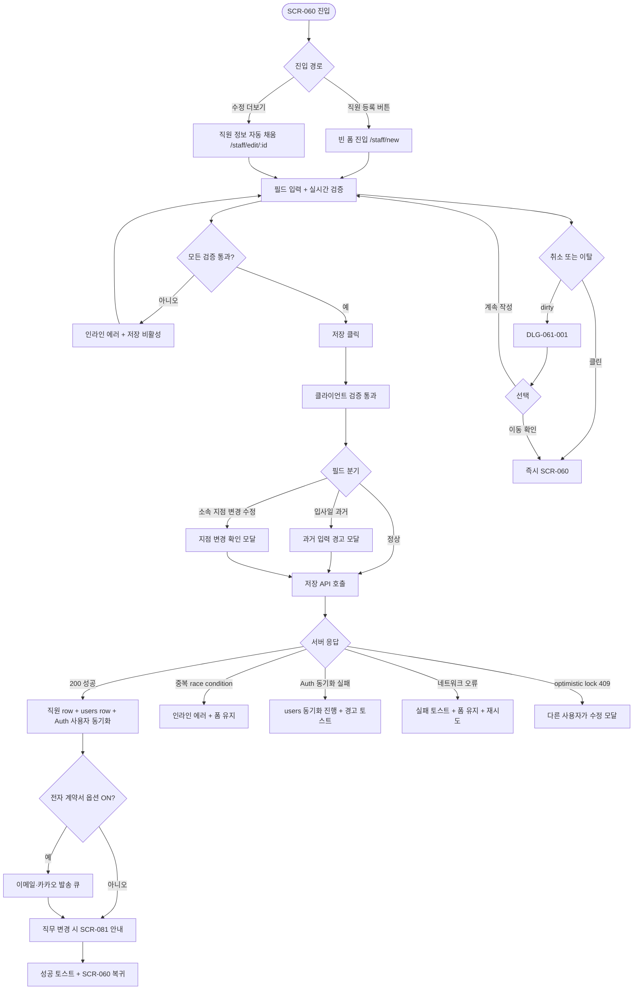
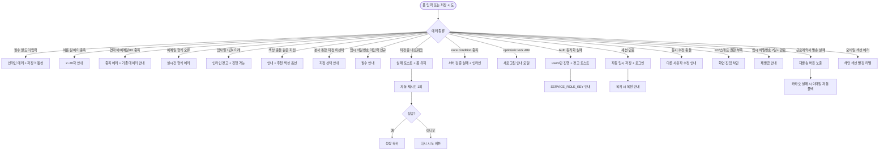

# SCR-061 직원 등록/수정 페이지

## 1. 화면 메타 정보

이 문서는 직원 등록/수정 페이지에 대한 자기완결형 요구사항 정의서입니다. 다른 문서를 함께 보지 않아도 이 한 장만으로 직원 등록·수정 페이지에 들어가는 모든 입력 필드, 모든 검증, 모든 모달, 모든 권한, 모든 예외 처리, 그리고 이 화면을 지탱하는 인사·계정·급여·전자계약 운영 정책까지 전부 이해하고 구현할 수 있도록 작성합니다.

| 항목 | 값 |
|---|---|
| 작성일 | 2026-05-22 |
| 버전 | v1.0 |
| 상태 | 최신 통합본 반영 (정합화 완료) |
| 도메인 | D07 직원관리 |
| 화면 ID | SCR-061 |
| 화면명 | 직원 등록/수정 |
| 화면 유형 | 입력 폼 화면 (Form Screen) |
| 라우트 (URL) | 신규 `/staff/new`, 수정 `/staff/edit/:id` |
| 플랫폼 | 데스크톱(기본), 태블릿, 모바일(아코디언 풀스크린) |
| 우선순위 | P0 (출시 필수) |
| 기능코드 | STF-EXT-01 (직원 등록/수정), AUTH-EXT-02 (직원 계정 생명주기 보안 정책) |
| 계약코드 | AUTH-02, STF-EXT-01 |
| 계약 상태 | 계약 범위 본기능 |
| 부모 기능 prefix | STF, AUTH |
| Lv1 코드 | STF-EXT-01, AUTH-EXT-02 |
| Lv2 / Lv3 세분화 | STF-EXT-01-01 ~ STF-EXT-01-09 (기본 정보·담당 서비스·급여 정보·로그인 계정·캘린더 색상·근로계약서·유효성·이탈 확인·저장 복귀) |
| 연계 화면 | SCR-060 직원목록, SCR-081 권한설정, SCR-064 급여관리, SCR-C001 수업캘린더, SCR-097 감사로그 |
| 호출 다이얼로그 | DLG-061-001 등록수정취소 |

## 2. 화면 개요와 목적

직원 등록/수정 페이지는 신규 직원을 시스템에 등록하거나 기존 직원의 정보를 수정하는 입력 폼 화면입니다. 이름·연락처·직무·이메일 등 기본 정보와 함께 담당 서비스, 급여 형태와 기본급, 로그인 계정(로그인 ID·임시 비밀번호·계정 상태), 권한 템플릿 연결 상태, 캘린더 색상, 그리고 선택적으로 전자 근로계약서 발송 옵션까지 한 화면에서 설정합니다. 등록된 직원은 직원 목록(SCR-060)에 즉시 반영되며, 직원 1명당 로그인 계정 1개를 기본 원칙으로 합니다. 여기서 입력하는 `직무`는 인사·운영 분류값이며, 실제 관리자웹 메뉴 접근 권한은 SCR-081 권한 설정에서 별도로 매핑됩니다.

이 화면이 다루는 운영 흐름은 다음과 같습니다. 매니저가 신규 트레이너 채용 확정 직후 입사일을 D-7 미래로 등록해 두면, 입사 당일 자동으로 재직 상태가 active로 전환되고 캘린더 색상도 즉시 매핑되어 수업 캘린더에 노출됩니다. 센터장이 FC를 매니저로 승진시킬 때는 수정 모드에서 직무를 변경하면 SCR-081 권한 매핑이 자동 재평가되고 안내가 표시됩니다. 신규 직원 등록 시 로그인 ID와 임시 비밀번호를 입력하면 직원 row와 users row, Supabase Auth 사용자가 동시에 생성되며, 첫 로그인 후 비밀번호 변경 강제가 기본 ON 상태로 들어갑니다. 계정만 잠금시키고 재직 상태를 유지해야 할 때는 계정 상태를 LOCKED로 저장하면 로그인만 차단되고 직원 정보는 보존됩니다.

따라서 이 화면은 단순한 폼이 아니라, 인사·계정·급여·캘린더·전자계약·권한 매핑까지 동시에 다루는 멀티 도메인 입력 도구로 동작해야 합니다.

## 3. 진입 경로와 인접 화면

이 화면에 진입하는 경로는 세 가지입니다.

첫 번째 경로는 신규 등록입니다. 직원 목록(SCR-060) 우측 상단의 "직원 등록" 버튼을 클릭하면 모든 필드가 빈 상태인 등록 폼이 `/staff/new` 라우트로 열립니다. 본사 통합 모드에서는 소속 지점 드롭다운이 노출되어 어느 지점에 등록할지 선택할 수 있으며, 센터장·매니저는 본인 지점이 자동 설정된 채로 진입합니다.

두 번째 경로는 수정 모드입니다. 직원 목록 테이블의 직원명 클릭으로 상세 패널을 연 뒤 헤더의 [수정] 버튼을 누르거나, 더보기 메뉴에서 수정 항목을 누르면 해당 직원의 정보가 자동 채워진 상태로 `/staff/edit/:id` 라우트로 진입합니다. 또는 직원 상세 패널(STF-02)의 헤더 액션에서도 같은 경로로 진입할 수 있습니다.

세 번째 경로는 권한 설정 화면(SCR-081)에서의 역참조입니다. 권한 매핑을 점검하던 중 직무를 변경해야 할 직원이 발견되면 그 직원의 수정 모드로 진입해 직무를 바꿀 수 있고, 저장 후 다시 SCR-081로 자동 복귀하는 흐름이 가능합니다.

이 화면에서 빠져나가는 인접 화면으로는, 저장 성공 시 자동 복귀하는 직원 목록(SCR-060), 직무 변경 후 자동 안내로 진입하는 권한 설정(SCR-081), 급여 형태·기본급 변경 시 차후 적용 예고가 전달되는 급여 관리(SCR-064), 캘린더 색상 변경의 영향을 받는 수업 캘린더(SCR-C001), 그리고 모든 등록·수정 이벤트가 기록되는 감사 로그(SCR-097)가 있습니다.

## 4. 레이아웃과 UI 구성

화면은 위에서 아래로 섹션이 차례로 배치된 세로형 단일 컬럼 레이아웃을 사용합니다. 데스크톱에서는 가로 폭이 충분하므로 두 컬럼 그리드(좌/우 50%)로 필드를 배치하지만, 태블릿에서는 한 컬럼으로 자동 전환되고, 모바일(768px 미만)에서는 섹션별 아코디언으로 자동 전환되어 한 번에 한 섹션만 펼쳐 작성하게 됩니다.

가장 위에는 페이지 헤더가 있습니다. 좌측에는 "직원 등록" 또는 "직원 정보 수정"이라는 페이지 타이틀과 함께 본사 통합 모드 진입 시 "{지점명}에 등록 중"이라는 컨텍스트 배지가 표시됩니다. 우측 끝에는 [저장] 버튼과 [취소] 버튼이 일렬로 놓이고, 페이지를 스크롤해도 sticky로 화면 상단에 고정되어 어디서든 저장할 수 있도록 합니다.

페이지 헤더 아래 첫 번째 섹션은 기본 정보 섹션입니다. 좌측 컬럼에 직원명(텍스트, 필수, 한·영·한자 2~20자, 특수문자·이모지 차단), 연락처(010 자동 포맷, 직원·회원 통합 중복 검증, 수정 시 본인 제외), 이메일(형식 검증·중복 검증·로그인 계정 필수), 직무(단일 선택 드롭다운, 필수, 7종 - 센터장·매니저·FC·트레이너·스태프·프런트·골프프로), 우측 컬럼에 직급(텍스트), 입사일(캘린더), 소속 지점(드롭다운, 본사 통합 모드 한정), 성별(라디오) 필드가 배치됩니다. 직무 변경 시에는 "직무 변경 시 권한 매핑이 자동 재평가됩니다" 인라인 안내가 표시되며, SCR-081 진입 링크가 함께 노출됩니다.

두 번째 섹션은 담당 서비스 섹션입니다. 해당 직원이 담당할 서비스 항목(PT·필라테스·GX·골프 등)을 체크박스 멀티 선택으로 표시합니다. 센터의 운영 정책에 따라 사용하지 않는 서비스는 자동으로 숨겨집니다.

세 번째 섹션은 급여 정보 섹션입니다. 급여 형태(라디오 - 월급제·시급제·건별·혼합)와 기본급(숫자, 콤마 자동 포맷), 수당 정책 토글(식대·교통비 자동 적용)이 배치됩니다. 급여 형태와 기본급은 PAY-STF-02 급여 관리와 자동 연동되어, 저장 후 다음 월 급여 자동 계산에 반영됩니다. 필요 시 PAY-STF-02 정책 템플릿 연결 드롭다운이 함께 표시되어, 미리 정의된 직군별 급여 정책을 선택할 수 있습니다.

네 번째 섹션은 로그인 계정 섹션입니다. 로그인 ID(텍스트, 직원 1명당 1개, 전사 중복 불가), 로그인 이메일(필수, 비밀번호 재설정·보안 알림 수신용), 임시 비밀번호(신규 시 필수, 정책에 따라 강도 검증), 계정 상태(라디오 - ACTIVE·LOCKED), 첫 로그인 후 비밀번호 변경 강제 토글(기본 ON)이 배치됩니다. 저장 시 직원 row, users row, Supabase Auth 사용자가 동시에 생성·동기화되며, `SUPABASE_SERVICE_ROLE_KEY` 미설정 환경에서는 Auth 동기화가 건너뛰어지고 경고 토스트가 표시됩니다.

다섯 번째 섹션은 권한/보안 요약 섹션입니다. 직무에 따라 자동 매핑되는 권한 템플릿 요약, 로그인 차단 여부, 지점 접근 범위가 요약 표시되며, [SCR-081 권한 설정으로 이동] 링크가 함께 제공되어 세부 메뉴 권한을 조정하러 갈 수 있게 합니다.

여섯 번째 섹션은 캘린더 색상입니다. 수업 캘린더(SCR-C001)에서 직원을 구분하기 위한 색상이며, v1 기본값은 시스템이 지점 내 사용 빈도가 낮은 색상을 자동 배정합니다. 수동 색상 선택 UI(6종 팔레트)는 운영 편의 기능으로 분리되어, 활성화된 테넌트에서만 노출됩니다. 같은 지점 색상 중복은 허용되며, 중복 경고와 자동 추천 색상은 v1 필수 정책이 아닙니다.

일곱 번째 섹션은 근로계약서 섹션(선택)입니다. 전자 계약서 발송 옵션 토글이 표시되며, 토글 ON 상태로 저장하면 이메일·카카오로 자동 발송됩니다. 직원이 서명을 완료하면 인사 파일에 자동 저장됩니다. 이 섹션은 테넌트 정책에 따라 활성화되며, 비활성 테넌트에서는 섹션 자체가 hidden됩니다.

페이지 가장 아래에는 [저장] / [취소] 버튼 영역이 한 번 더 반복됩니다(헤더의 sticky 버튼과 함께). 저장 버튼은 dirty 상태일 때만 강조 색으로 활성화되며, 클릭 시 유효성 검사를 거쳐 저장됩니다. 취소 버튼은 dirty 상태일 때 DLG-061-001을 호출하고, 클린 상태일 때는 즉시 SCR-060으로 복귀합니다.

폼 입력 중 30초 주기로 로컬 스토리지에 임시 저장이 진행되어, 세션 만료·네트워크 오류·실수 새로고침에서도 데이터가 보존됩니다. 복귀 시 임시 저장 데이터가 발견되면 "이전에 작성하던 내용이 있습니다. 복원하시겠습니까?" 안내가 표시됩니다.

## 5. 입력 필드와 검증 규칙

폼의 모든 입력 필드는 다음과 같은 검증 규칙을 가집니다. 검증은 실시간 인라인 에러로 표시되며, 한 필드라도 유효하지 않으면 저장 버튼이 비활성화됩니다.

직원명은 필수 입력이며 한·영·한자 2~20자만 허용됩니다. 특수문자(`!@#$%^&*()` 등)와 이모지는 차단되고, 공백만 입력된 경우도 비어 있는 것으로 간주됩니다. 1자만 입력하거나 21자를 초과하면 "2~20자로 입력해주세요" 인라인 에러가 표시됩니다.

연락처는 010 시작 11자리 숫자만 허용되며, 입력하는 즉시 010-1234-5678 형식으로 자동 포맷됩니다. 중복 검증은 직원·회원 통합 풀에서 이루어지며, 이미 사용 중인 번호이면 "이미 등록된 연락처입니다" 인라인 에러와 함께 기존 데이터 안내가 표시됩니다. 수정 모드에서는 본인 ID가 중복 대상에서 자동 제외됩니다.

이메일은 형식 검증(`local@domain.tld`)이 실시간으로 적용되고, 형식 오류 시 "올바른 이메일 형식을 입력해주세요" 인라인 에러가 즉시 표시됩니다. 중복 검증은 직원 풀에서 이루어지며, 이미 사용 중이면 "이미 사용 중인 이메일입니다" 에러가 표시됩니다. 로그인 계정이 있는 모든 직원에게 이메일은 필수이며, 미입력 시 "로그인 계정에는 이메일이 필수입니다" 에러가 표시됩니다.

로그인 ID는 직원 1명당 1개, 전사 중복 불가입니다. 영문·숫자·일부 특수문자(`_`, `.`, `-`)만 허용되며, 4~20자 범위입니다. 중복 검증은 `POST /api/staff/check-username`으로 실시간 확인되고, 이미 사용 중이면 "이미 사용 중인 로그인 ID입니다" 에러가 표시됩니다.

직무는 단일 선택 필수이며, 미선택 시 "직무를 선택해주세요" 에러와 함께 저장 버튼이 비활성화됩니다. 직무 변경 시 SCR-081 권한 매핑이 자동 재평가되며, 변경 직후 "직무 변경에 따라 권한 매핑이 자동 재평가됩니다. SCR-081에서 세부 권한을 확인하세요" 안내가 표시됩니다.

입사일은 캘린더 입력이며, 미래 날짜는 사전 등록으로 허용됩니다. 과거 날짜는 경고 모달 "입사일이 과거입니다, 진행하시겠습니까?"를 통과해야 진행 가능하고, 1년 이상 미래 날짜는 인라인 경고 "입사일이 1년 이상 미래입니다, 확인해주세요"가 표시되지만 진행은 가능합니다.

소속 지점은 본사 통합 모드 진입 시에만 노출되며, 슈퍼관리자·본사 최고관리자만 직접 선택 가능합니다. 센터장·매니저는 본인 지점이 자동 설정되어 변경 불가합니다. 슈퍼관리자가 수정 모드에서 지점을 변경하면 캘린더·실적·근태 데이터가 새 지점으로 이전되며, 이는 매우 영향이 큰 변경이므로 별도 확인 모달이 한 번 더 호출됩니다.

임시 비밀번호는 신규 등록 시 필수입니다. 미입력 시 "신규 직원 계정의 임시 비밀번호를 입력하세요" 에러가 표시되며, 입력 시에는 비밀번호 강도 검증(최소 8자, 영문·숫자·특수문자 조합 정책)이 실시간 적용됩니다. 수정 모드에서는 [임시 비밀번호 재발급] 버튼으로 별도 액션을 트리거하며, 즉시 변경 없이 직원에게 재발급 안내가 발송됩니다.

기본급은 0 이상의 정수만 허용되며, 입력 즉시 콤마가 자동 포맷됩니다. 마이너스 입력 시 "기본급은 0 이상이어야 합니다" 에러가 표시됩니다.

이 모든 검증은 클라이언트에서 실시간으로 이루어지지만, 저장 시 서버에서 한 번 더 검증됩니다. 동시 등록 race condition으로 서버 검증에서 중복이 발견되면 인라인 에러가 표시되고 폼 입력값은 유지됩니다.

## 6. 버튼·아이콘·링크 액션 전체 정의

[저장] 버튼은 sticky 헤더와 페이지 하단 두 곳에 표시되며, 폼 dirty 상태일 때만 강조 색으로 활성화됩니다. 클릭 시 클라이언트 유효성 검사를 거쳐 통과하면 백엔드로 저장 요청이 전송됩니다. 저장 도중 버튼은 로딩 상태로 전환되어 더블 클릭이 차단되며, 성공 시 "직원이 등록되었어요" 또는 "직원 정보가 수정되었어요" 토스트와 함께 SCR-060 목록으로 자동 복귀합니다. 신규 등록 시 본인에게 계정 정보 안내 이메일이 자동 발송되고, 매니저+에게 알림 센터(NFR-19)로 등록 알림이 푸시됩니다.

[취소] 버튼은 폼 dirty 상태이면 DLG-061-001 이탈 확인 다이얼로그를 호출하고, 클린 상태이면 즉시 SCR-060으로 복귀합니다. 다이얼로그에서 [이동 확인]을 누르면 폼 데이터가 폐기되고 SCR-060으로 이동하며, [계속 작성]을 누르면 다이얼로그가 닫히고 폼이 유지됩니다.

직무 드롭다운 옆에는 [SCR-081 권한 설정으로 이동] 텍스트 링크가 노출되어, 직무 변경 후 세부 메뉴 권한을 즉시 점검하러 갈 수 있게 합니다.

임시 비밀번호 옆에는 [재발급] 버튼이 표시됩니다(수정 모드). 클릭 시 시스템이 새 임시 비밀번호를 생성해 직원 이메일로 자동 발송하고, 첫 로그인 후 변경 강제가 ON으로 자동 설정됩니다.

계정 상태 라디오의 [LOCKED] 선택은 즉시 적용 옵션입니다. 저장과 동시에 로그인이 차단되며, 직원 정보는 그대로 유지됩니다. 잠금 해제는 같은 화면에서 [ACTIVE]로 변경 후 저장하면 됩니다.

전자 근로계약서 발송 토글은 ON 상태로 저장하면 직원 이메일·카카오로 자동 발송됩니다. 발송 실패 시 토스트와 함께 [재발송] 버튼이 화면에 표시되어 매니저가 수동으로 재시도할 수 있습니다.

캘린더 색상 영역의 [자동 배정] 버튼은 시스템이 지점 내 사용 빈도가 낮은 색상을 다시 추천하며, 색상 팔레트가 활성화된 테넌트에서는 6종 팔레트 중 직접 선택할 수도 있습니다.

브라우저 뒤로가기·사이드바 메뉴 클릭·새로고침 같은 페이지 이탈 시도는 폼 dirty 상태일 때 자동으로 차단되며, DLG-061-001이 호출됩니다. 입력 도중 30초 주기 임시 저장이 자동으로 일어나므로, 다이얼로그에서 [이동 확인]을 눌러도 30초 이내의 데이터는 로컬 스토리지에 남아 다음 진입 시 복원 안내가 표시됩니다.

모든 버튼은 클릭 후 응답이 돌아오기 전까지 비활성화되어 중복 요청이 차단됩니다.

## 7. 호출되는 모달 동작

### 7-1. DLG-061-001 직원 등록 폼 취소 확인 다이얼로그

이 화면에서 [취소] 버튼을 누르거나 페이지 이탈을 시도할 때, 폼이 dirty 상태이면 자동으로 호출됩니다. 모달 상단에는 "페이지를 벗어나시겠습니까?"라는 제목이 표시되고, 그 아래에 "작성 중인 내용이 저장되지 않습니다. 페이지를 이동하시겠습니까?"라는 안내가 따라옵니다. 하단에는 [계속 작성] 버튼과 [이동 확인] 버튼이 있습니다. 계속 작성을 누르면 모달이 닫히고 폼이 유지되며, 이동 확인을 누르면 폼 데이터가 폐기되고 SCR-060으로 이동합니다. ESC 키와 배경 클릭은 [계속 작성]과 동일하게 동작합니다.

폼이 클린 상태(아무 입력도 변경하지 않은 상태)에서는 다이얼로그가 표시되지 않고 즉시 SCR-060으로 복귀합니다. dirty 판정은 모든 필드의 dirty 플래그를 OR 조건으로 합산해 결정됩니다.

### 7-2. 입사일 과거 입력 경고 모달

입사일에 오늘 이전 날짜를 선택하면 경고 모달이 호출됩니다. "입사일이 과거입니다, 진행하시겠습니까?"라는 안내와 함께 [진행] / [취소] 버튼이 있습니다. 진행을 누르면 입사일이 과거로 저장되어 즉시 재직 상태가 active로 전환되고, 취소를 누르면 입사일 필드가 이전 값으로 되돌아갑니다.

### 7-3. 슈퍼관리자 소속 지점 변경 확인 모달

수정 모드에서 슈퍼관리자가 직원의 소속 지점을 변경하면 별도 확인 모달이 호출됩니다. "소속 지점 변경 시 캘린더·실적·근태 데이터가 새 지점으로 이전됩니다. 진행하시겠습니까?"라는 안내와 함께 영향 받는 데이터 수가 표시되며, [진행] / [취소] 버튼이 있습니다.

## 8. 토스트와 확인 팝업과 알럿

성공 토스트는 우측 상단에 녹색 계열로 5초 동안 표시됩니다. "직원이 등록되었어요"(신규), "직원 정보가 수정되었어요"(수정), "임시 비밀번호가 재발급되었어요", "전자 근로계약서가 발송되었어요"가 대표적입니다.

실패 토스트는 우측 상단에 빨강 계열로 표시됩니다. "저장에 실패했습니다, 다시 시도해주세요"(네트워크 오류), "다른 사용자가 수정했습니다"(optimistic lock), "Supabase Auth 동기화에 실패했습니다. SUPABASE_SERVICE_ROLE_KEY 환경변수를 확인하세요"(Auth 동기화 실패) 같은 안내가 표시됩니다.

인라인 에러는 각 필드 하단에 빨강 텍스트로 즉시 표시되며, 저장 버튼이 비활성화됩니다. 인라인 경고는 노랑 텍스트로 표시되며 저장은 차단하지 않습니다(예: 입사일 1년 이상 미래).

확인 팝업은 입사일 과거 입력, 소속 지점 변경, 폼 이탈 시도 등 별도 모달로 호출됩니다.

알럿은 권한 없는 계정이 직접 URL로 접근했을 때 표시됩니다. 페이지 본문이 전부 가려지고 "이 화면에 접근할 권한이 없습니다" 메시지와 함께 3초 카운트다운 후 대시보드로 자동 이동됩니다.

## 9. 데이터 흐름과 외부 연동

이 화면의 데이터 흐름은 여러 외부 시스템과 동기화됩니다.

화면 진입 시점에는 수정 모드일 때만 직원 정보 조회 API(`GET /api/staff/:id`)가 호출되어 폼에 자동 채움됩니다. 신규 모드는 빈 폼으로 시작합니다.

연락처·이메일·로그인 ID는 입력 즉시 중복 검증 API(`POST /api/staff/check-phone`, `POST /api/staff/check-email`, `POST /api/staff/check-username`)가 호출되어 인라인 에러가 표시됩니다. 디바운스 500ms로 빈번한 호출이 방지되며, 수정 모드에서는 본인 ID가 자동 제외됩니다.

저장 시 신규는 `POST /api/staff`, 수정은 `PUT /api/staff/:id`가 호출됩니다. 저장 요청에는 모든 입력 필드가 포함되며, 백엔드에서는 트랜잭션으로 직원 row, users row, Supabase Auth 사용자를 동시에 생성·동기화합니다.

계정 동기화는 `POST /api/staff/account`로 별도로 호출될 수 있습니다. `action: "upsert"` 또는 `action: "deactivate"`를 받아 users 테이블과 Supabase Auth 사용자(`email = ${username}@spogym.local`)를 함께 처리합니다. 서버 환경변수 `SUPABASE_SERVICE_ROLE_KEY`가 필수이며, 미설정 시 users 동기화는 진행되지만 Auth 동기화는 건너뛰고 UI에 경고 토스트가 노출됩니다.

직무 변경은 SCR-081 권한 매핑 자동 재평가를 트리거합니다. 저장 직후 백엔드 이벤트가 발행되어 권한 매핑 캐시가 무효화되고, 다음 로그인부터 새 권한이 적용됩니다.

급여 형태와 기본급은 PAY-STF-02(SCR-064)에 자동 연동되어, 다음 월 급여 자동 계산에 반영됩니다. 시급제·건별로 저장하면 PAY-STF-01 근태 데이터를 입력으로 받아 자동 계산되도록 정책 풀에 추가됩니다.

캘린더 색상은 저장 시 시스템이 자동 배정하거나 수동 선택한 색상으로 SCR-C001 수업 캘린더에 즉시 매핑됩니다. 같은 지점 색상 중복은 허용되며, 중복 경고는 v1 필수 정책이 아니므로 후순위 기능으로 분리되어 있습니다.

전자 근로계약서 옵션을 ON으로 저장하면 이메일·카카오로 자동 발송 큐에 적재됩니다. 발송은 비동기로 진행되며, 직원 서명 완료 시 인사 파일에 자동 저장되고 매니저에게 알림이 발송됩니다.

저장 직후 본인에게 계정 정보 안내(로그인 ID·임시 비밀번호·로그인 URL) 이메일이 자동 발송되며, 매니저+에게 NFR-19 알림 센터로 등록 알림이 푸시됩니다.

입사일 도래 자동 활성화 배치는 매일 새벽 4시에 실행되어, 입사일 = 오늘인 직원의 재직 상태를 자동으로 active로 전환합니다. 입사일 미래로 등록한 직원도 이 배치에 따라 자동 활성화됩니다.

저장·수정 이벤트는 감사 로그(SCR-097)에 비동기 INSERT됩니다. 기록 필드는 `actor_id`, `staff_id`, `action_type`, `before`(JSON snapshot), `after`(JSON snapshot), `timestamp`이며, before/after 비교로 어떤 필드가 변경되었는지가 사후 추적 가능합니다.

화면에서 호출하는 주요 API는 다음과 같습니다. 직원 조회 `GET /api/staff/:id`, 등록 `POST /api/staff`, 수정 `PUT /api/staff/:id`, 중복 검증 `POST /api/staff/check-phone/check-email/check-username`, 계정 동기화 `POST /api/staff/account`, 전자 근로계약서 발송 `POST /api/staff/:id/contract`, 임시 비밀번호 재발급 `POST /api/staff/:id/reset-password`.

## 10. 화면 상태와 예외 처리

이 화면은 다음 상태들을 가집니다.

신규 등록 상태에서는 모든 필드가 빈 상태로 표시되고, 직무·소속 지점·계정 상태에는 시스템 기본값이 미리 들어가 있습니다(예: 직무 미선택, 계정 상태 ACTIVE, 첫 로그인 비밀번호 변경 강제 ON).

수정 모드 상태에서는 기존 직원 정보가 자동 채움되어 모든 필드에 값이 들어와 있습니다. 변경이 일어난 필드는 미세하게 다른 톤(예: 옅은 노랑 배경)으로 표시되어 어떤 필드를 바꿨는지 시각적으로 인지할 수 있습니다.

입력 중 상태에서는 모든 인라인 검증이 실시간으로 동작합니다. 한 필드라도 인라인 에러가 있으면 저장 버튼이 비활성화되고, 인라인 경고는 저장을 막지 않습니다.

저장 중 상태에서는 저장 버튼이 로딩 스피너로 전환되고 다른 버튼은 모두 비활성화됩니다. 중복 클릭이 차단되며, 응답이 돌아올 때까지 폼 입력도 잠시 잠깁니다.

저장 완료 상태에서는 성공 토스트가 표시된 후 자동으로 SCR-060으로 복귀합니다.

저장 실패 상태에서는 실패 토스트와 함께 폼 입력값이 그대로 유지되어, 사용자가 즉시 재시도할 수 있습니다.

이탈 경고 상태는 dirty 폼에서 [취소] 또는 페이지 이탈을 시도했을 때 DLG-061-001이 열린 상태입니다.

모바일 풀스크린 상태에서는 섹션별 아코디언으로 자동 전환되어, 한 번에 한 섹션만 펼쳐 작성합니다.

예외 케이스별 처리는 다음과 같습니다.

이름·연락처·이메일·로그인 ID·직무 같은 필수 필드 미입력 시 인라인 에러와 함께 저장 버튼이 비활성화됩니다.

연락처·이메일·로그인 ID 중복 시 인라인 에러가 표시되고 저장이 차단됩니다. 서버 race condition으로 클라이언트 검증을 통과한 뒤에 중복이 발견되면 저장 실패 토스트와 함께 폼이 유지됩니다.

입사일 과거는 경고 모달을 통과해야 진행되고, 1년 이상 미래는 인라인 경고만 표시됩니다.

본사 통합 모드에서 지점 미선택 시 "지점을 선택해주세요" 인라인 에러가 표시됩니다.

신규 등록에서 임시 비밀번호 미입력 시 "신규 직원 계정의 임시 비밀번호를 입력하세요" 인라인 에러가 표시됩니다.

수정 시 본인 연락처는 중복 대상에서 자동 제외됩니다.

저장 중 네트워크 오류는 토스트 안내와 함께 폼 입력값이 유지되어 사용자가 즉시 재시도할 수 있습니다.

세션 만료 시 30초 주기 임시 저장 데이터가 로컬 스토리지에 유지되어, 로그인 후 복귀 시 "이전에 작성하던 내용이 있습니다. 복원하시겠습니까?" 안내가 표시됩니다.

동시 수정 충돌(optimistic lock 위반) 시 "다른 사용자가 수정했습니다" 모달이 표시되고, 사용자는 최신 데이터를 새로고침한 뒤 다시 시도해야 합니다.

권한 부족(FC·트레이너·스태프·프런트) 시 화면 진입 자체가 차단됩니다. 본인 정보 조회만 가능하며, 수정 권한은 없습니다.

전자 근로계약서 발송 실패 시 토스트와 함께 [재발송] 버튼이 노출되어 수동 재시도가 가능합니다. 카카오 발송 실패 시 이메일만 발송되도록 자동 폴백됩니다.

`SUPABASE_SERVICE_ROLE_KEY` 미설정 환경에서 신규 등록 시도 시 users 동기화는 진행되지만 Auth 동기화는 건너뛰고, "Supabase Auth 동기화가 비활성화되어 있어요. SUPABASE_SERVICE_ROLE_KEY 환경변수를 설정하세요" 경고 토스트가 표시됩니다. 직원은 일단 등록되지만 로그인은 환경변수 설정 후에야 가능합니다.

임시 비밀번호가 7일 이상 미사용 상태로 만료되면 "임시 비밀번호가 만료되었어요. 재발급해 주세요" 안내가 SCR-060 상세 패널의 계정 보안 카드에 표시됩니다.

모바일 풀스크린에서 한 섹션을 펼쳐 작성하다가 다른 섹션의 인라인 에러가 발생하면, 해당 섹션이 빨강 라벨로 표시되어 사용자가 어떤 섹션을 다시 확인해야 하는지 알 수 있게 합니다.

## 11. 권한별 처리

이 화면은 권한이 비교적 단순합니다.

본사 슈퍼관리자(superAdmin)·본사 최고관리자(primary)는 모든 기능을 사용할 수 있습니다. 본사 통합 모드에서 다른 지점 직원도 등록·수정할 수 있으며, 소속 지점 변경도 가능합니다(영향 확인 모달 통과 필요).

센터장(owner)·매니저(manager)는 본인 지점의 직원 등록·수정이 가능합니다. 소속 지점은 본인 지점으로 자동 설정되어 변경 불가합니다. 로그인 계정 발급·잠금·임시 비밀번호 재발급, 전자 근로계약서 발송도 가능합니다.

FC(fc)·트레이너(trainer)·스태프(staff)·프런트(front)는 화면 자체에 접근할 수 없습니다. 사이드바·직원 목록의 등록·수정 진입점이 모두 hidden이며, 직접 URL로 접근하면 권한 차단 페이지가 표시됩니다. 본인 정보 조회는 직원 본인 모드(SCR-105 프로필 계정 페이지)에서 별도로 제공됩니다.

직원 본인은 본인 프로필을 조회만 가능하고 직접 수정은 불가합니다. 본인 정보 변경이 필요하면 관리자에게 요청해야 합니다.

readonly는 사이드바에서도 메뉴가 보이지 않고 직접 URL 접근 시 대시보드로 자동 이동됩니다.

권한이 부족해 화면에 접근했을 경우의 사용자 경험은 일관됩니다. 1차 진입점에서는 메뉴 자체가 hidden되고, 화면 내부에서는 백엔드 응답이 403이 되어 토스트 안내가 표시되며 폼이 read-only로 자동 전환됩니다. 모든 권한 차단 이벤트는 감사 로그에 기록됩니다.

## 12. 메인 흐름

직원 등록·수정의 핵심 동작 흐름을 다이어그램으로 표현합니다.

## 13. 에러와 예외 흐름

에러와 예외 상황에서의 분기를 별도 흐름으로 표현합니다.

## 14. 핵심 디자인 요청사항

폼의 가독성과 입력 효율이 가장 중요한 화면이므로, 다음 디자인 원칙이 시각적으로 명확히 드러나야 합니다.

섹션 분리는 시각적으로 강하게 표현됩니다. 각 섹션은 카드형 컨테이너로 감싸이고, 섹션 제목은 본문 텍스트보다 큰 폰트와 굵은 weight로 표시되어 어디서 어디까지가 한 섹션인지 한눈에 알 수 있습니다.

필수 필드는 라벨 옆에 빨강 별표(`*`)가 표시되어 비필수 필드와 구분됩니다. 인라인 에러는 빨강 텍스트, 인라인 경고는 노랑 텍스트로 명확히 구분되어 사용자가 진행 가능 여부를 즉시 판단할 수 있습니다.

직무 드롭다운은 7종 직무가 각각 다른 색상 칩으로 표시되어, 선택 후에도 직무가 시각적으로 인지됩니다. 직무 변경 시 노출되는 SCR-081 안내는 노랑 톤 인포 박스로 강조됩니다.

저장 버튼은 dirty 상태일 때만 강조 색(파랑 또는 녹색)으로 활성화되고, 클린 상태에서는 회색 disabled 톤으로 표시됩니다. 저장 중 로딩 스피너는 버튼 안에서 표시되어 버튼 위치가 흔들리지 않습니다.

sticky 헤더의 저장·취소 버튼은 페이지를 스크롤해도 항상 화면 상단에 고정되어, 어느 섹션에서든 저장이 가능하다는 시각적 신뢰를 줍니다.

모바일에서는 아코디언 헤더에 섹션별 입력 완료 상태(체크 아이콘 또는 미완료 점)가 표시되어, 어떤 섹션을 더 채워야 하는지 직관적으로 파악할 수 있습니다.

수정 모드에서 변경된 필드는 옅은 노랑 배경 톤으로 표시되어, 어떤 필드를 바꿨는지 시각적으로 인지됩니다.

전자 근로계약서 섹션은 카카오 채널 아이콘과 이메일 아이콘이 함께 표시되어, 어느 채널로 발송되는지를 시각적으로 보여줍니다.

캘린더 색상 미리보기는 실제 캘린더 UI를 축소해 보여주는 형태로 표시되어, 운영자가 색상이 캘린더에서 어떻게 보일지 즉시 확인할 수 있습니다.

임시 비밀번호 입력 필드는 보안 아이콘과 함께 [보이기/숨기기] 토글이 있어, 입력 직후 마스킹되지만 운영자가 직접 확인할 수도 있습니다.

## 15. 운영 정책 (이 화면에 연결된 부분)

이 화면은 단순한 폼이 아니라 인사·계정·급여·캘린더·전자계약 정책이 모두 모이는 결합점입니다.

직원 1명 = 로그인 계정 1개 원칙이 모든 정책의 기초입니다. 직원 저장과 동시에 users row와 Supabase Auth 사용자가 생성되며, 퇴사 처리 시 즉시 deactivate되어 로그인이 차단됩니다. 계정만 잠금하고 직원 정보를 유지해야 할 때는 계정 상태를 LOCKED로 저장하면 됩니다.

`SUPABASE_SERVICE_ROLE_KEY` 환경변수는 Auth 동기화의 필수 의존성입니다. 미설정 시 users 테이블 동기화만 진행되고 Auth 동기화는 건너뛰며, UI에 경고 토스트가 노출됩니다. 운영 환경에서는 반드시 설정되어야 하며, 개발·테스트 환경에서만 일시적으로 미설정 상태가 허용됩니다.

직무는 인사·운영 분류값(7종)이며, 관리자웹 메뉴 접근 권한과 동일한 개념이 아닙니다. 직무를 변경하면 SCR-081 권한 매핑이 자동 재평가되지만, 세부 메뉴 권한은 SCR-081에서 별도로 매핑해야 합니다. 이는 인사 운영과 시스템 권한을 분리해, 인사 발령이 즉시 시스템 권한 변경을 강제하지 않도록 하기 위한 정책입니다.

이메일 정책은 로그인 계정이 있는 모든 직원에게 필수입니다. 이메일은 비밀번호 재설정·보안 알림·전자 근로계약서·급여 명세서 수신 채널이며, 미입력 시 직원 운영 자체가 불가능합니다.

임시 비밀번호 정책은 신규 생성 또는 재발급 시 강도 검증(최소 8자, 영문·숫자·특수문자 조합)이 적용되며, 첫 로그인 후 변경 강제가 기본 ON입니다. 보안 예외 승인 없이는 OFF가 권장되지 않습니다. 임시 비밀번호 7일+ 미사용 시 만료 처리되며, 재발급은 매니저+가 진행합니다.

입사일 정책은 미래 날짜를 허용해 사전 등록이 가능합니다. 입사일 = 오늘 도래 시 매일 새벽 4시 배치가 자동으로 재직 상태를 active로 전환합니다. 1년 이상 미래 입사일은 인라인 경고가 표시되지만 진행은 가능합니다. 과거 입사일은 경고 모달 통과 후 진행됩니다.

소속 지점 정책은 본사 통합 모드에서 본사 권한자만 직접 선택·변경 가능합니다. 센터장·매니저는 본인 지점이 자동 설정되며, 슈퍼관리자가 수정 모드에서 소속 지점을 변경하면 캘린더·실적·근태 데이터가 새 지점으로 이전되어 별도 확인 모달이 한 번 더 호출됩니다.

캘린더 색상 정책은 v1 기본값이 시스템 자동 배정입니다. 시스템은 지점 내 사용 빈도가 낮은 색상을 자동으로 추천하며, 수동 색상 선택 UI는 운영 편의 기능으로 분리되어 있습니다. 같은 지점 색상 중복은 허용되며, 중복 경고와 자동 추천은 v1 필수 정책이 아닙니다.

전자 근로계약서 연계는 테넌트 정책에 따라 선택적으로 활성화됩니다. 옵션 ON 시 저장 직후 이메일·카카오로 자동 발송되며, 직원 서명 완료 시 인사 파일에 자동 저장되고 매니저에게 알림이 발송됩니다. 카카오 발송 실패 시 이메일만 발송되도록 자동 폴백됩니다.

급여 형태 4종(고정급제·시급제·정률제·혼합제)과 기본급은 PAY-STF-02 급여 관리에 자동 연동되어, 다음 월 급여 자동 계산에 반영됩니다. 시급제·건별 직원은 PAY-STF-01 근태 데이터를 입력으로 받아 자동 계산되며, 직군별 산식(FC·PT·GX·공통)이 별도로 적용됩니다.

수정 권한은 본사 슈퍼관리자·센터장·매니저에 한정되며, 직원 본인은 직접 수정이 불가합니다. 본인 정보 변경이 필요하면 관리자에게 요청해야 합니다. 이는 인사 데이터의 무결성과 감사 추적성을 보장하기 위한 정책입니다.

퇴사 직원 재입사 정책은 신규 등록(STF-EXT-01)으로 처리됩니다. 기존 직원 ID는 유지되지 않고 새 레코드가 생성되며, 인사 파일은 검색으로 연결 가능합니다. 이는 퇴사 직원의 데이터 보존 정책과 신규 입사의 인사 절차를 분리하기 위한 결정입니다.

자동 임시 저장은 30초 주기로 로컬 스토리지에 dirty 데이터를 백업합니다. 세션 만료·네트워크 오류·실수 새로고침에서도 데이터가 보존되며, 복귀 시 복원 안내가 표시됩니다. 다만 임시 저장 데이터는 같은 브라우저·디바이스에서만 유효하며, 다른 PC에서는 복원되지 않습니다.

감사 로그는 등록·수정·삭제·계정 보안 액션·전자 근로계약서 발송 모두 SCR-097에 비동기로 기록되며, 5초 안에 조회 가능합니다. before/after JSON snapshot이 함께 저장되어, 어떤 필드가 어떻게 변경되었는지 사후 추적이 가능합니다.

알림 정책은 신규 등록 시 본인에게 계정 정보 안내 이메일이 자동 발송되고, 매니저+에게 NFR-19 알림 센터로 등록 알림이 푸시됩니다. 수정 시에는 본인에게 별도 알림 없이 관리자 영역에만 기록되며, 직무 변경 같은 권한 영향이 있는 변경에는 매니저+에게 추가 알림이 발송됩니다.

이상의 모든 정책은 이 화면을 구현하고 운영하는 사람이 별도 문서 없이 이 한 장만 보면 이해할 수 있도록 풀어 적었습니다. 정책이 바뀌면 이 문서가 함께 갱신되어야 하며, 코드 변경과 정책 변경은 항상 짝지어 진행됩니다.
