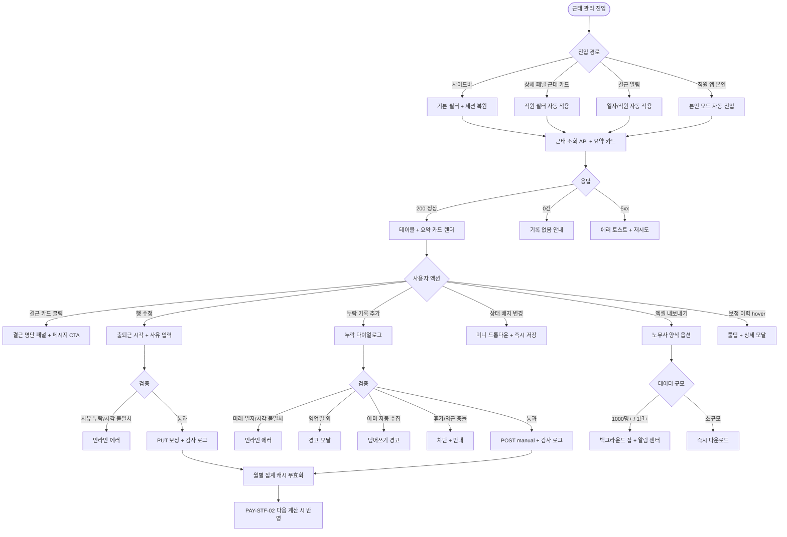
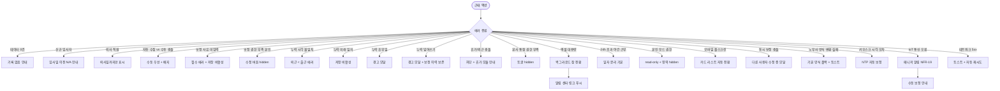

# SCR-063 직원 근태 관리 페이지

## 1. 화면 메타 정보

이 문서는 직원 근태 관리 페이지에 대한 자기완결형 요구사항 정의서입니다. 다른 문서를 함께 보지 않아도 이 한 장만으로 근태 조회·보정·집계·연동에 들어가는 모든 영역, 모든 검증, 모든 권한, 모든 예외 처리, 그리고 이 화면을 지탱하는 키오스크·IoT 자동 수집·급여 연동·노무 자료 정책까지 전부 이해하고 구현할 수 있도록 작성합니다.

| 항목 | 값 |
|---|---|
| 작성일 | 2026-05-22 |
| 버전 | v1.0 |
| 상태 | 최신 통합본 반영 (정합화 완료) |
| 도메인 | D07 직원관리 |
| 화면 ID | SCR-063 |
| 화면명 | 직원 근태 관리 |
| 화면 유형 | 조회/편집 화면 |
| 라우트 (URL) | `/staff/attendance` |
| 플랫폼 | 데스크톱(기본), 태블릿, 모바일(카드 리스트 풀스크린) |
| 우선순위 | P0 (출시 필수) |
| 기능코드 | PAY-STF-01 (직원 근태 관리) |
| 계약코드 | PAY-STF-01 |
| 계약 상태 | 계약 범위 본기능 |
| 부모 기능 prefix | PAY-STF |
| Lv1 코드 | PAY-STF-01 |
| Lv2 / Lv3 세분화 | PAY-STF-01-01 ~ PAY-STF-01-10 (조회 기간·직원 필터·요약 카드·근태 목록·수동 보정·누락 추가·월별 집계·엑셀·본인 모드·본사 통합) |
| 연계 화면 | SCR-060 직원목록, SCR-064 급여관리, SCR-082 키오스크, SCR-083 IoT 출입, SCR-097 감사로그, NFR-19 알림센터 |
| 호출 다이얼로그 | 누락 기록 추가 미니 다이얼로그 (내부 모달, 별도 DLG ID 미부여) |

## 2. 화면 개요와 목적

직원 근태 관리 페이지는 직원별 출퇴근 기록을 조회하고 지각·결근·초과근무 현황을 파악하는 화면입니다. 월별·직원별로 근무 시간을 집계해 급여 산정의 기초 데이터로 활용하며, 관리자가 출퇴근 기록을 수동으로 보정하거나 누락된 기록을 추가할 수 있습니다. 모든 보정 이력은 감사 로그에 기록되어 사후 추적이 가능합니다. 직원 본인은 자신의 근태만 조회할 수 있고 수정·추가는 불가합니다.

이 화면이 다루는 운영 흐름은 다양합니다. 매니저는 월말에 직원별 근태를 정리해 급여 자동 연동(PAY-STF-02)에 반영하고, 키오스크 누락(직원 카드 분실 등)이 발생하면 누락 기록 추가로 출근을 인정합니다. 센터장은 회의·외근 같은 정당 사유로 인한 지각을 출근 시각 보정으로 정상 처리하며, 보정 사유는 필수 기록됩니다. 결근이 발생한 날 매니저는 결근 카드를 클릭해 결근 직원 명단을 확인하고 메시지를 발송하며, 휴가·외근 일자는 별도 모듈에서 등록되어 출근일 카운트에서 자동 제외됩니다. 본사 슈퍼관리자는 통합 모드에서 지점별 평균 출근율을 비교해 본사 차원의 인력 운영을 진단합니다. 트레이너 본인은 모바일 앱에서 본인 출근율과 지각 횟수를 확인하며, 잘못된 기록은 매니저에게 메시지로 요청합니다.

월말 노무사 제출 자료는 엑셀 내보내기로 다운로드하며, 노무사 양식 옵션을 켜면 월별·직원별·근무시간·휴가·결근 컬럼이 자동 매핑됩니다. 1,000명 초과 데이터는 백그라운드 잡으로 전환되어 알림 센터로 결과가 전달됩니다.

따라서 이 화면은 단순한 출퇴근 기록 조회가 아니라, 키오스크·IoT 자동 수집과 수동 보정의 우선순위, 급여 자동 연동, 노무 자료 산출, 본사 통합 비교까지 모두 다루는 운영 화면입니다.

## 3. 진입 경로와 인접 화면

이 화면에 진입하는 경로는 다음과 같습니다.

첫 번째 경로는 사이드바입니다. 좌측 사이드바의 "직원 관리 > 근태 관리" 항목을 클릭하면 `/staff/attendance`로 진입합니다. 기본값은 당월·전체 직원이며, 직전 사용 상태(필터·기간)는 세션 스토리지에 5분 TTL로 저장되어 자동 복원됩니다.

두 번째 경로는 직원 상세 패널의 근태 요약 카드 클릭입니다. SCR-060 상세 패널의 근태 요약 카드를 누르면 해당 직원이 필터로 자동 적용된 상태로 이 화면에 진입합니다.

세 번째 경로는 알림 센터(NFR-19)의 결근 알림 클릭입니다. 결근 자동 분류 배치(매일 24:00)가 결근을 감지하면 매니저에게 알림이 발송되고, 알림을 누르면 해당 일자·직원이 필터로 자동 적용된 상태로 진입합니다.

네 번째 경로는 직원 앱·웹의 본인 근태 메뉴입니다. 직원 본인이 자기 출근율을 확인할 때 이 화면이 본인 모드로 진입합니다. 본인 모드에서는 보정·추가 영역이 hidden되고 본인 데이터만 표시됩니다.

이 화면에서 빠져나가는 인접 화면으로는, 결근 카드에서 메시지 발송으로 가는 SCR-071, 급여 자동 연동의 결과를 확인하는 급여 관리(SCR-064), 자동 수집 원천인 키오스크(SCR-082)와 IoT 출입(SCR-083), 그리고 모든 보정·누락 추가 이벤트가 기록되는 감사 로그(SCR-097)가 있습니다.

## 4. 레이아웃과 UI 구성

화면은 위에서 아래로 헤더 → 필터 바 → 요약 카드 → 근태 목록 테이블 → 월별 집계 요약 순으로 배치되는 세로형 레이아웃입니다. 데스크톱·태블릿에서는 본문이 가로 100%로 펼쳐지고, 모바일에서는 테이블이 카드 리스트로 자동 전환됩니다.

가장 위에는 페이지 헤더가 있습니다. 좌측에는 "근태 관리"라는 페이지 타이틀과 함께 현재 조회 지점(또는 "전체 지점(통합)") 배지가 표시되고, 우측 끝에는 [엑셀 내보내기] 버튼과 [누락 기록 추가] 버튼이 일렬로 놓입니다. 두 버튼은 매니저+ 권한자에게만 노출됩니다.

헤더 바로 아래에는 현재 지점의 직원 지각 허용 시간을 나타내는 정책 배지가 읽기 전용으로 표시됩니다. 기본값은 10분이며, 정규 출근 시각 + 10분까지는 정상, 10분 초과 출근부터 지각으로 분류합니다. 이 값은 D09 SCR-086 출석 관리 설정 > 직원 근태 기준 설정에서 센터장(owner)이 변경할 수 있습니다.

정책 배지 아래에는 조회 기간 선택과 필터 바가 있습니다. 조회 기간은 월 단위 선택(전월·당월·다음월 이동 화살표와 직접 월 선택 드롭다운) 또는 날짜 범위 직접 입력 토글로 전환됩니다. 기본값은 당월입니다. 필터 바에는 직원 필터(단일 직원 또는 전체 직원 선택), 직무 보조 필터(트레이너/FC/매니저/스태프 등 멀티 선택), 그리고 본사 통합 모드에서만 노출되는 소속 지점 필터가 배치됩니다.

필터 바 아래에는 요약 지표 카드 5개가 가로로 배치됩니다. 첫 번째 카드는 "정상 출근 일수"(지각·결근·조퇴 제외), 두 번째는 "지각 횟수", 세 번째는 "결근 횟수", 네 번째는 "총 근무 시간"(합계), 다섯 번째는 "평균 출근율"((정상 + 지각) / 영업일 %)입니다. 본사 통합 모드에서는 카드 카운트가 전 지점 합산이 되고, 카드 아래 작은 글씨로 "전 지점 합산"이 부제로 붙습니다. 결근 카드를 클릭하면 해당 일자의 결근 직원 명단이 별도 패널로 펼쳐지며, [메시지 발송] CTA가 함께 노출되어 SCR-071로 진입할 수 있습니다.

요약 카드 아래에는 근태 목록 테이블이 있습니다. 컬럼은 좌측부터 날짜(YYYY-MM-DD + 요일), 직원명, 출근 시각(HH:MM), 퇴근 시각(HH:MM), 근무 시간(자동 계산), 상태(정상·지각·결근·조퇴·외근·휴가 6종 배지), 출처(키오스크·IoT·수동 보정·누락 추가 4종 배지), 보정 이력(보정 횟수 + hover 시 상세) 순서로 배치됩니다. 본사 통합 모드에서는 소속 지점 컬럼이 추가됩니다. 상태 배지는 정상=success, 지각=warning, 결근=danger, 조퇴=warning, 외근=info, 휴가=neutral 톤으로 분기됩니다. 출처 배지는 키오스크/IoT는 자동 톤, 수동 보정/누락 추가는 강조 톤으로 구분됩니다. 보정 이력 컬럼은 매니저+ 권한자에게만 노출되며, hover 시 작성자·일시·사유가 툴팁으로 표시됩니다.

각 행 우측 끝에는 [수정] 버튼이 있어, 매니저+가 출퇴근 시각을 직접 보정할 수 있습니다. 수정 모드에서는 출근/퇴근 시각 입력 필드와 보정 사유(필수) textarea가 활성화되며, 저장 시 보정 이력이 자동 기록됩니다.

테이블 아래에는 월별 집계 요약 뷰가 있습니다. 직원별 월 총 근무 시간과 출근율, 지각·결근 횟수가 카드 또는 그리드 형태로 표시되어, 운영자가 직원 간 비교를 한눈에 할 수 있습니다. 본사 통합 모드에서는 지점별 평균이 추가로 표시됩니다.

페이지 가장 아래에는 페이지네이션(테이블이 한 페이지를 넘는 경우만 노출)이 배치됩니다.

[누락 기록 추가] 버튼을 누르면 별도 다이얼로그가 호출됩니다. 다이얼로그 안에는 일자 선택(과거·당일 가능, 미래 차단), 출근 시각·퇴근 시각, 처리 사유 입력(필수), 직원 선택(단일 또는 다중) 필드가 있습니다. 검증을 통과하면 저장되어 근태 목록에 즉시 반영되며, 출처 배지에는 "누락 추가"가 표시됩니다.

## 5. 자동 수집과 수동 보정의 우선순위

근태 데이터는 두 가지 경로로 수집됩니다. 첫째는 자동 수집으로, 키오스크(SCR-082)에서 직원 카드 태그 시 또는 IoT 출입(SCR-083)에서 출입 이벤트가 발생할 때마다 출근/퇴근 시각이 자동 INSERT됩니다. 둘째는 수동 보정/추가로, 매니저+가 누락된 기록을 추가하거나 잘못된 시각을 보정하는 경로입니다.

수동 보정 우선 정책이 적용됩니다. 자동 수집된 데이터와 수동 보정 데이터가 같은 일자에 충돌하면 수동 보정이 우선 적용되며, 출처 배지에 "수동 보정됨" 표시가 자동으로 붙습니다. 이는 운영자가 정당 사유로 보정한 결과가 자동 수집 데이터에 덮어쓰이지 않도록 보호하기 위한 정책입니다.

이미 자동 수집된 일자에 누락 기록을 추가하려고 하면 경고 모달 "이미 기록이 있습니다, 덮어쓰시겠습니까?"가 호출되어 운영자의 명시적 확인을 요구합니다. 확인 시 기존 자동 수집 데이터가 보정 이력에 보존된 채 수동 데이터로 덮어쓰여지며, 보정 이력 hover 시 변경 전후 값이 함께 표시됩니다.

키오스크 시각 동기화 오차는 NTP로 자동 보정되어, 시각 오차로 인한 잘못된 지각 분류가 발생하지 않습니다. IoT 통신 오류로 출입 이벤트가 누락된 경우 매니저에게 알림이 발송되어, 수동 보정을 통해 정상화할 수 있습니다.

본 시스템 v1은 출근 시각·퇴근 시각 한 쌍의 시각 필드 INSERT 모델로 동작하며, "출근/퇴근/외출/복귀" 같은 4종 트랜잭션 타입을 별도 모델로 두지 않습니다. 외근 일자는 별도 트랜잭션 타입이 아니라 상태 배지 6종 중 "외근"으로 표시되며, 휴가·외근의 등록·수정·삭제는 본 화면이 아닌 휴가·외근 모듈에서 처리됩니다. 휴가·외근 일자에 출근 기록을 누락 추가하려고 하면 차단되어 휴가 모듈로 안내됩니다. v2 이후 외출/복귀 트랜잭션 타입 분리 도입은 별도 정책 결정으로 진행됩니다.

## 6. 버튼·아이콘·링크 액션 전체 정의

페이지 헤더의 [엑셀 내보내기] 버튼은 현재 필터·기간 조건의 근태 데이터를 엑셀 파일로 다운로드합니다. 클릭 시 노무사 양식 옵션 토글이 미니 모달로 열리며, 노무사 양식을 선택하면 월별·직원별·근무시간·휴가·결근 컬럼이 자동 매핑되어 다운로드됩니다. 파일명 규칙은 `yyyymm_지점_근태.xlsx`(통합 모드는 `yyyymm_전체_근태.xlsx`)입니다. 데이터가 1,000명을 초과하거나 1년 이상 기간이면 백그라운드 잡으로 전환되어 즉시 "다운로드 준비 중" 토스트가 표시되고 완료 시 알림 센터로 다운로드 링크가 푸시됩니다. 권한이 없는 계정에서는 버튼이 hidden입니다.

[누락 기록 추가] 버튼은 누락 추가 다이얼로그를 호출합니다. 매니저+ 권한자에게만 보입니다.

조회 기간의 좌우 화살표는 한 달씩 이전·다음 달로 이동하며, 중앙의 월 드롭다운으로 직접 선택할 수 있습니다. 날짜 범위 토글을 켜면 시작일·종료일을 직접 선택하는 캘린더 입력이 활성화됩니다.

직원 필터 드롭다운은 검색 입력으로 빠르게 찾을 수 있으며, 단일 직원 선택 또는 전체 선택이 가능합니다. 직무 보조 필터는 멀티 선택이며, 본사 통합 모드의 소속 지점 필터는 본사 권한자에게만 노출됩니다.

요약 카드는 클릭 가능합니다. 결근 카드 클릭은 결근 직원 명단 패널을 펼치고, 다른 카드 클릭은 그 상태에 해당하는 행만 테이블에 필터링 표시합니다. 다시 누르면 필터가 해제됩니다.

근태 목록 테이블의 행 우측 [수정] 버튼은 해당 행을 수정 모드로 전환합니다. 출근/퇴근 시각 입력과 사유 textarea가 활성화되며, [저장] / [취소] 버튼이 행 안에 표시됩니다. 사유 미입력 시 "보정 사유는 필수입니다" 인라인 에러가 표시되고 저장이 차단됩니다.

보정 이력 컬럼은 hover 시 툴팁이 노출되며, 클릭 시 상세 이력 모달이 열려 작성자·일시·변경 전후 값·사유가 시간순으로 표시됩니다.

상태 배지를 직접 클릭하면 상태 변경 미니 드롭다운이 열려, 정상↔지각, 정상↔외근, 정상↔휴가 같은 변경이 가능합니다. 결근→정상 변경은 출근/퇴근 시각 입력이 필요하므로 [수정] 버튼을 사용해야 합니다.

월별 집계 요약 카드의 직원명을 클릭하면 SCR-060 직원 상세로 이동하며, 출근율 카드를 클릭하면 해당 직원의 상세 근태가 필터로 적용된 상태로 테이블이 갱신됩니다.

본인 모드에서는 [엑셀 내보내기]·[누락 기록 추가]·[수정] 버튼이 모두 hidden되며, 본인 데이터만 read-only로 조회됩니다.

모든 버튼은 클릭 후 응답이 돌아오기 전까지 비활성화되어 중복 요청이 차단됩니다.

## 7. 호출되는 모달 동작

### 7-1. 누락 기록 추가 다이얼로그 (내부 모달)

[누락 기록 추가] 버튼 클릭 시 호출됩니다. 모달 상단에는 "근태 누락 기록 추가" 제목이 표시되고, 본문에는 일자 선택(과거·당일만 가능), 출근 시각 입력(HH:MM), 퇴근 시각 입력(HH:MM), 직원 선택(단일 또는 다중 멀티), 처리 사유 입력(필수, 사전 정의 사유 드롭다운 + 직접 입력) 필드가 배치됩니다. 사전 정의 사유는 "키오스크 오류", "직원 카드 분실", "본사 정책 예외", "회원 요청", "기타"입니다.

검증은 다음과 같이 동작합니다. 미래 일자 선택 시 "미래 날짜는 입력할 수 없습니다" 인라인 에러, 퇴근 시각 < 출근 시각인 경우 "퇴근 시각이 출근 시각보다 빠릅니다" 인라인 에러, 사유 미입력 시 "처리 사유는 필수입니다" 인라인 에러가 표시됩니다. 영업일이 아닌 휴무일에 추가하려고 하면 경고 모달 "영업일이 아닙니다, 진행하시겠습니까?"가 호출됩니다. 이미 자동 수집된 일자에 추가하려고 하면 "이미 기록이 있습니다, 덮어쓰시겠습니까?" 경고 모달이 호출됩니다. 휴가·외근 일자에 출근 기록을 추가하려고 하면 "휴가/외근 일자입니다. 휴가 모듈에서 처리하세요" 안내가 표시되어 진행이 차단됩니다.

[저장] 클릭 시 백엔드 검증을 통과해 근태 row가 INSERT되고, 출처 배지가 "누락 추가"로 설정되며, 감사 로그에 기록됩니다. [취소] 클릭 시 모달이 닫히고 아무 처리도 일어나지 않습니다.

### 7-2. 보정 이력 상세 모달

보정 이력 컬럼을 클릭하면 호출됩니다. 모달 본문에는 해당 일자·직원의 모든 보정 이력이 시간순으로 표시되며, 각 이력은 작성자·일시·변경 전 값·변경 후 값·사유로 구성됩니다. 매니저+ 권한자에게만 호출 가능합니다.

### 7-3. 영업일 외 / 덮어쓰기 / 휴가 충돌 경고 모달

누락 기록 추가 시 영업일 외 일자, 이미 자동 수집된 일자, 휴가·외근 일자에 충돌이 감지되면 경고 모달이 호출됩니다. [진행] / [취소] 버튼이 있고, 진행 시 명시적 확인 로그가 감사 로그에 기록됩니다.

## 8. 토스트와 확인 팝업과 알럿

성공 토스트는 우측 상단에 녹색 계열로 5초 동안 표시됩니다. "근태 기록이 보정되었어요", "누락 기록이 추가되었어요", "엑셀 다운로드가 시작되었어요"가 대표적입니다.

실패 토스트는 우측 상단에 빨강 계열로 표시됩니다. "보정 사유는 필수입니다", "퇴근 시각이 출근 시각보다 빠릅니다", "다른 사용자가 수정 중입니다"가 대표적입니다.

확인 팝업은 영업일 외, 덮어쓰기, 휴가 충돌, 누락 미래 일자 같은 경우 별도 모달로 호출됩니다.

알럿은 권한 없는 계정이 직접 URL로 접근했을 때 표시됩니다. 본인 모드 자동 진입(직원 본인) 또는 대시보드 자동 이동(readonly)이 일어납니다.

대용량 다운로드 알림은 1,000명 초과 또는 1년 이상 기간 다운로드 시 "다운로드 준비 중" 토스트와 함께 백그라운드 잡으로 전환되고, 완료 시 알림 센터로 다운로드 링크가 푸시됩니다.

## 9. 데이터 흐름과 외부 연동

화면 진입 시점에는 근태 목록 조회 API(`GET /api/attendance/staff`)가 호출됩니다. 요청에는 조회 기간(월 또는 날짜 범위), 직원 필터, 직무 필터, 본사 통합 모드 여부가 쿼리 파라미터로 들어가며, 응답으로는 근태 row 배열, 총 건수, 그리고 5개 요약 카드 카운트와 월별 집계 요약 데이터가 함께 내려옵니다.

키오스크 자동 수집은 SCR-082에서 직원 카드 태그 시 트리거되며, `POST /api/attendance/auto` 형태로 출근/퇴근 시각이 INSERT됩니다. IoT 출입 자동 수집은 SCR-083에서 출입 이벤트가 발생할 때 같은 엔드포인트로 전송됩니다. 두 경로는 출처 배지로 구분됩니다.

지각·결근·조퇴 자동 분류 배치는 다음과 같이 동작합니다. 지각은 출근 시각 > 정규 출근 시각 + 지각 허용 시간(기본 10분, D09 SCR-086에서 센터장이 조정 가능)일 때 자동 분류되고, 조퇴는 퇴근 시각 < 정규 퇴근 시각일 때 자동 분류되며, 결근은 매일 24:00 배치가 영업일 + 출근 기록 없음 + 휴가/외근 미등록인 직원을 자동 분류합니다.

24시간 초과 야간 근무는 정책에 따라 다음 날 일자로 분리되거나 합산됩니다. 기본 정책은 분리이며, 정책 토글로 합산 모드로 전환할 수 있습니다.

휴가·외근 자동 제외 정책은 휴가 모듈에서 등록된 휴가·외근 일자를 출근일 카운트에서 자동 제외하며, 출근율 분모에 영향이 없도록 처리합니다.

수동 보정 API는 `PUT /api/attendance/:id`이며, 보정 사유가 함께 전송됩니다. 누락 기록 추가는 `POST /api/attendance/manual`로 처리됩니다. 두 경우 모두 감사 로그(SCR-097)에 비동기 INSERT되며, 기록 필드는 `actor_id`, `staff_id`, `date`, `before`, `after`, `reason`, `timestamp`입니다.

PAY-STF-02 급여 자동 연동은 월말 집계 시점에 트리거됩니다. 시급제 직원의 근태 총 근무 시간 × 시급으로 기본급이 자동 산출되고, 건별 직원의 진행 수업 건수 × 단가로 수수료가 자동 산출됩니다. 지각·결근 자동 공제는 근태 페널티 정책 토글에 따라 자동으로 공제 항목에 추가됩니다.

월말 집계 캐시는 매월 1일 04:00 배치가 직원별 월 합산을 갱신하며, 5분 TTL 실시간 캐시도 함께 운영됩니다.

엑셀 내보내기는 `GET /api/attendance/export`로 비동기 요청됩니다. 1,000명 초과 또는 1년 이상 기간이면 백그라운드 잡으로 전환되어 알림 센터(NFR-19)로 결과 링크가 푸시됩니다. 노무사 양식 옵션을 켜면 컬럼이 노무사 제출 양식으로 자동 매핑됩니다.

신규 입사자는 입사일 이전 영업일이 분모에서 자동 제외되어 출근율이 N/A 또는 입사일 기준 영업일로 계산됩니다. 퇴사 직원은 퇴사 확정일까지 데이터가 보존·조회되며, 이후 일자는 데이터 없음으로 표시됩니다. 5년 후에는 익명화 또는 아카이브 처리됩니다.

본인 출근율이 90% 미만(테넌트 정책)이면 직원 본인에게 NFR-19 알림이 발송되어 자기 관리를 유도합니다.

화면에서 호출하는 주요 API는 다음과 같습니다. 근태 조회 `GET /api/attendance/staff`, 보정 `PUT /api/attendance/:id`, 누락 추가 `POST /api/attendance/manual`, 엑셀 `GET /api/attendance/export`, 월별 집계 `GET /api/attendance/summary`, 보정 이력 `GET /api/attendance/audit/:id`.

## 10. 화면 상태와 예외 처리

이 화면은 다음 상태들을 가집니다.

로딩 중 상태는 데이터를 불러오는 동안 테이블·요약 카드·집계 뷰에 스켈레톤이 표시됩니다.

정상 목록 상태는 근태 데이터가 한 건 이상 표시되는 일반 상태입니다.

기록 없음 상태는 선택 기간·직원에 데이터가 없을 때 "기록이 없습니다" 안내가 표시됩니다. 신규 입사자의 경우 "입사일({날짜}) 이전 기록은 없습니다" 안내가 표시됩니다.

수정 모드 상태는 특정 행의 [수정] 버튼을 누른 상태입니다. 출근/퇴근 시각 입력과 보정 사유 textarea가 활성화됩니다.

본인 모드 상태는 직원 본인 진입 시 자동 활성화됩니다. 보정·추가 영역이 hidden되고 본인 데이터만 read-only로 조회됩니다.

보정 사유 미입력 상태는 수정 모드에서 사유가 비어 있을 때 인라인 에러가 표시되고 [저장] 버튼이 비활성화됩니다.

본사 통합 모드 상태는 본사 권한자에 한해 활성화되며, 소속 지점 컬럼·소속 지점 필터·전 지점 합산 카드가 노출됩니다.

신규 입사자 상태는 입사일 이전 영업일이 자동 제외되어 출근율 N/A로 표시됩니다.

퇴사 직원 조회 상태는 퇴사 확정일까지의 데이터만 표시되며, 이후 일자는 회색 톤으로 "데이터 없음" 표시됩니다.

모바일 풀스크린 상태는 테이블이 카드 리스트로 자동 전환되어 한 행씩 펼쳐 보입니다.

다운로드 준비 중 상태는 백그라운드 잡 처리 중인 상태로, 진행 토스트가 표시되고 완료 시 알림 센터로 링크가 푸시됩니다.

자동 수집 vs 수동 충돌 상태는 같은 일자에 두 데이터가 모두 있을 때 수동이 우선 적용되고 "수동 보정됨" 배지가 표시됩니다.

예외 케이스별 처리는 다음과 같습니다. 데이터 0건 시 빈 상태 안내, 신규 입사자는 입사일 안내, 퇴사 직원은 퇴사일까지만 표시, 자동 수집 + 수동 충돌은 수동 우선 + 배지 표시, 보정 사유 미입력은 저장 비활성, 보정 권한 부족(본인·readonly)은 수정 버튼 hidden, 누락 시각 불일치(퇴근 < 출근)는 저장 비활성, 누락 미래 일자는 저장 비활성, 누락 휴무일은 경고 모달, 누락 덮어쓰기 시도는 경고 모달, 휴가/외근 일자 보정 시도는 차단 + 휴가 모듈 안내, 본사 통합 권한 부족은 토글 hidden, 엑셀 대용량은 백그라운드 잡, 24시간 초과 야간 근무는 일자 분리(기본), 본인 모드는 read-only, 모바일은 카드 리스트, 동시 보정 충돌은 "다른 사용자가 수정 중" 모달, 노무사 양식 변환 실패는 기본 양식 다운로드 폴백, 키오스크 시각 오차는 NTP 자동 보정, IoT 통신 오류 누락은 매니저 알림이 각각 처리됩니다.

## 11. 권한별 처리

본사 슈퍼관리자(superAdmin)·본사 최고관리자(primary)는 전 지점 직원 근태를 통합 조회·비교할 수 있으며, 모든 보정·추가·엑셀 내보내기가 가능합니다.

센터장(owner)·매니저(manager)는 소속 지점 직원 전체 근태를 조회하고 보정·누락 추가·엑셀 내보내기가 가능합니다.

직원 본인은 본인 근태만 read-only로 조회할 수 있으며 수정·추가는 불가합니다. 잘못된 기록은 매니저에게 메시지로 요청해야 합니다.

FC·트레이너·스태프·프런트는 본인 근태만 조회 가능하며, 본인 외 동료 근태에는 RLS로 차단되어 접근할 수 없습니다.

readonly는 이 화면 자체에 접근할 수 없습니다.

권한이 부족해 액션이 차단된 경우의 사용자 경험은 단계별로 일관됩니다. 본인 모드에서는 보정·추가·엑셀 버튼이 모두 hidden되며, 백엔드 응답이 403이 되어 토스트로 안내됩니다. 모든 권한 차단 이벤트는 감사 로그에 기록됩니다.

## 12. 메인 흐름

근태 관리의 핵심 동작 흐름을 다이어그램으로 표현합니다.

## 13. 에러와 예외 흐름

에러와 예외 상황에서의 분기를 별도 흐름으로 표현합니다.

## 14. 핵심 디자인 요청사항

상태 배지의 색상 분기가 가장 중요합니다. 정상=success(녹색), 지각=warning(주황), 결근=danger(빨강), 조퇴=warning(주황), 외근=info(파랑), 휴가=neutral(회색) 톤으로 강하게 구분되어 멀리서 봐도 일별 출근 상태를 알 수 있어야 합니다.

출처 배지는 자동 수집(키오스크/IoT)과 수동 처리(보정/누락 추가)를 색상으로 구분합니다. 자동은 회색 또는 옅은 톤, 수동은 강조 톤으로 표시되어 어떤 데이터가 사람이 손댄 데이터인지가 한눈에 보입니다. "수동 보정됨" 라벨은 별도 작은 배지로 명시적으로 표시됩니다.

요약 카드 5개는 동일 그리드로 배치되며, 본사 통합 모드에서는 카드 하단에 "전 지점 합산" 부제가 명확히 표시됩니다. 결근 카드는 살짝 강조된 색상(빨강 톤)으로 표시되어, 운영자가 결근 발생 여부를 즉시 인지할 수 있게 합니다.

근태 목록 테이블의 행 hover 시 행 전체가 옅은 강조 톤으로 변하며, 우측 [수정] 버튼이 노출되어 어디를 누르면 보정이 가능한지 시각적으로 알려줍니다.

수정 모드에서는 행의 배경이 옅은 노랑 톤으로 바뀌어 편집 중임이 분명히 드러납니다. 보정 사유 필드는 다른 입력 필드보다 큰 텍스트 영역으로 표시되어, 사유 입력이 형식적이 아니라 실제 기록임을 운영자가 인지하도록 합니다.

보정 이력 컬럼의 카운트 배지는 작은 숫자 배지로 표시되며, hover 시 짙은 회색 톤 툴팁으로 작성자·일시·사유가 표시됩니다.

월별 집계 요약은 직원별 카드 그리드로 표시되며, 출근율이 90% 미만인 직원은 카드 테두리가 노랑 톤으로 강조되어 운영자의 주의를 끕니다.

모바일에서는 카드 리스트가 한 행 = 한 카드로 표시되며, 카드 헤더에 일자·요일·상태 배지가 큰 폰트로, 본문에 출퇴근 시각과 근무 시간이 작은 글씨로 표시됩니다.

다운로드 진행 중에는 헤더의 [엑셀 내보내기] 버튼이 진행 스피너로 전환되어, 다운로드가 진행 중임을 시각적으로 알려줍니다.

## 15. 운영 정책 (이 화면에 연결된 부분)

이 화면은 단순한 근태 조회가 아니라 자동 수집·수동 보정·급여 연동·노무 자료까지 모두 다루는 운영 정책의 결합점입니다.

자동 수집 우선 정책에 따라 키오스크(SCR-082) 또는 IoT 출입(SCR-083)에서 자동 수집된 데이터가 기본 입력 원천입니다. 수동 보정은 자동 수집 데이터의 보정 또는 누락 보완 용도이며, 보정 시 자동 수집 원본은 보정 이력에 보존됩니다.

수동 보정 권한은 매니저+에게만 허용됩니다. 직원 본인은 본인 근태를 조회만 할 수 있고 수정·추가는 불가합니다. 보정 사유는 필수 입력이며, 감사 로그에 actor_id·staff_id·date·before·after·reason·timestamp가 모두 기록되어 사후 추적이 가능합니다. 보정 이력 hover는 매니저+에게만 노출됩니다.

출근율 계산 공식은 (정상 출근 + 지각) ÷ 총 영업일입니다. 휴가·외근 일자는 출근일 분모에서 자동 제외되며, 신규 입사자는 입사일 기준 영업일만 분모에 포함됩니다. 본인 출근율이 90% 미만이면 직원 본인에게 NFR-19 알림이 발송됩니다.

상태 6종 자동 분류 정책은 다음과 같습니다. 지각은 출근 시각 > 정규 출근 시각 + 지각 허용 시간(기본 10분, D09 SCR-086에서 조정), 조퇴는 퇴근 시각 < 정규 퇴근 시각, 결근은 영업일 + 출근 기록 없음 + 휴가/외근 미등록(매일 24:00 배치). 외근·휴가는 별도 모듈에서 등록되어 자동으로 출근일 카운트에서 제외됩니다.

24시간 초과 야간 근무 정책은 기본적으로 다음 날 일자로 분리됩니다. 정책 토글로 합산 모드로 전환 가능하며, 합산 시 한 행에 24시간을 초과하는 근무 시간이 표시됩니다.

PAY-STF-02 급여 자동 연동 정책은 월말 집계 시점에 트리거됩니다. 시급제 직원은 총 근무 시간 × 시급으로 기본급이 자동 산출되고, 건별 직원은 진행 수업 건수 × 단가로 수수료가 자동 산출됩니다. 지각·결근 자동 공제는 근태 페널티 정책 토글에 따라 자동으로 공제 항목에 추가됩니다.

본사 슈퍼관리자 통합 모드 정책은 전 지점 근태 합산과 지점별 비교를 매니저+ 권한자에게 제공합니다. 일반 지점 사용자는 본인 지점 데이터에만 접근 가능하며, 다른 지점 데이터는 RLS로 차단됩니다.

엑셀 내보내기 정책은 노무사 양식 옵션을 통해 노무사 제출 양식(월별·직원별·근무시간·휴가·결근)으로 자동 변환됩니다. 파일명 규칙은 `yyyymm_지점_근태.xlsx`(통합은 `yyyymm_전체_근태.xlsx`)이며, 1,000명 초과 또는 1년 이상 기간은 백그라운드 잡으로 전환되어 알림 센터로 결과가 푸시됩니다.

자동 수집 vs 수동 보정 충돌 시 수동 우선 정책이 적용됩니다. 자동 수집 원본은 보정 이력에 보존되며, 출처 배지에 "수동 보정됨" 표시가 자동으로 붙어 운영자가 충돌 이력을 즉시 인지할 수 있게 합니다.

키오스크 NTP 동기화 정책은 매시간 시각 자동 보정을 수행합니다. IoT 통신 오류 시 매니저+에게 NFR-19 알림이 발송되어 수동 보정으로 정상화하도록 안내합니다.

휴가·외근 자동 제외 정책은 별도 휴가 관리 모듈에서 처리됩니다. 근태 화면은 휴가·외근 상태를 표시만 하며, 등록·수정·삭제는 휴가 모듈에서 진행됩니다. 휴가·외근 일자에 누락 출근 기록을 추가하려고 하면 차단되며, 휴가 모듈에서 처리하라는 안내가 표시됩니다.

신규 입사자 데이터 정책은 입사일 이전 영업일을 분모에서 자동 제외해 부당한 출근율 계산이 발생하지 않도록 합니다. 입사일 = 첫 출근일 기준이며, 이전 일자에는 데이터가 없는 것으로 처리됩니다.

퇴사 직원 데이터 정책은 퇴사 확정일까지 데이터가 보존·조회 가능하도록 합니다. 이후 일자는 데이터 없음으로 표시되며, 5년 후 익명화 또는 아카이브 처리됩니다.

감사 로그는 모든 보정·누락 추가·상태 변경 이벤트를 SCR-097에 비동기로 기록하며, 5초 안에 조회 가능합니다. 부정 보정 의심 시 운영자가 보정 이력을 추적해 부정 여부를 판단할 수 있습니다.

세션 상태(필터·기간·검색어)는 페이지 이탈 시 세션 스토리지에 5분 TTL로 저장되어, 같은 운영 흐름을 복귀 후에도 이어서 진행할 수 있습니다.

이상의 모든 정책은 이 화면을 구현하고 운영하는 사람이 별도 문서 없이 이 한 장만 보면 이해할 수 있도록 풀어 적었습니다. 정책이 바뀌면 이 문서가 함께 갱신되어야 하며, 코드 변경과 정책 변경은 항상 짝지어 진행됩니다.
