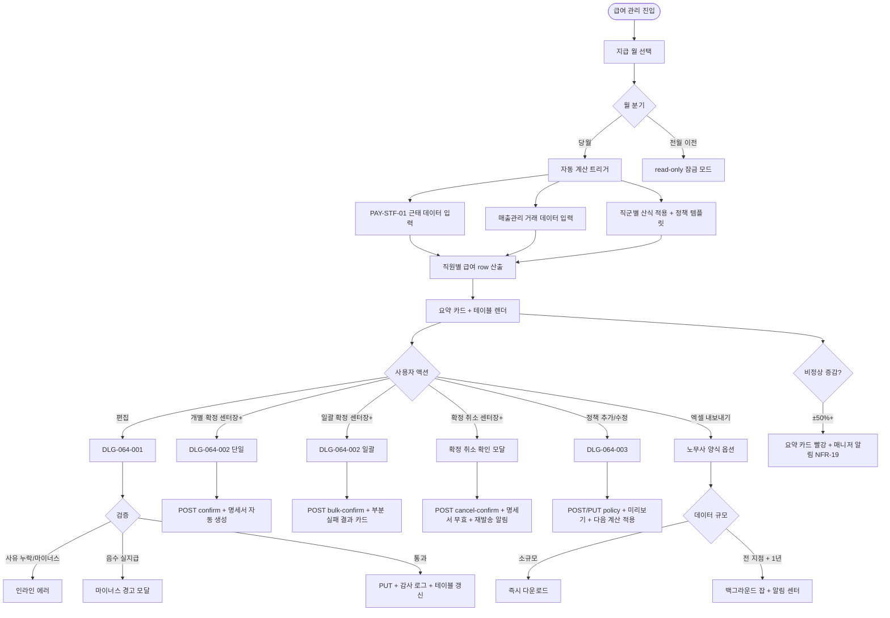

# SCR-064 급여 관리 페이지

## 1. 화면 메타 정보

이 문서는 급여 관리 페이지에 대한 자기완결형 요구사항 정의서입니다. 다른 문서를 함께 보지 않아도 이 한 장만으로 급여 계산·편집·확정·정책 관리에 들어가는 모든 영역, 모든 모달, 모든 권한, 모든 예외 처리, 그리고 이 화면을 지탱하는 산식·근태 연동·확정 절차·노무 외부 처리 정책까지 전부 이해하고 구현할 수 있도록 작성합니다.

| 항목 | 값 |
|---|---|
| 작성일 | 2026-05-22 |
| 버전 | v1.0 |
| 상태 | 최신 통합본 반영 (정합화 완료) |
| 도메인 | D07 직원관리 |
| 화면 ID | SCR-064 |
| 화면명 | 급여 관리 |
| 화면 유형 | 허브 화면 (Hub Screen) |
| 라우트 (URL) | `/payroll` |
| 플랫폼 | 데스크톱(기본), 태블릿, 모바일(테이블 → 카드 리스트 자동 전환) |
| 우선순위 | P0 (출시 필수) |
| 기능코드 | PAY-STF-02 (급여 관리) |
| 계약코드 | PAY-STF-02, PAY-STF-04 |
| 계약 상태 | 계약 범위 본기능 |
| 부모 기능 prefix | PAY-STF |
| Lv1 코드 | PAY-STF-02 |
| Lv2 / Lv3 세분화 | PAY-STF-02-01 ~ PAY-STF-02-11 (지급 월 선택·요약 카드·근태 연동·직군별 산식·급여 테이블·수당공제 편집·개별 확정·일괄 확정·확정 확인·확정 취소·엑셀·본사 통합) |
| 연계 화면 | SCR-060 직원목록, SCR-063 직원근태관리, SCR-065 급여명세서, SCR-097 감사로그, NFR-19 알림센터 |
| 호출 다이얼로그 | DLG-064-001 급여상세편집, DLG-064-002 급여확정확인, DLG-064-003 급여정책추가 |

## 2. 화면 개요와 목적

급여 관리 페이지는 직원별 당월 급여를 계산하고 수당·공제 내역을 검토한 뒤 최종 급여를 확정하는 직원관리 도메인의 핵심 허브 화면입니다. 근태 데이터(PAY-STF-01)와 연동되어 기본급에 각종 수당이 자동 반영되며, 관리자가 항목을 수동으로 편집한 후 일괄 확정할 수 있습니다. 또한 우측 정책 패널에서 직급별·직군별 급여 정책 템플릿을 관리해 정산 계산식의 기준값을 유지합니다. 급여 편집은 매니저 이상이 가능하지만, 최종 확정은 센터장만 가능하다는 권한 분리가 엄격히 적용됩니다. 확정된 급여는 PAY-STF-03 급여 명세서(SCR-065)에서 조회·발송 가능해집니다.

이 화면이 다루는 운영 흐름은 매우 다양합니다. 매니저는 월말에 PAY-STF-01 근태 마감 후 급여 자동 계산 결과를 확인하고, 우수 직원에게 성과 수당을 추가하거나 지각·결근에 따른 공제를 점검합니다. 트레이너의 수업 수당은 진행 건수 × 단가로 자동 합산되고, FC의 매출 커미션은 신규 등록·재등록·상품추가·환불 차감을 모두 반영해 산출됩니다. GX 강사는 클래스당 고정수당 또는 시급에 출석 인원 보너스가 추가됩니다. 검토가 끝나면 센터장이 일괄 확정을 진행하고, DLG-064-002 확인을 거쳐 명세서가 자동 생성됩니다.

확정 후 오류가 발견되면 당월 내에는 [확정 취소]로 재편집이 가능합니다. 확정 취소 시 이미 발송된 명세서는 자동 무효 처리되고 직원에게 재발송 안내가 발송됩니다. 전월 이전 급여는 자동 잠금되어 read-only로만 조회됩니다. 본사 슈퍼관리자는 통합 모드에서 전 지점 인건비를 분석하며, 전월 대비 ±50% 이상 증감 시 요약 카드가 빨강으로 강조되어 비정상 변동을 사전에 포착합니다. 노무사 임금 정산 자료는 엑셀 내보내기로 다운로드하며, 노무사 양식 옵션이 컬럼을 자동 매핑합니다.

따라서 이 화면은 단순한 급여 표가 아니라, 직군별 산식·근태 연동·정책 템플릿·확정 절차·외부 노무 처리까지 모두 다루는 운영 허브로 동작해야 합니다.

## 3. 진입 경로와 인접 화면

이 화면에 진입하는 경로는 다음과 같습니다.

첫 번째 경로는 사이드바입니다. 좌측 사이드바의 "직원 관리 > 급여 관리" 항목을 클릭하면 `/payroll`로 진입합니다. 기본값은 당월·자기 지점이며, 직전 사용 상태(지급 월·필터)는 세션 스토리지에 5분 TTL로 저장되어 자동 복원됩니다.

두 번째 경로는 직원 상세 패널의 급여 카드 또는 직원 상세 헤더의 [급여 조회] 액션입니다. SCR-060 상세 패널에서 특정 직원의 급여로 곧장 이동하면 그 직원이 필터로 자동 적용된 상태로 진입합니다.

세 번째 경로는 알림 센터(NFR-19)의 비정상 증감 알림 클릭입니다. 전월 대비 ±50% 이상 증감 시 매니저에게 알림이 발송되고, 알림을 누르면 해당 월·직원이 필터로 자동 적용된 상태로 진입합니다.

네 번째 경로는 PAY-STF-01 근태 관리에서의 자동 안내입니다. 근태 마감이 완료된 직후 "급여 자동 계산을 시작하시겠습니까?" 안내가 표시되고, 확인을 누르면 이 화면으로 이동하면서 자동 계산이 트리거됩니다.

다섯 번째 경로는 PAY-STF-03 급여 명세서(SCR-065)에서의 미확정 안내입니다. SCR-065에서 미확정 월을 조회 시도하면 "급여 미확정" 안내와 함께 이 화면 진입 링크가 제공됩니다.

이 화면에서 빠져나가는 인접 화면으로는, 확정 후 자동 생성되는 명세서를 조회하는 SCR-065, 근태 데이터 보정이 필요할 때 가는 SCR-063, 직원 정보 수정이 필요할 때 가는 SCR-061, 그리고 모든 편집·확정·확정 취소 이벤트가 기록되는 감사 로그(SCR-097)가 있습니다. 임금 정산·세무 신고·4대 보험은 외부 노무사·세무사 시스템에서 별도 처리됩니다.

## 4. 레이아웃과 UI 구성

화면은 좌측 본문(급여 테이블 영역)과 우측 보조 패널(급여 정책 템플릿 영역)이 나란히 배치되는 2단 레이아웃을 기본으로 합니다. 데스크톱에서는 본문 70% + 정책 패널 30% 비율로 배치되고, 태블릿에서는 정책 패널이 하단으로 내려와 본문 100% + 하단 패널 구조가 되며, 모바일에서는 정책 패널이 하단 풀스크린 모달로 분리되고 본문 테이블이 카드 리스트로 자동 전환됩니다.

가장 위에는 페이지 헤더가 있습니다. 좌측에는 "급여 관리" 페이지 타이틀과 함께 현재 조회 지점(또는 "전체 지점(통합)") 배지가 표시되고, 우측에는 [일괄 확정] 버튼(센터장만)과 [엑셀 내보내기] 버튼이 일렬로 놓입니다. 헤더 좌측 끝에는 지급 월 선택 드롭다운이 있으며, 좌우 화살표로 전월·다음월 이동이 가능합니다. 기본값은 당월이며, 전월 이전을 선택하면 read-only 잠금 모드로 전환됩니다.

페이지 헤더 아래에는 요약 지표 카드 4개가 가로로 배치됩니다. 첫 번째 카드는 "전체 지급 예정 금액"(합계, 콤마 자동 포맷), 두 번째는 "확정 완료 인원", 세 번째는 "미확정 인원", 네 번째는 "이전 월 대비 증감"(±% 표시)입니다. 이전 월 대비 ±50% 이상 변동 시 네 번째 카드가 빨강 강조 톤으로 표시되며, 매니저에게 점검 안내 알림이 발송됩니다. 본사 통합 모드에서는 모든 카드가 전 지점 합산이 되고 카드 하단에 "전 지점 합산" 부제가 붙습니다.

요약 카드 아래에는 본문(급여 테이블) 영역이 펼쳐집니다. 테이블 컬럼은 좌측부터 직원명, 역할(직무 배지), 급여 형태(월급/시급/건별 배지), 기본급, 수당 합계(근태 연동 + 수동 편집 합산), 공제 합계(4대 보험 + 추가 공제), 수수료(트레이너 수업 건수 × 단가), 실지급액(자동 계산, 강조 표시), 확정 상태(미확정·확정 배지), 액션(편집·확정·확정 취소) 순서로 배치됩니다. 본사 통합 모드에서는 소속 지점 컬럼이 추가됩니다.

실지급액 계산 공식은 **실지급액 = 기본급 + 수당 합계 − 공제 합계 + 수수료**이며, 모든 입력 변경 시 실시간으로 재계산됩니다. 공제가 기본급 + 수당을 초과하면 실지급액이 마이너스가 되며, 경고 모달이 표시됩니다.

확정 상태 배지는 미확정=warning(주황), 확정=success(녹색) 톤으로 표시됩니다. 확정된 행은 편집 버튼이 비활성화되고 [확정 취소] 버튼이 노출됩니다(센터장+ 한정, 당월 한정). 전월 이전 월에서는 모든 행이 read-only이며, 자물쇠 아이콘이 행 좌측에 표시됩니다.

각 행 우측의 [편집] 버튼은 DLG-064-001을 호출해 수당·공제 항목을 수동 조정합니다. [확정] 버튼은 그 직원 하나에 대해 DLG-064-002를 호출합니다. [확정 취소] 버튼은 센터장+ 권한자에게만 보입니다.

우측 보조 패널은 급여 정책 템플릿 영역입니다. 패널 상단에는 "급여 정책" 제목과 함께 "매출 타입 / 수업 타입" 정책 분류 탭이 있고, 그 아래에 직군별 산식 탭(FC / PT / GX / 공통)이 한 단계 더 분기됩니다. 탭별로 그 분류·직군의 정책 목록이 카드 리스트로 표시되며, 각 카드에는 직급·기본급·수업단가·수업료(%)·매출커미션(%)·재등록 커미션(%)·환불 차감 규칙·타지점 수업 귀속 규칙·적용 범위가 요약 표시됩니다. 카드 우측에는 [수정] / [삭제] 액션 버튼이 있고, 패널 하단에는 [정책 추가] 버튼이 있어 DLG-064-003을 호출합니다.

직군별 산식 탭별로 직군 고유의 산식이 미리보기로 표시됩니다. FC 탭에는 "기본급 + 신규 등록 커미션 + 재등록 커미션 + 상품추가 커미션 − 환불 차감", PT 탭에는 "기본급 또는 시급 + 수업단가 + 수업매출 정률 + 타지점 수업 귀속 조정", GX 탭에는 "클래스당 고정수당 또는 시급 + 출석 인원 보너스 + 결강/대체수업 조정", 공통 탭에는 "지각·결근 공제, 4대 보험, 수기 수당/공제, 퇴사 일할 계산"이 표시됩니다.

테이블 아래에는 본사 통합 모드 전용 지점별 합산 카드 그리드가 추가로 표시됩니다. 지점별 총 지급액·확정 인원·증감률이 카드별로 비교되어, 본사 권한자가 인건비 분포를 한눈에 파악할 수 있습니다.

페이지 가장 아래에는 외부 처리 안내 박스가 표시됩니다. "세무 신고·4대 보험·임금 정산은 외부 노무사·세무사 시스템에서 진행하세요"라는 안내가 회색 톤 인포 박스로 항상 노출되어, 운영자가 시스템 책임 범위를 명확히 인지하게 합니다.

## 5. 직군별 산식과 자동 계산 로직

급여 자동 계산은 직군별 산식에 따라 분리되어 동작합니다. 각 산식은 정책 템플릿(DLG-064-003에서 등록)에 정의된 기준값을 사용해 적용됩니다.

FC 산식은 다음과 같습니다. 기본급 + 신규 등록 커미션 + 재등록 커미션 + 상품추가 커미션 − 환불 확정 차감. 신규 등록 커미션은 FC 본인이 등록 처리한 신규 회원의 첫 결제 금액에 매출커미션(%)을 곱한 값이며, 재등록 커미션은 재등록 매출에 재등록 커미션(%)을 곱한 값입니다. 상품추가 커미션은 회원이 추가 상품을 구매했을 때 발생하며, 환불 확정 차감은 이전에 지급된 커미션을 환불 비율에 따라 차감합니다. 미수금 상태 건은 커미션 산정 대상에서 기본 제외됩니다.

PT 산식은 다음과 같습니다. 기본급(고정급제) 또는 시급(시급제) + 수업단가 × 진행 건수 + 수업매출 정률(%) × 정산 매출 + 타지점 수업 귀속 조정. 타지점 수업 귀속 규칙은 정책 템플릿에서 수행 지점·판매 지점·정산 지점 중 하나를 급여 실적 기준으로 선택합니다. 정책에 따라 수업단가와 수업료(%)는 동시 사용 또는 우선순위 적용이 가능합니다.

GX 산식은 다음과 같습니다. 클래스당 고정수당 × 진행 클래스 수 또는 시급 × 근무 시간 + 출석 인원 보너스(임계 인원 초과 시) + 결강/대체수업 조정(결강 시 차감, 대체 수업 시 추가). 클래스 산식과 시급 산식은 GX 강사 단위로 선택됩니다.

공통 산식은 모든 직군에 추가 적용됩니다. 지각·결근 공제(근태 페널티 정책 토글에 따라 자동), 4대 보험 공제(국민연금·건강보험·고용보험·산재 자동), 수기 수당·공제(매니저+가 수동 입력), 퇴사 일할 계산(월급제 직원이 당월 퇴사 시 일할로 산출, 시급/건별은 실 근무 기준). 휴직 직원은 휴직 기간 급여가 미산정되어 기본급 0으로 표시되며 "휴직 중" 배지가 붙습니다.

급여 형태 4종(고정급제·시급제·정률제·혼합제)별로 자동 계산 로직이 분리됩니다. 고정급제는 기본급 그대로, 시급제는 근태 총 근무 시간 × 시급(야간·휴일 가산 정책 1.5배 등 적용), 정률제는 매출 또는 수업료에 정률 적용, 혼합제는 기본급 + 정률 또는 기본급 + 시급 조합으로 산출됩니다.

자동 계산은 지급 월 선택 시 또는 [재계산] 트리거 시 백엔드에서 일괄 실행되며, 직원 1명당 한 트랜잭션으로 처리됩니다. 근태 데이터가 부재한 경우(키오스크 미연동·IoT 오류 등) 해당 직원 행에 경고가 표시되고 "근태 데이터 확인 필요" 안내가 노출됩니다.

## 6. 버튼·아이콘·링크 액션 전체 정의

페이지 헤더의 지급 월 드롭다운은 클릭 시 최근 24개월 목록이 표시되고, 좌우 화살표로 한 달씩 이동할 수 있습니다. 전월 이전 월 선택 시 read-only 잠금 모드로 전환됩니다.

헤더 우측의 [일괄 확정] 버튼은 센터장+ 권한자에게만 보이며, 클릭 시 미확정 직원 전체를 대상으로 DLG-064-002가 호출됩니다. 이미 확정된 직원은 자동 제외되며, 모달 안에 "총 {인원}명, {총 금액}" 요약이 표시됩니다.

[엑셀 내보내기] 버튼은 클릭 시 노무사 양식 옵션 토글이 미니 모달로 열리고, 양식을 선택하면 당월 급여 내역 전체를 엑셀로 다운로드합니다. 파일명 규칙은 `yyyymm_지점_급여.xlsx`(통합은 `yyyymm_전체_급여.xlsx`)이며, 전 지점 + 1년 같은 대용량 데이터는 백그라운드 잡으로 전환되어 알림 센터로 결과가 푸시됩니다.

요약 카드 4개는 클릭 시 해당 카드의 의미에 맞는 필터가 적용됩니다. 확정 완료 카드는 확정 상태 = 확정 필터, 미확정 카드는 확정 상태 = 미확정 필터로 테이블이 좁혀집니다. 전월 대비 증감 카드는 ±50% 이상 변동 시 빨강 강조되며, 클릭 시 변동이 큰 직원만 필터링됩니다.

테이블 행의 [편집] 버튼은 DLG-064-001을 호출합니다. 확정된 행에서는 비활성화되며, 전월 이전 월에서는 모든 행에서 hidden됩니다.

[확정] 버튼은 그 직원 하나에 대해 DLG-064-002를 호출하며, 센터장+ 권한자에게만 보입니다. 매니저에게는 버튼이 hidden입니다.

[확정 취소] 버튼은 확정된 행에서 노출되며, 센터장+ 권한자만 누를 수 있고 당월 한정입니다. 클릭 시 확정 취소 확인 모달이 호출되어 "확정 취소 시 발송된 명세서가 무효 처리됩니다" 안내가 표시되고, 확인 시 백엔드 처리 후 행이 미확정 상태로 돌아갑니다.

확정 상태 배지를 클릭하면 변경 이력 미니 패널이 노출되어, 확정 일시·확정자·확정 취소 이력이 시간순으로 표시됩니다.

우측 정책 패널의 정책 분류 탭(매출 타입·수업 타입)과 직군 탭(FC·PT·GX·공통)은 클릭 시 즉시 전환되며, 탭별 정책 카드가 갱신됩니다. 정책 카드의 [수정] 버튼은 DLG-064-003을 수정 모드로 호출하고, [삭제] 버튼은 삭제 확인 모달을 거쳐 정책을 제거합니다. 패널 하단의 [정책 추가] 버튼은 DLG-064-003을 신규 모드로 호출합니다.

본사 통합 모드 지점별 합산 카드는 클릭 시 해당 지점의 직원만 테이블에 필터링됩니다.

전월 이전 월에서는 모든 편집·확정·확정 취소 버튼이 hidden되고 "이전 월은 수정할 수 없습니다" 안내가 테이블 상단에 표시됩니다.

모든 버튼은 클릭 후 응답이 돌아오기 전까지 비활성화되어 중복 요청이 차단됩니다.

## 7. 호출되는 모달 동작

### 7-1. DLG-064-001 급여 상세 편집 다이얼로그

테이블 행의 [편집] 버튼 클릭 시 호출됩니다. 모달 상단에는 편집 대상 직원의 이름·역할·지급 월이 표시되고, 본문에는 수당 항목 목록(식대·교통비·특별 수당·성과 수당 등 항목별 입력 필드)과 공제 항목 목록(국민연금·건강보험·고용보험·기타 공제 등)이 펼쳐집니다. 각 항목은 [+ 항목 추가] 버튼으로 새 행을 추가할 수 있으며, 항목별 [삭제] 아이콘으로 제거할 수 있습니다.

하단에는 실지급액 미리보기가 큰 폰트로 실시간 계산되어 표시됩니다. 입력값이 바뀔 때마다 즉시 재계산되며, 마이너스 실지급액이 되면 빨강 톤으로 강조됩니다.

변경 사유 textarea는 필수 입력이며, 미입력 시 [저장] 버튼이 비활성화됩니다. 사유는 감사 로그에 기록되어 사후 추적이 가능합니다.

수당 마이너스 입력 시 인라인 에러 "수당은 0 이상이어야 합니다"가 표시되고 저장이 차단됩니다. 공제가 기본급 + 수당을 초과해 실지급액이 음수가 되면 [저장] 클릭 시 경고 모달 "실지급액이 음수가 됩니다. 진행하시겠습니까?"가 호출됩니다.

[저장] 버튼은 매니저+ 권한자가 누를 수 있으며, 확정된 행에서는 read-only로 표시되어 "확정 취소 후 편집하세요" 안내가 노출됩니다. 저장 성공 시 모달이 닫히고 부모 화면의 해당 행이 즉시 갱신되며, "급여 항목이 수정되었어요" 토스트가 표시됩니다. [취소] 버튼은 변경 없이 모달을 닫습니다.

### 7-2. DLG-064-002 급여 확정 확인 다이얼로그

[확정] 또는 [일괄 확정] 버튼 클릭 시 호출됩니다. 모달 상단에는 "급여를 확정하시겠습니까?" 제목이 표시되고, 본문에는 "확정된 급여는 급여 명세서로 생성되며, 직원에게 발송할 수 있습니다. {인원수}명의 급여를 확정하시겠습니까?"라는 안내가 표시됩니다. 그 아래에 확정 대상 직원 수와 총 지급 예정 금액이 카드 형태로 요약 표시됩니다.

일괄 확정 모드에서 이미 확정된 직원은 자동 제외되며, 모달 안에 "이미 확정된 N명은 제외되었습니다" 안내가 표시됩니다.

[확정] 버튼은 빨강 또는 강조 색으로 표시되며, 누르면 백엔드 처리가 시작됩니다. 처리 중 버튼은 로딩 상태로 전환되어 중복 클릭이 차단됩니다. 성공 시 모달이 닫히고 부모 화면의 해당 행이 확정 상태로 갱신되며, "n명의 급여를 확정했어요" 성공 토스트와 함께 PAY-STF-03 명세서가 자동 생성됩니다. 일괄 모드에서 부분 실패가 발생하면 결과 카드 "성공 N / 실패 M"이 표시되고 실패 직원 명단이 사유와 함께 노출됩니다.

[취소] 버튼은 변경 없이 모달을 닫고 미확정 상태가 유지됩니다.

이 다이얼로그는 센터장+ 권한자에게만 호출 가능하며, 매니저에게는 부모 화면의 [확정] 버튼 자체가 hidden입니다.

### 7-3. DLG-064-003 급여 정책 추가/수정 다이얼로그

우측 정책 패널의 [정책 추가] 또는 정책 카드의 [수정] 버튼 클릭 시 호출됩니다. 모달 본문에는 정책 분류 탭(매출 타입 / 수업 타입), 직군 탭(FC / PT / GX / 공통), 지급 방식 선택(정률제 / 고정급제 / 시급제 / 혼합제), 직급 입력, 기본급 입력, 수업단가 입력, 수업료(%) 입력, 매출커미션(%) 입력, 재등록 커미션(%) 입력, 환불 차감 규칙, 타지점 수업 귀속 규칙(수행 지점/판매 지점/정산 지점), 적용 범위(소속 센터/팀/직군 제한) 필드가 펼쳐집니다.

모달 하단에는 미리보기 영역이 있어, 예시 정산 시나리오 기준 예상 지급액이 자동 계산되어 표시됩니다. 운영자가 정책 입력값을 바꿀 때마다 미리보기가 즉시 갱신됩니다.

검증은 다음과 같이 동작합니다. 동일 직급 + 동일 센터 범위 정책 중복 시 "동일 직급·센터에 이미 정책이 존재합니다" 경고가 표시되며, 저장 전 확인이 필요합니다. PT 정책은 타지점 수업 귀속 규칙 필수 지정이 적용되어, 미선택 시 저장이 차단됩니다.

[저장] 버튼은 검증 통과 후 정책을 백엔드에 등록·수정하며, 정책 패널의 해당 탭이 즉시 갱신됩니다. 저장된 정책은 다음 자동 계산 트리거 시 새 기준값으로 적용됩니다. [취소] 버튼은 변경 없이 모달을 닫습니다.

### 7-4. 확정 취소 확인 모달

[확정 취소] 버튼 클릭 시 호출됩니다. "확정 취소 시 발송된 명세서가 무효 처리되고, 직원에게 재발송 안내가 발송됩니다. 진행하시겠습니까?" 안내와 함께 [진행] / [취소] 버튼이 있습니다. 진행 시 백엔드 처리가 시작되어 행이 미확정 상태로 돌아가고 명세서가 자동 무효 처리되며, 직원에게 NFR-19 알림이 발송됩니다.

### 7-5. 마이너스 실지급액 경고 모달

DLG-064-001에서 공제가 기본급 + 수당을 초과해 실지급액이 음수가 될 때 [저장] 클릭 시 호출됩니다. "실지급액이 음수가 됩니다. 확인하시겠습니까?" 안내와 함께 [확인] / [취소] 버튼이 있습니다. 확인 시 음수 실지급액으로 저장되며 명세서 발송 시에도 음수로 표시됩니다.

## 8. 토스트와 확인 팝업과 알럿

성공 토스트는 우측 상단에 녹색 계열로 5초 동안 표시됩니다. "급여 항목이 수정되었어요", "n명의 급여를 확정했어요", "확정 취소가 완료되었어요", "급여 정책이 저장되었어요", "엑셀 다운로드가 시작되었어요"가 대표적입니다.

실패 토스트는 우측 상단에 빨강 계열로 표시됩니다. "변경 사유는 필수입니다", "확정 권한이 없습니다", "전월 이전은 수정할 수 없습니다", "다른 사용자가 처리 중입니다", "근태 데이터를 확인해주세요" 같은 안내가 표시됩니다.

부분 결과 알림은 일괄 확정에서 부분 실패가 발생했을 때 결과 카드 "성공 N / 실패 M"으로 표시됩니다. 실패 사유별 분류와 실패 리포트 CSV 다운로드 링크가 함께 제공됩니다.

확인 팝업은 마이너스 실지급액, 확정 취소, 정책 중복, 비정상 증감 같은 경우 별도 모달로 호출됩니다.

알럿은 권한 없는 계정(FC·트레이너·스태프·프런트)이 직접 URL로 접근했을 때 표시됩니다. 페이지 본문이 전부 가려지고 "이 화면에 접근할 권한이 없습니다" 메시지와 함께 3초 후 대시보드로 자동 이동됩니다.

비정상 증감 알림은 전월 대비 ±50% 이상 변동 시 매니저+에게 NFR-19로 발송되어 점검을 유도합니다.

## 9. 데이터 흐름과 외부 연동

화면 진입 시점에는 급여 조회 API(`GET /api/payroll/:month`)가 호출됩니다. 요청에는 지급 월·소속 지점·직무 필터가 쿼리 파라미터로 들어가며, 응답으로는 직원별 급여 row 배열·요약 카드 카운트·정책 템플릿 목록이 함께 내려옵니다.

자동 계산은 지급 월 선택 시 백엔드에서 트리거됩니다. PAY-STF-01 근태 데이터(`GET /api/attendance/staff?month=...`)를 입력으로 받아 시급제·건별 직원의 기본급·수수료를 자동 산출하고, 매출관리 도메인의 거래 데이터를 입력으로 FC 커미션과 PT 정률을 산출합니다. 지각·결근 공제는 근태 페널티 정책 토글에 따라 자동으로 공제 항목에 추가됩니다.

직군별 산식 적용은 정책 템플릿(`GET /api/payroll/policy`)을 기준으로 동작합니다. 동일 직급 + 동일 센터에 매칭되는 정책을 우선 적용하고, 정책이 없으면 직군 기본 정책 또는 공통 정책으로 폴백합니다.

수당·공제 편집은 `PUT /api/payroll/:id`로 처리됩니다. 변경 사유가 함께 전송되며, 감사 로그(SCR-097)에 비동기 INSERT됩니다. 기록 필드는 `actor_id`, `staff_id`, `month`, `before`, `after`, `reason`, `timestamp`입니다.

개별 급여 확정은 `POST /api/payroll/:id/confirm`, 일괄 확정은 `POST /api/payroll/bulk-confirm`으로 처리됩니다. 확정 트랜잭션은 다음 작업을 동시에 수행합니다.

1. 급여 row의 확정 상태를 true로 변경하고 확정 일시·확정자를 기록.
2. PAY-STF-03 명세서를 자동 생성.
3. 감사 로그에 INSERT.
4. 일괄 확정에서 이미 확정된 직원은 자동 제외.

확정 취소(`POST /api/payroll/:id/cancel-confirm`)는 센터장+ 권한자만 당월 내에 실행 가능합니다. 발송된 명세서가 자동 "무효" 배지로 전환되고, 직원에게 NFR-19 재발송 안내가 발송됩니다.

전월 이전 잠금 정책은 매월 1일 00:00 배치가 전월의 모든 급여 row를 read-only로 전환합니다. 전월 이전 월에서는 편집·확정·확정 취소 API가 모두 차단되며, 시도 시 백엔드 403 응답이 반환됩니다.

전월 대비 ±50% 이상 증감 알림은 자동 계산 완료 후 매니저+에게 NFR-19 알림이 발송됩니다.

본사 통합 모드(`GET /api/payroll/:month?branch=all`)는 매니저+에게만 활성화되며, 지점별 합산이 함께 응답됩니다.

엑셀 내보내기는 `GET /api/payroll/export`로 비동기 요청됩니다. 노무사 양식 옵션이 켜지면 컬럼이 자동 매핑되고, 전 지점 + 1년 데이터는 백그라운드 잡으로 전환됩니다.

급여 정책 CRUD는 `GET/POST/PUT/DELETE /api/payroll/policy`로 처리되며, 정책 변경은 다음 자동 계산 트리거 시 새 기준값으로 적용됩니다. 정책 변경도 감사 로그에 기록됩니다.

퇴사 직원 일할 계산은 퇴사 확정일까지 일할로 자동 산출됩니다(월급제). 시급제·건별 직원은 실 근무 기준으로 계산됩니다. 휴직 직원은 휴직 기간 급여 미산정으로 기본급 0이 표시됩니다.

세무 신고·4대 보험·임금 정산은 외부 노무사·세무사 시스템에서 별도 처리되며, 시스템 안에서는 안내 박스만 표시됩니다.

화면에서 호출하는 주요 API는 다음과 같습니다. 급여 조회 `GET /api/payroll/:month`, 편집 `PUT /api/payroll/:id`, 개별 확정 `POST /api/payroll/:id/confirm`, 일괄 확정 `POST /api/payroll/bulk-confirm`, 확정 취소 `POST /api/payroll/:id/cancel-confirm`, 엑셀 `GET /api/payroll/export`, 요약 `GET /api/payroll/summary`, 정책 CRUD `GET/POST/PUT/DELETE /api/payroll/policy`.

## 10. 화면 상태와 예외 처리

이 화면은 다음 상태들을 가집니다.

로딩 중 상태는 급여 데이터를 계산하는 동안 테이블·요약 카드에 스켈레톤이 표시됩니다. 자동 계산은 직원 수에 따라 수 초~수십 초가 걸릴 수 있어, 진행 바가 함께 표시되어 운영자가 진행 정도를 인지할 수 있게 합니다.

미확정 상태는 급여 항목이 표시되고 편집·확정 버튼이 활성화된 일반 상태입니다.

확정 완료 상태는 해당 행이 "확정" 배지로 표시되며 편집 버튼이 비활성화됩니다. 센터장+ 권한자에게 [확정 취소] 버튼이 노출됩니다(당월 한정).

매니저 모드 상태는 [확정] / [확정 취소] / [일괄 확정] 버튼이 모두 hidden되고 편집만 가능한 상태입니다.

데이터 없음 상태는 해당 월에 재직 직원이 없을 때 "재직 직원이 없습니다" 안내가 표시됩니다.

확정 처리 중 상태는 확정 또는 일괄 확정 처리 중으로, 모든 버튼이 비활성화되고 로딩 스피너가 표시됩니다.

전월 이전 잠금 상태는 read-only 모드로 전환되며, 편집·확정·확정 취소 버튼이 모두 hidden되고 자물쇠 아이콘이 행 좌측에 표시됩니다.

자동 계산 실패 상태는 근태 데이터가 부재한 경우 해당 행에 경고 + "근태 데이터 확인 필요" 안내가 표시됩니다. PAY-STF-01 점검 안내 링크가 함께 제공됩니다.

마이너스 실지급 경고 상태는 공제가 기본급 + 수당을 초과해 음수가 될 때 모달 확인 후 진행됩니다.

비정상 증감 알림 상태는 전월 대비 ±50% 이상 변동 시 요약 카드가 빨강 강조 톤으로 표시됩니다.

본사 통합 모드 상태는 본사 권한자에 한해 활성화되며, 지점별 합산 카드 그리드가 테이블 하단에 추가 표시됩니다.

휴직 직원 상태는 "휴직 중" 배지와 함께 기본급 0으로 표시됩니다.

퇴사 직원 일할 상태는 퇴사 확정일까지 일할 계산되어 표시되며, "퇴사일까지 일할 계산" 안내가 행에 표시됩니다.

정책 편집 중 상태는 우측 정책 패널이 강조되고 본문 테이블은 read-only로 유지됩니다.

직군별 산식 검토 중 상태는 FC/PT/GX 탭별 정책 비교가 가능하며, 변경 전후 예상 지급액 미리보기가 함께 표시됩니다.

예외 케이스별 처리는 다음과 같습니다. 재직 직원 0건 시 빈 상태 안내, 자동 계산 실패는 경고 + 근태 점검 링크, 시급제 근태 0시간은 기본급 0 + 경고, 건별 진행 건수 0건은 수수료 0 + 경고, 수당 마이너스 입력은 인라인 에러, 공제 > 기본급+수당은 경고 모달, 변경 사유 미입력은 인라인 에러, 확정 권한 부족 매니저는 [확정] hidden, 확정 후 편집 시도는 read-only + "확정 취소 후 편집" 안내, 전월 이전 편집은 잠금 + 안내, 확정 취소 권한 부족은 버튼 hidden, 확정 취소 후 명세서는 자동 무효 + 재발송 알림, 전월 대비 50%+ 증감은 요약 카드 빨강 + 매니저 알림, 이미 확정된 일괄 확정은 자동 제외, 본사 통합 권한 부족은 토글 hidden, 엑셀 대용량은 백그라운드 잡, 트레이너 수수료 정책 OFF는 수수료 컬럼 hidden, 퇴사 직원 일할은 자동 계산 + 안내, 휴직 직원은 미산정 + 배지, 동시 편집 충돌은 "다른 사용자 수정 중" 모달, 일괄 확정 부분 실패는 결과 카드 + 실패 리포트가 각각 처리됩니다.

## 11. 권한별 처리

본사 슈퍼관리자(superAdmin)·본사 최고관리자(primary)는 전 지점 급여 통합 조회와 엑셀 내보내기가 가능하지만, 확정·확정 취소·편집 자체는 정책상 센터장에게 위임되어 본사 권한자도 통합 모드에서 같은 권한 분리를 따릅니다.

센터장(owner)은 소속 지점 전체 직원 급여를 조회·편집·확정·확정 취소(당월 한정)·엑셀 내보내기가 가능합니다. 정책 추가·수정·삭제도 가능합니다.

매니저(manager)는 소속 지점 전체 직원 급여를 조회·편집·엑셀 내보내기가 가능합니다. 확정·확정 취소는 차단되며, [확정] 버튼이 hidden됩니다. 정책 추가·수정·삭제는 정책에 따라 제한될 수 있습니다.

직원 본인은 본인 급여 정보만 read-only로 조회 가능합니다. 편집·확정은 불가하며, 본인 명세서는 SCR-065에서 별도로 발송됩니다.

FC·트레이너·스태프·프런트는 이 화면 자체에 접근할 수 없습니다. 사이드바에서도 메뉴가 hidden이며, 직접 URL 접근 시 권한 차단 페이지가 표시됩니다.

readonly는 이 화면 자체에 접근할 수 없습니다.

권한이 부족해 액션이 차단된 경우의 사용자 경험은 단계별로 일관됩니다. 1차 진입점(사이드바·헤더 버튼)에서는 메뉴·버튼이 hidden되고, 화면 내부의 권한 차단은 백엔드 응답이 403이 되어 토스트로 안내됩니다. 모든 권한 차단 이벤트는 감사 로그에 기록됩니다.

## 12. 메인 흐름

급여 관리의 핵심 동작 흐름을 다이어그램으로 표현합니다.



## 13. 에러와 예외 흐름

에러와 예외 상황에서의 분기를 별도 흐름으로 표현합니다.

```mermaid
flowchart TD
    A([급여 액션]) --> B{에러 종류}
    B -->|재직 직원 0건| C[빈 상태 안내]
    B -->|자동 계산 실패 근태 부재| D[경고 + PAY-STF-01 링크]
    B -->|시급제 근태 0시간| E[기본급 0 + 경고]
    B -->|건별 진행 0건| F[수수료 0 + 경고]
    B -->|수당 마이너스 입력| G[인라인 에러 + 저장 비활성]
    B -->|공제 > 기본급+수당| H[마이너스 경고 모달]
    B -->|변경 사유 미입력| I[인라인 에러 + 저장 비활성]
    B -->|확정 권한 부족 매니저| J["확정" 버튼 hidden]
    B -->|확정 후 편집 시도| K[read-only + "확정 취소 후" 안내]
    B -->|전월 이전 편집 시도| L[잠금 + 안내]
    B -->|확정 취소 권한 부족| M[버튼 hidden]
    B -->|확정 취소 후 명세서| N[자동 무효 + NFR-19 재발송 알림]
    B -->|전월 대비 ±50%+| O[요약 카드 빨강 + 매니저 알림]
    B -->|이미 확정된 일괄 확정| P[자동 제외 + 안내]
    B -->|본사 통합 권한 부족| Q[토글 hidden]
    B -->|엑셀 대용량| R[백그라운드 잡 전환]
    R --> S[알림 센터 링크 푸시]
    B -->|트레이너 수수료 정책 OFF| T[수수료 컬럼 hidden]
    B -->|퇴사 직원 일할| U[자동 계산 + 안내]
    B -->|휴직 직원| V[기본급 0 + "휴직 중" 배지]
    B -->|동시 편집 충돌| W["다른 사용자 수정 중" 모달]
    B -->|일괄 확정 부분 실패| X[결과 카드 + 실패 리포트 CSV]
    B -->|정책 중복| Y[중복 경고 + 확인 후 저장]
    B -->|PT 정책 타지점 귀속 미선택| Z[저장 차단]
    B -->|네트워크 5xx| AA[토스트 + 자동 재시도 1회]
```

## 14. 핵심 디자인 요청사항

이 화면이 운영자에게 잘 작동하려면 다음 디자인 원칙이 시각적으로 명확히 드러나야 합니다.

요약 카드 4개는 동일 그리드로 배치되며, 전월 대비 증감 카드는 변동 폭에 따라 색상이 분기됩니다. ±10% 이내는 회색, ±10~50%는 노랑 강조, ±50% 초과는 빨강 강조로 표시되어 비정상 변동이 즉시 인지됩니다.

확정 상태 배지는 미확정=warning(주황), 확정=success(녹색) 톤으로 표시되며, 확정 행은 본문 텍스트가 약간 회색 톤으로 톤다운되어 read-only 상태가 시각적으로 드러납니다. 전월 이전 잠금 행은 행 좌측에 자물쇠 아이콘이 표시되고 전체 행이 옅은 회색 톤으로 처리됩니다.

실지급액 컬럼은 다른 숫자 컬럼보다 큰 폰트와 굵은 weight로 표시되어, 운영자가 가장 중요한 결과값을 한눈에 인지할 수 있습니다. 마이너스 실지급액은 빨강 톤으로 강조됩니다.

[확정] / [일괄 확정] 버튼은 강조 색(파랑 또는 녹색)으로 표시되어 일반 액션과 구분되며, [확정 취소] 버튼은 노랑 또는 회색 톤으로 위험도가 낮음을 표현합니다. [편집] 버튼은 기본 톤입니다.

직군별 산식 탭은 직군마다 색상이 분기되어, FC=보라, PT=녹색, GX=오렌지, 공통=회색으로 일관됩니다. 산식 요약 텍스트는 카드 안에 모노스페이스 폰트로 표시되어 산식임이 시각적으로 드러납니다.

우측 정책 패널은 본문 테이블과 시각적으로 분리되도록 옅은 회색 배경 또는 좌측 구분선으로 처리됩니다. 정책 카드는 본문 테이블 행과 다른 스타일(둥근 모서리·그림자)로 표현되어 같은 화면 안의 다른 컨텍스트임을 알 수 있게 합니다.

DLG-064-001 편집 다이얼로그의 실지급액 미리보기는 모달 하단에 sticky로 고정되어, 운영자가 입력 중에도 항상 결과를 확인할 수 있습니다. 음수 시 빨강 톤으로 즉시 강조됩니다.

DLG-064-003 정책 다이얼로그의 미리보기 영역은 모달 본문 하단에 배치되며, 예시 시나리오 입력값과 함께 예상 지급액이 큰 폰트로 표시됩니다.

본사 통합 모드 지점별 합산 카드는 카드별로 색상 배지(지점명 라벨)가 들어가 어느 지점의 결과인지 시각적으로 구분됩니다.

외부 처리 안내 박스는 페이지 가장 아래에 회색 톤 인포 박스로 배치되어, 운영자가 시스템 책임 범위를 명확히 인지할 수 있게 합니다.

모바일에서는 테이블이 카드 리스트로 자동 전환되어, 카드 헤더에 직원명·확정 상태가, 본문에 기본급·수당·공제·실지급액이, 카드 푸터에 액션 버튼이 배치됩니다.

## 15. 운영 정책 (이 화면에 연결된 부분)

이 화면은 단순한 급여 표가 아니라 직군별 산식·근태 연동·확정 절차·외부 노무 처리·인사 권한 분리까지 모두 다루는 운영 정책의 결합점입니다.

급여 계산 공식은 **실지급액 = 기본급 + 수당 합계 − 공제 합계 + 수수료**로 통일됩니다. 모든 입력 변경 시 실시간 재계산되며, 마이너스 실지급액은 경고 모달 통과 후 저장됩니다.

급여 형태 4종(고정급제·시급제·정률제·혼합제)별로 자동 계산 로직이 분리됩니다. 고정급제는 기본급 그대로, 시급제는 근태 총 시간 × 시급(야간·휴일 가산 정책 적용), 정률제는 매출 또는 수업료에 정률 적용, 혼합제는 기본급 + 정률 또는 기본급 + 시급 조합으로 산출됩니다.

직군별 산식 정책은 FC·PT·GX·공통 4종으로 분리되어 적용됩니다. FC는 신규/재등록/추가판매 커미션과 환불 차감, PT는 수업단가/정률/시급/타지점 귀속, GX는 클래스수당/시급/출석 인원 보너스로 각각 분리되어 정책 템플릿(DLG-064-003)에 의해 정의됩니다.

타지점 강습 귀속 규칙은 정책에 따라 수행 지점·판매 지점·정산 지점 중 하나를 급여 실적 기준으로 선택합니다. 이는 본사 통합 모드에서 다지점 운영 시 중복 정산이나 누락 정산을 방지하기 위한 정책입니다.

환불 차감 규칙은 환불 확정 건의 커미션 지급 대상 제외 또는 이전 지급분 차감을 정의합니다. 정책별 차감 비율이 정책 템플릿에 저장되며, FC 커미션 계산에 적용됩니다.

근태 자동 연동 정책은 PAY-STF-01 근태 데이터를 입력으로 받아 시급제·건별 직원의 기본급·수수료를 자동 산출합니다. 지각·결근 자동 공제는 근태 페널티 정책 토글에 따라 자동 추가되며, 휴가·외근은 출근일 카운트에서 자동 제외됩니다.

확정 권한 분리 정책이 엄격히 적용됩니다. 급여 편집은 매니저+ 가능하지만, 최종 확정과 확정 취소는 센터장+에게만 허용됩니다. 이는 급여 확정이 명세서 발송과 직접 연결되어 직원 신뢰에 직접 영향을 미치는 액션이므로, 추가 권한자에게만 허용해 사고를 방지하는 정책입니다. 매니저 화면에서는 [확정] 버튼이 hidden됩니다.

확정 취소(당월 한정) 정책은 센터장만 당월 내에서 가능합니다. 확정 취소 시 발송된 명세서가 자동 "무효" 배지로 전환되고 직원에게 NFR-19 재발송 알림이 발송됩니다. 전월 이전은 잠금되어 확정 취소가 불가합니다.

전월 이전 잠금 정책은 매월 1일 00:00 배치가 전월의 모든 급여 row를 read-only로 전환합니다. 이는 회계 마감과 노무 정산의 무결성을 보장하기 위한 정책이며, 어떤 권한도 잠금을 해제할 수 없습니다(시스템 운영자의 별도 데이터베이스 작업이 필요).

변경 사유 필수 정책은 모든 수당·공제 편집과 확정·확정 취소에 적용됩니다. 사유는 감사 로그에 기록되어 사후 추적이 가능하며, 사유 미입력 시 저장이 차단됩니다.

마이너스 실지급액 경고 정책은 공제가 기본급 + 수당을 초과할 때 경고 모달을 호출합니다. 운영자가 명시적으로 확인해야 진행되며, 음수 명세서가 발송될 수 있다는 점을 인지하도록 합니다.

전월 대비 ±50% 이상 증감 알림 정책은 비정상 변동을 사전에 포착하기 위한 정책입니다. 자동 계산 완료 후 매니저+에게 NFR-19 알림이 발송되고 요약 카드가 빨강 강조됩니다. 운영자가 직원별로 변동 사유를 점검할 수 있도록 안내합니다.

이미 확정된 급여 일괄 확정 자동 제외 정책은 일괄 확정 시 이미 확정된 직원을 자동으로 대상에서 제외해 중복 처리를 방지합니다. 모달 안에 "이미 확정된 N명은 제외되었습니다" 안내가 표시됩니다.

퇴사 직원 일할 계산 정책은 퇴사 확정일까지 일할로 자동 산출됩니다(월급제). 시급제·건별은 실 근무 기준이며, 휴직 직원은 휴직 기간 미산정으로 기본급 0이 표시되고 "휴직 중" 배지가 붙습니다.

본사 슈퍼관리자 통합 모드 정책은 전 지점 합산과 지점별 비교를 매니저+ 권한자에게 제공합니다. 본사 차원 인건비 분석에 활용되며, 일반 지점 사용자는 본인 지점 데이터에만 접근 가능합니다.

엑셀 노무사 양식 옵션 정책은 노무사 제출 양식으로 컬럼을 자동 매핑합니다. 파일명 규칙은 `yyyymm_지점_급여.xlsx`(통합은 `yyyymm_전체_급여.xlsx`)이며, 전 지점 + 1년 데이터는 백그라운드 잡으로 전환됩니다.

세무·4대 보험·임금 정산 외부 처리 안내 정책은 시스템 책임 범위를 명확히 합니다. 시스템은 급여 계산까지만 담당하고, 실제 정산·신고는 외부 노무사·세무사 시스템에서 진행됩니다. 페이지 하단에 항상 안내 박스가 표시됩니다.

명세서 자동 생성·자동 무효 정책은 확정 시 PAY-STF-03 명세서가 자동 생성되고, 확정 취소 시 자동 무효 처리됩니다. 재확정 시 무효 명세서는 보존하되 새 명세서가 별도 생성·발송됩니다.

감사 로그는 모든 편집·확정·확정 취소·정책 변경 이벤트를 SCR-097에 비동기로 기록합니다. 기록 필드는 `actor_id`, `staff_id`, `month`, `before`, `after`, `reason`, `timestamp`이며, append-only로 영구 보존됩니다.

이상의 모든 정책은 이 화면을 구현하고 운영하는 사람이 별도 문서 없이 이 한 장만 보면 이해할 수 있도록 풀어 적었습니다. 정책이 바뀌면 이 문서가 함께 갱신되어야 하며, 코드 변경과 정책 변경은 항상 짝지어 진행됩니다.
