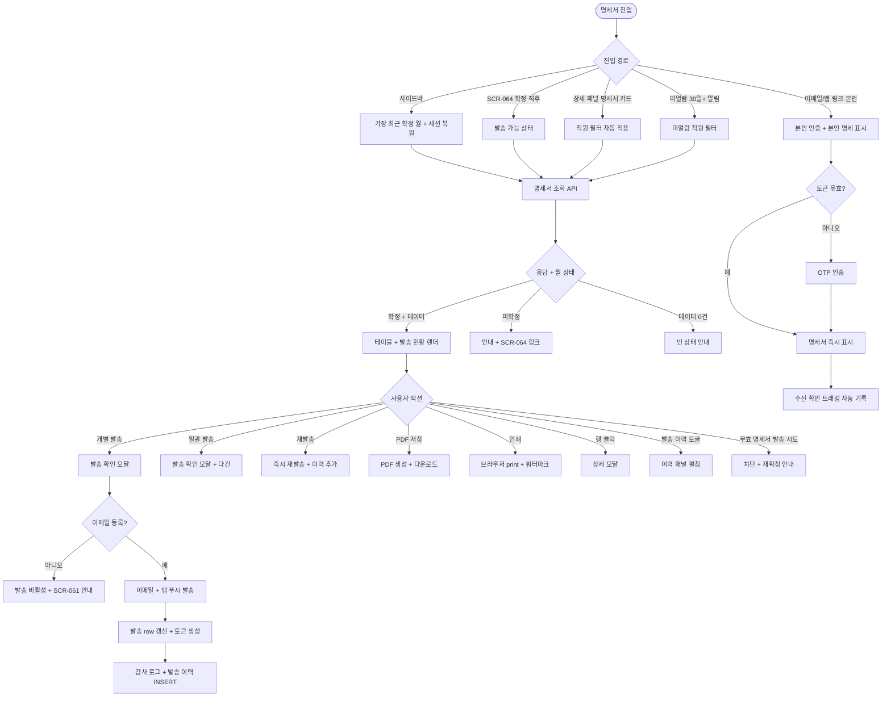

# SCR-065 급여 명세서 페이지

## 1. 화면 메타 정보

이 문서는 급여 명세서 페이지에 대한 자기완결형 요구사항 정의서입니다. 다른 문서를 함께 보지 않아도 이 한 장만으로 명세서 조회·발송·재발송·인쇄·PDF 저장에 들어가는 모든 영역, 모든 권한, 모든 예외 처리, 그리고 이 화면을 지탱하는 5년 보존·법정 보존·본인 인증·수신 트래킹 정책까지 전부 이해하고 구현할 수 있도록 작성합니다.

| 항목 | 값 |
|---|---|
| 작성일 | 2026-05-22 |
| 버전 | v1.0 |
| 상태 | 최신 통합본 반영 (정합화 완료) |
| 도메인 | D07 직원관리 |
| 화면 ID | SCR-065 |
| 화면명 | 급여 명세서 |
| 화면 유형 | 조회/발송 화면 |
| 라우트 (URL) | `/payroll/statements` |
| 플랫폼 | 데스크톱(기본), 태블릿, 모바일(카드 리스트 풀스크린), 직원 본인 모바일 링크 |
| 우선순위 | P0 (출시 필수) |
| 기능코드 | PAY-STF-03 (급여 명세서) |
| 계약코드 | PAY-STF-03 |
| 계약 상태 | 계약 범위 본기능 |
| 부모 기능 prefix | PAY-STF |
| Lv1 코드 | PAY-STF-03 |
| Lv2 / Lv3 세분화 | PAY-STF-03-01 ~ PAY-STF-03-13 (조회 기간·직원 필터·명세서 목록·상세 모달·개별 발송·일괄 발송·재발송·발송 완료 표시·인쇄 PDF·본인 모드·미확정 안내·발송 이력·무효 명세서) |
| 연계 화면 | SCR-060 직원목록, SCR-061 직원등록수정, SCR-064 급여관리, SCR-072 자동알림, SCR-097 감사로그, NFR-19 알림센터 |
| 호출 다이얼로그 | 내부 발송 확인 모달 (별도 DLG ID 미부여) |

## 2. 화면 개요와 목적

급여 명세서 페이지는 PAY-STF-02 급여 관리(SCR-064)에서 확정된 급여 명세서를 조회하고 직원에게 발송하는 화면입니다. 직원 본인은 본인의 월별 급여 명세서를 확인할 수 있으며, 관리자는 전체 직원의 명세서를 조회하고 개별 또는 일괄 발송할 수 있습니다. 발송 채널은 이메일과 앱 알림(동시 발송이 원칙)이며, 인쇄·PDF 저장도 지원합니다. 명세서는 PAY-STF-02에서 확정된 데이터를 기반으로 자동 생성되며, 회사·세무법령에 따라 5년 이상 보존 의무가 있어 영구 보존을 원칙으로 합니다.

이 화면이 다루는 운영 흐름은 다음과 같습니다. Owner(지점장)은 월말 급여 확정 직후 전체 직원에게 일괄 발송을 진행해 이메일과 앱 알림을 동시에 전송합니다. 직원이 명세서를 못 받았다고 문의하면 매니저가 [재발송] 버튼으로 즉시 재전송하며, 발송 이력에 추가 기록이 누적됩니다. 매니저는 PDF 저장으로 인사 파일 보관 또는 노무사 제출 자료를 만들고, 트레이너 본인은 모바일에서 이메일 링크로 본인 명세서를 조회하고 직접 PDF로 저장합니다. 퇴사 직원은 퇴사 후에도 5년간 본인 이메일 링크로 명세서를 조회할 수 있으며, 이는 직원 권리 보호와 법령 준수 목적입니다.

확정 취소(SCR-064에서)가 발생하면 발송된 명세서가 자동 "무효" 배지로 전환되고 직원에게 재발송 안내가 발송됩니다. 재확정 시 무효 명세서는 보존되고 새 명세서가 별도 생성됩니다. 발송 실패(이메일 반송 등)는 자동 재시도 3회를 거친 뒤 매니저에게 알림이 발송됩니다. 이메일 미등록 직원은 발송이 비활성화되며, 직원 정보 수정(SCR-061)으로 이메일을 등록한 뒤에 발송할 수 있습니다. 수신 확인 트래킹은 이메일·앱 링크 열람 시 자동 기록되며, 미열람 30일+ 직원은 매니저 대시보드에 알림으로 표시됩니다.

따라서 이 화면은 단순한 명세서 표가 아니라, 발송 채널 관리·재발송·법정 보존·본인 인증·수신 트래킹·무효 처리까지 모두 다루는 운영 화면입니다.

## 3. 진입 경로와 인접 화면

이 화면에 진입하는 경로는 다음과 같습니다.

첫 번째 경로는 사이드바입니다. 좌측 사이드바의 "직원 관리 > 급여 명세서" 항목을 클릭하면 `/payroll/statements`로 진입합니다. 기본값은 가장 최근 확정된 월·자기 지점이며, 직전 사용 상태(월·필터)는 세션 스토리지에 5분 TTL로 저장되어 자동 복원됩니다.

두 번째 경로는 SCR-064 급여 관리에서의 자동 안내입니다. 급여 확정 완료 직후 "명세서를 발송하시겠습니까?" 안내가 표시되고, 확인을 누르면 이 화면으로 이동하면서 발송 가능 상태가 됩니다.

세 번째 경로는 직원 상세 패널의 급여 명세서 카드 또는 헤더의 [명세서 조회] 액션입니다. SCR-060 상세 패널에서 특정 직원의 명세서로 곧장 이동하면 그 직원이 필터로 자동 적용된 상태로 진입합니다.

네 번째 경로는 직원 본인의 이메일·앱 푸시 링크 클릭입니다. 매니저+가 발송한 이메일이나 앱 알림에 포함된 본인 명세서 링크를 클릭하면 본인 인증(자동 로그인 토큰 또는 OTP)을 거쳐 본인 명세서가 직접 열립니다. 24시간 유효 토큰이며, 퇴사 직원의 경우 5년 유효 토큰이 발급됩니다.

다섯 번째 경로는 알림 센터(NFR-19)의 수신 미확인 30일+ 알림 클릭입니다. 매니저+에게 발송되는 알림을 누르면 미열람 직원이 필터로 자동 적용된 상태로 진입합니다.

이 화면에서 빠져나가는 인접 화면으로는, 확정·확정 취소·재확정이 발생하는 SCR-064, 이메일 미등록 직원의 정보 수정이 필요할 때 가는 SCR-061, 그리고 모든 발송·재발송·무효·PDF 저장 이벤트가 기록되는 감사 로그(SCR-097)가 있습니다. 외부 세무 시스템은 직원 본인이 PDF를 직접 다운로드해 전달하는 방식으로 연계됩니다.

## 4. 레이아웃과 UI 구성

화면은 위에서 아래로 헤더 → 필터 바 → 명세서 목록 테이블 → 발송 이력 패널(선택) 순으로 배치되는 세로형 레이아웃입니다. 데스크톱·태블릿에서는 본문이 가로 100%로 펼쳐지고, 모바일에서는 테이블이 카드 리스트로 자동 전환됩니다. 직원 본인이 모바일 링크로 진입한 경우 본인 명세서가 풀스크린 카드 형태로 즉시 표시됩니다.

가장 위에는 페이지 헤더가 있습니다. 좌측에는 "급여 명세서" 페이지 타이틀과 함께 현재 조회 지점(또는 "전체 지점(통합)") 배지가 표시되고, 우측 끝에는 [일괄 발송] 버튼과 [PDF 일괄 저장] 버튼이 일렬로 놓입니다. 두 버튼은 매니저+ 권한자에게만 보입니다.

헤더 아래에는 조회 기간 선택과 필터 바가 있습니다. 조회 월 드롭다운은 최근 확정된 12개월 목록을 표시하며, 기본값은 가장 최근 확정된 월입니다. 미확정 월을 선택하면 "급여 미확정" 안내가 표시되고 SCR-064 진입 링크가 제공됩니다. 직원 필터(단일 또는 전체), 직무 보조 필터, 본사 통합 모드 한정 소속 지점 필터, 발송 상태 필터(미발송·발송완료·무효 3종)가 배치됩니다.

필터 바 아래에는 명세서 목록 테이블이 있습니다. 컬럼은 좌측부터 선택 체크박스, 직원명, 역할(직무 배지), 지급 월(YYYY-MM), 기본급, 실지급액(강조 표시), 발송 상태(미발송·발송완료·무효 3종 배지), 발송 일시(마지막 발송 일시), 수신 확인(직원 열람 여부 + 일시), 액션(발송·재발송·PDF·인쇄) 순서로 배치됩니다. 본사 통합 모드에서는 소속 지점 컬럼이 추가됩니다.

발송 상태 배지는 미발송=warning(주황), 발송완료=success(녹색), 무효=danger(빨강) 톤으로 분기됩니다. 수신 확인은 열람 시 체크 아이콘과 열람 일시가 표시되고, 미열람은 회색 점으로 표시됩니다. 30일+ 미열람 직원은 노랑 강조 톤으로 표시되어 운영자의 주의를 끕니다.

각 행 우측의 액션은 발송 상태에 따라 동적으로 변합니다. 미발송 행은 [발송] / [PDF] / [인쇄], 발송완료 행은 [재발송] / [PDF] / [인쇄] / [발송 이력], 무효 행은 [PDF] / [인쇄] / [발송 이력]이 노출됩니다. 무효 행은 행 배경이 옅은 회색 톤으로 처리되며 "무효" 라벨이 강조됩니다.

행을 클릭하면 명세서 상세 모달이 열립니다. 모달에는 회사 정보(지점명·사업자등록번호·대표자), 직원 정보(이름·직무·입사일·재직 기간), 지급 월, 기본급(큰 숫자), 수당 상세(항목별 분리 - 식대·교통비·성과·수업), 공제 상세(항목별 분리 - 4대 보험·소득세·지각·기타), 수수료(트레이너 수업 건수 × 단가), 실지급액(강조 표시), 계좌 정보(매니저는 마스킹 `****-1234`, 본인은 전체 표시) 항목이 펼쳐집니다.

상세 모달 하단에는 [발송] / [재발송] / [PDF 저장] / [인쇄] / [닫기] 버튼이 권한과 상태에 따라 노출됩니다.

테이블 아래 (선택 사항)에는 발송 이력 패널이 있습니다. 매니저+ 권한자가 [발송 이력 보기] 토글을 켜면 펼쳐지며, 발송 일시·수신자·채널(이메일/앱)·상태(성공/실패)·재발송 횟수가 누적 기록으로 표시됩니다.

본사 통합 모드에서는 페이지 하단에 지점별 발송 현황 카드 그리드가 추가로 표시됩니다. 지점별 미발송 인원·발송 완료 인원·미열람 인원이 비교되어, 본사 권한자가 지점별 발송 현황을 한눈에 파악할 수 있습니다.

## 5. 발송 채널과 본인 인증

발송 채널 정책은 이메일과 앱 알림 동시 발송이 원칙입니다. 매니저+가 [발송] 버튼을 누르면 직원의 등록된 이메일 주소로 이메일이 발송되고, 동시에 앱 알림 푸시도 전송됩니다. 앱 미가입 직원은 이메일만 발송되며 "앱 미가입" 안내가 표시됩니다.

본인 인증 정책은 모바일 링크 클릭 시 자동 로그인 토큰 또는 OTP 인증이 적용됩니다. 토큰은 24시간 유효하며, 만료 시 OTP 인증으로 재인증해야 합니다. 퇴사 직원의 경우 5년 유효 토큰이 발급되어 퇴사 후에도 본인 명세서를 조회할 수 있습니다.

수신 확인 트래킹은 이메일·앱 링크 열람 시 자동으로 기록됩니다. 직원이 링크를 클릭해 명세서를 열면 그 시점이 수신 확인 일시로 저장되고, 테이블의 수신 확인 컬럼에 즉시 반영됩니다. 30일+ 미열람 직원은 매주 월요일 매니저 대시보드에 알림으로 표시됩니다.

발송 실패 자동 재시도 정책은 이메일 반송(잘못된 주소·메일함 가득 참 등) 시 3회 자동 재시도를 수행합니다. 3회 모두 실패하면 매니저+에게 NFR-19 알림이 발송되어, 매니저가 직원 정보의 이메일 주소를 점검하고 수정 후 수동 재발송할 수 있도록 합니다. 앱 푸시 실패는 이메일만 발송하는 방식으로 자동 폴백됩니다.

## 6. 버튼·아이콘·링크 액션 전체 정의

페이지 헤더의 [일괄 발송] 버튼은 매니저+ 권한자에게만 보이며, 체크박스로 선택된 직원 또는 미발송 직원 전체를 대상으로 발송 확인 모달을 호출합니다. 확인 시 일괄 발송 큐로 비동기 처리되며, 진행 상태가 토스트로 표시됩니다.

[PDF 일괄 저장] 버튼은 선택된 직원의 명세서를 한 번에 PDF로 다운로드합니다. 파일은 ZIP으로 묶여 내려받아지며, 각 파일명은 `yyyymm_직원명_급여명세서.pdf` 규칙을 따릅니다. 대용량(50명+)은 백그라운드 잡으로 전환됩니다.

조회 월 드롭다운은 최근 확정된 12개월 목록을 표시하며, 미확정 월은 회색 톤으로 비활성화 표시됩니다. 선택 시 즉시 재조회됩니다.

발송 상태 필터(미발송·발송완료·무효)는 멀티 선택이 가능하며, 적용 시 테이블이 즉시 좁혀집니다.

테이블 행의 [발송] 버튼(미발송 행)은 그 직원 한 명을 대상으로 발송 확인 모달을 호출하고, 확인 시 이메일 + 앱 알림이 발송됩니다. 발송 직후 행이 "발송완료" 배지로 갱신되고 발송 일시가 기록됩니다.

[재발송] 버튼(발송완료 행)은 즉시 재발송을 시작하며, 별도 확인 없이 발송 이력에 횟수가 추가됩니다. 재발송 직후 "재발송 완료" 토스트가 표시됩니다. 횟수 제한은 없으며, 직원이 명세서를 받지 못했다고 문의할 때 즉시 대응할 수 있습니다.

[PDF] 버튼은 해당 행의 명세서를 PDF로 즉시 다운로드합니다. 파일명은 `yyyymm_직원명_급여명세서.pdf` 규칙입니다. 본인은 본인 명세서만 PDF 다운로드 가능하며, 매니저+는 모든 직원의 PDF를 다운로드할 수 있습니다.

[인쇄] 버튼은 브라우저 print 다이얼로그를 호출해 명세서를 출력합니다. 인쇄 미리보기는 PDF와 동일한 양식이며, 인쇄 시 회사 워터마크와 발급 일시가 자동 포함됩니다.

[발송 이력] 버튼은 발송 이력 미니 패널을 호출해 해당 명세서의 발송·재발송 이력을 시간순으로 표시합니다. 매니저+에게만 보입니다.

상세 모달의 행 클릭은 모달을 닫고, 모달 내부의 [발송]·[재발송]·[PDF]·[인쇄] 버튼은 테이블의 행 액션과 동일하게 동작합니다.

본인 모드에서는 [일괄 발송]·[PDF 일괄 저장]·[발송 이력] 버튼이 모두 hidden되며, 본인 명세서의 [PDF]·[인쇄] 액션만 가능합니다.

이메일 미등록 직원의 행에는 [발송] 버튼이 비활성화되고 "이메일 미등록" 라벨이 표시됩니다. 클릭 시 SCR-061 진입 링크가 토스트로 안내됩니다.

무효 명세서 행의 [발송] 시도 시 차단되며 "무효 명세서는 발송할 수 없습니다. 재확정이 필요합니다" 안내가 표시됩니다.

모든 버튼은 클릭 후 응답이 돌아오기 전까지 비활성화되어 중복 요청이 차단됩니다.

## 7. 호출되는 모달 동작

### 7-1. 발송 확인 모달 (내부 모달)

[발송] 또는 [일괄 발송] 버튼 클릭 시 호출됩니다. 모달 상단에는 "급여 명세서를 발송하시겠습니까?" 제목이 표시되고, 본문에는 대상 직원 수와 발송 채널(이메일 + 앱)이 표시됩니다. 이메일 미등록 직원이 포함된 경우 "{인원}명의 이메일이 등록되지 않아 제외됩니다" 안내가 추가됩니다.

[발송] 버튼은 강조 색으로 표시되며, 클릭 시 발송 큐로 비동기 처리됩니다. 처리 중 버튼은 로딩 상태로 전환되고 진행 토스트 "발송 중입니다"가 표시됩니다. 완료 시 "n명에게 발송했어요" 성공 토스트가 표시됩니다. 일괄 모드에서 부분 실패가 발생하면 결과 카드 "성공 N / 실패 M"이 표시되고 실패 직원 명단이 사유(이메일 반송·앱 푸시 실패 등)와 함께 노출됩니다. [취소] 버튼은 변경 없이 모달을 닫습니다.

### 7-2. 명세서 상세 모달

테이블 행 클릭 시 호출됩니다. 모달 본문에는 회사 정보·직원 정보·기본급·수당 상세·공제 상세·수수료·실지급액·계좌 정보가 펼쳐집니다. 매니저+는 계좌 정보가 마스킹(`****-1234`)으로 표시되고, 본인은 전체 표시됩니다.

모달 하단에는 [발송] / [재발송] / [PDF 저장] / [인쇄] / [닫기] 버튼이 권한과 상태에 따라 노출됩니다. 본인 모드에서는 [발송]·[재발송]·[발송 이력] 버튼이 hidden되며, [PDF 저장]·[인쇄]·[닫기]만 노출됩니다.

### 7-3. 본인 인증 모달 (모바일 링크 진입 시)

본인이 이메일·앱 푸시 링크를 클릭해 진입할 때 자동 로그인 토큰이 만료된 경우 본인 인증 모달이 호출됩니다. 휴대폰 번호 또는 이메일로 OTP를 받아 인증하면 명세서가 표시됩니다. 인증 실패 시 로그인 페이지로 리디렉션됩니다.

### 7-4. 무효 명세서 발송 차단 모달

무효 명세서를 발송하려고 시도하면 차단 모달이 호출됩니다. "이 명세서는 무효 상태입니다. 발송하려면 SCR-064 급여 관리에서 재확정이 필요합니다" 안내와 함께 [급여 관리로 이동] / [닫기] 버튼이 있습니다.

## 8. 토스트와 확인 팝업과 알럿

성공 토스트는 우측 상단에 녹색 계열로 5초 동안 표시됩니다. "n명에게 발송했어요", "재발송이 완료되었어요", "PDF 다운로드가 시작되었어요", "인쇄 미리보기가 열렸어요"가 대표적입니다.

실패 토스트는 우측 상단에 빨강 계열로 표시됩니다. "이메일 발송에 실패했습니다", "이메일 미등록 직원은 발송할 수 없습니다", "무효 명세서는 발송할 수 없습니다", "다른 사용자가 발송 중입니다"가 대표적입니다.

부분 결과 알림은 일괄 발송에서 부분 실패가 발생했을 때 결과 카드 "성공 N / 실패 M"으로 표시됩니다. 실패 사유별 분류(이메일 반송·앱 푸시 실패·이메일 미등록 등)와 개별 재시도 액션이 함께 제공됩니다.

확인 팝업은 발송 확인, 무효 명세서 발송 차단, 본인 인증 같은 경우 별도 모달로 호출됩니다.

알럿은 권한 없는 계정이 직접 URL로 접근했을 때 표시됩니다. 본인 모드 자동 진입(직원 본인) 또는 대시보드 자동 이동(readonly)이 일어납니다.

미열람 30일+ 알림은 매주 월요일 매니저+에게 NFR-19로 발송되어 직원 연락 또는 재발송을 유도합니다.

## 9. 데이터 흐름과 외부 연동

화면 진입 시점에는 명세서 조회 API(`GET /api/payslip/:month`)가 호출됩니다. 요청에는 조회 월·직원 필터·발송 상태 필터가 쿼리 파라미터로 들어가며, 응답으로는 명세서 row 배열·요약 카드(있는 경우)·발송 현황이 함께 내려옵니다.

명세서는 PAY-STF-02 확정 시점에 자동 생성됩니다. SCR-064에서 [확정] 또는 [일괄 확정] 트랜잭션이 완료되면 직원별 명세서 row가 INSERT되어 SCR-065에서 조회 가능해집니다.

개별 발송은 `POST /api/payslip/:id/send`, 일괄 발송은 `POST /api/payslip/bulk-send`로 처리됩니다. 발송 트랜잭션은 다음 작업을 수행합니다.

1. 이메일 발송 큐에 적재(직원 이메일 + 명세서 첨부).
2. 앱 푸시 큐에 적재(앱 가입 직원).
3. 본인 명세서 링크 토큰 생성(24시간 유효, 퇴사 직원은 5년 유효).
4. 발송 row의 발송 상태를 "발송완료"로 변경하고 발송 일시 기록.
5. 발송 이력 row에 INSERT(actor·직원·채널·상태·재발송 횟수).
6. 감사 로그(SCR-097)에 INSERT.

재발송도 동일한 엔드포인트로 처리되며, 발송 이력 row가 누적 INSERT됩니다. 횟수 제한은 없습니다.

이메일 발송 실패(반송) 시 자동 재시도 3회 정책이 적용됩니다. 3회 실패 후 매니저+에게 NFR-19 알림이 발송되어 수동 점검을 유도합니다. 앱 푸시 실패는 이메일만 발송하는 폴백 처리됩니다.

수신 확인 트래킹은 `POST /api/payslip/:id/track`으로 처리됩니다. 직원이 이메일·앱 링크를 클릭해 명세서를 열면 자동으로 이 API가 호출되어 수신 확인 일시가 기록됩니다. 미열람 30일+ 직원은 매주 월요일 배치가 조회해 매니저 대시보드에 알림을 발송합니다.

PDF 다운로드는 `GET /api/payslip/:id/pdf`로 처리됩니다. 본인은 본인 명세서만 다운로드 가능하며, 매니저+는 모든 직원의 PDF를 다운로드할 수 있습니다. PDF는 회사 로고·워터마크·발급 일시가 포함된 정식 양식으로 생성됩니다. 파일명은 `yyyymm_직원명_급여명세서.pdf` 규칙을 따릅니다.

본인 명세서 조회는 `GET /api/payslip/me/history`로 본인의 전체 명세서 이력을 조회할 수 있습니다. 5년 이력이 보존되며, 퇴사 직원은 이메일 링크로 같은 엔드포인트에 접근 가능합니다.

PAY-STF-02 확정 취소 시 무효 자동 처리 트리거가 동작합니다. SCR-064에서 [확정 취소] 실행 시 해당 월의 모든 발송 명세서가 자동으로 "무효" 배지로 전환되고 직원에게 NFR-19 재발송 안내가 발송됩니다.

재확정 시 새 명세서 자동 생성·발송 안내도 트리거됩니다. SCR-064에서 재확정 시 무효 명세서는 보존되고 새 명세서 row가 INSERT되며, 매니저에게 "재발송이 필요합니다" 안내가 표시됩니다.

5년 보존 정책은 매월 1일 배치가 동작합니다. 5년 초과 명세서는 익명화(직원명·계좌 정보 마스킹) 또는 아카이브(별도 저장소 이동)되며, 정책에 따라 처리됩니다. 법령 준수 목적이며, 5년 미만 데이터는 절대 삭제되지 않습니다.

본사 슈퍼관리자 통합 모드는 `GET /api/payslip/:month?branch=all`로 전 지점 명세서를 통합 조회하며, 지점별 발송 현황이 함께 응답됩니다.

화면에서 호출하는 주요 API는 다음과 같습니다. 명세서 조회 `GET /api/payslip/:month`, 개별 발송 `POST /api/payslip/:id/send`, 일괄 발송 `POST /api/payslip/bulk-send`, PDF 다운로드 `GET /api/payslip/:id/pdf`, 발송 이력 `GET /api/payslip/:id/audit`, 수신 트래킹 `POST /api/payslip/:id/track`, 본인 이력 `GET /api/payslip/me/history`.

## 10. 화면 상태와 예외 처리

이 화면은 다음 상태들을 가집니다.

로딩 중 상태는 데이터를 불러오는 동안 테이블에 스켈레톤이 표시됩니다.

정상 목록 상태는 확정된 명세서 데이터가 한 건 이상 표시되는 일반 상태입니다.

미확정 상태는 해당 월 급여가 미확정이면 "급여 미확정" 안내와 함께 SCR-064 진입 링크가 표시됩니다. 발송 버튼은 모두 비활성화됩니다.

발송 완료 상태는 발송된 명세서 행에 "발송완료" 배지와 발송 일시가 표시됩니다.

발송 중 상태는 발송 또는 일괄 발송 처리 중으로, 발송 버튼이 로딩 스피너로 전환되고 진행 토스트가 표시됩니다.

발송 실패 상태는 이메일 반송 등으로 실패한 경우 토스트 안내와 함께 [재시도] 액션이 노출됩니다.

무효 명세서 상태는 PAY-STF-02 확정 취소로 인해 무효 처리된 명세서로, "무효" 배지와 함께 행 배경이 옅은 회색으로 처리됩니다. 발송 시도 시 차단됩니다.

본인 모드 상태는 직원 본인 진입 시 자동 활성화됩니다. 본인 명세만 표시되며, [PDF]·[인쇄] 액션만 가능합니다. 5년 이력 조회가 가능합니다.

이메일 미등록 상태는 발송 비활성 + 안내가 표시되며, SCR-061 진입 링크가 토스트로 제공됩니다.

본사 통합 모드 상태는 본사 권한자에 한해 활성화되며, 지점별 발송 현황 카드가 페이지 하단에 추가 표시됩니다.

모바일 풀스크린 상태는 테이블이 카드 리스트로 자동 전환되며, 직원 본인 링크 진입 시 본인 명세서가 풀스크린 카드로 즉시 표시됩니다.

수신 확인 미열람 30일+ 상태는 매니저 알림이 표시되며, 해당 직원 행이 노랑 강조 톤으로 표시됩니다.

예외 케이스별 처리는 다음과 같습니다. 미확정 월 조회 시 안내 + 발송 비활성, 데이터 0건 시 빈 상태 안내, 이미 발송된 명세서 [발송] 클릭 시 재발송 모드 + 이력 추가, 이메일 미등록은 발송 비활성 + SCR-061 안내, 앱 미가입은 이메일만 발송, 이메일 발송 실패는 자동 재시도 3회 + 매니저 알림, 앱 푸시 실패는 이메일만 발송 폴백, 확정 취소 시 무효 자동 + 직원 알림, 무효 명세서 발송 시도는 차단 + "재확정 필요" 안내, 본인 인증 실패는 로그인 리디렉션, 퇴사 직원 5년 이력은 이메일 링크 + OTP 인증, 5년 초과는 익명화/아카이브, PDF 권한 부족(타인)은 본인만 가능 + 매니저+ 만 타인 PDF, 일괄 발송 부분 실패는 결과 카드 + 실패 명단, 수신 확인 30일+ 미열람은 매니저 알림, 본사 통합 권한 부족은 토글 hidden, 계좌 마스킹은 매니저는 마스킹/본인은 전체, 모바일 풀스크린은 카드 리스트, 동시 발송 충돌은 "다른 사용자가 발송 중" 모달, 본인 직접 발송 시도는 권한 안내가 각각 처리됩니다.

## 11. 권한별 처리

본사 superAdmin·primary는 전 지점 명세서 통합 조회·발송 현황 점검이 가능합니다. 발송·재발송 액션도 모두 가능합니다.

Owner(지점장)·매니저(manager)는 소속 지점 전체 직원 명세서를 조회하고 발송·재발송·PDF 저장·인쇄·발송 이력 조회가 모두 가능합니다.

직원 본인은 본인 명세서만 조회·인쇄·PDF 저장 가능하며, 5년 이력 조회가 가능합니다. 직접 발송은 불가하며, 발송은 매니저+ 권한자가 진행합니다.

FC·트레이너·스태프·프런트는 본인 명세서만 조회·인쇄·PDF 저장이 가능하며, 동료 명세서에는 접근할 수 없습니다.

readonly는 이 화면 자체에 접근할 수 없습니다.

권한이 부족해 액션이 차단된 경우의 사용자 경험은 단계별로 일관됩니다. 1차 진입점에서는 메뉴가 hidden되고, 화면 내부의 권한 차단은 백엔드 응답이 403이 되어 토스트로 안내됩니다. 모든 권한 차단 이벤트는 감사 로그에 기록됩니다.

## 12. 메인 흐름

급여 명세서의 핵심 동작 흐름을 다이어그램으로 표현합니다.



## 13. 에러와 예외 흐름

에러와 예외 상황에서의 분기를 별도 흐름으로 표현합니다.

```mermaid
flowchart TD
    A([명세서 액션]) --> B{에러 종류}
    B -->|미확정 월| C[안내 + 발송 비활성 + SCR-064 링크]
    B -->|데이터 0건| D[빈 상태 안내]
    B -->|이미 발송 [발송] 클릭| E[재발송 모드 + 이력 추가]
    B -->|이메일 미등록| F[발송 비활성 + SCR-061 안내]
    B -->|앱 미가입| G[이메일만 발송 + 안내]
    B -->|이메일 반송| H[자동 재시도 3회]
    H --> I{성공?}
    I -->|예| J[정상 발송]
    I -->|아니오| K[매니저 알림 NFR-19 + 수동 점검]
    B -->|앱 푸시 실패| L[이메일만 발송 폴백]
    B -->|확정 취소 자동 무효| M["무효" 배지 + 직원 재발송 안내]
    B -->|무효 명세서 발송 시도| N[차단 + 재확정 안내]
    B -->|본인 인증 실패| O[로그인 리디렉션 + OTP]
    B -->|퇴사 직원 5년 이력| P[이메일 링크 + OTP 인증]
    B -->|5년 초과 데이터| Q[익명화 또는 아카이브]
    B -->|PDF 권한 부족 타인| R[본인만 + 매니저+ 만 타인]
    B -->|일괄 발송 부분 실패| S[결과 카드 + 실패 리포트]
    B -->|수신 확인 30일+ 미열람| T[매니저 대시보드 알림]
    B -->|본사 통합 권한 부족| U[토글 hidden]
    B -->|계좌 정보| V[매니저 마스킹 / 본인 전체]
    B -->|모바일 풀스크린| W[카드 리스트 자동 전환]
    B -->|동시 발송 충돌| X["다른 사용자 발송 중" 모달]
    B -->|본인 직접 발송 시도| Y[권한 안내 + 매니저+ 발송]
    B -->|잘못된 계좌 정보| Z[STF-EXT-01 정보 수정 안내]
    B -->|네트워크 5xx| AA[토스트 + 자동 재시도 1회]
```

## 14. 핵심 디자인 요청사항

이 화면이 운영자와 직원 모두에게 잘 작동하려면 다음 디자인 원칙이 시각적으로 명확히 드러나야 합니다.

발송 상태 배지는 3종이 색상으로 즉시 구분됩니다. 미발송=warning(주황), 발송완료=success(녹색), 무효=danger(빨강) 톤으로 강하게 분리되어 멀리서 봐도 발송 상태가 짐작됩니다. 무효 행은 행 배경이 옅은 회색 톤으로 처리되어 비활성 상태임이 시각적으로 드러납니다.

수신 확인 컬럼은 열람 시 체크 아이콘과 일시가 작은 글씨로 표시되고, 미열람은 회색 점으로 표시됩니다. 30일+ 미열람 직원은 노랑 강조 톤으로 행 전체가 표시되어 운영자의 주의를 끕니다.

실지급액 컬럼은 다른 숫자 컬럼보다 큰 폰트와 굵은 weight로 표시되어, 직원과 운영자 모두 가장 중요한 결과값을 한눈에 인지할 수 있습니다.

발송 이력 패널은 시간 역순으로 카드 리스트로 표시되며, 각 카드에는 채널 아이콘(이메일 아이콘, 앱 아이콘)과 상태 배지(성공/실패)가 함께 표시되어 어떤 채널로 어떻게 발송되었는지가 한눈에 드러납니다.

명세서 상세 모달은 실제 인쇄 양식과 유사한 디자인으로 표현됩니다. 회사 로고, 사업자등록번호, 발급 일시, 직원 정보, 항목별 금액, 실지급액 강조 표시가 정식 명세서 양식처럼 보여, 매니저와 직원 모두 신뢰감을 가질 수 있습니다.

계좌 정보 마스킹은 매니저 화면에서 `****-1234`처럼 일부만 표시되고, 본인 화면에서는 전체가 표시되어 권한 수준이 시각적으로 드러납니다.

본인 모바일 화면은 풀스크린 카드 형태로 표시되며, 카드 상단에 직원명·지급 월이 큰 폰트로, 본문에 항목별 금액이 정렬되어, 카드 하단에 실지급액이 강조되어 표시됩니다. [PDF 저장]·[인쇄] 버튼은 카드 하단 고정 배치됩니다.

본사 통합 모드 지점별 발송 현황 카드는 카드별로 지점명 라벨이 색상 배지로 표시되며, 미발송 인원이 0이 아닌 지점은 노랑 강조 톤으로 표시됩니다.

PDF·인쇄 미리보기는 회사 워터마크와 발급 일시가 자동 포함된 정식 양식으로 생성되어, 직원이 외부에 제출할 때 정식 문서로 인정받을 수 있게 합니다.

[일괄 발송] 버튼은 강조 색(파랑)으로 표시되고, 처리 중에는 진행 바와 함께 토스트가 표시되어 사용자가 진행 정도를 알 수 있습니다.

## 15. 운영 정책 (이 화면에 연결된 부분)

이 화면은 단순한 명세서 표가 아니라 발송 채널 관리·법정 보존·본인 인증·수신 트래킹·무효 처리까지 모두 다루는 운영 정책의 결합점입니다.

급여 확정 → 명세서 자동 생성 정책에 따라, PAY-STF-02 확정 완료 시점에만 명세서가 생성되어 이 화면에서 조회·발송이 가능합니다. 미확정 월의 명세서 조회는 차단되며, "급여 미확정" 안내와 함께 SCR-064 진입 링크가 제공됩니다.

발송 채널 정책은 이메일 + 앱 알림 동시 발송이 원칙입니다. 직원 정보(SCR-061)에 등록된 이메일과 앱 가입 상태가 자동 확인되어, 등록된 채널로 발송됩니다. 이메일 미등록 직원은 발송 자체가 비활성화되며, SCR-061에서 이메일을 등록한 뒤에야 발송할 수 있습니다.

재발송 정책은 횟수 제한 없이 허용됩니다. 직원이 명세서를 받지 못했다고 문의할 때 즉시 대응할 수 있으며, 재발송 시 발송 이력에 누적 기록이 추가되어 사후 추적이 가능합니다.

발송 실패 자동 재시도 정책은 이메일 반송 시 3회 자동 재시도를 수행합니다. 3회 모두 실패하면 매니저+에게 NFR-19 알림이 발송되어 수동 점검을 유도합니다. 앱 푸시 실패는 이메일만 발송하는 폴백 처리됩니다.

본인 인증 정책은 모바일 링크 클릭 시 자동 로그인 토큰 또는 OTP 인증이 적용됩니다. 토큰 24시간 유효, 만료 시 OTP 인증으로 재인증. 퇴사 직원은 5년 유효 토큰이 발급되어 퇴사 후에도 본인 명세서를 조회할 수 있습니다.

5년 보존 정책은 회사·세무법령에 따른 의무 사항입니다. 명세서·발송 이력 5년 보존이 기본이며, 영구 보존을 권장합니다. 퇴사 직원 본인은 이메일 링크로 5년간 조회 가능하며, 5년 초과 데이터는 익명화 또는 아카이브 처리됩니다.

법정 보존 의무 정책은 회사·세무법령에 따라 5년 이상 보존이 의무이며, 영구 보존이 권장됩니다. 어떤 권한도 5년 미만 데이터를 삭제할 수 없으며, 시스템 운영자의 별도 데이터베이스 작업이 필요합니다.

계좌 정보 마스킹 정책은 매니저+ 화면에서 `****-1234`로 일부만 표시되고, 본인 화면에서는 전체가 표시됩니다. 이는 매니저가 직원 계좌 정보를 무단으로 인지하지 못하도록 보호하는 정책이며, 명세서 발송 자체는 시스템이 자동으로 처리합니다.

수신 확인 트래킹 정책은 이메일·앱 링크 열람 시 자동으로 기록됩니다. 미열람 30일+ 직원은 매주 월요일 매니저 대시보드에 알림으로 표시되어 직원 연락 또는 재발송을 유도합니다.

확정 취소 → 명세서 자동 무효 정책은 PAY-STF-02 확정 취소 시 트리거됩니다. 해당 월의 모든 발송 명세서가 자동으로 "무효" 배지로 전환되고, 직원에게 NFR-19 재발송 안내가 발송됩니다. 무효 명세서 발송 시도는 차단되며, "재확정이 필요합니다" 안내가 표시됩니다.

재확정 시 새 명세서 생성 정책은 무효 명세서를 보존한 채 새 명세서를 별도 생성·발송합니다. 이는 무효 처리 이력을 보존해 사후 추적이 가능하도록 하기 위한 정책입니다.

명세서 항목 분리 정책은 회사 정보·직원 정보·기본급·수당 상세·공제 상세·수수료·실지급액·계좌 정보로 명확히 분리되어 표시됩니다. 직원이 명세서를 보고 어떤 항목이 어떻게 산출되었는지 쉽게 이해할 수 있게 합니다.

PDF 권한 정책은 본인은 본인 명세서만 PDF 다운로드 가능하며, 매니저+는 모든 직원의 PDF를 다운로드할 수 있습니다. 매니저+가 타인 PDF를 다운로드한 이벤트는 감사 로그에 기록됩니다.

발송 이력 조회 권한 정책은 매니저+만 발송 이력 조회가 가능합니다. 직원 본인은 본인 발송 이력만 조회할 수 있습니다.

본사 슈퍼관리자 통합 조회 정책은 전 지점 발송 현황을 매니저+에게 제공합니다. 지점별 미발송 인원·발송 완료 인원·미열람 인원이 카드로 비교 표시됩니다.

세무 신고 자료 정책은 직원이 PDF를 직접 다운로드해 외부 시스템(국세청 홈택스 등)에 입력하는 방식으로 연계됩니다. 시스템은 PDF 생성까지만 담당하며, 외부 신고는 직원 책임입니다.

감사 로그는 모든 발송·재발송·무효·조회(매니저)·PDF 저장(타인) 이벤트를 SCR-097에 비동기로 기록합니다. 기록 필드는 `actor_id`, `staff_id`, `month`, `channel`, `status`, `timestamp`이며, append-only로 영구 보존됩니다.

이상의 모든 정책은 이 화면을 구현하고 운영하는 사람이 별도 문서 없이 이 한 장만 보면 이해할 수 있도록 풀어 적었습니다. 정책이 바뀌면 이 문서가 함께 갱신되어야 하며, 코드 변경과 정책 변경은 항상 짝지어 진행됩니다.
