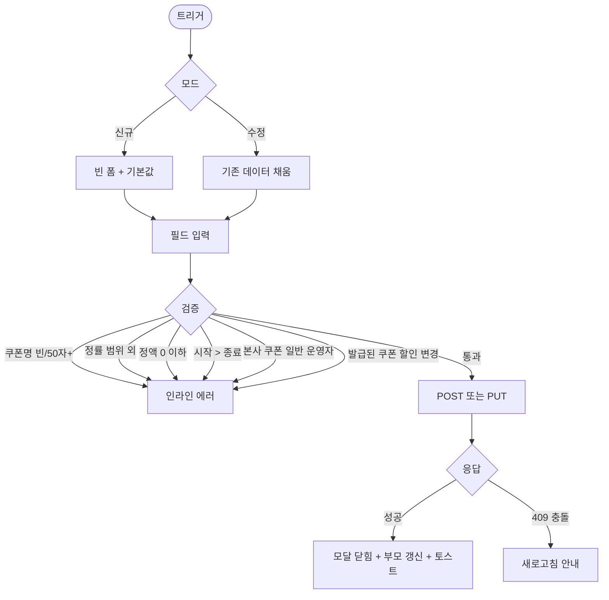

# DLG-073-001 쿠폰 생성/수정 다이얼로그

## 1. 다이얼로그 메타 정보

| 항목 | 값 |
|---|---|
| 작성일 | 2026-05-22 |
| 버전 | v1.0 |
| 상태 | 최신 통합본 반영 |
| 도메인 | D08 마케팅 |
| 다이얼로그 ID | DLG-073-001 |
| 다이얼로그명 | 쿠폰 생성/수정 |
| 부모 화면 | SCR-073 쿠폰관리 |
| 트리거 | 헤더 "+ 쿠폰 생성" 버튼 / 행 [수정] 버튼 |
| 기능코드 | MKT-03 |
| 모달 유형 | 입력 폼 (생성/수정 겸용) |
| 평균 분량 | 입력 필드 약 8개 + 검증 |

## 2. 다이얼로그 목적과 사용 맥락

쿠폰 생성/수정 다이얼로그는 새로운 할인 쿠폰을 생성하거나 기존 쿠폰 정보를 수정하는 모달입니다. 할인 유형과 금액, 유효 기간, 사용 조건 등 쿠폰의 핵심 항목을 설정합니다.

운영 시나리오: 신년 5,000원 환영 쿠폰 생성, 만료 회원 재등록 권유 10% 정률 쿠폰, VIP 한정 할인 쿠폰, PT 패키지 한정 쿠폰(적용 상품 제한), 한정 수량 100매 선착순 쿠폰.

호출 트리거는 SCR-073 페이지 헤더의 "+ 쿠폰 생성"(빈 폼) 또는 행 [수정] 버튼(데이터 채움).

## 3. 입력 필드 전체 정의

쿠폰명 필수, 1~50자 텍스트. 50자 초과 시 인라인 에러.

할인 유형 필수, 정액(원 차감) / 정률(% 할인) 라디오 버튼.

할인 값 필수. 정액은 0원 초과 정수(예: 5000), 정률은 1~100% 범위(예: 10). 0%/100% 초과 또는 0원 이하는 인라인 에러.

최소 구매 금액 선택. 쿠폰 사용 가능한 최소 결제 금액. 0원 이상 정수.

유효 기간 필수. 시작일 ≤ 종료일 검증. 시작 > 종료 시 인라인 에러.

발급 수량 제한 선택. 무제한 또는 N매 입력. 도달 시 발급 차단.

1인 사용 제한 필수. 1회 / N회 / 무제한 중 선택. 기본값 1회.

적용 상품 다중 선택. 전체 상품 또는 특정 상품(이용권/PT/필라테스/골프) 다중 체크박스.

활성 토글 필수. 활성 / 비활성. 기본값 활성.

## 4. 검증 흐름

저장 시 검증 순서:

쿠폰명 빈 값 또는 50자 초과 → "1~50자" 인라인 에러.

정률 0%/100% 초과 → "1~100% 범위" 인라인 에러.

정액 0원 이하 → "0원 초과" 인라인 에러.

유효 기간 시작 > 종료 → "시작일이 종료일보다 늦을 수 없습니다" 인라인 에러.

이미 발급된 쿠폰 수정 시 할인 금액/율 변경 → 차단 안내. 적용 상품 변경·유효 기간 연장 같은 일부 안전한 필드만 수정 가능.

본사 쿠폰(`hq_owned=true`) 수정 시 일반 운영자 권한 차단.

검증 통과 시 모달 로딩 → POST 또는 PUT API → 성공 시 모달 닫힘 + 부모 화면 갱신 + 토스트.

## 5. 부모 화면 변화

신규 생성 성공 시 새 쿠폰이 활성 상태로 목록 최상단에 추가 + "쿠폰을 등록했어요" 토스트.

수정 성공 시 해당 행이 갱신 + "쿠폰 정보를 수정했어요" 토스트.

본사 쿠폰은 행 좌상단 "본사" 배지 표시.

요약 카드의 전체 쿠폰 수가 즉시 갱신됩니다.

## 6. 권한별 동작

슈퍼관리자·본사: 본사 통합 쿠폰 등록 가능(`hq_owned=true`). 전 지점 쿠폰 수정.

센터장·매니저: 소속 지점 쿠폰 생성·수정.

FC: 부모 화면에서 "+ 쿠폰 생성" 및 [수정] 버튼 hidden. 다이얼로그 호출 차단.

트레이너·스태프·readonly: 부모 화면 자체 접근 차단.

## 7. 데이터 흐름

쿠폰 생성 `POST /api/coupons`.

쿠폰 수정 `PUT /api/coupons/:id`.

저장 시 SCR-097 감사 로그 INSERT.

본사 통합 쿠폰 동기화: 슈퍼관리자 등록 시 전 지점 즉시 노출.

## 8. 예외 처리

쿠폰명 50자 초과 / 정률 범위 외 / 정액 0 이하 / 시작 > 종료 / 본사 쿠폰 일반 운영자 수정 / 발급된 쿠폰 할인 변경 → 모두 인라인 에러 + 차단.

동시 편집 충돌(409) → 새로고침 안내.

네트워크 오류 → 자동 재시도 1회 + 사용자 대기.

## 9. 토스트와 확인 팝업

성공: "쿠폰을 등록했어요" / "쿠폰 정보를 수정했어요".

확인 팝업: 변경 사항 있는 모달 닫기 시 yes/no.

## 10. 사용 흐름

## 11. 디자인 요청사항

할인 유형 라디오 클릭 시 할인 값 입력 단위 자동 변경(정액 "원", 정률 "%").

유효 기간 입력은 날짜 범위 선택기.

적용 상품 다중 선택은 체크박스 목록 또는 태그형 선택 UI.

발급 수량 제한은 "무제한" 라디오 또는 숫자 입력 토글.

저장 버튼은 변경 사항 있을 때 강조 톤.

모바일은 풀스크린 자동 전환.

## 12. 운영 정책

할인 유형 2종: 정액(원 차감) / 정률(% 할인). 정액 0원 초과, 정률 1~100% 검증.

유효 기간: 시작일 ≤ 종료일. 만료 시 자동 "만료" 상태 전환.

발급 수량 제한: 무제한 또는 N매. 도달 시 발급 차단.

1인 사용 제한: 1회 / N회 / 무제한.

적용 상품 다중 선택: 전체 또는 특정 상품.

쿠폰명 1~50자. 동일 지점 내 중복 허용.

발급된 쿠폰의 할인 금액/율 변경 차단. 적용 상품·유효 기간 연장 등 일부 안전한 필드만 수정 가능.

본사 통합 쿠폰: 슈퍼관리자만 등록 가능(`hq_owned=true`). 지점에서는 발급만 가능.

감사 로그: 생성·수정 모두 SCR-097 기록.

권한별: 슈퍼관리자/센터장/매니저 가능. FC/트레이너/스태프/readonly 차단.
