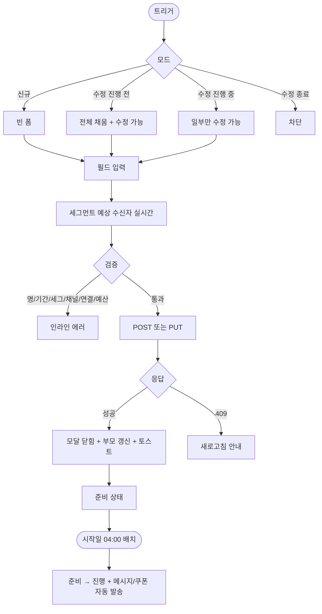

# DLG-076-001 캠페인 등록 다이얼로그

## 1. 다이얼로그 메타 정보

| 항목 | 값 |
|---|---|
| 작성일 | 2026-05-22 |
| 버전 | v1.0 |
| 상태 | 최신 통합본 반영 (퍼블리싱 완료 / 데이터 미연동) |
| 도메인 | D08 마케팅 |
| 다이얼로그 ID | DLG-076-001 |
| 다이얼로그명 | 캠페인 등록 |
| 부모 화면 | SCR-076 캠페인관리 |
| 트리거 | 헤더 "+ 캠페인 생성" 버튼 / 행 [수정] 버튼(수정 모드) |
| 기능코드 | MKT-06 |
| 모달 유형 | 입력 폼 (생성/수정 겸용) |
| 평균 분량 | 7개 입력 영역 + 검증 |

## 2. 다이얼로그 목적과 사용 맥락

캠페인 등록 다이얼로그는 새로운 마케팅 캠페인을 등록하거나 진행 전 캠페인을 수정하는 모달입니다. 캠페인 목표·대상 세그먼트·기간·사용 채널·메시지/쿠폰 연결·예산을 한 화면에서 설정해 캠페인 단위로 도달/클릭/전환/매출/ROI를 자동 집계할 수 있게 합니다.

운영 시나리오: 신년 신규 유치 캠페인(일반인 + SNS + 환영 쿠폰 + 등록 감사 알림), 만료 회원 재등록 권유(만료 회원 세그먼트 + 10% 할인 쿠폰 + 만료 D-7 알림톡), VIP 보상(VIP 세그먼트 + 마일리지 + 감사 메시지), 계절 이벤트.

호출 트리거는 SCR-076 헤더의 "+ 캠페인 생성" 버튼(빈 폼) 또는 행 [수정] 버튼(진행 전 캠페인만, 데이터 채움). 진행 중 캠페인 [수정]은 일부 필드만 활성, 종료 캠페인 [수정]은 불가.

## 3. 입력 필드 전체 정의

캠페인명 필수. 1~50자 텍스트. 50자 초과 시 인라인 에러.

캠페인 목표 라디오 5종: 신규 유치 / 재등록 유도 / 브랜드 인지도 / VIP 보상 / 기타.

대상 세그먼트 영역: MBR-EXT-04 다중 조건 빌더. 회원 등급(VIP/일반/신규), 이용권 상태(활성/만료/홀딩), 지역(시·구), 가입 기간(30일+), 마지막 방문일 범위 등 다중 조건 AND/OR 조합. 조건 변경 시 예상 수신자 수 실시간 표시. 세그먼트 0명이면 저장 차단.

캠페인 기간: 시작일/종료일 날짜 선택기. 시작일 ≤ 종료일 검증. 시작일 과거이면 즉시 활성 또는 차단(정책).

사용 채널 다중 체크박스: SMS / 카톡 / 푸시 / 쿠폰 / 이벤트. 다중 선택 가능. 최소 1개 필요.

메시지/쿠폰 연결: 채널 선택에 따라 동적으로 표시.
- 메시지(MKT-01): 메시지 템플릿 선택 또는 새 메시지 작성
- 쿠폰(MKT-03): 기존 쿠폰 선택 또는 새 쿠폰 생성 링크
- 이벤트(MKT-07 리퍼럴): 기존 리퍼럴 이벤트 선택
- AB 테스트(MKT-09): AB 테스트 연결 옵션

예산 입력: 금액 입력(천 단위 콤마 자동). 0 이하 차단. 예산 초과 시 발송 중단 옵션(`auto_pause_on_budget`) 토글.

UTM 파라미터 영역(선택): 외부 채널 추적용 utm_source / utm_medium / utm_campaign 입력. 외부 SNS·인터넷 광고에서 유입 분리 집계.

세그먼트 freeze 정책(선택 토글): 활성 시 시작 시점의 세그먼트 멤버로 고정. 비활성 시 진행 중 신규 추가 멤버에게도 발송.

모달 하단에는 "저장" 버튼(강조)과 "취소" 버튼.

## 4. 검증과 저장 흐름

저장 검증 순서:

캠페인명 빈/50자 초과 → 인라인 에러.

시작 > 종료 → "시작일이 종료일보다 늦을 수 없습니다" 인라인 에러.

세그먼트 0명 → "대상 회원이 없습니다" 안내 + 저장 차단.

채널 미선택 → "최소 1개 채널을 선택해주세요" 인라인 에러.

연결 자원 미선택(메시지/쿠폰/이벤트 모두 미연결) → "최소 1개 연결 필요" 인라인 에러.

예산 0 이하 → "0원 초과" 인라인 에러.

검증 통과 시 `POST /api/campaigns` (신규) 또는 `PUT /api/campaigns/:id` (수정) → 응답 받아 모달 닫힘 + 부모 화면 갱신 + "캠페인을 등록했어요" 토스트.

신규 등록은 준비 상태로 저장. 시작일 도래 시 자동 활성 배치(매일 04:00 + 시작일 00:00).

수정 모드:
- 진행 전 캠페인: 전체 필드 수정 가능
- 진행 중 캠페인: 대상 추가·메시지 추가만 가능. 기존 메시지/쿠폰 변경 차단
- 종료 캠페인: 수정 불가(모달 호출 자체 차단)

취소·ESC·배경 클릭은 변경 사항 있으면 yes/no 확인.

## 5. 권한별 동작

슈퍼관리자·본사: 본사 통합 캠페인 등록 가능(`hq_owned=true`). 전 지점 캠페인 수정.

센터장·매니저: 소속 지점 캠페인 생성·수정.

FC·트레이너·스태프·readonly: 부모 화면 접근 차단.

## 6. 데이터 흐름

캠페인 생성 `POST /api/campaigns`.

캠페인 수정 `PUT /api/campaigns/:id`.

세그먼트 예상 수신자 수 조회 `GET /api/segments/preview-count?conditions=...` (조건 변경 시 실시간).

저장 성공 시 SCR-097 감사 로그 INSERT.

본사 통합 캠페인 동기화: 슈퍼관리자 등록 시 전 지점 즉시 노출.

시작일 도래 시 자동 활성 배치(매일 04:00 + 시작일 00:00)로 준비 → 진행 전환 + 연결된 메시지·쿠폰 자동 발송 시작.

종료일 도래 시 자동 종료 배치로 진행 → 종료 + 결과 집계.

## 7. 예외 처리

캠페인명 50자+ → 인라인 에러.

시작 > 종료 → 인라인 에러.

세그먼트 0명 → 차단.

채널 미선택 → 인라인 에러.

연결 자원 미선택 → 인라인 에러.

예산 0 이하 → 인라인 에러.

진행 중 전체 수정 시도 → "일부만 수정 가능" 안내.

종료 캠페인 수정 시도 → 모달 호출 차단.

본사 vs 지점 충돌 → 본사 우선 또는 둘 다(정책).

동시 편집 충돌(409) → "다른 운영자 편집 중" 새로고침 안내.

네트워크 오류 → 자동 재시도 1회.

연결 쿠폰 만료 또는 메시지 삭제 → "연결 자원이 유효하지 않습니다" + 저장 차단.

## 8. 토스트와 확인 팝업

성공: "캠페인을 등록했어요" / "캠페인을 수정했어요" 녹색 5초.

실패: "권한이 없어요" / "대상 회원이 없습니다" / "연결 자원이 유효하지 않습니다" 빨강 톤.

확인 팝업: 변경 사항 있는 모달 닫기 시 yes/no.

본사 통합 모드 등록 시(슈퍼관리자) "전 지점에 적용됩니다" 추가 확인.

## 9. 사용 흐름

## 10. 디자인 요청사항

세그먼트 다중 조건 빌더가 시각적으로 강조되어야 합니다(가장 중요한 입력). 조건 추가/제거가 명확.

예상 수신자 수는 실시간으로 강조 표시(예: "예상 234명").

연결 자원 영역은 채널 선택에 따라 동적으로 표시. 각 자원(메시지/쿠폰/이벤트/AB) 옆에 "새로 만들기" 링크 제공.

예산 입력은 천 단위 콤마 자동 표시.

UTM 파라미터는 접힌 카드 형태(필요할 때만 펼침).

저장 버튼은 변경 사항 있을 때 강조 톤.

모바일 풀스크린.

## 11. 운영 정책

상태 3종: 준비 / 진행 / 종료.

진행 전 수정: 전체 가능. 진행 중: 일부만(대상 추가·메시지 추가, 기존 변경 제한). 종료: 수정 불가.

ROI 자동 계산: (캠페인 기간 매출 - 예산) / 예산 × 100. 매출은 UTM·쿠폰 매핑된 결제 합계. 5분 캐시.

세그먼트 정책: MBR-EXT-04 다중 조건. 0명이면 저장 차단.

세그먼트 freeze: 시작 후 멤버 변동 시 신규 발송 또는 시작 시점 고정(정책).

연결 자원: 메시지(MKT-01) / 쿠폰(MKT-03) / 이벤트(MKT-07) / AB(MKT-09). 다중 가능.

예산 관리: 비용 누적 추적. 초과 시 알림 + 발송 중단 옵션.

UTM 추적: 외부 채널 클릭 시 유입·전환·매출 분리 집계.

자동 발송: 시작일 활성 시 연결 자원 자동 발송. 잔여 캐시 부족 시 보류.

법정 시간/수신 거부/휴면 자동 제외: 모든 캠페인 발송에 적용.

가족 묶음 옵션(MBR-EXT-02): 그룹당 1명에게만 발송.

본사 통합 캠페인: 슈퍼관리자가 전 지점 일괄 등록(`hq_owned=true`). 지점에서 일부 조정.

캠페인명 1~50자. 목표 5종.

감사 로그: 등록·수정·삭제·종료·자동 활성 모두 SCR-097 기록.

권한: 슈퍼관리자/센터장/매니저. FC/트레이너/스태프/readonly 차단.
